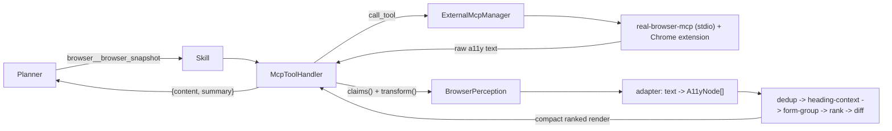

# Browser perception layer

A server-agnostic middleware that turns a raw accessibility-tree snapshot
(from *any* MCP browser server) into a compact, ranked, deduped,
form-grouped, heading-contextualized, change-diffed page model for the
background workflow planner.

The MCP browser server stays a swappable, dumb transport. All the
optimizations live in our code, behind one per-server **adapter** — so if
`real-browser-mcp` stops being maintained you point the config at a
different server and (if its snapshot format differs) add one adapter; the
dedup / ranking / memory / rendering pipeline is untouched.

> **Lane rule.** Like every external MCP tool, browser tools are surfaced
> to the **background-worker (workflow planner) lane only**, never the
> brain's fast tool list. Aiko browses via `start_workflow` → goal
> workflow → `browser__*` skills.

## Data flow



The hook lives in
[`McpToolHandler.start`](../app/core/tasks/handlers/mcp_tool.py): after the raw
tool content is flattened, it runs the handler's **tool-result middleware chain**
— the first middleware whose `claims()` matches the `(server_id, tool_name)` and
whose `transform()` returns non-`None` supplies the reshaped `content`/`summary`;
otherwise (any other tool, or an unparseable snapshot) the raw flatten path runs
exactly as before. The layer is **best-effort** — a middleware that raises is
skipped, so it never breaks browsing.

`BrowserPerception` is one such middleware. It reaches the handler two ways:

- **As a ToolPlugin (preferred).** The bundled `plugins/browser` plugin's
  `entry.py` builds a `BrowserPerception` from its own `config/` and registers it
  via `api.register_tool_result_middleware(...)`. This keeps the perception code
  decoupled from app core and configured next to the plugin. See
  [`docs/plugins.md`](plugins.md).
- **As the legacy global block (back-compat).** The `browser_perception` config
  block still builds a `BrowserPerception` wired straight into the handler. It is
  **skipped** when a plugin already registered a middleware for the same
  `server_id` (so a snapshot is never reshaped twice).

## Components (`app/core/browser/`)

| File | Role |
|------|------|
| [`accessibility.py`](../app/core/browser/accessibility.py) | `A11yNode` — the normalized, server-agnostic node schema everything downstream consumes. |
| [`adapters.py`](../app/core/browser/adapters.py) | The ONLY format-specific layer. `RealBrowserAdapter` (JSON or indented tree), `GenericIndentedTreeAdapter`, `get_adapter(name)`. `parse()` returns `None` on a format it can't read → raw passthrough. |
| [`grouping.py`](../app/core/browser/grouping.py) | `dedup_nodes`, `heading_context` (breadcrumb injection), `group_forms`. |
| [`ranking.py`](../app/core/browser/ranking.py) | Heuristic `interaction_likelihood` scorer (role / visibility / position / text / context), weight-tunable, capped. |
| [`page_state.py`](../app/core/browser/page_state.py) | `PageStateMemory` — in-process (ephemeral) LRU + `(role, name)`-keyed diff for "Changes since last snapshot". |
| [`rendering.py`](../app/core/browser/rendering.py) | Compact ranked text block + one-line summary for the planner blackboard. |
| [`perception.py`](../app/core/browser/perception.py) | `BrowserPerception` — `claims()` + `transform()` wiring adapter → pipeline → memory → render. |

## Ranking heuristics

Each interactive element gets a weighted, normalized `interaction_likelihood`:

- **semantic role** — submit buttons rank highest, then buttons / inputs / links, then secondary roles.
- **visibility** — hidden elements sink to near-zero; disabled elements are heavily penalized.
- **position** — earlier in document order ranks up; when the server reports a bbox, above-the-fold / leftward gets a mild lift.
- **text meaning** — accessible-name token salience + action keywords (`search`, `submit`, `checkout`, …).
- **page context** — elements under a heading breadcrumb score higher than orphaned controls.

Weights are tunable per signal (`browser_perception.weight_*`). Ranking is
**purely heuristic** — no embeddings, fully deterministic and offline.

## Configuration

`browser_perception` block (defaults shown; the whole layer is **off** by
default):

```json
"browser_perception": {
  "enabled": false,
  "server_id": "browser",
  "snapshot_tools": ["browser_snapshot"],
  "adapter": "real_browser",
  "max_ranked_elements": 40,
  "state_memory_pages": 8,
  "weight_role": 1.0,
  "weight_visibility": 1.0,
  "weight_position": 1.0,
  "weight_text": 1.0,
  "weight_context": 1.0
}
```

The underlying browser server is a normal `mcp_clients.servers` row. A
complete `config/user.json` opt-in (Chrome extension installed separately —
see the [real-browser-mcp README](https://github.com/ofershap/real-browser-mcp)):

```json
{
  "agent": { "mcp_clients_enabled": true, "workflow_enabled": true },
  "mcp_clients": {
    "servers": [
      {
        "id": "browser",
        "name": "Real Browser",
        "transport": "stdio",
        "command": "npx",
        "args": ["-y", "real-browser-mcp"],
        "timeout_seconds": 20,
        "disabled_tools": [
          "browser_console", "browser_network",
          "browser_evaluate", "browser_handle_dialog"
        ]
      }
    ]
  },
  "browser_perception": { "enabled": true, "server_id": "browser" }
}
```

- `disabled_tools` hides the upstream Debug group (not needed for normal browsing).
- A low `timeout_seconds` (20) makes each call return fast when Chrome/the extension isn't connected, so the workflow's consecutive-failure breaker trips in seconds.

## Robustness: don't get stuck retrying

If Chrome (or the extension) isn't running, the MCP server still launches,
so `browser__*` skills register and every call **fails / times out**. The
goal workflow has a **consecutive-failure circuit breaker**
(`agent.workflow_max_consecutive_failures`, default `2`) and an optional
**wall-clock budget** (`agent.workflow_max_wall_seconds`, default `300`).
After two failing browser steps in a row the workflow stops with a clear,
browser-aware message ("make sure Chrome is open and the Real Browser
extension shows a green dot"). A successful step resets the streak. See
[`GoalWorkflowHandler`](../app/core/tasks/workflow/goal_workflow_handler.py).

## Planner playbook (operational know-how)

The upstream [`real-browser-mcp` agent-config](https://github.com/ofershap/real-browser-mcp/tree/main/agent-config)
ships a `SKILL.md` + Cursor rule with the *cross-tool* know-how that makes
browser automation work: snapshot-first, refs go stale after navigation /
scroll / DOM change (always re-snapshot), the React-dropdown pattern (click
trigger → wait → click option by text), avoid `browser_evaluate` on
strict-CSP sites, and the "never close tabs you didn't open" guardrails.

That guidance belongs to the **workflow planner** — it's the agent that
picks the `browser__*` actions step by step, not the brain. We carry a
condensed version in [`skill_guidance.py`](../app/core/tasks/workflow/skill_guidance.py)
(`BROWSER_PLAYBOOK`) and inject it into the planner prompt as a `GUIDANCE:`
block **only when a browser skill is in the menu** (`guidance_for_groups`
keyed on the `mcp:<server_id>` group, derived from
`browser_perception.server_id`). When the worker-lane skill router narrows
a goal to non-browser groups, the block is absent — so it never bloats
unrelated workflows. A swapped browser server keeps the playbook
automatically as long as `browser_perception.server_id` points at it.

A second playbook (`FILESYSTEM_PLAYBOOK`) covers filesystem MCP servers
(absolute-path-under-the-sandbox-root discipline, "don't reuse the built-in
`Documents:` label", no copy tool → read+write). It's **auto-detected by
capability** (`filesystem_group_for_skills` matches a group whose tools
include `list_allowed_directories` / `move_file` / `directory_tree` / …),
so any filesystem MCP server is covered without configuration. The handler
composes all applicable playbooks via `guidance_for_skills`.

Crucially, the **exact sandbox root is inlined** into the filesystem
playbook (`filesystem_playbook(roots)`): the handler's `mcp_root_provider`
extracts the configured root from the server's launch args (the args that
are real directories on disk) and passes it through `root_lookup`. Local
planner models are unreliable at the "call `list_allowed_directories` to
discover the root, then use it" pattern — they tend to invent a root (e.g.
`F:\allowed\…`). Inlining the verbatim root (e.g. `F:\AikosFiles`) removes
the guess entirely. Arg-less servers (SSE) fall back to discover-via-tool.

To re-tune the wording, edit the relevant `*_PLAYBOOK`; to attach a playbook
to another group later, add a block in `guidance_for_skills`.

## Swapping the MCP server

The perception pipeline is server-agnostic; only the **adapter** knows a
server's snapshot format. To switch servers:

1. Replace (or add) the `mcp_clients.servers` row with the new server's `command` / `args` (and `id`).
2. Point `browser_perception.server_id` at the new id and `snapshot_tools` at its snapshot tool name(s).
3. Pick an `adapter`: `real_browser` (tries JSON then indented tree) or `generic` (indented tree only). If the new server's format differs from both, add a class in [`adapters.py`](../app/core/browser/adapters.py) implementing `BrowserSnapshotAdapter` and register it in `_ADAPTERS`.
4. Validate the adapter against a live snapshot with the MCP debug tools — no code reload loop needed for the parse check.

## Debugging

Embedded MCP debug server (`app/mcp/server.py`):

- `get_browser_perception_state()` — is it enabled, which server/adapter, how many pages remembered, last summary.
- `preview_browser_perception(raw_text, args_json)` — run the full pipeline on a pasted snapshot (no live browser); returns the reshaped `{content, summary, element_count}` or `{parsed: false}` (adapter passthrough).
- `call_external_mcp_tool("browser", "browser_snapshot", "{}")` — grab a live raw snapshot, then paste it into `preview_browser_perception` to confirm the adapter parses your real format.

Logs (`tail_logs(module_contains="browser")`):

- `browser-perception: nodes=N deduped=N ranked=N forms=N page=...` — one line per snapshot transform.
- `mcp_tool perceived: server=... tool=... elements=N` — the handler used the perception render.
- `workflow failure breaker: ... last_skill=browser__...` — the breaker stopped a stuck browse.

## Scope

- Worker-lane only (no brain-lane browser affordance).
- Heuristic ranking only (no embeddings).
- Page-state memory is in-process and ephemeral (resets on restart; no DB).
- No fork of the upstream MCP server.
