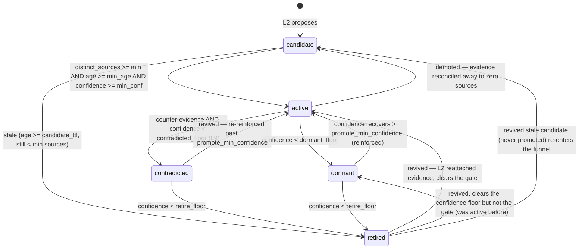

# Concept lifecycle (L3) — the state machine and its single writer

This is the **canonical reference** for how a higher-order concept moves
through its life: who may change its `confidence` / `plasticity` /
`status`, when each transition fires, and how the engagement-driven
confidence model works. It is the base that L5 (surfacing), L6 (manual
confirm/reject), **L9 (contradiction — built, see below)**, L15 (further
disproof), and L16 (plasticity drift) build against — so it deliberately
makes the machinery unambiguous.

Implementation: [`app/core/concepts/concept_lifecycle_worker.py`](../app/core/concepts/concept_lifecycle_worker.py)
(orchestration) + [`app/core/concepts/concept_lifecycle.py`](../app/core/concepts/concept_lifecycle.py)
(pure confidence/gate math). Storage: [`concept_store.py`](../app/core/concepts/concept_store.py).
Timeline: [`concept_event_store.py`](../app/core/concepts/concept_event_store.py).

## Status vocabulary

| Status | Meaning | Revivable? |
| --- | --- | --- |
| `candidate` | Proposed by L2; not yet earned a place in Aiko's worldview. | — (it's the entry state) |
| `active` | Promoted: enough distinct evidence, stable long enough, confident enough. The **only** status L5 surfaces. | — |
| `dormant` | Was active; confidence decayed below the dormant floor without fresh evidence. Quiet, not gone. | Yes — climbs back to `active` when reinforced. |
| `contradicted` | **L9.** Was active; **counter-evidence** disproved it and drove confidence below the *contradicted* floor. "Actively disproven", distinct from a faded `dormant`. | Yes — climbs back to `active` when re-reinforced past the promote bar. |
| `retired` | Long-quiet (fell below the retire floor) **or** a candidate that never earned promotion. **Asleep, not dead.** | Yes — fresh evidence revives it (see below). |
| `suppressed` | **Reserved, not built.** L6 user rejection → truly terminal; excluded from L2 re-proposal and never revived. | No (by design). |

`retired` is **not** a graveyard. Because L2 surfaces retired concepts to
the proposer (its `_existing_for` / `_find_duplicate` use no status
filter), a resurfacing interest re-attaches evidence to the *existing*
retired concept — preserving its identity and history (the "I vaguely
remember you mentioning macro photography two years ago" callback) — and
L3 climbs it back out on the next pass. Only an explicit user rejection
(future L6 `suppressed`) is permanent.

## State machine



### Transition triggers (and the setting that governs each)

All settings live on `MemorySettings`
([`memory_settings.py`](../app/core/infra/memory_settings.py)); the L3
worker is also gated by `agent.concepts_enabled`.

| Transition | Condition | Setting(s) |
| --- | --- | --- |
| `candidate → active` | `distinct_source_count >= min_sources` **and** `age_days >= min_age_days` **and** `confidence >= min_confidence` — evaluated by the kind's own `promotion_gate`, which floors each of the three at its `_X_MIN_*` constant via `max`. `set_evidence_gate` is the fallback for a kind that declares none, but every shipped kind declares its own. | `concept_promote_min_sources`, `concept_promote_min_age_days`, `concept_promote_min_confidence` (raise the floor for *all* kinds; per-kind constants live in `concept_lifecycle.py`) |
| `candidate → retired` | `age_days >= candidate_ttl` **and** `distinct_source_count < min_sources` | `concept_candidate_ttl_days`, `concept_promote_min_sources` |
| `active → candidate` | `distinct_source_count == 0` — every supporting edge was deleted or repointed away (L25), so the belief rests on nothing. Checked **before** the confidence floors, because confidence decays far too slowly to notice on its own. It keeps its confidence and re-promotes normally once evidence returns. | (none — structural) |
| `active → dormant` | `confidence < dormant_floor` (and **not** contradicted this tick) | `concept_dormant_confidence_floor` |
| `active → contradicted` | **L9** — the detector confirmed counter-evidence this tick **and** the plasticity-damped penalty drove `confidence < contradicted_floor`. Above the floor it stays `active` but weakened. | `concept_contradiction_*` (detector), `concept_contradiction_penalty`, `concept_contradicted_confidence_floor` |
| `contradicted → active` | re-reinforced (`last_reinforced_at` newer than the last pass) back up to `>= promote_min_confidence` | `concept_promote_min_confidence` |
| `contradicted → retired` | keeps decaying below `retire_floor` | `concept_retire_confidence_floor` |
| `dormant → active` | `confidence >= promote_min_confidence` (reinforced back up). Note this revival checks confidence **only** — it does not re-run the kind's `promotion_gate`, unlike the `retired` row below, so a faded concept returns on its original evidence. Reaching this state at all requires confidence to have recovered, which requires genuine reinforcement. | `concept_promote_min_confidence` |
| `dormant → retired` | `confidence < retire_floor` | `concept_retire_confidence_floor` |
| `retired → active / dormant / candidate` | fresh evidence (`last_reinforced_at` newer than the last lifecycle pass) lifts confidence; routed to `active` if it clears the gate, else `dormant` (if it had been promoted) or `candidate` (if it never had) | (gate + floors above) |

The contradicted floor sits **above** the dormant floor (default `0.4` vs
`0.35`) so "actively disproven" is a stronger signal than "faded": a
contradiction is what *routes* to `contradicted`, and it takes priority
over the dormant check when both would trigger the same tick. A
`contradicted` concept is never surfaced by L5 (the block filters
`status="active"`), and the detector only ever runs on `active` concepts,
so a disproven belief stays quiet until it is genuinely re-reinforced.

Age (`age_days`) gates the promotion stability check and the candidate TTL,
and feeds the L16 plasticity drift. It never *causes* a status change: the
two gates only ever *delay* an action — being offline makes promotion and
retirement wait, never fire early — so intermittent uptime is harmless.

**The *global* promotion age floor defaults to off**
(`concept_promote_min_age_days = 0.0`), but that is no longer the effective
floor for any kind: each kind's own `<kind>_evidence_gate` declares an
`_X_MIN_AGE_DAYS` and takes the `max` of it and the global setting. So the
knob is a way to raise every kind's delay at once, not the delay itself —
read the per-kind constants in
[`concept_lifecycle.py`](../app/core/concepts/concept_lifecycle.py) to know
what a given kind actually waits.

The original reasoning for a zero global floor was that distinct sources and
confidence are the meaningful signals, so a well-evidenced concept shouldn't
have to wait. That held until it was measured: with no delay, **167 of 240**
never-reinforced `identity` concepts had promoted within an hour of first
evidence, at a median of 3.6 minutes. A stability delay turned out to be
doing real work, and `identity` was the one kind with no delay of its own.

**Age is engaged time, not wall-clock** (schema v24). Both the promotion
floor and the `concept_candidate_ttl_days` cleanup are measured in *engaged*
(active-conversation) days via a per-concept anchor
`first_evidence_engagement` (the `EngagementClock.total()` captured on the
concept's first lifecycle evaluation): `age_days =
engaged_days_since(first_evidence_engagement)`, **unclamped** (age must
accumulate without bound; only decay's per-tick catch-up is clamped). So a
maturation delay is spent on real interaction — at the default
`engagement_seconds_per_day=3600`, `1.0` ≈ an hour of active conversation —
rather than idling to maturity on the calendar.

The anchor is stamped in **step 0** of `_process`, before the transition
reads it, so a brand-new candidate's first evaluation reports age `0.0`.
That ordering is load-bearing: stamped afterwards, the first evaluation fell
through to the wall-clock branch, and a candidate minted just before a long
shutdown would clear a stability delay on its calendar age alone — idle
downtime maturing it, which is what engaged time exists to prevent.

The wall-clock fallback from `first_evidence_at` remains for clock-disabled
deployments, and for an *already-evaluated* row that is still un-anchored
(pre-v24, missed by the backfill) — such a row is deliberately **not**
re-anchored, since that would reset its accrued age to zero. Existing
concepts were backfilled to anchor `0.0` on the v24 upgrade so an
already-evidenced candidate promotes on the next tick instead of restarting
its age clock.

## Ownership / responsibility table

The one rule that keeps a second writer from ever creeping in:

| Actor | Writes | Never writes |
| --- | --- | --- |
| **L1 `ConceptStore`** | mechanism only — CRUD + edges + cosine mirror | enforces no policy; schedules no mutation |
| **L2 synthesis worker** | creates `candidate` rows + `evidence` edges; reinforces existing concepts of *any* status (`evidence_count`, `distinct_source_count`, `last_reinforced_at`) | `confidence` / `plasticity` / `status` / `promoted_at` / `last_lifecycle_*` / `first_evidence_engagement` |
| **L3 lifecycle worker** | **single writer** of `confidence` / `plasticity` / `status` / `promoted_at` + the `last_lifecycle_at` / `last_lifecycle_engagement` / `first_evidence_engagement` anchors; emits lifecycle events | edges / evidence counts / memories |
| **L9 `ConceptContradictionDetector`** | nothing — **read-only** input. Reads the concept + nearby memories and returns a verdict; L3 applies the penalty / transition. | `confidence` / `status` / anything (it is not a writer) |
| **L25 `ConceptEdgeReconciler`** | drops / repoints edges when their target memory is deleted or merged, and recomputes the affected concepts' *edge-derived* `evidence_count` / `distinct_source_count` (same recompute L2 does). It never re-gates `status` itself — it makes the counts truthful and L3's rolling sweep reads them and demotes. | `confidence` / `plasticity` / `status` / memories |
| **L25 `ConceptEdgeIntegrityWorker`** | idle sweep — asks the reconciler to GC orphaned memory edges left by listener-bypassing `prune()` | anything directly (delegates to the reconciler) |
| **L6 (future)** | manual confirm (hard-promote) / reject (→ terminal `suppressed`), *through* L3's rules — the only other actor allowed to drive a status change | — |
| **L5** | nothing — read-only consumer that surfaces `active` concepts (with L9 supporting-grounding) | any mutation |

## Confidence model — engagement-driven

Confidence is **stateful and incremental**, persisted in the `confidence`
column and nudged each time a concept is processed — not recomputed from
an absolute idle span. Per concept, per pass
([`concept_lifecycle.py`](../app/core/concepts/concept_lifecycle.py)):

```
engaged_days = min((clock.total() - concept.last_lifecycle_engagement) / engagement_seconds_per_day,
                   concept_decay_max_catchup_days)          # this concept's ACTIVE time, bounded
target       = logistic(distinct_source_count)              # saturates, cap 0.97
halflife     = concept_confidence_halflife_days * (2 - plasticity)   # low plasticity => stickier
confidence  *= 0.5 ** (engaged_days / halflife)             # decay only over ENGAGED time
if last_reinforced_at > concept.last_lifecycle_at:          # L2 attached new evidence since we last looked
    alpha = 0.5 + 0.5 * plasticity                          # L16: plasticity-damped accrual step
    confidence = max(confidence, confidence + (target - confidence) * alpha)  # approach the target (never lowers)
confidence   = clamp(confidence, 0, 0.97)
# then stamp concept.last_lifecycle_engagement = clock.total(); concept.last_lifecycle_at = now
```

Three things make this robust and anti-bias:

- **Engagement clock, not wall-clock.** Elapsed time is
  *active-conversation time* from the shared
  [`EngagementClock`](../app/core/infra/engagement_clock.py) (a monotonic
  counter in `kv_meta`, credited a bounded amount per turn). Being away
  or quiet for days costs ~nothing, so downtime never craters
  confidence. If the clock is disabled, `engaged_days` falls back to the
  wall-clock delta since the last pass, clamped by
  `concept_decay_max_catchup_days`.
- **Per-concept anchor.** Each concept carries its own
  `last_lifecycle_engagement` + `last_lifecycle_at`, so batched /
  round-robin processing stays exactly correct — a concept swept twice as
  often never decays twice as fast.
- **Saturating target + distinct-source gating.** `target` is a logistic
  of the *distinct* source count (diversity, not raw repetition) capped at
  0.97, so repeating the same evidence can't run confidence away, and
  anything without fresh distinct evidence erodes.

**Status keys off confidence, not idle-days** — because confidence is now
the engagement-robust signal, the dormant/retire transitions read it
directly.

### Plasticity — the movement governor (L16)

`plasticity` (`[0, 1]`, per concept) is the single **learning rate** the
engine damps *every* confidence move by, so movement is symmetric in both
directions — a sticky core trait resists change whether it is being built,
faded, disproven, or having its evidence re-examined:

| Move | Damping | Effect of low plasticity |
| --- | --- | --- |
| **Decay** | `halflife *= (2 - p)` | slower fade (stickier) |
| **Accrual** | `alpha = 0.5 + 0.5*p` (`accrual_alpha`) | partial step toward target — needs more reinforced evals to promote |
| **L9 disproof** | `apply_contradiction_penalty` (× `0.5 + 0.5*p`) | resists a contradiction, drops less |
| **L15 revision** | supporting-memory cut × concept `0.5 + 0.5*p` | a sticky belief revises its own evidence gently |

`p=1` reproduces the pre-L16 behaviour exactly (full snap-to-target on
accrual, full penalty on disproof), so only sub-1 kinds slow down.
Plasticity is stamped **once, on a concept's first lifecycle eval**, from
the per-kind default: the `ConceptKind.plasticity_default` band (identity
= low, tuned by `concept_identity_plasticity = 0.3`), falling back to
`concept_default_plasticity` (`0.5`) for kinds with no registered band.
Plasticity does not itself drift, and relationship modulation (trust /
duration loosening a boundary) is deferred (see the L16 backlog entry).

### Batched + incremental

The worker runs often (`concept_lifecycle_interval_seconds`, default
300s) over a small **rolling round-robin** batch
(`concept_lifecycle_batch_size`, default 100): each tick fetches the
stalest concepts (`ConceptStore.list_stalest`, ordered by
`last_lifecycle_at` ascending, NULLs first) and processes only those, so
a growing concept set never blocks the shared idle scheduler. A full
sweep takes `ceil(total / batch_size)` ticks; correctness across ticks is
guaranteed by the per-concept anchor above (no global cursor).

## Contradiction — living beliefs (L9)

Confidence normally only *decays* (absence of evidence) or *accrues*
(fresh evidence). L9 adds active **disproof**: an identity belief can be
knocked down by a memory that contradicts it, and — if knocked far
enough — flipped to the `contradicted` status.

The probe is a read-only
[`ConceptContradictionDetector`](../app/core/concepts/concept_contradiction.py)
that reuses the F5 conflict machinery, concept-vs-memory:

1. **Cosine band.** Pull the concept's nearest memories
   (`MemoryStore.search`) and keep only those in
   `[concept_contradiction_similarity_min, _max)` (default `0.6`–`0.95`).
   The band is *wider* than F5's memory↔memory band because the concept
   side is an abstract label — it is only a candidate filter.
2. **Heuristic** (`classify_pair` over `memory.content` vs
   `"{label}. {rationale}"`): `definite` (a preference-verb antonym /
   negation flip — exactly the vocabulary of identity beliefs) confirms
   without an LLM call; `no` is dropped (a near memory with no opposition
   signal is *supporting*, not counter-evidence); `borderline` escalates.
3. **LLM** for borderlines only, gated by a `FactCheckRateLimiter`
   (`state_key='concept_contradiction.rate_state'`, its own hour/day
   budget); only a `YES` confirms.

On a confirmed contradiction, L3 applies
[`apply_contradiction_penalty`](../app/core/concepts/concept_lifecycle.py)
— a **plasticity-damped** downward step (plasticity `[0,1]` → a
`[0.5x .. 1x]` multiplier on `concept_contradiction_penalty`), so a
sticky identity belief resists disproof, just slower. Then the
`active → contradicted` transition fires iff confidence fell below
`concept_contradicted_confidence_floor`.

**Batched like L2/L3.** The detector rides L3's existing
`list_stalest` round-robin: each tick checks at most
`concept_contradiction_batch_size` (default 20) *active* concepts, and
because L3 stamps `last_lifecycle_at` on every processed concept the
checked sub-batch rotates across ticks — the memory search + LLM cost
never sweeps the whole active set in one tick. LLM spend is bounded
separately by the rate-limiter's hour/day caps (the cheap heuristic +
search still run when the LLM budget is spent; borderline pairs just
defer). L3 stays the single writer throughout; the detector only reads.

> Identity plasticity is applied on a concept's **first** lifecycle
> evaluation (`concept_identity_plasticity`, default `0.3`), so identity
> beliefs are sticky for both decay *and* L9 disproof from the moment L3
> first touches them.

## Belief revision — doubt flows back down (L15)

L9 lowers the *concept*. L15 closes the loop: when a belief tips into
`contradicted`, the doubt flows **back down** to the memories that
supported it. Two pieces:

1. **The disproof edge.** Every confirmed contradiction upserts a
   `concept --contradicts--> memory` edge (polarity `-1`,
   `strength = similarity`) into `concept_edges`, so the disproof
   relation is a first-class part of the graph (idempotent on repeat
   hits).
2. **The reviser.** On the tick that flips a concept `-> contradicted`,
   L3 hands it to the read-mostly
   [`ConceptBeliefReviser`](../app/core/concepts/concept_belief_reviser.py),
   which walks the concept's `evidence` memories and arbitrates, **per
   memory**, one of three resolutions:

| Resolution | Meaning | Write |
| --- | --- | --- |
| **(a) inaccurate** | the memory was wrong (misremembered / bad extraction) | lower its `confidence` by `concept_belief_revision_confidence_penalty`, floored at `concept_belief_revision_confidence_floor` |
| **(b) superseded** | true when recorded, stale now (the person changed) | `reclassify` to `past_event` with `relevance_until = now + concept_belief_revision_superseded_relevance_days`; **confidence untouched** — the fact still happened |
| **(c) keep** | the memory is fine; the belief was an over-reach | no memory write (the concept was already penalised by L9) |

**Why arbitration, not a direct back-edge.** A concept's confidence must
never directly overwrite a memory's: memory confidence *feeds* concept
confidence (L3), so a raw back-edge is an undamped loop that oscillates
or collapses; and an inference silently rewriting an observation is
backwards. So the propagation is a **trigger, not a write** — each memory
is judged on its own against the counter-evidence.

**The cheap gate + the LLM.** For each supporting memory the reviser runs
`classify_pair(memory, counter_evidence)` first: a `no` verdict (the
memory is compatible with the disproof) leaves it alone, so only genuine
conflicts reach the 3-way LLM arbiter. That arbiter is gated by its own
[`FactCheckRateLimiter`](../app/core/memory/fact_check_rate_limiter.py)
(`state_key='concept_belief_revision.rate_state'`, hour/day caps on
`AgentSettings`), and a conflict is *deferred* (no write) when the budget
is spent.

**Guardrails.** Pinned memories are never touched (user-curated
observations outrank inferences); the (a) cut is damped + floored; the
pass is one-directional (only ever lowers / marks stale, never raises).

**Batched like the rest.** L3 caps the pass at
`concept_belief_revision_batch_size` concepts per tick, each up to
`concept_belief_revision_max_evidence` memories — so a big active set
never blocks the scheduler in one chunk. L3 stays the single writer of
*concept* state; the reviser only writes *memory* state (confidence /
temporal fields), exactly like F1 / F5.

## Event mapping — the discovery timeline

Every transition appends one `ConceptEvent`
([`concept_event_store.py`](../app/core/concepts/concept_event_store.py),
append-only, decoupled from concept deletion) with a generated `reason`.
`novelty` is not meaningful for lifecycle events (recorded as `0.0`).

| `event_type` | Emitted by | When |
| --- | --- | --- |
| `discovered` | L2 | concept first synthesised |
| `promoted` | L3 | `candidate → active` |
| `demoted` | L3 | `active → candidate` — all supporting evidence was removed |
| `dormant` | L3 | `active → dormant` |
| `retired` | L3 | `→ retired` (decayed or stale candidate) |
| `revived` | L3 | leaving `dormant`/`retired`/`contradicted` back up on fresh evidence |
| `contradicted` | L3 (L9) | counter-evidence confirmed — emitted **every** confirmed disproof, even when the belief only weakened (status unchanged), so the timeline records the moment. `reason` quotes the disproving memory snippet. |
| `reinforced` | L3 | fresh distinct evidence landed on an already-`active` belief without shifting its status |
| `plasticity_shift` | L3 (L16) | relationship modulation moved effective plasticity across a `concept_plasticity_shift_event_delta` band |
| `confidence_sample` | L3 (L17a) | a **quiet** concept drifted a full `concept_confidence_sample_band` from the confidence at its last recorded event — see below |

The frontend
[`ConceptTimelinePanel.tsx`](../web/src/features/settings/memory/ConceptTimelinePanel.tsx)
renders any `event_type` with a per-type tone, so these surface
automatically.

### Reading one concept's trajectory (L17a)

The table above is a *transition* log, which leaves one blind spot: a
belief can decay for months, never cross a status floor, and so leave no
trace of the slide. `confidence_sample` closes it. The sweep loads each
batched concept's last recorded confidence in one grouped read
(`ConceptEventStore.latest_confidence`) and, **only** when nothing else
emitted for that concept this tick, drops a sample once the confidence
has moved a full band away in either direction. Banded rather than
per-tick, so the timeline stays a story worth reading; the baseline then
advances to the sample, so a long fade logs once per band. Off via
`concept_confidence_sample_enabled`.

Reading it back:

- `ConceptEventStore.trajectory(concept_id)` — that concept's events
  **oldest-first**, the inverse of `list()`'s newest-first feed, because
  a trajectory is read forwards. `limit` keeps the *oldest* rows so the
  start of the story survives.
- `GET /api/concepts/timeline?concept_id=…` — the same slice from the
  browser, still newest-first like the rest of the feed.

Both ride `idx_concept_events_concept`, so a per-concept read is cheap.

## Edge referential integrity (L25)

Concepts point at memories through `concept_edges` (`evidence`:
`memory → concept`; `contradicts`: `concept → memory`), but memories are
not permanent — they're deleted, pruned, merged, archived, and
reclassified. L25 keeps the edge graph honest so a concept never silently
keeps dangling support or loses the evidence it was promoted on. The policy
is decided **per lifecycle event** and enforced by the
[`ConceptEdgeReconciler`](../app/core/concepts/concept_edge_reconciler.py):

| Memory event | Edge policy | How |
| --- | --- | --- |
| **hard delete** (`MemoryStore.delete`) | drop every edge touching the memory, recompute affected concepts' counts | `reconciler.on_memory_deleted` registered as a `MemoryStore` **delete listener** |
| **prune** (`MemoryStore.prune`, cap enforcement) | GC the orphaned edges it leaves | `prune()` **bypasses** delete listeners, so the idle [`ConceptEdgeIntegrityWorker`](../app/core/concepts/concept_edge_integrity_worker.py) sweep catches them (`orphaned_memory_edges` → drop → recount) |
| **destructive merge** (legacy Phase 4b consolidator hard-deletes the victim) | **repoint** the victim's edges onto the survivor, then delete | `MemoryConsolidator` calls the injected `repoint_memory_edges` hook (`reconciler.repoint`) *before* deleting each victim (rule b) |
| **K35 consolidation / archive / reclassify** (row stays alive) | **keep** the edge — archived memories are still historical evidence (rule c) | no action; the row (and its id) survives |

Two robustness properties: edge reads already **tolerate a missing target**
(consumers skip a vanished memory rather than crash), and counts are
treated as **edge-derived** — `evidence_count` / `distinct_source_count`
are recomputed from the live edge table by whichever path mutated the edges
(L2's reinforce does the same recompute), so a dropped edge can naturally
weaken/demote a concept via L3 on its next tick. The reconciler **never**
writes `confidence` / `plasticity` / `status`; that stays L3's alone.

## Invariants

- **Single writer.** Only L3 mutates `confidence` / `plasticity` /
  `status` / `promoted_at` / `last_lifecycle_*`. L2 only creates +
  reinforces evidence; L5 only reads. `evidence_count` /
  `distinct_source_count` are **edge-derived** and recomputed by any
  edge-mutating path (L2 reinforce, the L25 reconciler) — never a second
  writer of *confidence* state.
- **`retired` is revivable; `suppressed` (future) is terminal.**
- **Meta-confidence bounded by `min(bases)`.** A meta concept's
  confidence is clamped to the minimum of its base concepts', and a base
  status change marks its dependents stale (their `last_lifecycle_at` is
  reset) so the next tick re-evaluates them — a batch-safe cascade. No-op
  today (only `set`/identity concepts exist), wired for later meta kinds.
- **Pure arithmetic over concept state.** The confidence / status math is
  arithmetic over a bounded row set; L3 is the only writer of *concept*
  state. The LLM / write touchpoints are all **inputs / side-channels**
  that never mutate concept state themselves: the **L9 contradiction
  detector** (read-only, rate-limited, per-tick-bounded), the **L15
  belief reviser** (writes only *memory* state — confidence / temporal
  fields — bounded + rate-limited), the `contradicts` disproof edge
  written alongside a confirmed contradiction, and the **L25 edge
  reconciler** (drops / repoints memory edges and recomputes edge-derived
  counts — never concept confidence / status).

## Shared engagement clock

The [`EngagementClock`](../app/core/infra/engagement_clock.py) is a
general primitive, not L3-specific. The **memory decay worker** uses it
too (behind `memory_decay_use_engagement_clock`, default on): a wall-clock
week of no turns applies ~0 decay; a week of heavy conversation applies
more, fairly, on shared experienced time. Calibration is one knob,
`engagement_seconds_per_day` (default "~1 active hour = 1 decay-day"),
recalibratable as usage settles.
