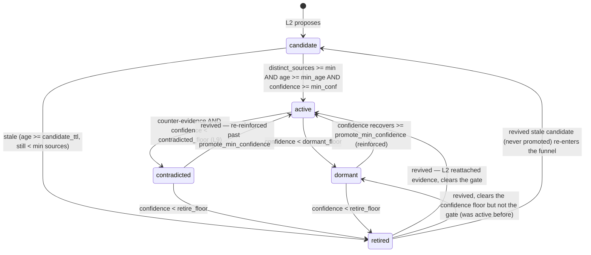

# Concept lifecycle (L3) — the state machine and its single writer

This is the **canonical reference** for how a higher-order concept moves
through its life: who may change its `confidence` / `plasticity` /
`status`, when each transition fires, and how the engagement-driven
confidence model works. It is the base that L5 (surfacing), L6 (manual
confirm/reject), **L9 (contradiction — built, see below)**, L15 (further
disproof), and L16 (plasticity drift) build against — so it deliberately
makes the machinery unambiguous.

Implementation: [`app/core/concepts/concept_lifecycle_worker.py`](../app/core/concepts/concept_lifecycle_worker.py)
(orchestration) + [`app/core/concepts/concept_lifecycle.py`](../app/core/concepts/concept_lifecycle.py)
(pure confidence/gate math). Storage: [`concept_store.py`](../app/core/concepts/concept_store.py).
Timeline: [`concept_event_store.py`](../app/core/concepts/concept_event_store.py).

## Status vocabulary

| Status | Meaning | Revivable? |
| --- | --- | --- |
| `candidate` | Proposed by L2; not yet earned a place in Aiko's worldview. | — (it's the entry state) |
| `active` | Promoted: enough distinct evidence, stable long enough, confident enough. The **only** status L5 surfaces. | — |
| `dormant` | Was active; confidence decayed below the dormant floor without fresh evidence. Quiet, not gone. | Yes — climbs back to `active` when reinforced. |
| `contradicted` | **L9.** Was active; **counter-evidence** disproved it and drove confidence below the *contradicted* floor. "Actively disproven", distinct from a faded `dormant`. | Yes — climbs back to `active` when re-reinforced past the promote bar. |
| `retired` | Long-quiet (fell below the retire floor) **or** a candidate that never earned promotion. **Asleep, not dead.** | Yes — fresh evidence revives it (see below). |
| `suppressed` | **Reserved, not built.** L6 user rejection → truly terminal; excluded from L2 re-proposal and never revived. | No (by design). |

`retired` is **not** a graveyard. Because L2 surfaces retired concepts to
the proposer (its `_existing_for` / `_find_duplicate` use no status
filter), a resurfacing interest re-attaches evidence to the *existing*
retired concept — preserving its identity and history (the "I vaguely
remember you mentioning macro photography two years ago" callback) — and
L3 climbs it back out on the next pass. Only an explicit user rejection
(future L6 `suppressed`) is permanent.

## State machine



### Transition triggers (and the setting that governs each)

All settings live on `MemorySettings`
([`memory_settings.py`](../app/core/infra/memory_settings.py)); the L3
worker is also gated by `agent.concepts_enabled`.

| Transition | Condition | Setting(s) |
| --- | --- | --- |
| `candidate → active` | `distinct_source_count >= min_sources` **and** `age_days >= min_age_days` **and** `confidence >= min_confidence` (the per-kind `promotion_gate`, default the `set`-evidence gate) | `concept_promote_min_sources`, `concept_promote_min_age_days`, `concept_promote_min_confidence` |
| `candidate → retired` | `age_days >= candidate_ttl` **and** `distinct_source_count < min_sources` | `concept_candidate_ttl_days`, `concept_promote_min_sources` |
| `active → dormant` | `confidence < dormant_floor` (and **not** contradicted this tick) | `concept_dormant_confidence_floor` |
| `active → contradicted` | **L9** — the detector confirmed counter-evidence this tick **and** the plasticity-damped penalty drove `confidence < contradicted_floor`. Above the floor it stays `active` but weakened. | `concept_contradiction_*` (detector), `concept_contradiction_penalty`, `concept_contradicted_confidence_floor` |
| `contradicted → active` | re-reinforced (`last_reinforced_at` newer than the last pass) back up to `>= promote_min_confidence` | `concept_promote_min_confidence` |
| `contradicted → retired` | keeps decaying below `retire_floor` | `concept_retire_confidence_floor` |
| `dormant → active` | `confidence >= promote_min_confidence` (reinforced back up) | `concept_promote_min_confidence` |
| `dormant → retired` | `confidence < retire_floor` | `concept_retire_confidence_floor` |
| `retired → active / dormant / candidate` | fresh evidence (`last_reinforced_at` newer than the last lifecycle pass) lifts confidence; routed to `active` if it clears the gate, else `dormant` (if it had been promoted) or `candidate` (if it never had) | (gate + floors above) |

The contradicted floor sits **above** the dormant floor (default `0.4` vs
`0.35`) so "actively disproven" is a stronger signal than "faded": a
contradiction is what *routes* to `contradicted`, and it takes priority
over the dormant check when both would trigger the same tick. A
`contradicted` concept is never surfaced by L5 (the block filters
`status="active"`), and the detector only ever runs on `active` concepts,
so a disproven belief stays quiet until it is genuinely re-reinforced.

Age (`age_days`, from `first_evidence_at`) is used **only** for the
promotion stability check and the candidate TTL. Both only ever *delay*
an action — being offline makes promotion/retirement wait, never fire
early — so intermittent uptime is harmless.

## Ownership / responsibility table

The one rule that keeps a second writer from ever creeping in:

| Actor | Writes | Never writes |
| --- | --- | --- |
| **L1 `ConceptStore`** | mechanism only — CRUD + edges + cosine mirror | enforces no policy; schedules no mutation |
| **L2 synthesis worker** | creates `candidate` rows + `evidence` edges; reinforces existing concepts of *any* status (`evidence_count`, `distinct_source_count`, `last_reinforced_at`) | `confidence` / `plasticity` / `status` / `promoted_at` / `last_lifecycle_*` |
| **L3 lifecycle worker** | **single writer** of `confidence` / `plasticity` / `status` / `promoted_at` + the `last_lifecycle_at` / `last_lifecycle_engagement` anchor; emits lifecycle events | edges / evidence counts / memories |
| **L9 `ConceptContradictionDetector`** | nothing — **read-only** input. Reads the concept + nearby memories and returns a verdict; L3 applies the penalty / transition. | `confidence` / `status` / anything (it is not a writer) |
| **L6 (future)** | manual confirm (hard-promote) / reject (→ terminal `suppressed`), *through* L3's rules — the only other actor allowed to drive a status change | — |
| **L5** | nothing — read-only consumer that surfaces `active` concepts (with L9 supporting-grounding) | any mutation |

## Confidence model — engagement-driven

Confidence is **stateful and incremental**, persisted in the `confidence`
column and nudged each time a concept is processed — not recomputed from
an absolute idle span. Per concept, per pass
([`concept_lifecycle.py`](../app/core/concepts/concept_lifecycle.py)):

```
engaged_days = min((clock.total() - concept.last_lifecycle_engagement) / engagement_seconds_per_day,
                   concept_decay_max_catchup_days)          # this concept's ACTIVE time, bounded
target       = logistic(distinct_source_count)              # saturates, cap 0.97
halflife     = concept_confidence_halflife_days * (2 - plasticity)   # low plasticity => stickier
confidence  *= 0.5 ** (engaged_days / halflife)             # decay only over ENGAGED time
if last_reinforced_at > concept.last_lifecycle_at:          # L2 attached new evidence since we last looked
    confidence = max(confidence, target)                    # accrual: snap up to what the evidence deserves
confidence   = clamp(confidence, 0, 0.97)
# then stamp concept.last_lifecycle_engagement = clock.total(); concept.last_lifecycle_at = now
```

Three things make this robust and anti-bias:

- **Engagement clock, not wall-clock.** Elapsed time is
  *active-conversation time* from the shared
  [`EngagementClock`](../app/core/infra/engagement_clock.py) (a monotonic
  counter in `kv_meta`, credited a bounded amount per turn). Being away
  or quiet for days costs ~nothing, so downtime never craters
  confidence. If the clock is disabled, `engaged_days` falls back to the
  wall-clock delta since the last pass, clamped by
  `concept_decay_max_catchup_days`.
- **Per-concept anchor.** Each concept carries its own
  `last_lifecycle_engagement` + `last_lifecycle_at`, so batched /
  round-robin processing stays exactly correct — a concept swept twice as
  often never decays twice as fast.
- **Saturating target + distinct-source gating.** `target` is a logistic
  of the *distinct* source count (diversity, not raw repetition) capped at
  0.97, so repeating the same evidence can't run confidence away, and
  anything without fresh distinct evidence erodes. Plasticity damps the
  decay rate (identity defaults to `concept_identity_plasticity = 0.3`, so
  identity is sticky).

**Status keys off confidence, not idle-days** — because confidence is now
the engagement-robust signal, the dormant/retire transitions read it
directly.

### Batched + incremental

The worker runs often (`concept_lifecycle_interval_seconds`, default
300s) over a small **rolling round-robin** batch
(`concept_lifecycle_batch_size`, default 100): each tick fetches the
stalest concepts (`ConceptStore.list_stalest`, ordered by
`last_lifecycle_at` ascending, NULLs first) and processes only those, so
a growing concept set never blocks the shared idle scheduler. A full
sweep takes `ceil(total / batch_size)` ticks; correctness across ticks is
guaranteed by the per-concept anchor above (no global cursor).

## Contradiction — living beliefs (L9)

Confidence normally only *decays* (absence of evidence) or *accrues*
(fresh evidence). L9 adds active **disproof**: an identity belief can be
knocked down by a memory that contradicts it, and — if knocked far
enough — flipped to the `contradicted` status.

The probe is a read-only
[`ConceptContradictionDetector`](../app/core/concepts/concept_contradiction.py)
that reuses the F5 conflict machinery, concept-vs-memory:

1. **Cosine band.** Pull the concept's nearest memories
   (`MemoryStore.search`) and keep only those in
   `[concept_contradiction_similarity_min, _max)` (default `0.6`–`0.95`).
   The band is *wider* than F5's memory↔memory band because the concept
   side is an abstract label — it is only a candidate filter.
2. **Heuristic** (`classify_pair` over `memory.content` vs
   `"{label}. {rationale}"`): `definite` (a preference-verb antonym /
   negation flip — exactly the vocabulary of identity beliefs) confirms
   without an LLM call; `no` is dropped (a near memory with no opposition
   signal is *supporting*, not counter-evidence); `borderline` escalates.
3. **LLM** for borderlines only, gated by a `FactCheckRateLimiter`
   (`state_key='concept_contradiction.rate_state'`, its own hour/day
   budget); only a `YES` confirms.

On a confirmed contradiction, L3 applies
[`apply_contradiction_penalty`](../app/core/concepts/concept_lifecycle.py)
— a **plasticity-damped** downward step (plasticity `[0,1]` → a
`[0.5x .. 1x]` multiplier on `concept_contradiction_penalty`), so a
sticky identity belief resists disproof, just slower. Then the
`active → contradicted` transition fires iff confidence fell below
`concept_contradicted_confidence_floor`.

**Batched like L2/L3.** The detector rides L3's existing
`list_stalest` round-robin: each tick checks at most
`concept_contradiction_batch_size` (default 20) *active* concepts, and
because L3 stamps `last_lifecycle_at` on every processed concept the
checked sub-batch rotates across ticks — the memory search + LLM cost
never sweeps the whole active set in one tick. LLM spend is bounded
separately by the rate-limiter's hour/day caps (the cheap heuristic +
search still run when the LLM budget is spent; borderline pairs just
defer). L3 stays the single writer throughout; the detector only reads.

> Identity plasticity is applied on a concept's **first** lifecycle
> evaluation (`concept_identity_plasticity`, default `0.3`), so identity
> beliefs are sticky for both decay *and* L9 disproof from the moment L3
> first touches them.

## Event mapping — the discovery timeline

Every transition appends one `ConceptEvent`
([`concept_event_store.py`](../app/core/concepts/concept_event_store.py),
append-only, decoupled from concept deletion) with a generated `reason`.
`novelty` is not meaningful for lifecycle events (recorded as `0.0`).

| `event_type` | Emitted by | When |
| --- | --- | --- |
| `discovered` | L2 | concept first synthesised |
| `promoted` | L3 | `candidate → active` |
| `dormant` | L3 | `active → dormant` |
| `retired` | L3 | `→ retired` (decayed or stale candidate) |
| `revived` | L3 | leaving `dormant`/`retired`/`contradicted` back up on fresh evidence |
| `contradicted` | L3 (L9) | counter-evidence confirmed — emitted **every** confirmed disproof, even when the belief only weakened (status unchanged), so the timeline records the moment. `reason` quotes the disproving memory snippet. |
| `reinforced` | reserved | L15 |

The frontend
[`ConceptTimelinePanel.tsx`](../web/src/features/settings/memory/ConceptTimelinePanel.tsx)
renders any `event_type` with a per-type tone, so these surface
automatically.

## Invariants

- **Single writer.** Only L3 mutates `confidence` / `plasticity` /
  `status` / `promoted_at` / `last_lifecycle_*`. L2 only creates +
  reinforces evidence; L5 only reads.
- **`retired` is revivable; `suppressed` (future) is terminal.**
- **Meta-confidence bounded by `min(bases)`.** A meta concept's
  confidence is clamped to the minimum of its base concepts', and a base
  status change marks its dependents stale (their `last_lifecycle_at` is
  reset) so the next tick re-evaluates them — a batch-safe cascade. No-op
  today (only `set`/identity concepts exist), wired for later meta kinds.
- **No edges, no memory writes** in the lifecycle pass. The confidence /
  status math is pure arithmetic over a bounded row set; the one LLM
  touchpoint is the **L9 contradiction detector**, a read-only,
  rate-limited, per-tick-bounded input that never writes concept state
  itself.

## Shared engagement clock

The [`EngagementClock`](../app/core/infra/engagement_clock.py) is a
general primitive, not L3-specific. The **memory decay worker** uses it
too (behind `memory_decay_use_engagement_clock`, default on): a wall-clock
week of no turns applies ~0 decay; a week of heavy conversation applies
more, fairly, on shared experienced time. Calibration is one knob,
`engagement_seconds_per_day` (default "~1 active hour = 1 decay-day"),
recalibratable as usage settles.
