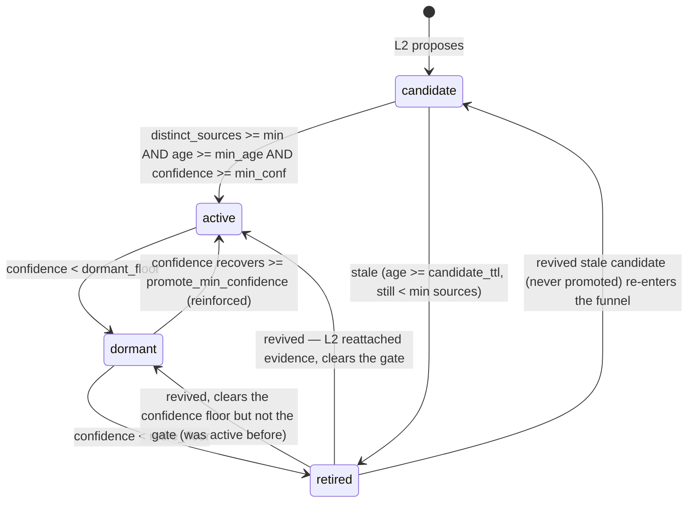

# Concept lifecycle (L3) — the state machine and its single writer

This is the **canonical reference** for how a higher-order concept moves
through its life: who may change its `confidence` / `plasticity` /
`status`, when each transition fires, and how the engagement-driven
confidence model works. It is the base that L5 (surfacing), L6 (manual
confirm/reject), L9/L15 (disproof), and L16 (plasticity drift) build
against — so it deliberately makes the machinery unambiguous.

Implementation: [`app/core/concepts/concept_lifecycle_worker.py`](../app/core/concepts/concept_lifecycle_worker.py)
(orchestration) + [`app/core/concepts/concept_lifecycle.py`](../app/core/concepts/concept_lifecycle.py)
(pure confidence/gate math). Storage: [`concept_store.py`](../app/core/concepts/concept_store.py).
Timeline: [`concept_event_store.py`](../app/core/concepts/concept_event_store.py).

## Status vocabulary

| Status | Meaning | Revivable? |
| --- | --- | --- |
| `candidate` | Proposed by L2; not yet earned a place in Aiko's worldview. | — (it's the entry state) |
| `active` | Promoted: enough distinct evidence, stable long enough, confident enough. The **only** status L5 surfaces. | — |
| `dormant` | Was active; confidence decayed below the dormant floor without fresh evidence. Quiet, not gone. | Yes — climbs back to `active` when reinforced. |
| `retired` | Long-quiet (fell below the retire floor) **or** a candidate that never earned promotion. **Asleep, not dead.** | Yes — fresh evidence revives it (see below). |
| `suppressed` | **Reserved, not built.** L6 user rejection → truly terminal; excluded from L2 re-proposal and never revived. | No (by design). |

`retired` is **not** a graveyard. Because L2 surfaces retired concepts to
the proposer (its `_existing_for` / `_find_duplicate` use no status
filter), a resurfacing interest re-attaches evidence to the *existing*
retired concept — preserving its identity and history (the "I vaguely
remember you mentioning macro photography two years ago" callback) — and
L3 climbs it back out on the next pass. Only an explicit user rejection
(future L6 `suppressed`) is permanent.

## State machine



### Transition triggers (and the setting that governs each)

All settings live on `MemorySettings`
([`memory_settings.py`](../app/core/infra/memory_settings.py)); the L3
worker is also gated by `agent.concepts_enabled`.

| Transition | Condition | Setting(s) |
| --- | --- | --- |
| `candidate → active` | `distinct_source_count >= min_sources` **and** `age_days >= min_age_days` **and** `confidence >= min_confidence` (the per-kind `promotion_gate`, default the `set`-evidence gate) | `concept_promote_min_sources`, `concept_promote_min_age_days`, `concept_promote_min_confidence` |
| `candidate → retired` | `age_days >= candidate_ttl` **and** `distinct_source_count < min_sources` | `concept_candidate_ttl_days`, `concept_promote_min_sources` |
| `active → dormant` | `confidence < dormant_floor` | `concept_dormant_confidence_floor` |
| `dormant → active` | `confidence >= promote_min_confidence` (reinforced back up) | `concept_promote_min_confidence` |
| `dormant → retired` | `confidence < retire_floor` | `concept_retire_confidence_floor` |
| `retired → active / dormant / candidate` | fresh evidence (`last_reinforced_at` newer than the last lifecycle pass) lifts confidence; routed to `active` if it clears the gate, else `dormant` (if it had been promoted) or `candidate` (if it never had) | (gate + floors above) |

Age (`age_days`, from `first_evidence_at`) is used **only** for the
promotion stability check and the candidate TTL. Both only ever *delay*
an action — being offline makes promotion/retirement wait, never fire
early — so intermittent uptime is harmless.

## Ownership / responsibility table

The one rule that keeps a second writer from ever creeping in:

| Actor | Writes | Never writes |
| --- | --- | --- |
| **L1 `ConceptStore`** | mechanism only — CRUD + edges + cosine mirror | enforces no policy; schedules no mutation |
| **L2 synthesis worker** | creates `candidate` rows + `evidence` edges; reinforces existing concepts of *any* status (`evidence_count`, `distinct_source_count`, `last_reinforced_at`) | `confidence` / `plasticity` / `status` / `promoted_at` / `last_lifecycle_*` |
| **L3 lifecycle worker** | **single writer** of `confidence` / `plasticity` / `status` / `promoted_at` + the `last_lifecycle_at` / `last_lifecycle_engagement` anchor; emits lifecycle events | edges / evidence counts / memories |
| **L6 (future)** | manual confirm (hard-promote) / reject (→ terminal `suppressed`), *through* L3's rules — the only other actor allowed to drive a status change | — |
| **L5 (future)** | nothing — read-only consumer that surfaces `active` concepts | any mutation |

## Confidence model — engagement-driven

Confidence is **stateful and incremental**, persisted in the `confidence`
column and nudged each time a concept is processed — not recomputed from
an absolute idle span. Per concept, per pass
([`concept_lifecycle.py`](../app/core/concepts/concept_lifecycle.py)):

```
engaged_days = min((clock.total() - concept.last_lifecycle_engagement) / engagement_seconds_per_day,
                   concept_decay_max_catchup_days)          # this concept's ACTIVE time, bounded
target       = logistic(distinct_source_count)              # saturates, cap 0.97
halflife     = concept_confidence_halflife_days * (2 - plasticity)   # low plasticity => stickier
confidence  *= 0.5 ** (engaged_days / halflife)             # decay only over ENGAGED time
if last_reinforced_at > concept.last_lifecycle_at:          # L2 attached new evidence since we last looked
    confidence = max(confidence, target)                    # accrual: snap up to what the evidence deserves
confidence   = clamp(confidence, 0, 0.97)
# then stamp concept.last_lifecycle_engagement = clock.total(); concept.last_lifecycle_at = now
```

Three things make this robust and anti-bias:

- **Engagement clock, not wall-clock.** Elapsed time is
  *active-conversation time* from the shared
  [`EngagementClock`](../app/core/infra/engagement_clock.py) (a monotonic
  counter in `kv_meta`, credited a bounded amount per turn). Being away
  or quiet for days costs ~nothing, so downtime never craters
  confidence. If the clock is disabled, `engaged_days` falls back to the
  wall-clock delta since the last pass, clamped by
  `concept_decay_max_catchup_days`.
- **Per-concept anchor.** Each concept carries its own
  `last_lifecycle_engagement` + `last_lifecycle_at`, so batched /
  round-robin processing stays exactly correct — a concept swept twice as
  often never decays twice as fast.
- **Saturating target + distinct-source gating.** `target` is a logistic
  of the *distinct* source count (diversity, not raw repetition) capped at
  0.97, so repeating the same evidence can't run confidence away, and
  anything without fresh distinct evidence erodes. Plasticity damps the
  decay rate (identity defaults to `concept_identity_plasticity = 0.3`, so
  identity is sticky).

**Status keys off confidence, not idle-days** — because confidence is now
the engagement-robust signal, the dormant/retire transitions read it
directly.

### Batched + incremental

The worker runs often (`concept_lifecycle_interval_seconds`, default
300s) over a small **rolling round-robin** batch
(`concept_lifecycle_batch_size`, default 100): each tick fetches the
stalest concepts (`ConceptStore.list_stalest`, ordered by
`last_lifecycle_at` ascending, NULLs first) and processes only those, so
a growing concept set never blocks the shared idle scheduler. A full
sweep takes `ceil(total / batch_size)` ticks; correctness across ticks is
guaranteed by the per-concept anchor above (no global cursor).

## Event mapping — the discovery timeline

Every transition appends one `ConceptEvent`
([`concept_event_store.py`](../app/core/concepts/concept_event_store.py),
append-only, decoupled from concept deletion) with a generated `reason`.
`novelty` is not meaningful for lifecycle events (recorded as `0.0`).

| `event_type` | Emitted by | When |
| --- | --- | --- |
| `discovered` | L2 | concept first synthesised |
| `promoted` | L3 | `candidate → active` |
| `dormant` | L3 | `active → dormant` |
| `retired` | L3 | `→ retired` (decayed or stale candidate) |
| `revived` | L3 | leaving `dormant`/`retired` back up on fresh evidence |
| `reinforced`, `contradicted` | reserved | L9/L15 |

The frontend
[`ConceptTimelinePanel.tsx`](../web/src/features/settings/memory/ConceptTimelinePanel.tsx)
renders any `event_type` with a per-type tone, so these surface
automatically.

## Invariants

- **Single writer.** Only L3 mutates `confidence` / `plasticity` /
  `status` / `promoted_at` / `last_lifecycle_*`. L2 only creates +
  reinforces evidence; L5 only reads.
- **`retired` is revivable; `suppressed` (future) is terminal.**
- **Meta-confidence bounded by `min(bases)`.** A meta concept's
  confidence is clamped to the minimum of its base concepts', and a base
  status change marks its dependents stale (their `last_lifecycle_at` is
  reset) so the next tick re-evaluates them — a batch-safe cascade. No-op
  today (only `set`/identity concepts exist), wired for later meta kinds.
- **No LLM, no edges, no memory writes** in the lifecycle pass — pure
  arithmetic over a bounded row set.

## Shared engagement clock

The [`EngagementClock`](../app/core/infra/engagement_clock.py) is a
general primitive, not L3-specific. The **memory decay worker** uses it
too (behind `memory_decay_use_engagement_clock`, default on): a wall-clock
week of no turns applies ~0 decay; a week of heavy conversation applies
more, fairly, on shared experienced time. Calibration is one knob,
`engagement_seconds_per_day` (default "~1 active hour = 1 decay-day"),
recalibratable as usage settles.
