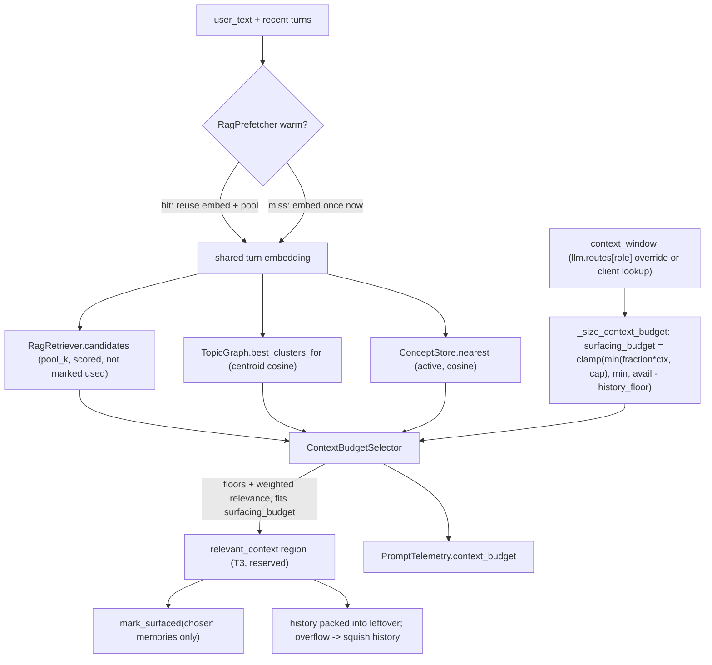

# Unified context budget (`relevant_context`)

One turn-relevance-scored selector decides what reaches Aiko's brain from her
long-term stores each turn. It replaces three independent, mostly-not-turn-aware
caps — memory `top_k`, the interest-map "top-N clusters by size" block, and the
concept "top-N by confidence" block — with a single **`relevant_context`**
region (prompt tier **T3**) that scores **memories + topic clusters + concepts**
against one shared per-turn embedding and fills a shared token budget with a
variable mix of all three.

The budget is a **fraction of the context window** (absolute-capped), so it
auto-scales from a 64k local model up to a large cloud window, and it is
**reserved before history is packed**. On overflow, history is squished first
while surfacing degrades gracefully and last.

Design source: the shipped "unified context budget" plan (a local, untracked
`.cursor/plans/` file — this document is the durable record).
North-star context: this is the delivery vehicle for progressively lightening
the fixed persona prompt so Aiko is more model-agnostic and driven by remembered
context (see [Concept backlog L23](personality-backlog/concepts.md) and the
"future style concepts" follow-on).

## Data flow



## Where it lives

- Region builder: `SessionController.build_relevant_context`
  ([`app/core/session/inner_life_part1.py`](../app/core/session/inner_life_part1.py))
  — owns the stores + hedging helpers, embeds the turn once (or reuses the
  prefetch), gathers candidates, runs the selector, renders the chosen subset,
  and marks only the budgeted memory subset used.
- Selector + dataclasses:
  [`app/core/session/context_budget_selector.py`](../app/core/session/context_budget_selector.py)
  (`ContextBudgetSelector`, `SourceBudget`, `ContextCandidate`,
  `ContextSelection`, `RelevantContext`).
- Sizing + integration:
  [`app/core/session/prompt_assembler_helpers_mixin.py`](../app/core/session/prompt_assembler_helpers_mixin.py)
  (`_size_context_budget`, `set_context_budget_sizing`,
  `set_relevant_context_provider`) and
  [`prompt_assembler.py`](../app/core/session/prompt_assembler.py)
  (`assemble_with_budget` reserves the region before history).
- Knobs: `memory.context_budget_*` in
  [`memory_settings.py`](../app/core/infra/memory_settings.py); see
  [`configuration.md`](configuration.md).

## Sizing math (reserved before history)

The assembler builds the whole system prompt **except** the region first
(`system_base`), measures its tokens, then reserves the surfacing budget so the
conversation is never starved by surfacing. With
`budget_tokens = context_window - response_budget - _SAFETY_TOKENS`:

```
avail   = max(0, budget_tokens - system_base_tokens - user_tokens)
target  = min(int(context_budget_fraction * context_window),
              context_budget_max_tokens)
hi      = max(0, avail - context_budget_history_floor_tokens)
surfacing = min(target, hi)
if hi >= context_budget_min_tokens:
    surfacing = max(surfacing, context_budget_min_tokens)
surfacing = clamp(surfacing, 0, hi)
history_budget = avail - surfacing        # packed by the existing _fit_history
```

- **`target`** = the fraction of the window, hard-capped so a 200k model does
  not try to surface "200k of memories".
- **`hi`** = what is left after protecting the history floor — this term is what
  guarantees the conversation never gets crowded out.
- **`min_tokens`** floors surfacing on small windows, but only when the history
  floor still fits (it never overrides `hi`).

The region text is also **hard-clipped** to `surfacing_budget` as a final safety
net after rendering, so per-item token estimation error can never let the region
exceed its reservation.

## Degradation ladder (overflow -> squish history first)

`_size_context_budget` returns `(surfacing_budget, degrade_level)`. This inverts
the old `aggressive` path, which blanked RAG/concepts *first*:

1. **`degrade_level=0` (normal).** Reserve `target`; history shrinks to fit. When
   history is trimmed to make room, the background summariser catches up on later
   turns (synchronous compaction was removed in P20 — this turn just packs less
   raw history while the T2 summary absorbs the tail).
2. **`degrade_level=1` (history floor bit).** `avail - history_floor < target`, so
   surfacing is clamped down toward `min_tokens`; the selector drops the
   lowest-weighted-relevance survivors first, floors survive.
3. **`degrade_level=2` (`aggressive`).** Keep the region at **per-source floors
   only**, blank the ambient/detector blocks (as before), and trim history
   harder — but do **not** fully blank `relevant_context` unless even the floors
   don't fit. Only when `avail <= 0` (or the budget is disabled) does the region
   render empty.

## The selector

`ContextBudgetSelector.select(candidates_by_source, budget_tokens, degrade_level)`:

0. **Pinned always-on lane** — admit any `ContextCandidate.pinned` items first,
   in native order, **exempt from `min_relevance` and the source `cap`** (still
   budget-clipped). This is how the identity lane (below) enriches every turn
   without competing for the relevance slots.
1. **Filter** each source's non-pinned candidates by its `min_relevance`
   (turn-relevance cosine floor) and normalise relevance to `[0,1]`.
2. **Floors** — reserve each source's `floor` items (highest-relevance first,
   above `min_relevance`) until its floor token cost is met, so every source gets
   a guaranteed toehold.
3. **Weighted greedy fill** — merge the remainder, sort by
   `relevance * weight`, and greedily add while it fits under `budget_tokens` and
   the per-source `cap` (the cap counts only the non-pinned relevance picks).
4. **Degrade** — at `degrade_level >= 1` shrink the effective budget and drop the
   lowest-weighted survivors; at `degrade_level == 2` keep floors only (pinned
   items still survive).

### Always-on core lane (L27)

Some concepts are core rather than topical — high-confidence concepts describing
who the user is, what they and Aiko **value**, and *how she wants to behave*.
These rarely score high in cosine to a given turn, so a pure relevance selector
would almost never surface them.

Which kinds join this lane is **declared per-kind in the `ConceptKind`
registry** (`core_always_on=True`, plus an optional per-kind
`core_min_confidence` bar), not hardcoded — a new kind (value, boundary, …)
opts in with one registry field and auto-joins. `build_relevant_context` calls
`ConceptView.core_lane(...)`, which:

- gathers each core kind's active concepts above its bar (per-kind
  `core_min_confidence`, else the global `context_budget_core_min_confidence`),
- **balances** them across `(kind, subject)` buckets — strongest bucket first,
  then round-robin — so no one kind crowds out the rest, and both the
  user-model and Aiko's self-model (`subject=aiko`) reach the brain,
- returns up to `context_budget_core_cap` concepts.

Two kinds mine into this lane today: `identity` (bar = the global
`context_budget_core_min_confidence`) and `value` (L10 — its own higher
`core_min_confidence=0.85`, since a stated principle should only assert every
turn once it's very settled).

Those are marked `pinned`, deduped against the turn-relevant concept pool by
`concept_id`, and the selector guarantees them (budget permitting) on top of the
relevance picks. Each surfaced concept's `pinned` flag is recorded in the
per-turn concept trace (visible via the MCP `get_last_concept_trace`). Set
`context_budget_core_cap = 0` to disable the lane. Per-kind bars key naturally
off the L16 plasticity bands (sticky value/boundary kinds earn a higher bar
than fluid tastes).

A per-concept anti-nag cooldown (so the same core concept isn't pinned on every
single turn) is the remaining L27 refinement; it's deferred to avoid hiding the
self-model on alternating turns.

*(Legacy `context_budget_identity_cap` / `context_budget_identity_min_confidence`
config keys still parse into the renamed `core` knobs.)*

#### The openness reserve (L28)

The kinds that opt into this lane — `identity`, `value`, `boundary`,
`generalization` — are two **anchors** and two **guides** (see the role axis in
[`concept-integration.md`](concept-integration.md)); no `generative` kind is
eligible. With a core cap of 15 that meant up to 15 concepts pinned into every
turn, not one of which *could* be an aspiration, taste, pursuit or tension —
structural, so no weighting reached it.

`core_lane(..., openness_slots=)` reserves `concept_core_openness_slots`
(default 2) of the cap for the strongest generative-role concepts drawn from
those ineligible kinds, ranked by `importance x confidence` and gated on
`concept_core_openness_min_confidence` (0.5 — pinning a half-formed aspiration
into every turn is worse than pinning nothing). An unfilled reserve falls back
to the normal lane, so nothing is wasted, and reserved picks use the same banded
rank and `concept_id` tiebreak as the rest of the lane: the pin moves only when
the underlying concept moves, which is what the cache-prefix-sensitive tier
requires. `0` restores the pre-L28 lane exactly.

Three properties of the draw were corrected once it was measured on a real
graph (see **L28m** in [`concepts.md`](personality-backlog/concepts.md)):

- **Kinds rotate before subjects.** Drawing flat `(kind, subject)` buckets by
  confidence gave both of the live graph's two slots to `aspiration`
  (`user` + `aiko`), so `taste` and `pursuit` were unreachable no matter how
  much supply they grew. The reserve now takes one kind at a time and balances
  subjects *within* a kind, which is what makes the slot count buy breadth.
- **Not every generative kind may hold a pin.** Two registry flags, read by
  the reserve, the flex lane, the hypothesis lane and the renderer alike, so
  they share one source of truth instead of three copies of
  `kind == "tension"`. `ConceptKind.static_render` says whether a kind may
  render in this block at all (no kind sets it false today).
  `ConceptKind.pinnable` says whether it may occupy a slot *regardless of the
  turn* — false only for `tension`, because a standing friction nailed into
  every turn defeats the L12 cooldown. Since H10 a tension does reach this
  block, through the flex lane's generative floor, where it has to earn the
  slot against what was actually just said.
- **The reserve rotates.** `openness_rest` carries the caller's habituation
  read into the draw (the view owns no clock), so the pick prefers rested
  concepts and cannot pin the single strongest aspiration forever. The
  ordinary lane gets its rotation from over-fetching `core_cap * 3`; the
  reserve cannot, because it is sized against the real cap and sits at the
  head of the returned list.

The flex lane gets the matching correction (`concept_flex_generative_floor`) —
it is tilted rather than closed, so the fix is a floor on the ranked pick rather
than a change to the scorer. Both are documented together in
[`configuration.md`](configuration.md#openness-and-worker-diets-l28--what-she-can-reach-past).

It returns a `ContextSelection` (chosen items per source + scores + token usage +
dropped counts) used for rendering and telemetry. Per-source `weight` biases the
mix — concepts default slightly above memories (`1.1` vs `1.0`) so a
strongly-matching learned belief can win a slot, clusters slightly below (`0.9`).

**Quality floors that still live below the selector** (not replaced by
`min_relevance`, which is an *additional* turn-relevance gate): the cluster
**min-size** gate (`TopicGraph._min_cluster_size`) and the concept **confidence /
status** gate (only `status="active"` concepts are candidates). Clusters and
concepts are also cold-start gated by `TopicGraph.mature()` (L21).

## Speculative pre-fetch reuse

The embed is the expensive part of the turn. While the user is still talking, the
[`RagPrefetcher`](../app/core/rag/rag_prefetcher.py) embeds growing STT partials
once and gathers the scored candidate **pool** via `RagRetriever.candidates`
(`pool_k`, **without** marking anything used), caching the embedding + hits under
a TTL keyed by normalised prefix.

`build_relevant_context` consults it via `lookup_pool(user_text)` before doing any
work: on a warm prefix match it reuses both the embedding and the pool (skipping
the synchronous embed + retrieval); otherwise it embeds and gathers live. The
memory subset that actually makes the budget is stamped used via `mark_surfaced`,
so speculative pre-fetches never pollute `use_count` / `last_used_at` for
memories that never surface. The hit/miss/skip outcome rides back on
`RelevantContext.prefetch_event` into `PromptTelemetry.rag_prefetch_event`.

## Observability

`PromptTelemetry.context_budget` (surfaced on the last-prompt / system-prompt
browser and MCP `get_last_response_detail`) records the resolved
`surfacing_budget` (reserved) vs used tokens, per-source counts / tokens / top
scores, dropped-for-budget counts, and `degrade_level`. `concepts_surfaced` and
`rag_prefetch_event` are populated from the same region result.

### Why is this concept here? (L35)

The surfacing scorer collapses six signals into one number, which makes the
*ranking* legible but the *choice* opaque. Every entry in `concepts_surfaced`
(MCP `get_last_concept_trace`) therefore carries a **surface reason** naming the
signal that won it its slot:

| Reason | Meaning |
|---|---|
| `core_belief` | pinned by the always-on core lane — never scored against the turn |
| `association` | reached only via spreading activation; no cosine to the turn at all |
| `topic_match` | context (label cosine) was the dominant term |
| `high_confidence` / `settled_belief` | confidence, or confidence damped by how sticky the concept is |
| `recently_reinforced` | fresh evidence landed on it |
| `unresolved_contradiction` / `recently_revived` / `loosening_boundary` / `newly_promoted` | a lifecycle event charged its salience — the specific event is named |
| `recent_change` | salience won, but no recognised event drove it |

Two lanes answer themselves: core is pinned before any scoring happens, and an
activation-lane concept had no direct relevance to the turn, so association is
the only possible cause. For everything else the reason is the term with the
largest **weighted** contribution to `surface_score` — a high cosine against a
zero context weight won nothing. Recency is excluded when the concept has no
`last_reinforced_at`, since `recency_boost` neutral-defaults to its maximum
(`1.0`) and a missing signal must not be reported as the reason.

The reason is **debug-only**. It is never shown to Aiko: letting her read "I
surfaced this because we clashed on it" is the fastest route to a companion who
narrates her own machinery. `score` on the same entry holds the full breakdown
the reason was picked from.

## Knobs

All under `memory.` — full descriptions + defaults in
[`configuration.md`](configuration.md#unified-context-budget-relevant_context-region):

| Knob | Default | What |
|---|---|---|
| `context_budget_enabled` | `true` | master switch for the region |
| `context_budget_fraction` | `0.15` | share of context window reserved (clamped `[0, 0.8]`) |
| `context_budget_max_tokens` | `4096` | absolute ceiling regardless of window |
| `context_budget_min_tokens` | `256` | floor so surfacing never vanishes on small windows |
| `context_budget_history_floor_tokens` | `1024` | protected history slice |
| `context_budget_memory_pool_k` | `18` | candidate pool size — now also widens the retriever's per-source fan-out so the pool genuinely honours this many (also the prefetch pool) |
| `context_budget_{memory,cluster,concept}_floor` | `1` / `0` / `0` | guaranteed-minimum items |
| `context_budget_{memory,cluster,concept}_cap` | `8` / `3` / `3` | hard-maximum relevance items (excludes pinned core-lane concepts) |
| `context_budget_{memory,cluster,concept}_weight` | `1.0` / `0.9` / `1.1` | relevance multiplier |
| `context_budget_{memory,cluster,concept}_min_relevance` | `0.0` / `0.30` / `0.30` | turn-relevance floor |
| `context_budget_core_cap` | `2` | max pinned always-on core concepts across kinds/subjects (`0` disables the lane) |
| `context_budget_core_min_confidence` | `0.75` | global fallback confidence bar for the core lane (per-kind `core_min_confidence` overrides) |
| `concept_core_overfetch` | `1.5` | how deep the core lane draws relative to its cap, which is what decides how much of the pinned lane carries to the next turn — under `3` (with equal caps) some does, at or above it none does. At the live caps `1.5` keeps 53% and `3.0` kept 0% (P52) |
| `concept_core_openness_slots` | `2` | slots of that cap reserved for generative-role concepts otherwise ineligible for the lane (`0` disables the reserve) |
| `concept_core_openness_min_confidence` | `0.5` | bar a reserved pick must clear |
| `concept_flex_generative_floor` | `1` | swap the weakest selected guide for the strongest generative concept when the flex pick has none (`0` disables) |

**Tuning for small local models.** On a 64k window the defaults reserve roughly
`min(0.15*64k, 4096) = 4096` tokens for surfacing (minus the history-floor clamp).
Lower `context_budget_fraction` / `context_budget_max_tokens` to leave more room
for history + tools; raise them on a large cloud window if you want Aiko leaning
harder on remembered context.

## Retired knobs

Subsumed by the above and removed (leftover keys in `config/user.json` are
silently ignored — no migration): `agent.interest_map_enabled`,
`agent.interest_map_max_clusters`, `agent.interest_map_min_size`,
`agent.concept_block_enabled`, `memory.concept_surface_max_items`,
`memory.concept_surface_min_confidence`, and the `_RAG_BLOCK_MAX_FRACTION` 30%
memory-block clip.
