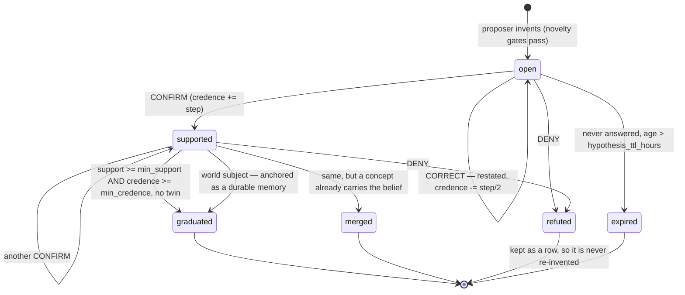

# Hypotheses (L30) — the things Aiko is not sure about

This is the **canonical reference** for the hypothesis layer: why it
exists, the vocabulary it introduced, the lifecycle a guess moves
through, and the invariants that keep a guess from being mistaken for a
belief. Read it before touching anything under "Implementation" below.

Its sibling is [`concept-lifecycle.md`](concept-lifecycle.md), which owns
the *belief* state machine. The two connect at exactly one place —
graduation — and the boundary is deliberately narrow.

**Implementation**

| Piece | File |
| --- | --- |
| Storage (`hypotheses` table + cosine mirror) | [`hypothesis_store.py`](../app/core/concepts/hypothesis_store.py) |
| Invention (L30c) | [`hypothesis_proposer_worker.py`](../app/core/proactive/hypothesis_proposer_worker.py) |
| Choosing what to ask (L30b) | [`concept_hypothesis_worker.py`](../app/core/proactive/concept_hypothesis_worker.py) |
| Reading the reply | [`answer_adjudicator.py`](../app/core/concepts/answer_adjudicator.py) |
| Applying the verdict | [`hypothesis_resolution.py`](../app/core/concepts/hypothesis_resolution.py) |
| Linking + the three exits | [`hypothesis_graduation.py`](../app/core/concepts/hypothesis_graduation.py) |
| Surfacing adapter | [`hypothesis_lane.py`](../app/core/concepts/hypothesis_lane.py) |
| The shared dedupe bar | [`concept_dedupe.py`](../app/core/concepts/concept_dedupe.py) |

## Why the layer exists

Everything else in the concept stack runs **backwards from evidence**. L2
reads memory clusters and names the abstraction over them; L3 waits for
enough of it; L17 rewords a belief when better observations arrive. That
pipeline is good at what it does and it has a hard ceiling: it cannot
produce a thought Aiko has not already been given the material for. A
mind that can only summarise its inputs never wonders anything.

There is a second gap, upstream of that one. The concept graph is full of
`candidate` rows — beliefs L2 proposed that have not earned promotion —
and before L30 the *only* thing that could resolve one was more passive
evidence arriving by luck. Aiko could hold a half-formed read on someone
for weeks with the answer one question away, and never ask.

So the layer has two halves, and they are the same machinery pointed in
opposite directions:

- **Ask and learn (L30b/L30c on the concept side).** Take a `candidate`
  concept she half-holds, put it to the user as a question, and fold the
  answer back into the graph. This resolves what already exists.
- **Invent (L30 Phase B).** Take what she knows and guess something that
  is *not* written anywhere, file it, and test it the same way. This
  creates something new to resolve.

The second half is why the `hypotheses` table exists at all. An invented
guess has no evidence, so it cannot live in `concepts` — see
[Invariants](#invariants).

### Goals

- Aiko can hold a question, not just a belief, and the difference is
  visible in the prompt.
- An unsettled belief gets resolved by asking rather than by waiting.
- She can reach past her own inputs: speculate, be wrong, and find out.
- A confirmed guess becomes an ordinary belief through the ordinary
  promotion gate — nothing about having guessed it grants it standing.
- The user's answer is the authority. A "no" ends a guess; a "not quite"
  improves it.

### Non-goals

- **Not a quiz.** The ask paths are budgeted by K47's question balance and
  capped at one ask per hunch; a turn that fills with questions is a bug,
  not a tuning value.
- **Not a second belief store.** Nothing reads `hypotheses` for what Aiko
  *thinks*. The prompt lanes that assert things read `concepts` only.
- **Not a confidence system.** Credence is a guess about a guess (see
  below); it does not decay, does not derive from evidence, and no
  lifecycle worker recomputes it.
- **Not a route around L3.** Graduation mints a `candidate`. A guess
  confirmed twice is not a promoted belief.

## Credence is not confidence

These are two different numbers and conflating them is the easiest way to
break the layer. The distinction:

| | `concepts.confidence` | `hypotheses.credence` |
| --- | --- | --- |
| Means | how well-established the belief is | how likely Aiko thinks the guess is |
| Source | **derived** — a logistic of distinct evidence sources | **asserted** — the proposer's own estimate, then moved by answers |
| Who writes it | L3 only (plus two sanctioned exceptions) | the resolver, on an answer |
| Decays | yes, over engaged time | **no** — an untested guess is exactly as plausible next month, just staler |
| Recomputed | every lifecycle tick | never |
| Range meaning | 0.97 cap; floors drive status transitions | a prior, nothing more |

The consequence that matters in code: because nothing revisits credence,
**an answer has to be conclusive here or nowhere**. That is why the two
sides are asymmetric — a denied *concept* loses conviction and keeps
living, because L3 will re-derive its confidence from the evidence next
tick; a denied *hypothesis* closes outright, because nothing will ever
look at it again.

`hypothesis_lane.InventedRow` deliberately reports `confidence = 0.0` and
`distinct_source_count = 0` rather than mapping credence onto them. A
caller asking an invention for its confidence is asking a question with
no honest answer, and answering with credence would let it be ranked as
though it had evidence.

## Unsettledness — what makes a row worth raising

Both pools are ranked by `unsettledness()`
([`concept_hypothesis.py`](../app/core/concepts/concept_hypothesis.py)),
which blends **grounding breadth** (60%) with **lack of conviction**
(40%) and **deliberately ignores age**. It reads whichever pair the row
actually has: `distinct_source_count` / `confidence` for a concept,
`support_count` / `credence` for a hypothesis.

Ignoring age is the counter-intuitive part and it was measured. Most
`candidate` concepts are not doubts — they are beliefs waiting out
`concept_promote_min_age_days`, and an answer cannot move them because
what they lack is time, not evidence. On a live 261-candidate graph,
**144** had cleared every evidence and confidence bar and were held back
by age alone. `ConceptView.testable()` exists to exclude exactly those:
it asks each concept's own `promotion_gate` which legs are unmet and
drops the rows where age is the only one.

## Lifecycle

`open` and `supported` are the two **live** statuses; everything else is
terminal. A terminal row is never deleted — the proposer's novelty check
reads refuted rows precisely so a guess the user already turned down does
not come back.

### Transitions and the setting that governs each

| Transition | Condition | Setting(s) |
| --- | --- | --- |
| `[*] → open` | the proposer's LLM returned a statement that cleared **both** novelty gates and the shelf had room | `hypothesis_min_novelty`, `hypothesis_concept_novelty`, `hypothesis_max_open`, `hypothesis_invention_max_per_run` |
| `open → expired` | **never answered** (`last_tested_at IS NULL`) **and** age past the TTL. Exemption is on having been *answered*, not on having been *asked* — see the deadlock note below | `hypothesis_ttl_hours` |
| `open/supported → supported` | adjudicator returned `CONFIRM`; `support_count += 1`, `credence += step`, the answer memory is remembered on the row | `hypothesis_credence_step` |
| `open/supported → refuted` | adjudicator returned `DENY` — closes immediately, one "no" is enough | `hypothesis_credence_step` |
| stays `open` | adjudicator returned `CORRECT` — the statement is **rewritten** to the user's wording and re-embedded, at half the credence penalty | `hypothesis_credence_step` |
| (no write) | adjudicator returned `UNCLEAR` | — |
| `supported → graduated` | `is_ready()`: live, `refute_count == 0`, `support_count >= min_support`, `credence >= min_credence` — and no concept matched | `hypothesis_graduate_min_support`, `hypothesis_graduate_min_credence` |
| `supported → merged` | same bar, but the duplicate lookup found a concept carrying the belief | `concept_dedupe.DEDUPE_COS` |
| `supported → graduated` (anchored) | same bar, `subject == "world"` — exits as a durable `fact` memory instead, and skips the duplicate check | — |

A **single** refutation disqualifies a row from graduating no matter how
many confirmations sit beside it. The "no" was about this belief; the
yesses may have been politeness.

### The three exits

Which one a proven guess takes is decided by the same duplicate lookup
that runs on every confirmation:

| Exit | What lands | Why it is distinct |
| --- | --- | --- |
| **graduated** | a new `candidate` concept carrying the answer memories as `evidence` edges | The step the layer exists for. L3's ordinary gate takes it from there. |
| **merged** | the answer memories attach to the concept that already held the belief; the row closes as `merged` | L17f and L19 should narrate "I turned out to be right about something I already knew" differently from "I was right about something new". |
| **anchored** | a durable `fact` memory (clustered by the topic graph like any other, which *is* the topic anchor) | A `world` guess — "espresso pucks channel when the grind is too coarse" — has no concept kind to become. |

### The duplicate race is the normal case

This is not an edge case and the design leans into it. A confirmed
hypothesis stores the user's answer as an ordinary memory. That memory is
clustered like any other, and **L2 proposes a concept from it knowing
nothing about the hypothesis**. L2 needs one confirmation where
graduation needs two — so L2 usually gets there first, and "my guess
turned out to be something I already believe" is the *usual* ending of a
successful hypothesis.

Three consequences:

1. `link_if_duplicate` runs after **every** confirmation, not only at
   graduation, so `linked_concept_id` is stamped at the earliest moment
   it can be.
2. A linked row stops being offered to the surfacing lane. Otherwise the
   lane would muse about the concept and ask about the guess in the same
   turn, as two open questions about one belief.
3. Graduation on a linked row takes the merged exit rather than forking a
   near-twin into the graph.

The lookup uses `kind=None` — across kinds within the subject — because
the proposer's guessed kind carries no authority. L2 may have filed the
same belief under a different taxonomy, and filtering on kind would miss
the duplicate and fork the graph on a disagreement about labels. It also
matches `retired` and `dormant` concepts: a belief Aiko used to hold is
still the same belief, and arriving at it again should revive its history
rather than start a second row from nothing.

## How a guess reaches the conversation

Two paths, and they are different mechanisms.

**Musing (the L30a lane, T3.)** The tentative register inside
`relevant_context`. Up to `context_budget_hypothesis_cap` rows, **one per
origin**, phrased as questions rather than conclusions. Grounded rows get
"you've half-noticed"; invented rows get their own weaker header that
says outright they rest on nothing. One-per-origin is applied *before*
the context budget, because L32 importance blends a kind prior with the
emotional charge of grounded topic clusters — an invention has no
grounded memories, falls back to the bare prior, and would lose a shared
slot nearly every time.

**Asking (the `concept_hypothesis` cue, T6.)** The only **dual-mode** cue
in the pool: it can surface on topical relevance mid-conversation, *or*
on a typed gap through the gap-cue mutex, where it sits last because
probing a belief about the user is the heaviest thing she can open a gap
with. See [`cue-pool.md`](cue-pool.md) for the mechanics and why its
`CueSpec` carries no `slot_attr`.

Both are gated by K47's question balance, and they guard against each
other: the lane records the ids it surfaced
(`_last_hypothesis_lane_concept_ids` / `_..._hypothesis_ids`) and the T6
provider filters them out, so a turn cannot muse about a belief and then
ask about it. When the K47 gate is armed the lane keeps the musing and
drops only the invitation to follow up — the thought costs the user
nothing; the question is what the budget governs.

**Looking (the `recall_hypotheses` tool.)** Two bullets in a prompt
cannot answer "what are you still not sure about with me?". The tool
returns both origins with `origin` stated, least settled first, so she
answers from the record instead of confabulating a list or denying she
has any. See [`tools.md`](tools.md).

## Reading the reply

[`answer_adjudicator.py`](../app/core/concepts/answer_adjudicator.py) is
**target-agnostic** — "did they agree?" does not depend on what kind of
row the belief lives in — and runs in two stages:

1. **Echo gate** (no LLM). Does the reply plausibly answer *this*
   question at all, by shared vocabulary or by cosine against the cue's
   embedding *or* against the previous assistant turn (the words she
   actually asked) at `concept_hypothesis_answer_threshold`? The bar is
   low on purpose: this separates "answering me" from "talking about
   something else", and "yeah, kind of" is the archetypal answer to a
   hunch and shares no words with it.
2. **One small LLM call** returning `CONFIRM` / `CORRECT` / `DENY` /
   `UNCLEAR`. `classify_pair` is then used in one direction only — to
   **downgrade** a confirm when the reply is definitely opposed. It never
   upgrades anything.

The asymmetry is intentional: a false `CONFIRM` writes a belief the user
never endorsed, while a false `UNCLEAR` merely loses one answer.

`max_asks = 1`. Every other question type may circle back after a day;
this one may not, because re-asking whether a hunch about *them* is true
reads as doubting the first answer rather than as curiosity. An LLM
dodge therefore retires the cue. An echo miss or a missing classifier
does **not**: the cue stays `awaiting` (stage B skips this type) for up
to three later user turns or 24 hours. Listening longer is not asking
again.

A guess that already has one *asked* confirmation can pick up a second
from a later turn that echoes the statement, without a second question
(`_listen_supported_hypotheses`). That is how `min_support = 2` is
reachable under `max_asks = 1`. A row that was never asked is never
scored this way.

## Invariants

- **An invention never touches the concept graph before it graduates.**
  This is the reason for a separate table rather than a `speculative`
  concept status. Every concept read path filters on `status`, and one
  missed filter would put a made-up statement into the T0 profile block
  as something Aiko asserts. A separate table makes that failure
  impossible rather than merely unlikely. Guarded by
  `test_hypothesis_graduation.IsolationTests` and
  `test_hypothesis_store`'s isolation tests.
- **Credence and confidence are never mixed.** No code path assigns one
  to the other; `InventedRow` reports zero rather than translating.
- **Graduation mints a `candidate` at the default confidence.** It sets
  neither `confidence` nor `status` on the concept it creates or merges
  into. Having been guessed correctly twice is not evidence of anything
  beyond the two answers, which are already attached as edges for L3 to
  count.
- **One dedupe bar.** Both the graduation path and L2 synthesis go
  through [`concept_dedupe.find_duplicate`](../app/core/concepts/concept_dedupe.py)
  at `DEDUPE_COS`. Two independently-tuned thresholds would agree for
  months and then silently diverge.
- **One ask per hunch, one lane slot per origin — and the ask is spent
  when the question is *put*, never when the cue is queued.** These are
  three different events (queued → rendered → asked) and conflating the
  first with the last deadlocked the whole layer on the live graph.
  `asked_count` used to be bumped in `_publish_invented`, reasoning that a
  cue in the pool is a question asked. It is not: the shelf renders a
  `concept_hypothesis` about once a day by policy
  (`surface_cooldown_hours=20`) while the proposer queues several, so **22
  of 26 cues were never rendered at all** — and each of their rows still
  counted as asked, which made it simultaneously un-re-askable (the ask
  worker filters `asked_count <= 0`) *and* un-expirable (the TTL skipped
  asked rows). Twelve such rows filled `hypothesis_max_open` and invention
  stopped permanently, reported only as a healthy-looking
  `skipped: max_open`. Two changes hold the invariant now:
  `SessionController._stamp_hypothesis_ask` owns the counter and moves it
  where the cue reaches `awaiting`, and a `source_id` on the cue payload is
  what stops a second cue being drafted for the same guess — the job
  `asked_count` had been doing by accident. Expiry exempts *answered* rows
  rather than asked ones, so a question put a fortnight ago that never got
  a reply can still age out instead of holding a slot for good.
- **Production is rate-matched to spend, per origin.** `ConceptHypothesisWorker.run`
  counts the pending cues of each `target_type` and skips the pool that
  already holds its share of `inventory_target` (2, so one each). The
  interval is a heartbeat, not a licence: the scheduler admits a worker
  even at zero pressure, so before H7 this drafted every 30 minutes into
  a shelf that spends about 1.2 cues a day — 45 rows deep with 13
  superseded, the good questions buried under the merely recent ones and
  expiring unasked at 168h. The split is per origin because a grounded
  question and an invented guess do not substitute for each other; on one
  shared counter whichever pool had stock would silence the other.
- **A terminal row is kept, not deleted.** A `refuted` row is what stops
  re-invention — but an `expired` one is not. Expiry means she never got
  round to asking, so nothing was learned about the guess and the row can
  never be asked now (it is closed). Letting it block would retire that
  ground permanently on the strength of her own inattention, which over
  months is the exact sterility `hypothesis_min_novelty` sits high to
  avoid. `_nearest_hypothesis` therefore matches every status *except*
  `expired`.
- **A live link always points at a concept that exists.** Linking is what
  makes a row go quiet: the ask worker filters `linked=False`, the lane
  skips it, `open_hypotheses` drops it. There is self-healing in
  `link_if_duplicate`, but it only runs on the next confirmation — which a
  row nobody can ask about will never get. So `delete_concept` calls
  `HypothesisStore.unlink_concept`, or the row would sit `live`,
  invisible and unfixable, holding one of twelve slots for good.
  `graduated_concept_id` on a *closed* row is deliberately left alone: it
  is the record of where a guess went, and losing the trail is worse than
  a dangling id nothing reads.
- **Graduation attaches only answers that still exist.** The
  `answer_memory_ids` were collected over earlier turns, so one can have
  been deleted since; attaching it anyway would hand the new concept a
  distinct source that is not there for L3 to promote on.
- **The proposer never writes a concept, and the resolver never promotes
  one.** L3 remains the single writer of concept `status`; the two
  sanctioned `confidence` exceptions are documented in
  [`hypothesis_resolution.py`](../app/core/concepts/hypothesis_resolution.py)
  and [`code-conventions.md`](../rules/code-conventions.md).

## Settings

All of these live on `MemorySettings`
([`memory_settings.py`](../app/core/infra/memory_settings.py)) except the
two master switches; full prose for each is in
[`configuration.md`](configuration.md).

| Setting | Default | Governs |
| --- | --- | --- |
| `agent.concept_hypothesis_ask_enabled` | `true` | the whole ask-and-learn loop (worker + provider + resolver) |
| `agent.hypothesis_invention_enabled` | `true` | the proposer only — the ask loop keeps working on grounded candidates |
| `tools.recall_hypotheses` | `true` | the "what am I unsure about?" tool |
| `hypothesis_surfacing_enabled` | `true` | the L30a musing lane |
| `context_budget_hypothesis_cap` | `2` | rows in the lane (one per origin) |
| `context_budget_hypothesis_weight` | `0.7` | lane weight — below the confident concept lane on purpose |
| `context_budget_hypothesis_min_relevance` | `0.35` | how on-topic a musing must be |
| `hypothesis_min_unsettled` | `0.22` | how far from settling a belief must be to count as open |
| `hypothesis_min_sources` | `1` | minimum evidence for a *grounded* open question |
| `concept_hypothesis_interval_seconds` | `1800` | ask-worker heartbeat (no LLM); actual drafting is gated on per-origin stock |
| `concept_hypothesis_max_per_run` | `1` | cues queued per run, per pool |
| `concept_hypothesis_min_gap_hours` | `4.0` | typed gap that arms the fallback ask path |
| `concept_hypothesis_gap_min_importance` | `0.55` | importance floor for the gap path only — for an invented cue this is a kind whitelist, not a dial (H7; see [`configuration.md`](configuration.md)) |
| `concept_hypothesis_answer_threshold` | `0.45` | echo-gate cosine |
| `concept_hypothesis_deny_penalty` | `0.25` | confidence penalty on a denied *concept* |
| `hypothesis_invention_interval_seconds` | `5400` | proposer cadence (one LLM call) |
| `hypothesis_invention_max_per_run` | `2` | rows written per proposal batch |
| `hypothesis_max_open` | `12` | hard ceiling on live rows |
| `hypothesis_min_novelty` | `0.88` | reject a re-invented guess (high: over-rejecting sterilises the layer) |
| `hypothesis_concept_novelty` | `0.82` | reject speculation about something she already believes (stricter: the failure is worse) |
| `hypothesis_ttl_hours` | `336.0` | TTL for a never-asked row |
| `hypothesis_graduate_min_support` | `2` | independent confirmations needed to exit |
| `hypothesis_graduate_min_credence` | `0.7` | credence needed to exit |
| `hypothesis_credence_step` | `0.2` | how far one answer moves credence |

## Debugging

### The panel

**Settings → Memory → Hypotheses** is the fastest way in, and it is the
only surface that shows the *whole* shelf. Everything else reads
`open_hypotheses`, which drops closed and linked rows because Aiko should
not muse about a guess that is finished or one a concept already speaks
for — and those are exactly the rows that explain a silent lane. The
panel reads `hypothesis_shelf` instead.

The header separates the four "nothing is happening" states, which look
identical from the chat window:

| What the header shows | What is actually wrong |
| --- | --- |
| `0 of 12 live`, empty status counts | bare shelf — nothing has been invented |
| `12 of 12 live`, `12 linked` | full, but every row is spoken for by a concept, so the lane has nothing to raise |
| rows present, `asked 0` across the board | the invention side is fine; the ask worker is not picking them |
| rows with `asked 1` and no answer | the cue was queued but never fired — go to the Cues sub-tab, the cue is the thing to look at |

Its two run buttons are `invent now` and `queue ask`. Queuing is not
asking: the cue still waits for a topic match or a typed gap.

Each invented row offers `confirm` / `correct` / `deny`, each opening a
small textarea for what the user would have said, and `delete`. **The
text on a confirm is not cosmetic** — it is stored as the ordinary
memory the live path stores, and a graduated concept's evidence edges are
built from exactly those memories. A confirm with no text would mint a
concept resting on nothing, which L3 demotes on its next tick, so it is
refused. Two confirms with text walk a guess from invented to graduated
in about a minute, which is the whole reason the panel exists: the real
path needs two adjudicated answers across two conversations.

`delete` and `deny` are not interchangeable. A denied row survives as a
`refuted` row precisely so the novelty gate will not re-invent the guess;
deleting leaves nothing behind, so the same guess can come back. Delete
is for clearing out test rows.

Grounded rows are read-only. A candidate concept has no hypothesis row,
so a verdict there belongs to the concept write path and deleting belongs
in the Concepts panel.

Only two settings are editable in the panel — `invention` and `asking`.
Both workers re-read `settings.agent` on every tick, so those take effect
live. The cadences, `hypothesis_max_open`, both novelty bars and the TTL
are captured when the workers are built, so a control for them would
appear to work and change nothing until a restart; the panel says so
rather than lying.

### Over MCP

Start with the two reads, in this order:

- `get_hypothesis_state` — stock against the caps. `live` at zero means
  the shelf is bare; `live` at `max_open` with a high `linked` count
  means everything on it is already spoken for by a concept and will
  never surface, which is the usual explanation for a quiet lane. `live`
  at `max_open` with everything **`asked_count > 0` and `last_tested_at`
  null** is the other one, and it used to be terminal — see the one-ask
  invariant above.
- `get_hypotheses` — the rows themselves, least settled first, with
  `origin` distinguishing invented from grounded.

Then, depending on the symptom:

- **Nothing is ever invented** → `force_hypothesis_invention` and read
  the rejection counts. A high `rejected_already_believed` means the
  invention prompt is paraphrasing the profile instead of reaching past
  it; a high `rejected_duplicate` means the shelf already holds the same
  ground.
- **Rows exist but she never asks** → `force_hypothesis_ask` to queue,
  then `get_cue_pool_state` to watch the cue, then `send_message` with a
  topically-related line to trigger the provider. Remember that queuing
  is not asking — and check the *ratio* while you are in there. A pool
  holding many `pending` `concept_hypothesis` cues with
  `surfaced_count = 0` means the producer is outrunning the 20-hour
  render cadence, so most of them will hit the 7-day cue TTL without ever
  being put. That is throughput, not breakage: the rows they point at stay
  askable, which is the whole reason the ask is no longer spent at queue
  time.
- **She asked and nothing was learned** → the answer went through the
  adjudicator; `get_last_response_detail` plus the
  `app.session` / `app.answer_adjudicator` log lines show the verdict.
  An `UNCLEAR` on a real answer usually means the echo gate. Since H7
  that gate holds the cue instead of expiring it; `python
  scripts/cue_reach_report.py` prints expire reasons (`off_subject`,
  `awaiting_timeout`, LLM dodge) next to the funnel. A later on-subject
  turn should still land. A `supported` row stuck at `support=1` after
  an asked confirm is waiting on H44's ambient listen, not a second ask.

### REST

| Route | What it is for |
| --- | --- |
| `GET /api/concepts/hypotheses` | the Aiko-facing read: live, unlinked rows only, both origins unified. Backs `recall_hypotheses`. |
| `GET /api/concepts/hypothesis-state` | stock against the caps, on its own |
| `GET /api/concepts/hypothesis-shelf` | the debug read: every status, linked rows included, full lifecycle per row. What the panel uses. |
| `POST /api/concepts/hypotheses/run` | one proposer pass |
| `POST /api/concepts/hypotheses/ask` | one ask-worker pass (queues cues) |
| `POST /api/concepts/hypotheses/{id}/verdict` | force a `confirm` / `correct` / `deny`; body `{verdict, text}`. Returns a before/after diff. |
| `DELETE /api/concepts/hypotheses/{id}` | drop one row; touches no memory or concept |

The two master switches are in the `companion` block of
`GET` / `PATCH /api/settings`, not under `memory`, because they are the
only two hypothesis knobs a live PATCH can actually change.
