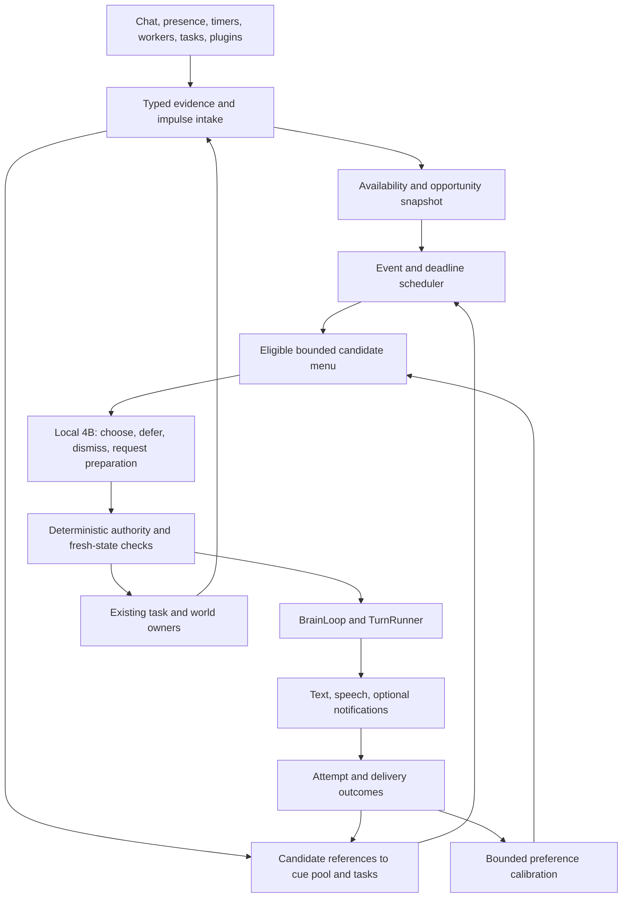

# Live initiative: from presence to independent behavior

**28 Sep 2026. Architecture evaluation and implementation backlog only.** All
L19-L31 entries below are **open**. No runtime code, settings, model routes,
permissions, or live relationship state were changed for this review.

This continues [Live mode](live-mode.md), including shipped L17 deferral and
L18 exact cue handoff. It does not propose another companion model, another
conversation loop, or a second memory system. It replaces several local
heuristics with an explicit lifecycle for grounded initiative.

## Recommendation

Keep `BrainLoop`, `TurnRunner`, the cue pool, concept/memory stores, tasks,
and the Live impulse/embodiment layers. Rework the middle:

**evidence -> durable candidate -> suitable opportunity -> small-model
decision -> authorized brain/task action -> delivery/result -> learning.**

The current system is much better equipped to react quietly than to originate
and carry through a thought. More gesture enums, a larger policy prompt, or
lowering every speech gate will not fix that lifecycle. Restore an observable
end-to-end path first, then expand what can originate a candidate.

The product target is a companion with ongoing interests, occasional
conversation, useful follow-through, and independent background activity.
Independence means she can choose and complete permitted work without another
chat turn; it does not mean inventing experiences, ignoring consent, or
requiring the user to keep responding. The small model decides among bounded
next actions. The main brain gives a thought its voice and reasons about work
that exceeds the policy model's remit.

## Evidence and limits

### Running snapshot

A read-only `get_live_situation_frame` snapshot observed at
**2026-09-28 17:24:33 UTC** reported:

| Signal | Observation |
| --- | --- |
| Posture and permission | `live_presence`; quiet off; unprompted speech on |
| Runtime | Heartbeat running; policy loaded; no policy call in flight |
| Recorded executions | 74: 36 `attend`, 38 `acknowledge_user` |
| Main-wake execution counters | 0 proposed, 0 admitted, 0 rejected, 0 silent |
| Brain handoff | 0 proactive turns enqueued |
| Budgets | No exhausted classes; main-wake token available; configured ceiling 6/hour |
| Scheduling and candidates | No current wait; no active candidate urges |
| Retained urge tail | 12 expired rows; 11 cue rows with `opportunity_seen=true` |
| Last policy call | About 1.72 seconds; 1,901 reported input tokens |

These are process-local counters and a bounded tail, **not** a 12/12 lifetime
expiry rate, a measured eligible-hour rate, or proof every cue deserved speech.
The `main_wake_proposed` counter increments inside `_execute_main_wake`, after
initial arbitration: zero does not rule out a model speech proposal rejected
earlier. The executing process's source revision was not verified. In
particular, its last-call region report omitted the transcript region that
the checkout's prompt assembler now includes. Do not treat this snapshot as
an evaluation of every latest patch.

The supported conclusion is narrower and useful: this process recorded Live
activity without any main-wake reaching that execution stage. Investigate
candidate admission and scheduling before blaming TTS or increasing volume.
No private conversation, cue subjects, personal concepts, or activity titles
are needed in the backlog or future reproduction fixtures.

### Source findings

| Priority | Verified mechanism | Consequence and owner |
| --- | --- | --- |
| P0 | [Silence dispatch](../../app/core/session/task_orchestration_mixin.py) publishes `silence.wake` and returns instead of calling the old director in Live posture. [Silence urges](../../app/core/live/urge_store.py) are `remain_present`, not substantive speech candidates. | Silence alone supplies neither content nor a substantive candidate. Preserve that distinction, but supply a grounded continuation/share path: L22/L25. |
| P0 | [Heartbeat scheduling](../../app/core/session/live_mode_mixin.py) promotes `idle.reconsider` only after an existing wait expires. [Controller](../../app/core/live/controller.py) ignores `data_only`; non-wait actions need not leave a future wake. | An active heartbeat is not a liveness guarantee. With no wait and no new semantic event, policy can remain dormant: L19/L22. |
| P0 | [Inclination](../../app/core/live/inclination.py) projects cues during frame updates and calls `note_opportunity` from a floor/admission predicate, including on a heartbeat. It does not require a completed model evaluation. | A cue can have a nominal opportunity without ever being considered. L17's missed-opening rescue then does not apply: L21. |
| P0 | [Urge store](../../app/core/live/urge_store.py) gives cue asks/shares 45 seconds, does not renew on merge, and blocks identical evidence after expiry. L17 only defers cues with no recorded opportunity, once, within 15 minutes. | Durable subject lifetime and immediate action lifetime are coupled. A still-pending cue can disappear from Live without being declined or delivered: L21. |
| P1 | [Cue adapter](../../app/core/live/cue_adapter.py) maps only a few types to share/continue; other known types default to ask. [Curiosity seeds](../../app/core/proactive/curiosity_seed_worker.py) already distinguish person and subject interests; [associative cues](../../app/core/proactive/cue_accounting.py) can be spoken shares. | Source intent is lost. Question-blocking can suppress material that did not require a question: L23/L25/L27. |
| P1 | [Live cue intake](../../app/core/session/live_mode_mixin.py) reads eight rows. [Pending order](../../app/core/proactive/cue_store.py) favors lowest surfaced count, then newest; adapter eligibility filtering occurs after this limit. | Blocked/repeated rows can occupy the page while useful candidates below it are invisible. L21/L23 need eligibility-aware fair selection, not a larger blind limit. |
| P1 | [Inclination](../../app/core/live/inclination.py) schedules a wait when any budget class is exhausted. | An attention/expression limit can suppress unrelated inference opportunities. Separate action eligibility from inference scheduling: L22. |
| P1 | [Presence](../../app/core/session/proactive_presence_mixin.py) uses window visibility for one gate and zero connected clients for `is_user_away`. [Live admission](../../app/core/live/main_wake.py) has no unified recipient availability contract. | Focus, connection, capture, physical presence, interruptibility, and reachability are different facts: L20/L29. |
| P1 | [Voice controls](../../app/web/ws_live_commands.py) publish `user.voice_start`; [assembler `_speech_active`](../../app/core/live/assembler.py) returns active/listening for that retained start while the voice session is active, without requiring VAD evidence. | Capture readiness can occupy the user floor during actual silence. Verify and separate these events in L20. This did not explain the observed mic-off snapshot. |
| P1 | [Idle admission](../../app/core/session/lifecycle_mixin.py) unconditionally treats continuous voice capture as busy. [Worker matrix](../../app/core/live/worker_matrix.py) describes ownership but does not replace that global gate. | Mic-off Live can run idle workers; mic-on co-presence can starve idle-only producers even during long quiet periods. This is not evidence that every worker is stopped: L26. |
| P1 | [Main-wake execution](../../app/core/live/controller.py) spends a token before enqueue, marks admission even if enqueue fails, and consumes the transient urge on successful enqueue. | Enqueued is not generated, delivered, heard, or answered. Preserve cue-pool accounting while adding attempt/result ownership: L24. |
| P2 | [Idle curiosity](../../app/core/proactive/idle_curiosity_worker.py) stores a finding for later RAG; it deliberately does not prepare a nudge. | Research can finish silently without offering a relevant future share. Add a result-to-candidate adapter, not direct worker speech: L25/L27. |

Three existing isolated tests passed during review: heartbeat without a wait
does not spawn policy; expired wait promotes one coalesced decision; idle
reconsideration itself creates no expressive urge. These validate the local
contracts, not complete spontaneous conversation or deployed model quality.

## Target control system

### Ownership and contracts

| Layer | Owns | Must not do |
| --- | --- | --- |
| Producer | Evidence, provenance, stable source ID/revision, candidate purpose | Speak, spend a speech budget, or claim delivery |
| Availability resolver | Fresh per-device observations and conservative recipient state | Infer physical absence from tab blur or attendance from an open mic |
| Opportunity scheduler | Deadlines, coalescing, wake reasons, bounded reconsideration | Manufacture facts or call the 4B on every heartbeat |
| Candidate broker | Bounded references, eligibility, fairness, lifecycle | Duplicate cue text, memory truth, or task execution state |
| 4B policy | One constrained next-step proposal from the supplied menu | Author substantive replies, grant permission, or run arbitrary tools |
| Admission and BrainLoop | Freshness, recipient, consent, floor, reservation, dispatch | Treat model confidence or accumulated desire as authorization |
| TurnRunner / task owner | Wording, factual reasoning, approved operations | Bypass shared admission because a producer is a plugin |
| Outcome accounting | What was considered, attempted, presented, played, answered | Equate no reply with rejection or generation with hearing |

**Candidate contract.** The durable content remains in `cue_pool` or the
existing task/memory owner. Add one small scheduling record only for state the
source cannot own; do not create a second copy of every thought. A candidate
reference carries source type/ID/revision, user scope, originating session and
thread, purpose (`share`, `continue`, `ask`, `report`, `prepare`), evidence refs,
privacy class, valid-until, not-before, opportunity conditions, repetition
key, and estimated action cost. Cross-session carry requires explicit scope
and relevance revalidation. Questions are not the default for unknown types.

**Decision contract.** Server supplies an opportunity ID, snapshot revision,
allowlisted candidate IDs and actions. The model returns one of `offer_now`,
`defer`, `dismiss`, `request_preparation`, or `stay_quiet`, with a candidate ID
when required, a short reason enum and an allowed reconsideration band/event.
These are proposed v2 tokens, not claims about the shipped schema. Behavioral
presentation stays on the existing Live action/embodiment path. No free-form
plan execution, model-owned clocks, or output prose disguised as authority.

**Lifecycle.** `pending -> eligible -> considered -> reserved -> dispatched`
describes scheduling; `deferred`, `dismissed`, `invalidated`, and `expired`
are explicit alternatives. Attempts separately record generation failure,
preemption, main-brain silence, presentation, playback and acknowledgement.
Cue fulfilment remains owned by the existing spoken/answered/either-party
policy. Deferred means there is an actual next event/deadline to reconsider,
not simply an uninspected row. Expired source material cannot be resurrected.

**Time.** Persist narrative deadlines using `timephrase.utcnow()` and explicit
timezone semantics; use monotonic time for in-process scheduling and latency.
Reconstruct deadlines after restart with expiry and catch-up bounds. Reuse
DT1 for narrative-time scenarios and injected monotonic test clocks for
runtime waits; do not invent a third production clock.

## Delivery sequence

| Order | Work | Exit condition |
| --- | --- | --- |
| 1 | L19 diagnostics plus the smallest L21/L22 liveness slice | A synthetic valid cue arriving during silence reaches a recorded decision without another user turn; failure is attributable |
| 2 | L20 availability, L24 attempt-safe handoff | The same path delivers once to an available recipient and never speaks into an explicitly absent/DND session |
| 3 | L23 compact 4B decisions, L25 initial producers | Quiet continuation and a subject-interest share work with the real 4B, with meaningful silence controls |
| 4 | L26 scheduling and L27 extension contract | Mic-on co-presence can prepare material; an independent producer integrates without controller edits |
| 5 | L28 calibration and L29 cross-device delivery | Feedback is attributed correctly; device transitions cannot duplicate speech |
| Throughout | L30 replay, negative controls, staged rollout | No phase advances on unit coverage or speech count alone |
| Later | L31 email plugin | Same architecture supports a permissioned external result without a Gmail-specific speech path |

L20-L24 are related, but need not ship as a single rewrite. First connect one
existing cue type end to end behind an opt-in switch. Keep old behavior for
unmigrated types; one candidate must have exactly one active dispatch owner.
L5/L9/L11/L13/L14 presentation work remains useful but is not a prerequisite
for the first reliable spontaneous thought. L15 is incorporated into L23;
L17/L18 remain shipped foundations, not items to reimplement.

## L19. Explain silence across the entire funnel

**Priority P0. Dependencies: none.** Extend existing Live diagnostics before
adding more behavior. A healthy heartbeat must not be the only health signal.

**Implementation.**

1. Give observations, opportunities, policy evaluations and dispatch attempts
   joinable IDs; record source revision, process/checkout version where known,
   session generation, decision start/end and candidate IDs without content.
2. Count pre-policy reasons separately: no source, no candidate, unavailable,
   waiting, compute contention, in-flight coalescing, disabled, model failure.
   Split raw speech proposals from arbiter-accepted proposals and executions.
3. Record candidate considered/declined/deferred, gate rejection, enqueue
   failure, main-brain silence, generation error, presented, played and unknown
   delivery. Do not count exceptions as successful silence.
4. Add a bounded read-only `why_silent` view to existing MCP/Diagnostics:
   current blockers, oldest eligible candidate, next wake and owner, last
   successful decision/handoff, and configuration origin. Redact by default.
5. Persist a bounded transition history, not every 1 Hz frame. Include eligible
   opportunity and available-time denominators, pruning and query limits.

**Acceptance.** Reproduce no wait, empty menu, disabled speech, invalid JSON,
queue failure, main-brain silence and unavailable audio as distinct results.
An `offer_now` blocked before execution must not disappear from statistics.
Missing backend/telemetry must read unknown, not healthy. Existing diagnostic
payload consumers keep working through additive fields.

**Implementation homes:** [Live diagnostics](../../app/core/live/diagnostics.py),
[controller](../../app/core/live/controller.py),
[Live MCP tools](../../app/mcp/server_tools/live_mode_tools.py),
[delivery ledger](../../app/core/conversation/delivery.py).
Use G6/P43 and K99 outcome terminology rather than another incompatible ledger.

## L20. Availability is not window focus

**Priority P0 for autonomous delivery. Dependencies: L19.** Define one resolved
recipient state used by Live, task reports and future notifications.

**Implementation.**

1. Track separate axes: engagement with Aiko, device interaction, interruptibility,
   explicit availability, reachable output channels and evidence freshness.
   Resolve to `engaged`, `co_present`, `focused`, `away`, `unreachable`, or
   `unknown`, with source IDs and expiry. These are operational states, not
   claims about the user's feelings.
2. Prefer explicit DND/away until its chosen expiry or explicit clearing.
   Distinguish OS lock from idle, and idle from absence. A visible tab is weak
   evidence; app blur is not departure; websocket connection is reachability.
3. Distinguish mic capture readiness from actual VAD speech and conversation
   ownership. An open microphone must neither claim the floor forever nor
   certify that someone is listening. Audit voice control events against VAD.
4. Aggregate per-client observations instead of letting the most recent hidden
   window overwrite a visible one. Device freshness and ownership leases matter;
   a stale desktop observation must not outrank fresh mobile interaction.
5. Missing sensors do not deadlock Live: recent app interaction plus an explicit
   co-presence session can support bounded delivery. After expiry, retain
   thoughts and avoid unsolicited audio until availability is refreshed.

**Acceptance.** Cover alt-tab while working, long reading without input,
locked desktop, disconnected client, suspended mobile tab, two disagreeing
windows, explicit away, and stale C6. No fabricated activity when sensors are
off. Returning reevaluates current relevance and permits at most one bundled
opening, not one greeting per device. User-initiated turns remain immediate.

**Implementation homes:** [presence mixin](../../app/core/session/proactive_presence_mixin.py),
[activity evidence](../../app/core/activity/evidence.py),
[Live assembler](../../app/core/live/assembler.py),
[presence reference](../presence-and-activity.md). Connect Live L14 here.

## L21. Durable intentions, short-lived action attempts

**Priority P0. Dependencies: L19.** Fix the lifetime mismatch before generating
more material. Extend L17, preserving its anti-repetition purpose.

**Implementation.**

1. Keep gesture urges ephemeral. For conversation, retain a bounded scheduling
   reference to a still-valid cue/task rather than terminally blocking its ID
   when a 45-second presentation window closes.
2. Replace boolean `opportunity_seen` as the deciding condition with separate
   eligible, menu-presented, evaluation-completed and explicit-decision facts.
   A heartbeat, an empty menu, a clipped candidate, or an in-flight skip cannot
   count as the model declining that thought.
3. Revalidate source state/revision, consent, topic relevance and due time on
   each real opportunity. A materially new opportunity can trigger a bounded
   reconsideration; unchanged evidence cannot create an endless retry loop.
4. Page/filter by eligibility before the final menu cap. Bound scanning, share
   slots across producer families, and expose fairness/age diagnostics. Do not
   let the same unavailable top eight rows obscure the entire pool.
5. Persist only unresolved scheduling state. On restart discard expired or
   invalid sources; cancel old attempts and revalidate eligible references.
   Bound both retained terminal rows and repetition tombstones; audit the
   currently unbounded `_urges`/`_blocked` lifetime in long-running sessions.

**Acceptance.** A cue created during a data-only heartbeat remains eligible
after 45 seconds if never evaluated. A cue held during typing can meet a later
opening once, without reviving the original action. Explicit dismissal,
answered/used cues, source deletion and expiry do not rearm. A ninth eligible
cue remains discoverable behind eight ineligible ones. A day-long synthetic
run and restart leave bounded storage and no cross-user/session leakage.

**Implementation homes:** [cue adapter](../../app/core/live/cue_adapter.py),
[urge store](../../app/core/live/urge_store.py),
[inclination](../../app/core/live/inclination.py),
[cue store](../../app/core/proactive/cue_store.py). Add schema only for
unowned scheduling metadata, not another content store.

## L22. Event and deadline scheduling with a liveness guarantee

**Priority P0. Dependencies: L19; minimal L21 adapter.** Preserve cheap
heartbeats while ensuring the next meaningful decision is reachable.

**Implementation.**

1. Schedule bounded opportunities on candidate-ready, not-before expiry,
   post-conversation lull, fresh return/focus boundary, task result and retryable
   dispatch failure. Enabling Live with an eligible candidate must also schedule
   evaluation; no initial chat message is required.
2. A long-silence opportunity first checks availability and source stock. It may
   request one bounded preparation pass when stock is empty; it does not invent
   a thought or force speech. Carry a next-check deadline even when the previous
   policy chose a nonverbal action rather than `wait`.
3. Debounce bursts, coalesce changed candidate revisions, and retain one pending
   dirty wake while a model call is in flight. Re-evaluate on completion using
   fresh state; do not recursively wake on the policy's own result event.
4. Separate compute-call budgets from action budgets. An exhausted attention
   bucket removes attention actions; it does not suspend a legal share. A
   disabled speech bucket need not stop permitted silent preparation.
5. Use event-driven wakeups plus a cheap sparse recovery check for missed events.
   Adaptive backoff follows unchanged state, lack of stock and failures. Bound
   catch-up after sleep/restart, model calls/hour and simultaneous inference.

**Acceptance.** A valid candidate plus an available recipient reaches evaluation
within one configured opportunity deadline without user input. Empty-stock,
disabled, DND and away scenarios do not cause model polling storms. Exhausting
an expression bucket does not suppress an eligible main-wake. Event floods
coalesce, user input preempts, and self-generated events cannot oscillate.

**Implementation homes:** [heartbeat integration](../../app/core/session/live_mode_mixin.py),
[wait](../../app/core/live/wait.py), [epochs](../../app/core/live/epochs.py),
[budgets](../../app/core/live/budget.py),
[controller](../../app/core/live/controller.py). First implementation should
connect one post-commit cue-ready signal and a fallback deadline, not replace
the scheduler and all producers at once.

## L23. A compact 4B deliberator with useful choices

**Priority P1. Dependencies: L20-L22. Incorporates Live L15.** The model should
choose what to pursue and when, not independently reconstruct hidden gates.

**Implementation.**

1. Build a legal menu containing purpose, a privacy-approved concise premise,
   provenance type/age, continuity/thread link, why-now signal, novelty and
   expected cost. A type label such as `curiosity_seed` is not a useful premise.
   If no safe premise can be supplied, defer or request preparation explicitly.
2. Separate immediate embodiment decisions from substantive initiative. Route
   simple listen/yield reflexes deterministically; invoke the 4B for ambiguous
   next-step choices over a small candidate set, including genuine silence.
3. Use the v2 decision contract above. `defer` selects a bounded opportunity or
   time band; `request_preparation` names an allowed preparation capability
   and evidence refs. Runtime translates it to existing task/worker owners.
   Neither means an unrestricted task or direct memory write.
4. Preserve current-thread context and a small relevant concept diet. Concepts
   may shape tone, timing and interest but cannot manufacture present evidence.
   Main brain retrieves detailed memory only when needed for the chosen thought.
   Age-tag transcript/memory input with `timephrase` and include its today anchor;
   generated stored notes follow `STORED_TEXT_TIME_RULE`, not bare relative dates.
5. Target a measured 2K-4K input budget initially, not a universal hard limit.
   Compare current prompt versus compact menu at equal scenes. Validate JSON,
   IDs and capabilities; timeout/invalid output produces an attributed bounded
   defer. Retain direct user-turn admission independent of this model.

**Acceptance.** On a fixed synthetic corpus the configured 4B differentiates
share, continuation, question, preparation and silence; it does not choose
questions merely because a source is called curiosity. Include low-vitality,
focus, direct-answer-owed, thin evidence, multilingual names and injection-like
source text. Compare selection quality, validity, latency and eligible speech
rate; do not claim that a 4B is sufficient without this evaluation.

**Implementation homes:** [prompt](../../app/core/live/prompt.py),
[proposal](../../app/core/live/proposal.py),
[urge menu](../../app/core/live/urge_menu.py),
[policy context](../../app/core/live/policy_context.py), existing role routing.

## L24. Transactional brain handoff and honest completion

**Priority P0 for live rollout. Dependencies: L19-L22. Extends L18/K99.**
Separate a policy proposal from a successful conversational contribution.

**Implementation.**

1. Reserve candidate and action budget with an attempt ID, then enqueue through
   `BrainLoop`. Recheck source revision, user/session generation, new user
   intent, availability, floor and channel immediately before dispatch.
2. Carry the exact candidate and evidence into `TurnRunner` through the existing
   T6 handoff. Register prompt tier, essential handling and K92 offer mapping.
   A chosen initiative must not disappear among unrelated competing steers.
3. Let the brain continue, revise, or decline explicitly. Record `not_worth_saying`
   separately from failed generation or vanished cue. Never add a fake user
   message or treat the policy's short premise as user testimony.
4. Release reservation on enqueue failure and pre-dispatch cancellation. Record
   inference spend separately from presentation limits, so failed model work
   cannot retry for free forever. Settle speech usage at the defined delivery
   boundary; preserve caps across restart and device switching.
5. Reuse staged cue claims and the delivery ledger for presentation/playback.
   Network uncertainty is not permission to replay audio. Attempt idempotency
   and client dedupe prevent duplicates; exactly-once human hearing is not a
   guarantee the system can make. Answer-required cues retain their answer loop.
6. Bring autonomous task reports under the same opportunity/admission path in
   Live posture. Preserve prompt user-requested completion reporting and task
   approvals. Do not silently leave `task_escalation` as a parallel unsolicited
   speaker through `ProactiveDirector`.

**Acceptance.** Cover enqueue failure, cue deletion, user interruption before
and during generation, main silence, partial audio, disconnect, late duplicate
ack and session switch. One logical candidate cannot produce two simultaneous
utterances. No generated-but-undelivered thought is learned as disliked or
marked answered. Existing typed/voice user turns and task report contracts
remain intact.

**Implementation homes:** [main wake](../../app/core/live/main_wake.py),
[Live handoff](../../app/core/session/live_mode_mixin.py),
[task dispatch](../../app/core/session/task_orchestration_mixin.py),
[delivery](../../app/core/conversation/delivery.py),
[prompt surfacing](../prompt-surfacing.md).

## L25. Grounded impulses and a connected curiosity ledger

**Priority P1. Dependencies: L21-L24.** Start with material Aiko already owns.
The existing curiosity implementation is distributed across cue-pool seeds,
`open_question` and `curiosity_finding` memories, and follow-up/hypothesis
machinery; do not assume a separate `CuriosityLedger` service exists.

**Initial producer order.**

| Producer | Evidence and allowed outcome |
| --- | --- |
| Current-thread continuation | A remaining question, unfinished idea or answer-earned continuation tied to messages; a brief follow-on after a lull, not a greeting |
| Own-interest thought | A subject-mode curiosity seed, association, or genuine research result; a share that does not require a user answer |
| Promised follow-up | An existing promise/plan with a due/relevance window; respectful follow-up, not a generic wellness check |
| Activity/return boundary | Fresh permitted activity evidence; one contextual opening, never a claim based on missing sensors |
| Completed work | A task/research/world transition that actually occurred; report or retain for a suitable opening |

**Implementation.**

1. Give existing producers explicit purpose and source links, including the
   person-versus-subject curiosity distinction. Unknown or ambiguous purpose
   fails validation instead of defaulting to a question. Correctness belongs
   in the source registry/adapter, not an expanding Live-specific string map.
2. Offer a unified curiosity read-model over existing owners: seed/open,
   researching, answer-found, ready-to-share, asked/awaiting-answer, answered,
   deferred and retired. Reference source IDs; do not copy durable facts.
3. Let a selected subject curiosity request bounded research through the existing
   privacy-gated worker/task lane. Its verified result can publish a share cue
   with citations/provenance and an expiry, instead of relying only on later RAG.
4. Let conversation completion record one possible continuation tied to the
   current thread. Start with shipped K97/K98 and second-thought facilities;
   no unconditional extra main-model call after every reply. Invalidate on
   resolution, explicit closure, topic refusal or correction.
5. Preserve unanswered-question cooldowns and H7/H44 answer attribution. Silence
   should often yield a self-contained thought, not another demand for input.
   Keep source-specific inventory limits and cross-source topic dedupe.

**Acceptance.** Test a natural follow-on after a lull; a researched interest
shared without a question; an answered or declined question never reasked;
an overdue but irrelevant plan kept quiet; a corrected premise invalidated;
an empty-history install that does not invent shared memories. Every claimed
activity/result has evidence from the owner that completed it.

**Implementation homes:** [curiosity seed](../../app/core/proactive/curiosity_seed_worker.py),
[idle curiosity](../../app/core/proactive/idle_curiosity_worker.py),
[forward curiosity](../../app/core/proactive/forward_curiosity_worker.py),
[cue production](../../app/core/proactive/cue_producer.py),
[cognitive continuity record](shipped/cognitive-continuity.md).
This is an integration/closure track, not a replacement for K97-K99 or H7/H44.

## L26. Background work during real co-presence

**Priority P1. Dependencies: L19/L20; resource measurements.** Revisit the
blanket voice-capture idle veto through one explicit scheduler policy, not
per-worker bypasses in `_is_user_idle`.

**Implementation.** Declare worker cost, inference resource, interruptibility,
required evidence, source inventory and world-mutation class. Permit cheap
compute and bounded preparation during quiet co-presence when safe; keep
user turns and speech latency higher priority. An open mic alone is not a CPU
or GPU reservation. Actual speech/capture processing load and model contention
are inputs. Reuse demand probes, separate compute/LLM lanes and the existing
priority gate; two models on one GPU are not automatically independent.

World actions still pass `WorldMutationGuard` and current sleep/shared-scene
leases. Policy may propose a registered silent activity; the owning task/world
handler validates and performs it. Completed results, not plans, become
shareable evidence. Failed work creates no fictional accomplishment.

**Acceptance.** A long mic-on quiet session can replenish one depleted thought
source. Speech and typed input interrupt preparation promptly; no voice dropout
or main-turn latency regression beyond a measured budget. Shared scenes are
not relocated, sleep does not trigger unsolicited speech, and queueing/model
swapping scenarios cannot deadlock. Compare mic-on and mic-off inventory age.

**Implementation homes:** [idle gate](../../app/core/session/lifecycle_mixin.py),
[idle scheduler](../../app/core/proactive/idle_worker_scheduler.py),
[worker matrix](../../app/core/live/worker_matrix.py),
[worker reference](../idle-workers.md),
[brain tasks](../brain-orchestration.md).

## L27. An extension contract for producers and behaviors

**Priority P1 for extensibility. Dependencies: L21-L24; pilot L25.** Workers
and plugins should register a capability, not patch the controller.

**Implementation.**

1. Extend existing impulse and cue-policy registries with a producer descriptor:
   namespace, schema version, evidence validator, supported purposes, privacy,
   source lookup, dedupe/revision rules, expiry, scheduling defaults and cost.
   Subject-naming speech material still publishes via `CueProducer`.
2. Publish readiness only after the source transaction commits. Use replayable
   source watermarks or a small transactional outbox for durable results;
   sensor events may remain lossy. Recovery must not republish delivered work.
3. Behavior descriptors map an allowlisted semantic action to a typed executor,
   arguments, required permissions, resource budget, cancellation contract and
   result schema. Registration does not grant execution permission.
4. Add bounded per-producer quotas, failure backoff, freshness validation and
   retention. An unavailable/failing producer cannot block other families.
   Disable/uninstall cancels leases and invalidates outstanding references.
5. Version plugin additions to the existing SDK. Keep disabled-plugin discovery
   inert; document that installed plugins execute trusted code in-process, not
   a sandbox. Treat their external content as untrusted data nonetheless.

**Acceptance.** A synthetic worker and a synthetic plugin each produce one
candidate without editing controller/arbiter/prompt branches. Duplicate,
late, malformed, high-volume and malicious-text events remain bounded. A
producer cannot mint user intent, bypass DND, supply a rig instruction, or
execute an unregistered tool. Test crash between commit and wake publication.

**Implementation homes:** [impulse bus](../../app/core/live/bus.py),
[cue policies](../../app/core/proactive/cue_accounting.py),
[cue producer](../../app/core/proactive/cue_producer.py),
[plugin SDK](../../app/plugins/sdk.py), [plugin contract](../plugins.md).
Keep this registry small until the first two real adapters demonstrate it.

## L28. Learn timing and interests without rewarding pestering

**Priority P2. Dependencies: trustworthy L19/L24 delivery data and L25.**
Personalization changes selection priors, never consent or factual truth.

**Implementation.** Start with explicit more/less/not-now/topic-dismissal
feedback and source-linked answer/use outcomes. Separate an unavailable user,
undelivered audio, a declined topic and a wrong moment. No answer is unknown
unless stronger evidence exists; do not optimize for message length or time
spent chatting. The existing turn engagement label is not a reliable item-level
reward, and topic echo is not proof of enjoyment.

Apply bounded, minimum-sample, decaying adjustments to timing bands, producer
mix and topic repetition. Keep cold-start defaults, a small exploration share,
inspectable reasons and reset. Concepts and memories provide evidence-backed
interests and boundaries through existing facades; selection success never
raises concept truth/confidence or writes a new user preference by itself.
User-stated preferences go through established evidence-bound memory admission.

**Acceptance.** Explicit dismissal suppresses the topic; not-now postpones
without permanently deleting interest; absent/no-delivery outcomes leave
preference estimates neutral. One enthusiastic reply cannot dominate future
selection. Small samples remain neutral and no adaptive value can loosen DND,
permissions, quiet hours, daily limits or privacy. Compare with a fixed-policy
baseline before enabling learning.

**Implementation homes:** [outcome spine](index.md#the-surfacing-outcome-spine-l37-and-what-hangs-off-it),
[cue accounting](../../app/core/proactive/cue_accounting.py),
[concept view](../../app/core/concepts/concept_view.py),
[delivery ledger](../../app/core/conversation/delivery.py).
Coordinate with G5/L37/L38/K81 rather than creating another tuner.

## L29. Desktop and mobile delivery are different capabilities

**Priority P1 for cross-device product, P2 after desktop pilot.
Dependencies: L20/L24.** A local backend cannot behave continuously while its
host is suspended or off. A background mobile browser cannot be assumed to
keep JavaScript, WebSocket, microphone or audio playback alive.

**Implementation.** Make deployment posture explicit: always-running desktop
backend with connected clients, or a separately configured always-on host.
Do not introduce cloud hosting or remote access silently. Use server-owned
scheduling and per-device delivery capability/lease, separate from the current
microphone/audio ownership lock. Select one eligible audio endpoint; dedupe
message presentation and acknowledgements by attempt/message ID across devices.

Model delivery options independently: quiet in-app text, opted-in audible
co-presence, and later opted-in OS/push notification. A notification is not a
spoken or read message. Default lock-screen previews should omit sensitive
content. Browser autoplay denial, disconnected audio and permission revocation
must produce an explicit unavailable/unknown result, not successful playback.

Without a reachable endpoint, retain only still-useful material and expire the
rest. On return offer at most one relevant continuation or digest, never replay
a backlog of missed speech. Device switch cannot reset global budgets. Preserve
explicit controls for Live, mic, speech, quiet/DND, cadence and paused topics;
runtime setters persist overrides in the same method.

**Acceptance.** Desktop plus mobile cannot both speak the same attempt. Cover
tab suspension, lock/unlock, network loss, stale leases, audio denial, backend
restart and phone reconnect. Test browser-only operation without C6. No hidden
microphone permission request or promise of background operation on an
unsupported deployment. Record platform limitations in the UI/docs at rollout.

**Implementation homes:** [voice ownership](../voice-mode.md),
[presence](../presence-and-activity.md),
[Live controls](../../web/src/features/chat/LiveModeToggle.tsx),
[web Live commands](../../app/web/ws_live_commands.py).
Reuse K99 delivery provenance; later transport-specific work may require its
own scoped design and current platform documentation.

## L30. Replay and rollout are part of the architecture

**Priority P0 throughout. Dependencies: L19; extend as each slice lands.** Use
DT4/T5 rather than a Live-only harness or live-chat experiments that alter the
relationship to obtain measurements.

| Synthetic scenario | Required result |
| --- | --- |
| Live enabled, no new user input, valid ready cue | One bounded evaluation is scheduled without a pre-existing wait |
| Current thread, suitable long lull | One grounded continuation; no greeting or claim that silence means loneliness |
| Empty source stock | At most bounded preparation; no fabricated thought and no inference storm |
| Cue appears while typing for over 45 seconds | Survives as unresolved material, then revalidates at a suitable opening |
| Useful subject curiosity, questions forbidden | A share remains possible; a personal question does not |
| Focus/DND/away/sleep | No unsolicited audio; correct defer/expiry reason |
| Open microphone, user silent | Capture alone does not own the floor or starve every producer |
| Main model declines, fails, or user interrupts | Distinct outcomes, no false delivery, bounded reconsideration |
| Restart, reconnect, duplicate result, two devices | No stale action replay or duplicate speech; budgets preserved |
| Email/plugin text contains instructions | Data cannot grant permissions, override policy or trigger a send |

**Metrics.** Track the funnel per eligible opportunity and available hour:
candidate age, never-evaluated expiry, policy choice, main admission, queue
latency, generated/presented/played, explicit rejection and duplicate attempts.
Also track p50/p95 decision latency, calls/tokens per hour, contention, retained
state size, repeated topics and interruption of user speech. Keep semantic
naturalness review separate from schema validity and speech-count targets.

**Provisional gates, to calibrate before rollout.** Deterministic scenarios
require zero consent/DND/floor violations, zero duplicate deliveries and no
eligible synthetic candidate silently lost. Stubbed-policy positives must
reach the brain within their configured deadline. For the real 4B, run repeated
positive/negative scenes, report denominators and compare against the current
policy. Agree a maximum miss/false-initiation rate and p95 latency on the actual
hardware before promotion; do not fabricate a benchmark score in advance.
The user-selected cadence is a ceiling and preference, not a speech quota.

**Rollout.** Shadow candidate decisions first; then explicit opt-in for one
source on desktop; expand source families; then mic-on and cross-device modes.
Keep one kill switch that cancels pending attempts without deleting memories
or valid source cues. Schema changes are additive, versioned and restart-safe;
disabling v2 leaves the previous read path intact, without two dispatchers.

**Tests and gates.** Reuse existing Live pass tests and cognitive-continuity
fixtures for narrow regressions; add a small integration scenario layer where
those cannot express the whole chain. Redirect every writable test path through
`tests/conftest.py` with live-state tripwires. Code implementations run focused
affected tests, related frontend tests where applicable, `npm run lint`, and
the required full parallel suite before completion. Documentation passes run
`python scripts/check_backlog_links.py` and whitespace/LF checks. No forced
messages, clocks or cues on the running relationship for acceptance tests.

**Related owners:** [DT4](tools.md#dt4-scenario--conversation-replay-harness),
[T5 naturalness](testing.md#27-sep-2026-multi-turn-naturalness-track),
[existing Live tests](../../tests/test_live_mode_pass13.py).

## L31. Later pilot: permissioned email assistance

**Priority later. Dependencies: L20-L24, L27, L29-L30.** This is a design
exercise proving the extension contract, not approval to connect an account
or implement Gmail access now.

**Proposed flow:** explicit account/scopes -> plugin-owned incremental inbox
collector -> locally minimized evidence -> deduplicated candidate -> optional
bounded summarization/research task -> ordinary opportunity decision -> main
brain reports or offers help. Email bodies are external data, never policy
instructions. The 4B sees a safe candidate synopsis, not an unrestricted inbox.

Start read-only, with user-chosen senders/labels, collection frequency,
retention, redaction, sensitive-category suppression and revocation. Keep OAuth
credentials in the existing secret mechanism, never the prompt, logs, tracked
configuration or cue payload. Persist a synchronization cursor and stable
message/thread IDs; retry transient errors with backoff and avoid duplicate
impulses on reconnect, reread, or changed labels. Do not promise background
collection unless the configured host is actually running.

Expose slow/network access through the existing background plugin/task lane.
A fast brain tool, if needed, should only query an already authorized local
cache with a bounded result; it must not block the conversation on mailbox sync.
Drafting, sending, archiving, deleting, opening links and fetching attachments
are separate capabilities. Sending or modifying mail needs explicit scoped
approval tied to the exact operation; possession of a read token is not
authorization. Existing task approvals remain the owner of approval state.

**Acceptance.** Begin with fake inbox fixtures: duplicate mail, expired auth,
offline host, ambiguous importance, quiet hours, sensitive previews and prompt
injection. An incoming message may become a deferred digest or be ignored;
it must not automatically interrupt or execute a request contained in the mail.
Revoke access and verify polling, queued access and sensitive cached payloads
follow the selected deletion/retention policy. The pilot should require plugin
registration and adapters, not a Gmail branch in the Live controller.

**Implementation homes later:** [plugin SDK](../../app/plugins/sdk.py),
[plugin architecture](../plugins.md), [task approvals](../task-approvals.md).
Confirm current Gmail/OAuth and target-device requirements when this item starts;
provider API syntax and scope choices are deliberately not prescribed here.

## First implementation slice

Start with **L19 plus one existing subject-share source through L21/L22**:

1. Add a content-free trace and a regression reproducing a cue created during
   a data-only heartbeat, with no scheduled wait and no subsequent user message.
2. Preserve the reference until actual evaluation; emit a coalesced readiness
   wake after source commit, with one recovery deadline and explicit defer.
3. Stub the 4B to select that cue and verify the existing exact handoff reaches
   `TurnRunner` once; include DND, source deletion and new-user-input controls.
4. Add the L20/L24 availability and attempt protections before allowing real
   speech, then test the actual 4B on synthetic cases. Compare with the baseline
   funnel rather than increasing budgets to make the symptom disappear.

This yields the first useful vertical implementation without requiring all
thirteen follow-ups, all workers, mobile push, or email to ship together.
