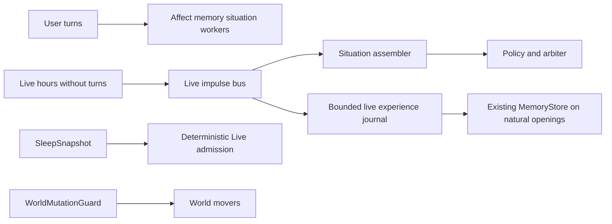
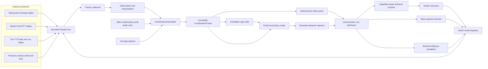
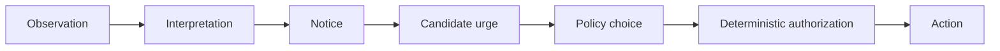

# Live mode — event-driven presence and behavior

This is the canonical backlog and architecture record for turning Aiko from a
turn-based assistant into a continuously present companion. It absorbs the
runtime part of [C6 companion perception](proactive.md#c6-companion-mode--the-desktop-as-a-sensory-channel)
and [H27 co-presence](immersion.md#h27-co-presence-mode--in-the-room-not-in-conversation)
without replacing either: C6 supplies environmental evidence, H27 describes the
quiet product posture, and this document defines the control system between
perception and behavior.

## 28 Sep 2026: initiative architecture follow-up

**Planning only; no runtime behavior, permissions, or settings changed.** The
product requirement is occasional, grounded initiative during ongoing
co-presence, with a small local policy model deciding when to act and the main
brain owning substantive conversation. Quiet companionship remains valid;
unbounded silence despite usable opportunities is a different outcome.

The detailed [Live initiative follow-up](live-initiative.md) owns **L19-L31**:
diagnostics, availability, durable candidate lifetimes, opportunity scheduling,
compact 4B decisions, transactional brain handoff, curiosity and other sources,
co-presence worker scheduling, plugin contracts, learning, cross-device delivery,
replay/rollout, and a later email pilot. It includes current source findings,
aggregate runtime evidence, dependencies and acceptance tests for each item.
Its implementation log tracks partial phases and their unshipped remainder.

**Start with L19 and one L21/L22 vertical slice.** The running snapshot recorded
74 attention/acknowledgement executions but no main-wake execution attempts,
with no active candidates or scheduled wait. That is not a historical expiry
rate or a diagnosis of every gate; the follow-up separates confirmed mechanisms
from hypotheses. L17/L18 remain shipped, but their end-to-end lifecycle needs
this additional work. L5/DT4 are not the only remaining barriers to initiative.

## Shipped baseline

**Status:** Pass 32 adds one-shot opportunity-aware deferral (L17), following
Pass 31's L18 cue purpose and exact main-turn handoff; see
[the shipped record](shipped/cognitive-continuity.md#live-l18-cue-purpose-and-exact-handoff).
Pass 30 ships L16: the 4B may set `keep_attention` /
`keep_style` (default false) so a new target or style is dropped and
the current hold stands. Hold cannot extend a wait past `MAX_WAIT_MS`,
cannot override user intent, and cannot keep a cancelled generation.
Existing hysteresis and `attention_switch` budget still apply when the
flags are false. Pass 29 ships L8: the 4B picks `wait_horizon`
(`short` / `medium` / `long`) and `wake_set` (`user_only` /
`user_or_activity` / `user_or_silence`). Raw `reconsider_after_ms` and
`wake_on` event names are ignored. Unknown tokens become the default
wait. Sleep cannot pick a speech wake. Critical user input still wakes
even if omitted. Heartbeat stays `data_only`; wait expiry still
promotes one coalesced `idle.reconsider`. Pass 28 ships L12: `aiko.affect_changed` / `aiko.vitality_changed`
are `data_only` inner-state impulses (`refresh=False`, no titles), and
the 4B may pick `vitality_posture` (`keep` / `soften` / `settle`) that
only quiets. Low vitality cannot mint `playful`, `celebrate`, or
`request_main_speech`. The 4B never writes affect, vitality, T3, L37,
or `MemoryStore`. Heartbeat stays off the 4B tick. Pass 27 ships L10:
a numbered peek-only urge menu. Pass 26 ships the inspectable 12-gate
admission record that closes the remaining Live L0 leftover. The record
lists every deterministic gate in the target order; it does not change
who is allowed to act. Execute side effects stay in the controller.
Pass 25 ships L7 one-shot fallback and Pass 24 ships L6 `speech_act`
routing on top of Pass 23's reaction palette. The 4B may pick a
candidate opening for an admitted main-wake; K92, question allowance,
floor, and the main model still decide whether and what to say. Typed
execute stalls (`budget_exhausted`, `floor_preempted`) may arm one
fallback menu; the same `action_id` cannot retry, and silent capability
no-ops never wake the 4B. L4 authored motion presets are deferred — the
current rig does not expose enough idle-life motions. L5
`delivery_style` remains open. DT4 exact/model replay remains a tools
item — no third Live clock. UIA and C6 memories-on-repeat stay
deferred. Heartbeat stays `data_only`; wait expiry alone promotes
`idle.reconsider`. The idle quiet gate is still
`_live_voice_session_active` only. User text/STT still wake `TurnRunner`.
Generation is stamped server-side and the 4B echo is never authorization.
Future 4B work is sketched as L8+ below; each item is still one enum
plus a clamp, not a second Aiko.

### Shipped vs remaining

| Piece | Status |
| --- | --- |
| `LiveModeMixin` / `LivePolicyController` | nonverbal Pass 7; micro-utterances Pass 9; gated unprompted main-wake Pass 10 |
| `LiveImpulseBus` (`app/core/live/`) | shadow Pass 1; feeds execution from Pass 7 onward |
| `LiveSituationFrame` / `LiveSituationAssembler` | shipped Pass 2; policy Pass 6; nonverbal/micro/main-wake execution Passes 7/9/10 |
| Live heartbeat (frame / affect / vitality) | shipped Pass 2; not idle-gated; 4B still not on the 1s tick |
| Wait expiry → `idle.reconsider` | shipped Pass 13; heartbeat stays `data_only` |
| Worker ownership matrix | encoded Pass 13; idle gate still `_live_voice_session_active` |
| Bounded Live experience journal | shipped Pass 2; does not write `MemoryStore` |
| `LiveUrge` / notice pipeline / `CueUrgeAdapter` | shipped Pass 3; peeks only, never `take_pool_cue` |
| `LiveWait` / `LiveBehaviorBudget` | shipped Pass 3; Pass 7 consumes on execute and gates inference |
| `live_policy` diet / rails / clamped modifiers | shipped Pass 4; no T3 habituation or L37 writes |
| `LiveSession` (continuous voice capture) | shipped; different meaning |
| Idle gate on `_live_voice_session_active` only | shipped — do not add `_live_mode_enabled` |
| `behavior_posture` / Text-Speak-Live UI | shipped Pass 1; default `turn_based` |
| Unified speech floor (typed/voice silence → `BrainEventQueue`) | shipped Pass 1; Live posture starves ProactiveDirector |
| Typing / composing on the wire | shipped Pass 1 (no draft text) |
| Shadow dual-write of sent text / STT finals | shipped Pass 1; does not steal turns |
| Conversation situation worker + snapshot | shipped Phase-2-lite; Live overlay + heartbeat refresh in Pass 2 |
| `WorldMutationGuard` shared-scene / intentional / asleep lease | shipped |
| Sleep lifecycle + `SleepSnapshot` | shipped |
| Multi-window mic and TTS playback ownership | shipped |
| Live impulse ownership / dedupe across windows | shipped Pass 12 (voice owner, else audio owner) |
| Client `playback_drained` acknowledgement | shipped Pass 8 (H7) |
| Two-axis UI / mic consent / cadence persistence | shipped Pass 12 (`live_quiet`, `live_unprompted_speech`, hourly main-wake, min-gap, `live_mic_consented`) |
| Turn-independent situation refresh + experience journal | shipped Pass 2 |
| H10 `IdleLifeChannel` | shipped Pass 5 |
| Ollama JSON Schema on `chat_json` | shipped Pass 6 |
| Resource-keyed `LlmPriorityGate` | Live-vs-worker matching shipped Pass 6 (`LIVE_POLICY` tier; distinct 4B is pass-through); full cross-role topology remains target |
| Intercept Live chat/STT (no automatic `TurnRunner`) | seam shipped Pass 6; deterministic admit still wakes chat |
| Talk-about cue + load-on-enable policy model | load/unload shipped Pass 6; nonverbal execute Pass 7; gated unprompted main-wake Pass 10 |
| Nonverbal policy → IdleLife | shipped Pass 7; micro-utterances Pass 9; gated unprompted main-wake Pass 10 |
| C6 as Live / K72 evidence (duration, idle/lock, stale) | shipped Pass 11 (Phase 9); Level-1 + C8 Pass 14; Level-2 Pass 15 (kv); daytime long-focus K72 Pass 16; companion cue Pass 17 (TurnRunner; Live peek-only); C7 `get_activity` Pass 18 |
| Frame clocks, `allowed_actions`, wake-name alignment, prompt fill | shipped Pass 19 (L0 slice) |
| Action IDs, `aiko.action_*` result impulses, argument allowlists | shipped Pass 20 (L0 slice). DT4 replay remains |
| Title-free activity-transition notices | shipped Pass 21 (L1). 4B still chooses existing intents only |
| Presence style / attention target | shipped Pass 22 (L2). Style may only lower intensity |
| Semantic reaction tone / intensity | shipped Pass 23 (L3). Concern needs user meaning; conversation/sleep still outrank |
| Main-wake `speech_act` candidate | shipped Pass 24 (L6). Untrusted T6 hint; K92 silence is success |
| One-shot typed fallback | shipped Pass 25 (L7). Same `action_id` cannot retry; capability no-ops stay silent |
| Inspectable 12-gate admission record | shipped Pass 26 (L0 leftover). Does not change who is allowed to act |
| Peek-only numbered urge menu | shipped Pass 27 (L10). Empty menu cannot `request_main_speech`; never takes the cue |
| Affect/vitality inner-state notices | shipped Pass 28 (L12). `data_only`; posture may only quiet; low vitality cannot wake |
| Wait horizon / wake-set | shipped Pass 29 (L8). Bands only; raw ms and invented wake names ignored |
| Explicit keep hold | shipped Pass 30 (L16). `keep_attention` / `keep_style`; user intent and generation still win |
| Future 4B expansions (L8+) | backlog. Floor manners, circadian quieting, glance menu, return beat, compact prompt. L8, L10, L12, L16 shipped |
| Opportunity-aware cue deferral / cue purpose | L17 shipped Pass 32; L18 shipped Pass 31. No increase to speech permission or budgets |

### Pass 18 code audit — contract gaps still open

Pass 19 filled the dead frame fields, clocks, wait names, and cue-subject
cap listed in the original audit. Pass 20 adds action IDs and result
impulses. Pass 21 derives title-free activity-transition notices from
existing C6 edges. Pass 22 admits a clamped presence style and attention
target. Pass 23 admits a clamped reaction tone and intensity band.
Pass 24 admits a clamped `speech_act` candidate on main-wake. Pass 25
arms a one-shot fallback menu after typed execute stalls. Pass 26
records every deterministic gate in the target order without moving
authorization. These verified gaps are still open:

- [`LiveSituationFrame`](../../app/core/live/frame.py) now fills
  `playback_active`, `current_actions` / `recent_actions`,
  `relationship_phase` / `goals`, and `allowed_actions` /
  `resource_contention`. Mixin supplies `last_aiko_spoke_ms` /
  `last_semantic_action_ms`. Remaining: do not add more empty prose fields.
- [`LiveActionRecord`](../../app/core/live/actions.py) now mints an
  `action_id` per parsed proposal. Nonverbal/micro execute emits
  `aiko.action_started` then `aiko.action_completed`; arbiter/post-gates
  emit `aiko.action_rejected`; stale inflight emits `aiko.action_cancelled`.
  Those impulses are `data_only` and publish with `refresh=False` so they
  cannot recurse into the 4B. They do not include spoken text or titles.
  Shadow `request_main_speech` still does not emit a result impulse.
- The documented arbiter is split across proposal parsing,
  `arbitrate_live_proposal`, and controller-side checks. Pass 19 adds an
  optional `not_allowed` reject when `allowed_actions` is non-empty.
  Pass 26 ships [`admission.py`](../../app/core/live/admission.py): one
  inspectable record listing the 12 gates in the target order below.
  Authorization is unchanged. Missing-urge main-wake still accepts at
  the arbiter (`talk_about=True`) and rejects at `main_wake`. Wait
  during a turn still executes with `overlay_skipped`. Execute side
  effects stay in the controller.
- The producer catalogue below is a target catalogue, not a shipped list.
  Wired bus producers cover composing edges, submitted text/STT, voice
  start/stop controls, session/control edges, playback drained, C6
  foreground/idle/lock, silence, and wait expiry. Sleep/shared changes are
  controller `trigger_kind` + journal transitions, not bus producers. Action
  result impulses (`aiko.action_started` / `completed` / `rejected` /
  `cancelled`) shipped Pass 20 as `data_only`. Affect/vitality inner-state
  impulses (`aiko.affect_changed` / `aiko.vitality_changed`) shipped
  Pass 28 as `data_only` (`refresh=False`, payload is `mood_label` or
  `band` only). Task/cue, world, and circadian edges are not yet
  producers.
- Wait and commitment wakes now use `user.voice_start` and
  `activity.session_changed` / `activity.idle` / `activity.lock`. Dead names
  `user.speech_started` and `world.activity_changed` alias at
  [`wait.schedule`](../../app/core/live/wait.py) so old 4B output still maps.
- Cue subjects reach the 4B only through
  [`cap_live_subject`](../../app/core/live/labels.py) (length, URL, and
  relative-deictic drop). Live still peeks and never takes or fulfils the cue.
- Live directly consumes C6 `ActivityEvidence` (app class, duration,
  session/idle/lock rollups). Pass 21 turns those edges into title-free
  notices (`focus_started`, `focus_boundary`, `returned_to_machine`,
  `app_category_changed`, `shared_activity_resumed`) mapped onto existing
  urges. It does not load the Pass 15 Level-2 kv interpretation into the
  frame. Pass 17 can turn that interpretation into a TurnRunner-owned
  `companion_activity` cue, but that is not the same as giving the
  interpretation to the Live policy.
- The proposal schema still types `arguments` as an object. Pass 20
  strips unknown keys client-side: every intent may keep `reasoning`;
  micro intents may keep `delivery` / `text`. Pass 22 adds
  `presence_style` (all intents) and `attention_target` (`attend` /
  `remain_present`). Pass 23 adds `reaction_tone` /
  `reaction_intensity` (all intents). Pass 24 adds `speech_act` on
  `request_main_speech`. Pass 25 adds `fallback_for`. `delivery_style`
  remains L5.
- The implementation route is 40,960 context with a 12,000-token input
  ceiling and 512 output tokens. That fixed Pass 6 JSON truncation, but it is
  larger than the 2K–4K policy target described below. A compact prompt-v2
  measurement remains worthwhile before adding more context.
- DT4 scenario/model replay is still absent. The 48-row in-memory ledger
  plus the impulse-bus replay tail are enough to inspect recent action IDs;
  they are not a DT4 scenario corpus. Do not add a Live-only clock.

These gaps are the prerequisite lane for the next expansion work; do not hide
them by adding more prose fields to the frame.

## The goal

Text and voice currently have the same underlying shape:

```
user input -> TurnRunner -> reply + TTS/avatar tags -> idle
```

Live mode adds a second, event-driven control loop:

```
impulses -> current-situation frame -> behavior policy -> validated action
                                                        -> result impulse
```

The result should feel less like an assistant waiting behind a prompt box and
more like another person sharing the room:

- she notices that the user started typing and attends without interrupting;
- she listens, backchannels, yields, and recovers naturally around speech;
- she can look toward the user, the cursor, or something in her room;
- she can react briefly without turning every small moment into a full answer;
- she can decide that silence is the right behavior;
- she can ask the main Aiko model for a substantive contribution when a moment
  genuinely earns one;
- the same affect, memories, concepts, relationship, goals, and world state
  survive entering and leaving the mode.

The target is not constant LLM activity. A human-feeling companion mostly uses
cheap reflexes and silence. The model is for ambiguous behavioral choices after
the obvious cases have already been handled.

## Verdict on the existing architecture

**This is feasible without rebuilding Aiko.** The codebase already has most of
the expensive foundations:

- a priority event queue and single conversational consumer in
  [`app/core/brain/`](../../app/core/brain/);
- one full-turn owner in
  [`TurnRunner`](../../app/core/session/turn_runner.py);
- continuous STT capture in
  [`LiveSession`](../../app/core/session/live_session.py);
- TTS, microphone, and multi-window audio ownership;
- a framework-independent Live2D
  [`AvatarEngine`](../../web/src/live2d/AvatarEngine.ts) with expression,
  motion, gaze, overlay, touch, outfit, and lipsync channels;
- persistent affect, relationship, goals, tasks, concepts, memories, and world
  state;
- a cue pool and proactive path for things Aiko may want to say;
- C6's isolated desktop collectors and redacted activity store;
- role-based LLM routing plus an existing worker-side `LlmPriorityGate` that can
  be generalized around actual inference contention.

That missing control layer is now shipped. Pass 19–28 closed the frame/clock/wake,
action-result, activity-notice, presence-style, reaction, speech-act,
fallback, admission-record, urge-menu, and affect/vitality slices. The
[28 Sep initiative evaluation](live-initiative.md) identifies additional
end-to-end gaps in scheduling, candidate lifetime, availability and delivery
accounting. Those are the next autonomy priorities; L5 `delivery_style` remains
presentation work and DT4 remains the shared replay owner. The shipped
invariants remain:
silence timers become impulses under Live, JSON Schema plus client validation
guard the proposer, composing reaches the backend without draft text,
`IdleLifeChannel` owns deterministic embodiment, and LLM gate membership
follows resolved contention identity.

## Product model: two axes, not one three-value enum

“Text / Speak / Live” is a useful UI explanation but the wrong internal state
model. Text and speech describe **how the user communicates**. Live describes
**who owns ongoing behavior**. Coupling them would make co-presence impossible
without an open microphone and would overload the word `live` a third time.

Model two independent axes:

- **Interaction channel:** typed, continuous voice, and later push-to-talk.
- **Behavior posture:** turn-based, live presence, and a quiet/DND modifier.

The UI may offer three convenient profiles:

- **Text:** typed channel + turn-based posture.
- **Speak:** continuous voice + turn-based posture.
- **Live:** live-presence posture; the microphone remains independently
  controlled and is not opened by enabling the profile.

This lets the user keep Aiko visually alive on a second monitor with the
microphone off, or use ordinary turn-based voice without granting autonomous
behavior.

The shipped overall subsystem is folded into `LiveModeMixin`; the model-facing
decision component is `LivePolicyController`. Do not name either
`LiveSession`; that class already means continuous voice capture.

Switching profiles changes capabilities and authority, not identity. Aiko's
stores, current affect, world activity, relationship, concepts, memories, and
unfinished tasks remain the same.

## Non-negotiable ownership and truth rules

1. `TurnRunner` remains the only owner of a full conversational turn.
2. `BrainLoop` remains the serialization point for anything that can take the
   conversational floor.
3. Observation, interpretation, urge, policy choice, authorization, and
   execution are distinct states. Noticing something does not create an urge;
   an urge does not grant permission to act.
4. Current world/runtime evidence is authoritative over remembered or
   conceptual context. A concept may shape behavior only after present evidence
   makes it relevant.
5. The Live policy model proposes semantic intentions; it never executes them
   and never selects rig-specific expressions, motion groups, indices, or
   parameter IDs.
6. The deterministic Live admission lane (`arbitrate_live_proposal` plus
   controller-side speech/budget gates) is the sole owner of immediate avatar
   and speech action admission. Model-reported confidence never contributes to
   authorization.
7. At most one semantic speech stream may be active.
8. User speech, a sent message, stop, and mode/session changes pre-empt
   autonomous behavior.
9. The policy model never writes memories, affect, concepts, goals, tasks, or
   world state directly.
10. Sensor traffic is bounded and deliberately lossy. User intent and
   cancellation are the lossless exceptions.
11. Every proposal names the situation generation it was based on. A stale
   generation never executes.
12. `request_main_speech` has a substantially higher deterministic admission
    threshold and a separate budget from visual behavior or micro-speech.
13. Stable attention/activity intentions use hysteresis. Minor ambiguous input
    cannot make Aiko oscillate between targets or postures.
14. Privacy filtering happens before an impulse reaches a model.
15. LLM priority is scoped to a resolved inference resource. Calls on
    independent model/provider lanes never wait behind one another.

These rules matter more than model choice. A weak model behind them produces a
missed glance. A strong model without them produces two Aikos talking at once.

## Turn-independent presence

Live hours are not a long user turn. Most of the current inner life is
post-turn: [`ConversationSituationWorker`](../../app/core/conversation/conversation_situation_worker.py)
runs every N *user turns*; affect, vitality, memory extraction, and arc tagging
fire after a reply. Hours of Live with no messages would freeze those clocks
and leave her looking like a second Aiko who last updated twenty minutes ago,
or a statue.



Pass 2 refreshes the situation frame from impulses, world, C6, and time even
when no user turn happens. It reuses the shipped
`ConversationSituationSnapshot` / `conversation_situation` row rather than
spawning a second situation store. The Pass 18 audit above records the
remaining unpopulated frame fields.

### Experience without turning every glance into a memory

Rule 9 still holds: the policy model never writes `MemoryStore`. Hours of
co-presence still need a place to put “we were sitting together and the rain
started” so a later main wake or extractor can use it.

Pass 2 added a bounded **Live experience journal**:

- privacy-classified at write time (`local_state` vs anything that may later
  become a memory);
- aged with `timephrase.STORED_TEXT_TIME_RULE` so “today” / “tonight” never
  freeze into a stored row;
- size-capped and TTL’d, not an unbounded transcript;
- readable later by the existing memory extractor, conversation-situation
  worker, and a main-wake “what we just did” prompt;
- never a parallel long-term memory.

Pass 9 micro-utterances are not full turns. They do not increment
relationship-turn counters, arc-tagging cadence, memory-extraction cadence, or
the rest of the post-turn cascade. They persist through the transcript contract
with `dialogue_act=live_micro` and are accounted as Live actions, not user
turns.

The Live heartbeat now refreshes affect and vitality from the same stores; it
does not create a second affect engine or wake the policy model every second.

## Worker ownership by posture

The original Live notes asked for a matrix; “some workers continue” is not
enough. While Live *behavior posture* is on, idle work has one of four jobs:

| Worker / path | Live posture on | Why |
| --- | --- | --- |
| Away-activity location / posture movers | **Suspend** (already guarded when a world-compatible shared situation is active) | Location belongs to the shared scene. H26 “caught mid-something” is a *return* cue; under Live it is continuous presence, not a first-turn surprise. |
| Garden / circadian movers that would relocate or re-pose her | **Suspend** under the same `WorldMutationGuard` lease | Same reason. |
| Plant growth, room-evolution **item-only** writes | **Keep running** | World can still change around her without stealing her body. |
| Sleep lifecycle / `SleepSnapshot` | **Keep running** | Sleep is world truth. Live consumes it; it does not replace it. |
| `ProactiveDirector` silence timers | **Impulse producers only** | Timers may wake Live. They must not call `generate_proactive_message` on a private thread. |
| Cue pool | **Fulfilment-owned as today**; Live sees `CueUrgeAdapter` only | Cues remain candidates. They never become commands. |
| Affect / vitality / memory extract / arc tag / situation worker | **Keep running, but on a Live heartbeat** when no user turn arrives | Otherwise the clocks freeze. |
| Any path that can speak | **Must not speak** except through the Live arbiter → `BrainLoop` gate | No fifth speech path. Sleep-controller tags are the existing exception while asleep. |

The `_live_voice_session_active` idle gate stays the voice-ownership check.
Live posture is a second, orthogonal question: “who owns ongoing behavior,”
not “is the microphone open.”

## Sleep and Live

Sleep is a **hard arbiter constraint**, not flavor text. Consume
`SleepSnapshot`. Do not invent a second sleep state machine.

While `asleep`, `winding_down`, or `woken`:

- no autonomous Live speech except the existing sleep-controller tags;
- visual behavior degrades to the sleep channel (breathing, closed eyes,
  no “attentive companion” gaze);
- wake and interruption impulses go into the sleep lifecycle;
- ordinary world movers stay suspended as they already do.

A Live `request_main_speech` while she is asleep is a bug, not a cute
whisper. The arbiter rejects it the same way it rejects speech during user
floor ownership.

## Desktop vs browser degradation

C6 companion perception, OS idle/lock, and some typing surfaces are
Tauri/desktop. Browser Live is a **degraded channel**: no companion
perception, still valid visual presence, still a speech floor if the user
enabled the mic.

Absence of C6 must not stall the controller, the WebSocket, or the turn path.
That is a **Phase 1 invariant**, not a Phase 9 afterthought. Missing collectors
are missing evidence. The frame says so and the policy may `noop` or `wait`;
the bus does not block.

## Target architecture



There are three decision lanes:

1. **Reflex lane, no LLM.** Cursor gaze, typing attention, listening face,
   speech-yield, safe backchannels, idle breathing, and capability fallbacks.
2. **Live policy lane, small local LLM.** Chooses among bounded behaviors when
   the right response depends on the whole situation.
3. **Main cognition lane.** The normal Aiko model handles user turns, tools,
   memory-aware reasoning, and any autonomous speech with real semantic weight.

The policy lane is event-driven. There is no 10 Hz “what should I do now?” LLM
loop. Most impulses only update the frame or trigger a deterministic reflex.

## Impulse plane

### Event envelope

Every producer emits the same typed envelope:

```json
{
  "event_id": "01K...",
  "kind": "user.typing_started",
  "source": "web.chat_composer",
  "session_key": "user:session",
  "mode_generation": 14,
  "sequence": 9281,
  "occurred_at": "2026-09-06T00:14:22.123Z",
  "monotonic_ms": 412883.2,
  "priority": "attention",
  "ttl_ms": 3000,
  "coalesce_key": "user.typing",
  "privacy": "local_state",
  "payload": {"surface": "main_chat"}
}
```

The exact identifier format can follow existing conventions, but the semantics
are required:

- `event_id` supports dedupe and logs.
- `sequence` preserves ordering across equal priorities.
- `occurred_at` is narrative/audit time through `timephrase`; `monotonic_ms`
  is runtime timing.
- `mode_generation` invalidates work after posture, session, or ownership
  changes.
- `ttl_ms` prevents a late glance, line, or expression from firing after its
  moment.
- `coalesce_key` declares replace/merge behavior.
- `privacy` makes redaction and telemetry rules inspectable.

### Producer catalogue

This is the **target** catalogue. The Pass 18 audit above names the subset that
is actually wired. Add a producer only when it causes a meaningful state
transition; do not mirror every existing callback onto the bus.

#### User intent

Frontend producers:

- `user.typing_started` on the first composition edge;
- `user.typing_paused` after a short debounce;
- `user.typing_stopped` on send, blur, clear, or a longer idle;
- `user.message_sent` when a chat command is accepted, not on every key;
- `user.avatar_touched` from the existing touch path;
- `user.live_profile_changed`, `user.quiet_changed`, and
  `user.stop_requested` as critical control edges.

[`ChatView.tsx`](../../web/src/features/chat/ChatView.tsx) and
[`PersonaInput.tsx`](../../web/src/features/persona/PersonaInput.tsx) now put
the same composing edge on the wire. Draft text is never sent; the event says
only that composition is active.

Raw pointer movement stays in `GazeChannel`. Sending 60 Hz cursor coordinates to
the backend would add latency and a privacy surface to behavior that is already
better locally. Only semantic pointer edges such as avatar enter/leave, touch,
or an explicit attention target belong on the impulse bus.

#### Voice and listening

Voice producers:

- `user.speech_started` from the client/server VAD edge (shipped impulse
  is `user.voice_start`; the dead name aliases at wait schedule);
- `user.speech_partial_changed` at the existing bounded STT-partial cadence;
- `user.speech_ended` when endpointing closes the phrase;
- `user.stt_final` and `user.stt_failed`;
- `user.barge_in_started`;
- `voice.owner_changed` and `voice.capture_changed`.

Audio RMS frames are UI data, not policy impulses. The bus receives edges and a
coalesced speech state. Partials are latest-value-wins and short-lived; the final
transcript is lossless user intent and enters the normal user-message path.

H7's capture-during-playback ring and client playback acknowledgement
shipped in Pass 8. `capture_available` is true while the live voice
session is active. Full duplex + software AEC (H7c) is still later.

#### Aiko runtime

Runtime producers:

- `turn.queued`, `turn.started`, `turn.completed`, `turn.cancelled`, and
  `turn.failed`;
- `aiko.tts_started`, `aiko.tts_server_ended`,
  `aiko.playback_drained`, and `aiko.audio_cancelled`;
- `aiko.action_started`, `aiko.action_completed`, `aiko.action_rejected`,
  and `aiko.action_cancelled` (Pass 20; `data_only`, no refresh, no spoken
  text). `aiko.action_proposed` / `accepted` stay ledger-only.
- `task.completed` and `task.input_needed`;
- `cue.armed`, `cue.pressure_changed`, `cue.fulfilled`, and `cue.expired`;
- `aiko.affect_changed`, `aiko.vitality_changed`, and `aiko.world_changed`.

Do not push full cue text or every worker output through the event bus. A cue
event wakes situation assembly; the assembler reads a bounded, privacy-safe
summary from the source of truth.

#### Environment and shared activity

Environmental producers:

- folded client presence/focus changes;
- C6 activity-session start/change/end and its redacted interpretation;
- OS idle, lock, unlock, sleep, and resume edges;
- meaningful world-state changes;
- circadian period boundaries;
- optional media state only if a future, consented collector supplies it.

C6 remains a perception pipeline, not a behavior controller. It reports
evidence such as “allowlisted media app active” or “coding session has lasted
42 minutes.” It does not decide that Aiko should comment.

#### Timers

Timers emit semantic events:

- cooldown became available;
- an interjection deadline expired;
- typing changed from paused to stopped;
- a prepared action expired;
- a situation confidence needs decay.

A periodic maintenance wake may update these clocks, but it must not call the
policy model merely because another second passed.

### Backpressure and coalescing

Use a dedicated bounded `LiveImpulseBus`, not the conversational priority heap,
for high-rate observations. Only admitted floor-taking work escalates into
`BrainEventQueue`.

Per-kind policy:

- **Never drop:** sent messages, final STT, stop/cancel, session/mode changes,
  speech-start interruption.
- **Latest value wins:** typing state, STT partial, presence, active app,
  affect/vitality snapshot, pointer attention state.
- **Aggregate:** repeated action rejections, elapsed focus time, cue pressure.
- **Deduplicate:** repeated IDs and identical reconnect state.
- **Expire:** stale gaze, expression, partial speech, and old environment
  observations.

Reserve queue capacity for critical events. Keep at most one policy inference
in flight. When a new critical event arrives, cancel inference if the client
supports it and always invalidate its generation.

## Observation, interpretation, and urge state

Live mode needs an explicit boundary between what happened, what Aiko makes of
it, what she feels inclined to do, and what she is allowed to do:



- **Observation:** an episode ended, the user started typing, TTS drained, a
  task completed.
- **Interpretation:** a confidence-bearing situation update, such as “the
  shared episode appears to have reached a natural pause.”
- **Notice:** the interpreted change is behaviorally relevant to Aiko. Many
  observations never cross this threshold.
- **Urge:** a candidate intention such as `share_delight`,
  `acknowledge_user`, `comfort`, `ask_about_result`, or `remain_present`.
- **Policy choice:** choose one urge, defer it, merge it with another, or
  choose silence.
- **Authorization:** apply floor ownership, current truth, timing, budgets,
  hysteresis, capability, privacy, and freshness.
- **Action:** resolve the admitted semantic intention into concrete effects.

The urge layer is important precisely because most urges should not become
actions. It gives Aiko continuity of inclination without equating “I thought of
something” with “I should interrupt.”

### `LiveUrge`

Use a bounded, ephemeral candidate record:

```json
{
  "urge_id": "01K...",
  "kind": "share_delight",
  "subject": "shared_activity",
  "created_at": "2026-09-06T00:14:22.123Z",
  "expires_after_ms": 30000,
  "source": "situation.transition",
  "source_ids": ["event-91", "hypothesis-12"],
  "concept_ids": [184],
  "salience_inputs": {
    "transition_strength": 0.8,
    "affective_relevance": 0.7
  },
  "state": "candidate",
  "repetition_key": "shared_anime_episode_reaction"
}
```

`LiveUrge` does not contain a Live2D motion, exact expression, permission flag,
or model confidence. Its salience inputs come from deterministic/owned sources;
the policy may rank or select the urge, but authorization computes its own
admission score.

Candidate states are `candidate`, `selected`, `parked`, `consumed`, `expired`,
and `withdrawn`. Parking keeps an inclination available for a natural opening;
expiry prevents an old reaction from escaping after its moment.

### Existing cues become urge sources, not commands

The cue pool remains the source of truth for durable/deficit-scheduled things
Aiko may want to raise. A `CueUrgeAdapter` may project an eligible cue into a
short-lived `LiveUrge` carrying the cue ID and current relevance. It must not:

- mark the cue fulfilled merely because the policy saw it;
- bypass cue cooldown, stance, or question-balance rules;
- copy every cue payload into every situation frame;
- delete or mutate the source cue when an urge expires;
- grant speech permission.

Only an executed semantic action, a normal turn that uses the cue, or the cue's
existing fulfilment contract may consume it. This makes cues available to Live
behavior without turning the cue pool into an action queue.

### Urge creation and competition

Urges may come from:

- meaningful situation transitions;
- user interaction edges;
- affect/world changes;
- existing cues and proactive candidates;
- task results;
- an unfinished urge parked for a better opening.

They are bounded by kind, subject, TTL, and repetition key. Equivalent urges
merge; contradictory urges compete; safety/yield urges outrank expressive
ones. A rejected urge cannot immediately recreate itself from the same evidence.
New external evidence or a meaningful situation transition is required.

## Current-situation model

Raw impulses are not enough. “A media window is focused” and “Aiko knows anime
is a shared ritual” do not independently prove that the two are watching anime
together. `LiveSituationAssembler` produces one immutable,
confidence-bearing view of the present.

**Shipped precursor — conversation situation awareness (September 2026).**
Typed and voice turns now share a Phase-2-lite core:

- `ConversationSituationWorker` periodically extracts an open-ended,
  evidence-linked present situation after the reply, on the worker lane;
- a deterministic reducer owns `keep|replace|clear`, two-miss disappearance
  hysteresis, persistence, staleness, and rejection of model confidence;
- `conversation_situation_snapshot()` joins that semantic state with same-turn
  dialogue act, interaction mode, affect/vitality, activity awareness, and the
  authoritative room state;
- the same snapshot now projects the durable sleep state and active episode,
  including reason, duration, prior activity, and interruption count;
- a compact T6 block carries only the semantic/shared delta, while K16 reads
  its ambient world/mood/app fields from the same snapshot;
- `WorldMutationGuard` prevents away, garden, and circadian movers from
  contradicting an active world-compatible shared scene. Deliberate world
  tools and World-tab changes remain higher authority.

That snapshot remains the persisted semantic precursor rather than a second
Live store. Passes 2–10 added typing edges, playback acknowledgement,
attention, urges, budgets, and policy decisions around it. Monotonic
action/speech timing and several declared frame fields remain incomplete; see
the [Pass 18 audit](#pass-18-code-audit--contract-gaps-still-open).

**Shipped precursor — sleep and day continuity (September 2026).** Sleep is
already owned by a generation-checked persisted lifecycle, not by inferred
message gaps or a future Live policy. See [Sleep and Live](#sleep-and-live):
the assembler consumes `SleepSnapshot`, the arbiter treats sleep as a hard
constraint, and wake/interruption impulses enter that controller. Do not
create another sleep state machine.

### `LiveSituationFrame`

The frame has seven first-class sections:

**Interaction now**

- floor owner: user, Aiko, neither, or transition;
- typing, speech, endpointing, and last completed user meaning;
- active turn, TTS synthesis, client playback, and capture availability;
- voice/audio owner and connection generation;
- elapsed silence since user intent, Aiko speech, and shared activity change.

**Shared situation**

- observed app/activity session and OS idle/presence;
- inferred activity label, confidence, evidence IDs, and age;
- whether the activity appears shared, user-only, Aiko-only, or unknown;
- current room/location/time context.

**Attention**

```json
{
  "target": "shared_activity",
  "target_id": "activity:anime_episode",
  "mode": "engaged",
  "evidence_confidence": 0.88,
  "entered_at_monotonic_ms": 410000,
  "held_until_monotonic_ms": 425000,
  "last_meaningful_change_ms": 412500,
  "reason_code": "shared_media_active"
}
```

- target: user, cursor, a world entity/activity, shared activity, or none;
- mode: engaged, monitoring, casual, distracted, or resting;
- deterministic evidence confidence and source IDs;
- entered/held-until timestamps and elapsed dwell;
- switch reason, challenger target, and hysteresis margin.

“Aiko is watching the episode,” “Aiko is watching the user code,” and “Aiko is
present but resting” must be different states even if the rig ultimately uses
similar eye movement. Attention is cognitive/runtime state first and rendering
input second.

**Aiko now**

- affect, vitality, posture, activity, outfit/capabilities;
- current and recently completed actions;
- per-action cooldown and interruption budgets;
- bounded candidate-urge summaries and the currently selected/parked urge.

**Continuity**

- relationship phase and current conversation arc;
- active goals/tasks that matter to the moment;
- bounded cue pressure;
- core behavior rails and situation-relevant concepts.

**Temporal state**

- `typing_active_ms` and `typing_idle_ms`;
- `user_speech_active_ms` and `since_user_speech_ms`;
- `since_user_intent_ms`, `since_aiko_spoke_ms`, and
  `since_semantic_action_ms`;
- situation age and time since last confirming evidence;
- current attention/intention dwell and minimum hold remaining;
- age/TTL of candidate urges;
- remaining cooldown and behavior-budget windows;
- next scheduled reconsideration deadline.

Store canonical durations from the monotonic clock and also derive stable phase
labels such as `immediate`, `recent`, `settled`, and `prolonged` where useful.
The model should not have to infer the difference between 300 ms and 45 seconds
from prose or perform fragile timestamp arithmetic. Wall-clock timestamps remain
for narrative/audit context; authorization and elapsed behavior use monotonic
time.

**Constraints**

- allowed actions for this generation;
- reasons speech is forbidden or discouraged;
- DND/focus posture;
- privacy classification and stale-source flags;
- resource contention grade.

The policy receives a stable persona-lite header plus this compact frame and
the few impulses since the previous decision. It does not receive the complete
persona, transcript, T0–T6 prompt, memory search results, or every concept.

### Observation versus inference

Every inferred field carries:

- confidence;
- supporting event/evidence IDs;
- the time it was last confirmed;
- a decay rule;
- conflicts or missing evidence.

Examples:

- Observation: `app.category=media`, allowlisted title says an anime episode is
  active, user is present.
- Recent dialogue: “let's watch this together.”
- Relationship concept: watching anime together is a recurring ritual.
- Situation hypothesis: `watching_anime_together`, confidence `0.91`.

If only the first observation exists, the honest hypothesis may be
`user_watching_media`, confidence `0.55`, shared status unknown. The concept
cannot manufacture present-tense evidence.

Situation hypotheses should be ephemeral or short-lived. Durable learning still
goes through the existing memory and concept machinery.

### World truth precedence

The situation frame has a strict evidence order:

1. current runtime ownership/floor/safety state;
2. current observations with freshness and confidence;
3. current situation hypotheses grounded in those observations;
4. recent dialogue and explicit user intent;
5. concepts, memories, routines, and historical priors.

Lower layers may disambiguate or tune behavior only when higher layers make
them relevant. “We enjoy watching anime together” cannot produce an anime urge
while the current activity is coding. A stale media observation cannot beat a
fresh editor activity transition. A remembered preference cannot override an
explicit “please be quiet.”

This order is enforced before policy prompting and again during authorization.
The policy model is never asked to arbitrate whether memory should overrule
reality.

### Decision epochs

Not every frame update deserves policy inference.

- A critical intent edge creates an immediate decision epoch.
- A meaningful situation transition creates one after coalescing.
- A policy-relevant cue or concept change may create one.
- Action completion creates one only when another choice is pending.
- High-rate state updates merely replace data until one of those triggers.

The frame carries a monotonically increasing `generation`. Every proposal
echoes it. An action from generation 41 is rejected after generation 42 exists,
even if the model call completed successfully.

## Concept-aware behavior

Concepts are the right place for learned behavioral context. They already hold
identity, relationship rituals, values, boundaries, affective patterns,
aspirations, tensions, tastes, and other cross-cluster understanding. Live mode
should think with them without turning every policy tick into a main-model
prompt.

### Reuse the existing concept facade

Add a `live_policy` consumer through
[`ConceptView`](../../app/core/concepts/concept_view.py). Do not query
`ConceptStore` ad hoc and do not create “live concepts.”

The policy gets two lanes:

1. **Behavior rails.** A small, kind-balanced `ConceptDiet` of established
   values, boundaries, affective patterns, and relationship concepts. These
   answer “how should Aiko generally behave with this user?”
2. **Situation-relevant concepts.** Embed a normalized situation summary and
   call `ConceptView.relevant`. Rank the result with reusable context,
   confidence, importance, salience, stability, and role logic from
   [`concept_surfacing.py`](../../app/core/concepts/concept_surfacing.py).
   These answer “which understanding matters in this moment?”

The main T3 selector currently lives inside
[`inner_life_part1.py`](../../app/core/session/inner_life_part1.py). Extract the
common scoring/selection seam instead of copying the whole prompt region.
Live-mode rendering is shorter and imperative:

```
Behavioral context:
- Shared anime watching is a comfortable ritual; let silence carry it.
- He dislikes interruption during focused media.
- Brief playful reactions usually land better than questions here.
```

This is guidance for policy, never dialogue to quote.

### Separate exposure accounting

Reading a concept for policy is not the same as surfacing it in a conversational
reply. Live decisions may happen many times between messages, so they must not:

- advance the normal turn-based habituation clock;
- suppress a concept from the next T3 relevant-context selection;
- create an L37 “surfaced” row merely because the policy saw it;
- mutate concept confidence.

Maintain a bounded live decision ledger with:

- frame generation and selected concept IDs;
- each concept's selection reason and score;
- proposed action;
- arbiter result;
- completed action/result;
- whether the main model later used the concept.

This makes behavioral usefulness measurable while leaving the concept lifecycle
owned by its existing engine.

### Concepts can tune deterministic policy

Do not make the LLM rediscover obvious behavioral consequences on every epoch.
Selected concepts may adjust bounded policy parameters before inference:

- `speech_budget`: forbidden, rare, normal, or open;
- minimum interruption score;
- attention preference;
- maximum reaction intensity;
- question allowance;
- minimum gap after user/Aiko speech.

The adjustments are clamped by code. A concept can make speech less likely but
cannot override user DND, microphone ownership, or the one-speech-stream rule.

### Worked example: watching anime together

1. The user says “let's watch the next episode together.”
2. The user turn updates recent dialogue/arc normally.
3. C6 later reports an allowlisted media activity session.
4. `LiveSituationAssembler` combines those observations with a matching
   relationship ritual and creates `watching_anime_together`.
5. The concept selector supplies the ritual plus any relevant interruption
   boundary or affective pattern.
6. Deterministic tuning sets `speech_budget=rare`, disables unsolicited
   questions, lengthens the speech cooldown, and favors shared attention.
7. Ordinary cursor following, breathing, and small expressions continue with
   no model call.
8. The episode ending produces a situation transition: “shared media appears
   paused at a natural boundary.”
9. The notice gate decides that the transition matters to Aiko.
10. It creates `share_delight` as a candidate urge; this still grants no action.
11. Temporal state says dialogue has ended, attention is still held on the
    episode, and the situation-modified speech budget remains `rare`.
12. Policy may select the urge as `react_affectively`, park it, or choose
    `wait`/`noop`.
13. The arbiter admits speech only if the pause is current, the urge and frame
    remain fresh, hysteresis is satisfied, and the micro-speech budget permits
    it.
14. The resolver may produce a warm expression plus a tiny affective line. A
    genuinely substantive thought instead becomes a separately gated
    `request_main_speech` through `BrainEventQueue`.

The success condition is not “Aiko says anime-related things.” It is that she
behaves differently because she understands what the two are doing, and usually
chooses not to interrupt it.

## Action contract

### Policy emits semantic intention, not animation

The policy emits one semantic behavioral intention. It does not emit arbitrary
tools, a free-form plan, expression filenames, motion groups/indices, or Live2D
parameter values.

```json
{
  "snapshot_generation": 42,
  "selected_urge_id": "01K...",
  "intent": "react_affectively",
  "arguments": {
    "text": "oh, that was beautiful",
    "delivery": "micro_utterance"
  },
  "reason_code": "shared_media_reaction",
  "context_refs": ["situation:shared_anime", "concept:184"]
}
```

The initial semantic vocabulary starts small:

- `noop`;
- `wait`;
- `attend` to the user, cursor, a world/shared-activity target, or none;
- `acknowledge_user`;
- `react_affectively`;
- `backchannel_user`;
- `remain_present`;
- `yield_floor`;
- `request_main_speech`.

`micro_utterance` is a permitted delivery for a narrow semantic intention, not
an animation/action family beside it. `LiveBehaviorResolver` may accompany an
admitted `acknowledge_user` or `react_affectively` with gaze, expression, and
body orientation. A bounded tone argument and authored motions are expansion
items below; they are not implemented merely because `arguments` is an open
object.

Outfit changes, snapshots, touch, world mutations, and tools stay out of v1.
Add an intention only after its authorization rules, resolution fallbacks,
cancellation behavior, and test matrix exist.

### Rich wait versus `noop`

`noop` means there is no selected urge and no reason to schedule an extra policy
wake; ordinary external impulses continue monitoring. `wait` is an intentional
commitment to silence with a bounded reconsideration contract:

```json
{
  "snapshot_generation": 42,
  "selected_urge_id": "01K...",
  "intent": "wait",
  "reconsider_after_ms": 15000,
  "wake_on": [
    "user.voice_start",
    "user.message_sent",
    "activity.session_changed"
  ],
  "reason_code": "shared_activity_in_progress"
}
```

The runtime clamps the deadline, validates `wake_on` against an allowlist, and
cancels it when the urge expires or the generation changes. Critical user
intent always wakes the controller even if omitted. Replaceable noise does not.
This prevents repeated LLM calls whose only purpose is to rediscover that
nothing should happen.

### Model confidence is not authorization

The proposal has no `confidence` field. Small-model self-confidence is not
assumed to be calibrated and cannot raise an action's permission.

The arbiter computes a deterministic `admission_score`/decision from:

- freshness and consistency of current world evidence;
- situation-hypothesis confidence;
- owned urge salience inputs and age;
- unknown `context_refs` are dropped, not a reject (the 4B invents
  `situation:…` citations the prompt never minted);
- floor, timing, hysteresis, privacy, and capability conditions;
- remaining behavior budget and repetition history.

If model self-assessment is ever collected for research, store it under an
explicitly untrusted diagnostic field and prove that authorization never reads
it.

### Capability-aware behavior resolution

After authorization, `LiveBehaviorResolver` maps semantic intent into a
`ResolvedBehaviorPlan`. Only this deterministic layer knows the concrete rig.

For example:

```
policy intention: acknowledge_user
    -> attention target: user
    -> gaze: centered/upward focus
    -> body: slight lean if body-angle Y exists
    -> face: attentive/warm expression if mapped
    -> motion: optional authored acknowledgement motion if available
```

The current capability surface is real but bounded:

- [`AvatarProfile`](../../app/core/persona/avatar_profile.py) exposes named
  expressions, reaction mappings, authored motion groups, idle/talk groups,
  overlays, outfits, lip-sync and eye-blink IDs, and capability flags;
- [`GazeChannel`](../../web/src/live2d/channels/GazeChannel.ts) drives the
  focus controller, which can move supported eye/head-angle parameters toward
  user/cursor/neutral targets;
- [`AmbientBodyChannel`](../../web/src/live2d/channels/AmbientBodyChannel.ts)
  can blend listening lean, slump, bounce, breath, body Y/Z tilt, blush, sweat,
  and tail behavior when the corresponding parameters exist;
- [`MotionChannel`](../../web/src/live2d/channels/MotionChannel.ts) can only
  play motions actually authored in the manifest;
- expression, overlay, wink, tail, ear, accessory, and outfit behavior already
  capability-gate and degrade to no-op.

There is no general skeletal pose system and no guarantee that an arbitrary rig
can change posture. “Posture” in the policy therefore means a semantic held
state; the resolver may realize it through body-angle envelopes, gaze,
expression, an authored motion, or nothing. The policy sees semantic capability
classes such as `can_orient`, `can_express`, and `can_motion`, never current
Alexia filenames or parameter IDs.

The target resolved plan defines:

- required capabilities;
- whether it may run during user speech, typing, a turn, or TTS;
- cooldown and repetition key;
- TTL;
- interruptibility and safe stop;
- whether it is semantic and therefore transcript-visible;
- which held intention/attention state it enters or preserves;
- completion/failure result shape.

## Action arbitration

The target consolidated Live admission lane evaluates proposals in this order:

1. schema, enum, selected-urge, and context-reference validation;
2. session/mode/ownership generation;
3. proposal TTL and current-frame freshness;
4. consistency with authoritative current world/runtime evidence;
5. current floor owner, temporal phase, and interruption class;
6. active turn, TTS, playback, and capture state;
7. DND/focus/situation constraints and behavior budgets;
8. held attention/intention hysteresis;
9. cooldown and repetition;
10. semantic capability class and privacy permission;
11. the stricter main-model admission gate when requested;
12. resource contention and resolver/executor availability.

Rejection is a normal result, not an exception. Shipped code logs the reason
and records a bounded in-memory outcome. Pass 20 feeds typed action-result
impulses back onto the bus without waking the 4B (`data_only`,
`refresh=False`). Feeding a one-shot failure back into policy is L7.
Pass 26 lists every gate in this order on `last_admission`; it does not
replace the split arbiter/execute path.

### Floor and interruption rules

- **User speaking:** user owns the floor. Stop/cancel interruptible Aiko audio;
  allow listening expressions and sparse non-semantic backchannels only.
- **User typing:** do not speak proactively. Attend visually; wait for send,
  blur, or explicit cancellation.
- **User sent a message/final STT:** normal user turn wins immediately.
- **TurnRunner active:** no semantic Live speech. Visual accompaniment may run
  if it does not conflict with turn-driven reactions.
- **TTS/client playback active:** no second speech stream.
- **Neither owns the floor:** Live policy may act within situation and cooldown
  budgets.
- **Session/profile switch:** cancel all old-generation actions and clear
  replaceable impulses.

Visual channel precedence must be explicit too. Conversation lock continues to
outrank policy gaze; a Live idle motion must not replace a turn-authored motion;
capability-absent rigs degrade to `noop`.

### Commitment and hysteresis

Cooldown answers “how soon may this happen again?” Hysteresis answers “how much
new evidence is required to abandon what Aiko is already doing?” Live mode needs
both.

Maintain a deterministic `BehaviorCommitment` alongside attention:

```json
{
  "intention": "attend",
  "target": "shared_activity",
  "entered_at_monotonic_ms": 410000,
  "minimum_hold_until_ms": 425000,
  "evidence_confidence": 0.88,
  "exit_threshold": 0.45,
  "switch_margin": 0.2,
  "wake_on": [
    "user.typing_started",
    "user.voice_start",
    "activity.session_changed"
  ]
}
```

Confidence here belongs to the evidence/state estimator, not the policy model.
A held attention/activity intention changes only when:

- a critical user/safety edge requires an immediate switch;
- its target disappears or current evidence falls below the exit threshold;
- a challenger exceeds it by the configured margin;
- the minimum hold has elapsed **and** a meaningful transition occurred;
- an explicit deadline/action completion requires reconsideration.

Use separate enter/exit thresholds (Schmitt-trigger behavior) and minimum dwell
times. A minor cursor movement does not pull Aiko away from an episode she is
engaged with. Typing or speech onset may. An episode ending may. A transient
smile or authored motion need not change the held intention at all.

Hysteresis is state-domain specific: attention may hold for seconds, a visual
reaction for roughly its authored envelope, and world activity/posture for
minutes. All bounds are deterministic and capability-aware.

### General behavior budgets

`LiveBehaviorBudget` puts a deterministic ceiling on busyness independently of
what the model prefers. Track separate replenishing windows/token buckets for:

- autonomous attention-target switches;
- authored motions/body-orientation changes;
- expression/overlay pulses;
- non-semantic backchannels;
- semantic micro-speech;
- main-model wake requests and admissions.

Budget is consumed by admitted/executed behavior, not by proposals. Critical
yield/listening reflexes and user-requested turns are exempt; autonomous
decoration is not. DND can set expressive/speech budgets to zero. Situation and
concept modifiers may lower a budget inside user-configured bounds but may not
raise it above the configured ceiling.

Budget exhaustion resolves to a logged `wait` with the next replenishment
deadline, not repeated rejection/inference. Expose remaining budget in the
situation frame and record per-hour proposal, admission, execution, and
exhaustion counts by class.

## Hybrid speech

The selected policy is hybrid: the small model may author tightly bounded
micro-speech, while the main Aiko model owns substantive language.

### Non-semantic vocalizations

“Mm,” a breath, a soft laugh, and similar continuers use the earcon/backchannel
lane. They:

- do not create a chat message;
- carry no factual claim;
- are rate-limited and energy-gated;
- stop immediately on barge-in;
- remain optional per user setting.

This is H6's lane.

### Semantic micro-utterances

The policy model may generate a line only when all of these hold:

- at most roughly eight words;
- affective acknowledgment/reaction, not information;
- no facts, names introduced from memory, numbers, URLs, tools, promises,
  advice, commands, or sensitive subject;
- no unsolicited question;
- no claim about what the user thinks or feels;
- current situation allows semantic speech;
- deterministic lexical/shape validation passes.

Examples include “oh, that was beautiful,” “I’m still here,” and “that startled
me too.” A failed validator becomes `noop`/rejection; it never auto-escalates
to the main model and never “tries harder” in a loop.

Because semantic speech is something Aiko actually said, it must enter the
transcript through an explicit Live-utterance write path. Add source metadata
if the message schema needs it. It remains subject to the same response-text
cleaning rules as normal output. Do not let spoken history diverge from the
SQLite source of truth.

### Main-model speech

Anything involving explanation, memory, advice, a real question, a tool,
uncertainty, sensitive context, or more than a passing reaction becomes
`request_main_speech`.

That classification makes main cognition **eligible**, not admitted. The
request must clear a higher deterministic threshold than any visual behavior
or micro-speech:

- a selected, unexpired substantive urge;
- strong present-world relevance and no contradictory current evidence;
- a natural floor opening or explicit user invitation;
- main-wake budget available;
- no equivalent rejected/admitted request from the same evidence generation;
- enough expected value to justify the expensive lane.

That request:

- carries the situation summary, triggering impulse, and selected concept IDs;
- enters a gated `ProactiveEvent` rather than calling `TurnRunner` directly;
- may park for a natural user turn;
- is rechecked for freshness when the floor becomes available;
- uses the normal persona, prompt, transcript, memory, and TTS paths.

The main model may still decide to say nothing. An urge is a candidate, not a
command. A rejected main-wake request cannot be retried until new external
evidence changes the situation generation.

Measure `main_wake_proposed`, `main_wake_admitted`, `main_wake_rejected`,
rejection reason, wakes per Live hour, and main replies that ultimately chose
silence. This metric is a primary guard against the small policy learning
“when uncertain, ask Big Aiko.”

## Persistence policy

Persist now:

- semantic user and Aiko utterances;
- existing affect, relationship, world, task, concept, and memory state through
  their current stores;
- C6 activity according to its existing privacy contract;

Still to persist with bounded retention:

- policy decision/action audit rows;
- action outcomes needed for replay/tuning.

Keep ephemeral:

- STT partials and typing state;
- raw pointer/audio levels;
- current frame and situation hypotheses;
- replaceable presence/ownership state;
- in-flight proposal/cancellation tokens;
- low-confidence interpretations that result in no action.

Do not turn a one-off sensor inference into a memory. C6's “cue first, memory
only after repetition” rule remains the correct durability bar.

## LLM role and model candidates

The dedicated `llm.routes.live_policy` route is shipped. It may default to the same local
provider/model as `worker_default`, but remains independently configurable and
observable. Do **not** put every Live call through the existing worker queue.
Priority applies only among calls that contend for the same inference resource.

### Resource-keyed priority lanes

Pass 6 shipped resource-key matching for `live_policy` versus
`worker_default`: the distinct 4B uses `gate=None`, a matching key joins the
worker gate at `LIVE_POLICY`, and `contention_group` can deliberately collide
models. `workflow` now follows the same resource-key rule: a matching resource
shares the worker gate at `TASK`, while a different endpoint/model bypasses it.
This matters when workers run on LM Studio on another machine while workflows
remain on local Ollama.

For local Ollama, the default contention key should include:

- provider kind;
- normalized endpoint;
- resolved model;
- optional explicit `contention_group`.

Credential/account identity also belongs in a remote-provider key if a rate
limit gate is configured. Route names and prompt purpose do not belong in the
key. Context-window/output settings do not make two calls independent when they
still target the same loaded model.

Topology examples:

- `worker_default` and `workflow` on the same endpoint/model share one lane;
  conversation workers outrank maintenance, which outranks workflows.
- `workflow` on a different model or provider bypasses the worker lane, even
  when both providers are local Ollama.
- `live_policy` matching `worker_default` joins that lane at a dedicated
  `LIVE_POLICY` tier: below user-visible/conversation-critical work and above
  maintenance/background work.
- `live_policy` matching `main_chat` joins the main model's lane; the active
  user turn/tool pass/stream always outranks Live inference.
- `live_policy` on its own model/provider is a pass-through client with
  `gate=None`; it never waits behind unrelated worker, workflow, or speaking
  calls.
- A remote route is ungated by default because provider-side concurrency is not
  the local semaphore's concern. It joins a lane only when an explicit
  account/rate-limit concurrency policy requires one.

Different models on one GPU are not guaranteed to run independently: Ollama may
still queue, unload, or contend for VRAM. That is a capacity concern, not a
reason to infer one global queue from `provider.kind == "ollama"`. If target
hardware cannot safely run two otherwise-distinct models concurrently, assign
their routes the same explicit `contention_group` and size that group's
concurrency. Keep the default fast path independent.

Instantiate/wrap a priority gate only when multiple call classes share a
constrained key (workers within one role count) or a contention policy requests
one. Otherwise use the existing `GatedChatClient(gate=None)` pass-through path,
so an independent Live model effectively skips the queue.

Gate topology must rebuild atomically when any route, provider endpoint,
credential identity, model, or contention group changes. Existing long-lived
worker/workflow/live proxies must be retargeted, while in-flight calls finish on
the lane they acquired. Record per-resource-key grants, wait, timeout, and
in-flight counts without logging credentials.

Call settings:

- thinking off;
- temperature zero;
- 2K–4K real context target;
- tens of output tokens;
- one Live-policy request in flight per controller (independent of other
  resource lanes);
- keep resident only while Live posture is active, subject to measured VRAM;
- JSON Schema passed to Ollama's `format`, followed by Pydantic validation.

Ollama documents schema-constrained output at
[Structured Outputs](https://docs.ollama.com/capabilities/structured-outputs).
Schema validity is syntax, not judgment: the arbiter remains authoritative.

Benchmark rather than preselect:

- [`qwen3.5:4b`](https://ollama.com/library/qwen3.5), approximately 3.4 GB for
  the default listed artifact. Strong first general candidate; disable
  thinking and ignore its much larger advertised context.
- [`granite4.2:3b`](https://ollama.com/library/granite4.2), approximately
  2.2 GB. Small text-only challenger with documented tool/structured-JSON
  support and Apache 2.0 licensing.
- [`ministral-3:3b`](https://ollama.com/library/ministral-3), approximately
  3.0 GB. Edge-oriented alternative with native function/JSON support; verify
  the installed Ollama version against the model tag.
- [`FunctionGemma`](https://ai.google.dev/gemma/docs/functiongemma), 270M,
  only as a later specialist. Its appeal is CPU/always-resident deployment,
  but Google positions it as a base for task-specific tuning rather than a
  drop-in zero-shot companion policy.

If 3–4B models miss the semantic/no-op gate, test 8–9B variants such as
`qwen3.5:9b`, `granite4.2:8b`, or `ministral-3:8b`. Their listed weight files fit
inside 10 GB, but that does **not** guarantee runtime fit. Measure weights, KV
cache, inference buffers, driver reservation, STT/TTS residency, context size,
and parallelism on the target machine.

No public benchmark answers “will this model stay quiet during our anime
scenario?” Build the evaluation around Aiko's semantic intention schema and the
deterministic resolver/arbiter outcomes.

## Evaluation and replay

Create a versioned scenario corpus from synthetic sequences and opt-in recorded
frames. Include:

- an observation that is noticed but creates no urge;
- an urge that is parked, expires, or loses authorization without acting;
- typing starts while a proactive action is pending;
- typing stopped 300 ms ago versus 45 seconds ago;
- user speech begins during micro-speech;
- final STT supersedes a partial;
- watching anime together, including active scenes and natural pauses;
- the anime ritual concept while fresh world evidence says the user is coding;
- small cursor movements while attention is committed to shared media;
- typing/speech onset that legitimately breaks that attention commitment;
- `wait` waking on an allowlisted event and on its deadline;
- focused coding with a matching interruption boundary;
- playful conversation where brief reactions are welcome;
- vent/support arcs where unsolicited speech is costly;
- C6 activity with weak or conflicting evidence;
- sensitive title data that must be redacted before inference;
- rapid session/profile switch during a slow policy call;
- audio-owner transfer between windows;
- disconnect/reconnect with duplicated state;
- model timeout, malformed output, unsupported action, and stale generation;
- repeated equivalent frames that should remain `noop`;
- a policy that repeatedly requests main cognition;
- exhausted movement, expression, speech, and main-wake budgets;
- Live policy sharing a model with an active user turn and correctly waiting;
- Live policy/workflow on distinct models and never entering the worker/main
  queue;
- a route edit moving Live policy between shared and independent resource
  lanes while an old call is in flight;
- relevant concepts that conflict or have low confidence;
- no user turn for 20+ minutes, with situation/affect/vitality still moving;
- asleep / winding_down / woken during Live: no autonomous speech except
  sleep-controller tags, visual channel degraded;
- browser Live without C6: controller does not stall;
- a micro-utterance that must not look like a user turn (no relationship
  increment, no post-turn cascade);
- a silence-timer wake that must not bypass `BrainLoop` or call
  `generate_proactive_message` on a private thread.

Shift narrative time with DT1 (`timephrase`) and replay sequences through
DT4. Do not invent a third Live clock.

Measure:

- observations, notices, urges created/merged/parked/expired/consumed, and
  urge-to-action conversion by kind;
- correct action and argument rate;
- `noop` precision and recall;
- `wait` deadline/wake correctness and avoided no-op inference count;
- unsafe/unauthorized proposal and executed-action rate;
- schema/Pydantic failure rate;
- stale or superseded proposal rate;
- arbiter rejection reasons;
- world-truth precedence violations, which must remain zero;
- speech overlap violations, which must remain zero;
- action flapping and repetition;
- attention dwell time, target switches per hour, switch evidence, and
  hysteresis suppressions;
- accepted actions per hour by class;
- behavior-budget spend/exhaustion by class;
- main-wake proposed/admitted/rejected counts and wakes per Live hour;
- user interruption/dismissal after autonomous speech;
- warm/cold TTFT and end-to-action p50/p95/p99;
- queue age, coalesced, dropped, and expired impulses;
- per-resource LLM gate wait/timeout/in-flight counts and unrelated-lane
  blocking violations, which must remain zero;
- peak VRAM/RAM with STT, TTS, chat, and workers active;
- safe cancellation success;
- deterministic-orchestration replay pass rate;
- model/quantization drift on the same frame corpus.

Two replay modes are required, both on the DT1/DT4 harness:

1. **Exact replay:** reuse the recorded model proposal and test deterministic
   coalescing, arbitration, execution, and cancellation.
2. **Model replay:** rerun the saved frame against another model, quantization,
   prompt, or schema version and compare decisions.

DT1 shifts narrative time through `timephrase`; DT4 is the scenario driver.
Do not add a Live-only clock.

Logs should carry impulse ID, frame generation, notice/urge ID and state,
attention/commitment before and after, policy decision ID, model tag,
prompt/schema versions, concept IDs, deterministic admission inputs, budget
spend, arbiter result, resolved behavior plan, action ID, timing, and
completion/cancellation. Add MCP reads through a typed session facade; the
private-reach guard has no budget left for another ad hoc `session._*` tool.

## Phased backlog

### Phase 0 — runtime truth and ownership

**Purpose:** make the current control system safe to extend.

- Settle public/internal terminology and the two-axis mode state.
- Route voice silence, typed silence, and task/live escalation through one
  autonomous-speech queue/gate. Silence timers may still *wake* Live; they
  must not call `generate_proactive_message` on a private thread once Live
  posture is on. `ProactiveDirector` becomes an urge/candidate service;
  `CueUrgeAdapter` is its only Live projection.
- Keep the shipped `_live_voice_session_active` idle gate. Do not reintroduce
  `_live_mode_enabled`.
- Encode the [worker ownership matrix](#worker-ownership-by-posture): which
  idle workers suspend, keep running, become impulse-only, or must not speak.
  **Encoded Pass 13** as [`worker_matrix.py`](../../app/core/live/worker_matrix.py);
  the idle scheduler is unchanged.
- Define the speech-floor and avatar-channel precedence matrices in code.
- Lock world/runtime truth above memory/concepts in every admission path.
- Give main-model wake requests their own stricter gate and budget. K92 stance
  applies to that main-wake speech, not to nonverbal reflexes.
- Define the inference-resource key and route-topology matrix across
  `main_chat`, `worker_default`, `workflow`, and future `live_policy`; prohibit
  provider-kind-only gate sharing.
- Add session/profile generation and cleanup hooks, including cancel-in-flight
  policy inference: a generation bump invalidates the in-flight call and any
  proposal it later returns.
- Add a thin product surface so Live is not an invisible flag: two-axis UI
  profile, first-run mic consent copy, DND/cadence knobs. Persist them in the
  same setter that mutates runtime.
- Pin evaluation on DT1 (`timephrase`) and DT4 scenario replay. Do not invent
  a third Live clock or replay harness.
- Add tests for one full turn, one speech stream, mode/session cancellation,
  and autonomous speech never bypassing the gate.

**Key files:** [`events.py`](../../app/core/brain/events.py),
[`loop.py`](../../app/core/brain/loop.py),
[`task_orchestration_mixin.py`](../../app/core/session/task_orchestration_mixin.py),
[`proactive_presence_mixin.py`](../../app/core/session/proactive_presence_mixin.py),
[`proactive_director.py`](../../app/core/proactive/proactive_director.py),
[`lifecycle_mixin.py`](../../app/core/session/lifecycle_mixin.py).

**Exit:** every floor-taking producer has one visible owner and a race test;
settings that change Live posture persist through restart.

### Phase 1 — shadow impulse plane

**Purpose:** measure event shape and volume before allowing behavior.

- Add typed impulse envelopes and `LiveImpulseBus`.
- Wire the producer catalogue behind a disabled-by-default setting.
- Implement coalescing, priority reservation, TTL, generation, and drop
  telemetry.
- Add action lifecycle types even though no actions execute yet.
- Add an MCP snapshot/tail through a typed facade.
- Record an opt-in bounded replay stream with privacy classification.
- Give [`PersonaInput.tsx`](../../web/src/features/persona/PersonaInput.tsx)
  composing parity with ChatView and put the edge on the wire (no draft text).
- Report `capture_available` from the live voice session (Pass 8).
- Treat missing C6 / OS-idle collectors as missing evidence, not a stall.
  Browser Live is a valid degraded channel.

**Key files:** new `app/core/live/` package,
[`server.py`](../../app/web/server.py),
[`types.ts`](../../web/src/types.ts),
[`useAssistantSocket.ts`](../../web/src/hooks/useAssistantSocket.ts),
[`ChatView.tsx`](../../web/src/features/chat/ChatView.tsx),
[`PersonaInput.tsx`](../../web/src/features/persona/PersonaInput.tsx).

**Exit:** real sessions show bounded queue age and no raw draft, pointer, audio,
or unredacted activity content crossing the contract. Missing C6 does not
stall the bus.

### Phase 2 — situation assembler

**Pass 2 shipped** the inspectable frame, Live heartbeat, bounded journal, and
model-free epochs. The policy model, urges, and speech remain later phases.

**Purpose:** make one inspectable answer to “what is happening now?”

- Build `LiveSituationFrame` and confidence-bearing hypotheses.
- Make attention and temporal state first-class frame sections.
- Add deterministic attention evidence confidence, target/mode, dwell, and
  challenger state.
- Read stores through typed snapshots rather than private reaches.
- **Refresh the frame from impulses / world / C6 / time with no user turn.**
  Extend the shipped conversation-situation snapshot; do not create a second
  store. Drive a Live heartbeat for affect/vitality clocks that today only
  tick post-turn.
- Add a bounded Live experience journal (privacy-classified,
  `STORED_TEXT_TIME_RULE`, size/TTL capped). Policy still must not write
  `MemoryStore`.
- Consume `SleepSnapshot` as an arbiter-facing constraint on the frame.
- Add evidence age/decay and conflict handling.
- Enforce and test world-truth precedence before policy context exists.
- Trigger decision epochs without invoking a model.
- Add debug rendering and scenarios for typing, speech, focus, anime, weak
  evidence, mode switches, and hours of presence without a user turn.

**Exit:** identical evidence sequences produce identical frames; a concept never
creates present-tense situation evidence on its own; elapsed-time and attention
state explain why otherwise-similar moments differ; a twenty-minute Live
session with no user turn still has a fresh frame.

### Phase 3 — notice, urge, wait, and behavior budgets

**Pass 3 shipped** the inclination layer: notices, ephemeral urges,
`CueUrgeAdapter`, wait, and budgets. Urges still do not grant action.

**Purpose:** represent inclination without granting action.

- Add the observation → interpretation → notice → `LiveUrge` pipeline.
- Implement urge merge, competition, parking, expiry, withdrawal, and
  repetition suppression.
- Add `CueUrgeAdapter` without changing cue ownership or fulfilment.
  Once Live posture is on, `ProactiveDirector` feeds this adapter; it does
  not speak.
- Add rich `wait` scheduling with bounded deadlines and allowlisted wake events.
- Add per-class `LiveBehaviorBudget`, including a separate main-wake budget.
- Log urge-to-action conversion and prove that rejected/expired urges do not
  recreate from unchanged evidence.

**Exit:** a scenario can show that Aiko noticed something and had an urge while
correctly taking no action; budget exhaustion sleeps until replenishment rather
than polling the model.

### Phase 4 — concept-aware policy context

**Pass 4 shipped** the `live_policy` diet, a bounded selector that reuses
`surface_score` without writing T3 habituation, situation-summary
retrieval, behavior rails, clamped modifiers, and an in-memory decision
ledger. The policy model still does not run.

**Purpose:** let learned understanding alter behavior without forking cognition.

- Add the `live_policy` concept diet.
- Extract a reusable bounded concept selector from the T3 machinery.
- Add situation-summary embedding/retrieval.
- Render behavior rails and relevant concepts under a small token budget.
- Add separate live exposure/action accounting.
- Apply clamped deterministic behavior modifiers.

**Key files:** [`concept_view.py`](../../app/core/concepts/concept_view.py),
[`concept_diets.py`](../../app/core/concepts/concept_diets.py),
[`concept_surfacing.py`](../../app/core/concepts/concept_surfacing.py),
[`inner_life_part1.py`](../../app/core/session/inner_life_part1.py).

**Exit:** the anime/focus concepts measurably change speech budgets and action
ranking without changing normal T3 habituation or concept confidence.

### Phase 5 — semantic behavior and deterministic embodiment

**Purpose:** prove that Live mode is valuable before loading another model.

- Ship H10 `IdleLifeChannel`.
- Add held attention targets and commitment/hysteresis with separate
  enter/exit thresholds.
- Add the semantic `LiveBehaviorResolver`; only it may map intentions to
  expressions, motion groups/indices, focus coordinates, or body parameters.
- Add capability-derived semantic classes and deterministic degradation.
- Add expression/motion/body-orientation executors and cancellation.
- Reuse existing composing/listening reflexes.
- Capability-gate every rig action.
- While `SleepSnapshot` is `asleep` / `winding_down` / `woken`, degrade
  visual behavior to the sleep channel.

**Key files:** [`AvatarEngine.ts`](../../web/src/live2d/AvatarEngine.ts),
[`GazeChannel.ts`](../../web/src/live2d/channels/GazeChannel.ts),
new `IdleLifeChannel.ts`, and
[`Live2DAvatar.tsx`](../../web/src/features/avatar/Live2DAvatar.tsx).

**Exit:** Live posture feels occupied and attentive with policy inference
disabled; minor cursor/noise events do not break a held shared-activity
commitment; no semantic policy surface contains rig identifiers.

**Pass 5 shipped.** `IdleLifeChannel` acts out world activity/posture
(capability-gated body/breath; sleep statuses yield to `SleepChannel`).
Attention uses separate enter/exit thresholds and a `BehaviorCommitment`.
`LiveBehaviorResolver` emits semantic classes only; the TypeScript
resolver in `web/src/live2d/behavior/resolver.ts` is the only layer that
maps those onto Param IDs or focus coordinates. A `live_embodiment` WS
event (and hello field) carries the plan. Composing/listening/TTS still
outrank idle-life. No policy model, no Live speech, chat/STT still
`TurnRunner`.

### Phase 6 — local policy bake-off in shadow mode — shipped (shadow)

**Purpose:** choose a model from evidence. Pass 6 loaded `qwen3.5:4b` as
`llm.routes.live_policy` (40960 context, `max_tokens` 512, temperature 0)
and initially ran **propose / arbitrate / log only**. Passes 7, 9, and 10
subsequently enabled nonverbal, micro, and gated main-wake execution. The
original output cap was 64 and clipped `arguments.reasoning` mid-JSON;
reasoning stays allowed.

- `chat_json` accepts `json_schema`; Ollama gets `format: <schema object>`.
- `LivePolicyPromptAssembler` sizes regions off the live_policy window
  (situation reserved; concepts / last conversation / impulses fill the
  remainder). Not `PromptAssembler.assemble_with_budget` — no persona, T3,
  or tools.
- Distinct 4B vs worker 9B => `gate=None`. Same model joins the worker
  lane at `LIVE_POLICY` (30). Optional `LlmRoute.contention_group`.
- User text/STT admit `request_main_speech` deterministically so
  `TurnRunner` still replies. At the Pass 6 checkpoint, unprompted
  `request_main_speech` was a talk-about ledger row only; Pass 10 now routes
  an admitted wake through a gated `ProactiveEvent`.
- Keep-alive while Live posture is on; `keep_alive=0` when it turns off.
- MCP `get_live_situation_frame` includes `last_policy_proposal` (the 4B
  shadow result: arbiter, latency, `prompt_tokens`, per-region counts)
  and `last_user_intent_admit` (the deterministic chat reflex). The
  reflex does not overwrite the model proposal.
- At this checkpoint the avatar still used Pass 5 behavior; Phase 7 later
  enabled nonverbal policy overlays.

**Exit:** the chosen model clears explicit semantic, no-op, stale-action,
latency, main-wake restraint, and memory thresholds on the target machine.
Model/quantization comparison remains empirical even though the selected 4B is
now executing bounded actions.

### Phase 7 — nonverbal policy execution — shipped (nonverbal only)

**Purpose:** expose bounded model decisions without speech risk.

Pass 7 stamps `snapshot_generation` from the frame (the 4B echo is not
authorization), logs `arbiter_reason`, and lets nonverbal intents omit an
urge. Unknown `context_refs` are stripped rather than
`unknown_context_ref` rejecting the whole proposal. Accepted `attend` /
`acknowledge_user` / `react_affectively` / `remain_present` /
`yield_floor` / `wait` / `noop` overlay IdleLife via
`LiveBehaviorResolver.policy_intent`. At the Pass 7 checkpoint speech intents
stayed shadow; Pass 9 later enabled micros and Pass 10 enabled gated
main-wakes. `TurnRunner` still replies to user text/STT.

- `LiveWaitScheduler` gates 4B spawn; accepted wait/noop schedule a hold.
- `LiveBehaviorBudget` is consumed on execute (`attend` →
  `attention_switch`, acknowledge/react → `expression`). Exhaustion waits.
- Same intent+target inside TTL is `repeat_suppressed`.
- Budgets and hysteresis keep Pass 3/5 shipped numbers. Diagnostics
  expose `arbiter_reason_counts` and `executed_counts`.

**Exit at Pass 7:** visual actions are timely, cancellable, capability-safe,
and do not fight turn-driven avatar channels. Speech was promoted separately
in Passes 8–10.

### Phase 7.5 — do not fight the turn — shipped

**Purpose:** keep nonverbal execution without letting wait/noop steal the
avatar during a user turn. Cadence is unchanged: heartbeat stays
data-only; more idle liveliness is Phase 8.

- `wait` / `noop` still schedule a wait during `turn_active` or
  `tts_active`, but they do not overlay IdleLife (`overlay_skipped=
  turn_or_tts`). `attend` / `acknowledge_user` / `react_affectively`
  still overlay.
- Overlay TTL is real: `accepted_nonverbal_for` requires
  `hold_until_ms` as well as generation. Heartbeat falls back to Pass 5
  IdleLife when the hold expires.
- A scheduled wait survives a `silence.wake` generation bump unless
  `silence.wake` is in that wait's `wake_on`. User messages, sleep, and
  shared-commitment changes still cancel it. Wait expiry promotes one
  coalesced `idle.reconsider` (Pass 13). The 1s heartbeat itself stays
  data-only.

**Exit at Pass 7.5:** a typed send keeps attend/lean-in while TurnRunner/TTS
own the floor. Speech was promoted separately in Passes 8–10.

### Phase 8 — hybrid speech

**Purpose:** add natural vocal presence after arbitration is proven.

- **Pass 8 (H6 + H7) shipped:** audible backchannels (`EarconPlayer.play`,
  not `TtsQueue`); idle mic ring + energy barge-in during processing;
  client `playback_drained`; barge-in default on. Heartbeat stays data-only.
- **Pass 9 shipped:** validated policy micro-utterances. Accounted as Live
  actions, not user turns: no relationship-turn increment, no full
  post-turn cascade. Persisted through the transcript contract
  (`messages.dialogue_act=live_micro`).
- **Pass 10 shipped:** unprompted `request_main_speech` goes through a
  deterministic admission gate (substantive urge, floor, sleep/DND/budget,
  same-generation lock) then a gated `ProactiveEvent` (`live_main_wake`).
  The main model gets a T6 talk-about that carries the 4B intent; K92
  INITIATE applies. The 4B keeps a reserved LAST CONVERSATION floor.
  Proactive and live_micro bubbles paint like ordinary assistant replies.
  Silence-timer `ProactiveDirector` stays starved under Live.
- **Passes 11–12 shipped:** focus/DND suppression and user-facing cadence
  controls. A deterministic sensitive-context suppressor beyond configured
  concept rails remains open; the 4B must not infer sensitivity on its own.

**Exit:** zero overlapping semantic speech, reliable barge-in, and acceptable
interruption/dismissal rates in opt-in sessions.

### Phase 9 — companion perception integration

**Shipped in Pass 11.** Live and K72 consume C6 collection (app name,
duration, idle/lock, stale/confidence) as situation evidence. Titles
never enter the 4B prompt or `situation_summary`. Weak, locked, or
conflicting evidence stays silent. OS small-hours sessions union into
K72 `detect_late_nights`. Pass 14 ships C6 Level-1 aggregation (session
count, idle/lock spans, no titles) and C8 (`sleep_return` requires OS
idle or lock; keyboard busy does not invent sleep). Pass 15 ships the
Level-2 interpreter (change-triggered local worker LLM, confidence
required, may return nothing, kv only). Pass 16 feeds daytime long-focus
into K72 (`detect_long_focus`, same cue-pool door as late-nights). Pass 17
ships the Level-3 companion cue (`companion_activity`: CueSpec, CuePolicy,
`cue_decisions` in the first commit; own arming gate, not `GAP_CUE_ORDER`;
no MemoryStore). Pass 18 ships C7 `get_activity` (forced `snapshot()` on
the collector thread, WS `activity_request`, 250 ms wait, last stored
session on timeout). Live still peeks the pool and never `take_pool_cue`.
UIA remains deferred. Titles still never enter the 4B prompt.

**Purpose:** let desktop context inform Live behavior.

- Consume C6 aggregation as direct situation evidence. Keep Level-2
  interpretation indirect through the TurnRunner-owned companion cue until a
  bounded, title-free Live projection is designed.
- Preserve C6 redaction, stale-data, confidence, and retention rules.
- Feed duration into K72 rather than minting a parallel wellbeing policy.
- Keep cues as urges/candidates, never direct permission to speak.
- Add “weak/conflicting evidence means silence” scenarios.

**Exit:** C6 can improve behavior while its absence, timeout, or error cannot
stall the WebSocket, turn path, or Live controller. That stall-free contract
is already a Phase 1 invariant; this phase is about using C6 well when it is
present.

### Phase 10 — hardening and rollout

**Pass 12 shipped:** persist cadence + quiet in the same runtime setters;
Live-enable mic-consent copy (`live_mic_consented`, does not auto-open the
mic); impulse owner (voice, else audio); generation bump on 0→1 reconnect
and session switch; sanitized MCP last-decision dumps; grep-able `app.live`
INFO lines (`live posture:`, `live impulse:`, `live consider:`,
`live policy proposal:`, `live micro:`, `live main-wake admitted:`,
`live owner:`). Heartbeat stays DEBUG / `data_only`.

**Pass 13 shipped:** wait expiry promotes one coalesced `idle.reconsider`
(15s min-gap; skipped under quiet / sleep-forbid / turn / TTS / inflight).
Heartbeat remains `data_only`. Worker-ownership matrix is encoded and
pinned; idle workers were not rewritten.

Still open after testing:

- Recover cleanly across reconnect, backend restart, and model unload.
  **Reconnect generation bump Pass 12; backend restart still empty-frame + C6 store.**
- Complete cross-role resource-keyed inference topology and add thermal/battery
  budgets. Live-vs-worker resource matching is shipped.
- Keep all autonomous speech opt-in until real data supports safer defaults.
- Intercept typed/STT so Live owns chat replies. **Deferred; TurnRunner
  reflex still wakes chat.**
- DT4 scenario replay. Do not invent a third clock.
- Close remaining L0 items before adding new action classes. Pass 19–26
  shipped the frame/clock/wake/prompt slice, action-result impulses, L1
  activity-transition notices, L2 presence style / attention target, L3
  reaction tone / intensity, L6 main-wake speech acts, L7 one-shot
  fallback, and the inspectable admission record. Live L0 leftovers on
  this document are closed. DT4 replay remains a tools item. L4 is
  deferred. L5 `delivery_style` remains open. L8+ is sketched below;
  do not start it before L5 and DT4 replay.

**Exit:** Live mode can stay enabled for hours without queue growth, speech
races, privacy leaks, worker starvation, or unexplained behavior.

### Next 4B-sized expansion backlog

The 4B should keep doing **bounded policy selection**, not perception,
authorization, tool use, or substantive language. Every item below follows the
same contract: deterministic code creates typed evidence and available
choices; the model selects one enum plus small bounded arguments; the arbiter
may only remove permission; the resolver maps semantics to capabilities.
L0–L7 (except deferred L4 and open L5) are shipped. L8 shipped Pass
29. L10 shipped Pass 27. L12 shipped Pass 28. L16 shipped Pass 30.
Remaining L8+ starts after L5 and DT4 replay, one enum at a time.

#### L0. Contract closeout — prerequisite, no new autonomy

**Shipped Pass 19:** playback / held+recent actions / relationship phase /
short goal summaries / `allowed_actions` / `resource_contention`; mixin
clocks for last Aiko speech and last semantic action; wait/commitment
producer names plus aliases for dead 4B tokens; mood, vitality, and
`speech_ok` on the policy situation; privacy-capped peek-only cue
subjects. The arbiter may reject `not_allowed` when the menu is
non-empty. Sleep proposals are limited to `noop` / `wait` /
`remain_present`.

**Shipped Pass 20:** `LiveActionRecord` IDs; `aiko.action_started` /
`completed` / `rejected` / `cancelled` impulses (`data_only`,
`refresh=False`, no titles or spoken text); ledger `action_id` /
`action_state`; client-side argument allowlist (`reasoning` everywhere,
`delivery`/`text` on micro intents). Shadow main-wake does not emit a
result impulse. DT4 still uses the existing DT1/`timephrase` seam — no
third clock and no new SQLite action table.

**Shipped Pass 26:** [`admission.py`](../../app/core/live/admission.py)
builds one 12-gate record after arbiter + execute leftovers
(`schema` → `generation` → `freshness` → `world_truth` → `floor` →
`playback` → `constraints` → `hysteresis` → `repetition` →
`capability` → `main_wake` → `executor`). The record is inspectable on
`last_admission` / diagnostics; it never authorizes. Confidence, titles,
and rig IDs stay out. Visual capability no-ops are not rejects. Wait
during a turn still executes. Live L0 leftovers on this document are
closed; DT4 exact/model replay stays a
[tools item](tools.md#dt4-scenario--conversation-replay-harness).

**Still open:** DT4 exact/model replay (tools); L5 `delivery_style`.
L8+ is the next 4B wave, not more L0. This slice does not add autonomy.

**Key files:** [`frame.py`](../../app/core/live/frame.py),
[`assembler.py`](../../app/core/live/assembler.py),
[`allowed.py`](../../app/core/live/allowed.py),
[`labels.py`](../../app/core/live/labels.py),
[`actions.py`](../../app/core/live/actions.py),
[`admission.py`](../../app/core/live/admission.py),
[`controller.py`](../../app/core/live/controller.py),
[`proposal.py`](../../app/core/live/proposal.py),
[`prompt.py`](../../app/core/live/prompt.py), and
[`wait.py`](../../app/core/live/wait.py).

#### L1. Meaningful activity transitions, not more raw telemetry

**Shipped Pass 21:** [`activity_notices.py`](../../app/core/live/activity_notices.py)
derives `focus_started`, `focus_boundary`, `returned_to_machine`,
`app_category_changed`, and `shared_activity_resumed` from C6
sessions/rollups plus sleep/shared state. Thresholds are deterministic
(20-minute sustained focus, 30-second media floor, coding confidence
floor). Subjects are category tokens (`coding`, `media`, `machine`,
`presence`, `shared_activity`), never titles or raw app names. New kinds
map onto existing urges (`remain_present` / `share_delight`); the 4B
still chooses only `noop` / `wait` / `remain_present` / a visual reaction
/ an already-gated speech request. Same session does not re-notice;
stale, weak, locked, idle-without-previous, and missing C6 stay silent.
Coding world-truth still blocks delight. Shared-commitment coding still
emits `user_focus` on that trigger.

**Why 4B fits:** one small state transition, a short urge list, and the
existing intent enum. **Tests:** stale/weak/locked/missing evidence stays
silent; same session does not re-notice; return and natural-boundary
fixtures; category change coding→media; no title in prompt/diagnostics.
**Seams:** `activity/evidence.py`, `activity_notices.py`, `notice.py`,
`urge_store.py`.

#### L2. Presence style and attention target as bounded companion stance

**Shipped Pass 22:** [`presence.py`](../../app/core/live/presence.py)
clamps `presence_style` (`neutral`, `cofocus`, `give_space`,
`share_delight`, `soft_support`, `playful`) and admits
`attention_target` for `attend` / `remain_present` from the existing
`user` / `cursor` / `shared_activity` / `world_entity` / `none` enum.
Style may only lower speech/reaction intensity via
`apply_presence_style`; it cannot mint `sharing=shared`, raise a budget,
or override DND/sleep/lock (those collapse to `give_space`). Coding plus
user interruption maps illegal shared/playful styles to `cofocus`;
coding without interruption maps them to `give_space`. Hysteresis and
the `attention_switch` budget still reject target changes. The resolver
picks among already-allowed gaze/body/expression classes; sleep still
outranks Live. `delivery_style` is not this field.

**Why 4B fits:** this is whole-situation taste, not factual reasoning.
**Tests:** coding + interruption boundary resolves to `cofocus`/`give_space`;
shared media may resolve to `share_delight`; contradictory evidence cannot
select a shared style; DND always collapses to quiet presence. **Seams:**
`presence.py`, `proposal.py`, `prompt.py`, `modifiers.py`, `resolver.py`.

#### L3. A richer semantic reaction palette

**Shipped Pass 23:** [`reaction.py`](../../app/core/live/reaction.py)
clamps `reaction_tone` (`neutral`, `warm`, `curious`, `amused`, `proud`,
`concerned`, `drowsy`) and `reaction_intensity` (`low` / `mid` / `high`).
Unknown tokens are dropped at sanitize and treated as `neutral` /
`mid` at clamp. Intensity may only lower to
`frame.constraints.max_reaction_intensity`. `concerned` requires user
meaning (`user.typing` / speech / floor, or non-empty
`last_user_meaning`); weak or stale activity evidence cannot mint it.
Sleep collapses tone to `drowsy` (the resolver still degrades expression
to `none`); DND / lock collapse to `neutral`. Tone may change expression
and, when intensity is not `low`, body; gaze stays presence-style.
Python emits semantic classes only; TypeScript maps those onto
`manifest.reaction_mapping` aliases or no-ops. Conversation reactions
and `exprSlotLockUntil` still outrank Live. `delivery_style` is not this
field.

**Why 4B fits:** selecting one emotional color from present context is a
small classification task. **Tests:** unknown tone dropped; concern
cannot come from weak Chrome evidence; typing or last-user-meaning
allows concern; DND/sleep collapse; capability-absent rigs no-op;
conversation `playful` outranks Live `amused`; low intensity writes a
smaller body envelope than high. **Seams:** `reaction.py`,
`proposal.py`, `prompt.py`, `resolver.py`, `controller.py`,
`web/src/live2d/behavior/resolver.ts`, `IdleLifeChannel.ts`.

#### L4. Authored ambient motion presets

**Deferred.** The current Live2D rig does not expose enough authored
idle-life motions for a 4B-selected preset menu (`tiny_nod`,
`settle_deeper`, `small_stretch`, `glance_shared`). Pass 5 still
cancels motion execution; `motion_class` stays `"none"`. Revisit when
a real idle-life motion group exists. L6 and L7 shipped instead.

#### L5. Bounded micro and earcon delivery

Keep `delivery: "micro_utterance"` as the permission marker and the eight-word
lexical validator, but add a separate validated `delivery_style`:
`plain`, `soft`, `bright`, `playful`, or `hushed`. Map the style enum
deterministically onto the existing reaction/prosody and TTS pacing seams; the
model never emits `[[prosody:...]]`, numeric speed, pitch, or engine parameters.
Style cannot rescue text that fails the validator. For `backchannel_user`,
offer a separate `backchannel_delivery` enum (`none` / `earcon`) plus a tiny
semantic hint (`agreement` / `thinking` / `empathy`) mapped onto the existing
H6 `EarconPlayer`; this creates no transcript bubble. If free-text micro
validation remains noisy in replay, a fixed `template_id` bank is a later
multiple-choice fallback rather than a wider language surface.

**Why 4B fits:** the line and one style are already inside its narrow language
lane. **Tests:** every style maps identically across TTS engines; forbidden
speech never synthesizes; invalid text stays rejected; transcript stores the
clean words only. **Seams:** `micro_utterance.py`, `live_mode_mixin.py`,
`app/tts/reactions.py`, shared TTS playback.

#### L6. Main-wake speech-act routing, not main-wake prose

**Shipped Pass 24:** `request_main_speech` may set `arguments.speech_act`
to `share_observation`, `celebrate`, `offer_support`,
`continue_shared_topic`, or `gentle_question`. Unknown acts are dropped.
`gentle_question` is removed when `questions_allowed` is false. The act
is an untrusted candidate in the T6 talk-about block; K92, question
allowance, floor, substantive urge, main-wake budget, and the main model
still decide whether and what to say. Cue subjects pass through
`cap_live_subject` (URLs, overlong titles, and relative deictics drop).
K92 silence is a successful outcome and does not arm L7 fallback.

**Why 4B fits:** it routes an eligible opening; it does not write the answer.
**Tests:** unknown act dropped; `gentle_question` removed when questions are
forbidden; selected cue ID/subject remains privacy-safe; K92 silence is a
successful outcome. **Seams:** `main_wake.py`, `controller.py`,
`conversation/stance.py`, prompt T6.

#### L7. Result-aware one-shot fallback

**Shipped Pass 25:** [`fallback.py`](../../app/core/live/fallback.py)
classifies typed execute stalls as `budget_exhausted`, `floor_preempted`,
or `capability_absent`. Only the first two may arm a one-shot FALLBACK
menu (`wait` / `noop` / `remain_present`, plus `yield_floor` for floor
preemption). The same `action_id` cannot recursively retry; a second
failure becomes wait. Critical user input cancels the pending menu.
Capability-absent visual no-ops stay deterministic and never wake the
4B. `aiko.action_*` impulses remain `data_only`.

**Why 4B fits:** one failure, a tiny menu, no planning loop. **Tests:** one
retry maximum; critical user input cancels; repeated failure becomes wait;
no extra inference for deterministic no-op degradation. **Seams:**
`fallback.py`, `controller.py`, `prompt.py`, `wait.py`.

Ship L5 and inspect DT4 replay before promoting L8+. The 4B remains a
policy selector; none of the items below add producers that mint titles,
take cues, write stores, or wake `TurnRunner` on their own.

#### L8. Wait horizon and wake-set, not raw milliseconds

**Shipped Pass 29:** [`wait.py`](../../app/core/live/wait.py) maps
`wait_horizon` (`short` / `medium` / `long`) onto
`MIN_WAIT_MS`–`MAX_WAIT_MS` and expands `wake_set` (`user_only` /
`user_or_activity` / `user_or_silence`) onto `WAKE_ALLOWLIST`. The JSON
schema no longer accepts `reconsider_after_ms` or `wake_on`; parse
drops those fields if a client still sends them. Unknown tokens become
medium / `user_only`. Critical user input still wakes even if omitted.
Sleep strips `silence.wake`. Quiet / sleep / turn / TTS / inflight
still skip `idle.reconsider`. Expiry still promotes one coalesced
idle tick.

**Why 4B fits:** choosing how long to stay quiet, and what should break
that quiet, is a taste decision once the legal sets exist. **Tests:**
raw `reconsider_after_ms` is ignored; unknown wake names drop; sleep
still cannot pick a speech wake; expiry still promotes one coalesced
`idle.reconsider`. **Seams:** `wait.py`, `proposal.py`, `prompt.py`,
`controller.py`.

#### L9. Floor manners while the user owns the floor

When the user is speaking or composing, the 4B already has `attend`,
`remain_present`, `yield_floor`, `backchannel_user`, and `wait`. Add a
single `listen_posture` enum (`lean_in` / `give_space` / `hold_still` /
`soft_backchannel`) that **collapses onto those intents** plus the L2
style clamp. It cannot mint `request_main_speech`, cannot raise a
budget, and cannot take the floor. `soft_backchannel` still needs the
existing micro/earcon permission (L5); without it the enum degrades to
`hold_still`. Typing never speaks.

**Why 4B fits:** this is companion etiquette, not content. **Tests:**
user speech / typing cannot select main-wake; DND / sleep collapse to
`give_space` or `hold_still`; unknown tokens drop; conversation lock
still outranks Live gaze. **Seams:** `presence.py`, `proposal.py`,
`allowed.py`, `controller.py`, `resolver.py`.

#### L10. Peek-only urge pick from a numbered menu

**Shipped Pass 27:** [`urge_menu.py`](../../app/core/live/urge_menu.py)
renders a numbered peek-only `CANDIDATE URGES` list (max 8, ranked,
privacy-capped subjects, no cue bodies or titles). The 4B copies
`selected_urge_id` from that list or omits it (`wait` / `noop`).
Unknown ids are `unknown_urge`. An empty menu cannot
`request_main_speech` (`missing_urge` with no id, `unknown_urge` if
invented). Live still peeks and never calls `take_pool_cue` or fulfils
the cue. Cue pressure may change the menu; it is not a command. The
arbiter's known ids are the same menu ids. A selected id that is on
the menu but gone from the store still accepts as talk-about and
rejects at `main_wake` (`missing_urge`) — Pass 10 unchanged.

**Why 4B fits:** picking among already-legal candidates is the job it
was sized for. **Tests:** unknown id rejected; empty menu cannot wake
the main model; URL / overlong / deictic subjects still drop via
`cap_live_subject`; fulfilment counters do not move. **Seams:**
`urge_menu.py`, `urge_store.py`, `cue_adapter.py`, `prompt.py`,
`arbiter.py`, `labels.py`.

#### L11. Circadian quieting from a period token

Deterministic code (via `timephrase`, not a third clock) stamps a
period token on the frame (`morning` / `day` / `evening` / `night` /
`late_night`). The 4B may only **lower** intensity, pick a longer wait
band, or collapse style toward `give_space` / `drowsy`. It cannot
relocate her, mutate the world, arm garden/circadian movers, or invent
a bedtime. Sleep / DND / lock still outrank the token. Missing C6 does
not stall. Circadian bus producers remain optional; the frame token is
enough.

**Why 4B fits:** time-of-day manners are classification, not planning.
**Tests:** night cannot mint `playful` or unprompted main-wake; DT1
shift changes the token; sleep still wins; no `datetime.now` bypass.
**Seams:** `timephrase`, `policy_context.py`, `presence.py`,
`reaction.py`, `wait.py`.

#### L12. Affect and vitality as typed notices, not mood authorship

**Shipped Pass 28:** [`vitality_posture.py`](../../app/core/live/vitality_posture.py)
exposes `keep` / `soften` / `settle`. Heartbeat ticks affect/vitality
first, then publishes `aiko.affect_changed` / `aiko.vitality_changed`
on change only (`data_only`, `refresh=False`, payload is `mood_label`
or `band`). Those kinds stay `data_only` even if `situation_changed`.
Low vitality drops `playful`, `celebrate`, and `request_main_speech`
from the menu; `backchannel_user` stays. `admit_main_wake` still
rejects unprompted main-wake as `speech_rare` when the allowed menu is
empty. Posture may only quiet; it cannot raise a budget or rewrite
intent to wait. The 4B never writes affect, vitality, T3, L37, or
`MemoryStore`. Heartbeat stays off the 4B tick. Conversation
`exprSlotLockUntil` still outranks Live.

**Why 4B fits:** one inner-state edge, one quieter choice. **Tests:**
capability-absent still no-ops; low vitality cannot raise speech
budget; affect impulse does not recurse into policy by itself;
conversation reactions still outrank Live. **Seams:** `notice.py`,
`impulse.py`, `epochs.py`, `vitality_posture.py`, `controller.py`.

#### L13. Glance targets from an allowlisted present-set

`attention_target` already admits `user` / `cursor` / `shared_activity`
/ `world_entity` / `none`. Build the menu from **what is actually in
the frame** (semantic labels only: `user`, `cursor`, `shared_activity`,
maybe a world-entity class such as `window` / `room`). The 4B may pick
one present target or `none`. Unknown or absent targets drop. Titles,
app names, and UIA strings never enter the menu. Hysteresis and the
`attention_switch` budget still reject thrash; L16 can add an explicit
hold.

**Why 4B fits:** looking at something already in the room is a small
choice. **Tests:** coding + interruption cannot pick a shared glance;
missing entity drops; no title in prompt/diagnostics; sleep outranks.
**Seams:** `presence.py`, `assembler.py`, `prompt.py`, `resolver.py`.

#### L14. Return and reconnect companion beat

Unlock, Live reconnect, and H26 “caught mid-something” already create
return-shaped evidence. Let the 4B pick `remain_present` or a gated
`request_main_speech` with an existing L6 act (`share_observation` /
`continue_shared_topic` / `offer_support`) — never a free greeting.
The main model still writes the words; K92 may silence. Missing C6,
weak evidence, and same-session repeats stay silent (same as L1).
Generation bump on reconnect still cancels old actions. Browser Live
must not stall.

**Why 4B fits:** “is this a hello, or just sit here?” is a policy
call. **Tests:** missing/weak/locked evidence stays quiet; reconnect
does not double-greet; user text/STT still wake `TurnRunner`; no
titles. **Seams:** `activity_notices.py`, `main_wake.py`,
`controller.py`, `live_mode_mixin.py`.

#### L15. Compact policy prompt-v2 (keep the 4B reliable)

The implementation route is 40,960 context with a 12,000-token input
ceiling. That fixed Pass 6 truncation; it is still larger than the
2K–4K policy target. Before adding L8–L14 menus, measure a compact
prompt: drop dead prose, keep rails, keep the numbered urge menu, keep
generation and `allowed_actions`. This is not autonomy. If a new enum
needs a paragraph of handling notes, it does not belong on the 4B.

**Why 4B fits:** extra tokens make this model worse, not wiser.
**Tests:** schema still validates; truncation fixtures from Pass 6
stay green; region-token diagnostics show the cheaper shape. **Seams:**
`prompt.py`, `policy_context.py`, Pass 6 tests.

#### L16. Explicit hold, so she can choose not to fidget

**Shipped Pass 30:** `keep_attention` / `keep_style` (booleans, default
false) live on the proposal arguments. When true, a new target or style
is dropped and the current hold stands; when false, existing hysteresis
and the `attention_switch` budget still apply. User speech / interrupting
clears both flags. A new situation generation cannot reuse the previous
hold's style. `_hold_nonverbal` clamps TTL to `MAX_WAIT_MS`. The
resolver sets `hold_attention` so IdleLife can keep a gaze without
fidgeting. Conversation lock still outranks Live.

**Why 4B fits:** “stay” is as much a policy choice as “switch.”
**Tests:** keep + new target preserves the current one; user speech
still cancels; generation change still drops the hold. **Seams:**
`presence.py`, `proposal.py`, `controller.py`, `resolver.py`.

#### L17. A deferred thought can meet a later opening

**Shipped Pass 32:** [one later opening](shipped/cognitive-continuity.md#live-l17-one-later-opening).
The original proposal and evaluation rationale follow; T5 remains open.

Being interrupted should
not mean forgetting, but remembering must not become repeated solicitation.
The 27 Sep 2026 read-only MCP snapshot had 11 retained cue-pool urges, all
`ask_about_result` and all expired; main-wake counters were 0 proposed,
0 admitted, 0 rejected. Live presence, policy loading, heartbeat, and
unprompted speech permission were on. This is a bounded in-memory sample,
not an expiry rate or proof that any of those cues deserved speech.

**Verified mechanism.**
[`cue_adapter.py`](../../app/core/live/cue_adapter.py) projects a cue using
its ID as the repetition/evidence key.
[`urge_store.py`](../../app/core/live/urge_store.py) gives it 45 seconds,
does not extend that deadline on merge, and blocks the same evidence after
expiry. Parking does not stop expiry. This is appropriate for a fleeting
gesture; a still-valid conversational subject has a different lifetime.
It can remain available in the durable pool while disappearing from Live's
choice set for the lifetime of this urge store.

**Smallest proposal.** Distinguish `missed_opening` from `handled`,
`explicitly_declined`, and `source_expired`. Keep the durable cue as owner;
retain only a bounded reference plus the reason it waited. Reconsider it
at most once at a genuinely new, server-derived opportunity, such as a
focus boundary or a completed user turn, after rechecking pool state,
relevance, cooldown, consent, and floor. A heartbeat, unchanged silence,
or repeated projection is not a new opportunity. Handled/declined cues
never rearm this way. No automatic greeting on reconnect, no mutation of
cue fulfilment from Live, and no resurrection of an old action generation.

**Discriminator before implementation.** Replay: a relevant cue arrives
while composing lasts over 45 seconds, then the user finishes and a suitable
opening appears. Compare with an off-topic cue, an explicit refusal, a
consumed cue, and no opening at all. Count missed *eligible* openings, not
expired urges. If the durable provider already recovers these cases in the
real path, keep the current suppression and close this proposal.
Reuse DT4/DT1 for replay; measure duplicate speech and policy calls per hour
as guardrails. This extends L10's choice set lifecycle, not L7's action retry.

#### L18. Preserve why a cue exists before choosing how to say it

**Shipped Pass 31:** [purpose-aware admission and exact cue handoff](shipped/cognitive-continuity.md#live-l18-cue-purpose-and-exact-handoff).
The T5 naturalness comparison remains open.

#### Later candidates (after L8–L16 have hours of evidence)

These stay legal 4B jobs only if the earlier enums stay small and DT4
shows the compact model still picks them:

- Relationship-phase may **shrink** the presence/reaction menu, never
  mint closeness.
- Short goal summaries may bias `remain_present`, never mutate goals
  or tasks.
- A journal `already_noticed` flag may bias `noop` / `wait` for the
  same session key L1 already de-dupes.
- A semantic body class (`settle` / `lean` / `open`) only if it is
  distinct from L3 intensity and still emits no Param IDs.
- A fixed micro `template_id` bank if L5 free-text stays noisy
  (already noted under L5).
- World/circadian **bus producers** for L11 if frame restamps prove too
  coarse; they remain `data_only`. L12 inner-state impulses already
  ship from the heartbeat.

#### Do not assign these to the 4B

- UIA/screen interpretation, sensitive-context discovery, or deciding whether
  title data is safe. Those require deterministic privacy gates and a
  separate evidence worker, if they ship at all.
- Substantive replies, factual claims, tools, memory writes, goals, tasks, or
  world mutations. Route eligible speech to the main model and existing
  owners.
- Consent, floor ownership, sleep/DND, budget ceilings, capability mapping,
  action freshness, or retry limits. These remain deterministic
  authorization.
- Free-form multi-step behavior plans or rig instructions. Prefer one semantic
  style/reaction/motion choice per epoch.
- Raw millisecond wait values, invented `wake_on` names, or a second
  Live clock. L8 is bands and allowlisted sets only.
- Ranking memories, reading titles to decide a greeting, or writing
  the return/reconnect line. L14 routes; the main model speaks.

## Dependencies and boundaries

- [H10 autonomous avatar idle-life](immersion.md#h10-autonomous-idle-life-on-the-avatar--act-out-the-room-not-just-narrate-it)
  carries visual presence and belongs in Phase 5.
- [H6 audible backchannels](immersion.md#h6-audible-backchannels--mm-hm-while-the-user-speaks)
  and [H7 duplex listening](immersion.md#h7-listen-while-speaking--soften-the-half-duplex-turn-lock)
  precede semantic Live speech.
- [C6 companion perception](proactive.md#c6-companion-mode--the-desktop-as-a-sensory-channel)
  is an optional evidence producer, not a prerequisite for the event plane.
- The existing cue pool, K92 stance, and proactive director remain candidates
  and services around the controller; none independently owns the floor.
  Once Live posture is on, `ProactiveDirector` is an urge/candidate service
  only.
- [DT1 virtual clock](shipped/tools.md#dt1-virtual-clock--time-travel-for-time-gated-features--shipped)
  and [DT4 scenario replay](tools.md#dt4-scenario--conversation-replay-harness)
  are the Live evaluation harness. Do not add a third clock.
- Tools and long-running workflows stay in their existing brain/task lanes.
  Live policy does not become a second tool-using agent.

## Decisions locked by this design

- UI “Live mode” is a profile; runtime channel and behavior posture are
  independent. The profile, mic consent, DND, and cadence knobs persist in
  the same setter that mutates runtime.
- In Live, submitted text and STT finals are impulses **and** still enter
  `TurnRunner`. Interception is explicitly deferred; do not make the 4B
  responsible for deciding whether direct user input deserves a reply.
- When the small model wants real talk it emits a **talk-about cue**;
  `request_main_speech` carries that into the main/brain prompt. The
  Live policy model loads when Live is enabled and unloads when it is
  disabled.
- Live is turn-independent cognition. Hours without a user turn still
  refresh the shipped situation snapshot; they do not spawn a second store.
- Idle workers follow the posture matrix: suspend, keep running, impulse-
  only, or speech-gated. H26 “caught mid-something” stays a return cue.
- Sleep is a hard arbiter constraint via `SleepSnapshot`. Wake impulses
  enter the existing sleep lifecycle.
- A bounded Live experience journal may record co-presence; policy still
  never writes `MemoryStore`. Micro-utterances are not full turns.
- Browser Live is a degraded channel. Missing C6 must not stall the
  controller (Phase 1 invariant).
- The fast model is an untrusted policy proposer, not a second Aiko persona.
- Reflexes handle high-rate obvious behavior without an LLM.
- Observation, interpretation, notice, urge, policy choice, authorization, and
  action remain distinct.
- Existing cues can create candidate urges; they never become commands.
- Current world/runtime truth wins over concepts, memories, routines, and
  policy assumptions.
- Attention and elapsed temporal state are first-class parts of the canonical
  situation.
- Policy emits Aiko-level semantic intentions; only deterministic resolution
  knows Live2D expressions, motions, parameters, and fallbacks.
- One deterministic admission lane owns all immediate actions. Pass 26
  ships the inspectable 12-gate record; validation and execute checks
  remain split. The record does not change who is allowed to act.
- Model-reported confidence never contributes to authorization.
- LLM priority lanes follow actual inference-resource contention. A distinct
  Live/workflow model bypasses unrelated queues unless explicitly placed in a
  shared contention group.
- Hysteresis protects held attention/activity intentions; cooldown alone is not
  sufficient.
- General per-class behavior budgets place a deterministic ceiling on busyness.
- The small model may author only tightly bounded micro-utterances.
- The main model owns substantive speech and has a separately measured,
  substantially stricter wake threshold. K92 stance applies to that speech,
  not to nonverbal reflexes.
- Once Live posture is on, silence timers may wake the controller; they
  never call `generate_proactive_message` on a private thread.
- Live evaluation shifts `timephrase` via DT1 and must share DT4 once that
  replay harness exists. There is no third clock.
- Concepts inform policy through `ConceptView`; there is no parallel concept
  store.
- Concept presence does not prove the concept's situation is active now.
- Conversational and Live concept exposure accounting remain separate.
- C6 reports evidence and the controller decides behavior.
- Silence/`noop` and scheduled `wait` are distinct first-class successful
  choices.

## Remaining product questions

The two-axis UI, separate first-run mic consent, visual-only option,
DND/unprompted-speech controls, cadence knobs, ordinary Live micro bubbles,
and immediate model unload on Live-off are implemented choices. The remaining
questions require measured sessions rather than more architectural guessing:

- What accepted-actions-per-hour range feels alive without becoming busy?
- Should ordinary Live micro bubbles gain a quieter visual style?
- Which concept kinds earn a place in the Live diet after measured use?
- Does the compact 4B remain reliable as L5 adds delivery choices, or should any
  specific classification move back to deterministic code?
- Which activity transitions are useful enough to notice without making
  desktop awareness feel surveillant? Pass 21 ships the first title-free
  set; measured sessions still decide whether to keep, drop, or split them.
- Do wait-band and `listen_posture` choices beat the current defaults
  in measured hours, or are they redundant with L2 presence style?
- Does an explicit hold (L16) cut attention thrash, or does hysteresis
  already do that job?

Do not answer these by increasing autonomy first. Ship L5, add DT4
model replay, inspect what the 4B would have done, then promote L8+
one enum at a time.
