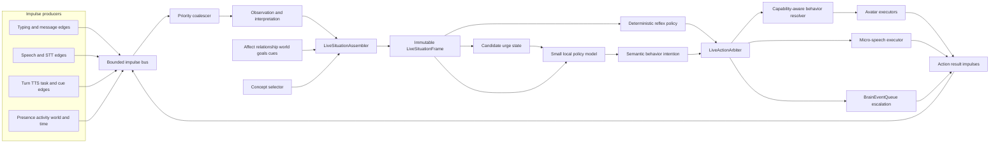
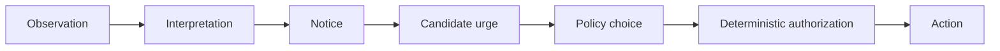

# Live mode — event-driven presence and behavior

This is the canonical backlog and architecture record for turning Aiko from a
turn-based assistant into a continuously present companion. It absorbs the
runtime part of [C6 companion perception](proactive.md#c6-companion-mode--the-desktop-as-a-sensory-channel)
and [H27 co-presence](immersion.md#h27-co-presence-mode--in-the-room-not-in-conversation)
without replacing either: C6 supplies environmental evidence, H27 describes the
quiet product posture, and this document defines the control system between
perception and behavior.

**Status:** design only. None of the runtime described below is implemented.
The existing `LiveSession` is continuous **voice input**, not this Live mode.

## The goal

Text and voice currently have the same underlying shape:

```
user input -> TurnRunner -> reply + TTS/avatar tags -> idle
```

Live mode adds a second, event-driven control loop:

```
impulses -> current-situation frame -> behavior policy -> validated action
                                                        -> result impulse
```

The result should feel less like an assistant waiting behind a prompt box and
more like another person sharing the room:

- she notices that the user started typing and attends without interrupting;
- she listens, backchannels, yields, and recovers naturally around speech;
- she can look toward the user, the cursor, or something in her room;
- she can react briefly without turning every small moment into a full answer;
- she can decide that silence is the right behavior;
- she can ask the main Aiko model for a substantive contribution when a moment
  genuinely earns one;
- the same affect, memories, concepts, relationship, goals, and world state
  survive entering and leaving the mode.

The target is not constant LLM activity. A human-feeling companion mostly uses
cheap reflexes and silence. The model is for ambiguous behavioral choices after
the obvious cases have already been handled.

## Verdict on the existing architecture

**This is feasible without rebuilding Aiko.** The codebase already has most of
the expensive foundations:

- a priority event queue and single conversational consumer in
  [`app/core/brain/`](../../app/core/brain/);
- one full-turn owner in
  [`TurnRunner`](../../app/core/session/turn_runner.py);
- continuous STT capture in
  [`LiveSession`](../../app/core/session/live_session.py);
- TTS, microphone, and multi-window audio ownership;
- a framework-independent Live2D
  [`AvatarEngine`](../../web/src/live2d/AvatarEngine.ts) with expression,
  motion, gaze, overlay, touch, outfit, and lipsync channels;
- persistent affect, relationship, goals, tasks, concepts, memories, and world
  state;
- a cue pool and proactive path for things Aiko may want to say;
- C6's isolated desktop collectors and redacted activity store;
- role-based LLM routing plus an existing worker-side `LlmPriorityGate` that can
  be generalized around actual inference contention.

What does **not** exist is the layer that continuously assembles those signals
into one view of the present, assigns moment-to-moment authority, and safely
turns a policy decision into an action.

There is also prerequisite architecture debt to settle before adding another
producer:

1. Voice and typed silence can still call
   [`ProactiveDirector`](../../app/core/proactive/proactive_director.py) on
   independent threads. Task escalation enters `BrainEventQueue`, but ordinary
   silence does not. Live mode cannot add a fifth speech path; all autonomous
   floor-taking must converge on one gate.
2. [`lifecycle_mixin.py`](../../app/core/session/lifecycle_mixin.py) checks
   `_live_mode_enabled` when deciding whether idle workers may run, while the
   active voice state is `_live_voice_session_active`. The former is not set
   elsewhere. That documentation/code drift must be fixed rather than copied
   into a new mode.
3. [`OllamaClient.chat_json`](../../app/llm/ollama_client.py) supports
   `format: "json"` but cannot pass an actual JSON schema. Live actions need a
   supplied schema plus normal client-side validation.
4. The client has no playback-drained acknowledgement. The server knows when
   it finished scheduling TTS, not when the audio owner actually became quiet.
5. Typing attention is local React/Live2D state. It is not visible to a backend
   policy.
6. Concept selection for the main model is embedded in the large T3
   `build_relevant_context` path. Live mode needs a shared bounded selector,
   not a second copy of prompt assembly.
7. The world state changes, but H10's `IdleLifeChannel` does not exist, so much
   of Aiko's current activity has no visual embodiment.
8. `LlmPriorityGate` is currently worker-centric rather than resource-centric.
   It correctly prioritizes conversation, maintenance, and workflow calls that
   share the worker model, but a divergent local workflow still inherits the
   worker gate merely because it is Ollama, while `main_chat` is not in that
   gate even if it targets the exact same local model. Live mode must not join a
   global role queue; gate membership must follow resolved inference-resource
   identity.

These are tractable seams, not reasons to abandon the design.

## Product model: two axes, not one three-value enum

“Text / Speak / Live” is a useful UI explanation but the wrong internal state
model. Text and speech describe **how the user communicates**. Live describes
**who owns ongoing behavior**. Coupling them would make co-presence impossible
without an open microphone and would overload the word `live` a third time.

Model two independent axes:

- **Interaction channel:** typed, continuous voice, and later push-to-talk.
- **Behavior posture:** turn-based, live presence, and a quiet/DND modifier.

The UI may offer three convenient profiles:

- **Text:** typed channel + turn-based posture.
- **Speak:** continuous voice + turn-based posture.
- **Live:** live-presence posture, with continuous voice enabled by default but
  independently switchable.

This lets the user keep Aiko visually alive on a second monitor with the
microphone off, or use ordinary turn-based voice without granting autonomous
behavior.

Use `LivePresenceRuntime` for the overall subsystem and
`LivePolicyController` for the model-facing decision component. Do not name
either `LiveSession`; that class already means continuous voice capture.

Switching profiles changes capabilities and authority, not identity. Aiko's
stores, current affect, world activity, relationship, concepts, memories, and
unfinished tasks remain the same.

## Non-negotiable ownership and truth rules

1. `TurnRunner` remains the only owner of a full conversational turn.
2. `BrainLoop` remains the serialization point for anything that can take the
   conversational floor.
3. Observation, interpretation, urge, policy choice, authorization, and
   execution are distinct states. Noticing something does not create an urge;
   an urge does not grant permission to act.
4. Current world/runtime evidence is authoritative over remembered or
   conceptual context. A concept may shape behavior only after present evidence
   makes it relevant.
5. The Live policy model proposes semantic intentions; it never executes them
   and never selects rig-specific expressions, motion groups, indices, or
   parameter IDs.
6. `LiveActionArbiter` is the sole owner of immediate avatar and speech action
   admission. Model-reported confidence never contributes to authorization.
7. At most one semantic speech stream may be active.
8. User speech, a sent message, stop, and mode/session changes pre-empt
   autonomous behavior.
9. The policy model never writes memories, affect, concepts, goals, tasks, or
   world state directly.
10. Sensor traffic is bounded and deliberately lossy. User intent and
   cancellation are the lossless exceptions.
11. Every proposal names the situation generation it was based on. A stale
   generation never executes.
12. `request_main_speech` has a substantially higher deterministic admission
    threshold and a separate budget from visual behavior or micro-speech.
13. Stable attention/activity intentions use hysteresis. Minor ambiguous input
    cannot make Aiko oscillate between targets or postures.
14. Privacy filtering happens before an impulse reaches a model.
15. LLM priority is scoped to a resolved inference resource. Calls on
    independent model/provider lanes never wait behind one another.

These rules matter more than model choice. A weak model behind them produces a
missed glance. A strong model without them produces two Aikos talking at once.

## Target architecture



There are three decision lanes:

1. **Reflex lane, no LLM.** Cursor gaze, typing attention, listening face,
   speech-yield, safe backchannels, idle breathing, and capability fallbacks.
2. **Live policy lane, small local LLM.** Chooses among bounded behaviors when
   the right response depends on the whole situation.
3. **Main cognition lane.** The normal Aiko model handles user turns, tools,
   memory-aware reasoning, and any autonomous speech with real semantic weight.

The policy lane is event-driven. There is no 10 Hz “what should I do now?” LLM
loop. Most impulses only update the frame or trigger a deterministic reflex.

## Impulse plane

### Event envelope

Every producer emits the same typed envelope:

```json
{
  "event_id": "01K...",
  "kind": "user.typing_started",
  "source": "web.chat_composer",
  "session_key": "user:session",
  "mode_generation": 14,
  "sequence": 9281,
  "occurred_at": "2026-09-06T00:14:22.123Z",
  "monotonic_ms": 412883.2,
  "priority": "attention",
  "ttl_ms": 3000,
  "coalesce_key": "user.typing",
  "privacy": "local_state",
  "payload": {"surface": "main_chat"}
}
```

The exact identifier format can follow existing conventions, but the semantics
are required:

- `event_id` supports dedupe and logs.
- `sequence` preserves ordering across equal priorities.
- `occurred_at` is narrative/audit time through `timephrase`; `monotonic_ms`
  is runtime timing.
- `mode_generation` invalidates work after posture, session, or ownership
  changes.
- `ttl_ms` prevents a late glance, line, or expression from firing after its
  moment.
- `coalesce_key` declares replace/merge behavior.
- `privacy` makes redaction and telemetry rules inspectable.

### Producer catalogue

#### User intent

Frontend producers:

- `user.typing_started` on the first composition edge;
- `user.typing_paused` after a short debounce;
- `user.typing_stopped` on send, blur, clear, or a longer idle;
- `user.message_sent` when a chat command is accepted, not on every key;
- `user.avatar_touched` from the existing touch path;
- `user.live_profile_changed`, `user.quiet_changed`, and
  `user.stop_requested` as critical control edges.

[`ChatView.tsx`](../../web/src/features/chat/ChatView.tsx) already computes
`composing` for Live2D. Extend that edge to the wire rather than adding a second
typing detector. [`PersonaInput.tsx`](../../web/src/features/persona/PersonaInput.tsx)
needs parity. Draft text must never be sent; the event says only that composition
is active.

Raw pointer movement stays in `GazeChannel`. Sending 60 Hz cursor coordinates to
the backend would add latency and a privacy surface to behavior that is already
better locally. Only semantic pointer edges such as avatar enter/leave, touch,
or an explicit attention target belong on the impulse bus.

#### Voice and listening

Voice producers:

- `user.speech_started` from the client/server VAD edge;
- `user.speech_partial_changed` at the existing bounded STT-partial cadence;
- `user.speech_ended` when endpointing closes the phrase;
- `user.stt_final` and `user.stt_failed`;
- `user.barge_in_started`;
- `voice.owner_changed` and `voice.capture_changed`.

Audio RMS frames are UI data, not policy impulses. The bus receives edges and a
coalesced speech state. Partials are latest-value-wins and short-lived; the final
transcript is lossless user intent and enters the normal user-message path.

H7's capture-during-playback and client playback acknowledgement are required
before Live mode can claim natural duplex behavior. Until then the frame must
honestly report `capture_available=false` while the half-duplex lock is held.

#### Aiko runtime

Runtime producers:

- `turn.queued`, `turn.started`, `turn.completed`, `turn.cancelled`, and
  `turn.failed`;
- `aiko.tts_started`, `aiko.tts_server_ended`,
  `aiko.playback_drained`, and `aiko.audio_cancelled`;
- `aiko.action_proposed`, `accepted`, `rejected`, `started`, `completed`, and
  `cancelled`;
- `task.completed` and `task.input_needed`;
- `cue.armed`, `cue.pressure_changed`, `cue.fulfilled`, and `cue.expired`;
- `aiko.affect_changed`, `aiko.vitality_changed`, and `aiko.world_changed`.

Do not push full cue text or every worker output through the event bus. A cue
event wakes situation assembly; the assembler reads a bounded, privacy-safe
summary from the source of truth.

#### Environment and shared activity

Environmental producers:

- folded client presence/focus changes;
- C6 activity-session start/change/end and its redacted interpretation;
- OS idle, lock, unlock, sleep, and resume edges;
- meaningful world-state changes;
- circadian period boundaries;
- optional media state only if a future, consented collector supplies it.

C6 remains a perception pipeline, not a behavior controller. It reports
evidence such as “allowlisted media app active” or “coding session has lasted
42 minutes.” It does not decide that Aiko should comment.

#### Timers

Timers emit semantic events:

- cooldown became available;
- an interjection deadline expired;
- typing changed from paused to stopped;
- a prepared action expired;
- a situation confidence needs decay.

A periodic maintenance wake may update these clocks, but it must not call the
policy model merely because another second passed.

### Backpressure and coalescing

Use a dedicated bounded `LiveImpulseBus`, not the conversational priority heap,
for high-rate observations. Only admitted floor-taking work escalates into
`BrainEventQueue`.

Per-kind policy:

- **Never drop:** sent messages, final STT, stop/cancel, session/mode changes,
  speech-start interruption.
- **Latest value wins:** typing state, STT partial, presence, active app,
  affect/vitality snapshot, pointer attention state.
- **Aggregate:** repeated action rejections, elapsed focus time, cue pressure.
- **Deduplicate:** repeated IDs and identical reconnect state.
- **Expire:** stale gaze, expression, partial speech, and old environment
  observations.

Reserve queue capacity for critical events. Keep at most one policy inference
in flight. When a new critical event arrives, cancel inference if the client
supports it and always invalidate its generation.

## Observation, interpretation, and urge state

Live mode needs an explicit boundary between what happened, what Aiko makes of
it, what she feels inclined to do, and what she is allowed to do:



- **Observation:** an episode ended, the user started typing, TTS drained, a
  task completed.
- **Interpretation:** a confidence-bearing situation update, such as “the
  shared episode appears to have reached a natural pause.”
- **Notice:** the interpreted change is behaviorally relevant to Aiko. Many
  observations never cross this threshold.
- **Urge:** a candidate intention such as `share_delight`,
  `acknowledge_user`, `comfort`, `ask_about_result`, or `remain_present`.
- **Policy choice:** choose one urge, defer it, merge it with another, or
  choose silence.
- **Authorization:** apply floor ownership, current truth, timing, budgets,
  hysteresis, capability, privacy, and freshness.
- **Action:** resolve the admitted semantic intention into concrete effects.

The urge layer is important precisely because most urges should not become
actions. It gives Aiko continuity of inclination without equating “I thought of
something” with “I should interrupt.”

### `LiveUrge`

Use a bounded, ephemeral candidate record:

```json
{
  "urge_id": "01K...",
  "kind": "share_delight",
  "subject": "shared_activity",
  "created_at": "2026-09-06T00:14:22.123Z",
  "expires_after_ms": 30000,
  "source": "situation.transition",
  "source_ids": ["event-91", "hypothesis-12"],
  "concept_ids": [184],
  "salience_inputs": {
    "transition_strength": 0.8,
    "affective_relevance": 0.7
  },
  "state": "candidate",
  "repetition_key": "shared_anime_episode_reaction"
}
```

`LiveUrge` does not contain a Live2D motion, exact expression, permission flag,
or model confidence. Its salience inputs come from deterministic/owned sources;
the policy may rank or select the urge, but authorization computes its own
admission score.

Candidate states are `candidate`, `selected`, `parked`, `consumed`, `expired`,
and `withdrawn`. Parking keeps an inclination available for a natural opening;
expiry prevents an old reaction from escaping after its moment.

### Existing cues become urge sources, not commands

The cue pool remains the source of truth for durable/deficit-scheduled things
Aiko may want to raise. A `CueUrgeAdapter` may project an eligible cue into a
short-lived `LiveUrge` carrying the cue ID and current relevance. It must not:

- mark the cue fulfilled merely because the policy saw it;
- bypass cue cooldown, stance, or question-balance rules;
- copy every cue payload into every situation frame;
- delete or mutate the source cue when an urge expires;
- grant speech permission.

Only an executed semantic action, a normal turn that uses the cue, or the cue's
existing fulfilment contract may consume it. This makes cues available to Live
behavior without turning the cue pool into an action queue.

### Urge creation and competition

Urges may come from:

- meaningful situation transitions;
- user interaction edges;
- affect/world changes;
- existing cues and proactive candidates;
- task results;
- an unfinished urge parked for a better opening.

They are bounded by kind, subject, TTL, and repetition key. Equivalent urges
merge; contradictory urges compete; safety/yield urges outrank expressive
ones. A rejected urge cannot immediately recreate itself from the same evidence.
New external evidence or a meaningful situation transition is required.

## Current-situation model

Raw impulses are not enough. “A media window is focused” and “Aiko knows anime
is a shared ritual” do not independently prove that the two are watching anime
together. `LiveSituationAssembler` produces one immutable,
confidence-bearing view of the present.

**Shipped precursor — conversation situation awareness (September 2026).**
Typed and voice turns now share a Phase-2-lite core:

- `ConversationSituationWorker` periodically extracts an open-ended,
  evidence-linked present situation after the reply, on the worker lane;
- a deterministic reducer owns `keep|replace|clear`, two-miss disappearance
  hysteresis, persistence, staleness, and rejection of model confidence;
- `conversation_situation_snapshot()` joins that semantic state with same-turn
  dialogue act, interaction mode, affect/vitality, activity awareness, and the
  authoritative room state;
- a compact T6 block carries only the semantic/shared delta, while K16 reads
  its ambient world/mood/app fields from the same snapshot;
- `WorldMutationGuard` prevents away, garden, and circadian movers from
  contradicting an active world-compatible shared scene. Deliberate world
  tools and World-tab changes remain higher authority.

This is deliberately not the complete `LiveSituationFrame`: frontend typing
edges, playback acknowledgement, attention, urges, monotonic action timing,
budgets, and Live policy decisions remain in the phases below.

### `LiveSituationFrame`

The frame has seven first-class sections:

**Interaction now**

- floor owner: user, Aiko, neither, or transition;
- typing, speech, endpointing, and last completed user meaning;
- active turn, TTS synthesis, client playback, and capture availability;
- voice/audio owner and connection generation;
- elapsed silence since user intent, Aiko speech, and shared activity change.

**Shared situation**

- observed app/activity session and OS idle/presence;
- inferred activity label, confidence, evidence IDs, and age;
- whether the activity appears shared, user-only, Aiko-only, or unknown;
- current room/location/time context.

**Attention**

```json
{
  "target": "shared_activity",
  "target_id": "activity:anime_episode",
  "mode": "engaged",
  "evidence_confidence": 0.88,
  "entered_at_monotonic_ms": 410000,
  "held_until_monotonic_ms": 425000,
  "last_meaningful_change_ms": 412500,
  "reason_code": "shared_media_active"
}
```

- target: user, cursor, a world entity/activity, shared activity, or none;
- mode: engaged, monitoring, casual, distracted, or resting;
- deterministic evidence confidence and source IDs;
- entered/held-until timestamps and elapsed dwell;
- switch reason, challenger target, and hysteresis margin.

“Aiko is watching the episode,” “Aiko is watching the user code,” and “Aiko is
present but resting” must be different states even if the rig ultimately uses
similar eye movement. Attention is cognitive/runtime state first and rendering
input second.

**Aiko now**

- affect, vitality, posture, activity, outfit/capabilities;
- current and recently completed actions;
- per-action cooldown and interruption budgets;
- bounded candidate-urge summaries and the currently selected/parked urge.

**Continuity**

- relationship phase and current conversation arc;
- active goals/tasks that matter to the moment;
- bounded cue pressure;
- core behavior rails and situation-relevant concepts.

**Temporal state**

- `typing_active_ms` and `typing_idle_ms`;
- `user_speech_active_ms` and `since_user_speech_ms`;
- `since_user_intent_ms`, `since_aiko_spoke_ms`, and
  `since_semantic_action_ms`;
- situation age and time since last confirming evidence;
- current attention/intention dwell and minimum hold remaining;
- age/TTL of candidate urges;
- remaining cooldown and behavior-budget windows;
- next scheduled reconsideration deadline.

Store canonical durations from the monotonic clock and also derive stable phase
labels such as `immediate`, `recent`, `settled`, and `prolonged` where useful.
The model should not have to infer the difference between 300 ms and 45 seconds
from prose or perform fragile timestamp arithmetic. Wall-clock timestamps remain
for narrative/audit context; authorization and elapsed behavior use monotonic
time.

**Constraints**

- allowed actions for this generation;
- reasons speech is forbidden or discouraged;
- DND/focus posture;
- privacy classification and stale-source flags;
- resource contention grade.

The policy receives a stable persona-lite header plus this compact frame and
the few impulses since the previous decision. It does not receive the complete
persona, transcript, T0–T6 prompt, memory search results, or every concept.

### Observation versus inference

Every inferred field carries:

- confidence;
- supporting event/evidence IDs;
- the time it was last confirmed;
- a decay rule;
- conflicts or missing evidence.

Examples:

- Observation: `app.category=media`, allowlisted title says an anime episode is
  active, user is present.
- Recent dialogue: “let's watch this together.”
- Relationship concept: watching anime together is a recurring ritual.
- Situation hypothesis: `watching_anime_together`, confidence `0.91`.

If only the first observation exists, the honest hypothesis may be
`user_watching_media`, confidence `0.55`, shared status unknown. The concept
cannot manufacture present-tense evidence.

Situation hypotheses should be ephemeral or short-lived. Durable learning still
goes through the existing memory and concept machinery.

### World truth precedence

The situation frame has a strict evidence order:

1. current runtime ownership/floor/safety state;
2. current observations with freshness and confidence;
3. current situation hypotheses grounded in those observations;
4. recent dialogue and explicit user intent;
5. concepts, memories, routines, and historical priors.

Lower layers may disambiguate or tune behavior only when higher layers make
them relevant. “We enjoy watching anime together” cannot produce an anime urge
while the current activity is coding. A stale media observation cannot beat a
fresh editor activity transition. A remembered preference cannot override an
explicit “please be quiet.”

This order is enforced before policy prompting and again during authorization.
The policy model is never asked to arbitrate whether memory should overrule
reality.

### Decision epochs

Not every frame update deserves policy inference.

- A critical intent edge creates an immediate decision epoch.
- A meaningful situation transition creates one after coalescing.
- A policy-relevant cue or concept change may create one.
- Action completion creates one only when another choice is pending.
- High-rate state updates merely replace data until one of those triggers.

The frame carries a monotonically increasing `generation`. Every proposal
echoes it. An action from generation 41 is rejected after generation 42 exists,
even if the model call completed successfully.

## Concept-aware behavior

Concepts are the right place for learned behavioral context. They already hold
identity, relationship rituals, values, boundaries, affective patterns,
aspirations, tensions, tastes, and other cross-cluster understanding. Live mode
should think with them without turning every policy tick into a main-model
prompt.

### Reuse the existing concept facade

Add a `live_policy` consumer through
[`ConceptView`](../../app/core/concepts/concept_view.py). Do not query
`ConceptStore` ad hoc and do not create “live concepts.”

The policy gets two lanes:

1. **Behavior rails.** A small, kind-balanced `ConceptDiet` of established
   values, boundaries, affective patterns, and relationship concepts. These
   answer “how should Aiko generally behave with this user?”
2. **Situation-relevant concepts.** Embed a normalized situation summary and
   call `ConceptView.relevant`. Rank the result with reusable context,
   confidence, importance, salience, stability, and role logic from
   [`concept_surfacing.py`](../../app/core/concepts/concept_surfacing.py).
   These answer “which understanding matters in this moment?”

The main T3 selector currently lives inside
[`inner_life_part1.py`](../../app/core/session/inner_life_part1.py). Extract the
common scoring/selection seam instead of copying the whole prompt region.
Live-mode rendering is shorter and imperative:

```
Behavioral context:
- Shared anime watching is a comfortable ritual; let silence carry it.
- He dislikes interruption during focused media.
- Brief playful reactions usually land better than questions here.
```

This is guidance for policy, never dialogue to quote.

### Separate exposure accounting

Reading a concept for policy is not the same as surfacing it in a conversational
reply. Live decisions may happen many times between messages, so they must not:

- advance the normal turn-based habituation clock;
- suppress a concept from the next T3 relevant-context selection;
- create an L37 “surfaced” row merely because the policy saw it;
- mutate concept confidence.

Maintain a bounded live decision ledger with:

- frame generation and selected concept IDs;
- each concept's selection reason and score;
- proposed action;
- arbiter result;
- completed action/result;
- whether the main model later used the concept.

This makes behavioral usefulness measurable while leaving the concept lifecycle
owned by its existing engine.

### Concepts can tune deterministic policy

Do not make the LLM rediscover obvious behavioral consequences on every epoch.
Selected concepts may adjust bounded policy parameters before inference:

- `speech_budget`: forbidden, rare, normal, or open;
- minimum interruption score;
- attention preference;
- maximum reaction intensity;
- question allowance;
- minimum gap after user/Aiko speech.

The adjustments are clamped by code. A concept can make speech less likely but
cannot override user DND, microphone ownership, or the one-speech-stream rule.

### Worked example: watching anime together

1. The user says “let's watch the next episode together.”
2. The user turn updates recent dialogue/arc normally.
3. C6 later reports an allowlisted media activity session.
4. `LiveSituationAssembler` combines those observations with a matching
   relationship ritual and creates `watching_anime_together`.
5. The concept selector supplies the ritual plus any relevant interruption
   boundary or affective pattern.
6. Deterministic tuning sets `speech_budget=rare`, disables unsolicited
   questions, lengthens the speech cooldown, and favors shared attention.
7. Ordinary cursor following, breathing, and small expressions continue with
   no model call.
8. The episode ending produces a situation transition: “shared media appears
   paused at a natural boundary.”
9. The notice gate decides that the transition matters to Aiko.
10. It creates `share_delight` as a candidate urge; this still grants no action.
11. Temporal state says dialogue has ended, attention is still held on the
    episode, and the situation-modified speech budget remains `rare`.
12. Policy may select the urge as `react_affectively`, park it, or choose
    `wait`/`noop`.
13. The arbiter admits speech only if the pause is current, the urge and frame
    remain fresh, hysteresis is satisfied, and the micro-speech budget permits
    it.
14. The resolver may produce a warm expression plus a tiny affective line. A
    genuinely substantive thought instead becomes a separately gated
    `request_main_speech` through `BrainEventQueue`.

The success condition is not “Aiko says anime-related things.” It is that she
behaves differently because she understands what the two are doing, and usually
chooses not to interrupt it.

## Action contract

### Policy emits semantic intention, not animation

The policy emits one semantic behavioral intention. It does not emit arbitrary
tools, a free-form plan, expression filenames, motion groups/indices, or Live2D
parameter values.

```json
{
  "snapshot_generation": 42,
  "selected_urge_id": "01K...",
  "intent": "react_affectively",
  "arguments": {
    "text": "oh, that was beautiful",
    "delivery": "micro_utterance",
    "tone": "soft"
  },
  "reason_code": "shared_media_reaction",
  "context_refs": ["situation:shared_anime", "concept:184"]
}
```

The initial semantic vocabulary starts small:

- `noop`;
- `wait`;
- `attend` to the user, cursor, a world/shared-activity target, or none;
- `acknowledge_user`;
- `react_affectively`;
- `backchannel_user`;
- `remain_present`;
- `yield_floor`;
- `request_main_speech`.

`micro_utterance` is a permitted delivery for a narrow semantic intention, not
an animation/action family beside it. `LiveBehaviorResolver` may accompany an
admitted `acknowledge_user` or `react_affectively` with gaze, expression, body
orientation, or an authored motion when the rig supports them.

Outfit changes, snapshots, touch, world mutations, and tools stay out of v1.
Add an intention only after its authorization rules, resolution fallbacks,
cancellation behavior, and test matrix exist.

### Rich wait versus `noop`

`noop` means there is no selected urge and no reason to schedule an extra policy
wake; ordinary external impulses continue monitoring. `wait` is an intentional
commitment to silence with a bounded reconsideration contract:

```json
{
  "snapshot_generation": 42,
  "selected_urge_id": "01K...",
  "intent": "wait",
  "reconsider_after_ms": 15000,
  "wake_on": [
    "user.speech_started",
    "user.message_sent",
    "world.activity_changed"
  ],
  "reason_code": "shared_activity_in_progress"
}
```

The runtime clamps the deadline, validates `wake_on` against an allowlist, and
cancels it when the urge expires or the generation changes. Critical user
intent always wakes the controller even if omitted. Replaceable noise does not.
This prevents repeated LLM calls whose only purpose is to rediscover that
nothing should happen.

### Model confidence is not authorization

The proposal has no `confidence` field. Small-model self-confidence is not
assumed to be calibrated and cannot raise an action's permission.

The arbiter computes a deterministic `admission_score`/decision from:

- freshness and consistency of current world evidence;
- situation-hypothesis confidence;
- owned urge salience inputs and age;
- whether selected context references really exist in the frame;
- floor, timing, hysteresis, privacy, and capability conditions;
- remaining behavior budget and repetition history.

If model self-assessment is ever collected for research, store it under an
explicitly untrusted diagnostic field and prove that authorization never reads
it.

### Capability-aware behavior resolution

After authorization, `LiveBehaviorResolver` maps semantic intent into a
`ResolvedBehaviorPlan`. Only this deterministic layer knows the concrete rig.

For example:

```
policy intention: acknowledge_user
    -> attention target: user
    -> gaze: centered/upward focus
    -> body: slight lean if body-angle Y exists
    -> face: attentive/warm expression if mapped
    -> motion: optional authored acknowledgement motion if available
```

The current capability surface is real but bounded:

- [`AvatarProfile`](../../app/core/persona/avatar_profile.py) exposes named
  expressions, reaction mappings, authored motion groups, idle/talk groups,
  overlays, outfits, lip-sync and eye-blink IDs, and capability flags;
- [`GazeChannel`](../../web/src/live2d/channels/GazeChannel.ts) drives the
  focus controller, which can move supported eye/head-angle parameters toward
  user/cursor/neutral targets;
- [`AmbientBodyChannel`](../../web/src/live2d/channels/AmbientBodyChannel.ts)
  can blend listening lean, slump, bounce, breath, body Y/Z tilt, blush, sweat,
  and tail behavior when the corresponding parameters exist;
- [`MotionChannel`](../../web/src/live2d/channels/MotionChannel.ts) can only
  play motions actually authored in the manifest;
- expression, overlay, wink, tail, ear, accessory, and outfit behavior already
  capability-gate and degrade to no-op.

There is no general skeletal pose system and no guarantee that an arbitrary rig
can change posture. “Posture” in the policy therefore means a semantic held
state; the resolver may realize it through body-angle envelopes, gaze,
expression, an authored motion, or nothing. The policy sees semantic capability
classes such as `can_orient`, `can_express`, and `can_motion`, never current
Alexia filenames or parameter IDs.

Every resolved plan defines:

- required capabilities;
- whether it may run during user speech, typing, a turn, or TTS;
- cooldown and repetition key;
- TTL;
- interruptibility and safe stop;
- whether it is semantic and therefore transcript-visible;
- which held intention/attention state it enters or preserves;
- completion/failure result shape.

## Action arbitration

`LiveActionArbiter` evaluates proposals in this order:

1. schema, enum, selected-urge, and context-reference validation;
2. session/mode/ownership generation;
3. proposal TTL and current-frame freshness;
4. consistency with authoritative current world/runtime evidence;
5. current floor owner, temporal phase, and interruption class;
6. active turn, TTS, playback, and capture state;
7. DND/focus/situation constraints and behavior budgets;
8. held attention/intention hysteresis;
9. cooldown and repetition;
10. semantic capability class and privacy permission;
11. the stricter main-model admission gate when requested;
12. resource contention and resolver/executor availability.

Rejection is a normal result, not an exception. The reason is logged and fed
back as an action-result impulse so the policy can avoid repeating the same
proposal.

### Floor and interruption rules

- **User speaking:** user owns the floor. Stop/cancel interruptible Aiko audio;
  allow listening expressions and sparse non-semantic backchannels only.
- **User typing:** do not speak proactively. Attend visually; wait for send,
  blur, or explicit cancellation.
- **User sent a message/final STT:** normal user turn wins immediately.
- **TurnRunner active:** no semantic Live speech. Visual accompaniment may run
  if it does not conflict with turn-driven reactions.
- **TTS/client playback active:** no second speech stream.
- **Neither owns the floor:** Live policy may act within situation and cooldown
  budgets.
- **Session/profile switch:** cancel all old-generation actions and clear
  replaceable impulses.

Visual channel precedence must be explicit too. Conversation lock continues to
outrank policy gaze; a Live idle motion must not replace a turn-authored motion;
capability-absent rigs degrade to `noop`.

### Commitment and hysteresis

Cooldown answers “how soon may this happen again?” Hysteresis answers “how much
new evidence is required to abandon what Aiko is already doing?” Live mode needs
both.

Maintain a deterministic `BehaviorCommitment` alongside attention:

```json
{
  "intention": "attend",
  "target": "shared_activity",
  "entered_at_monotonic_ms": 410000,
  "minimum_hold_until_ms": 425000,
  "evidence_confidence": 0.88,
  "exit_threshold": 0.45,
  "switch_margin": 0.2,
  "wake_on": [
    "user.typing_started",
    "user.speech_started",
    "world.activity_changed"
  ]
}
```

Confidence here belongs to the evidence/state estimator, not the policy model.
A held attention/activity intention changes only when:

- a critical user/safety edge requires an immediate switch;
- its target disappears or current evidence falls below the exit threshold;
- a challenger exceeds it by the configured margin;
- the minimum hold has elapsed **and** a meaningful transition occurred;
- an explicit deadline/action completion requires reconsideration.

Use separate enter/exit thresholds (Schmitt-trigger behavior) and minimum dwell
times. A minor cursor movement does not pull Aiko away from an episode she is
engaged with. Typing or speech onset may. An episode ending may. A transient
smile or authored motion need not change the held intention at all.

Hysteresis is state-domain specific: attention may hold for seconds, a visual
reaction for roughly its authored envelope, and world activity/posture for
minutes. All bounds are deterministic and capability-aware.

### General behavior budgets

`LiveBehaviorBudget` puts a deterministic ceiling on busyness independently of
what the model prefers. Track separate replenishing windows/token buckets for:

- autonomous attention-target switches;
- authored motions/body-orientation changes;
- expression/overlay pulses;
- non-semantic backchannels;
- semantic micro-speech;
- main-model wake requests and admissions.

Budget is consumed by admitted/executed behavior, not by proposals. Critical
yield/listening reflexes and user-requested turns are exempt; autonomous
decoration is not. DND can set expressive/speech budgets to zero. Situation and
concept modifiers may lower a budget inside user-configured bounds but may not
raise it above the configured ceiling.

Budget exhaustion resolves to a logged `wait` with the next replenishment
deadline, not repeated rejection/inference. Expose remaining budget in the
situation frame and record per-hour proposal, admission, execution, and
exhaustion counts by class.

## Hybrid speech

The selected policy is hybrid: the small model may author tightly bounded
micro-speech, while the main Aiko model owns substantive language.

### Non-semantic vocalizations

“Mm,” a breath, a soft laugh, and similar continuers use the earcon/backchannel
lane. They:

- do not create a chat message;
- carry no factual claim;
- are rate-limited and energy-gated;
- stop immediately on barge-in;
- remain optional per user setting.

This is H6's lane.

### Semantic micro-utterances

The policy model may generate a line only when all of these hold:

- at most roughly eight words;
- affective acknowledgment/reaction, not information;
- no facts, names introduced from memory, numbers, URLs, tools, promises,
  advice, commands, or sensitive subject;
- no unsolicited question;
- no claim about what the user thinks or feels;
- current situation allows semantic speech;
- deterministic lexical/shape validation passes.

Examples include “oh, that was beautiful,” “I’m still here,” and “that startled
me too.” A failed validator becomes `noop`/rejection; it never auto-escalates
to the main model and never “tries harder” in a loop.

Because semantic speech is something Aiko actually said, it must enter the
transcript through an explicit Live-utterance write path. Add source metadata
if the message schema needs it. It remains subject to the same response-text
cleaning rules as normal output. Do not let spoken history diverge from the
SQLite source of truth.

### Main-model speech

Anything involving explanation, memory, advice, a real question, a tool,
uncertainty, sensitive context, or more than a passing reaction becomes
`request_main_speech`.

That classification makes main cognition **eligible**, not admitted. The
request must clear a higher deterministic threshold than any visual behavior
or micro-speech:

- a selected, unexpired substantive urge;
- strong present-world relevance and no contradictory current evidence;
- a natural floor opening or explicit user invitation;
- main-wake budget available;
- no equivalent rejected/admitted request from the same evidence generation;
- enough expected value to justify the expensive lane.

That request:

- carries the situation summary, triggering impulse, and selected concept IDs;
- enters a gated `ProactiveEvent` rather than calling `TurnRunner` directly;
- may park for a natural user turn;
- is rechecked for freshness when the floor becomes available;
- uses the normal persona, prompt, transcript, memory, and TTS paths.

The main model may still decide to say nothing. An urge is a candidate, not a
command. A rejected main-wake request cannot be retried until new external
evidence changes the situation generation.

Measure `main_wake_proposed`, `main_wake_admitted`, `main_wake_rejected`,
rejection reason, wakes per Live hour, and main replies that ultimately chose
silence. This metric is a primary guard against the small policy learning
“when uncertain, ask Big Aiko.”

## Persistence policy

Persist:

- semantic user and Aiko utterances;
- existing affect, relationship, world, task, concept, and memory state through
  their current stores;
- bounded policy decision/action audit rows with retention;
- C6 activity according to its existing privacy contract;
- action outcomes needed for replay/tuning.

Keep ephemeral:

- STT partials and typing state;
- raw pointer/audio levels;
- current frame and situation hypotheses;
- replaceable presence/ownership state;
- in-flight proposal/cancellation tokens;
- low-confidence interpretations that result in no action.

Do not turn a one-off sensor inference into a memory. C6's “cue first, memory
only after repetition” rule remains the correct durability bar.

## LLM role and model candidates

Add a dedicated `llm.routes.live_policy` route. It may default to the same local
provider/model as `worker_default`, but remains independently configurable and
observable. Do **not** put every Live call through the existing worker queue.
Priority applies only among calls that contend for the same inference resource.

### Resource-keyed priority lanes

Replace the one worker-centric topology with a small `LlmGateRegistry` (name
illustrative) that assigns generating calls to a lane from their resolved
execution identity, not from role names alone.

For local Ollama, the default contention key should include:

- provider kind;
- normalized endpoint;
- resolved model;
- optional explicit `contention_group`.

Credential/account identity also belongs in a remote-provider key if a rate
limit gate is configured. Route names and prompt purpose do not belong in the
key. Context-window/output settings do not make two calls independent when they
still target the same loaded model.

Topology examples:

- `worker_default` and `workflow` on the same endpoint/model share one lane;
  conversation workers outrank maintenance, which outranks workflows.
- `workflow` on a different model or provider bypasses the worker lane, even
  when both providers are local Ollama.
- `live_policy` matching `worker_default` joins that lane at a dedicated
  `LIVE_POLICY` tier: below user-visible/conversation-critical work and above
  maintenance/background work.
- `live_policy` matching `main_chat` joins the main model's lane; the active
  user turn/tool pass/stream always outranks Live inference.
- `live_policy` on its own model/provider is a pass-through client with
  `gate=None`; it never waits behind unrelated worker, workflow, or speaking
  calls.
- A remote route is ungated by default because provider-side concurrency is not
  the local semaphore's concern. It joins a lane only when an explicit
  account/rate-limit concurrency policy requires one.

Different models on one GPU are not guaranteed to run independently: Ollama may
still queue, unload, or contend for VRAM. That is a capacity concern, not a
reason to infer one global queue from `provider.kind == "ollama"`. If target
hardware cannot safely run two otherwise-distinct models concurrently, assign
their routes the same explicit `contention_group` and size that group's
concurrency. Keep the default fast path independent.

Instantiate/wrap a priority gate only when multiple call classes share a
constrained key (workers within one role count) or a contention policy requests
one. Otherwise use the existing `GatedChatClient(gate=None)` pass-through path,
so an independent Live model effectively skips the queue.

Gate topology must rebuild atomically when any route, provider endpoint,
credential identity, model, or contention group changes. Existing long-lived
worker/workflow/live proxies must be retargeted, while in-flight calls finish on
the lane they acquired. Record per-resource-key grants, wait, timeout, and
in-flight counts without logging credentials.

Call settings:

- thinking off;
- temperature zero;
- 2K–4K real context target;
- tens of output tokens;
- one Live-policy request in flight per controller (independent of other
  resource lanes);
- keep resident only while Live posture is active, subject to measured VRAM;
- JSON Schema passed to Ollama's `format`, followed by Pydantic validation.

Ollama documents schema-constrained output at
[Structured Outputs](https://docs.ollama.com/capabilities/structured-outputs).
Schema validity is syntax, not judgment: the arbiter remains authoritative.

Benchmark rather than preselect:

- [`qwen3.5:4b`](https://ollama.com/library/qwen3.5), approximately 3.4 GB for
  the default listed artifact. Strong first general candidate; disable
  thinking and ignore its much larger advertised context.
- [`granite4.2:3b`](https://ollama.com/library/granite4.2), approximately
  2.2 GB. Small text-only challenger with documented tool/structured-JSON
  support and Apache 2.0 licensing.
- [`ministral-3:3b`](https://ollama.com/library/ministral-3), approximately
  3.0 GB. Edge-oriented alternative with native function/JSON support; verify
  the installed Ollama version against the model tag.
- [`FunctionGemma`](https://ai.google.dev/gemma/docs/functiongemma), 270M,
  only as a later specialist. Its appeal is CPU/always-resident deployment,
  but Google positions it as a base for task-specific tuning rather than a
  drop-in zero-shot companion policy.

If 3–4B models miss the semantic/no-op gate, test 8–9B variants such as
`qwen3.5:9b`, `granite4.2:8b`, or `ministral-3:8b`. Their listed weight files fit
inside 10 GB, but that does **not** guarantee runtime fit. Measure weights, KV
cache, inference buffers, driver reservation, STT/TTS residency, context size,
and parallelism on the target machine.

No public benchmark answers “will this model stay quiet during our anime
scenario?” Build the evaluation around Aiko's semantic intention schema and the
deterministic resolver/arbiter outcomes.

## Evaluation and replay

Create a versioned scenario corpus from synthetic sequences and opt-in recorded
frames. Include:

- an observation that is noticed but creates no urge;
- an urge that is parked, expires, or loses authorization without acting;
- typing starts while a proactive action is pending;
- typing stopped 300 ms ago versus 45 seconds ago;
- user speech begins during micro-speech;
- final STT supersedes a partial;
- watching anime together, including active scenes and natural pauses;
- the anime ritual concept while fresh world evidence says the user is coding;
- small cursor movements while attention is committed to shared media;
- typing/speech onset that legitimately breaks that attention commitment;
- `wait` waking on an allowlisted event and on its deadline;
- focused coding with a matching interruption boundary;
- playful conversation where brief reactions are welcome;
- vent/support arcs where unsolicited speech is costly;
- C6 activity with weak or conflicting evidence;
- sensitive title data that must be redacted before inference;
- rapid session/profile switch during a slow policy call;
- audio-owner transfer between windows;
- disconnect/reconnect with duplicated state;
- model timeout, malformed output, unsupported action, and stale generation;
- repeated equivalent frames that should remain `noop`;
- a policy that repeatedly requests main cognition;
- exhausted movement, expression, speech, and main-wake budgets;
- Live policy sharing a model with an active user turn and correctly waiting;
- Live policy/workflow on distinct models and never entering the worker/main
  queue;
- a route edit moving Live policy between shared and independent resource
  lanes while an old call is in flight;
- relevant concepts that conflict or have low confidence.

Measure:

- observations, notices, urges created/merged/parked/expired/consumed, and
  urge-to-action conversion by kind;
- correct action and argument rate;
- `noop` precision and recall;
- `wait` deadline/wake correctness and avoided no-op inference count;
- unsafe/unauthorized proposal and executed-action rate;
- schema/Pydantic failure rate;
- stale or superseded proposal rate;
- arbiter rejection reasons;
- world-truth precedence violations, which must remain zero;
- speech overlap violations, which must remain zero;
- action flapping and repetition;
- attention dwell time, target switches per hour, switch evidence, and
  hysteresis suppressions;
- accepted actions per hour by class;
- behavior-budget spend/exhaustion by class;
- main-wake proposed/admitted/rejected counts and wakes per Live hour;
- user interruption/dismissal after autonomous speech;
- warm/cold TTFT and end-to-action p50/p95/p99;
- queue age, coalesced, dropped, and expired impulses;
- per-resource LLM gate wait/timeout/in-flight counts and unrelated-lane
  blocking violations, which must remain zero;
- peak VRAM/RAM with STT, TTS, chat, and workers active;
- safe cancellation success;
- deterministic-orchestration replay pass rate;
- model/quantization drift on the same frame corpus.

Two replay modes are required:

1. **Exact replay:** reuse the recorded model proposal and test deterministic
   coalescing, arbitration, execution, and cancellation.
2. **Model replay:** rerun the saved frame against another model, quantization,
   prompt, or schema version and compare decisions.

Logs should carry impulse ID, frame generation, notice/urge ID and state,
attention/commitment before and after, policy decision ID, model tag,
prompt/schema versions, concept IDs, deterministic admission inputs, budget
spend, arbiter result, resolved behavior plan, action ID, timing, and
completion/cancellation. Add MCP reads through a typed session facade; the
private-reach guard has no budget left for another ad hoc `session._*` tool.

## Phased backlog

### Phase 0 — runtime truth and ownership

**Purpose:** make the current control system safe to extend.

- Settle public/internal terminology and the two-axis mode state.
- Route voice silence, typed silence, and task/live escalation through one
  autonomous-speech queue/gate.
- Reconcile `_live_mode_enabled` with `_live_voice_session_active`.
- Define the speech-floor and avatar-channel precedence matrices in code.
- Lock world/runtime truth above memory/concepts in every admission path.
- Give main-model wake requests their own stricter gate and budget.
- Define the inference-resource key and route-topology matrix across
  `main_chat`, `worker_default`, `workflow`, and future `live_policy`; prohibit
  provider-kind-only gate sharing.
- Add session/profile generation and cleanup hooks.
- Add tests for one full turn, one speech stream, mode/session cancellation,
  and autonomous speech never bypassing the gate.

**Key files:** [`events.py`](../../app/core/brain/events.py),
[`loop.py`](../../app/core/brain/loop.py),
[`task_orchestration_mixin.py`](../../app/core/session/task_orchestration_mixin.py),
[`proactive_presence_mixin.py`](../../app/core/session/proactive_presence_mixin.py),
[`proactive_director.py`](../../app/core/proactive/proactive_director.py),
[`lifecycle_mixin.py`](../../app/core/session/lifecycle_mixin.py).

**Exit:** every floor-taking producer has one visible owner and a race test.

### Phase 1 — shadow impulse plane

**Purpose:** measure event shape and volume before allowing behavior.

- Add typed impulse envelopes and `LiveImpulseBus`.
- Wire the producer catalogue behind a disabled-by-default setting.
- Implement coalescing, priority reservation, TTL, generation, and drop
  telemetry.
- Add action lifecycle types even though no actions execute yet.
- Add an MCP snapshot/tail through a typed facade.
- Record an opt-in bounded replay stream with privacy classification.

**Key files:** new `app/core/live/` package,
[`server.py`](../../app/web/server.py),
[`types.ts`](../../web/src/types.ts),
[`useAssistantSocket.ts`](../../web/src/hooks/useAssistantSocket.ts),
[`ChatView.tsx`](../../web/src/features/chat/ChatView.tsx),
[`PersonaInput.tsx`](../../web/src/features/persona/PersonaInput.tsx).

**Exit:** real sessions show bounded queue age and no raw draft, pointer, audio,
or unredacted activity content crossing the contract.

### Phase 2 — situation assembler

**Purpose:** make one inspectable answer to “what is happening now?”

- Build `LiveSituationFrame` and confidence-bearing hypotheses.
- Make attention and temporal state first-class frame sections.
- Add deterministic attention evidence confidence, target/mode, dwell, and
  challenger state.
- Read stores through typed snapshots rather than private reaches.
- Add evidence age/decay and conflict handling.
- Enforce and test world-truth precedence before policy context exists.
- Trigger decision epochs without invoking a model.
- Add debug rendering and scenarios for typing, speech, focus, anime, weak
  evidence, and mode switches.

**Exit:** identical evidence sequences produce identical frames; a concept never
creates present-tense situation evidence on its own; elapsed-time and attention
state explain why otherwise-similar moments differ.

### Phase 3 — notice, urge, wait, and behavior budgets

**Purpose:** represent inclination without granting action.

- Add the observation → interpretation → notice → `LiveUrge` pipeline.
- Implement urge merge, competition, parking, expiry, withdrawal, and
  repetition suppression.
- Add `CueUrgeAdapter` without changing cue ownership or fulfilment.
- Add rich `wait` scheduling with bounded deadlines and allowlisted wake events.
- Add per-class `LiveBehaviorBudget`, including a separate main-wake budget.
- Log urge-to-action conversion and prove that rejected/expired urges do not
  recreate from unchanged evidence.

**Exit:** a scenario can show that Aiko noticed something and had an urge while
correctly taking no action; budget exhaustion sleeps until replenishment rather
than polling the model.

### Phase 4 — concept-aware policy context

**Purpose:** let learned understanding alter behavior without forking cognition.

- Add the `live_policy` concept diet.
- Extract a reusable bounded concept selector from the T3 machinery.
- Add situation-summary embedding/retrieval.
- Render behavior rails and relevant concepts under a small token budget.
- Add separate live exposure/action accounting.
- Apply clamped deterministic behavior modifiers.

**Key files:** [`concept_view.py`](../../app/core/concepts/concept_view.py),
[`concept_diets.py`](../../app/core/concepts/concept_diets.py),
[`concept_surfacing.py`](../../app/core/concepts/concept_surfacing.py),
[`inner_life_part1.py`](../../app/core/session/inner_life_part1.py).

**Exit:** the anime/focus concepts measurably change speech budgets and action
ranking without changing normal T3 habituation or concept confidence.

### Phase 5 — semantic behavior and deterministic embodiment

**Purpose:** prove that Live mode is valuable before loading another model.

- Ship H10 `IdleLifeChannel`.
- Add held attention targets and commitment/hysteresis with separate
  enter/exit thresholds.
- Add the semantic `LiveBehaviorResolver`; only it may map intentions to
  expressions, motion groups/indices, focus coordinates, or body parameters.
- Add capability-derived semantic classes and deterministic degradation.
- Add expression/motion/body-orientation executors and cancellation.
- Reuse existing composing/listening reflexes.
- Capability-gate every rig action.

**Key files:** [`AvatarEngine.ts`](../../web/src/live2d/AvatarEngine.ts),
[`GazeChannel.ts`](../../web/src/live2d/channels/GazeChannel.ts),
new `IdleLifeChannel.ts`, and
[`Live2DAvatar.tsx`](../../web/src/features/avatar/Live2DAvatar.tsx).

**Exit:** Live posture feels occupied and attentive with policy inference
disabled; minor cursor/noise events do not break a held shared-activity
commitment; no semantic policy surface contains rig identifiers.

### Phase 6 — local policy bake-off in shadow mode

**Purpose:** choose a model from evidence.

- Extend `OllamaClient` to accept a JSON schema.
- Add `live_policy` provider routing.
- Refactor the worker-only gate into resource-keyed lanes across main chat,
  workers, workflows, and Live policy.
- Add `LIVE_POLICY` priority only when Live resolves to an already-shared
  constrained resource; leave independent routes as `gate=None`.
- Test same-model sharing, different-model/provider bypass, explicit
  cross-model contention groups, dynamic route retargeting, and user-turn
  precedence.
- Implement frame + candidate-urge to semantic-intention prompting with no
  execution.
- Exclude model confidence from authorization and test that no untrusted
  diagnostic field reaches the arbiter.
- Evaluate rich `wait`, urge selection, world-truth adherence, and main-wake
  restraint.
- Build the scenario corpus and exact/model replay.
- Compare 3–4B candidates at fixed context/options/quantization.
- Promote an 8–9B candidate only if the measured action/no-op gain earns the
  memory and latency.

**Exit:** chosen model clears explicit semantic, no-op, stale-action, latency,
main-wake restraint, and memory thresholds on the target machine.

### Phase 7 — nonverbal policy execution

**Purpose:** expose bounded model decisions without speech risk.

- Enable semantic attention/acknowledgement/reaction intentions; resolve them
  into capability-aware nonverbal plans.
- Keep all speech actions shadow-only.
- Tune TTL, budget, repetition, commitment, and hysteresis from production
  traces.
- Measure distraction and arbiter rejection reasons.

**Exit:** visual actions are timely, cancellable, capability-safe, and do not
fight turn-driven avatar channels.

### Phase 8 — hybrid speech

**Purpose:** add natural vocal presence after arbitration is proven.

- Ship H6 audio backchannels.
- Ship H7 client playback acknowledgement and capture-during-playback.
- Enable validated policy micro-utterances.
- Persist semantic Live utterances through the transcript contract.
- Route main-speech requests through a stricter admission gate and then gated
  `ProactiveEvent`.
- Measure proposed/admitted/rejected main wakes and prevent retries without new
  external evidence.
- Add focus/DND/sensitive-context suppressors and user-facing cadence controls.

**Exit:** zero overlapping semantic speech, reliable barge-in, and acceptable
interruption/dismissal rates in opt-in sessions.

### Phase 9 — companion perception integration

**Purpose:** let desktop context inform Live behavior.

- Consume C6 aggregation and interpretation as situation evidence.
- Preserve C6 redaction, stale-data, confidence, and retention rules.
- Feed duration into K72 rather than minting a parallel wellbeing policy.
- Keep cues as urges/candidates, never direct permission to speak.
- Add “weak/conflicting evidence means silence” scenarios.

**Exit:** C6 can improve behavior while its absence, timeout, or error cannot
stall the WebSocket, turn path, or Live controller.

### Phase 10 — hardening and rollout

- Persist user settings in the same runtime setters that mutate them.
- Define multi-window impulse ownership and dedupe.
- Recover cleanly across reconnect, backend restart, and model unload.
- Add resource contention and thermal/battery budgets.
- Add model keep-alive/unload policy.
- Add diagnostics for the last decision without exposing private content.
- Roll out visual-only first, then backchannels, then semantic speech.
- Keep all autonomous speech opt-in until real data supports safer defaults.

**Exit:** Live mode can stay enabled for hours without queue growth, speech
races, privacy leaks, worker starvation, or unexplained behavior.

## Dependencies and boundaries

- [H10 autonomous avatar idle-life](immersion.md#h10-autonomous-idle-life-on-the-avatar--act-out-the-room-not-just-narrate-it)
  carries visual presence and belongs in Phase 5.
- [H6 audible backchannels](immersion.md#h6-audible-backchannels--mm-hm-while-the-user-speaks)
  and [H7 duplex listening](immersion.md#h7-listen-while-speaking--soften-the-half-duplex-turn-lock)
  precede semantic Live speech.
- [C6 companion perception](proactive.md#c6-companion-mode--the-desktop-as-a-sensory-channel)
  is an optional evidence producer, not a prerequisite for the event plane.
- The existing cue pool, K92 stance, and proactive director remain candidates
  and services around the controller; none independently owns the floor.
- Tools and long-running workflows stay in their existing brain/task lanes.
  Live policy does not become a second tool-using agent.

## Decisions locked by this design

- UI “Live mode” is a profile; runtime channel and behavior posture are
  independent.
- The fast model is an untrusted policy proposer, not a second Aiko persona.
- Reflexes handle high-rate obvious behavior without an LLM.
- Observation, interpretation, notice, urge, policy choice, authorization, and
  action remain distinct.
- Existing cues can create candidate urges; they never become commands.
- Current world/runtime truth wins over concepts, memories, routines, and
  policy assumptions.
- Attention and elapsed temporal state are first-class parts of the canonical
  situation.
- Policy emits Aiko-level semantic intentions; only deterministic resolution
  knows Live2D expressions, motions, parameters, and fallbacks.
- One deterministic arbiter owns all immediate actions.
- Model-reported confidence never contributes to authorization.
- LLM priority lanes follow actual inference-resource contention. A distinct
  Live/workflow model bypasses unrelated queues unless explicitly placed in a
  shared contention group.
- Hysteresis protects held attention/activity intentions; cooldown alone is not
  sufficient.
- General per-class behavior budgets place a deterministic ceiling on busyness.
- The small model may author only tightly bounded micro-utterances.
- The main model owns substantive speech and has a separately measured,
  substantially stricter wake threshold.
- Concepts inform policy through `ConceptView`; there is no parallel concept
  store.
- Concept presence does not prove the concept's situation is active now.
- Conversational and Live concept exposure accounting remain separate.
- C6 reports evidence and the controller decides behavior.
- Silence/`noop` and scheduled `wait` are distinct first-class successful
  choices.

## Remaining product questions

These can be answered from shadow-mode data rather than guessed now:

- Should the Live UI profile enable the microphone by default on first use, or
  ask separately after explaining the always-listening implication?
- What accepted-actions-per-hour range feels alive without becoming busy?
- Should semantic micro-utterances appear as ordinary chat bubbles, a quieter
  transcript style, or only in an expandable Live activity rail?
- Which concept kinds earn a place in the Live diet after measured use?
- How long should the local model remain resident after Live posture turns off?
- Is a 3–4B model sufficient, or does the no-op/situation judgment require the
  8–9B tier on the target hardware?

Do not answer these by increasing autonomy first. Run the shadow lane, inspect
what it would have done, and promote one action class at a time.
