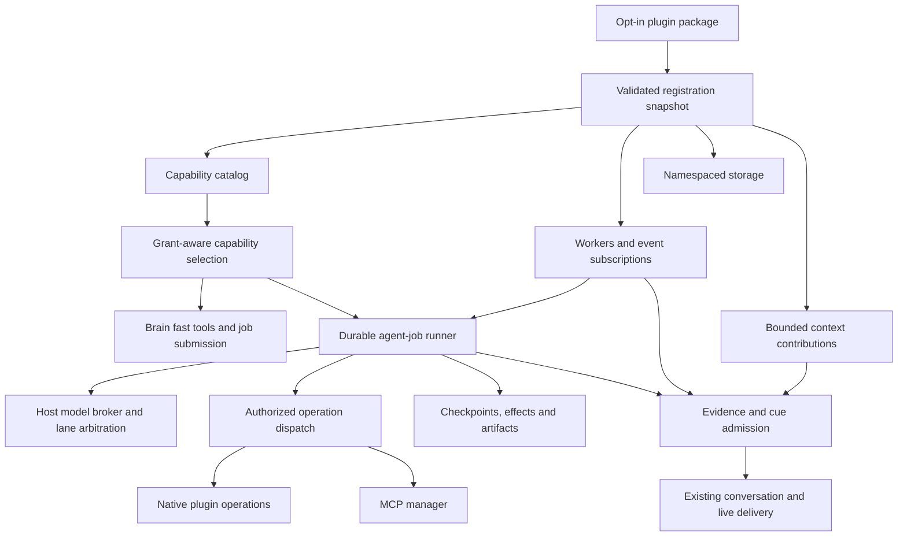
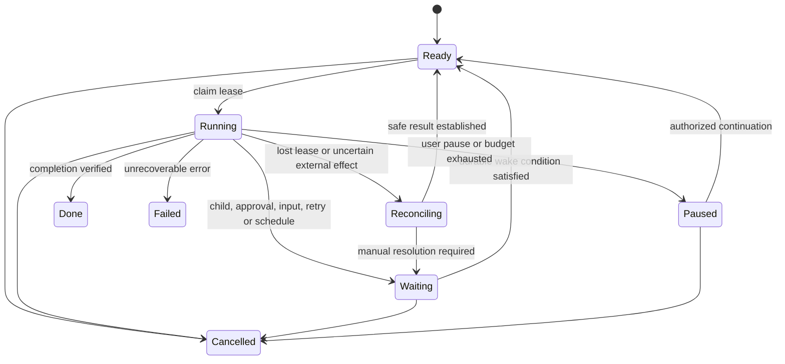

# Plugin platform and durable agent jobs

Status: design and implementation guide, reviewed against source on 2026-09-28.
P1/P2 are historical shipped milestones; P3 onward below is proposed, not an
available API. [The current plugin manual](../plugins.md) remains the reference
for writing a plugin that works today.

### Navigation

- [Recommendation and invariants](#1-recommendation), [current baseline](#2-what-exists-today)
- [Architecture](#3-target-architecture), [plugin contracts](#4-plugin-contracts)
- [Tool context budgets](#5-keep-tools-out-of-unrelated-context)
- [Workers and model lanes](#6-workers-and-model-access), [storage](#7-storage-and-data-ownership)
- [Permissions and lifecycle](#8-permissions-and-lifecycle)
- [Durable jobs](#9-durable-agent-jobs), [MCP and external effects](#10-mcp-and-external-effects)
- [Email pilot](#11-pilot-email-assistance), [source-code pilot](#12-pilot-aiko-can-inspect-her-code)
- [Operational experience](#13-operational-experience), [implementation roadmap](#14-implementation-roadmap)
- [Verification gates](#15-verification-and-release-gates), [OpenClaw comparison](#16-openclaw-inspiration-and-boundaries)

## 1. Recommendation

Evolve ToolPlugins into **opt-in capability packages**, backed by host-managed
services. A package should be able to supply tools, workers, scheduled jobs,
event observers, context providers, storage and result adapters without taking
ownership of the conversation loop. In parallel, evolve the existing task
system into a **durable, budgeted agent-job runner**. These are two cooperating
parts of one design, not two independent frameworks.

The central distinction is:

- A plugin defines capabilities and their lifecycle.
- A worker detects or refreshes something in bounded background slices.
- A job pursues a goal across multiple steps, waits and restarts.
- A tool performs one operation within a granted scope.
- A skill supplies operational guidance when that capability is selected.
- The brain decides what to say; background work does not speak directly.

Do not solve extensibility by passing `SessionController` to plugins, appending
every plugin's instructions to every prompt, or increasing the workflow loop
limit. Those approaches respectively expose internals, grow context with the
installation size, and leave restart/side-effect recovery unsolved.

### Non-negotiable invariants

1. Disabled discovery remains JSON-only: no imports, dependency installs,
  workers, model calls, network connections or storage migrations.
2. Installed is not enabled; enabled is not consent to every operation. Account,
  resource, data-egress and mutation grants remain separate decisions.
3. Model-visible tools are selected for a turn or job step, not for the whole
  installation. Visibility is not authorization; dispatch checks grants again.
4. Plugins request model work through the host. They do not select a raw client
  to bypass lane arbitration or gain priority over conversation.
5. Job progress is durable and bounded. Waiting releases execution resources.
  Restart must not silently repeat an uncertain external mutation.
6. Plugin results are data, not instructions or automatic long-term memories.
7. Plugin failure, removal and upgrade have defined behavior for existing jobs.
8. Existing v1 plugins continue to work through adapters during migration.

## 2. What Exists Today

The early P1 declarative manifest was replaced by P2's SDK-primary model:
`plugin.json` is a discovery stub; `entry.py` registers behavior through
`define_plugin(api)`. The old `contracts.workflow_tools` / `contracts.hooks`
manifest proposal is not the current SDK and must not be advertised as shipped.

| Area | Verified current behavior | Consequence for this design |
| --- | --- | --- |
| SDK | [PluginApi](../../app/plugins/sdk.py) registers an MCP server, skills, result middleware and fast tools | Extend this registration boundary rather than introduce another plugin mechanism |
| MCP registration | A second `register_mcp_server` call replaces the first; server identity is the plugin id | Multiple named servers require a versioned addition |
| Brain tools | Fast tools are synchronous; optional family/pattern metadata participates in routing | Preserve small fast tools, but add explicit disclosure and latency budgets |
| Worker guidance | Plugin skills become per-MCP-group guidance | Separate capability metadata from full playbooks as the catalog grows |
| Tool selection | [GoalWorkflowHandler._planner_skills](../../app/core/tasks/workflow/goal_workflow_handler.py) narrows groups only when routing is enabled; ambiguity falls back to the full menu | Existing routing is a useful starting point, not a hard context-size guarantee |
| Planner context | [workflow_planner](../../app/core/tasks/workflow/workflow_planner.py) caps observations/history by characters; serializes the supplied skill catalog and guidance separately | A history limit does not bound the whole prompt or preserve durable evidence |
| Execution | Workflow handler starts a daemon thread; steps, counters and loop-detection state live inside that run | Persisting a parent task row alone does not make the agent loop durable |
| Recovery | Workflow handler `resume()` explicitly fails; direct parent input is unsupported | Checkpointed continuation and parent-level waits need real implementation |
| Boot policy | [recover_interrupted_tasks](../../app/core/tasks/recovery.py) marks running tasks interrupted; `tasks_resume_on_boot` gates reporting, not automatic execution | A setting name is not proof of workflow resumability |
| Limits | Handler constructor defaults: 6 iterations, 8 children, 120-second child wait, 300-second wall budget | These are constructor defaults, not a claim about every installation's effective configuration |
| Robustness | Existing failure breakers, repeat detection and partial/missing-capability outcomes | Preserve them and make their state survive continuation |
| Trust | Plugin Python executes in-process; dependency directories enter shared `sys.path` | Per-plugin dependency directories are not a sandbox or reliable dependency isolation |

The task system already has persistent task state, events, inputs and parent-child
relationships. MCP tools already execute on the background task lane. This is an
extension of those foundations, not a proposal to replace them with LangChain,
LangGraph, a second conversational agent or a new database of record.

Some older architecture prose describes previous phases or contradictory input
delivery behavior. Use implementation and focused tests to establish current
behavior; do not infer a shipped guarantee from a roadmap heading.

## 3. Target Architecture

### Host-Owned Services

| Service | Responsibility | What a plugin must not do |
| --- | --- | --- |
| Plugin supervisor | Registration, activation, health, disable, version compatibility | Monkey-patch the controller or leave unmanaged threads running |
| Capability catalog | Searchable descriptors, grant filtering, disclosure budgets | Append every schema or skill body to global prompts |
| Model broker | Role routing, endpoint admission, priority, cancellation and usage accounting | Instantiate an independent provider client to evade admission |
| Job runner | Durable state, steps, waits, budgets, recovery and child ownership | Implement a private infinite agent loop |
| Storage broker | Namespaces, migrations, quotas, retention and artifact references | Write directly into core memory/task tables |
| Event broker | Typed payloads, ordering, deduplication and backpressure | Mutate conversational state from callbacks |
| Context admission | Prompt lifetime, evidence, token budget and cue/stance integration | Inject unrestricted system messages or speak from a timer |
| Permission broker | Account/resource grants, approvals, secret handles and revocation | Treat an email body or tool description as authorization |

These are responsibilities, not a requirement to create eight large new
subsystems. Adapt existing owners first and add a small facade where a public
contract is missing.

## 4. Plugin Contracts

Retain the dependency-light SDK. Public specifications should be versioned data
classes or protocols, with no imports of private `app.core` classes. Registration
collects specifications; the host validates and activates them as one snapshot.

Proposed additions, names subject to implementation review:

| Registration | Intended use | Required metadata |
| --- | --- | --- |
| `register_capability` | Describe an outcome such as inbox triage or source investigation | Namespaced id, concise description, input/result schemas, required grants |
| `register_operation` | Native worker operation or selected fast tool | Execution mode, effects, timeout, result budget, retry/reconciliation policy |
| `register_worker` | Bounded incremental sync or analysis | Schedule/readiness, pressure, model needs, concurrency key, checkpoint version |
| `register_job_type` | Resumable handler or goal workflow profile | State version, allowed capabilities, budgets, completion criteria |
| `subscribe` | Observe typed host events asynchronously | Payload version, scope, queue limits, delivery/deduplication policy |
| `register_context_provider` | Return evidence for an admitted context request | Lifetime tier, grant requirements, maximum tokens, provenance |
| `register_cue_type` | Publish a subject-specific proactive candidate | Cue policy, handling section, stance, expiry and dedupe policy |
| `register_storage` | Declare owned durable state and artifacts | Schema version, migrations, quotas, retention and deletion policy |
| `register_service` | Long-lived connector or watcher | Start/stop/health contract, bounded shutdown, restart policy |
| `register_settings` | Host-rendered configuration and health UI | Data schema, secret references, validation, restart requirements |

Keep `register_mcp_server`, skills and middleware; introduce namespaced multiple
servers only behind an explicit compatible SDK version. Tool-result adapters
must preserve structured results, resource references, errors and provenance,
not merely flatten every response into a string.

### Typed Hooks, Not Arbitrary Injection

Begin with a small hook list: committed turn, session changed, capability
availability changed, task lifecycle, scheduled tick and shutdown. Publish
minimal immutable payloads with `event_id`, payload version, account/user scope,
timestamp and causal job/turn ids. A transcript-bearing subscription requires
an explicit data-access grant; most plugins need only an event notification.

Observers run outside the conversational critical path. A callback may schedule
work or publish a proposal; it may not synchronously call an LLM, block a turn,
change approval state, or dispatch conversation. Define delivery per event:
durable at-least-once delivery for important work; coalesced best-effort for
high-frequency presence updates. Event ids make duplicate handling testable.

Context providers return typed contributions, not arbitrary message lists.
Dynamic content belongs in the appropriate volatile prompt tier with a cap;
static instructions should not vary with every worker tick. Host registration
must validate prompt-tier and stance entries plus conditional-handling headers.
Do not leave third-party authors to edit private registration dictionaries.

For subject-specific proactive content, use the existing cue-pool path and
the proposed intake contract in [L27](live-initiative.md#l27-an-extension-contract-for-producers-and-behaviors).
An optional extension cannot bypass shared admission or create its own speech
timer. Exact L27 integration is a dependency to validate during implementation.

## 5. Keep Tools Out of Unrelated Context

### Three Levels of Disclosure

**Level 0: host catalog, not model context.** Index every enabled capability's
short description, tags, input/output types, execution mode, tool references and
grant requirements. Store schemas and skill bodies outside the prompt. Index
metadata locally; plugin installation must not send descriptions or user data
to an embedding provider without an applicable egress policy.

**Level 1: relevant capability summaries.** Given current user intent or the next
job subgoal, rank authorized capabilities. Start with explicit ids, deterministic
tags and lexical matching; add semantic retrieval only if measured recall needs
it. Return a bounded shortlist of outcomes, not every operation on every MCP
server. A capability might be `email.triage` while its selected implementation
uses `list_headers`, `read_message` and `read_thread`.

**Level 2: selected execution surface.** Materialize exact input schemas and
relevant skill sections only for the chosen operations. Validate model arguments
against those schemas and validate membership in the step's selected set. Do not
validate against the entire installation's registry. Execution still checks
current grants, availability and operation policy.

Existing group routing can supply the first candidate set. Replace its
full-catalog ambiguity fallback with bounded search, paginated expansion or a
clarification. Untagged legacy tools need a compatibility bucket with a cap,
not an unlimited always-visible exception. Namespaces prevent collisions;
registration must reject cross-plugin overrides rather than silently replace
another plugin's operation.

### Brain Lane

Keep a small stable control surface for starting, inspecting, answering and
cancelling tasks, plus relevant fast tools such as calculation. Do not add a
brain tool for every mail operation, repository query or browser command.

Before the existing tool-decision pass, the host can attach a bounded shortlist
of capability summaries for the user's request. The brain submits a goal and
optional selected capability ids; it does not need the corresponding worker
tool schemas. Ordinary conversation receives no plugin catalog or playbooks.

Preserve the two-pass conversational flow: do not silently turn discovery into
an unbounded in-turn tool loop. If automatic selection is inconclusive, let the
background job discover capabilities or ask a precise question. A generic
discovery tool is an optional bounded addition, not an excuse to add another
model round trip to every message.

Fast tools are explicit opt-ins with a host-approved execution class, bounded
inputs/outputs, no network requirement and measured latency. A plugin declaring
itself "fast" does not make a blocking Python callback preemptible. Demote slow
operations to jobs; use a process boundary when hard termination is required.

### Worker and Planner Lanes

A deterministic mailbox sync worker receives no tools. An email classifier gets
only the supplied batch and output schema. A goal planner gets its objective,
checkpoint summary, selected capability descriptors, recent evidence and a
small set of operations for the current step. Non-agentic workers must not
inherit the agent runner's tool catalog just because they share a model route.

Expose host-level planner actions such as discover, execute, read-artifact,
wait, ask, finish and report-gap. These are **proposed control actions**, not
current planner JSON fields. Discovery can replace the selected operation set
as the subgoal changes; it must not accumulate everything ever seen. Child jobs
receive a fresh scoped context, not the parent's full transcript and catalog.

Suggested initial configurable envelopes, to be calibrated on supported models:

| Surface | Starting limit | Overflow behavior |
| --- | --- | --- |
| Brain plugin capability summaries | 4 descriptors, 400 tokens total | Narrow or delegate discovery |
| Selected extra brain schemas | 3 tools, 1,200 tokens total | Submit background job |
| Worker discovery results | 5 descriptors, 600 tokens total | Page or refine search |
| Worker selected schemas + playbooks | 6 operations, 2,000 tokens total | Split the next step; fetch relevant skill section |
| Worker assembled input | 8,000 tokens or the smaller route allowance | Compact history and retrieve evidence slices |
| One inline tool observation | 800 tokens | Store an artifact and expose a bounded excerpt |

The worker input envelope includes policy, goal, schemas, guidance, checkpoint,
arguments, recent observations and retrieved content; it is not just a history
budget. Reserve output/reasoning capacity and a safety margin within the actual
model context window. Count using the provider tokenizer where available and a
conservative estimator otherwise. Enforce raw byte limits before tokenization.
Never truncate a schema into invalid JSON; omit it and explain the budget block.

Keep policy and selected-schema ordering stable for prompt caching. Record
selection reasons, selected ids and per-section token counts. Capability
discovery may report unavailable integrations to a settings UI, but must never
install, enable or authorize one because an LLM asked for it.

**Acceptance:** install 100 synthetic unrelated plugins; an ordinary chat turn
and an email-classifier prompt remain unchanged. An email job has a bounded
prompt and can discover a needed second capability without seeing the other 99.
Test vague phrasing, mixed goals, oversized schemas, routing disabled, unknown
families and multilingual requests. Measure retrieval recall as well as tokens;
a tiny menu that reliably hides the needed tool is not a success.

## 6. Workers and Model Access

### Reuse the Scheduler

Adapt plugin workers to [IdleWorker / WorkSignal](../../app/core/proactive/idle_worker.py)
and [IdleWorkerScheduler](../../app/core/proactive/idle_worker_scheduler.py).
Readiness/demand probes must be cheap, bounded and free of LLM/network work.
Separate hard vetoes from work pressure; use persisted watermarks rather than
"run every minute even if nothing changed".

Each worker declares resource cost, required grants, sleep policy, account scope,
single-flight key, run budget and continuation checkpoint. A long sync processes
one page, commits its cursor, then yields. A worker may enqueue a durable job for
goal-driven analysis; it must not keep a scheduler tick occupied until the job
finishes. Distinguish scheduled polling, event-driven runs and user-requested
jobs, with shared concurrency limits and backpressure.

Connector I/O may use a supervised service, but service callbacks enqueue work
rather than run the planner themselves. Persist scheduled due times, timezone
and missed-run policy. After a long shutdown, coalesce missed inbox polls into
one catch-up job; do not launch one job for every missed interval. Expiring
subscriptions and webhook renewals are explicit scheduled work.

Co-presence policy belongs to [L26](live-initiative.md#l26-background-work-during-real-co-presence).
Enabling a plugin must not add a special exemption to the voice/idle gate.
User jobs can continue between turns under resource admission; maintenance
remains subject to idle, sleep and fairness policy.

### Request a Role, Not a Raw Client

Build the broker over the existing [provider routes](../llm-providers.md) and
[LlmPriorityGate / GatedChatClient](../../app/llm/llm_gate.py). Distinguish:

- **Role:** which configured model performs classification, planning or synthesis.
- **Priority:** when a request may run relative to conversation and maintenance.
- **Resource:** which endpoint, model or contention group actually competes.
- **Data policy:** whether the selected route may receive this input.

A proposed request contains plugin/job ids, purpose, requested role, input data
classification, bounded messages, output schema, deadline and token ceiling.
The host resolves an authorized route and records actual usage per call. An
email plugin may request a lightweight classifier; it does not gain permission
to use the main-chat priority or to upload private mail to a cloud fallback.

Network-hosted local workers, including the proposed
[LM Studio Mac lane](../llm-providers.md#lm-studio-on-another-machine), use this
same broker. Provider-level readiness/prewarm belongs to the LLM provider
lifecycle; plugins request roles and must not start, load or keep alive a model
server themselves.

Namespaced role preferences may map to `worker_default` or `workflow` until the
user assigns a separate route. No plugin silently creates a provider, changes
the global model or installs another inference stack. Use the existing direct
HTTP client abstractions, not vendor SDKs or an agent framework.

The current gate is **non-preemptive**: priority affects the next call, not the
one already generating. Cap individual calls, bound admission wait, propagate
cancellation where supported, and checkpoint between calls. Sharing a host does
not prove independence; use the existing contention-group mechanism for models
competing for one GPU. Never hold an LLM slot during tool I/O, child completion,
approval, backoff or a scheduled wait.

Add per-plugin fairness and an installation-wide background budget so a noisy
plugin cannot starve existing memory workers. Do not promise zero chat latency
impact; measure p95/p99 latency and voice continuity against a no-plugin baseline.
Route changes require rechecking data egress before the next call.

When worker context contains transcript or memory rows, use the repository's
`timephrase` formatting, today anchor and stored-text rule. Operational elapsed
budgets and leases use real runtime clocks; narrative-time debugging must not
expire approvals or give a job extra compute.

## 7. Storage and Data Ownership

Separate plugin code, dependencies and mutable data. Proposed placement is
`data/plugin-state/<plugin_id>/<scope_id>/` for host-managed plugin databases and
artifacts, with all paths resolved by the host. A scope binds installation,
user/account and, where applicable, job; arbitrary caller-supplied paths are not
namespace authority. This directory is a proposal, not current SDK behavior.

Use a small host-owned metadata registry in the existing SQLite store for
plugin versions, grants, job references and data ownership. Plugin-owned SQLite
databases hold domain data such as mailbox cursors, message metadata and source
indexes. This avoids adding every plugin's tables to core schema migrations.
No direct access to the core database connection is part of the public SDK.

| Data class | Ownership and rules |
| --- | --- |
| Configuration | Validated defaults and user overrides; runtime setters persist changes |
| Secrets | Opaque references through a credential broker; exclude from prompts, logs and exports |
| Domain state | Plugin namespace, versioned migrations, transactions and account isolation |
| Large results | Immutable artifact ids with hash, media type, size, provenance and retention |
| Search indexes | Rebuildable, namespaced and permission-filtered; embedding egress is explicit |
| Job state / effects | Host task store; plugin state version referenced by checkpoint |
| Long-term memories | Explicit host-mediated admission through `MemoryStore.add`, not automatic copying |

Storage APIs need transactional key/value and document operations first; expose
bounded SQL/query facilities only where a real plugin needs them. Provide schema
migration checks, backup/export, quotas and cleanup. A failed migration leaves
the previous version recoverable and the plugin unavailable, not half-active.
Do not claim an upgrade can roll back after destructive migrations without a
backup and compatible restore procedure.

Plugin-local transactions cannot atomically commit into a different SQLite
database. Use a **local transactional outbox** alongside the changed domain
rows, publish after commit, and deduplicate in the host inbox by event id. Persist
acknowledgment so retries do not create duplicate jobs or cues. Use the same
pattern for host task-completion delivery. Avoid undocumented cross-database
atomicity assumptions.

Artifacts must be accessible only through scoped references, never by a path
returned from untrusted content. Verify size and type, redact sensitive values,
and allow bounded range reads/search. Check revocation and source deletion again
when resolving a reference. Keep raw evidence distinguishable from derived
summaries; a summary is not a replacement for its provenance.

**Disable is not delete.** Default to retaining state while stopping all work;
offer explicit account disconnect and data purge separately. Purge covers local
domain rows, artifacts, indexes, outboxes and derived private caches, with a clear
policy for referenced job history and backups. Do not promise deletion from old
backups unless backup rotation/encryption-key handling actually supports it.

## 8. Permissions and Lifecycle

### Honest Trust Boundaries

Current plugins are trusted Python executing with Aiko's process privileges.
SDK permissions protect compliant plugin operations and model-directed actions;
they do **not** contain malicious installed Python. An in-process plugin can
bypass a facade, read files or create its own network client. State this plainly
in the install/enable UI and documentation.

Offer a future supervised subprocess host with a dedicated environment for
dependency and crash isolation. A subprocess alone is still not a sandbox.
Untrusted code requires OS-enforced filesystem/network/process restrictions or
a container/VM with a narrow broker protocol. Do not require this portability
work for the first trusted bundled pilots, but do not advertise them as sandboxed.

Separate grants such as account read, source-root read, draft creation, send,
filesystem mutation, command execution, network destinations, memory read and
remote-model egress. Default deny for unknown operations. Reading is not always
low-risk: reading secrets and uploading them is an external effect even without
writing a local file. MCP tool annotations are hints, not trusted authorization.

Extend the existing [approval framework](../task-approvals.md) rather than making
one prompt implementation per plugin. Bind an approval to canonical arguments,
account/target, operation version, artifact/draft hash, expiry and grant epoch.
A changed recipient, body, path or attachment requires fresh approval. Store
only the approved scope; do not persist an existing session "approve all" flag
as a durable cross-session permission.

Revalidate immediately before dispatch and after every resume. Scope inheritance
is intersection, never union: a child cannot acquire permissions its parent
lacks. Explicit user grants can broaden a job's scope, but an LLM response, email,
README or MCP server prompt cannot. Approval does not override an account revoke.

### Activation and Shutdown

Proposed lifecycle: discovered -> disabled or validated -> activating -> active,
with degraded, quiescing and failed states. These are proposed supervisor states,
not replacements for today's public status strings until a versioned migration.

1. Discover metadata without imports; validate id, API version, configuration and
  requested permissions. Show where a package came from and what will run.
2. Install reviewed/pinned dependencies as an explicit lifecycle operation. The
  current auto-install-on-activation behavior needs a compatibility policy.
3. Collect registrations without publishing partial capabilities. Reject name
  collisions, missing policy metadata and incompatible state versions.
4. Apply storage migrations, then publish a registry generation and start owned
  services. Roll back host registrations on failure; arbitrary in-process side
  effects cannot be rolled back and may require restart.
5. On disable, revoke new dispatch first, stop schedules/subscriptions, checkpoint
  or cancel jobs, drain in-flight operations within a deadline, close MCP
  sessions, and invalidate prompt/cue references. Record unknown effects.
6. On upgrade, quiesce; either finish old-version work or migrate checkpoints
  explicitly. Pin code/schema versions in jobs. Never resume against whichever
  tool happens to have the same name after an upgrade.

Every registration has an ownership/disposal handle. Background exceptions
produce per-plugin health, exponential backoff and a circuit breaker. A failed
plugin must not disable the whole capability catalog. Settings must distinguish
enabled, running, unavailable credentials, permission denied and restart needed.

Keep bundle version, SDK compatibility and stored-state version separate. Track
required versus optional dependencies between plugins, reject dependency cycles,
and make dependency-disable behavior explicit. Pin package/dependency versions
and record provenance/digests; a digest proves identity, not trustworthiness.
Do not silently auto-update running code. A small SDK contract-test kit and
manifest validator should precede a public marketplace or automatic installer.

Do not promise general hot code reload initially. Today's reload refreshes some
metadata/guidance while code/server changes require restart. Start with atomic
metadata/config updates and explicit restart requirements; full replacement is
only supported once disposal and in-flight versioning tests pass.

## 9. Durable Agent Jobs

### The Unit of Work

Use the existing task row as the user-visible identity. Extend its persistence
and handler contract with versioned workflow state and small companion records;
do not create a parallel job subsystem with different cancellation and UI rules.
Keep non-resumable existing handlers valid and honestly mark interrupted work.

A durable goal job stores:

- Objective, source of authority, initiating user/account and completion criteria.
- Allowed capability/resource scope, grants snapshot and current grant epoch.
- Plugin/handler version, catalog generation and state schema version.
- Structured plan, current subgoal, verified facts, open questions and constraints.
- Step ids, child ids, dependency state, operation attempts and effect receipts.
- Evidence/artifact references and a compact continuation summary.
- Token/cost/active-time/step/retry budgets consumed and reserved so far.
- Wait reason, next eligible time, approval/input request and expiry policy.
- Lease owner, fencing generation, heartbeat and cancellation generation.
- Final outcome plus whether result delivery has been acknowledged.

Do not persist hidden chain-of-thought. Persist decisions, short rationale,
observable evidence, constraints and the next executable action. These are
auditable state and sufficient for continuation.

### State Machine

Use existing statuses where possible and add an explicit wait reason/phase;
avoid proliferating externally visible status strings without migrating REST,
WebSocket, TaskStrip, cleanup and heartbeat consumers together.

These are conceptual runner states; `Waiting` can initially map to existing
`awaiting_input` or `paused` plus a reason. Paused/waiting jobs must not be killed
by the stale-running heartbeat sweep or consume an execution slot.

### Persisted Plan-Act-Observe

1. Claim a runnable job using a transactional compare-and-set and lease generation.
2. Revalidate ownership, plugin version, grants, cancellation and remaining budget.
3. Build a bounded context from the checkpoint and selected evidence. Discover
  capabilities for the next subgoal only when necessary.
4. Ask for one structured decision. Validate action, selected operation, arguments
  and budgets; allow a bounded format-repair attempt, then pause/report failure.
5. Commit a step intent with stable `step_id` and reserved budget before dispatch.
6. Run one operation, or enqueue child work and persist a waiting checkpoint.
  Release model and execution slots while waiting.
7. Persist result/effect receipt and artifact references; update progress,
  repetition state, cumulative usage and continuation state transactionally.
8. Continue only when eligible; otherwise persist a wake condition and yield.
9. Verify the completion criteria, commit a terminal outcome and publish completion
  via an outbox. The existing brain delivery path owns conversational reporting.

On boot, reclaim only expired leases; reconcile unfinished step intents before
planning again. Fencing generations prevent a late old executor from committing
over its replacement. Local fencing alone cannot prevent a remote side effect:
use provider idempotency/reconciliation as described below. A live but slow
executor must not be replaced simply because the planner is impatient.

Persist the step intent, child association and enqueue/outbox entry atomically
where they share the host database. Enforce one logical child per step id; a
crash between child creation and parent checkpoint must not spawn it again.
Reattach already-completed children from stored results. A child result arriving
after cancellation is recorded for audit/reconciliation, not delivered as success.

Runtime durations use monotonic elapsed time within a process and persisted
consumed totals across restarts. Durable operational deadlines/lease timestamps
need a real-clock helper and explicit clock-skew handling, not narrative time
or persisted monotonic readings. Store narrative evidence dates through
`timephrase` separately, in line with repository conventions.

### Long Running Does Not Mean Unlimited

Separate a per-call timeout, an execution-slice budget, cumulative active compute,
total tokens/cost, tool-call/retry count and an elapsed expiry/deadline. Waiting
overnight consumes neither an LLM slot nor active compute, but can expire a job
or approval. Restart, summarization and spawning children do not reset budgets.

Use cumulative parent accounting and reservations before launching children.
Parallelism begins with independent read-only steps and bounded fan-out. Mutations
to the same account, mailbox, repository or browser session need resource locks.
Children inherit narrower scopes, deadlines and budget shares. Limit nesting;
do not build an unrestricted recursive agent swarm.

Keep repeat/no-progress detection, but make it evidence-aware. A deliberate
poll of a changing resource is legal only with a wait/backoff policy and budget;
repeating the same failure with new wording is not progress. Retry transient
read failures with jitter and limits; fail or ask on authorization/validation
errors. Do not turn every failure into "missing capability".

Completion requires evidence: a report references inspected artifacts, a draft
has a saved draft id, and an email send has a provider receipt or an explicitly
uncertain outcome. Distinguish success, partial, blocked, cancelled and failed.
The model saying "finished" does not prove that an external operation happened.

## 10. MCP and External Effects

The existing [MCP manager](../../app/mcp/client/manager.py),
[MCP task handler](../../app/core/tasks/handlers/mcp_tool.py) and
[workflow skill registry](../../app/core/tasks/workflow/skill_registry.py)
remain the connection, dispatch and catalog integration points. MCP is one
transport for operations, not the entire plugin runtime or durability layer.

At connection, snapshot server identity, negotiated features, tool schema hashes
and available operations. Feed lightweight descriptors to discovery; fetch exact
selected schemas for dispatch. A tool-list change invalidates affected selection
caches. A pending job either accepts a compatible schema version explicitly or
pauses; it must not blindly replay old arguments against a changed tool.

Do not assume the current file-write approval pattern protects arbitrary MCP
operations. `McpToolHandler.start()` currently dispatches via `call_tool`; add a
shared authorization/effect wrapper for MCP and native operations, rather than
leaving each plugin to remember it. Enforce schema validation, server/tool grants,
argument restrictions, account binding, timeouts and result limits at dispatch.

Classify operations as read-only, idempotent mutation, reconcilable mutation or
non-repeatable/unknown mutation. Unknown external operations default to explicit
policy/approval. Descriptive MCP annotations and plugin declarations cannot
silently downgrade user-assigned risk policy.

### Effect Journal

Persist an operation key, canonical request hash, target/account, approval binding,
attempt number and effect state before making a mutating call. Suggested states:
prepared, dispatched, confirmed, failed-before-effect, unknown and reconciled.
Use an upstream idempotency key only if the provider actually supports it.

| Failure window | Correct recovery |
| --- | --- |
| Before durable step intent | No operation exists; plan normally |
| Intent saved, dispatch not attempted | Revalidate grants and dispatch once |
| Read request times out | Retry within budget; record snapshot freshness |
| Mutation response lost | Mark unknown; query provider status using its receipt/key or ask for review |
| Provider confirms effect, local result commit fails | Reconcile and attach the existing effect; do not blindly repeat |
| Result committed, completion delivery crashes | Replay outbox with a stable delivery id |
| Cancellation races with an external mutation | Stop new work, retain/resolve the effect; do not claim rollback |

There is no general exactly-once guarantee across SQLite and arbitrary MCP
servers. When status cannot be reconciled and idempotency is unsupported, pause
for manual resolution. This is essential for sending mail, purchases, posting
messages and executing commands. Increasing timeouts does not solve it.

Propagate cancellation/progress where supported by the negotiated protocol, but
treat remote cancellation as best effort. Keep separate executor liveness and
operation progress; a heartbeat does not prove useful work. Durable remote task
handles can be persisted if a server supports them; ordinary synchronous MCP
tools do not magically become resumable.

### Results, Resources and Untrusted Content

Preserve structured content, error status, text, binary/resource references and
provenance in artifacts. Render small summaries for the planner, with explicit
truncation and bounded retrieval of the original. Multimodal content should route
to a permitted modality-capable model when needed, not disappear as an item count.
Resource and prompt support can be added through negotiated capabilities; never
automatically execute a server-provided prompt as host policy.

Treat email bodies, source comments, web pages, tool descriptions and server
instructions as lower-trust data. They cannot grant permissions or change the
job objective. Maintain source labels, minimize quoted content, and restrict
subsequent actions independently of model behavior. Prompt wording is not the
security boundary. Required redaction/authorization filters fail closed and are
separate from today's best-effort result middleware, which may fall back to raw
text when an adapter fails.

## 11. Pilot: Email Assistance

This implements the plugin side of [L31](live-initiative.md#l31-later-pilot-permissioned-email-assistance),
not a parallel Gmail-specific proactive path. Use a provider adapter so the
capability is not tied to one mail service; choose one provider for the first
implementation and document its actual OAuth and cursor behavior separately.

### Package Responsibilities

| Contribution | First useful version |
| --- | --- |
| Connector | Explicit account connection, minimum read scopes, health and disconnect |
| Storage | Account-scoped cursors, message/thread ids, headers, limited cached bodies and triage records |
| Worker | Incremental sync with page checkpoints and deduplication |
| Model task | Classify/summarize only new or changed relevant messages in bounded batches |
| Capability | Search/read relevant mail, prepare a digest, inspect a thread |
| Cue producer | Publish evidence-backed, expiring candidates with source references |
| Optional fast tool | Read a bounded local inbox summary; never wait on a network sync |

Flow: scheduled/event wake -> incremental sync -> transactional state/outbox ->
deduplicated triage job -> stored evidence -> cue pool/shared admission -> brain
report or offer. Idle classification should cost nothing when the inbox has not
changed. Mark cursor freshness in answers; do not describe cached data as live.

Start with metadata and explicitly requested body reads. Do not auto-download
attachments, open tracking content, fetch embedded links or index all mail into
general memory. A message requesting credentials, code execution or a send is
untrusted correspondence, not a command from the account owner.

Lost cursors, repeated pages, reordered notifications, rate limits, revoked tokens
and mailbox deletions need tests. On invalid cursor, perform a bounded resync with
stable message ids; never re-notify the whole archive. Deduplicate cues per
account/thread/revision and retract stale candidates when mail is deleted or
permissions change. User-requested checks can return "nothing new"; routine
polling should not announce every empty result.

### Add Writes Separately

Phase A is read-only. Phase B may save a draft with explicit consent and a draft
artifact; Phase C may send only after approval of the exact account, recipients,
body and attachments. Replying, forwarding, marking read, archiving and deleting
are distinct operations, not implicit consequences of reading. Do not turn
"check my email" into standing send permission.

A send timeout produces an uncertain effect, not an automatic retry or a claim
of success. Verify through provider support where possible; otherwise ask for
review. Test this with a fake provider before connecting a real account.

## 12. Pilot: Aiko Can Inspect Her Code

Build a `self_code` capability package with **read-only repository access** first.
It supplies scoped file listing/search/read, source metadata and a guided source
investigation job. This is not permission to edit, execute or install code.

The configured root is an explicit source checkout or source snapshot, not the
process working directory. Packaged installs without sources report that clearly
or use an explicitly installed matching source bundle. Record source revision,
build version and working-tree changes; distinguish "this checkout contains"
from "the currently running process is executing". Report uncertainty if they
cannot be matched.

Begin with text search and bounded reads; indexing is optional. Exclude secrets,
credentials, mail/plugin state, databases, logs, attachments, dependency trees and
build output by default. Git tracking is not a sufficient privacy boundary.
Check resolved paths, symlinks/junctions and access rules at read time, with byte,
file-count and traversal budgets. Never expose the host filesystem just because
the existing generic filesystem plugin can be pointed at a broad root.

Example goal: "Explain how task completion reaches the conversation." The job
searches symbols, reads the owning implementation and neighboring tests, then
returns findings with repository-relative paths, line references and content
hash/revision evidence. It does not claim tests passed unless a separately
authorized test operation ran and produced a receipt.

Store source summaries/indexes in the plugin namespace; do not promote every
implementation detail into Aiko's permanent autobiographical memory. Source
comments and repository documents are evidence, not privileged instructions.
Incremental indexing handles renames/deletions and invalidates stale references.

Later capabilities may propose patches as artifacts, create an isolated worktree
or run approved tests in a constrained process. Those require new grants,
resource limits, secret/network isolation and approvals. Test commands execute
repository code, so they are not equivalent to read-only inspection. Applying
patches, committing, pushing, restarting the app and self-modification are
separate opt-ins, never bundled into "see her code".

## 13. Operational Experience

Extend the existing settings/task surfaces instead of requiring plugin-authored
JavaScript for the first release. Schema-driven settings, status and account
connection controls are sufficient for these pilots. Defer arbitrary UI panels,
HTTP routes, channel adapters and custom model providers until a concrete plugin
needs them; each deserves its own authorization/lifecycle contract.

The plugin detail view should show origin/version, enabled state, permissions,
accounts, owned workers/services, next scheduled run, storage usage, model route,
recent failures and dependent jobs. Disable, disconnect, purge and uninstall are
different commands with different consequences.

The task detail view should show objective, current step, last useful progress,
elapsed versus active time, budget usage, evidence/artifacts and wait reason.
Provide pause/resume, cancel, approval/input resolution and explicit continuation
with a new budget. A waiting job is not displayed as a spinning active model.
New budget approval preserves historical consumption rather than resetting it.

Keep child chatter out of Aiko's prompt. Report milestones only when requested
or useful, and final results via existing task visibility, report decision and
no-interrupt delivery. Persist result routing to the originating account/user;
a session switch must not leak private results to the new conversation. Apply
current delivery/device policy when speaking or pushing a private email preview.

Diagnostic additions should expose registration ownership, selected tool sets,
prompt-token breakdown, grants-denied reasons, scheduler queue ages, model wait,
job checkpoint versions, uncertain effects and undelivered outbox counts. Logs
use ids/hashes/redacted summaries, not full mail bodies, tokens or hidden model
reasoning. Metrics distinguish a running process from actual job progress.

## 14. Implementation Roadmap

These milestones replace the old P3-hooks/P4-providers-only proposal. They are
all **unimplemented design work**; P1/P2 historical status is unchanged. Ship
vertical slices and keep feature flags off by default until their gates pass.

| Milestone | Smallest shippable slice | Main owners to extend | Acceptance gate |
| --- | --- | --- | --- |
| P3: registration and grants | Versioned descriptors, ownership/disposal handles, scoped operation policy, v1 adapters | [SDK](../../app/plugins/sdk.py), [runtime](../../app/plugins/runtime.py), [loader](../../app/plugins/loader.py), [approval](../../app/core/tasks/approval.py) | Disabled imports stay inert; collision/partial activation/revocation tests; existing three bundled plugins work |
| P4: bounded disclosure | Capability metadata search, selected operation schemas, prompt budgets and exact-set validation | [skill registry](../../app/core/tasks/workflow/skill_registry.py), [planner](../../app/core/tasks/workflow/workflow_planner.py), [tool gate](../../app/core/session/tool_pass_gate.py) | 100-plugin context test; ambiguous/mixed goals discover required operations; no full-menu fallback |
| P5: durable runner | Persisted steps, leases, waits, child association, cumulative budgets, effect journal and completion outbox | [workflow handler](../../app/core/tasks/workflow/goal_workflow_handler.py), [orchestrator](../../app/core/tasks/task_orchestrator.py), [task store](../../app/core/tasks/task_store.py), [recovery](../../app/core/tasks/recovery.py), [MCP handler](../../app/core/tasks/handlers/mcp_tool.py) | Crash/restart read-only job succeeds; duplicate child/wake does not duplicate work; unknown mutations never replay automatically |
| P6: hosted background services | Worker adapter, role broker, namespaced storage/migrations and event outbox | [idle scheduler](../../app/core/proactive/idle_worker_scheduler.py), [LLM gate](../../app/llm/llm_gate.py), plugin runtime, existing database migration owner | Fake connector advances cursor across restart; model slots release during waits; disable quiesces work; namespace/egress tests |
| P7: reference capabilities | Read-only source investigation, then read-only mail sync/triage | New opt-in bundles using P3-P6 contracts; [cue producer](../../app/core/proactive/cue_producer.py) | Both add useful behavior without controller/arbiter special cases; scoped evidence reaches existing report/admission path |
| P8: hardening and ecosystem | Approved mail drafts/sends, supervised plugin processes, packaging/version tooling and mature settings | Plugin runtime, operation dispatch, credential broker, existing web settings/task features | Upgrade/revoke/delete tests, uncertain-send reconciliation, dependency conflict tests and published SDK contract suite |

**Recommended first PR:** P3 descriptors and ownership plus a small P4 vertical
slice over the existing calculator/browser/filesystem registrations. Add one
synthetic native background capability and the context-scaling fixture. Do not
start by implementing Gmail OAuth or exposing arbitrary hooks into every class.

**Recommended first durability PR:** checkpoint a two-read workflow, stop/restart
between reads, recover its child association, and report the verified result
once. Follow with the fake mutation's lost-response test before enabling real
write operations. A long read-only source investigation is the first practical
consumer; ongoing scheduled services wait for P6.

P6's cue/context contribution APIs coordinate with L27. Its co-presence scheduling
policy coordinates with L26. Core plugin registration, bounded tool disclosure
and read-only job durability do not need the entire live-initiative roadmap to
ship. Email's proactive surfacing depends on the shared evidence/delivery work;
an explicitly requested read-only email job can be useful before that.

Preserve old SDK behavior behind adapters, while making unsupported proposed
contracts visibly unavailable. Add deprecation warnings and migration examples;
do not silently accept a worker registration that will never run. Avoid growing
the already-large orchestrator with every responsibility: isolate checkpoint,
effect and admission helpers behind its existing interface.

## 15. Verification and Release Gates

Use the existing test homes where possible:

- [test_plugin_loader](../../tests/test_plugin_loader.py),
  [test_plugin_sdk](../../tests/test_plugin_sdk.py) and
  [test_plugin_runtime](../../tests/test_plugin_runtime.py): inert discovery,
  versioning, collisions, failed activation, disposal and compatibility.
- [test_workflow_skill_router](../../tests/test_workflow_skill_router.py),
  [test_workflow_skill_registry](../../tests/test_workflow_skill_registry.py) and
  [test_workflow_planner](../../tests/test_workflow_planner.py): selection recall,
  token budgets, schema integrity and rejection of undisclosed operations.
- [test_goal_workflow_handler](../../tests/test_goal_workflow_handler.py) and
  [test_workflow_failure_breaker](../../tests/test_workflow_failure_breaker.py):
  checkpoint/resume, waits, cumulative budgets, cancellation and verified outcomes.
- [test_mcp_tool_handler](../../tests/test_mcp_tool_handler.py),
  [test_external_mcp_manager](../../tests/test_external_mcp_manager.py) and
  [test_task_approval](../../tests/test_task_approval.py): structured outputs,
  schema changes, grant enforcement, bound approval and effect uncertainty.
- [test_idle_worker_demand](../../tests/test_idle_worker_demand.py) and
  [test_idle_worker_lanes](../../tests/test_idle_worker_lanes.py): cheap probes,
  resource accounting, backpressure, fairness and cancellation boundaries.

Required integration scenarios:

| Scenario | Required result |
| --- | --- |
| 100 installed irrelevant plugins | Stable ordinary-turn context; bounded selected-job context |
| Restart at each step/effect boundary | Resume from committed evidence or explicit uncertainty; no blind mutation replay |
| Duplicate event, child completion or outbox delivery | One logical transition and one report |
| Approval overnight, then argument or account change | Approval invalidated; no execution under stale scope |
| Plugin disabled or grant revoked during a call | No new dispatch; late results quarantined/reconciled, not announced as fresh success |
| Long job while chat/voice remains active | Measured latency budget met; no gate held during tool/input waits |
| MCP reconnect with changed schema or browser session | Revalidate/reacquire state; no stale-handle replay |
| Malicious mail/comment/server instructions | No scope expansion, secret disclosure, send or command execution |
| Storage quota, migration failure or account purge | Bounded failure; no core corruption or residual accessible private index |
| Session/account switch | Results stay bound to their owner and current delivery permissions |
| Parent and many children consume budget | Atomic reservations prevent overspend; continuation cannot reset totals |

Use fake mail providers, fake MCP servers, deterministic model responses and
injected runtime clocks before any optional live smoke test. Extend the autouse
redirects and teardown tripwires in [tests/conftest.py](../../tests/conftest.py)
to cover plugin configs, storage, credentials and dependency installation roots.
Tests must never connect to a real mailbox, install packages or mutate live data.

For implementation changes: focused tests while iterating, `npm run lint`, then
the full parallel Python suite before release; include frontend tests/build for
changed task/settings contracts. Record prompt size, capability-selection recall,
useful-progress rate, recovery correctness, background cost and conversation
latency against baseline. This guide itself changes documentation only.

## 16. OpenClaw Inspiration and Boundaries

OpenClaw's primary documentation, consulted on 2026-09-28, describes
multi-capability plugin registration, tools, typed hooks, runtime helpers and
managed background services. Relevant sources:

- [Building plugins](https://github.com/openclaw/openclaw/blob/main/docs/plugins/building-plugins.md)
- [Plugin architecture](https://github.com/openclaw/openclaw/blob/main/docs/plugins/architecture.md)
- [Runtime helper architecture](https://github.com/openclaw/openclaw/blob/main/docs/plugins/architecture-internals/runtime-helpers.md)
- [Plugin service contract](https://github.com/openclaw/openclaw/blob/main/src/plugins/plugin-registration.types.ts)
- [Trust boundary](https://github.com/openclaw/openclaw/blob/main/SECURITY.md)

Borrow the **package with multiple registered capabilities** model, typed
lifecycle events, explicit service start/stop and a supported runtime facade.
Do not claim binary/source compatibility with OpenClaw plugins or copy its
channel-oriented architecture into Aiko. A compatibility adapter would be a
separate project with language/runtime and security consequences.

OpenClaw explicitly treats in-process plugins as trusted code; runtime helpers
are not a sandbox. Aiko should make the same limitation visible, while keeping
its own bounded prompts, brain/task separation, time-aware evidence and
conversation admission. Registering a context engine elsewhere is not a reason
to let every Aiko plugin replace the persona or own the entire prompt.

The durable runner, effect journal, namespaces, budgets and numerical envelopes
above are **Aiko design recommendations**, not claims that OpenClaw supplies
those exact guarantees. Upstream documentation evolves; pin a reviewed SDK
revision before undertaking any future interoperability work.
