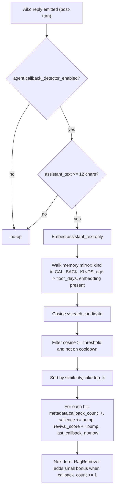
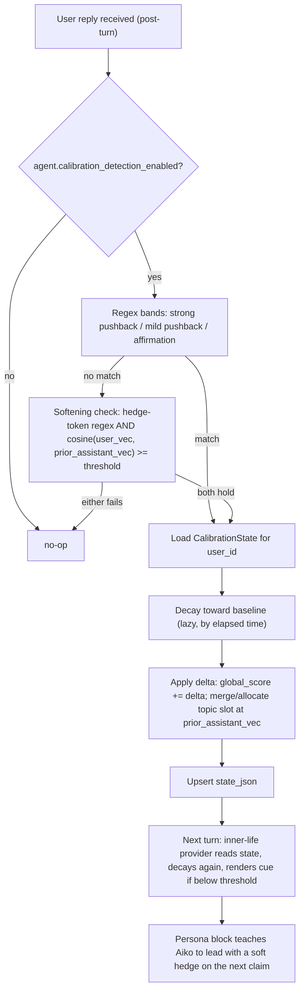
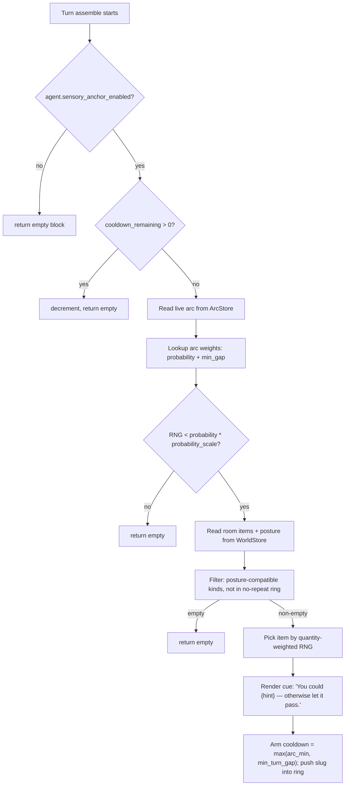

# Shipped (kept for reference)

Summary entries for completed work. Detail lives in the linked
implementation files / docs, not here. One paragraph per entry,
listed roughly in shipping order (oldest at top).

---

## B1 / B2. Continuous expressiveness + listening micro-nods

`AmbientBodyChannel` drives `ParamBreath` from arousal and
`ParamBodyAngleY` from valence; `ExpressionChannel.tickPreModel`
does arousal-scaled overrides on the parameters declared in each
expression file. A new `avatar.expressiveness` slider (0.0-1.5)
scales the lot. Backchannel micro-nods (`_emit_backchannel_motion`)
map `agreement` / `disagreement` / `thinking` / `confused` onto
rate-limited idle-priority motions. See
[`docs/alexia-model-notes.md`](../alexia-model-notes.md) §3 and
[`AGENTS.md`](../../AGENTS.md).

---

## B4. Alexia visual-identity audit

The visual identity audit landed for the full Alexia rig — every
expression has a confirmed identity now. `lzx` (cheerful / amused),
`k` (sad / melancholy / concerned, plus `cry` fallback), `sq`
(angry / frustrated), `wh` (surprised / curious), `xxy` (excited /
enthusiastic), `lh` (warm / tender / gentle), `y` (the new
`confused` reaction — NOT `tired`, which now routes to body-slump
via `AmbientBodyChannel`), `zs1` (playful in day clothes;
falls through to amused / `lzx` in pajamas via the outfit gate).
Accessory tier (`bbt`, `dyj`, `mj`, `yjys1`, `yjys2`) is now reachable
via `[[overlay:X]]` + Phase 4 persistent toggles. Outfit envelopes
(`yf` / `yfmz` + the synthetic `day_clothes` baseline) drive
`OutfitChannel`. See [`docs/Alexia-my-observation.md`](../Alexia-my-observation.md)
and [`docs/alexia-model-notes.md`](../alexia-model-notes.md) §3 / §3a /
§3b / §3c.

**Phase 5 close-out.** The remaining vocabulary work landed:
`embarrassed` (→ `lh`, the shy / inward-tilted smile), `nervous`
(intentionally unmapped — falls through to the `concerned` →
`serious` → `thoughtful` neighbour chain so we don't fire the
`yfmz` pajamas envelope as a side effect; persona stacks
`[[reaction:nervous+sweat]]` for the visible Param44 sweat drop),
and `defiant` (→ `mj`, the head-sunglasses-on-hair tilt that reads
as cocky / "whatever" without disturbing outfit state). The
TypeScript `_REACTION_NEIGHBOURS` mirror in
[`web/src/live2d/channels/ExpressionChannel.ts`](../../web/src/live2d/channels/ExpressionChannel.ts)
is now in lock-step with Python (covers all 27 reactions), with a
Vitest parity test that fails if a Python `REACTIONS` key gains a
neighbour chain on one side without the other. Persona idiom
`[[reaction:defiant+pout]]` (a silent no-op; no `pout` capability
exists) was replaced with `[[reaction:defiant+question]]`, which
routes to the `wh.exp3` question-mark pulse.

**Tail wag + ear wiggle on physics-driven rigs.** `[[overlay:tail_wag]]`
on Alexia was visibly broken because `Param_Angle_Rotation_*_ArtMesh202`
is a *physics output* of `ParamBreath` (`PhysicsSetting16`), and the
existing `tickTier3` direct-sine boost was overwritten by
`physics.evaluate()` every frame. Fix: in
[`AmbientBodyChannel.ts`](../../web/src/live2d/channels/AmbientBodyChannel.ts)
`tickPreModel` (which runs *after* physics), boost `ParamBreath`
freq by 2.5x and amplitude by 1.5x while
`engineState.tailWagBoostUntil` is in the future and
`has_tail_wag` is on. Physics propagates the faster wave naturally
into the five tail segments. The `tickTier3` direct-sine boost
stays as a non-physics fallback for the Mini fixture and any
future minimal rigs. Overlay duration bumped from 1500 ms to 2000
ms (via a new `_OVERLAY_DURATION_OVERRIDES_MS` table in
[`avatar_mixin.py`](../../app/core/session/avatar_mixin.py)) to
match the persona prompt's "~2 s burst" copy. The ear wiggle had
two compounding bugs: (a) Alexia's ear params are named `Hair 5`
/ `Hair 5-1` / `Hair 5-2` / `Hair 5-3` (Param13 / 14 / 15 / 18)
after the cdi3 translation pass, none of which match the
`_EAR_SEGMENT_SYNONYMS` list, so synonym detection set
`has_ear_wiggle=false`; (b) those four params are physics outputs
of `ParamEyeR/LOpen` (`PhysicsSetting13` / `14` — ears flick on
every blink), so even with detection working, `tickTier3` writes
would be clobbered. Fixed by adding an optional per-rig
`avatar_overrides.json` lookup in
[`avatar_profile.py`](../../app/core/avatar_profile.py) (supported
keys this pass: `cat_ear_param_ids`, `cat_tail_param_ids`),
shipping the Alexia override
([`data/personas/active/Alexia/avatar_overrides.json`](../../data/personas/active/Alexia/avatar_overrides.json))
that pins the four `Hair 5*` IDs, and adding a `tickPreModel`
ear-wiggle write path in
[`GestureChannel.ts`](../../web/src/live2d/channels/GestureChannel.ts)
that mirrors the `tickTier3` 4 Hz / amp 15 sine but lands after
physics. Slot lifecycle (rest-snap-then-null on expiry) now lives
exclusively in `tickPreModel` so the post-physics rest-write is
the last write of the expiry frame.

---

## B5. Auto-cascade safety — voice mode / backchannel must not pick "heavy" expressions

A perfectly cheerful turn was visibly rendering Alexia crying for a
2-4 s thinking window while she resolved tool calls (`recall` then
`change_posture`). Root cause was the auto-cascade chain inside
[`ExpressionChannel.ts`](../../web/src/live2d/channels/ExpressionChannel.ts):
`_MODE_TO_REACTION.thinking` cascaded `thoughtful` (empty on Alexia)
into `concerned` -> `k` (Param59 = tear streaks). Same shape on
`_BACKCHANNEL_TO_REACTION.concern` and `.disagreement`. Fix routes
auto-cascades to soft / neutral alternatives only; the explicit
`[[reaction:concerned]]` from the LLM still resolves to the rig's
mapping (intentional empathy beat). A second trace surfaced a
follow-up path through the explicit `[[reaction:X]]` neighbour
fallback in [`reactions.py`](../../app/core/reactions.py) /
[`ExpressionChannel.ts`](../../web/src/live2d/channels/ExpressionChannel.ts)
`_REACTION_NEIGHBOURS`: non-sad reactions (`thoughtful`, `serious`,
`frustrated`, `angry`) chained through `concerned` as fallback. Fix
dropped `concerned` (and any other sad-family entry) from non-sad
chains; the sad family still chains within itself so legitimate
`[[reaction:sad]]` emits paint the right tears. Lock-in:
[`tests/test_reactions.py`](../../tests/test_reactions.py)
`CryCascadeGuardTests` plus the existing
"auto-cascade avoids heavy expressions" block in
[`ExpressionChannel.test.ts`](../../web/src/live2d/channels/ExpressionChannel.test.ts).

**Design rule going forward.** When adding entries to
`_MODE_TO_REACTION` or `_BACKCHANNEL_TO_REACTION`, every candidate
must read as a *micro-expression* on any rig. Reactions that imply
strong narrative emotion on at least one supported rig
(`concerned`, `sad`, `melancholy`, `cry`, `angry`, `frustrated`,
`defiant`) belong only in the *explicit* `[[reaction:X]]` path,
never the auto-cascade fallback.

---

## B6. UI debug logging bridge

The cry-cascade investigation (B5) needed a single timeline that
showed *both* what the backend emitted (mood / reaction tag /
filler / tool dispatch / voice mode) and what the renderer actually
did with it (which reaction the channel picked, which `.exp3.json`
it landed on, when overlays expired, when the WS reconnected).
Previously only the backend half existed in
[`data/app.log`](../../data/app.log); the UI half lived in DevTools
and didn't survive a tab refresh. Sharing one file when reporting a
bug now reconstructs the whole flow.

`logging.ui_log_enabled` (added to
[`LoggingSettings`](../../app/core/settings.py)) gates the feature;
off by default. The "Debug logging" block in
**Settings drawer -> Chat -> Diagnostics** flips it via
`PATCH /api/settings`, the server broadcasts
`logging_settings_changed` over the WS, and every tab's
`debugLog.setEnabled` mirrors the new value. When enabled, the
browser captures structured events (`{ ts, source, kind, payload }`)
into a 2000-entry ring buffer
([`web/src/log.ts`](../../web/src/log.ts)) and batches them out
every ~500 ms to `POST /api/logs/ui`
([`app/web/server.py`](../../app/web/server.py)). The handler caps
the batch, allow-lists `source` by prefix, truncates oversized
payloads, and emits each entry on the `app.ui` logger as
`INFO [ui] {source} {kind} {payload_json}` so it interleaves into
`data/app.log` with the existing backend lines. The "Download
buffer" button serialises the in-memory ring to
`alexia-ui-log-<iso>.json` for cases where the backend isn't
responding. Disabling the toggle returns `403` on `/api/logs/ui`,
the batcher drains, and `debugLog.log` becomes a free no-op.

Sources instrumented today (kept tight to the cry-cascade /
lip-sync / reconnection forensic surface): `ws`, `voice`,
`channel.expression`, `channel.overlay`, `channel.motion`,
`channel.outfit`, `channel.accessory`. Per-frame work (lip-sync
amplitude, Pixi ticks) is intentionally not logged. Tests:
[`tests/test_web_server_ui_logs.py`](../../tests/test_web_server_ui_logs.py),
[`tests/test_web_server_settings.py`](../../tests/test_web_server_settings.py)
(`LoggingSettingsRoundTripTests`),
[`web/src/log.test.ts`](../../web/src/log.test.ts),
[`web/src/store.logging.test.ts`](../../web/src/store.logging.test.ts),
and the "debug instrumentation" block in
[`web/src/live2d/channels/ExpressionChannel.test.ts`](../../web/src/live2d/channels/ExpressionChannel.test.ts).

---

## C1. Typed-mode proactive ping + activity awareness

Typed-mode `ProactiveDirector` path with a prepared-nudge fast path
and an LLM "pick up the thread" fallback, gated by a presence
boolean (browser tab visibility AND Tauri window focus, AND-folded
client-side). Defaults: 4 min silence, 10 min cooldown, text-only.
Desktop-only opt-in activity awareness forwards the foreground app
*name* (never titles or URLs) so Aiko can reference what Jacob is
doing. Off by default. See
[`docs/presence-and-activity.md`](../presence-and-activity.md).
Open follow-ups (window-title-aware activity, cooldown persistence,
TTS-on-typed-proactive) live in [`proactive.md`](proactive.md).

---

## User-facing memory editor

Dedicated "Memory" tab in
[`web/src/components/SettingsDrawer.tsx`](../../web/src/components/SettingsDrawer.tsx).
Full edit-in-place / manual create / pin toggle / kind filter / sort
/ paginated list (page size 50). Pinned rows are skipped by
`decay()` and never selected as `prune()` victims; `RagRetriever`
adds a `+0.05` score bonus for pinned hits via a SQLite-mirror
lookup (LanceDB stays untouched). Cap bumped from 500 to 5000.
Pagination + filter live on the server (`GET /api/memories` grew
`offset` / `kind` query params and a `total` / `cap` response).
New WS event: `memory_updated`. New endpoints:
`PATCH /api/memories/{id}`, `POST /api/memories`,
`POST /api/memories/{id}/pin`. Schema v5 added the `pinned`
column. No separate detail doc — the Memory tab in the app is
self-explanatory.

---

## Aiko's room — virtual space with locations + items

[`WorldStore`](../../app/core/world_store.py) backs a small persistent
SQLite world (locations, items with consume semantics, a singleton
state row holding posture / activity / location). A default rich
room is seeded once on first boot. The room flows into the LLM via
a `world` inner-life provider, five new agent tools
(`look_around`, `move_to`, `change_posture`, `inspect_item`,
`consume_item`), and a `world_updated` WS event. "Give Aiko a
cookie" is intentionally silent. Schema v6 added `world_locations`
/ `world_items` / `world_state`. See
[`docs/aiko-room.md`](../aiko-room.md).

---

## Aiko's living garden — outdoor plot + plant growth loop

Extends the world model with a `garden` location seeded
idempotently on every boot
([`WorldStore.ensure_garden_seed`](../../app/core/world_store.py))
plus two new item kinds: `plant` (with `species` / `stage` /
`lifecycle` in `state`) and `seed`. Plants advance through
`sprout -> sapling -> growing -> flowering -> mature` over wall-clock
time via a `PlantGrowthWorker` (hourly, hooked into the existing
`IdleWorkerScheduler`). A `GardenVisitWorker` wanders her outside
during quiet daylight windows, waters every plant, and auto-harvests
any that are mature — produce lands in `kitchenette` as a fresh
`food` item, annuals drop a replacement seed in inventory,
perennials reset to `growing` so the cycle keeps going. Three new
agent tools (`water_plant`, `plant_seed`, `harvest_plant`) let her
interact on-demand; the persona prompt picks up garden + harvest
framing. `render_block` flips to an outdoor phrasing when she's
there ("You are at home, currently outside in the garden…") and
surfaces stage cues including the loud "(mature, ready to
harvest)" hint. UI lights up automatically — `WORLD_KINDS` gained
`plant`/`seed`, and the World tab item row shows a stage badge. No
schema migration (rides on the existing `state_json` column).
Deferred: no wilting / death yet, no scene system; the garden is a
single location. See [`docs/aiko-room.md`](../aiko-room.md) under
"Garden". H5 (second scene / travel semantics) in
[`immersion.md`](immersion.md) is the natural follow-up.

---

## Shared moments + relationship axes (schema v7)

Structured `shared_moment` memory kind with `(when, what, vibe,
source_message_ids, last_anniversaried_at)` metadata on the new
`memories.metadata` JSON column. Three detection tracks (inline
`[[moment:vibe:text]]` tag, a Track-2 LLM detector gated on
affect/reaction/milestone/gift signals, manual "Mark as moment"
chat action). Anniversary inner-life block (1mo / 3mo / 6mo / 1yr
± 1 day, 6h per-moment rate limit) + small RAG bonus. New
`relationship_axes` table (closeness / humor / trust / comfort,
~30-day decay, ±0.08-per-turn drift caps). New "Together" UI tab.
Open follow-ups (J1 multi-user, J2 exportable timeline, J3 axes-aware
nudges) live in [`moments.md`](moments.md). See
[`docs/shared-moments-and-relationship.md`](../shared-moments-and-relationship.md).

---

## Memory tiers + revival drift + IdleWorker framework (schema v8)

E1 (tiers), E2 (revival-rebated decay), and G1 (idle scheduler)
shipped together. The `memories` table grew `tier` (`scratchpad` /
`long_term` / `archive`) and `revival_score` columns plus a new
`kv_meta` key-value table for cross-restart worker bookkeeping.
`MemoryStore.decay` is now wall-clock-driven (proportional to
elapsed time since `memory.last_decay_run_at`, clamped by
`decay_max_catchup_days`) with per-tier rates and a revival rebate
(`salience += revival_coefficient * elapsed * revival_score`).
`prune()` enforces per-tier caps independently. A new
[`IdleWorkerScheduler`](../../app/core/idle_worker_scheduler.py) wakes
during quiet windows (no Live mode + no recent user activity) and
runs one registered worker per tick. First two workers:
`MemoryPromotionWorker` (promotes scratchpad rows on
age + use_count OR revival ≥ 0.3, demotes idle long_term rows after
180 days, deletes dead scratchpad after the TTL) and
`MemoryDecayWorker` (thin wrapper around `MemoryStore.decay`). New
REST endpoints: `tier` query param + `revival_score` in
`GET /api/memories`, `GET /api/memories/counts`, `tier` on
PATCH/POST. Frontend Memory tab gained a tier pill, tier filter,
per-tier counts header, and revival % readout. All producers were
classified by trust: `MemoryExtractor`, `ReflectionWorker`,
`DreamWorker` write to scratchpad; `PromiseExtractor`,
`CatchphraseMiner`, `RelationshipPulse`, `SharedMoments`,
`[[remember:...]]` tags, the manual REST/UI path, and milestone
memories go straight to long_term. `MemoryConsolidator` now
clusters within-tier only. See
[`docs/memory-tiers.md`](../memory-tiers.md).

---

## F1. Background fact-checker worker

Idle worker that fact-checks recently surfaced claims in the
background and updates the originating memory's `confidence` (and
optionally its content) when the search clearly corrects a number /
date. Lives in
[`app/core/idle_fact_checker.py`](../../app/core/idle_fact_checker.py)
and registers with the shipped `IdleWorkerScheduler`. Privacy is
enforced by [`fact_check_privacy.py`](../../app/core/fact_check_privacy.py)
which blocks personal claims at classification time and scrubs the
search query (drops emails, phone numbers, names, addresses) before
it ever leaves the box. Per-hour and per-day budgets live in
[`fact_check_rate_limiter.py`](../../app/core/fact_check_rate_limiter.py)
backed by `kv_meta`. Each phase logs at INFO with timing + previews
(`start`, `scrubbed`, `search done`, `distil done`, `apply done`)
so [`data/app.log`](../../data/app.log) is the audit trail. Tests:
[`tests/test_idle_fact_checker.py`](../../tests/test_idle_fact_checker.py),
[`tests/test_fact_check_privacy.py`](../../tests/test_fact_check_privacy.py),
[`tests/test_fact_check_rate_limiter.py`](../../tests/test_fact_check_rate_limiter.py).

---

## F2. Knowledge-gap journal

Captures Aiko's "I don't know" moments as structured
`knowledge_gap` memories so F1 can close them later and the prompt
can resurface them when the topic returns. Extraction lives in
[`app/core/knowledge_gap_extractor.py`](../../app/core/knowledge_gap_extractor.py)
(regex + the inline `[[gap:topic:question]]` self-tag, mirroring
the promise extractor shape). Storage reuses `MemoryStore` via the
`knowledge_gap` kind in [`memory_store.py`](../../app/core/memory_store.py).
Resolved gaps gain a `resolved_at` metadata stamp from the F1
worker and the original gap row is kept for audit. Surfacing in the
prompt is gated on cosine similarity to the current turn so only
relevant gaps re-enter the conversation.

---

## F2.1. Knowledge-gap auto-resolver (memory-match + user-answer)

F2 only had one closure path: F1's idle fact-checker, which goes to
the *web* to look the answer up. In practice that means a gap minted
on Day 1 ("does Jacob listen to specific genres while watching anime")
never closes — F1 won't web-search a personal question about the user,
the post-summary `MemoryExtractor` writes the user's actual answer
into a fresh `preference` row hours later, and nothing cross-references
the gap against existing memory. So the `Things you've been wondering
about with Jacob` block keeps re-injecting the same question into the
prompt every session for weeks until the user explicitly notices
("you maybe forgot...") and Aiko apologises but the loop continues.

F2.1 adds two complementary closure paths, both stamping
`metadata.resolved_at` + `resolved_by_memory_id` (and a new
`metadata.resolved_by` audit field) via the existing
[`KnowledgeGapStore.mark_resolved`](../../app/core/knowledge_gap_extractor.py)
API:

* **Idle memory-match resolver** — a new
  [`IdleGapResolver`](../../app/core/idle_gap_resolver.py) registered
  with `IdleWorkerScheduler`. Each tick (default 600 s) walks
  `KnowledgeGapStore.list_open()` and calls `MemoryStore.search` with
  the gap's *already-stored* embedding (no re-embed cost). Hits are
  filtered to `_ANSWER_KINDS` (`fact`, `preference`, `event`,
  `relationship`, `promise`, `shared_moment`, `curiosity_finding`,
  `reflection`) so a gap can never resolve itself or be closed by an
  Aiko-side `self_tagged` row. Bounded per-tick (default 5 gaps) so a
  burst of new gaps doesn't eat the scheduler's CPU budget. Backfill
  is automatic: first tick after app start handles every legacy gap.
  Audit log mirrors the F1 shape (`gap_resolver: resolved gap_id=X
  by memory_id=Y score=0.78 ...`).

* **Post-turn user-answer resolver** — new
  `_resolve_knowledge_gaps` method on
  [`PostTurnMixin`](../../app/core/session/post_turn_mixin.py),
  modeled directly on `_resolve_curiosity_seeds`. After every turn it
  embeds `user_text + assistant_text` once and cosines against every
  open gap's stored embedding. Anything above
  `agent.gap_user_answer_resolve_threshold` (default 0.50) closes
  with `resolved_by="user_answer"`. This catches the answer the
  moment the user speaks it; the idle worker mops up the rest.

Tunables on
[`AgentSettings`](../../app/core/settings.py):
`gap_resolver_enabled`, `gap_resolver_interval_seconds` (600),
`gap_resolver_threshold` (0.55 — slightly stricter than the seed
resolver's 0.50 because closing a gap is a stronger claim than
consuming a seed), `gap_resolver_per_tick` (5),
`gap_user_answer_resolve_threshold` (0.50).

Tests:
[`tests/test_idle_gap_resolver.py`](../../tests/test_idle_gap_resolver.py)
(15 cases: backfill happy path, kind filtering, threshold clamps,
per-tick cap, `is_ready` gates, INFO audit log) and
[`tests/test_session_controller_gap_resolver.py`](../../tests/test_session_controller_gap_resolver.py)
(8 cases mirroring the K9 seed-resolve fixture pattern).

---

## F3. Confidence column on memories

`confidence REAL NOT NULL DEFAULT 0.7` added to the `memories`
table; `Memory` dataclass + `MemoryStore.add` / `update` / mirror
plumbing all carry it now. Defaults: extractor `0.7`,
`[[remember:self:...]]` self-tags `0.85`, `[[remember:...]]`
user-confirmed tags `0.9`, tool-result memories (RAG / web) `0.95`,
manual memory-tab creates `1.0`. F1 pushes confidence up toward
`0.95` on positive verification and down to `0.4` on contradiction.
[`rag_retriever.py`](../../app/core/rag_retriever.py) penalises
hits with `confidence < 0.5` and appends an `(uncertain)` suffix
in the rendered memory block so the LLM hedges. Memory tab in
[`SettingsDrawer.tsx`](../../web/src/components/SettingsDrawer.tsx)
gained a confidence column + filter. Pinned rows clamp to `>= 0.9`.

---

## F5. Conflicting-memory detector (schema v11)

Periodic background worker that scans pairs of allow-listed memories
(`fact` / `preference` / `relationship` / `event`) with high cosine
similarity but lexically contradicting content. New
[`memory_conflicts`](../../app/core/chat_database.py) table (schema
v11) records each detected pair with the heuristic signals,
optional LLM verdict, and a status of `open` / `auto_resolved` /
`user_resolved` / `dismissed`. The
[`MemoryConflictStore`](../../app/core/memory_conflict_store.py)
wraps it with `record` / `list_open` / `mark_user_resolved` /
`dismiss` / `delete_for_memory` (cascade-cleanup hook on
`MemoryStore.delete`).

Detection is hybrid: a cheap heuristic gate in
[`conflict_heuristics.py`](../../app/core/conflict_heuristics.py)
(negation flip, antonym table, numerical mismatch) labels each
candidate pair `definite` (skip LLM, resolve immediately),
`borderline` (LLM verifies via a `YES` / `NO` / `UNRELATED` JSON
prompt, rate-limited through a dedicated
[`FactCheckRateLimiter`](../../app/core/fact_check_rate_limiter.py)
with `state_key="conflict_detector.rate_state"`), or `no` (drop
without LLM cost). Confirmed conflicts with `|conf_a - conf_b| >=
0.30` (default) auto-demote the loser to `tier=archive`,
`confidence=0.20`, with `metadata.superseded_by` stamped — the rest
surface in the new Conflicts sub-tab on the Memory drawer for the
user to resolve via Keep-this / dismiss buttons. The worker
[`MemoryConflictWorker`](../../app/core/memory_conflict_worker.py)
registers with the shipped `IdleWorkerScheduler` on an hourly
cadence and respects per-tick caps (`max_corpus=1000`,
`max_pairs_per_run=50`) so an O(n²) sweep can never tank a tick.

Aiko can also self-flag mid-turn with `[[conflict:short reason]]`
(parsed in
[`response_text_service.py`](../../app/core/services/response_text_service.py),
stripped from chat/TTS, dispatched in
[`SessionController._post_turn_inner_life`](../../app/core/session_controller.py)
to `IdleWorkerScheduler.force_run` so the worker runs immediately
instead of waiting for the next hour). REST endpoints
`/api/memory-conflicts` (GET / resolve / dismiss) in
[`app/web/server.py`](../../app/web/server.py) back the new
Conflicts sub-tab in
[`SettingsDrawer.tsx`](../../web/src/components/SettingsDrawer.tsx),
which renders a side-by-side card per pair with similarity, both
confidences, the heuristic signals chips, and the LLM reason when
present. A collapsed "Recently auto-resolved" tail provides a
read-only audit log. Tests:
[`tests/test_conflict_heuristics.py`](../../tests/test_conflict_heuristics.py),
[`tests/test_memory_conflict_store.py`](../../tests/test_memory_conflict_store.py),
[`tests/test_memory_conflict_worker.py`](../../tests/test_memory_conflict_worker.py),
plus extensions to `tests/test_response_text_service.py` and
`tests/test_web_server_memories.py`.

---

## K2. Theory-of-mind / belief tracking (schema v12)

A persistent model of what Aiko *thinks* Jacob believes / feels,
kept separate from the facts she knows. New
[`beliefs`](../../app/core/chat_database.py) table (schema v12) holds
two shapes in one store, distinguished by the `kind` column:
`mood` beliefs carry numeric `valence` / `arousal` so the gap
detector can compare directly against the live
[`AffectState`](../../app/core/affect_state.py), and `opinion`
beliefs hold a free-text predicted state ("rust is overhyped"). The
[`BeliefStore`](../../app/core/belief_store.py) wraps it with
`upsert` (dedupes by `(user_id, kind, topic)` plus topic-embedding
cosine ≥ 0.88) / `list_active` / `mark_contradicted` /
`mark_confirmed` / `mark_stale` / `delete` / `count_by_status`,
mirroring the F5 store shape.

Two write paths feed the store. The self-tag fast path adds a new
`[[predict:kind:topic:state:confidence]]` grammar to
[`response_text_service.py`](../../app/core/services/response_text_service.py)
(parsed alongside `[[conflict:...]]`, stripped from chat/TTS,
dispatched in `_post_turn_inner_life`); the
[`BeliefInferenceWorker`](../../app/core/belief_worker.py) mines
recent user turns once an hour, privacy-scrubs the transcript via
[`fact_check_privacy.scrub_claim_for_search`](../../app/core/fact_check_privacy.py),
spends one rate-limited LLM call through a dedicated
[`FactCheckRateLimiter`](../../app/core/fact_check_rate_limiter.py)
(`state_key="belief_worker.rate_state"`) to extract a JSON array of
`{kind, topic, predicted_state, confidence}` tuples, then upserts
with `source="worker"`. Self-tagged beliefs at higher confidence are
preserved over worker rewrites.

The
[`BeliefGapDetector`](../../app/core/belief_gap_detector.py) runs
each post-turn and surfaces mismatches: for each active mood belief
younger than `belief_recent_window_hours` (default 24h), it
flips the row to `contradicted` when
`|val_pred - val_obs| > belief_gap_valence_threshold` (default 0.30),
`|aro_pred - aro_obs| > belief_gap_arousal_threshold` (default 0.25),
or the recomputed valence band lands in opposing territory. Opinion
beliefs use
[`conflict_heuristics.classify_pair`](../../app/core/conflict_heuristics.py)
against the user's recent message — a `definite` heuristic flips to
`contradicted`, a strong Jaccard overlap nudges to `confirmed`, and
beliefs untouched for `belief_stale_after_days` (default 90) bulk-
flip to `stale`. Surfaced gaps render up to two lines into the next
turn's prompt via a new `belief_gaps` inner-life provider
("Your nervous read on tokyo trip isn't matching the live affect.
Name the gap once and gently if it fits, then move on.").

REST endpoints `/api/beliefs` (GET / POST / PATCH / DELETE) in
[`app/web/server.py`](../../app/web/server.py) back a new Beliefs
sub-tab in
[`SettingsDrawer.tsx`](../../web/src/components/SettingsDrawer.tsx),
grouped by kind with a per-row gap pulse + filter chips for kind /
status. WebSocket events `belief_added` / `belief_updated` /
`belief_deleted` keep the panel live without polling. Persona
guidance in
[`aiko_companion.txt`](../../data/persona/aiko_companion.txt)
teaches the `[[predict:...]]` tag and the gentle gap-naming beat.
Tests:
[`tests/test_belief_store.py`](../../tests/test_belief_store.py),
[`tests/test_belief_worker.py`](../../tests/test_belief_worker.py),
[`tests/test_belief_gap_detector.py`](../../tests/test_belief_gap_detector.py),
[`tests/test_web_server_beliefs.py`](../../tests/test_web_server_beliefs.py),
plus extensions to `tests/test_response_text_service.py`.

---

## K6. Surprise / novelty detector

A per-turn signal that lets Aiko react with real surprise when Jacob
pivots away from the recent topic baseline, instead of accepting an
out-of-the-blue message with the same flat acknowledgement she'd
give a continuation. No new schema, no REST surface — the detector
is in-process and the signal lives entirely in the inner-life
prompt.

The [`NoveltyDetector`](../../app/core/novelty_detector.py) keeps an
in-memory `collections.deque[np.ndarray]` of size `novelty_window`
(default 12) on each `SessionController`. On the first `detect()`
call per session it lazily warms the ring from
[`RagStore.list_recent_user_vectors`](../../app/core/rag_store.py)
filtered by the current user prefix (`session_id` starts with
`{user_id}:`) so a topic genuinely discussed yesterday won't re-fire
"this is new" today. On every turn it embeds `user_text`
synchronously via the shared `Embedder`, computes
`distance = 1 - cosine(vec, centroid)` against the renormalised mean
of the ring, and classifies into two bands:
`distance >= novelty_strong_threshold` (default 0.55) -> `strong_novelty`,
`>= novelty_mild_threshold` (default 0.35) -> `mild_shift`,
otherwise silent. The current vector is appended to the ring on
every call (silent / banded / cooldown) so the baseline keeps
moving with the conversation. After a hit the detector enters a
`novelty_cooldown_turns` suppression window (default 2) so a run of
genuinely-novel turns doesn't pile "you keep saying surprising
things" beats on top of each other. A short (`< 8` chars) text or a
ring still below `novelty_warmup_min` (default 3) returns `None`
silently — cold-start installs don't blare novelty on their first
three turns.

The signal surfaces through a new `novelty` inner-life provider on
[`PromptAssembler`](../../app/core/prompt_assembler.py) (same shape
as `knowledge_gaps`: takes the live `user_text`, called inside
`assemble_with_budget`, dropped under `aggressive=True`). The
provider's banded copy lands in the system prompt right after
`belief_gaps_block`, before `knowledge_gaps_block`, clustering all
"things on Aiko's mind" cues together. Persona guidance in
[`aiko_companion.txt`](../../data/persona/aiko_companion.txt)
("Surprise and novelty") teaches Aiko to acknowledge the pivot
once with the mild band and to ask a real follow-up with the strong
band, without performing surprise when no note is present.

Settings live on `AgentSettings` (`novelty_detection_enabled`,
master switch) and `MemorySettings`
(`novelty_window`, `novelty_warmup_min`,
`novelty_mild_threshold`, `novelty_strong_threshold`,
`novelty_cooldown_turns`), mirrored in
[`config/default.json`](../../config/default.json). The detector
module logs one INFO line per turn
(`novelty-detector: distance=%.3f band=%s window=%d user=%s`)
plus a one-shot
`novelty-detector: warmed ring=N user=X` on the first detect of a
session — both grep-friendly via MCP `tail_logs(module_contains="novelty")`.

Tests: [`tests/test_novelty_detector.py`](../../tests/test_novelty_detector.py)
(cold start / warm prefill / band classification / cooldown / ring
maxlen / short-text skip / lazy warm called-once / warm failure
fallback), plus extensions to
[`tests/test_prompt_assembler.py`](../../tests/test_prompt_assembler.py)
(novelty block lands, silent when empty, dropped under aggressive,
exceptions swallowed) and
[`tests/test_rag_store.py`](../../tests/test_rag_store.py)
(role + session-prefix filtering, recency order, limit, empty
result, empty-prefix matches all users).

---

## K16. Unified ambient grounding line

Today the system prompt carries seven separate "ambient" inner-life
blocks (circadian, world, activity-awareness, affect/mood,
relationship-pulse, user_state, ambient_noise) plus their carryover
mood hint — eight blocks, each with its own "but only mention when
natural" tail. The LLM sees that as eight facts to recite. Companion-AI
grounding research (and a year of running with the granular blocks)
points the other way: one fused paragraph reads as continuous awareness
and ducks the surveillance-theatre tic that comes from repeating the
"don't recite this" guard eight times per turn.

K16 ships a new
[`GroundingLineRenderer`](../../app/core/grounding_line.py) that
consumes a structured `GroundingContext` (built once per turn from the
same store getters the granular block providers already use) and
composes a deterministic, template-driven 1-3 sentence paragraph at
the top of the system prompt. The renderer is **pure / no LLM call /
no randomness**: tests in
[`tests/test_grounding_line.py`](../../tests/test_grounding_line.py)
lock the texture for representative slot combinations so a refactor
that intends to change the texture has to update the tests first.

The fusion scope is intentionally conservative. Fused into the line:
circadian (time + day + drowsy), activity-awareness ("Jacob's in
Cursor"), user_state ("reads upbeat, energy normal"), affect ("your
private feeling is content"), relationship phase + age, world
(location + posture + activity), ambient_noise (loud / soft hum
rider on sentence 1). Always-standalone in every K16 mode (each
carries data fusion would dilute): anniversary, profile bullets,
pajama, knowledge_gaps, belief_gaps, novelty, stagnation, agenda,
axes, petname, vocal_tone, catchphrase, narrative, arc.

### The three-mode config (canonical reference)

K16 ships behind `agent.grounding_line_mode`, a string-valued setting
in [`AgentSettings`](../../app/core/settings.py) (default `"off"`,
mirrored in [`config/default.json`](../../config/default.json)).
Invalid values clamp to `"off"` with a debug log so a typo never
wedges the prompt. Three modes:

- `off` (default): no grounding line; all eight granular ambient
  blocks render exactly as before. Safe rollback target — flip back
  here instantly if `replace` or `split` reads worse than the status
  quo.
- `replace`: the grounding line replaces all eight ambient blocks.
  Cleanest test of the "one paragraph reads as continuous awareness"
  hypothesis. Most aggressive.
- `split`: middle ground. The grounding line replaces situational
  signals (circadian, world, activity, ambient_noise) but keeps
  {affect, mood_hint, relationship, user_state} as standalone
  because they carry trend / phase phrasing the fused line cannot
  represent without dilution.

### Suppression matrix

Which blocks render in which mode:

| Block                                    | `off`  | `split` | `replace` |
|------------------------------------------|--------|---------|-----------|
| grounding_line                           | empty  | shown   | shown     |
| circadian                                | shown  | dropped | dropped   |
| world                                    | shown  | dropped | dropped   |
| activity                                 | shown  | dropped | dropped   |
| ambient_noise                            | shown  | dropped | dropped   |
| affect                                   | shown  | shown   | dropped   |
| mood_hint                                | shown  | shown   | dropped   |
| relationship                             | shown  | shown   | dropped   |
| user_state                               | shown  | shown   | dropped   |
| anniversary, profile, pajama, novelty,   | shown  | shown   | shown     |
| stagnation, knowledge_gaps, belief_gaps, |        |         |           |
| agenda, axes, petname, vocal_tone,       |        |         |           |
| catchphrase, narrative, arc              |        |         |           |

The mode arg is stored on the assembler via
`PromptAssembler.set_grounding_line_mode(mode)` (called once at boot
by `SessionController` and again on any settings reload) rather than
threaded through `assemble_with_budget` — saves `TurnRunner` from
caring about a runtime knob it doesn't otherwise consume. The
suppression logic lives inline in `assemble_with_budget` keyed off
that stored value, with a defensive gate that refuses to append the
grounding block when `mode == "off"` even if a misbehaving provider
returns text.

### When to use which

- **Picking a default**: `off` until persona is retuned (the K16
  persona note is in
  [`data/persona/aiko_companion.txt`](../../data/persona/aiko_companion.txt)
  under "Where you are right now") and at least a few sessions have
  been A/B'd against `replace`.
- **Companion-feel comparison**: flip between `off` and `replace`
  over comparable conversations and read the assistant's replies
  side by side.
- **Isolating fusion vs. trend phrasing**: `split` keeps the trend
  signals (affect "lately you've been...", relationship phase line)
  standalone, so a difference between `split` and `replace` reads
  attributes the texture change to fusing the trend slots
  specifically.
- **Debugging a regression**: revert to `off` first; the granular
  blocks are well-understood.

### How to flip the mode

- Edit `agent.grounding_line_mode` in
  [`config/default.json`](../../config/default.json) (or your
  override config) to `"off"` / `"replace"` / `"split"` and restart.
- A live settings-reload path can call
  `PromptAssembler.set_grounding_line_mode(...)` directly; the
  setter is idempotent and safe to invoke between turns.

### Verifying the flip took effect

- MCP `get_last_response_detail` after a turn — the response detail
  dict includes `provider_ms.grounding_line`. In `off` mode this
  entry is missing or zero (the SessionController-side provider
  short-circuits without invoking the renderer). In `replace` /
  `split` it's a small positive number (the renderer is template-
  driven, sub-millisecond per render).
- DEBUG-level `prompt built:` log line from
  `app.core.prompt_assembler` (see P2): the `providers=` count drops
  by the number of suppressed granular blocks; `slowest_provider=`
  shifts.
- The persona note doubles as a sanity gate: if Aiko starts reciting
  the time / app / mood verbatim in `replace` mode, the persona is
  the place to tune (not the renderer template).

Tests:
[`tests/test_grounding_line.py`](../../tests/test_grounding_line.py)
covers the renderer in isolation (empty / partial / full slot
combinations, weekday + period phrasing, drowsy + noise riders,
indoor vs. outdoor framing, capitalisation when relationship leads
sentence 3, user-name fallback). The K16 mode integration sits in
[`tests/test_prompt_assembler.py`](../../tests/test_prompt_assembler.py)
under `GroundingLineModeTests`: `off` keeps every granular block,
`replace` drops eight, `split` drops only situational, invalid mode
clamps to `off`, the grounding line is dropped under `aggressive=True`
even in `replace`, and `provider_ms["grounding_line"]` lands in P2
telemetry.

---

## K18. Topic stagnation detector

The inverse of K6: instead of firing on a single divergent turn, K18
fires when the rolling per-turn distance to the K6 centroid stays
*low* across a window — the conversation has been circling the same
ground for a while and Aiko may want to either acknowledge the
rhythm, take a soft pivot, or offer a real off-ramp. Picked up
specifically as the "we've been on this for ten messages, do you
want to actually wrap or keep going?" cue companion-AI literature
keeps flagging.

Implemented as a **sibling** of `NoveltyDetector` rather than an
extension of it: a new
[`TopicStagnationDetector`](../../app/core/topic_stagnation.py) is
a pure streak counter — no embedder, no rag_store, no per-user
state — that consumes the per-turn distance K6 already computed.
To make that consumption cheap, `NoveltyDetector` was extended with
two tiny additive attributes (`last_distance` and `last_band`) that
get reset at the top of every `detect()` and populated on every
code path that actually measured (normal + cooldown turns; warmup
and short-text turns leave them `None`). K18 reads those off the
K6 detector during prompt assembly without re-embedding anything.

The detector keeps a `collections.deque[float]` of size
`stagnation_window` (default 6) and bands the rolling mean:
`mean < stagnation_strong_threshold` (default 0.10) → `strong_lull`,
`mean < stagnation_mild_threshold` (default 0.18) → `mild_lull`,
otherwise silent. Three suppression gates keep the cue rare:
warmup until the deque is full, `stagnation_cooldown_turns`
(default 4 — longer than K6's because lulls are by nature
drawn-out) after each fire, and a
`stagnation_post_novelty_suppression_turns` (default 3) window
right after K6 fires so a fresh topic shift doesn't immediately
read as "we've been on this for a while". A `distance=None` from
K6 (short text / warmup / embed failure) is treated as "no
measurement" and does not advance the streak.

The signal surfaces through a new `stagnation` inner-life provider
on [`PromptAssembler`](../../app/core/prompt_assembler.py) — same
shape as the K6 `novelty` provider, dropped under
`aggressive=True`. Provider order matters: `novelty` runs first so
its `last_distance`/`last_band` are fresh when the stagnation
provider reads them. The rendered "Heads-up: you've been circling
…" / "Heads-up: this thread has been pretty looped …" line lands
in the system prompt immediately after `novelty_block`, clustering
both reaction cues together. Persona guidance in
[`aiko_companion.txt`](../../data/persona/aiko_companion.txt)
("Same topic for a while", added right after "Surprise and
novelty") teaches Aiko to take a soft pivot on the mild band, to
either deepen the thread or offer a real off-ramp on the strong
band, and explicitly says the absence of the cue is also a signal
— a focused conversation is fine.

Settings live on `AgentSettings` (`topic_stagnation_enabled`,
master switch) and `MemorySettings` (`stagnation_window`,
`stagnation_mild_threshold`, `stagnation_strong_threshold`,
`stagnation_cooldown_turns`,
`stagnation_post_novelty_suppression_turns`), mirrored in
[`config/default.json`](../../config/default.json). Defaults are
intentionally conservative; calibration is the kind of thing only
live testing settles. The detector logs one INFO line per scoring
turn (`topic-stagnation: mean=%.3f band=%s window=%d`) — grep via
MCP `tail_logs(module_contains="topic_stagnation")`.

Tests:
[`tests/test_topic_stagnation.py`](../../tests/test_topic_stagnation.py)
(warmup, band thresholds, misordered-threshold safety, cooldown,
post-novelty suppression, `distance=None` handling, render copy
including `{user_name}` interpolation), plus K18 hooks added to
[`tests/test_novelty_detector.py`](../../tests/test_novelty_detector.py)
(`last_distance`/`last_band` populated on normal + silent +
cooldown turns, left `None` on warmup and short-text), and a new
provider-slot block in
[`tests/test_prompt_assembler.py`](../../tests/test_prompt_assembler.py)
(stagnation block lands after novelty, silent when empty, dropped
under aggressive, exceptions swallowed, `user_text` is forwarded
to the provider).

Out of scope (deferred): `ProactiveDirector` bias on
`strong_lull`, settings-UI controls for the thresholds, and a
per-cluster "lulled on topic A but not B" variant — that one
needs the K9 topic graph first.

---

## Temporal memory awareness (schema v10)

Gives every memory three new fields — `event_time`, `temporal_type`
(`past_event` / `current_state` / `future_plan` / `recurring` /
`timeless`), and `relevance_until` — so Aiko can tell the difference
between "Jacob is in Tokyo this week" and "Jacob went to Tokyo
last year". Schema migration is additive in
[`chat_database.py`](../../app/core/chat_database.py); the `Memory`
dataclass and `RagStore` carry the new fields with a
join-only strategy in LanceDB so we don't reindex existing
embeddings. The memory extractor anchors a `today` reference,
extracts the temporal fields with the rest of the memory, and
derives `relevance_until` server-side. Retrieval annotates memory
bullets with a temporal suffix (`(last year)`, `(planned for Friday)`,
`(ongoing)`) and filters out expired memories.

The `MemoryDecayWorker` got a reclassification pass that nudges
`future_plan` -> `past_event` once `event_time` is in the past, and
a new
[`FollowUpWorker`](../../app/core/follow_up_worker.py)
generates proactive nudges for overdue `future_plan` memories,
queueing them in
[`PreparedNudgeStore`](../../app/core/prepared_nudge_store.py)
for the typed-proactive fast path. Persona rules in
[`aiko_companion.txt`](../../data/persona/aiko_companion.txt) teach
Aiko to respect the temporal tags without becoming pedantic about
them. Tests: `tests/test_memory_extractor_temporal.py`,
`tests/test_follow_up_worker.py`,
`tests/test_memory_decay_temporal.py`,
`tests/test_rag_retriever_temporal.py`.

---

## G2. Schedule-learning worker

Idle worker that buckets `messages.created_at` (user messages
only) by local-timezone weekday/weekend × hour-of-day over a
rolling window, identifies dominant clusters, and writes a human
phrase ("weekday evenings", "weekend afternoons") into the
`usual_hours` field on `UserProfile`. No LLM, no embedder — just
SQL + Python bucketing. Confidence scales with sample size, and
writes are skipped when the inferred phrase is unchanged.
Lives in
[`app/core/schedule_learner.py`](../../app/core/schedule_learner.py),
registers with the shipped `IdleWorkerScheduler`. The new field
is allow-listed in
[`app/core/user_profile.py`](../../app/core/user_profile.py)
`PROFILE_FIELDS` so the LLM `UserProfileWorker` is also aware of
it. Tests: `tests/test_schedule_learner.py`.

---

## K3. Routine / ritual awareness

Second pass inside the same `ScheduleLearner` that names recurring
slots ("Sunday-morning chats", "Friday-evening wind-downs") and
writes them into a new `routines` field on `UserProfile`. Where G2
counts total volume per `(daytype, bucket)`, K3 counts *distinct
ISO weeks* per `(weekday, bucket)` so a slot only qualifies once
it has actually recurred across multiple weeks (default: ≥3
distinct weeks AND ≥30% of the rolling window). Naming is
deterministic via a 28-entry `_RITUAL_LABELS` dict (Mon-Sun × 4
hour-buckets); the rendered phrase is comma-joined, capped at 240
chars to fit `ProfileEntry.value`, and idempotent (re-detection of
the same slot short-circuits the upsert). Confidence is the max
recurrence density across chosen cells. Surfacing is passive: the
field joins the rendered profile block alongside `usual_hours`,
and a persona note in
[`aiko_companion.txt`](../../data/persona/aiko_companion.txt)
teaches Aiko to lean into a matching rhythm only when the moment
actually fits — never as a list, never as a calendar reminder.
Settings:
[`AgentSettings.routine_detection_enabled`](../../app/core/settings.py)
plus `MemorySettings.routine_min_touches` /
`routine_min_share` / `routine_max_active`. Tests:
`tests/test_schedule_learner.py::RoutineDetectionTests` plus a
`PROFILE_FIELDS` assertion in `tests/test_user_profile.py`.

---

## G3. Idle curiosity worker

Picks the oldest unresolved `open_question` memory during idle,
runs it through
[`fact_check_privacy.scrub_claim_for_search`](../../app/core/fact_check_privacy.py)
to produce a safe query, calls `web_search`, distils a concise
JSON answer (`{answer, confidence}`) via Ollama, and stores the
result as a `curiosity_finding` memory linked back to the source
question. Source `open_question` rows are stamped with
`curiosity_resolved_at` / `curiosity_inconclusive_at` /
`curiosity_skipped_at` metadata so a question is never re-processed
in a tight loop. The worker shares
[`FactCheckRateLimiter`](../../app/core/fact_check_rate_limiter.py)
shape but with a separate `state_key="idle_curiosity.rate_state"`
so its budget doesn't compete with the fact-checker's. Lives in
[`app/core/idle_curiosity_worker.py`](../../app/core/idle_curiosity_worker.py).
[`rag_retriever.py`](../../app/core/rag_retriever.py) appends a
`(curiosity)` suffix on retrieved findings, and a Memory-section
rule in [`aiko_companion.txt`](../../data/persona/aiko_companion.txt)
teaches Aiko to surface them as "I was reading about X — turns
out..." rather than reciting them as bare facts. Tests:
`tests/test_idle_curiosity_worker.py` plus the new state-key
independence test in `tests/test_fact_check_rate_limiter.py`.

---

## P1. Per-turn embed budget + timing

Single shared
[`Embedder`](../../app/llm/embedder.py)
serves three live consumers per turn —
[`RagRetriever`](../../app/core/rag_retriever.py) embeds
`"ctx || query"`, K6
[`NoveltyDetector`](../../app/core/novelty_detector.py) embeds the
raw user message, K18
[`TopicStagnationDetector`](../../app/core/topic_stagnation.py)
piggybacks on K6's distance — plus the async
[`MessageIndexer`](../../app/core/message_indexer.py) on the
background thread. Two HTTP `/api/embeddings` round-trips per turn
is the common case once novelty + RAG are both on. Before P1 there
was no per-turn count or wall time, so "my turn felt slow" couldn't
be attributed to embeds without a custom log dive.

The embedder now exposes a tiny per-thread budget API:
`begin_turn()` resets a thread-local counter pair on the calling
thread, every cache-miss `embed()` call adds its measured wall time
+ one increment, and `end_turn()` returns the
`(calls, ms)` tuple and clears state. LRU cache hits don't count as
calls (they're free). The counters are *thread-local* on purpose —
`MessageIndexer` shares the same `Embedder` instance from a
background worker, and we don't want its async writes polluting the
turn thread's accounting; threads that never call `begin_turn` see
`active=False` and skip all accounting.
[`TurnRunner.run`](../../app/core/turn_runner.py) brackets each
turn with begin/end, stamps the result onto
`PromptTelemetry.embed_calls` / `embed_ms` right before the
`turn done:` INFO log, and the public `run()`'s `finally` calls
`end_turn` again as a defensive cleanup so an exception mid-flow
can't leak counter state into the next turn.

The headline INFO line gained four new fields
(`embed_calls=N embed_ms=N assemble_ms=N rag_lookup_ms=N`) and the
[`SessionController`](../../app/core/session_controller.py) metrics
dict carries them through to
[`get_last_response_detail`](../../app/mcp/server.py) so MCP can
grep regressions over time. Tests:
`tests/test_embedder.py` (begin/end/peek/double-begin/cache-hit
isolation/thread-isolation), plus
`tests/test_turn_runner_telemetry.py::EmbedTurnBoundaryTests`
(stamping, cleanup-on-raise, no-embedder fallback, early-return
edge case).

Out of scope (deferred): substring-match de-duplication across the
RAG `"ctx || query"` and K6 `query`-only strings — different
strings produce different vectors, so the obvious win is "make K6
and RAG use the same embedding when the second string is a
substring of the first", which needs more design than this
observability slice could carry. Tracked as a follow-up.

---

## P2. Prompt-build phase telemetry

`turn done:` already logged `rag_prefetch=` / `prebuild=` slice-cache
events but not the wall time of RAG retrieval, individual
inner-life providers, or the total assemble. The DEBUG
`prompt built:` line counted only a hardcoded ten inner blocks —
the eleven that have shipped since
(belief-gaps, novelty, stagnation, activity, anniversary, axes,
knowledge-gaps, …) were invisible. A regression in any of them
couldn't be attributed without instrumenting the suspect by hand.

[`PromptAssembler`](../../app/core/prompt_assembler.py) now wraps
every provider call through a `_safe_provider(timing_sink=…)` /
`_timed_phase` pair into a flat
`provider_ms: dict[str, float]` keyed by the provider name. The
RAG lookup phase (prefetch lookup + live retrieval + legacy
fallback) is timed into `rag_lookup_ms`; the entire
`assemble_with_budget` body is timed into `assemble_ms`. All three
join `PromptTelemetry` (and `as_dict()` so JSON consumers see the
same shape), get re-emitted on the
`turn done:` INFO line, and propagate via the SessionController
metrics dict to `get_last_response_detail`. The DEBUG
`prompt built:` line dropped the legacy 10-block counter and now
emits `providers=N provider_ms_total=N slowest_provider=name:ms`
derived from the live timing dict, so adding a future provider
(e.g. K17 clarification-repair) automatically lands in the
headline without a code change.

A timed provider that *raises* still records its bucket — the
operator wants to see "novelty took 3ms and exploded", not "novelty
silently disappeared from the telemetry". Tests:
`tests/test_prompt_assembler.py::PhaseTelemetryTests` (empty when
nothing wired, populated for each live provider, round-trip via
`as_dict`, `assemble_ms` covers the full build, P1 fields stay
zero on direct assemble) and
`tests/test_prompt_assembler.py::FailingProviderTimingTests` (raise
still records).

---

## P8. Idle-worker queue visibility + multi-worker drain

`IdleWorkerScheduler` was capped at one worker per 60 s tick.
With ~10+ workers registered (decay, promotion, schedule,
fact-check, conflict, belief, follow-up, idle-curiosity, …) the
loser of a tie waited a full minute, and a single misconfigured
cadence could quietly starve the backlog with no MCP-visible signal
beyond rummaging through `last_run_at` rows. The natural quiet
window between turns — Aiko's 10-30 s of TTS plus the user's typing
time before the next submit — was being thrown away.

The scheduler now drains as many due workers as fit into a per-tick
wall-time budget (`tick_budget_ms`, default 3000). Workers are
sorted oldest `last_run_at` first; each worker's
[`avg_duration_ms`](../../app/core/idle_worker.py) (EMA, alpha=0.3
on `IdleWorkerRecord`) is the cost estimate. Anti-starvation always
admits the most-overdue ready worker even if its estimate exceeds
the remaining budget, so a tight budget on a slow machine still
makes progress instead of looping forever. A hard
`max_per_tick` cap (0 = unlimited) is available for operators who
want to clamp tick log volume on heavy backlogs;
`max_per_tick=1` reproduces the legacy single-worker behaviour.

Per-run wall time is folded into the EMA on success; failures bump
`error_count` (cumulative, separate from `last_error` which gets
cleared on the next clean run). The scheduler emits one structured
INFO line per non-empty tick:

```
idle_workers tick: ran=3 due=5 skipped_budget=2 queue_after=2
                   tick_ms=472 budget_ms=3000 names=memory_decay,memory_promotion,fact_checker
```

A new MCP tool `get_idle_workers_status` returns the enriched
view: scheduler config (`wake_seconds`, `tick_budget_ms`,
`max_per_tick`, `quiet`) plus a `workers` list sorted most-overdue
first. Each row carries `last_run_at`, `next_due_at`,
`overdue_seconds` (positive = waiting), `avg_duration_ms`,
`last_duration_ms`, `total_duration_ms`, `run_count`,
`error_count`, `last_error`. The legacy `inspect_idle_workers`
tool stays for quick checks; reach for `get_idle_workers_status`
when you want to answer "which workers are starving and why?".

Settings: [`MemorySettings.idle_worker_tick_budget_ms`](../../app/core/settings.py)
+ `idle_worker_max_per_tick`, mirrored in
[`config/default.json`](../../config/default.json). Tests:
`tests/test_idle_worker_p8.py` (EMA shape, multi-worker drain,
anti-starvation under tight/zero budgets, oldest-first ordering,
error counter, `get_status` shape with never-run vs. run workers,
summary log content), plus the legacy
`tests/test_idle_worker_scheduler.py` updated for the new
multi-worker default and a `max_per_tick=1` regression.


## P12. Bulk memory-mirror on startup

`MemoryStore.migrate_to_rag` re-pushed every SQLite memory into
LanceDB on every boot via a per-row
[`RagStore.add_memory`](../../app/core/rag_store.py) loop. Each
call did its own `delete` + `add` under the write lock, so 135
memories meant 270 LanceDB write ops with manifest churn between
each. On Windows that landed at ~525 ms per op, ~71 s total — a
visible startup hang between `RagStore ready` and `RAG: mirrored
N existing memories into LanceDB` in the log, and one that
scaled linearly with memory count.

The mirror now goes through a new
[`RagStore.add_memories_bulk`](../../app/core/rag_store.py)
batch path: one `delete` with an `id IN (...)` predicate plus one
`add(rows)` per chunk. With `chunk_size=500` (the default) a
typical install lands all rows in a single chunk — two write ops
total instead of 2*N. `migrate_to_rag` builds the records list
once, drops embedding-less / blank-content rows up front (same
implicit filter the per-row path had), and now wraps the whole
bulk call in `try`/`except` so a misbehaving LanceDB doesn't
abort startup. The "RAG: mirrored N existing memories into
LanceDB" log line is preserved.

Empirically: ~71 s -> ~1-2 s on the same 135-memory install,
and the cost stays roughly flat as the memory count grows
because LanceDB writes a single fragment per `add(batch)` call
regardless of batch size. The bulk path also escapes apostrophes
in record ids defensively before splicing into the SQL predicate.

Tests:
[`tests/test_rag_store.py::BulkAddMemoriesTests`](../../tests/test_rag_store.py)
covers new-rows, upsert-existing, mixed batches, the
`chunk_size` boundary, empty-content / missing-embedding skipping,
and id-with-apostrophe escaping.
[`tests/test_memory_migrate_bulk.py`](../../tests/test_memory_migrate_bulk.py)
pins the migration shape: one `add_memories_bulk` call per
boot, `add_memory` never touched, no-embedding rows filtered out
before the bulk batch is built, `None` rag store is a no-op, and
a raised bulk exception returns 0 instead of crashing.


## H1 + K4. Conversation-arc self-tag + dialogue-act tagging (schema v13)

H1 closes the loop on the conversation-arc tracker that already shipped
in [`app/core/conversation_arc.py`](../../app/core/conversation_arc.py)
and K4 adds the user-side cousin per turn. One schema migration adds two
nullable columns to `messages` (`arc`, `dialogue_act`); the arc taxonomy
trims to a companion-friendly six (drop `debug` / `deep_dive`, add
`silly`). H1: a new `[[arc:NAME]]` self-tag (parsed in
[`response_text_service.py`](../../app/core/services/response_text_service.py)
mirroring `[[moment:]]` / `[[agenda:]]`) routes through
`ArcStore.set_from_self_tag` at confidence `0.85` — the new middle rung
on the ladder `regex 0.5 < self-tag 0.85 < smoother 0.95`. The estimator
hot-path guard now refuses to overwrite a self-tag-or-better prior. K4:
new [`app/core/dialogue_act_tagger.py`](../../app/core/dialogue_act_tagger.py)
mirrors the [`promise_extractor`](../../app/core/promise_extractor.py)
shape (regex hot path inline + LLM cold path via the speaking-window
scheduler) and tags every user turn into one of `question / story /
vent / banter / planning / chitchat`. Both signals feed
[`rag_retriever.py`](../../app/core/rag_retriever.py) (`+0.03` per match,
combined cap `+0.05`) and tighten
[`proactive_director.py`](../../app/core/proactive_director.py)
eligibility (suppress nudges on a `vent` turn; loosen cooldown on
`silly` / `playful` arcs). Tests:
[`tests/test_arc_self_tag.py`](../../tests/test_arc_self_tag.py),
[`tests/test_dialogue_act_tagger.py`](../../tests/test_dialogue_act_tagger.py),
[`tests/test_chat_database_migration.py`](../../tests/test_chat_database_migration.py),
[`tests/test_rag_retriever_act_arc_boost.py`](../../tests/test_rag_retriever_act_arc_boost.py).


## Aiko expressive speech (Pocket-TTS prosody overlay)

Pocket-TTS doesn't accept SSML, so the rollout instead exhausted the
expressive headroom already in the stack: five layers, all CPU, no
new model or library. Layer 1 wired the dormant knobs --
`assistant.tts_length_scale` (a user-facing pacing slider) gained a
real `set_length_scale` on
[`PocketTtsService`](../../app/tts/pocket_tts_service.py) that
divides into the final speed; `AmbientNoiseTracker.tts_volume_db_offset`
now flows through `CadenceContext` into a new `gain_db` kwarg on
`speak_async` and is applied to the Int16 PCM before
`_pcm_listener` emits frames; `model.temp` is mutated under the
service lock per generation against a small reaction-to-temp table
(`serious / wistful / sad / cry → -0.10`, `excited / playful /
surprised → +0.10`) and reset back to baseline. Layer 2 added
`TtsQueue.enqueue_silence(ms)` (cap 1500 ms) plus `speak_silence_async`
on the engine so `ProsodyParams.pause_before_ms` /
`pause_after_ms` produce actual silent PCM gaps instead of just
punctuation rewrites. Layer 3 introduced a per-sentence
`[[prosody:LABEL]]` family (`whisper / soft / slow / fast / firm`)
parsed in
[`response_text_service.py`](../../app/core/services/response_text_service.py)
and consumed by
[`analyze_sentence`](../../app/core/cadence.py) -- each label maps
to a small overlay on the reaction-derived `ProsodyParams`
(`speed_mult`, `gain_db_delta`, `pause_before`). Layer 4 expanded
the earcon palette in
[`app/audio/earcons.py`](../../app/audio/earcons.py) with
`chuckle / soft_sigh / sharp_gasp / breath / mm` and added a
cadence auto-sprinkle rule (cooldown-gated 25 s, ~30% fire rate,
gated by `agent.earcon_auto_sprinkle`) that prepends
`breath` / `soft_sigh` on opener-style melancholy / wistful / sad /
cry / concerned sentences. Layer 5 widened the global speed clamp
from ±8% to ±12% with per-reaction sub-caps (`cry` 0.88 floor,
`tired` 0.90, `sad` / `melancholy` 0.91, `excited` 1.12 ceiling,
`surprised` 1.10) so the loudest / quietest reactions can stretch
without dragging the rest of the table along; a manual ear-test
helper at
[`tools/tts_speed_ab.py`](../../tools/tts_speed_ab.py) renders the
calibration phrase at every `_REACTION_SPEED` value to WAV for
listening at the new edges. Persona update teaches the
`[[prosody:X]]` vocabulary alongside the existing `[[reaction:X]]`
mood label as orthogonal axes (one mood, separate vocal delivery).
Tests:
[`tests/test_pocket_tts_dormant_knobs.py`](../../tests/test_pocket_tts_dormant_knobs.py),
[`tests/test_tts_queue_silence.py`](../../tests/test_tts_queue_silence.py),
[`tests/test_prosody_tag_parser.py`](../../tests/test_prosody_tag_parser.py),
[`tests/test_cadence_prosody_overlay.py`](../../tests/test_cadence_prosody_overlay.py),
[`tests/test_earcon_auto_sprinkle.py`](../../tests/test_earcon_auto_sprinkle.py).

**Calibration follow-up: Layer 1c + Layer 5 are gated OFF by default.**
Empirical listening tests on the active voice (Aiko's tuned safetensors)
showed that Pocket-TTS is sensitive enough to both `model.temp`
excursions and `sample_rate`-based speed scaling that even small
per-reaction deltas produce audible artefacts -- a "hall echo" / pitch
wobble on temperature changes, and a stronger "her voice keeps changing"
voice-swap perception on speed changes (because varispeed couples speed
and pitch, so a 10% faster excited sentence is also ~1.6 semitones
higher). Two new opt-in gates land the layers safely without forcing
every voice to inherit the artefacts:
* [`agent.tts_runtime_temp_enabled`](../../app/core/settings.py)
  (default `False`) gates the per-reaction `_REACTION_TEMP_DELTA`
  table in
  [`PocketTtsService._resolve_runtime_temp`](../../app/tts/pocket_tts_service.py).
  When OFF, every call uses `tts.pocket_tts_temp` baseline.
* [`agent.tts_runtime_speed_enabled`](../../app/core/settings.py)
  (default `False`) gates both the per-reaction sub-cap table AND
  the cadence layer's per-sentence `speed_hint` in
  [`PocketTtsService.speak_async`](../../app/tts/pocket_tts_service.py).
  When OFF, every sentence pins to `1.0×` before the user's
  pacing slider (`assistant.tts_length_scale`) divides in.

The user's static pacing slider is honoured regardless of either gate
(it's a deliberate global knob, not per-sentence affect drift).
Earcons, real timed pauses, per-sentence prosody labels' `gain_db` /
`pause` overlays, and the auto-sprinkle rule all keep working with both
gates off -- they're orthogonal to pitch and don't trigger the same
artefacts. Both gates are opt-in once a voice has been listened-tested
through [`tools/tts_speed_ab.py`](../../tools/tts_speed_ab.py) and the
ear-test phrase still reads naturally at the proposed deltas. The
`_REACTION_TEMP_DELTA` table itself was halved from the original
`±0.10` to `±0.05` after the first round of tester feedback so the gate
flipped back ON also lands in a calmer band. Tests:
[`tests/test_pocket_tts_speed.py`](../../tests/test_pocket_tts_speed.py)
adds `RuntimeSpeedGateOffTests` covering "default OFF pins to 1.0×",
"reaction is ignored", "caller `speed=` is ignored", "length-scale still
applies", and "toggle via `set_runtime_speed_enabled` flips the
behaviour back on";
[`tests/test_pocket_tts_dormant_knobs.py`](../../tests/test_pocket_tts_dormant_knobs.py)
covers the matching temp-gate path.

---

## Aiko response variability — anti-rut layer

Diagnosed against ~120 recent assistant messages: **86.7% of replies
contained a question**, top 3 opening words (`yeah` / `that's` / `oh`)
covered **~39% of openings**, **17.5% contained the literal "speaking
of"** (verbatim from the persona's example phrase), **31.7%** followed
the same statement-then-question template in the last two sentences,
and the average reply was **52 words / 4.9 sentences** vs the persona's
"1-3 sentences" target. The shape was being seeded by (a) literal
example phrases in the persona acting as attractors and (b) zero
feedback loop telling Aiko she'd been ruting -- a bigger model is
*more* faithful to the prompt's implicit shape, not less, which is why
9b → 27b didn't move the needle for the user. Two layers shipped to
fix it without changing model or prompt budget:

* **Layer 1 -- persona surgery** in
  [`data/persona/aiko_companion.txt`](../../data/persona/aiko_companion.txt).
  Removed the `("speaking of that thing with your project last
  week...")` literal example (the 17.5% parrot source) and the
  enumerated `("oh!", "wait, no", "hmm", "okay but")` reaction list
  in favour of abstract guidance ("vary your openers", "find your own
  way in"). Tightened the length rule to "default to 1-2 sentences,
  3 is the upper bound" (the model was averaging 5). Added an
  explicit anti-question rule: "at least 1 in 3 turns end on a
  thought, not a question -- never stack two questions back-to-back."
  Added a "Don't parrot" rule against restating what the user just
  said before responding. New "Style patterns I'm in" section pairs
  with the Layer 2 cues: tells Aiko how to react to an opener / question
  / length nudge from the tracker without naming it out loud.
* **Layer 2 -- `AikoStylePatternTracker`** in
  [`app/core/aiko_style_tracker.py`](../../app/core/aiko_style_tracker.py).
  Pure rolling-window detector mirroring K6/K18: no embedder, no LLM,
  per-turn cost is a deque append plus a few counter scans. Three
  banded signals evaluated in priority order:
  - `opener_rut` -- same opener used ≥4 times in last 10 turns OR
    top-2 opener share ≥60%.
  - `question_saturation` -- question-end rate over last 8 turns ≥75%
    OR avg questions/turn ≥1.5.
  - `length_sprawl` -- avg word count over last 8 turns ≥50.0.
  Each band has its own cooldown counter (default 5 turns) so an
  opener-rut nudge doesn't mask a later question-saturation cue, and
  the same band doesn't re-fire on every turn. Warmup gate (default
  6 recorded turns) keeps cold-start silent. All thresholds live on
  [`AgentSettings`](../../app/core/settings.py) (`style_tracker_*`)
  and in [`config/default.json`](../../config/default.json) so
  calibration moves without code changes.

Wiring follows the K6/K18 idiom verbatim:
[`SessionController.__init__`](../../app/core/session_controller.py)
instantiates the tracker right after `TopicStagnationDetector`;
[`InnerLifeProvidersMixin._render_style_pattern_block`](../../app/core/session/inner_life_providers_mixin.py)
calls `tracker.detect()` and renders the matching cue;
[`PromptAssembler.set_inner_life_providers`](../../app/core/prompt_assembler.py)
gains a `style_pattern` slot; the resulting block is appended to
`system_parts` immediately after the K18 stagnation block so all three
"Heads-up..." cues cluster together (and all three drop in aggressive
mode for budget reasons). The post-turn pipeline
([`PostTurnMixin._post_turn_inner_life`](../../app/core/session/post_turn_mixin.py))
feeds the tracker the *stripped* assistant text (post `strip_all_meta_tags`)
so we measure spoken content, not raw model output. Tests:
[`tests/test_aiko_style_tracker.py`](../../tests/test_aiko_style_tracker.py)
(21 cases) covers feature extraction edges, warmup gating, each band
firing, the priority order (opener > question > length), per-band
cooldown rotation, the no-settings-stub path, and the render copy for
each band.

---

## K13. Stylometric mirror (Jacob-side typing register)

The user-side half of the two-sided style loop. The anti-rut layer
(above) measures Aiko's own style and tells her to *vary*; K13
measures Jacob's style and tells her *which way* to vary. The
persona has always said "match their register" -- before this layer
that was only ever observed in the live ~10-turn history window so
the register reset every session. K13 anchors it persistently across
days. New file:
[`app/core/style_signal.py`](../../app/core/style_signal.py).

Five-axis rolling-window analyzer mirroring K6/K18 -- pure deque
plus a few regex scans, no embedder, no LLM. Each axis is normalised
to ``[0, 1]`` per turn and averaged across the window:

* **terseness** -- `1.0 / (1.0 + words / 8.0)` (smooth saturating
  function, high = terse, low = chatty)
* **formality** -- starts capital + ends with sentence-final
  punctuation, half-credit each
* **emoji density** -- emojis-per-word, capped at 1.0 (regex covers
  the common Unicode pictograph ranges)
* **slang density** -- closed-list casual markers per word
  (yeah/lol/idk/wanna/gonna/...) lower-cased, word-boundary matched
* **question rate** -- 1.0 when the turn ends with `?`, else 0.0

Bucketed labels (`terse` / `chatty` / `formal` / `casual` /
`emoji-heavy` / `slang-heavy` / `asks back often`) feed the prompt
block:

```
How Jacob writes lately: terse, casual, asks back often, slang-heavy.
```

Empty during warmup (< 8 user turns recorded) or when every axis
sits in the deadzone -- which is the no-signal default, so the
block costs zero on a neutral-register speaker. Unlike the K6/K18/
anti-rut cues this block is **always rendered**, including in
aggressive-mode budget pressure -- register shaping is the first
thing aggressive mode wants to preserve.

Persistence is a single JSON blob keyed by `user_id` in a new
`user_style_signal` table (`CREATE TABLE IF NOT EXISTS` migration --
no column changes needed to extend the schema later). Mirrors the
[`UserProfileStore`](../../app/core/user_profile.py) pattern via the
new [`StyleSignalStore`](../../app/core/style_signal.py). On boot
[`SessionController`](../../app/core/session_controller.py) eagerly
loads the persisted blob so the rolling window survives restart;
the lazy `warm_from_history` runs on the very first post-turn record
only when the persisted blob was empty (fresh install) so we don't
do a DB scan when we already have state.

Wiring follows the K6/K18 idiom:
[`InnerLifeProvidersMixin._render_style_signal_block`](../../app/core/session/inner_life_providers_mixin.py)
reads `analyzer.current_signal()` + `analyzer.labels_for_signal()` and
renders the line; the new `style_signal` slot on
[`PromptAssembler.set_inner_life_providers`](../../app/core/prompt_assembler.py)
clusters the block right after `profile_block` (it's a stable user
fact, not a per-turn cue);
[`PostTurnMixin._post_turn_inner_life`](../../app/core/session/post_turn_mixin.py)
feeds `analyzer.record_user_turn(user_text)` and UPSERTs the blob
each turn. Persona pairing -- new "How they write" subsection in
[`data/persona/aiko_companion.txt`](../../data/persona/aiko_companion.txt)
explains the cue (terse/chatty/casual/formal/slang/emoji/question)
and the match-don't-narrate rule; sits next to "Reading {user_name}"
since they're sibling concepts (live affect cue vs stable typing
register). All thresholds live on
[`AgentSettings`](../../app/core/settings.py) (`style_signal_*`) and
in [`config/default.json`](../../config/default.json).

Optional debug tool: a new
[`get_style_signal()`](../../app/mcp/server.py) MCP tool returns the
live snapshot (per-axis means, current labels, rendered string,
warmup state, window size) for live inspection during testing.

Tests:
[`tests/test_style_signal.py`](../../tests/test_style_signal.py) (35
cases) covers per-axis feature extraction, bucketing edges (deadzone,
at-threshold), warmup gate, window roll, cross-session warm
idempotency, warm-from-history vs sequential equivalence, persistence
round-trip including malformed-row handling, the `StyleSignalStore`
SQLite UPSERT round-trip, the no-settings-stub path, and the render
copy / empty-cases.

---

## K7 + K17 + K8. Noticing-and-repair (forgetting / clarification / rupture)

Three small detectors, each independently revertable, that together
make Aiko sound less like a "perfect-recall, perfect-comprehension,
perfectly-attuned" assistant and more like a person who notices when
she's missed a beat.

### K7. Forgetting protocol — `(faded)` suffix

Stamps `memory_tier` on
[`RagHit`](../../app/core/rag_store.py) during retrieval (joined from
the SQLite mirror where the score offset is already applied), then
[`RagRetriever.format_block`](../../app/core/rag_retriever.py)
appends `(faded)` next to `(uncertain)` / `(curiosity)` for any hit
whose tier is `archive`. The persona "Memory" section reads the
suffix as a soft hedge ("I think you said something about X once,
ages ago — am I getting that right?") rather than a flat assertion.
Composes with the existing low-confidence cue: an archived shaky
claim now reads as `(uncertain) (faded)`, two reasons to hedge.
Tests in
[`tests/test_rag_retriever_scoring.py`](../../tests/test_rag_retriever_scoring.py)
cover all four tier buckets plus the compose-with-`(uncertain)`
ordering.

### K17. Clarification-repair — "you missed his last point"

New [`app/core/clarification_detector.py`](../../app/core/clarification_detector.py).
Per-turn regex classifier with two bands:

- **`strong`** — explicit corrections like "no that's not what I
  meant", "you misunderstood", "I meant X not Y", "wait no", "that's
  not it", "missing the point". The user is visibly steering.
- **`mild`** — softer confusion: "huh?", "wait what", "what do you
  mean", "I don't follow", "I'm confused", "doesn't make sense".

False-positive guardrails: bare "no" doesn't fire (no structural
context), "uh huh" doesn't fire (the `huh` pattern requires a `?`),
"I meant well" doesn't fire (the "I meant X not Y" pattern requires
an actual `not`). The detector returns a
`ClarificationResult(band, evidence)` where `evidence` is the
matched phrase (capped at 80 chars) so the LLM cue can quote what
tripped the detector.

[`PostTurnMixin._post_turn_inner_life`](../../app/core/session/post_turn_mixin.py)
runs the regex right after the K4 dialogue-act tagger and stashes a
hit on `SessionController._pending_clarification`.
[`InnerLifeProvidersMixin._render_clarification_block`](../../app/core/session/inner_life_providers_mixin.py)
consumes the slot on the next turn and clears it — sticky cues are
worse than missing cues here, so a render exception still resets.
[`PromptAssembler`](../../app/core/prompt_assembler.py) gets a new
`clarification` provider slot whose block lands in `system_parts`
right after `belief_gaps_block` and above novelty / stagnation /
style_pattern; if she missed the point, she should re-read first
and react second. NOT gated on aggressive mode (a "you missed his
point" cue is exactly what aggressive mode wants to keep).

### K8. Affect rupture-and-repair — "their mood just dipped"

New [`app/core/affect_rupture_detector.py`](../../app/core/affect_rupture_detector.py).
Cheapest possible detector: subtract two scalars and reaction-
filter. Computes `prior_valence - current_valence` from the
existing pre/post snapshots
[`PostTurnMixin._post_turn_inner_life`](../../app/core/session/post_turn_mixin.py)
already takes around `AffectUpdater.apply_turn`. Fires when:

1. The drop exceeds `rupture_valence_drop_threshold` (default 0.12 —
   the `AffectUpdater._ALPHA = 0.35` smoothing means a per-turn
   change of ≥0.12 is a real shift, not noise), AND
2. Aiko's last reaction was *not* in `DEFAULT_EXCLUDED_REACTIONS`
   (`concerned`, `gentle`, `sad`, `calm`, `thoughtful`, `quiet`).
   These are reactions to *existing* bad news, where a valence drop
   is the user's pre-existing state surfacing — not a beat that
   landed wrong. Filtering them prevents the false-positive loop
   where Aiko apologises for being empathetic.

Same one-shot pattern as K17 / K2: detector → `_pending_rupture`
slot → next-turn provider clears. The block lands in `system_parts`
right after `clarification_block` so all the noticing cues cluster
together; if both fire on the same turn (a confused user whose
mood also dipped), K17 tells Aiko what to fix while K8 tells her
how to soften.

### Persona

Single new "When you missed the beat" section in
[`data/persona/aiko_companion.txt`](../../data/persona/aiko_companion.txt),
positioned right after "Style patterns I'm in" so all the
"Heads-up: ..." cue families cluster in the same neighbourhood. Three
flavours covered (strong K17 / mild K17 / K8) with a shared anti-
spiral rail: "don't narrate the cue, don't say 'the system told me
you're upset', and don't loop on the apology". K7's hedge rule
lives in the existing Memory section right next to the
`(uncertain)` rule.

### Settings

All three layers gate on
[`AgentSettings`](../../app/core/settings.py): `clarification_repair_enabled`
(default `true`), `rupture_repair_enabled` (default `true`),
`rupture_valence_drop_threshold` (default `0.12`). K7 has no
toggle — it's a render-layer addition that costs zero on rows
that aren't archive-tier. Mirrored in
[`config/default.json`](../../config/default.json).

### Tests

- [`tests/test_rag_retriever_scoring.py`](../../tests/test_rag_retriever_scoring.py)
  +5 K7 cases (24/24 pass; 95/95 across the surrounding rag/memory
  suites).
- [`tests/test_clarification_detector.py`](../../tests/test_clarification_detector.py)
  30 cases covering 10 strong patterns, 7 mild patterns, 7 false-
  positive guardrails, strong-beats-mild composition, evidence trim,
  and the render output for both bands.
- [`tests/test_affect_rupture_detector.py`](../../tests/test_affect_rupture_detector.py)
  22 cases covering 5 firing scenarios, 7 excluded-reaction
  guardrails (incl. uppercased / custom override), 7 no-fire
  cases (no drop / drop-below-threshold / None inputs / zero-or-
  negative threshold disable), the default excluded-set sanity
  check, and render copy.

Full pytest run: 1879/1880 pass; the single failure is the pre-
existing `test_knowledge_gap_extractor.TestPickRelevant` flake
(deterministic-embedder hash collision under full-suite parallel
hash randomisation; passes in isolation).

## K14. Implicit engagement signals (latency + length)

New [`app/core/engagement_tracker.py`](../../app/core/engagement_tracker.py).
Per-turn detector that scores Jacob's reply latency + message length
against rolling baselines and routes the signal to two consumers
depending on which mode the turn ran in:

- **Voice mode**: latency + length contribute to a small
  `closeness_delta` that rides into
  [`RelationshipAxesUpdater.apply_turn`](../../app/core/relationship_axes.py)
  via the new `engagement_delta` kwarg (clamped to
  `engagement_closeness_delta_max=0.04` so the reaction-tag /
  moment-vibe / milestone channels still dominate inside the existing
  `_MAX_DELTA=0.08` per-axis cap).
- **Typed mode**: latency is intentionally **NOT** consumed as
  engagement — per Jacob's design feedback, a typed pause is thinking
  time, not disengagement. Length is the only signal that participates
  in the per-turn `closeness_delta`. Latency instead populates
  `absence_seconds` when the gap lands in the configured band
  (`engagement_absence_curiosity_min_seconds` ≤ gap <
  `resume_opener_min_hours × 3600`, default 30 min – 4 h), which feeds
  the one-shot **absence-curiosity** inner-life cue on the next user
  turn (Aiko welcomes them back warmly without commenting on the
  gap). A typed turn whose label scores as `"abandoned"` (steep
  latency *and* curt message — only possible when voice mode mixed in)
  also suppresses the typed proactive nudge via a new gate in
  [`SessionController._is_typed_proactive_eligible`](../../app/core/session_controller.py).

Latency baseline lives in a small `collections.deque` (voice-only —
typed turns never touch the latency window); length baseline is
shared with K13's stylometric mirror via the new
`StyleSignalAnalyzer.recent_word_counts()` method so we don't pay a
second rolling buffer. The tracker is constructed once in
`SessionController.__init__` and called from the post-turn pipeline
[`PostTurnMixin._post_turn_inner_life`](../../app/core/session/post_turn_mixin.py)
*after* the K13 `record_user_turn` (so the K13 window is current)
and *before* the axes updater (so `closeness_delta` rides in the
same `apply_turn` call).

Each turn emits one structured INFO log line for the
[`app.engagement`](../../app/core/engagement_tracker.py) logger
(grep-friendly via `tail_logs(module_contains="engagement")`):

```
engagement: mode=live label=engaged delta=+0.0231 latency_s=2.10 length_z=+1.45 warmed=True
```

Plus a new persona section "When they've been away a while (typed
mode)" in [`data/persona/aiko_companion.txt`](../../data/persona/aiko_companion.txt)
teaching the receive shape (welcome warmth, never "where were you?").

### Settings (all live under `agent.*`)

`engagement_tracker_enabled` (default `true`), `engagement_window`
(`12`), `engagement_warmup_min` (`6`),
`engagement_latency_z_strong_drop` (`1.5`),
`engagement_length_z_strong_drop` (`-1.0`),
`engagement_closeness_delta_max` (`0.04`),
`engagement_absence_curiosity_enabled` (`true`),
`engagement_absence_curiosity_min_seconds` (`1800.0`),
`engagement_proactive_gate` (`true`). Full docs in
[`docs/configuration.md`](../configuration.md#k14--implicit-engagement-signals-latency--length).

### MCP

`get_engagement_state()` returns the most recent `EngagementResult`,
the voice latency window snapshot, the cached `_last_engagement_label`
and `_pending_absence_seconds` slots, and the live mood-shell tilt
(see K5 below). Useful for chasing "why didn't the absence cue fire?"
reports.

### Tests

- [`tests/test_engagement_tracker.py`](../../tests/test_engagement_tracker.py)
  20 cases covering cold-start warmup, voice vs typed mode routing,
  per-turn delta cap, label banding, latency-window maintenance, and
  the absence-curiosity band edges (in / out / above resume
  threshold / disabled-setting / voice-mode never populates).
- [`tests/test_relationship_axes.py`](../../tests/test_relationship_axes.py)
  +3 cases for `engagement_delta` (positive nudges closeness up,
  negative nudges down, combined with milestone respects the global
  `_MAX_DELTA` cap).
- [`tests/test_session_controller_typed_proactive.py`](../../tests/test_session_controller_typed_proactive.py)
  +3 cases for the new abandoned-label gate (blocks eligibility, other
  labels pass through, setting-off ignores the label).
- [`tests/test_style_signal.py`](../../tests/test_style_signal.py)
  +1 case for the new `recent_word_counts()` exposure.
- [`tests/test_prompt_assembler.py`](../../tests/test_prompt_assembler.py)
  +3 cases for the absence-curiosity provider (lands in system prompt,
  silent when empty, survives aggressive mode).

## K5. Mood shell tilt (only-when-notable)

New [`app/core/mood_shell.py`](../../app/core/mood_shell.py). Per-turn
one-line emotional directive derived from the live
[`AffectState`](../../app/core/affect_state.py) (valence + arousal)
and [`RelationshipAxesState`](../../app/core/relationship_axes.py)
(closeness / humor / trust / comfort). Output reads like a stage
direction — *"Lean affectionate and unhurried; let warmth show."* /
*"Stay playful and quick; the room is laughing."* / *"Slow your
tempo; let the words land before pushing forward."* — and colours
Aiko's delivery (pacing, sentence length, warmth, word choice)
**without** dictating content.

The pure-function `derive_mood_shell(affect, axes)` bands the
valence/arousal grid into eight cells (`pos_high` / `pos_mid` /
`pos_low` / `neg_high` / `neg_mid` / `neg_low` / `neu_high` /
`neu_low` — the neutral-mid cell is intentionally absent, that's
"default Aiko") and picks a dominant relationship axis (the axis with
the largest absolute value crossing
`mood_shell_axis_threshold=0.5`, mirroring the existing
`relationship_axes._NOTABLE_THRESHOLD`). A static `_TILT_RULES` table
maps `(band, axis_or_None)` → `(tilt_name, line)`; first match wins,
with `(band, None)` fallback rules below the `(band, axis)` rules.
Returns `None` on the common turn (neutral-mid affect or no notable
axis crossing AND no useful fallback band) so the block is empty
most of the time.

Surfaces through a new `mood_shell` inner-life provider on
[`PromptAssembler`](../../app/core/prompt_assembler.py), registered
alongside the existing `relationship` / `axes` / `arc` cluster. Lands
in `system_parts` right after the `axes_block` because mood-shell
derives FROM the same axes the assistant just read. Part of the K16
`replace` suppression set (the unified grounding line subsumes the
same tonal surface area); kept active in `split` and `off` modes.
Persona guidance lives in the new "Tone shell" section of
[`data/persona/aiko_companion.txt`](../../data/persona/aiko_companion.txt),
which explicitly teaches Aiko: never quote the line, never narrate
it, never apologise for shifting tone — the shell is hers to inhabit,
not theirs to read about.

### Settings

`agent.mood_shell_enabled` (default `true`),
`agent.mood_shell_axis_threshold` (default `0.5`, clamped `[0, 1]`).
Full docs in [`docs/configuration.md`](../configuration.md#k5--mood-shell-tilt).

### MCP

Folded into the same `get_engagement_state()` tool as K14: the
returned JSON carries a `mood_shell` block with `tilt`, `line`,
`contributors` (which inputs fired the rule), and `rendered`
(`Tone shell: ...`) — or `null` when nothing notable crosses.

### Tests

- [`tests/test_mood_shell.py`](../../tests/test_mood_shell.py)
  14 cases covering band classification (neutral-mid returns None,
  no-affect returns None, disabled flag returns None), dominant-axis
  selection (below-threshold ignored, largest-absolute wins,
  `require_axis=True` short-circuits), tilt rule lookup priority for
  all eight affect bands, and the rendered `Tone shell:` block.
- [`tests/test_prompt_assembler.py`](../../tests/test_prompt_assembler.py)
  +4 cases for the mood_shell provider (lands in system prompt, silent
  when empty, dropped under K16 `replace` mode, survives K16 `split`
  mode).

Full pytest run after K5+K14: 1971/1971 pass.

## K1. Long-term goals tracker (goal + goal_progress kinds, GoalStore + GoalWorker)

Aiko now carries her own sustained long-term goals across sessions —
the things she wants to grow into / explore / get better at — distinct
from the agenda (TODOs the user gave her) and from one-shot self-
memories. Two new memory kinds (`goal` + `goal_progress`) on the
existing tier ladder, a dedicated facade
[`GoalStore`](../../app/core/goal_store.py), an idle worker
[`GoalWorker`](../../app/core/goal_worker.py) that bootstraps the
initial ring and reflects on goals during quiet windows, an inner-life
prompt block, an inline `[[goal:summary]]` self-tag, four agent tools,
a small RAG goal-alignment bonus, and a Memory-tab panel.

### Storage

`MemoryStore.VALID_KINDS` gains `goal` and `goal_progress`. A `goal`
row carries `{summary, added_at, last_reflected_at, last_reflection_id,
last_progress_note, reflection_count, archived_at, source}` in
`metadata`; a `goal_progress` row carries `{goal_id, note, noted_at,
source}` and the goal row's `last_progress_note` field is mirror-
updated on every successful reflection so prompt rendering stays cheap
to one SQLite read. Goals are always seeded onto the `long_term` tier
(never `scratchpad`) so they survive the decay sweep. `GoalStore`
enforces the per-user `goal_max_active` cap by archiving the oldest
un-pinned active goal on overflow (history preserved); progress rows
are capped per-goal via `goal_max_progress_per_goal` with FIFO
eviction.

### Worker

`GoalWorker` registers with the existing
[`IdleWorkerScheduler`](../../app/core/idle_worker_scheduler.py) and
runs at the configured cadence (default hourly). Two branches in
`run()`:

- **Bootstrap** — when `goal_store.has_any_active()` returns `False`,
  the worker fires a single LLM call against the persona file +
  rolling summary asking for ~3 candidate goals and writes the
  survivors to the store with `source='worker_bootstrap'`. Gated by
  `agent.goal_worker_bootstrap_enabled`; flip off to seed manually.
- **Reflection** — picks the oldest-touched active goal via
  `GoalStore.pick_for_reflection()`, loads its existing reflection
  history, and fires a single LLM call asking for one short fresh
  reflection note. Writes the note as a `goal_progress` row and
  mirrors it into the parent goal's `metadata.last_progress_note`.

Both branches are rate-limited via a dedicated
[`FactCheckRateLimiter`](../../app/core/fact_check_rate_limiter.py)
with `state_key='goal_worker.rate_state'` so a chatty session can't
blow past `agent.goal_worker_per_hour_cap` / `_per_day_cap`. The
cancel event is the same shared `fact_check_cancel` flag used by F1
and the belief worker so a graceful shutdown stops the in-flight
LLM call cleanly.

### Prompt block

A new `goals` inner-life provider on
[`PromptAssembler`](../../app/core/prompt_assembler.py) renders the
active goals as an "Aiko's quiet long-term goals" bullet list with an
optional `(recent: ...)` sub-line under the most-recently-reflected
goal. Lands in `system_parts` right after `agenda_block` and before
`belief_gaps_block`, clustering with the other inward-facing context
beats. Dropped in the assembler's `aggressive` (token-pressure) mode
the same way agenda + belief_gaps are. Persona guidance ("Your quiet
long-term goals" in
[`aiko_companion.txt`](../../data/persona/aiko_companion.txt))
explicitly teaches Aiko: this is private context, never recite the
header, weave references in as first-person asides at most once per
conversation, let unwanted goals drift rather than "closing" them.

### Self-tag fast path

Aiko can declare a new long-term goal mid-turn with the inline
`[[goal:short summary]]` tag. Parsed in
[`response_text_service.py`](../../app/core/services/response_text_service.py)
(stripped from chat + TTS), extracted in
[`session/post_turn_mixin.py`](../../app/core/session/post_turn_mixin.py)
and dispatched to `GoalStore.add_goal(source='self_tag')`. Logged as
`K1 self-flag: aiko declared N goal(s)` for grep-friendly tracing.

### Agent tools

Four tools registered by `SessionController.rebuild_tool_registry`
under the `tools.goals` switch (see
[`app/llm/tools/goals.py`](../../app/llm/tools/goals.py)):

- `list_goals` — read-only, returns active goals with their ids.
- `add_goal` — alternative path to the self-tag for when the LLM
  prefers a tool call.
- `update_goal_progress` — appends a reflection note to a specific
  goal (when the conversation surfaces it).
- `archive_goal` — retires a goal (history preserved).

### RAG bonus

[`RagRetriever`](../../app/core/rag_retriever.py) gains a small
`_RAG_GOAL_ALIGNMENT_BOOST=+0.04` applied to memory hits whose
embedding cosines above `_RAG_GOAL_ALIGNMENT_THRESHOLD=0.55` against
any active goal vector. Skips the goal / goal_progress rows themselves
so the cosine signal doesn't compound on top of the bonus. `set_goal_store`
allows the wiring to happen after the retriever is constructed (the
goal store is built later in the boot sequence).

### REST + frontend

- `POST /api/goals/run` triggers one `GoalWorker.run()` (cooperative
  with the rate limiter).
- The Memory tab's new "Long-term goals" sub-panel
  ([`GoalsPanel.tsx`](../../web/src/components/settings/memory/GoalsPanel.tsx))
  lists active goals with their most recent reflection note, exposes a
  "show archived" toggle, and a "reflect now" button hitting the REST
  endpoint.
- `MEMORY_KINDS` (`web/src/types.ts`) gains `goal` + `goal_progress`
  so the existing kind filter in the Memory tab works against the new
  rows.

### MCP

Two new debug tools in [`app/mcp/server.py`](../../app/mcp/server.py):

- `get_goals_state()` — full snapshot: settings (caps + cadence),
  every active goal with its `reflection_count` / `last_reflected_at`
  / `last_progress_note` / `progress_rows` count, plus the
  `next_reflection_candidate` slot showing which goal the worker
  would pick next.
- `force_goal_worker()` — bypasses the idle/interval gate but still
  consults the rate limiter.

### Settings

- `agent.goals_enabled` (default `true`), `agent.goal_worker_bootstrap_enabled`
  (default `true`), `agent.goal_worker_per_hour_cap` (default `3`),
  `agent.goal_worker_per_day_cap` (default `12`).
- `memory.goal_max_active` (default `5`), `memory.goal_max_progress_per_goal`
  (default `12`), `memory.goal_reflection_interval_seconds` (default `3600`).
- `tools.goals` (default `true`).

Full docs in [`docs/configuration.md`](../configuration.md#k1--aikos-long-term-goals)
and the memory-tab thresholds section.

### Tests

- [`tests/test_goal_store.py`](../../tests/test_goal_store.py) — tag
  extraction, add/archive/unarchive lifecycle, summary updates,
  overflow archiving (with pinned-immunity), per-goal progress
  pruning, reflection picking by oldest-touched, `pick_relevant`
  cosine, and `active_goal_vectors`.
- [`tests/test_goal_worker.py`](../../tests/test_goal_worker.py) —
  cold-start bootstrap path, reflection path, rate-limiter
  integration, `is_ready` predicate, cancellation handling, disabled
  flag short-circuit.
- [`tests/test_goal_tools.py`](../../tests/test_goal_tools.py) — each
  of the four agent tools' happy + error paths, plus the
  `build_goal_tools` factory order.
- [`tests/test_rag_retriever_goal_alignment.py`](../../tests/test_rag_retriever_goal_alignment.py) —
  aligned hit gets the bonus, unaligned hit doesn't, goal rows are
  excluded from compounding, missing goal store disables the bonus.
- [`tests/test_response_text_service.py`](../../tests/test_response_text_service.py)
  gains `GoalTagTests` for the `[[goal:...]]` parser.
- [`tests/test_prompt_assembler.py`](../../tests/test_prompt_assembler.py)
  gains cases for the `goals` provider slot (lands in system prompt,
  silent when empty, dropped under `aggressive=True`).

## K7. Forgetting protocol (graded `(faded)` predicate + persona-rule rewrite)

Half of K7 had been silently shipping for a while: the render-side
`(faded)` suffix in [`RagRetriever.format_block`](../../app/core/rag_retriever.py)
and a persona rule that told Aiko how to read the tag. The completion
closes the missing low-salience half of the original spec and rewrites
both `(faded)` and `(uncertain)` persona rules to avoid two systematic
failure modes that surfaced in review.

### What was already there

- `(faded)` suffix on archive-tier memory hits, in `format_block`.
- Persona paragraph teaching Aiko to read the tag as a half-remembered
  beat ("I think you said something about X once, ages ago…").
- Tests covering the binary tier branch + composition with
  `(uncertain)` from F3.

### Gap A: signal was binary

The trigger was `tier == "archive"` only. Demotion to `archive`
happens at `memory.archive_demote_idle_days = 180`, so the
30-180 day window between "decayed in place" and "demoted" passed
through with no hedge — a 6-week-old `long_term` row decayed to
`salience = 0.05` read identically to a fresh, sharp memory.

The completion adds a graded predicate
[`_is_faded_memory`](../../app/core/rag_retriever.py) that fires on:

- `tier == "archive"` — always (unchanged), OR
- `tier in (None, "long_term")` AND `salience < memory.faded_salience_threshold`
  AND idle longer than `memory.faded_idle_days` (computed from
  `last_used_at`, falling back to `created_at` for rows that have
  never been touched).

Scratchpad is intentionally never faded: that tier already has its
own lifecycle (TTL prune, promotion lift) and conflating "raw new
observation" with "old half-forgotten" muddies two different signals.

`format_block` now passes the three settings down from the
`RagRetriever` instance; the static signature gains optional kwargs
with safe defaults so existing test call sites keep working. The
`RagRetriever.block_for` instance wrapper and the speculative
[`RagPrefetcher`](../../app/core/rag_prefetcher.py) both thread the
instance settings through.

### Gap B: persona rules were going to tic

Two failure modes review caught in the existing persona wording:

1. **Verbatim trap.** The `(faded)` rule gave two literal sample
   phrases ("I think you said something about X once, ages ago — am I
   getting that right?" / "wait, didn't you mention X way back?").
   LLMs latch onto literal example phrases hard — Aiko would start
   opening half her replies with "ages ago" and the hedge would
   harden into a tic.
2. **Always-on trap.** Neither `(faded)` nor `(uncertain)` had the
   "permission, not obligation" guard that the sibling `(curiosity)`
   rule has ("Don't force it; only mention when it actually lands").
   So every faded/uncertain retrieval triggered a hedge even when the
   memory wasn't relevant to what Aiko was actually answering.

Both rules in [`data/persona/aiko_companion.txt`](../../data/persona/aiko_companion.txt)
were rewritten to:

- Strip every verbatim sample phrase a smaller LLM could parrot. The
  register is described (half-remembered, tentative, willing to be
  corrected) but the actual words have to be Aiko's.
- Add the explicit **permission, not obligation** guard. If the
  tagged memory isn't relevant to the current reply, the rule
  explicitly tells Aiko to let it pass through silently.
- For `(faded)` specifically, add an anti-tic clause naming
  "ages ago" / "way back" by name as forbidden two-turns-in-a-row
  openers. This is the same shape of explicit anti-rut rule the
  style-pattern tracker uses for other phrasings.
- Cross-link the two rules ("Same posture as the faded tag…") so
  the persona reinforces the same posture for both hedge cues
  without duplicating prose.

### Settings

Three new knobs under [`MemorySettings`](../../app/core/settings.py):

- `memory.fade_hedge_enabled` (default `true`) — master kill-switch.
  Off → no `(faded)` suffix ever, including archive-tier.
- `memory.faded_salience_threshold` (default `0.20`, clamped `[0, 1]`)
  — strict `<` against salience.
- `memory.faded_idle_days` (default `30`, min `1`) — strict `>`
  against `(now - last_used_at).days`, falling back to
  `created_at` for never-touched rows.

The strict `<` / `>` semantics are documented inline because
flipping to `<=` / `>=` would silently widen the hedge surface to a
new class of rows. Full docs in [`docs/configuration.md`](../configuration.md#k7--forgetting-protocol).

### Why no MCP tool

The existing
[`set_log_level("app.rag_retriever", "DEBUG")`](../../app/core/rag_retriever.py)
plus
[`get_last_response_detail`](../../app/mcp/server.py)
are enough to verify "did this hit get the suffix?" in repro —
adding a dedicated tool for a render-layer signal would be
over-engineered.

### Tests

[`tests/test_rag_retriever_scoring.py`](../../tests/test_rag_retriever_scoring.py)
`FormatBlockFadedSuffixTests` gains six new cases:

- Low-salience idle long_term row → `(faded)`.
- Recent low-salience long_term row → no suffix (don't fade what
  Aiko just touched).
- High-salience idle long_term row → no suffix (sharp sleeper).
- Master switch off silences every `(faded)` including archive.
- Threshold boundary (`salience == faded_salience_threshold`) does
  NOT fire — locks the strict `<` semantics against accidental flip.
- Missing `last_used_at` falls back to `created_at` (cold rows still
  fade).

The two existing "tier unchanged" tests were updated to set fresh
salience + `last_used_at` so they still assert no suffix under the
new graded predicate. No persona-text test exists in the suite, so
the persona rewrites are not test-asserted byte-for-byte (verified
via grep over `tests/`).

### Filed-paths summary

- [`app/core/rag_retriever.py`](../../app/core/rag_retriever.py) —
  `_is_faded_memory` helper + `format_block` kwargs + `__init__`
  settings storage + `block_for` threading.
- [`app/core/rag_prefetcher.py`](../../app/core/rag_prefetcher.py) —
  threads settings through the speculative path.
- [`app/core/settings.py`](../../app/core/settings.py) — three new
  `MemorySettings` fields + parser entries.
- [`config/default.json`](../../config/default.json) — three new
  defaults under `memory`.
- [`app/core/session_controller.py`](../../app/core/session_controller.py)
  — wires the settings into the `RagRetriever` constructor call.
- [`data/persona/aiko_companion.txt`](../../data/persona/aiko_companion.txt)
  — rewritten `(uncertain)` and `(faded)` bullets.
- [`docs/configuration.md`](../configuration.md) — cheatsheet row +
  K7 subsection.

## K22. Callback / inside-joke detector (post-turn cosine pass + read-side bonus)

Closes the loop on the single most-felt companion-AI gracenote we
were previously throwing away: when Aiko successfully references a
beat from sessions ago (a phrase the user introduced, an old shared
moment, an in-joke), that's a high-signal authenticity event the
infrastructure had no machinery for. K22 detects it post-turn,
stamps the row as "Aiko successfully called this back", and
reinforces future surfacing of the same memory through the existing
RAG ranking — so over weeks the memories Aiko has actually managed
to weave back in compound their advantage.

### Posture: pure mechanics, no inner-life cue

The reinforcement is **invisible to the LLM by design**. No
inner-life provider says "you just made a callback"; no persona
rule mentions the metadata. The whole effect rides the retriever's
read-side bonus on rows with `metadata.callback_count >= 1`, which
makes those rows surface more often in future contexts, which makes
the model naturally lean on them more — a virtuous loop without
meta-narration.

The alternative (a cue like "Heads-up: the thing you just said was
a callback to memory #42") was deliberately rejected: explicit
awareness would lead to performative "hey, glad I remembered that"
beats, which is the *opposite* of what the feature is for. The
authenticity comes from the callback feeling like Aiko's natural
preference, not from her flagging the cleverness.

### Decision flow



### Detector module

New [`app/core/callback_detector.py`](../../app/core/callback_detector.py)
— a stateless module exposing `detect()` + `record()` + a
`CallbackHit` dataclass, modelled on the shape of the K8
([`affect_rupture_detector`](../../app/core/affect_rupture_detector.py))
and K17 ([`clarification_detector`](../../app/core/clarification_detector.py))
modules. No class, no per-session state — all persistence rides the
existing `Memory.metadata` JSON column. No schema change.

Allow-list of eligible kinds (`CALLBACK_KINDS` constant):

- `fact`, `preference`, `event`, `relationship` — durable knowledge
- `self`, `self_tagged` — Aiko's own self-disclosures (valid callback
  targets: "I told you last week I get nervous around new people")
- `shared_moment` — the J-series moment infrastructure
- `catchphrase` — the H-series recurring phrase miner

Explicitly **excluded**: `curiosity_seed`, `knowledge_gap`,
`open_question`, `agenda`, `promise`, `goal`, `goal_progress`,
`milestone`. Those are dynamic-state rows owned by other workers,
not the right targets for "she remembered the silly thing I said".

### Post-turn wire-in

Inside
[`_post_turn_inner_life`](../../app/core/session/post_turn_mixin.py),
the detector runs right after `_resolve_curiosity_seeds` /
`_resolve_knowledge_gaps` (so the cheaper revival-tokens pass
already ran). It embeds the assistant text only — the user-said-X
signal is already covered by the existing
[`_mark_revived_memories`](../../app/core/session/post_turn_mixin.py)
path that fires on user-side keyword overlap. K22 specifically
measures what *Aiko* successfully reached back to in her reply.

Cost: one Ollama `/api/embeddings` call (~1-5ms warm) + N cosines
(N ≤ ~5000 mirror size, ~10ms NumPy). Sits on the post-turn thread,
never blocks TTS.

### RAG retriever read-side bonus

Single new constant in
[`app/core/rag_retriever.py`](../../app/core/rag_retriever.py):

```python
_RAG_CALLBACK_BONUS = 0.04
```

Branch inside the existing memory-join block (same join walk that
applies pinned / anniversary / tier / confidence / goal-alignment
adjustments). Single-step bonus — `callback_count == 1` and
`callback_count == 50` both earn the same `+0.04`. The compounding
loop lives on the **salience bump** applied at record time, not on
per-count bonus scaling, so hot-spot memories can't permanently
dominate the retriever just by accumulating high counts.

The bonus is **always-on** once a row has `callback_count >= 1` —
the settings only gate the *write* side. Flipping
`agent.callback_detector_enabled=false` freezes the loop (no new
stamps) without erasing earned weight on already-stamped rows.

### Settings

One new master switch on
[`AgentSettings`](../../app/core/settings.py):

- `agent.callback_detector_enabled` (default `true`)

Six new knobs on [`MemorySettings`](../../app/core/settings.py):

- `memory.callback_age_floor_days` (default `3`, min `1`) — strict
  `<` against age in days; rows from the same recent thread aren't
  callbacks.
- `memory.callback_similarity_threshold` (default `0.55`, clamped
  `[0, 1]`) — same magnitude as K6 `strong_novelty`.
- `memory.callback_max_hits_per_turn` (default `3`, min `1`).
- `memory.callback_cooldown_hours` (default `24`, min `1`) — per-row
  cooldown to prevent back-to-back spam.
- `memory.callback_salience_bump` (default `0.05`, clamped
  `[0, 0.5]`). Store auto-clamps the result to `[0, 1]`.
- `memory.callback_revival_bump` (default `0.10`, clamped `[0, 1]`).
  Acts as a tier-promotion signal alongside the salience bump.

Full docs in
[`docs/configuration.md`](../configuration.md#k22--callback--inside-joke-detector).

### Why no MCP / persona / frontend

- **MCP**: `tail_logs(module_contains="callback")` shows every
  detector scan (`candidates=N kept=M top_sim=...`) and every
  successful stamp (`callback: id=X kind=Y sim=Z count=A->B`).
  Adding a dedicated MCP tool wouldn't tell us anything the existing
  log surface doesn't.
- **Persona**: no edits — the whole point is that the LLM stays
  unaware of the callback machinery.
- **Frontend**: no UI surface. A future Memory drawer "sort by
  callback count" column would be a nice-to-have but is explicitly
  out of scope for this ticket.

### Compounds with

- **K1 (long-term goals)**: a goal whose `metadata.callback_count`
  is rising is one Aiko is actually sustaining in conversation,
  versus one that's only a written intention. Worth surfacing on a
  future goals-UI sort if we add it.
- **K7 (forgetting protocol)**: salience-bumped called-back rows
  drift away from the `(faded)` threshold, so memories Aiko keeps
  reaching for stay crisp while peers genuinely fade.
- **H-series catchphrase miner**: catchphrases are eligible
  callback targets, so the loop reinforces "shared lexicon Aiko has
  actually picked up" specifically.
- **K22 with itself**: the read-side bonus + salience bump compound
  every turn the same memory gets called back, creating an
  emergent "she keeps reaching for this beat" pattern over weeks.

### Tests

- [`tests/test_callback_detector.py`](../../tests/test_callback_detector.py)
  — 16 cases across `detect()` (allow-list, age floor, cooldown,
  threshold, top-K cap, sort order, missing embedding, prior-count
  passthrough) and `record()` (count increment, prior-count
  preservation, salience/revival clamps, notify callback, empty
  hits, zero-bumps still increments, raising notify doesn't break).
- [`tests/test_rag_retriever_callback_bonus.py`](../../tests/test_rag_retriever_callback_bonus.py)
  — 6 cases on the retriever join: bonus on count=1, no bonus on
  count=0, no bonus on missing metadata, compounds with pinned,
  single-step regardless of high counts, malformed count is treated
  as zero.
- Extension to
  [`tests/test_settings.py`](../../tests/test_settings.py)
  `CallbackDetectorSettingsTests` — defaults round-trip, overrides
  round-trip, all six numeric knobs clamp to documented bounds.

### File-paths summary

- [`app/core/callback_detector.py`](../../app/core/callback_detector.py)
  — new module with `detect()`, `record()`, `CallbackHit`,
  `CALLBACK_KINDS`.
- [`app/core/session/post_turn_mixin.py`](../../app/core/session/post_turn_mixin.py)
  — post-turn wire-in inside `_post_turn_inner_life`.
- [`app/core/rag_retriever.py`](../../app/core/rag_retriever.py)
  — `_RAG_CALLBACK_BONUS` constant + branch in the memory-join
  block.
- [`app/core/settings.py`](../../app/core/settings.py)
  — one new `AgentSettings` field + six new `MemorySettings`
  fields + parser entries with clamps.
- [`config/default.json`](../../config/default.json)
  — defaults for `agent.callback_detector_enabled` and the six
  `memory.callback_*` keys.
- [`docs/configuration.md`](../configuration.md) — cheatsheet row +
  K22 subsection.

## K20. Metacognitive calibration — per-user trust scalar + topic slots

Closes the long-standing gap between F3 (*how confident is Aiko in
each fact?*) and K2 (*how does she think Jacob feels right now?*):
neither tracked **how much Jacob trusts Aiko's recent answers**.
When he follow-up-fact-checks her ("are you sure?", "let me
double-check that"), softens a claim back into a hedge, or
affirms one ("nice catch"), that's a signal her authority is
shaky on that topic — or, in reverse, that she just nailed it.
K20 detects the signal post-turn, persists it as a per-user
`CalibrationState`, and surfaces a one-line hedge cue on the
**next** turn so the register tilts before Aiko speaks rather
than after Jacob pushes back again.

### Posture: verbal hedging only, no RAG penalty

F3 already owns the per-memory accuracy lane: low-confidence
memories surface with an `(uncertain)` suffix and a small score
discount. K20 deliberately does **not** stack another retrieval
penalty on top — that would double-count the same signal and
make low-confidence topics doubly-disadvantaged in the prompt.
Instead K20 is the *register tilt*: she still says the thing, she
just leads with "I think..." / "if I'm remembering right..."
rather than the bare conclusion. The persona block explicitly
forbids meta-narration ("you've been double-checking me lately
so I'll hedge") and apology loops — the shift in tone IS the
response.

### Decision flow



### Store + schema

New [`app/core/calibration_store.py`](../../app/core/calibration_store.py) — a tiny adapter around
`ChatDatabase` round-tripping a single JSON blob per `user_id`, plus
two frozen dataclasses for the in-memory shape:

- `CalibrationState` — `global_score` (float in `[0, 1]`),
  `last_updated_at` (`datetime | None`), `topics` (tuple of slots).
- `TopicSlot` — `centroid` (unit-norm `np.ndarray`), `score` (float
  in `[0, 1]`), `last_signal_at` (`datetime`), `signal_count`
  (`int`).

Schema bump v13 → v14: a new
[`user_calibration_state`](../../app/core/chat_database.py) table
(`user_id` PK + `state_json` + `updated_at`). Identical shape to
K13's `user_style_signal` table by design so the migration trail
stays uniform and the blob shape can extend without further
column work.

All `CalibrationStore` methods swallow per-call exceptions and log
at DEBUG — a broken row must not crash the post-turn pipeline.
`get()` returns the configured baseline state on any failure so
the detector can proceed.

### Detector module

New [`app/core/calibration_detector.py`](../../app/core/calibration_detector.py)
— a stateless module exposing `detect()`, `apply_signal()`,
`decay()`, and `render_inner_life_block()`, modelled on the shape
of K17 ([`clarification_detector`](../../app/core/clarification_detector.py))
and K8 ([`affect_rupture_detector`](../../app/core/affect_rupture_detector.py)).
No class, no per-session state — every method takes a
`CalibrationState` snapshot and returns either a signal or a new
state.

Four signal bands:

| Kind | Trigger | Delta |
|------|---------|------:|
| `pushback_strong` | Explicit "you're wrong" / "let me double-check" / "actually, it's not X" / "that's not right" / "are you sure about..." | `-0.10` |
| `pushback_mild` | Softer doubt: "hmm, really?" / "I'm not sure about that" / "is that right?" | `-0.05` |
| `softening` | Hedge-token regex (`"so you're saying ..."`, `"right?"`, etc.) AND cosine(`user_vec`, `prior_assistant_vec`) ≥ `calibration_softening_threshold` | `-0.07` |
| `affirmation` | "you're right" / "good call" / "nice catch" / "exactly" | `+0.04` |

Priority order: strong → mild → softening → affirmation. First
match wins (pushback beats affirmation when both regex families
hit the same message).

### Softening: cosine + hedge AND-gate

The most subtle band. Bare cosine fires on plain topic
continuation ("yeah, and also..."); bare hedge token would
double-count with the mild-pushback regex. The AND-gate is the
disambiguator: Jacob has to be **rephrasing what Aiko just said**
(high cosine to `prior_assistant_vec`) AND framing it as a
question/check (hedge token). That's the soft-doubt signal that
neither regex alone can catch reliably.

The `prior_assistant_vec` is the **previous** turn's reply (the
claim being doubted), carried forward via `self._prior_assistant_vec`
on the controller. K22's existing assistant_text embed is reused
as `self._last_assistant_vec`; K20 swaps it to `_prior_` at the
end of its block so the next turn's softening detector has
something to compare against. Cost: zero new
`/api/embeddings` calls relative to K22's already-paid embed for
that side. The K20 wire-in does pay one *additional* embed for
`user_text` — but **only when** there's a prior assistant vec to
compare against (cold-start sessions stay cheap).

### Lazy decay

`CalibrationState` decays exponentially toward `calibration_baseline`
(default `0.80`) based on elapsed wall-clock time since
`last_updated_at`. The decay runs on every read (the inner-life
provider) and every write (right before `apply_signal`) so the
delta always lands on a current snapshot. Topic slots decay at
`1.6×` the global half-life — a learned topic stance ("Aiko's
been wrong about Python typing details specifically") should
outlive a general bad day where Jacob was tired and snippy.

Half-life behaviour is **continuous, not stepped**: after one
half-life, the gap between current and baseline halves; after two,
it quarters; etc. Idempotent on a fresh state
(`last_updated_at is None`); safe to call any number of times.

### Topic slot allocation

Topic slots are *allocated*, not clustered. On every signal with
an `assistant_vec`:

1. Find the slot with highest cosine to the incoming vec.
2. If `cosine >= calibration_topic_merge_threshold` (default
   `0.78`) → merge: nudge the centroid via an EMA (α=0.30), bump
   the score by the signal delta, bump `signal_count`.
3. Else → allocate a fresh slot starting at `baseline + delta`.
4. On overflow (`>= calibration_max_topic_slots`, default 8) →
   evict the slot whose `abs(score - baseline)` is smallest AND
   whose `last_signal_at` is oldest (composite key: smaller
   distance wins; ties broken by older timestamp). The slot
   that's drifted closest back to baseline AND hasn't moved
   recently is the weakest signal in the ring.

This is deliberately **not** K-means or HDBSCAN — those belong
to K9 (Topic-graph browser). K20's slots are an "allocation, not
clustering" first pass that lights up the lowest-hanging signal;
when K9 ships, the slots can be replaced by proper cluster IDs
without changing any other K20 surface.

### Render contract

`render_inner_life_block()` returns `None` when neither threshold
trips (silent), the **topic-specific cue** when any slot's score
is below `calibration_topic_low_threshold`, or the **generic
global cue** when only the global score is below
`calibration_global_low_threshold`. Topic cue wins on tie because
it carries more actionable hedging guidance.

The topic cue uses a generic descriptor ("your claims around
this topic") rather than a cluster label — we don't have labels
until K9 ships, and a vague descriptor lets Aiko fill in the
specifics from conversation context (which the persona block
explicitly encourages).

### Provider + system_parts placement

Registered on `PromptAssembler` via `set_inner_life_providers`
as `calibration`, slotted in `system_parts` **right after**
`clarification_block` (K17). Both are part of the
"noticing-Jacob" cluster:

- K17 = "you misread him" → re-read first.
- K20 = "he doesn't trust your claim" → hedge first.

Same shape (steering-critical cue that tilts the whole turn's
register), same neighbourhood. **Not gated on aggressive mode** —
when context is tight, the calibration tilt is exactly the kind
of signal worth keeping (it changes how she phrases everything,
not what she says).

### Persona block

New "When {user_name} has been double-checking you" section in
[`data/persona/aiko_companion.txt`](../../data/persona/aiko_companion.txt),
placed right after K17's "When you missed the beat". Five
explicit rules:

1. Cue = quiet calibration, not accusation. Take the hint, don't
   argue with it.
2. Hedge the **next factual claim** — "I think...", "if I'm
   remembering right..." — not the whole reply. One hedge per
   claim, not three (collapse-into-uncertainty is worse than
   the original problem).
3. If genuinely unsure, say so plainly AND offer to verify. The
   offer is the *correct* response, not a weakness.
4. If the cue stops appearing → calibration has recovered →
   drop the hedge. Don't keep hedging from inertia ("chronic
   hedging reads as performative humility").
5. Never narrate the cue out loud, never apologise for past
   confidence, never perform humility. **The shift in register
   IS the response.**

### Settings

One new master switch on
[`AgentSettings`](../../app/core/settings.py):

- `agent.calibration_detection_enabled` (default `true`)

Seven new knobs on
[`MemorySettings`](../../app/core/settings.py):

- `memory.calibration_baseline` (default `0.80`, clamped
  `[0, 1]`) — decay target.
- `memory.calibration_global_low_threshold` (default `0.55`,
  clamped `[0, 1]`) — generic cue floor.
- `memory.calibration_topic_low_threshold` (default `0.50`,
  clamped `[0, 1]`) — topic cue floor (wins over global cue
  when both fire).
- `memory.calibration_half_life_days` (default `5.0`, min
  `0.1`) — exponential half-life for global decay; topic slots
  use `1.6×` this.
- `memory.calibration_topic_merge_threshold` (default `0.78`,
  clamped `[0, 1]`) — cosine floor for slot merge vs allocate.
- `memory.calibration_softening_threshold` (default `0.70`,
  clamped `[0, 1]`) — softening detector cosine gate.
- `memory.calibration_max_topic_slots` (default `8`, min `1`) —
  ring cap. Eviction prefers slots closest to baseline AND
  oldest.

### Why a separate store and not `UserProfile`?

Two reasons. First, `UserProfile.entries` is a value-set keyed by
string field name with a 240-char cap; it's not designed to hold
a struct with eight topic-slot blobs containing float arrays.
Second, calibration is a **single global write path** — the
post-turn classifier owns every update. `UserProfile` rows can be
written from many places (G2 schedule learner, G3 curiosity
worker, manual REST), which would risk staleness races. A
dedicated store with one writer is the same shape as the K13
analyzer + store split.

### Tests

- [`tests/test_calibration_detector.py`](../../tests/test_calibration_detector.py)
  — 23 cases covering `detect()` (each of the four bands, plus
  short-text / empty / priority-order / softening AND-gate),
  `apply_signal()` (global delta with clamps, slot allocation /
  merge / eviction), `decay()` (no-op when fresh, pulls toward
  baseline, topic decays slower, end-state clamps), and
  `render_inner_life_block()` (silent above thresholds, global
  cue, topic cue wins, silent above topic threshold).
- [`tests/test_calibration_store.py`](../../tests/test_calibration_store.py)
  — schema (table exists on fresh DB, version ≥ 14), round-trip
  (global only, with topics including float32 centroid
  preservation, upsert overwrites), reset (deletes row, returns
  baseline on next get, no-op on unknown user), malformed JSON
  (corrupt blob falls back to baseline; partially-malformed
  topics array drops bad slots, keeps good ones).
- Extension to
  [`tests/test_settings.py`](../../tests/test_settings.py)
  `CalibrationDetectorSettingsTests` — defaults round-trip,
  overrides round-trip, all seven numeric knobs clamp to
  documented bounds.

### File-paths summary

- [`app/core/calibration_detector.py`](../../app/core/calibration_detector.py)
  — new module: `detect()`, `apply_signal()`, `decay()`,
  `render_inner_life_block()`, `CalibrationSignal`,
  regex bands, hedge-token AND-gate.
- [`app/core/calibration_store.py`](../../app/core/calibration_store.py)
  — new module: `CalibrationState`, `TopicSlot`,
  `CalibrationStore`, `baseline_state()`, JSON round-trip
  helpers.
- [`app/core/chat_database.py`](../../app/core/chat_database.py)
  — schema bump v13 → v14, new `user_calibration_state` table,
  migration trail.
- [`app/core/session_controller.py`](../../app/core/session_controller.py)
  — `CalibrationStore` init right after `StyleSignalStore`;
  `_last_assistant_vec` / `_prior_assistant_vec` slots;
  `calibration` provider registered on `PromptAssembler`.
- [`app/core/session/post_turn_mixin.py`](../../app/core/session/post_turn_mixin.py)
  — K20 block right after K22 in `_post_turn_inner_life`;
  carry-forward of `_prior_assistant_vec` at end-of-turn.
- [`app/core/session/inner_life_providers_mixin.py`](../../app/core/session/inner_life_providers_mixin.py)
  — `_render_calibration_block()` reads + decays the state and
  delegates render to the detector module.
- [`app/core/prompt_assembler.py`](../../app/core/prompt_assembler.py)
  — `calibration_provider` slot + `_timed_phase` block +
  `system_parts` placement right after `clarification_block`.
- [`app/core/settings.py`](../../app/core/settings.py)
  — one new `AgentSettings` field + seven new `MemorySettings`
  fields + parser entries with clamps.
- [`config/default.json`](../../config/default.json)
  — defaults for `agent.calibration_detection_enabled` and the
  seven `memory.calibration_*` keys.
- [`data/persona/aiko_companion.txt`](../../data/persona/aiko_companion.txt)
  — new "When {user_name} has been double-checking you" block
  with five behaviour rules.
- [`docs/configuration.md`](../configuration.md) — cheatsheet
  row + K20 subsection.

## K24. Sensory anchoring layer — adaptive per-arc cadence + posture-kind matrix

Aiko's room has been fully seeded for a while — items, posture,
activity, location — but **none of it surfaced in her actual voice**.
The `world` provider grounds *where* she is; the `activity` provider
says *what* she's doing in the abstract ("tinkering", "reading").
What was missing was her *body in the reply*: picking up the tea
pot, tucking the blanket tighter, thumbing through a book. K24
closes that gap with the smallest module that turns an existing
fully-built world into something Jacob can *feel*.

The cue is **permission, not prescription**: when the cadence fires,
Aiko's system prompt picks up a one-liner like

> Small physical beat available: the tea pot is right here. If a
> body anchor would land naturally this reply, you could set it
> down — otherwise let it pass.

The persona block teaches her to use it only when a sensory detail
would *replace* an emotional statement that would otherwise feel
limp ("I'm wrapping the blanket tighter while you talk about it"
instead of "I hear you"). One beat per reply, never narrate the
room as if Jacob can see it, and if the cue is absent on a given
turn, don't reach for one.

### Decision flow



### Arc weights table (hardcoded in `_ARC_WEIGHTS`)

| Arc | Probability | Min cooldown |
|---|---:|---:|
| `support` | 0.45 | 4 turns |
| `reflection` | 0.45 | 4 turns |
| `casual_check_in` | 0.25 | 6 turns |
| `playful` | 0.25 | 6 turns |
| `silly` | 0.10 | 8 turns |
| `planning` | 0.05 | 12 turns |
| *(unknown arc)* | 0.20 | 8 turns |

The table is **not** a setting — `memory.sensory_anchor_probability_scale`
provides global tuning without inverting the per-arc shape. We
deliberately want `support` and `reflection` to be the loudest
sensory turns (those are exactly when a body anchor lands hardest)
and `planning` to be near-silent (focused, momentum-wanting turns
don't want texture).

### Posture-kind matrix (`_POSTURE_KIND_VERBS`)

The static matrix encodes posture × `Item.kind` physics only — can
Aiko's body reach this category of object from this posture. Empty
tuples are dropped silently (no reach / no affordance). `furniture`
is excluded across the board (the room *is* the furniture; you
don't pick up a bed). `plant` + `seed` are only reachable from
`sitting` / `standing` / `leaning`. Below is a condensed map; see
[`app/core/sensory_anchor.py`](../../app/core/sensory_anchor.py)
for the full table.

| Posture | Reachable kinds | Sample verb classes |
|---|---|---|
| `lying` | food, book, toy, keepsake, decor, other | `nibbling`, `thumbing_through`, `hugging`, `wrapping_in` |
| `sitting` | all but furniture | `picking_up`, `setting_down`, `tapping`, `pulling_closer` |
| `standing` | all incl. furniture (lean) + plant | `picking_up`, `leaning_against`, `watering`, `straightening` |
| `curled_up` | food, book, toy, keepsake, decor, other | `hugging`, `burrowing_into`, `wrapped_in`, `tucked_with` |
| `leaning` | food, book, gadget, furniture, keepsake, decor, plant | `picking_up`, `tapping`, `leaning_toward`, `watering` |

Each verb-class slug maps to a single human-readable hint via
`_VERB_CLASS_HINT` (e.g. `picking_up` → "pick it up"). The render
emits **one** hint; Aiko's voice picks the actual word ("cradling",
"uncurling around", "tracing the rim of"). The hint is direction,
not script.

### Activity-gating intentionally deferred

`RoomState.activity` is NOT consulted — the static matrix only
encodes posture × kind physics. Activity-vetoing (`napping`
should suppress all beats; `snacking` + `food` is redundant) is
left to Aiko's persona rule "use it only if it lands" until we
observe enough fired beats to know whether the redundancy edge
cases actually feel wrong. If they do, an `_ACTIVITY_BLOCKERS`
set + optional same-activity-kind dedupe can be added in a
follow-up; neither requires changing the public surface of
`pick_beat()`, so the deferral is safe.

### K16 non-suppression decision

K24 is **not** added to the K16 grounding-line suppression matrix.
The fused grounding paragraph says "It's Sunday morning. Jacob's
reading upbeat. In your apartment at the desk, you're sitting,
working." — it never mentions specific items + verb classes. K24
says "you could pick up the tea pot, or let the cue pass." The
two are *additive*: K16 grounds Aiko in the moment, K24 gives her
a body inside that moment. There is no risk of double-stating the
same fact, so the cue rides through `replace` and `split` modes
unchanged. (It IS dropped under `aggressive=True` like every
other texture block — body anchors are the first thing to go when
the budget is tight.)

### State model: in-memory, no persistence

A single per-controller `SensoryAnchorCadence` holds:

- `_cooldown_remaining: int` — turn counter (mirrors K6 / K18 rings).
- `_recent_slugs: collections.deque[str]` (default `maxlen=4`) — no-repeat ring.
- Introspection counters (`fire_count`, `tick_count`, `last_arc_seen`, etc.)
  exposed via `to_debug_dict()` for the MCP debug tools.

On restart the cooldown counter and ring reset to empty — worst
case is one extra beat in the first quiet window post-boot, which
is fine. We chose this over a schema table because the state has
no value across sessions: the room is what matters, not the recent
history of *which* item Aiko touched.

### MCP debug tools

- `get_sensory_anchor_state()` — dumps the `to_debug_dict()`
  snapshot plus a `rendered_preview` (what cue would surface *right
  now* without arming the cooldown). Useful for verifying the
  no-repeat ring is working and the posture-kind filter is finding
  items in the current room.
- `force_sensory_anchor()` — bypasses cooldown + dice gate and
  emits one beat with full side effects (cooldown armed, slug
  pushed into ring). End-to-end test path: flip arc to `support`,
  hit `force_sensory_anchor`, send a message, observe whether
  Aiko's reply actually picks up the tea pot or whether the cue
  reads as performance.

### File-paths summary

- [`app/core/sensory_anchor.py`](../../app/core/sensory_anchor.py)
  — new module: `_ARC_WEIGHTS` + `_POSTURE_KIND_VERBS` +
  `_VERB_CLASS_HINT` + `SensoryBeat` + `pick_beat()` +
  `render_inner_life_block()` + `SensoryAnchorCadence` class.
- [`app/core/session_controller.py`](../../app/core/session_controller.py)
  — `SensoryAnchorCadence` init right after `CalibrationStore`;
  `sensory_anchor=self._render_sensory_anchor_block` registered
  on `PromptAssembler`.
- [`app/core/session/inner_life_providers_mixin.py`](../../app/core/session/inner_life_providers_mixin.py)
  — `_render_sensory_anchor_block()` reads `RoomState` + items
  + live arc and delegates to the module's `tick()`.
- [`app/core/prompt_assembler.py`](../../app/core/prompt_assembler.py)
  — `sensory_anchor` provider slot + `_timed_phase("sensory_anchor")`
  block + `system_parts` placement right after `activity_block`.
- [`app/core/settings.py`](../../app/core/settings.py)
  — `AgentSettings.sensory_anchor_enabled` + four `MemorySettings`
  knobs (`sensory_anchor_min_turn_gap`, `_probability_scale`,
  `_max_recent_items`, `_max_window_items`) with parser clamps.
- [`config/default.json`](../../config/default.json)
  — defaults for the master switch + four memory knobs.
- [`data/persona/aiko_companion.txt`](../../data/persona/aiko_companion.txt)
  — new "Small physical beats" section right after the grounding
  paragraph; five rules in the K20-style voice.
- [`app/mcp/server.py`](../../app/mcp/server.py)
  — `get_sensory_anchor_state` + `force_sensory_anchor` debug
  tools right after `reset_calibration`.
- [`tests/test_sensory_anchor.py`](../../tests/test_sensory_anchor.py)
  — 18 unit tests across posture-kind matrix, no-repeat ring,
  cooldown decrement, arc-weighted probability, quantity
  weighting, render output, and arc-weights table sanity.
- [`tests/test_prompt_assembler.py`](../../tests/test_prompt_assembler.py)
  — `SensoryAnchorProviderTests` covering the new provider slot,
  empty-string suppression, K16 `replace` non-suppression, and
  aggressive-mode drop.
- [`tests/test_settings.py`](../../tests/test_settings.py)
  — `SensoryAnchorSettingsTests` for the master switch + four
  knobs (defaults, overrides, clamps).
- [`docs/configuration.md`](../configuration.md) — cheatsheet
  row + dedicated "K24 — sensory anchoring layer" subsection.

