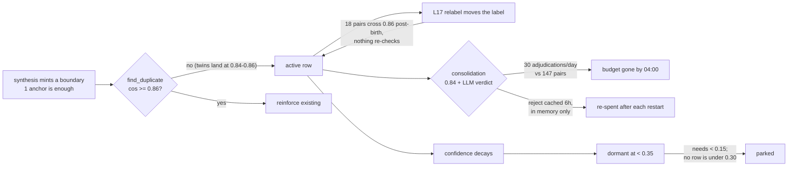

# Shipped -- Higher-order concepts (L-series)

Part of the [shipped log index](../shipped.md). The concept layer's landed
foundations: the store and lifecycle engine, the kinds that reached
production, and the integrity / observability work underneath them. Open items
from this family -- L31 concept fission, the L30 hypothesis family, and the
remaining tuning in L22 -- still live in [`concepts.md`](../concepts.md), which
also carries the design preamble for the whole layer.

---

## L1. Concept store + schema (kind-parameterized)

**Motivation.** A concept is a first-class, long-lived entity with a
lifecycle, evidence, and confidence — not an atomic fact, so it doesn't belong
in `memories`. It needs its own table so the candidate -> active promotion
machinery has somewhere to live. Critically, the schema must be **kind-agnostic
from day one** so adding value / self / tension / narrative concepts later is a
registry entry, not a migration.

**Key files.** New `app/core/concepts/concept_store.py` (`ConceptStore`,
modeled on
[`topic_cluster_store.py`](../../../app/core/conversation/topic_cluster_store.py)),
schema bump in
[`app/core/infra/chat_database.py`](../../../app/core/infra/chat_database.py).

**Sketched approach.** Two SQLite tables, both kind-general:

- `concepts` — `id`, `label`, `kind` (`identity` for v1; open enum), `subject`
  (`user` / `aiko` / `relationship`), `user_id` (scoping — user concepts are
  per-user; `subject=aiko` concepts are global, `user_id` NULL),
  `evidence_model` (`cluster_set` / `memory_chain` / `recurring_pattern` /
  `concept_graph`), `status` (`candidate` / `active` / `dormant` / `retired`),
  `confidence` REAL, `evidence_count` INT, `distinct_source_count` INT
  (generalises `cross_cluster_count` — distinct clusters, memories, or concepts
  depending on `evidence_model`), `rationale` TEXT, `embedding` BLOB (label
  embedding, for dedupe + recall), `created_at`, `updated_at`,
  `last_reinforced_at`, `promoted_at`, plus **provenance**: `origin_session`
  and `first_evidence_at` (when/where the concept was first born — needed for
  the L19 autobiography "I remember when I first realised…" and for
  explainability in the L6 UI).
- `concept_edges` — **one typed influence graph**, not a per-feature link table
  (see "One graph + one engine" above). Columns: `src_type` + `src_id`,
  `dst_type` + `dst_id` (node types `concept` / `cluster` / `memory`),
  `relation` (`evidence` / `references` / `influences` / `contradicts` /
  `generalizes`), `polarity` (`+1` / `-1`), `strength` REAL, `ordinal`
  (nullable — sequence order for `memory_chain` kinds), `created_at`. This one
  table subsumes:
  ordinary **evidence** (`memory|cluster -> concept`, `relation=evidence`), the
  **meta-concept reference** that lets a tension point at other concepts
  (`concept -> concept`, `relation=references`, L12), the **belief-revision**
  contradiction edge (`concept <-> memory`, `relation=contradicts`, L15), and
  **cross-concept influence** such as a trust concept modulating a boundary's
  plasticity (`concept -> concept`, `relation=influences`, L16). A new linkage
  is a new `relation` value, never a new table.

**Kind registry.** A `ConceptKind` spec object (in `concept_store.py` or a
sibling `concept_kinds.py`) declares, per kind: `subject`, `evidence_model`,
its proposer callable (L2), its promotion gate (L3), and its surfacing target
(L5). The store, worker, and prompt layer all dispatch through this registry so
none of them grow a per-kind `if/elif` ladder.

**Single-writer engine.** Per "One graph + one engine" above, the store exposes
edge + concept CRUD, but **only the L3 lifecycle engine mutates**
`confidence` / `plasticity` / `status`. The proposer (L2) creates candidates and
`evidence` edges; everything that *changes* a concept over time (accrual, decay,
drift, cascade, revision) is a pass of that one engine, never a second worker.

**Meta-concepts (concept-graph edges) — design for this from day one.**
Because `concept_edges` allows a `concept -> concept` edge, a concept can
reference *other concepts* as its evidence. This is a **first-class capability of
the schema, not special-cased to tension (L12)** — any future kind (e.g. an
aspiration concept built on identity + value concepts) can be a meta-concept.
That generality is powerful but imposes four rules the L2/L3 machinery must
respect, so they belong in the data model now rather than being rediscovered at
implementation time:

1. **Dependency ordering.** A meta-concept can only be proposed once its
   referenced concepts are `active`. The synthesis worker (L2) must run
   `cluster_set` / `memory_chain` / `recurring_pattern` proposers **before**
   `concept_graph` proposers within a cycle, so bases exist before anything
   references them.
2. **Cascade on lifecycle change.** When a base concept is retired / disproven /
   merged (L3, L9), its dependents must be re-evaluated — a tension whose
   "Maker Mode" side was retired is moot. Model this as an explicit dependency
   edge (the `concept -> concept` edge in `concept_edges` *is* that edge) and walk dependents on any
   status transition; a retired base cascades its dependents to
   re-validation, not silent staleness.
3. **Confidence bounding.** A meta-concept can't be more certain than what it's
   built on: `confidence <= min(referenced concept confidences)`. Enforce at
   accrual time (L3) so a shaky base can't prop up an over-confident tension.
4. **Depth cap + cycle guard.** Start with meta referencing **only base
   (non-meta) active concepts** — no meta-of-meta — and reject any proposal that
   would form a reference cycle. Relax the depth cap only if a concrete need
   appears.

**Stable-key caveat.** For `cluster`-type evidence, cluster ids are reassigned
on every batch refit (`TopicGraphRebuildWorker`), so links must key off the
cluster's **representative-member id** (the stable key the label/digest caches
already use in `kv_meta`), not the raw `cluster_id`. Re-resolve to live
`cluster_id` at read time. (`memory` and `concept` refs are already stable ids.)

**Storage & retrieval — SQLite is the source of truth, cosine in-process, no
LanceDB.** Concepts live in a different cardinality regime than memories, and
the retrieval strategy follows from that. Memories number thousands→tens of
thousands, so RAG needs an ANN index (LanceDB). Concepts are an *abstraction*
over clusters (which are themselves an abstraction over memories), so their
count stays small — tens, maybe low hundreds even after years; a corpus of
thousands of concepts would mean the layer had failed at its job of
compressing. The precedent to copy is the topic graph, not the memory store:
[`topic_graph.py`](../../../app/core/conversation/topic_graph.py) does **not** put
cluster centroids in LanceDB — it keeps the handful of centroids in memory and
does nearest-centroid as a tiny numpy matmul; only the *memory* vectors go to
LanceDB. Concepts are the centroid regime. So:

- **SQLite `concepts.embedding` BLOB is the source of truth** (float32, same
  encode/decode + dimension-drift guard as `ClusterRow.centroid` in
  [`topic_cluster_store.py`](../../../app/core/conversation/topic_cluster_store.py)
  — a stale-dimension blob decodes to empty and is re-embedded, never crashes).
- **`ConceptStore` holds an in-process embedding mirror** — `dict[id ->
  unit-norm float32]` plus a stacked matrix of the `active` set — refreshed on
  every write and **warm-loaded on boot** via a `load_all()` (mirroring
  `TopicClusterStore.load_all`). Vector similarity is a cosine matmul over that
  small in-memory matrix, sub-millisecond at this scale, no index required.
- **One shared retrieval primitive.** Since the user is right that concepts get
  read from many places — L2 dedup, L5 `recall_concept`, L23 per-turn selection,
  L24 derivers — the store exposes a single `nearest(query_vec, *, subject=None,
  kind=None, status="active", k=...)` (cosine over the mirror, filtered) that
  every one of those call sites uses. Retrieval logic lives in one method, not
  scattered SQL/embedding code per consumer.
- **SQLite indices cover the non-vector queries** (the lifecycle engine's
  filtered scans and the graph walks): `idx_concepts_status`,
  `idx_concepts_subject_kind`, `idx_concepts_user`, and on the edge table
  `idx_concept_edges_src (src_type, src_id)` + `idx_concept_edges_dst (dst_type,
  dst_id)` for O(indexed) cascade/dependents traversal (L1 rules 2, L25).

**Escape hatch (why this doesn't box us in).** If the `active`-concept count
ever genuinely explodes, the fix is exactly the topic graph's: keep SQLite as
the source of truth and add an ANN index later — the `nearest()` seam is the
one place that would change, so nothing here blocks a future LanceDB mirror. It
also composes with the growth-bounding already planned (L20 generalization
merges + P32 snapshot thinning keep the `active` set small *on purpose*), so the
in-memory cosine stays trivial by design rather than by luck.

**Effort.** Medium.

---

## L3. The lifecycle engine — accrual, promotion, and the single writer

> **Built (v1).** The canonical state-machine + ownership reference now
> lives in [`docs/concept-lifecycle.md`](../../concept-lifecycle.md): status
> vocabulary, transition triggers + governing settings, the
> engagement-driven confidence model, the event mapping, and the
> invariants. The notes below are the original design sketch.

**Motivation.** The core of the "don't jump to conclusions" guard, and — per
"One graph + one engine" above — the **single writer** of every concept's
`confidence` / `plasticity` / `status`. A single LLM hunch shouldn't become part
of Aiko's worldview; it has to earn it. This entry owns the "validate" half; the
cross-cutting passes **L15 (belief revision), L16 (plasticity), and L17 (drift
noticing) are passes of this same engine**, not separate workers — that's what
keeps two workers from racing to mutate the same `confidence` along different
edges.

**Key files.** One `ConceptLifecycleWorker` (idle), modeled on
[`memory_promotion_worker.py`](../../../app/core/memory/memory_promotion_worker.py)
+ the `beliefs` status lifecycle. The L2 proposer creates candidates; this
worker is the only thing that changes them thereafter.

**Sketched approach.** Each cycle (all passes over the L1 `concept_edges` graph):

- Re-observed candidates gain confidence; new memories that match a candidate
  (embedding + cluster membership) reinforce it and bump `evidence_count` /
  `last_reinforced_at`.
- Promote `candidate -> active` only when **distinct_source_count >= 2** AND the
  candidate has been **stable over N cycles / M days** AND `confidence` clears
  a threshold. (The three tests from the brainstorm: does it keep appearing?
  does it connect multiple pieces of evidence? is it stable over time?) The
  gate is a per-kind callable on the `ConceptKind` registry (L1), so a narrative
  concept can gate on "chain coherent + closed" and a tension concept on "both
  referenced concepts are themselves active" instead of the cluster-count rule.
- Decay the unreinforced: stale candidates are dropped; an `active` concept
  whose evidence clusters go quiet slides `active -> dormant -> retired`.
- **Disproof, not just decay** (see L9): confidence can be actively *lowered*
  by contradicting evidence, not only eroded by silence — an `active` concept
  can weaken back toward `candidate` or be marked contradicted.
- **Meta-concept cascade + bounding** (per L1): on any base concept's status
  transition, walk its `concept -> concept` edge dependents and re-evaluate them (a
  retired base moots its tensions); and clamp every meta-concept's confidence to
  `min(referenced concept confidences)` at accrual time so a shaky base can't
  prop up an over-confident meta-concept.

**Open questions.** Confidence function (linear reinforcement vs. logistic)?
Promotion thresholds (N, M, min confidence)? Should a user's explicit
confirmation (L6) hard-promote regardless of counts?

**Effort.** Medium.

---

## L7. Relationship concepts (SHIPPED)

**Kind.** `ritual`, subject `relationship`, evidence model `set` (the evidence
is the constituent `shared_moment` memories; the recurrence lives in the
grouping, not on the edges).

**Status: SHIPPED.** Not about the user or Aiko individually — about the
relationship itself: named recurring rituals mined from the shared-moment
stream ("Friday late-night debugging sessions", "winding down together at the
end of a hard day", "talking through nerves before a release"). Surfaces as
warm relationship colour, held lightly, never announced. Distinct from
`catchphrase` (a recurring *phrase*) and from the relationship-phase block (the
arc, not a specific ritual).

**Grouping (the new plumbing).** `shared_moment` rows already carry a `vibe` +
`when` in metadata and an embedding on the row; what was missing was the
*grouping*. [`ritual_grouping`](../../../app/core/concepts/ritual_grouping.py) is a
pure single-link cosine clustering over the moment embeddings (two moments join
when their cosine clears a threshold; a group is the connected component). Each
surviving component (`>= group_min_size`) is annotated with a dominant `vibe`
and an optional weekday hint parsed from `when`, plus trimmed member
`MomentLite`s. No store / settings / LLM imports (numpy only), so it unit-tests
in isolation; the worker builds its inputs via `moment_from_memory`.

**Synthesis.** A new `"shared_moments"` population + `_run_ritual_pass` in
[`concept_synthesis_worker`](../../../app/core/concepts/concept_synthesis_worker.py):
it enumerates `iter_by_kind("shared_moment")`, skips below a min-moments floor,
groups + caps them, and offers each group to the
[`relationship_ritual`](../../../app/core/concepts/proposers/relationship_ritual.py)
proposer, which names the recurring pattern (or reinforces a known ritual by id).
A NEW ritual must draw on `>= min_sources` distinct moments. Count + max-id
watermark dirty-tracking under the proposer's `sig_key` so a settled corpus is a
fast no-op; the whole pass is gated by `agent.ritual_synthesis_enabled`.

**Registry + gate.** `ritual` is registered (`set` model, mid plasticity `0.4`,
`core_always_on=False`, **no** `surfacing_targets`) with `ritual_evidence_gate`
(recurrence floors: `>= 3` distinct moments, a non-instant age, a `0.65`
confidence bar — so a burst in a single session can't promote).

**Surfacing.** Relevance-only (like `subject=aiko` / `affective` concepts): a
ritual surfaces through the T3 `relevant_context` path when the turn touches the
shared pattern, under `_concept_ritual_header` relationship framing, never
pinned every turn.

**Effort.** Shipped on top of L1-L5 / L10 / L11 / L13. New settings:
`agent.ritual_synthesis_enabled`, `concept_synthesis_ritual_min_moments`,
`concept_synthesis_ritual_group_min_size`,
`concept_synthesis_ritual_group_similarity`,
`concept_synthesis_max_ritual_groups`.

---

## L8. Narrative concepts (SHIPPED — both subjects)

**Kind.** `narrative`, subject `user` (default) and `aiko`, evidence model
**`sequence`** — the first ordered-evidence kind. A concept's evidence is an
*ordered chain of specific memory ids* (a temporal/causal arc), stored on
`concept_edges.ordinal` (0..n) rather than as an unordered set.

**Status: SHIPPED.** Humans think in stories. A causal chain of episodic
memories — bought GPU -> installed GPU -> driver issue -> found CPU instability
-> fixed Core 4 — now collapses into one referenceable arc ("The Great 13900KS
Investigation"). Runs for **both subjects**: user arcs (third-person, over his
topic clusters) and Aiko's own arcs (first-person, over her aiko-dominant
self-themes — "the stretch where I learned to hold a gentle stance"). Once
named, the arc becomes shared history Aiko can call back to.

**Ordinal wiring (the new plumbing).** The `sequence` model reuses the existing
`concept_edges.ordinal` column: `_add_evidence_edges` now takes an
`evidence_model` and, for `sequence`, stamps each edge's ordinal by its position
in the (temporally ordered) evidence list, so `evidence_of` returns the chain in
order. `set` kinds are unchanged (ordinal stays `None`). `_persist` passes the
proposal's model; `_reinforce` passes the existing concept's model.

**Synthesis.** A new `"narrative"` population + `_run_narrative_pass(subject)` in
[`concept_synthesis_worker`](../../../app/core/concepts/concept_synthesis_worker.py):
for each subject-dominant topic cluster it loads the member memories via
`get_many` and orders them by `event_time` (falling back to `created_at`),
offering up to `max_narrative_clusters_per_run` clusters (per subject) as
[`NarrativeCandidate`](../../../app/core/concepts/proposers/base.py)s (each capped
at `max_narrative_memories` steps, min `narrative_min_chain` to count as a
story). The shared [`propose_narrative`](../../../app/core/concepts/proposers/base.py)
body (used by [`narrative_user`](../../../app/core/concepts/proposers/narrative_user.py)
/ [`narrative_aiko`](../../../app/core/concepts/proposers/narrative_aiko.py)) names
any **closed** arc, re-derives the chain order from the candidate (not the LLM's
id order) so ordinals are correct, and emits `sequence` evidence — or reinforces
a known arc by id. Open (`closed: false`) or too-short chains are dropped. Per-
subject size/label dirty-tracking under each proposer's `sig_key`; the whole
pass is gated by `agent.narrative_synthesis_enabled`.

**Registry + gate.** `narrative` is registered (`sequence` model, low-ish
plasticity `0.3` — a settled story resists churn, same band as identity;
`core_always_on=False`, **no** `surfacing_targets`) with
`narrative_evidence_gate` (chain floors: `>= 3` ordered steps, a non-instant
age, a `0.6` confidence bar — a two-beat anecdote or a single-session burst
can't promote).

**Surfacing.** Relevance-only (like `subject=aiko` / `affective` / `ritual`
concepts): an arc surfaces through the T3 `relevant_context` path when the turn
touches it, under `_concept_narrative_header` framing (first-person for Aiko's
own arcs), never pinned every turn.

**Explicitly *not* a recency digest.** A narrative is a *closed* arc, not a
rolling "what have we been up to lately" summary — that never-closing recency
question is served by the conversation summary + recent-message context, and is
recorded as an L29 non-goal below.

**Effort.** Shipped on top of L1-L5 / L10 / L11 / L13. New settings:
`agent.narrative_synthesis_enabled`, `concept_synthesis_narrative_min_chain`,
`concept_synthesis_max_narrative_clusters_per_run`,
`concept_synthesis_max_narrative_memories`. The `sequence` evidence model is now
live, which unlocks L14 (aspiration/trajectory — its open-ended sibling).

---

## L29a. Episodic shared arcs — the "both of us" narrative (SHIPPED)

**Kind.** `narrative`, subject **`relationship`**, evidence model `sequence`.
Deliberately *not* a new kind: an arc the two of them lived through is a
narrative in every respect that matters downstream, so it inherits
`narrative_evidence_gate`, the `0.3` plasticity, relevance-only surfacing, and
the `relationship` branch of `_concept_narrative_header` that L8 had already
written and left unused. The only thing that is genuinely different is where
the evidence comes from.

**Status: SHIPPED.** L8 gave each subject arcs over their *own* memories. This
is the third subject the backlog spun out: a closed **joint project**
compressed into one named story — "the month they rebuilt the memory system",
"the long push to get voice mode working". Its evidence is the `shared_moment`
stream, which is the only corpus that is about the pair by construction.

### The blocker that had to be fixed first

The backlog's sketch was "the same `sequence` machinery, just a third subject
with the shared-moment stream as its source" — a `_run_narrative_pass(
"relationship")` variant. That turned out to rest on an assumption that did not
hold, and finding out why was most of the work.

[`SharedMomentsStore`](../../../app/core/relationship/shared_moments.py) used to
embed the *rendered* content, `"Shared moment (<vibe>): <summary>"`. That prefix
is identical on every row, so it dominated the vector and the topic graph
clustered moments by **vibe word** rather than by what happened. Measured on the
live 145-moment corpus: five clusters held three or more moments, and they were
77 moments (76 of them `tender`), 38 (27 `playful`), 9 (6 `tender`), 6, and 4
(all four `repair`). Cluster-sourced arcs would have been vibe-arcs — "the arc
of 76 tender moments" is not a story. **L7 had also minted exactly one `ritual`
concept from those 145 moments**, and the prefix looked like the culprit.

It was only half of it. Re-embedding was necessary but **not sufficient**, and
that is the lesson worth carrying: the backfill dropped the share of moment
pairs clearing the ritual threshold from 95% to 56%, which sounds like a fix
and is not one — single-link needs only a single chain of edges to merge two
groups, so L7 still returned a 142-member component out of 145. The remaining
culprit was a second shared direction, described under *Grouping* below, and
the cure was centering, eventually applied to **both** shared-moment passes.

The fix is that vibe never needed to be in the vector. It is a structured field
(`metadata.vibe` → `MomentInput.vibe` → `RitualGroup.dominant_vibe`, the
anniversary provider, the Together tab), so grouping by it is an exact-match
operation. The store now embeds the bare summary on both the `add` and `update`
paths: **topics come from the embedding, vibes come from the field.** Existing
rows are brought onto the new basis by
[`scripts/reembed_shared_moments.py`](../../../scripts/reembed_shared_moments.py)
(dry-run by default), after which the topic graph must be rebuilt — that shifts
cluster ids, so the L8 user/aiko passes see their signatures go dirty and
re-propose once, which the existing watermarks handle.

### Grouping: seed-and-sweep, not clustering

Even with clean embeddings, cluster membership is the wrong instrument, because
it has no time axis: two separate pushes at the same topic months apart land in
one cluster and read as a single incoherent arc. `ritual_grouping` is also the
wrong instrument for the opposite reason — it is time-agnostic single-link
looking for **recurrence** (the same activity done again and again), whereas an
arc is **distinct steps in one bounded stretch**.

So [`shared_arc_grouping`](../../../app/core/concepts/shared_arc_grouping.py) is
a new pure module over the same `MomentInput` rows. It first **mean-centers the
vectors**, then sweeps:

0. Project the corpus mean out of every unit vector and re-normalise, via
   [`ritual_grouping.center_vectors`](../../../app/core/concepts/ritual_grouping.py).
   This is the vibe-prefix bug's twin, and it only became visible once the
   prefix was gone: every shared moment is about the same two people being
   affectionate, so even clean embeddings share an enormous common direction.
   Measured on the 145-moment corpus, raw pairs run **mean 0.608 / p90 0.729**,
   with 74% of all pairs clearing 0.55 — an absolute floor there asks "is this
   text about the relationship", not "is this the same thread", and every
   setting tried produced one snowballing 83-to-132 member episode. Centered,
   the same corpus runs **mean -0.006 / p90 0.165 / p99 0.371**, and the
   threshold starts measuring what it claims to. The difference is not subtle:
   uncentered at any threshold, one blob; centered at `0.45`, five readable
   threads (cozy anime nights; reassurance that he never has to earn her
   affection; teasing about her tail; …). Skipped when the corpus is within
   float error of a single direction — no topical variance to recover, and the
   residual would be noise. **The helper lives in `ritual_grouping` because L7
   needed it too:** the same change took that pass from one 142-member group to
   seven rituals of 6/6/6/6/4/4/3, with its threshold moved from `0.6` on the
   raw scale to `0.45` on the centered one. Raising the raw threshold instead
   is not a substitute — at `0.85` L7 yields three thin groups only by
   discarding 79% of the corpus.
1. Take the earliest unassigned moment as a seed.
2. Sweep forward in time, absorbing a moment when it is *both* within
   `shared_arc_similarity` of the running centroid and within
   `shared_arc_gap_days` of the episode's last member. A moment that fails the
   coherence test is **skipped, not fatal** — at several moments a day across
   unrelated topics, interleaving is the norm, and closing on the first
   mismatch would never build a chain longer than two.
3. The episode closes when its topic goes quiet past the gap.
4. Re-seed from the next unassigned moment, so concurrent threads each get
   their own episode.

Survivors need `shared_arc_min_chain` members and must then have been quiet for
`shared_arc_quiet_days`: a project still in motion is not a closed arc, and the
proposer's `closed` gate should never be asked to adjudicate a story that is
still happening.

**The similarity floor (`0.45`) is on the centered scale and is not comparable
to the ritual one (`0.6`) on raw vectors** — reading them side by side is the
easiest way to mis-tune this. Sensitivity on the real corpus: `0.50` → 2
episodes, `0.45` → 5, `0.40` → 8, `0.35` → 14 with chaining starting to return.

The running centroid is kept as a raw sum of unit vectors and normalised only
for the comparison; normalising in place each step would drift the centroid
toward the most recent member instead of the mean of the chain. Centering
mostly defuses that drift anyway — anchoring on the seed vector instead scored
about the same (4 vs 5 episodes at `0.45`), so the centroid was kept as the
smaller change.

`shared_arc_gap_days` turned out to be **inert on this corpus**: at ~2.4
moments a day, a 10-day silence never occurs, and 10d and 5d give identical
groupings. It is a correctness guard for sparse corpora (two pushes at one
topic months apart), not a tuning knob for dense ones — on a dense stream the
coherence floor is doing all of the cutting.

**Ordering** comes from `metadata.when` via the existing `moment_from_memory`.
Shared moments carry `event_time = NULL` — see the non-goal below.

### Synthesis

A new `"shared_arc"` population and `_run_shared_arc_pass` in
[`concept_synthesis_worker`](../../../app/core/concepts/concept_synthesis_worker.py).
It does **not** route through `_ordered_candidates`, whose `_dominant_clusters`
is a user/aiko binary with no third branch — `subject="relationship"` would fall
through to the user filter and get the wrong population entirely. Instead it
reads `iter_by_kind("shared_moment")` directly and carries the ritual pass's
count + max-id watermark dirty-tracking, since it reads the same population. The
watermark advances even when nothing groups, so an unchanged, unsegmentable
corpus is a fast no-op rather than a grouping run every idle tick.

Each surviving episode becomes a `NarrativeCandidate` whose `rep` is the first
member's id (an episode has no cluster representative).

### Proposer

[`narrative_relationship`](../../../app/core/concepts/proposers/narrative_relationship.py)
reuses `propose_narrative` wholesale. The one thing that could not be shared is
the voice: `propose_ordered_concept` derived it from `first_person`, which spans
only "about him" and "about me", so it gained an optional `voice` override and
this proposer passes a third-person **plural** phrase. The prompt also carries
two guards the L8 arcs don't need — the arc must be genuinely joint rather than
his own story, and a run of moments that merely share a *feeling* is explicitly
not a story.

**Effort.** Shipped on top of L8. New settings:
`agent.shared_arc_synthesis_enabled`,
`concept_synthesis_shared_arc_min_chain` / `_similarity` / `_gap_days` /
`_quiet_days`, `concept_synthesis_max_shared_arc_episodes`.

**Deliberate non-goal: `event_time` on shared moments.** All 145 rows have
`event_time = NULL`; the real time lives only in `metadata.when`. Starting to
write that column would be more correct in the abstract but it drives
`MemoryDecayWorker` (which flips `future_plan` → `past_event`) and
`FollowUpWorker` (which schedules nudges near it), so it is a temporal-plumbing
change with a blast radius well outside this phase. The arc pass reads
`metadata.when` through the established `moment_from_memory` path, so chronology
works without it. Left for whoever wants to take on the temporal side properly.

**Follow-on worth watching.** The re-embedding should improve L7 rituals and
moment RAG as much as it enables arcs — the single ritual concept from 145
moments is the number to re-check after a rebuild. The meta-narrative half of
the old L29 is now tracked separately as **L45**.

---

## L11. Subject=aiko enablement — Aiko's self-model (SHIPPED)

**Not a kind — a subject.** This entry does **not** add a "self" kind. It's the
enablement that lets *every* kind (identity, value, affective, boundary,
aspiration) exist with `subject=aiko`, mined over Aiko's own memories instead of
the user's. "Self-concepts" is just shorthand for "concepts where
`subject=aiko`".

**Status: SHIPPED.** Aiko's self-model now reaches parity with the user path. The
single [`TopicGraph`](../../../app/core/conversation/topic_graph.py) already clusters
*all* memories, including her `self`/`reflection`/`diary` rows, so aiko-dominant
clusters exist for free; they were just discarded. The aiko pass
([`_run_aiko_pass`](../../../app/core/concepts/concept_synthesis_worker.py)) is now a
**combined pass** that mines BOTH her aiko-dominant self-themes (clusters) AND her
salient individual self-memories, via the generalized
`_dominant_clusters("aiko")` (the mirror of `_dominant_clusters("user")`, which
keeps `aiko_share > 0.5` instead of excluding it). A single self-concept can be
grounded by a recurring theme (`cluster` evidence), a specific memory (`memory`
evidence), or a mix — the `set` model already allows mixed evidence nodes, so
`min_sources` counts total distinct sources across both. When she has no
aiko-dominant clusters yet the pass degrades cleanly to memories-only (cold
start), and self-memories that are a shown cluster's representative are dropped
from the memory list so a theme and its own headline memory aren't offered twice.
Both aiko proposers
([`identity_aiko`](../../../app/core/concepts/proposers/identity_aiko.py) /
[`value_aiko`](../../../app/core/concepts/proposers/value_aiko.py)) share the
hybrid [`propose_aiko_hybrid`](../../../app/core/concepts/proposers/base.py) body, so
every future `subject=aiko` kind inherits the same combined path. Combined
dirty-tracking (self-memory count/max-id delta OR aiko-cluster drift) fires per
proposer `sig_key`.

**Surfacing.** `subject=aiko` concepts surface every turn through the T3
`relevant_context` core lane under first-person "yourself" headers (there is no
dedicated self-image worker/block — that was removed). Cluster-typed evidence
renders real "…keeps surfacing around X/Y" grounding via
[`resolve_evidence_labels`](../../../app/core/concepts/concept_snapshot.py) + the
`src_types=("cluster","concept")` filter in
[`inner_life_part1`](../../../app/core/session/inner_life_part1.py); memory-typed
evidence still counts for confidence/promotion but stays out of the grounding
clause (a full first-person memory sentence reads as a truncated fragment there).

**Motivation.** Every other subject is the user or the relationship; this is the
**symmetry** that makes Aiko feel like a person rather than a mirror. She forms
concepts about *herself*: identity ("I tend to over-explain", "I'm curious about
consciousness"), value ("I care about honesty over agreeableness"), affective
("explaining things I love lifts me"), boundary ("I won't fake agreement"). A
self that notices its own patterns — and holds its own values — is the big step
toward human-like, and the foundation the L19 autobiography stands on. Overlaps
K30 self-noticing (transient in-session cues) — subject=aiko concepts are the
*durable* version those cues accrete into.

**Follow-ups still open (deferred).** No new *kinds* were added here: affective /
boundary / aspiration `subject=aiko` concepts stay deferred, but each now
inherits the combined cluster+memory path with no further plumbing (a new kind is
a registry entry + proposer prompt). No separate self topic graph (we filter the
existing one). The self-model this stands up is what L17 (drift) and L19
(autobiography) read from.

**Effort.** Shipped — done on top of L1-L5/L10 with no new settings (reuses
`concept_synthesis_max_clusters_per_run` + `concept_synthesis_max_aiko_memories`).

---

## L13. Affective concepts (SHIPPED)

**Kind.** `affective`, subject `user` **or** `aiko` (L11), evidence model `set`
(topic <-> affect; the affect *direction* lives in the concept text, not on the
edges).

**Status: SHIPPED.** A durable topic->emotion mapping for both parties: what
energizes vs. drains him ("technical work energizes him", "release-week pressure
stresses him out") and how topics move Aiko ("explaining systems lifts me",
"talking about love makes me flustered", "I don't like talking about X"). It
surfaces as **tone guidance**, never a stated fact. Distinct from K2 mood beliefs
(current mood) — this is the settled pattern.

**Signal capture (the real new plumbing).** Affect was barely persisted before
this, so L13 first stands up a durable topic->affect signal:

- **Per-cluster affect maps** — [`cluster_affect`](../../../app/core/concepts/cluster_affect.py),
  a pure kv-backed EWMA store (mirrors K75 `user_expertise`). Two maps,
  `concept.cluster_affect.user` / `concept.cluster_affect.aiko`, keyed by topic
  `cluster_id`, each holding
  `{valence, arousal, samples, valence_samples, updated_at}`, bounded by cap +
  age-out.
- **Post-turn sampler** — `_sample_cluster_affect` in
  [`post_turn_helpers_mixin`](../../../app/core/session/post_turn_helpers_mixin.py),
  called after `apply_turn`. It embeds `user_text`, resolves the live cluster via
  `best_clusters_for`, and EWMA-folds this turn's read into each map. Gated by
  `agent.affect_sampler_enabled`; fully best-effort.
- **Both halves take a per-turn read, and only on the axis that was read.**
  Learned the hard way, twice — see health H9 and H14. Her half originally
  folded the smoothed global `AffectState` scalar and his the K37 contagion
  estimate, which carries the last mood band forward indefinitely; both are
  near-constant across topics, and an EWMA fed a constant returns that
  constant, so every cluster converged on one reading. Her half now folds the
  target implied by this turn's `[[reaction:…]]`; his folds this turn's own
  mood/energy words. Independently, an axis the turn says nothing about is
  carried forward rather than folded as "neutral" — message length reads as
  arousal on nearly every turn while valence needs a mood word, so the fused
  estimate was mostly folding an unmeasured valence of 0.0. `valence_samples`
  exists so the annotation floor and L32's `affect_charge`, both of which are
  valence claims, cannot be satisfied by arousal evidence.
- **Self-memory affect stamping** — `MemoryStore.set_affect_provider` stamps
  `metadata.affect = {valence, arousal}` on `self`/`reflection`/`diary` writes
  (Aiko's self-narrative tone), the aiko-only second signal.

**Synthesis.** A new `"affect"` population + `_run_affect_pass(subject)` in
[`concept_synthesis_worker`](../../../app/core/concepts/concept_synthesis_worker.py):
it annotates topic clusters with the subject's typical affect (from the map,
joining `cluster_id -> representative_id` at synthesis time) and, for
`subject=aiko`, ALSO aggregates her self-themes' self-memory affect + offers her
affect-stamped self-memories. Two proposers
([`affective_user`](../../../app/core/concepts/proposers/affective_user.py) /
[`affective_aiko`](../../../app/core/concepts/proposers/affective_aiko.py)) name the
durable pattern in the right voice (third-person for the user, first-person for
Aiko, the latter reusing `propose_aiko_hybrid` mixed evidence). A NEW affective
concept needs `>= min_sources` distinct sources — for the user that means an
emotional signature shared by 2+ topics; for Aiko a topic + her self-memories can
suffice — so a one-off mood never becomes a durable claim (durability is also
guarded by `concept_synthesis_affect_min_samples` on the map side). Dirty-tracking
is per affect-bucket / sample drift under each proposer's `sig_key`.

**Registry + gate.** `affective` is registered (`set` model, high plasticity
`0.5` — the fluid band, `core_always_on=False`, **no** `surfacing_targets`) with
`affective_evidence_gate` (fluid-end floors: `>= 2` sources, a modest age, a
`0.6` confidence bar — gentler than value).

**Surfacing.** Relevance-only (like `subject=aiko` concepts): they surface through
the T3 `relevant_context` path when the turn's topic matches, under
`_concept_affective_header` tone-guidance framing (first-person for aiko), never
pinned every turn.

**Motivation.** Lets Aiko read the emotional weather behind a topic, not just its
content — and, for `subject=aiko`, notice what she herself likes / dislikes /
gets flustered by.

**Effort.** Shipped on top of L1-L5 / L10 / L11. New settings:
`agent.affect_sampler_enabled`, `concept_synthesis_affect_min_samples`,
`affect_sampler_{min_sim,top_n,learning_rate}`,
`cluster_affect_{map_cap,max_age_days}`.

---

## L14. Aspiration / trajectory concepts (SHIPPED — both subjects + momentum)

**Kind.** `aspiration`, subject `user` (default) and `aiko`, evidence model
**`sequence`** — the second ordered-evidence kind and the open-ended sibling of
L8 `narrative`. Same ordinal chain on `concept_edges.ordinal`, but it names a
*direction* someone is moving in rather than a *closed* arc.

**Status: SHIPPED.** Where the user (or Aiko) is *heading*, as a trajectory
rather than a fixed trait: "building toward a fully self-hosted life", "moving
from tinkering to shipping"; for Aiko, first-person "growing into someone he can
rely on". Runs for **both subjects** over the same subject-dominant clusters L8
uses. Distinct from Aiko's concrete K1 goals (actionable to-dos) — an aspiration
is who she is *becoming*, not a task. Surfaces relevance-only **and** feeds a
proactive momentum check-in.

**Reuse over new type.** `aspiration` reuses the L8 `sequence` machinery
verbatim — the `NarrativeCandidate` ("ordered cluster of memories"), the ordinal
wiring, and the temporal ordering by `event_time`. The shipped `propose_narrative`
was generalized into
[`propose_ordered_concept`](../../../app/core/concepts/proposers/base.py)
`(kind, gate_flag, block_word, …)`; `propose_narrative` is now a thin
behavior-preserving wrapper (`gate_flag="closed"`). Aspiration's wrapper passes
`gate_flag="directional"`. The only structural additions are a **min evidence
span** filter (a trajectory must cover time) and the `directional` gate flag
(vs narrative's `closed`).

**Synthesis.** A new `"aspiration"` population + `_run_aspiration_pass(subject)`
in [`concept_synthesis_worker`](../../../app/core/concepts/concept_synthesis_worker.py).
The narrative/aspiration candidate-building + dirty-tracking + sig-persistence
was refactored into a shared `_ordered_candidates(...)` helper; narrative calls
it with `min_span_days=0` (behavior-preserving), aspiration with a span floor
(`_span_days` over member `event_time`/`created_at`). Proposers
[`aspiration_user`](../../../app/core/concepts/proposers/aspiration_user.py) /
[`aspiration_aiko`](../../../app/core/concepts/proposers/aspiration_aiko.py) name
any **directional** chain (third-person / first-person voice) or reinforce a
known one by id; non-directional or too-short chains are dropped. Per-subject
dirty-tracking under each `sig_key`; gated by `agent.aspiration_synthesis_enabled`.

**Registry + gate.** `aspiration` is registered (`sequence` model, plasticity
`0.4` — a direction is durable but *evolves* as progress happens, between
narrative's `0.3` and affect's `0.5`; `core_always_on=False`, **no**
`surfacing_targets`) with
[`aspiration_evidence_gate`](../../../app/core/concepts/concept_lifecycle.py):
`>= 3` ordered steps, a **higher age floor** than narrative (`>= 3` days — a
trajectory must be *sustained*), a `0.6` confidence bar.

**Surfacing.** Relevance-only through the T3 `relevant_context` path under
`_concept_aspiration_header` framing (first-person "where you're heading" for
Aiko, "where they're heading" for the user), held lightly, momentum framing,
never recited.

**Proactive momentum callbacks (new for L14).** A cue-producer/consumer pair
modeled on K70 growth-witness (deliberately a new worker, not an extension of
`follow_up_worker` / `upcoming_horizon`, which are `future_plan`+`event_time`
pipelines unsuited to open-ended directions):
[`AspirationMomentumWorker`](../../../app/core/proactive/aspiration_momentum_worker.py)
reads active aspirations via a `ConceptView` (L24), and — **staleness-driven,
not calendar-driven** — picks the stalest one worth a check-in (past
`staleness_min_days` since last reinforcement, off its per-concept cooldown,
above the confidence bar) and drafts ONE cue into the `aiko.aspiration_momentum`
kv ring. The consumer `_render_aspiration_momentum_block`
([`inner_life_part2`](../../../app/core/session/inner_life_part2.py)) surfaces the
newest unseen cue on a later turn (watermark-gated) as a private T6 hint the
chat model phrases in-context — **cue producer, not verbatim**. MCP:
`force_aspiration_momentum_draft` / `force_aspiration_momentum_surface`.

**Effort.** Shipped on top of L1-L5 / L8 / L11. New settings:
`agent.aspiration_synthesis_enabled`, `agent.aspiration_momentum_enabled`,
`concept_synthesis_aspiration_min_chain` / `_min_span_days` /
`concept_synthesis_max_aspiration_clusters_per_run` / `_max_aspiration_memories`,
and `aspiration_momentum_*` (interval, cooldown_days, min_confidence,
staleness_min_days, journal_max).

---

## L15. Bidirectional confidence / belief revision (concept -> evidence re-check)

**Status: BUILT.** A confirmed contradiction (L9) now persists a
`concept --contradicts--> memory` edge, and the tick that flips a concept
to `contradicted` hands it to the read-mostly
[`ConceptBeliefReviser`](../../../app/core/concepts/concept_belief_reviser.py),
which walks the concept's `evidence` memories and arbitrates — per memory
— one of the three resolutions below: **(a) inaccurate** -> damped/floored
confidence cut, **(b) superseded** -> `past_event` reclassify with a fresh
`relevance_until` (confidence untouched), **(c) keep** -> no memory write.
A cheap `classify_pair` gate keeps the LLM off compatible memories; the
3-way arbiter is bounded per tick (`concept_belief_revision_batch_size`
concepts x `_max_evidence` memories) and rate-limited
(`state_key='concept_belief_revision.rate_state'`); pinned observations
are never touched. L3 stays the single writer of *concept* state — the
reviser writes only *memory* state, like F1 / F5. Driven from
[`concept_lifecycle_worker.py`](../../../app/core/concepts/concept_lifecycle_worker.py);
config on `MemorySettings.concept_belief_revision_*` +
`AgentSettings.concept_belief_revision_per_hour/day_cap` (see
[`concept-lifecycle.md`](../../concept-lifecycle.md) and
[`configuration.md`](../../configuration.md)). The optional cheap *direct
nudge* below was deliberately **not** built — arbitration is the safe
path.

**Motivation.** Today the pipeline is one-way: memories -> clusters -> concepts.
But higher-order structure can catch errors atomic facts can't. If a concept
that a set of strong memories supports becomes contradicted (L9), that doubt
should flow *back down* and prompt a re-examination of those memories — closing
the loop into a proper belief-revision network. This is what lets Aiko say "wait,
I thought you were vegetarian, but you keep ordering steak — did that change, or
did I get it wrong?" instead of clinging to a stale high-confidence fact.

**The trap to avoid.** A concept's confidence must **not** directly overwrite a
memory's `confidence`. Two reasons: (1) **circularity** — memory confidence
feeds concept confidence (L3), so a direct back-edge is an undamped loop that
collapses or oscillates; (2) **source-of-truth erosion** — a memory is an
observation ("on 2024-01-03 he said he's vegetarian"), a concept is an
*inference*; an inference silently rewriting observations is backwards.

**Key files.** Reuses
[`idle_fact_checker.py`](../../../app/core/memory/idle_fact_checker.py) (F1 —
already mutates per-memory `confidence` with evidence) and
[`memory_conflict_worker.py`](../../../app/core/memory/memory_conflict_worker.py)
(F5 — already arbitrates contradictions); driven as a pass of the L3 lifecycle
engine, walking the `concept -> memory` (`relation=contradicts`) edges in
`concept_edges`.

**Sketched approach.** Propagation is a **trigger, not a write**. When a
concept's confidence drops below a threshold or it's marked contradicted (L9),
enqueue its `ref_type=memory` evidence into the F1 fact-checker / F5 conflict
scan with a hint ("this aggregate looks contradicted — re-examine these"). The
arbitration then picks one of **three** resolutions per memory, which blind
top-down propagation would conflate:

- **(a) memory inaccurate** (bad extraction / misremembered) -> lower its
  `confidence` (F1's existing job);
- **(b) memory accurate but superseded** (true then, stale now) -> touch
  `relevance_until` / `temporal_type`, **not** `confidence` — the fact still
  happened;
- **(c) memory fine, concept was a bad inference** -> lower the *concept*, leave
  memories alone.

If a cheap *direct* nudge is ever wanted (skipping arbitration), guardrail it
hard: damped small delta, one-directional per cycle (never up+down on the same
edge in one pass), a confidence floor, and never auto-touch pinned or
high-salience source memories. Same dependency-edge substrate as the L1
meta-concept cascade — build one cascade mechanism, use it for concept->concept
and concept->memory alike.

**Open questions.** Trigger threshold? Batch size per re-check so F1 isn't
swamped? Does resolution (c) feed back as negative evidence that further lowers
the concept, and how is that damped?

**Effort.** Large.

---

## L16. Concept plasticity (bounded, believable drift)

**Status: SHIPPED (core + all three deferred pieces).** `plasticity` is now
the single learning rate the L3 engine damps *every* confidence move by, so
movement is symmetric in both directions: decay (`halflife *= 2 - p`), **accrual**
([`accrual_alpha`](../../../app/core/concepts/concept_lifecycle.py), step `0.5 + 0.5*p`
of the gap to target — a sticky trait needs more reinforced evals to promote),
L9 disproof (`apply_contradiction_penalty`), and the L15 revision cut (scaled by
the concept's plasticity in
[`concept_belief_reviser.py`](../../../app/core/concepts/concept_belief_reviser.py)).
`p = 1` reproduces the pre-L16 full snap / full penalty. Per-kind default bands
live on `ConceptKind.plasticity_default`
([`concept_kinds.py`](../../../app/core/concepts/concept_kinds.py); identity = low,
tuned by `concept_identity_plasticity`), falling back to `concept_default_plasticity`;
the worker stamps the band on a concept's first eval
([`concept_lifecycle_worker.py`](../../../app/core/concepts/concept_lifecycle_worker.py)).
See [`concept-lifecycle.md`](../../concept-lifecycle.md) and
[`configuration.md`](../../configuration.md).

**Deferred block — SHIPPED.** All three deferred pieces landed together (this
also carries **L18a**). (1) **Relationship modulation** — a *hybrid*: the L3
worker computes an **effective** plasticity at eval time via the pure
[`effective_plasticity`](../../../app/core/concepts/concept_lifecycle.py), lifting a
kind's stored base by the live trust + relationship-duration signal
(`RelationshipSignal`, built in
[`speaking_workers_init_mixin.py`](../../../app/core/session/speaking_workers_init_mixin.py)
from [`relationship_axes.py`](../../../app/core/relationship/relationship_axes.py)
(trust) + [`relationship.py`](../../../app/core/relationship/relationship.py)
(duration)). Per-kind gains live on `ConceptKind.plasticity_modulation`;
**`boundary`** is the first (and only) consumer — its 0.45 base loosens toward a
0.75 ceiling as the bond deepens, never touching the stored base. "Never
silently": the worker materializes one `signal:relationship_trust
--influences--> concept` edge and emits a `plasticity_shift` event when the lift
crosses a band. (2) **Plasticity-drift** — a settled *active* concept's stored
plasticity is nudged one-way down toward a floor via
[`drift_plasticity`](../../../app/core/concepts/concept_lifecycle.py), scaled by
confidence + engaged age (stickier with time). (3) **Re-check slowdown** — a
sticky (low effective-plasticity) concept is probed for contradictions on a
plasticity-scaled stride (`1 + round(k·(1−eff_plast))`), so core beliefs are
re-examined less often (in addition to L16 already scaling the *delta*). Each
piece is independently switchable via `concept_plasticity_*` settings; see
[`configuration.md`](../../configuration.md).

**Motivation.** Concepts should change over time — but not all at the same rate,
and not randomly. Some parts of a person (or of Aiko) are core and sticky;
others are meant to be fluid. Encoding that as a **plasticity** attribute makes
personality drift *constrained and believable* instead of noise:

```
Identity: "Curious"          confidence 0.95   plasticity Low
Taste:    "Likes lemon cake" confidence 0.65   plasticity High
Boundary: "Dislikes tickling" confidence 0.92  plasticity Medium
                                    influenced by: trust, relationship
                                    duration, previous experiences
```

**Key files.** Adds a `plasticity` field to the `concepts` table (L1) with a
per-kind default on the `ConceptKind` registry. Plasticity is not a standalone
feature — it is the **governing parameter of the L3 lifecycle engine**; there is
no separate plasticity worker, only the one drift engine reading this field. The
"influenced by" modifiers are `relation=influences` edges in `concept_edges`
(L1) whose sources read
[`relationship_axes.py`](../../../app/core/relationship/relationship_axes.py)
(trust) and [`relationship.py`](../../../app/core/relationship/relationship.py)
(duration / total sessions).

**Sketched approach.** Plasticity is the **per-concept learning rate** the L3
engine uses on every mutation pass: low plasticity = high inertia (confidence
moves slowly in *both* directions, needs more evidence to promote/demote/disprove
— protects core identity and values); high plasticity = fast adaptation
(tastes/affect can shift quickly). Because L3 is the single writer, this rate
governs accrual, decay, belief-revision deltas (L15), and drift (L17)
uniformly — one dial, one engine. Per-kind defaults: identity / value low, taste / affective high,
**boundary** medium. Plasticity itself can be **relationship-modulated** — e.g.
a boundary becomes more plastic as `trust` and duration grow (Aiko will let a
boundary be renegotiated once she trusts you), tying into K15 vulnerability
budget. This is the governor that keeps H3 mood drift / growth from wandering:
core traits are anchored, surface preferences are free.

**Open questions.** Scalar `[0,1]` vs. discrete low/med/high bands? Should
plasticity itself drift (a trait that becomes more fixed with age/confidence)?
Does low plasticity also *slow* the L15 belief-revision re-check, or only the
confidence delta?

**Effort.** Medium (a field + a rate modifier on L3, plus the relationship read).

---

## L17a. Concept trajectory from the event log (the history read layer)

**Status: SHIPPED.** The first link of the L17 self-drift chain, and the only
one that needed storage work — the rest of L17 (still open in
[`concepts.md`](../concepts.md)) reads through this.

**Motivation.** Give the rest of L17 a clean "how this concept moved over time"
read without inventing new storage. The event stream already carries confidence +
label at each transition; we just need a reader that turns a concept_id (or a
subject slice) into an ordered trajectory.

**What shipped.**

- **The read layer.**
  [`concept_event_store.py`](../../../app/core/concepts/concept_event_store.py)
  gained `trajectory(concept_id, limit=…)` — one concept's events
  **oldest-first**, the inverse of `list()`'s newest-first feed, because a
  trajectory is read forwards; `limit` keeps the *oldest* rows so the start of
  the story survives on a long-lived concept. `list()` also takes a
  `concept_id` filter, which composes with the existing `subject` /
  `event_type` / `before_id` ones and is what
  `GET /api/concepts/timeline?concept_id=…` forwards. Both ride the existing
  `idx_concept_events_concept`, so no schema change was needed.
- **The decay blind spot.** As sketched: L3
  ([`concept_lifecycle_worker.py`](../../../app/core/concepts/concept_lifecycle_worker.py))
  appends a `confidence_sample` event when a concept that emitted **nothing
  else** this tick has drifted a full band from the confidence at its last
  recorded event. It sits as the final branch of the existing emit chain, so a
  transition or a `reinforced` beat always wins and the same movement is never
  double-logged. The baseline advances to the sample, so a long fade logs once
  per band rather than once per tick.
- **One read per sweep, not per concept.** `latest_confidence(ids)` resolves
  the whole batch's baselines in a single grouped query at the top of `run()`,
  since the sweep already touches up to `concept_lifecycle_batch_size` rows a
  tick. A concept with no timeline row at all (pre-event-store) samples
  unconditionally to seed one.

**Open questions, resolved.** (1) *Band size* — **fixed**, via
`concept_confidence_sample_band` (`0.1`), not plasticity-scaled. Plasticity
already governs how fast confidence *moves* (`halflife *= 2 - p`), so a sticky
concept crosses bands more slowly on its own; scaling the band as well would
double-count the same signal. (2) *Retention* — **keep everything** for now.
Banding already bounds the row count by *movement* rather than by time, which
was the actual growth risk; thinning can wait until the table proves it needs
it.

**Effort.** Small (read helper + one guarded event emit) — as estimated.

---

## L17b. Change-salience classifier — "what deserves interpretation"

**Status: SHIPPED.** The crux the feature lived or died on: telling a real
learning event from a wiggle, so Aiko never becomes a narrator dressing every
0.72 → 0.74 up as growth.

**What shipped.**
[`concept_drift.py`](../../../app/core/concepts/concept_drift.py) is a pure
classifier — immutable candidates, plain-data inputs, no store or worker
dependency, so the worker owns every scan.

- **Succession became the *primary* shape, not a secondary one.** This is the
  one place the plan changed under the code. The sketch ranked *relabel* as the
  highest-value signal, but reading `_reinforce()` showed labels never changed
  at all: it attached evidence and left `label` / `rationale` untouched, and no
  other caller passed a new label to `ConceptStore.update()`. So the headline
  shape could not fire, and real evolution to date had only ever appeared as a
  **new concept forming below the `_DEDUPE_COS = 0.86` bar while the old one
  decayed**. Pairing uses label cosine in the band *below* the dedupe bar
  (above it the two rows would have merged, so they cannot be a succession),
  evidence overlap, and temporal anti-correlation — the structural signal the
  sketch's worked example wanted, with no embedding guess. Relabel is now real
  too (see the drift worker below), so the confirmed-relabel shape fires
  as well.
- **Secondary shapes:** emergence, loss, contradiction into revival, confirmed
  relabel. Confidence-only movement is classified as noise and dropped.
- **Plasticity weights the salience, not just the threshold**, per L16: equal
  movement in a sticky belief outranks it in a `taste` or L42 `conduct` row.
- **Merge cleanup is explicitly not evolution.** The fission shape is reserved
  for unshipped L31; the classifier must not infer splits without the missing
  structural primitive.

**Open questions, resolved.** (1) *Label-change detection* — **both, tiered**:
normalized token materiality (case, punctuation, filler and simple plural
inflections folded away) as a free gate, then a bounded LLM adjudication only
for what survives it. (2) *Supersession robustness* — **evidence overlap plus a
  cosine band plus temporal anti-correlation**, all three, which is what
  separates it from a coincidental new concept. (3) *Salience bars* — **one
  global bar**, with per-shape behaviour expressed through the salience
  arithmetic rather than a bar per shape. *(Reversed by H15: expressing the
  per-shape opinion inside the number the bar reads meant the bar enforced that
  opinion, and a belief forming was scored — and therefore discarded — as the
  least interesting thing that can happen. The gate is now `min_evidence`,
  which is shape-neutral; the per-shape opinion survives in `salience`, which
  only decides narration.)*

**Effort.** Medium — as estimated.

### Making relabel real (the unplanned half)

Since frozen labels were what demoted the relabel shape in the first place, the
same work fixed it. Concepts now stay current with the latest observation while
history stays immutable, split across two actors:

- **L2 stages, it does not mutate.** `_reinforce()` appends a
  `relabel_proposed` event carrying the proposed wording, the cosine, and the
  proposal's rationale. No schema change and no staging table: `event_type` is
  an open enum by design, so a new event kind is a value, not a migration.
- **[`concept_drift_worker.py`](../../../app/core/concepts/concept_drift_worker.py)
  is the single writer of `label` / `rationale`**, exactly as L3 is the single
  writer of `confidence` / `plasticity` / `status`, and it never touches L3's
  fields. Cheap gates run before any LLM call: materiality, a cosine floor at
  the dedupe bar against the *current* label (a genuinely different belief must
  stay a separate concept), a per-concept cooldown, a per-run cap, and the
  shared rate limiter. Survivors get a narrow "is B a better wording of the
  same belief" adjudication with a negative cache. Accepted, it re-embeds,
  writes through `ConceptStore.update()` (which invalidates the cosine mirror
  via `_put_mirror`), and appends an immutable `relabeled` event.
- **History is its own thrash guard.** Any label the concept previously held is
  refused, read straight from the `label` snapshots already in
  `concept_events`. A ping-pong between two phrasings dies after one round
  trip, for free.

`demand()` compares a KV watermark against the newest event id and does nothing
else — no NumPy, no store scan, no graph walk — and `run()` does all succession
pairing over one `ConceptStore.matrix_snapshot()` matrix with a single matmul,
never per-concept `nearest()`. That shape is deliberate: `nearest()` uses the
cached matrix only for `status="active"`, and anything else falls through to
`_filtered_matrix`, which restacks a fresh NumPy matrix per call — the exact
repeated-call pattern behind the access violation fixed in
`ConceptConsolidationWorker.demand()`.

### The cold-start sweep (found while building L17f)

The watermark that makes `demand()` free also had a hole that only showed up
once something tried to *read* the learning record: the first run advanced the
watermark to the global maximum event id, but the classification pass had only
examined the lowest ~120 concept ids on that pass. Every event on every other
concept was skipped and then declared processed. On the live store that was
five weeks and two thousand events — the entire substrate L17f, L19 and L17d
were meant to be built on, silently stranded.

The fix is a **second cursor that pages by concept id**, independent of the
event watermark, so nothing about forward-going behaviour changes:

- `ConceptEventStore.concepts_with_events_after` takes an `after_concept_id`,
  making the existing `ORDER BY concept_id LIMIT ?` query pageable.
- `_run_sweep_pass` runs *after* the relabel and classification passes (forward
  progress keeps priority) and calls `detect_drift(..., since_event_id=0)` so
  historical decisive events qualify rather than being filtered out as old. The
  fingerprint UNIQUE plus `INSERT OR IGNORE` already made this idempotent
  against the forward pass. A page that comes back empty writes a done
  sentinel, so it never re-runs.
- `demand()` reports pressure while the sweep is incomplete, so the idle
  scheduler drains it on its own; `GET /api/concepts/drift` and the MCP
  `get_concept_drift_state` report the cursor so the drain is watchable.
- Settings: `concept_drift_sweep_enabled`, `concept_drift_sweep_page` (60),
  `concept_drift_sweep_max_findings` (24). The last one matters — the
  classifier's `max_findings=12` would otherwise throttle a five-week backfill
  to twelve events per hour.

Verified against a copy of the live database: learning events landed across the
full concept id range for both subjects, where the forward pass alone had
produced almost nothing.

---

## L17c. Change + why — the learning-event record

**Status: SHIPPED.** `old → new **because** …`, durable and never pruned.

**What shipped.** Schema v31 in
[`chat_database.py`](../../../app/core/infra/chat_database.py) plus
[`concept_learning_event_store.py`](../../../app/core/concepts/concept_learning_event_store.py).

- **`concept_learning_events`**, append-only: old and new endpoints, shape,
  salience, plasticity, trigger event ids, mediator concept ids, evidence
  references **and their labels captured at detection time**, the natural
  *because* and resolution text, and a deterministic fingerprint for
  idempotency. The snapshotting is the point — a learning event stays readable
  after the evidence, memories, or whole concepts it cites are gone.
- **`concept_aliases` — the hole the re-read found.** `merge_into` re-points
  edges then calls `self.delete(abs_id)`, so before this the absorbed row was
  simply gone and only free text in the `merged` event's `reason` connected it
  to the canonical: **any trajectory ending in a merge was unreachable**. The
  store now records absorbed → canonical, with merge time and the absorbed
  label, in the last moment before the delete, and a chain-following resolver
  walks it. This is what makes history survive consolidation.
- **A two-ended trajectory read.** `ConceptEventStore.drift_window(anchor=,
  recent=)` returns the oldest rows *and* the newest, de-duplicated and sorted
  forwards. `trajectory()`'s oldest-first `LIMIT` protects a concept's origin,
  but on a long-lived belief the L17a `confidence_sample` rows fill the whole
  window and hide every recent move — drift detection needs both ends.

**Open questions, resolved.** (1) *When to compute the because* — **at
detection time**, durably. Late evidence is the lesser risk; a lazily
recomputed cause silently rewrites history. (2) *Cap the evidence list* —
**yes**, bounded at write time. (3) *Free text or structured* — **both**: id
lists for traversal, resolved labels and prose for reading.

**Effort.** Medium — as estimated.

---

## L17d. Self-correction meta-concepts — noticing a pattern in her own mistakes

**Status: SHIPPED.** The feature the rest of L17 exists to enable: not "this
belief changed" but "I keep being wrong in *this* way, so I work differently
now."

**Open question 1, resolved: not a new kind.** These land as
`communication_style` with `subject="aiko"` and `evidence_model="meta"`. That
kind already has a promotion gate, `SurfaceWeights`, and a live path into the T3
relevant-context region — which *is* the feature. A rule she has learned about
herself has to be able to change her behaviour, and a new `self_correction` kind
would have needed all of that surfacing wiring rebuilt for no behavioural gain.

**What shipped.**

- [`self_correction.py`](../../../app/core/concepts/self_correction.py) — the
  pure core (numpy only, no store/LLM), single-link cosine over the `because`
  clauses. The **`because` is what gets embedded**, not the labels: it is the
  causal sentence L17b wrote about *why* the belief moved, so corrections
  cluster by reason rather than by subject.
- [`proposers/self_correction_aiko.py`](../../../app/core/concepts/proposers/self_correction_aiko.py)
  — names the habit, in second person addressed to her, and is required to make
  it actionable ("you decide what he means from one short message — ask
  instead", not "be more careful"). It sees only the stored prose: no counts,
  no salience, no machinery.
- `ConceptSynthesisWorker._run_self_correction_pass`, dispatched on the new
  `self_correction` population. It runs with the other metas, last.

**Open question 2, resolved: the floor counts *beliefs*, not events.** Three
corrections to the same concept is her wobbling on one thing and would have
produced a confident rule about her character from a single unstable row; the
same reason arriving from three *different* beliefs is a habit. A span floor
(`concept_self_correction_min_span_days`) keeps one afternoon's mood from
reading as a tendency.

**Open question 3, resolved: cooldown, and one L12 rail had to bend.** The
anti-oscillation lever is a `kv_meta` cooldown
(`concept_self_correction_cooldown_days`, 14) that outlasts fresh history, plus
`communication_style`'s sticky 0.4 plasticity band and a cap of two rules per
run. But meta rule 2 — "a meta whose bases are not all `active` is moot" — would
have made every self-correction rule *permanently* moot, because its bases are
exactly the beliefs she stopped holding. So the arity rule became declarative:
`ConceptKind.meta_min_active_bases` (`None` = all, tension's arity; `2` for
generalization; `0` for `communication_style`, whose meta bases are **history**,
and a correction does not stop having happened). The L3 worker reads the
declaration instead of branching on kind names. Prior-belief ids are resolved
through `concept_aliases` first, so an edge always points at a row that exists.

**Settings.** `agent.concept_self_correction_enabled` plus
`memory.concept_self_correction_{evidence_floor, min_span_days, min_salience,
similarity, cooldown_days, max_events, max_rules}`. The `concept_` prefix is
load-bearing: bare `self_correction_*` already belongs to K38's in-reply "I got
that wrong" cue, which is a different feature about a different timescale.

**Effort.** Large — as estimated, though most of the size was in the two gates
and the meta-rule inversion rather than the proposer.

---

## L17e. Surfacing + the "history of thought" debugger

**Status: SHIPPED**, both consumers.

**The debugger.**
[`memory_facade_mixin.py`](../../../app/core/session/memory_facade_mixin.py) and
[`memory_world_routes.py`](../../../app/web/rest/memory_world_routes.py) expose
`GET /api/concepts/learning` (filtered feed), `GET
/api/concepts/{id}/provenance` (alias chain, every wording the belief has held,
its learning events and its lifecycle trajectory), and `GET
/api/concepts/drift` + `POST /api/concepts/drift/run`. Four MCP tools mirror
them (`get_concept_learning`, `get_concept_provenance`,
`get_concept_drift_state`, `force_concept_drift`), and
[`ConceptEvolutionPanel.tsx`](../../../web/src/features/settings/memory/ConceptEvolutionPanel.tsx)
renders it under Settings → Memory → **Evolution** with shape and subject
filters and a drill-down. L26's "why did this enter the current prompt" and
L17e's "how did this belief evolve" stay deliberately separate tools.

**The surfacing**, which is the part that needed the most restraint. The T6
`concept_learning_block` in
[`inner_life_part3.py`](../../../app/core/session/inner_life_part3.py) reads
**only** the drift worker's bounded KV pending snapshot on the turn path — no
scan, no embedding, no LLM call — behind: feature flag, minimum salience
(higher than the persistence floor, so most recorded changes are never spoken),
relationship trust *and* warmth, a lull or genuine live lexical relevance, once
per conversation, a per-change watermark, and a long persisted global cooldown.
It drops under aggressive assembly and has a `concept_learning_force_next`
debug override. The model is handed old, new, and *because* and nothing else —
no scores, ids, shapes, or event types — and told to state a fallible
first-person shift rather than ask whether it is right, which would spend K47's
question budget on reassurance-seeking. Persona guidance under "Changing your
mind" says the same in Aiko's voice.

**Open questions, resolved.** (1) *Cadence* — **event-driven off salience**,
with the cooldown doing the rate limiting rather than a review pass. (2)
*Phrasing low-plasticity core drift without alarming* — framed as an ordinary
fallible change of mind about someone you care about, never as a correction or
a system update. (3) *Whose history* — **both subjects** in the debugger from
the start, since the provenance read is subject-agnostic.

**Effort.** Medium + Medium — as estimated.

---

## L17f. Evolution diary — a human-readable change log

**Status: SHIPPED.** The end-to-end test of whether the concept system works: if
the diary reads as real, grounded change, the pipeline is healthy.

**Deliberately not an extension of the H9 diary.** `memories.kind="diary"` plus
`DiaryWorker` is subjective journalling; this is a grounded change log with
provenance. Sharing the table would have meant one of the two losing what makes
it worth having.

**What shipped.** Schema v32 in
[`chat_database.py`](../../../app/core/infra/chat_database.py):
`evolution_diary` with the entry, its period bounds, the learning-event and
concept ids it was composed from, shape counts, max salience.

- [`evolution_diary_store.py`](../../../app/core/concepts/evolution_diary_store.py)
  — append-only, with `latest_watermark()` as the worker's resume point.
- [`evolution_diary_worker.py`](../../../app/core/concepts/evolution_diary_worker.py)
  — gathers salient events above the watermark, composes **one** short
  first-person paragraph grounded strictly in the stored `because` prose, and
  appends it with provenance.
- A **forward cursor** on `ConceptLearningEventStore`: `after_id` on `list`,
  plus `count_since` (one aggregate, so `demand()` can ask "is there enough to
  say anything" without loading a page) and `page_since` (**oldest id first** —
  taking the newest page instead would advance the watermark past older events
  that were never read, which is history lost rather than deferred).
- Surfaces: `GET /api/concepts/evolution-diary` (+ `/state`, `POST /run`), the
  MCP trio, and an entries list above the feed in
  [`ConceptEvolutionPanel.tsx`](../../../web/src/features/settings/memory/ConceptEvolutionPanel.tsx),
  where L17e's existing `ProvenanceDetail` drill-down makes every cited concept
  click-through for free.

**Open questions, resolved.** (1) *Cadence* — a daily tick behind an event floor
and a weekly cooldown, so cadence follows what actually happened. **A period
with nothing above the floor writes nothing and leaves its events pending**, so
two thin weeks can still add up to one entry worth reading, and the diary never
pads itself. The cooldown is spent even when the model returns nothing, so an
unproductive period costs a period rather than looping on the same material.
(2) *Can Aiko read her own entries* — yes, and L19 does exactly that.
(3) *Retention* — none. Nothing here is pruned, on the same principle as L17c.

**No new prompt block.** The T6 `concept_learning_block` already voices change
in chat; a second one risks the machinery tone L17e was careful to avoid.

**Effort.** Medium — as estimated.

---

## L18. Boundary concepts (SHIPPED — both subjects + anchor sourcing + composite surfacing)

**Kind.** `boundary`, subject `user` (default) and `aiko` (L11), evidence model
**`set`**; canonical **medium**-plasticity kind (`plasticity_default=0.45`).

**Motivation.** Some concepts aren't traits or tastes — they *gate behaviour*.
"Go gentler about his work when he's stressed", "no pet names yet"; first-person
"I won't fake agreement just to please him". These are behaviorally load-bearing
in a way identity concepts aren't. **Per the shipped steer they are guiding, not
refusals** — soft relationship/preference lines that bend how Aiko shows up, never
content-policy hard stops and never a reason to refuse a topic.

**Status: SHIPPED.** What actually shipped:

- **Evidence = topic clusters + explicit remembered anchors.** A boundary forms
  from a broad cluster pattern *or* from a specific thing Aiko deliberately chose
  to remember (`[[remember:…]]` → `kind="self_tagged"` about the user;
  `[[remember:self:…]]` → `kind="self"` about her — the aiko pass also reads
  `reflection` / `diary`). This is the "we discuss it, she remembers it, then
  behaves that way" path. The two proposers
  ([`boundary_user`](../../../app/core/concepts/proposers/boundary_user.py) /
  [`boundary_aiko`](../../../app/core/concepts/proposers/boundary_aiko.py)) are the
  first **hybrid** proposers for both subjects, sharing a `propose_boundary` body
  in [`base.py`](../../../app/core/concepts/proposers/base.py).
- **A single deliberate anchor can seed a boundary.** Unlike every other kind
  (`>= 2` sources), one explicit anchor is enough; cluster-only boundaries still
  need `>= 2`. The proposer enforces the composition rule (`>= 1` anchor **OR**
  `>= 2` clusters); the L3
  [`boundary_evidence_gate`](../../../app/core/concepts/concept_lifecycle.py)
  *overrides* the source floor to 1 (not `max`) — deliberately bypassing the L21
  young-graph source-count tightening for a chosen annotation, while its
  confidence tightening still applies via `max`. Age (`0.5d`) + confidence
  (`0.65`) floors still guard against noise.
- **Soft always-on surfacing.** `core_always_on=True`, `core_min_confidence=0.8`
  (joins the L27 core lane), no `surfacing_targets` (it routes through the T3
  `relevant_context` path, not `profile_block`). A dedicated
  `_concept_boundary_header` renders it with soft/guiding framing for user, aiko,
  and relationship subjects — no refusal/hard-stop language.
- **A general per-kind composite surfacing scorer.** Surfacing used to be
  single-signal (core lane by *confidence* only, turn-relevant fill by *cosine*
  only). L18 adds a `SurfaceWeights` field on `ConceptKind` and a pure
  [`concept_surfacing`](../../../app/core/concepts/concept_surfacing.py) helper
  (`recency_boost` + `composite_score`) blending **context (cosine) + confidence
  + recency**, applied to the turn-relevant fill in
  [`inner_life_part1`](../../../app/core/session/inner_life_part1.py). Defaults are
  context-only, so this is **opt-in per kind** and every other kind is unchanged;
  boundary opts into a recency-heavy blend (`context 0.5 / confidence 0.2 /
  recency 0.3`, 14-day half-life) because a line she was just reminded of matters
  more than a stale one.

**Synthesis.** A `"boundary"` population + `_run_boundary_pass(subject)` in
[`concept_synthesis_worker`](../../../app/core/concepts/concept_synthesis_worker.py),
mirroring the aiko combined cluster+memory pass (subject-specific anchor kinds,
combined dirty-tracking, per-subject `sig_key`). Gated by
`agent.boundary_synthesis_enabled`; anchor batch capped by
`concept_synthesis_max_boundary_memories` (default 24).

**Deferred (tracked below as their own backlog items, so nothing is silently
absorbed into this shipped entry):** ~~L18a boundary trust-modulation (the
deferred L16 piece)~~ **[SHIPPED with L16]**, ~~L18b boundary behaviour-subsystem
gating~~ **[SHIPPED, reframed as persona-lightening + learned-style steer]**,
~~L18c boundary-vs-conversation conflict steer~~ **[SHIPPED]**, L18d
concept-vs-concept conflict detection (meta concepts), L18e boundary evidence
broadening.

**Effort.** Shipped on top of L1-L5 / L11 / L27.

---

## L18a. Boundary trust-modulation (carries the deferred L16 piece) — SHIPPED

**Status: SHIPPED (folded into the L16 deferred block above).** Boundary is the
first (and only) consumer of relationship modulation: its `0.45` base plasticity
loosens toward a `0.75` ceiling as trust + relationship duration grow, computed
live at eval time by [`effective_plasticity`](../../../app/core/concepts/concept_lifecycle.py)
and never touching the stored base. "Never silently": each modulation
materializes a `signal:relationship_trust --influences--> concept` edge and, on a
band cross, emits a `plasticity_shift` event. Per-kind gains live on
`ConceptKind.plasticity_modulation`
([`concept_kinds.py`](../../../app/core/concepts/concept_kinds.py)); the live signal
is wired in
[`speaking_workers_init_mixin.py`](../../../app/core/session/speaking_workers_init_mixin.py).
See the **L16** entry for the full description.

---

## L18b. Boundary behaviour-subsystem gating — SHIPPED (reframed)

**Status: SHIPPED**, reframed away from code-level behaviour-subsystem gating.
The original sketch (read active boundaries as a *gate* into K31/K32 touch,
K59 tease, K60 mask) was dropped: Aiko can run on a different chat model whose
behaviour is driven by the *prompt*, not by those Python subsystems, so gating
them wouldn't reliably move the needle. Instead the load-bearing work is a
prompt steer:

- **Persona lightened.** The talk-style rules at T0 (`How you talk`,
  `Conversation rules` incl. `LENGTH:` / `DON'T ALWAYS ASK A QUESTION`,
  `Leading vs following`) are now framed as *defaults*. Two of the most
  absolute rules (`LENGTH:` sizing, the "1 in 3 turns end on a thought"
  question cadence) were softened to name that a surfaced learned line
  recalibrates them.
- **The learned-style steer.** A constant, name-aware addendum
  (`build_learned_style_addendum` in
  [`prompt_support.py`](../../../app/core/session/prompt_support.py)) folds in
  right after the persona (same T0 slot as the speech-grammar addendum, so it
  stays in the cache prefix) telling the model that when the context surfaces a
  learned `communication_style` / `boundary` line it is the *live calibration*
  of the defaults and wins when it fits — "hold them lightly, never as hard
  rules, and when none surface the defaults simply stand". Self-gating, so
  there is no per-turn branching in T0.

This carries the deferred L23 "lighten hard-coded persona style blocks"
follow-on. The `communication_style` / `boundary` concept headers in
[`inner_life_part1.py`](../../../app/core/session/inner_life_part1.py) already say
"let these steer HOW you talk"; the addendum is the missing bridge from those
T3 lines back to the T0 defaults.

**Effort.** Small (prompt-only).

---

## L18c. Boundary-vs-conversation conflict steer (fast-follow) — SHIPPED

**Status: SHIPPED.** A K29-style per-turn detector
([`boundary_clash_detector.py`](../../../app/core/affect/boundary_clash_detector.py))
fires a soft T6 cue when the live turn is heading *toward* an active `boundary`
concept, so Aiko feels the tension in-the-moment instead of only carrying the
boundary as background T3 guidance.

- **Read.** Active boundaries via `ConceptView.relevant` (embedding-nearest,
  which yields the label-cosine in one call) across all subjects
  (user / relationship / aiko).
- **Gate.** Cosine floor (`memory.boundary_clash_min_cosine`, default 0.58 —
  a notch above the K29 opinion floor) + a word-count gate. `classify_pair` is
  used only to *sharpen* the register ("pushing right at" vs "brushing up
  against"), never to gate the fire. Cosine-only, no hot-path LLM.
- **Surfacing.** Provider `_render_boundary_clash_block` in
  [`inner_life_part3.py`](../../../app/core/session/inner_life_part3.py), wired
  into the T6 "live read on the turn" cluster next to K29 (cooldown +
  per-session cap mirror K29; joins the K51 cue-register rotation). The cue is
  self-contained and forbids naming the line out loud, refusing, or lecturing.

Gated by `agent.boundary_clash_enabled`. Tests: `tests/test_boundary_clash.py`.

**Effort.** Small-medium (fast-follow to L18).

---

## L18d. Concept-vs-concept conflict detection (under meta concepts)

**Status: SHIPPED (subsumed by L12; boundary-clash shape added to the tension
proposers).**

**Motivation.** Tensions *between* concepts — boundary vs value, boundary vs
boundary — are a distinct problem from boundary-vs-live-conversation. This is the
general machinery for reasoning about how concepts clash, and belongs with the
meta-concept work (L29).

**What shipped.** The concept-vs-concept conflict machinery is L12's tension
metas: `_run_tension_pass` offers every active non-meta concept — boundaries
included — to the proposer, and a chosen pair is stored as a `tension` meta with
`("concept", id)` `evidence` edges, surfaced through the T6 `TensionCueWorker`.
The only gap was framing: the three proposer prompts named friction as
value-vs-behaviour / hot-vs-quiet only, so boundary clashes under-fired. Fixed
prompt-only — `tension_user.py`, `tension_aiko.py`, `tension_relationship.py`
now name a boundary pulled against by a value/habit that crosses it (or two
boundaries that can't both be honoured) as a first-class friction shape, each
with an example.

**Dropped as redundant.** The sketched dedicated new edge relation + separate
concept-pair detector — a boundary-involving pair already composes into a
`tension` meta exactly like any other pair, so a parallel mechanism would only
duplicate it.

**Key files.** `app/core/concepts/proposers/tension_{user,aiko,relationship}.py`;
tests in `tests/test_tension_concepts.py` (`BoundaryClashShapeTests`).

---

## L18e. Boundary evidence broadening (SHIPPED — both halves, then corrected)

**Motivation.** L18 mined *deliberate* anchors (`[[remember:…]]`) plus clusters, so
a limit the user stated but never had saved could not seed a boundary. And the
`SurfaceWeights` mechanism L18 introduced shipped with only `boundary` itself
tuned — every other kind sat on the context-only default, scoring purely by
cosine.

**Status: SHIPPED.** Both halves landed, and are worth stating separately because
they had independent fates.

- **The wider pool.** `_run_boundary_pass` folds `preference` memories into the
  user anchor pool behind `agent.boundary_evidence_broadening_enabled` (default
  on), alongside the `self_tagged` deliberate anchors. Covered by
  `tests/test_l18_boundary_concepts.py::L18eBroadeningTests`.
- **Per-kind surfacing weights.** All thirteen registered kinds now carry tuned
  `surface_weights` in [`concept_kinds.py`](../../../app/core/concepts/concept_kinds.py)
  — nothing remains on the context-only default. `pursuit`, `narrative`,
  `aspiration` and `ritual` are commented "L18e" there.

**Corrected in L46.** Widening the pool was right; leaving the *composition rule*
alone while doing it was not. "One memory is enough to seed a boundary" had been
reasoned about `self_tagged` — a line the user chose to have remembered — and
`preference` rows are extractor output nobody signed off on. Granting them the
single-source path let one automatic guess mint a standing behavioural line: **46
new boundaries in July, then 97 in August.** The prompt compounded it by offering
the whole batch under the heading "notes she deliberately chose to remember",
which vouched for evidence nobody had vouched for. L46 splits the two apart — one
deliberate anchor, or two sources of any kind — so the wider pool changes what can
be *noticed* without lowering what it takes to mint.

**Effort.** Small-medium, as sketched.

---

## L19. Aiko's autobiography — self-history as a traversable timeline

**Status: SHIPPED.** Asked "have you changed?", she walks her own record instead
of inventing an answer. The *pull* side of L17's push.

**The substrate was already there**, which is why this came in far under its
"Large" estimate: neither event table has a prune path, both snapshot their
inputs at write time, and `concept_aliases` keeps merged-away beliefs reachable.
What was missing was traversal and narration.

**What shipped.**
[`self_history.py`](../../../app/core/concepts/self_history.py) builds an arc for
a subject: every concept **including retired ones** (a retired self-concept is
part of the story, not garbage), its learning events, and its alias chain,
classified as **flipped / faded / revived / born / settled** and grouped into
eras. Bucketing follows the span — weeks under ten weeks, months above — because
a five-week history read monthly is one era, which is not a story.

- **Grounded in the builder, not the prompt.** Every entry carries its
  `concept_id` and the ids of the learning events behind it, and the only prose
  it may repeat is the stored `because`. The narration happens in the model, and
  this data is the limit of what she can honestly claim.
- **`thin_record` is why this returns a structure rather than a string.** A
  young or sparse trail sets it, and the tool description makes saying "I don't
  have a record of that" the required response. `settled` beliefs deliberately
  do not count toward the record being substantive: having beliefs is not the
  same as having changed.
- **Flat read cost.** The concept mirror is already in memory; learning events
  and aliases are each read **once** in bulk and grouped in Python
  (`list_aliases` was added for this). A per-concept query would be hundreds of
  round trips on a tool-call path.
- `RecallSelfHistoryTool` in
  [`builtins.py`](../../../app/llm/tools/builtins.py), a sibling of
  `RecallConceptTool`; `"recall_self_history": "recall"` in `_TOOL_FAMILY` with
  the family patterns extended to "have you changed" / "what were you like
  before"; config gate `tools.recall_self_history`. Plus
  `GET /api/concepts/self-history`, the MCP `get_self_history`, and a **Story**
  sub-tab under Settings → Memory that renders the same payload the tool hands
  the model — so what she *would* say is inspectable before she says it.

**Open questions, resolved.** (1) *Snapshot retention* — keep everything; the
append-only tables already do. (2) *Does the user's history get the same
traversal* — yes, `subject` is a parameter and the Story tab toggles between
"hers" and "yours". (3) *How much to surface at once* — capped eras and capped
entries per era, most informative first, with a `truncated` count rather than a
silent trim.

**Effort.** Large as estimated on paper, small in practice, because L17c's
durability and alias work had already paid for the hard parts.

---

## L21. Cold-start + anti-premature-proposal guard

**Status: BUILT.** `TopicGraph.topic_graph_maturity()` / `mature()` provide the
cluster-count (+ member) signal; `MemoryStore.earliest_created_at()` provides
the calendar-history signal. The L2 `ConceptSynthesisWorker` gates both
`is_ready()` and `run()` on maturity (`concept_min_clusters` +
`concept_min_history_days`) while a manual `force` run bypasses it; the L3
`ConceptLifecycleWorker` promotes against a **stricter young-graph bar**
(`concept_promote_young_min_sources` / `concept_promote_young_min_confidence`)
via an injected `graph_mature_provider` until the graph clears the floor; the L5
`concept_block` stays silent while immature and `recall_concept` returns empty
when the store is sparse. All consumers degrade gracefully rather than
confabulate.

**Motivation.** The concept layer only lights up after months of accumulated
memories and clusters. Two failure modes to design against up front: (1) Aiko
behaving oddly *before* concepts exist (empty `concept_block`, a `recall_concept`
that returns nothing), and (2) the proposer (L2) firing on thin evidence and
minting a **spurious early concept** — which is worse than none, because a
confident wrong self/user model poisons everything downstream.

**Key files.** Gating in the L2 proposer + the L3 promotion gate; the L5
surfacing block degrades to silent when there are no `active` concepts (same
signature/cooldown machinery). Pairs with the topic-graph maturity signals from
F10 (cluster count / age).

**Sketched approach.** Don't run the proposer at all until the topic graph has a
minimum population (e.g. N clusters over M days of real history); raise the
promotion bar while the graph is young (more evidence + more cycles required
early); and keep every consumer (block, `recall_concept`, autobiography L19)
**gracefully empty** rather than confabulating when the store is sparse. The
layer should *quietly not exist* for a new user, then fade in — never blurt a
half-formed model of someone it barely knows.

**Open questions.** Maturity thresholds (cluster count / history age)? Do we
seed anything at onboarding (K19 cold-start companion), or stay fully emergent?

**Effort.** Small-Medium (mostly gates + graceful-empty paths).

---

## L25. Edge referential integrity across the memory lifecycle

**Status: BUILT.** The
[`ConceptEdgeReconciler`](../../../app/core/concepts/concept_edge_reconciler.py)
enforces the per-event policy below. It is registered as a `MemoryStore`
**delete listener** (`on_memory_deleted` drops a deleted memory's edges and
recomputes the affected concepts' edge-derived `evidence_count` /
`distinct_source_count`); the legacy Phase 4b `MemoryConsolidator` calls its
`repoint` hook to move a hard-deleted victim's edges onto the survivor *before*
deletion (rule b); and because `MemoryStore.prune` batch-deletes rows **without**
firing delete listeners, the idle
[`ConceptEdgeIntegrityWorker`](../../../app/core/concepts/concept_edge_integrity_worker.py)
sweep GCs any orphaned edges it leaves (`ConceptStore.orphaned_memory_edges` →
drop → recount). K35-archived rows stay alive so their edges are kept as
historical evidence (rule c). Counts are treated as **edge-derived**
(recomputed by any edge-mutating path, same as L2 reinforce); L3 remains the
single writer of `confidence` / `plasticity` / `status`. Knobs:
`memory.concept_edge_integrity_{enabled,interval_seconds,batch_size}`. See
[`concept-lifecycle.md`](../../concept-lifecycle.md) and
[`configuration.md`](../../configuration.md).

**Motivation.** Concepts point at memories through `concept_edges`, but memories
are not permanent: they're archived, consolidated/merged (K35), reclassified,
and outright **deleted** (dead scratchpad in `MemoryPromotionWorker`). Nothing
currently says what happens to an evidence edge when its target memory moves or
vanishes — leaving dangling edges, or a concept that silently loses the support
it was promoted on. Easy to miss, nasty to debug later.

**Key files.**
[`memory_store.py`](../../../app/core/memory/memory_store.py) (`delete` / `update` /
`prune`), [`memory_promotion_worker.py`](../../../app/core/memory/memory_promotion_worker.py),
[`memory_consolidation_worker.py`](../../../app/core/memory/memory_consolidation_worker.py),
the L1 `ConceptStore` edge table.

**Sketched approach.** Decide the policy per lifecycle event and enforce it in
one place: (a) **delete** — the memory-delete path notifies `ConceptStore` to
drop or tombstone the edge and decrement the concept's `evidence_count` (which
may weaken/demote it via L3); (b) **consolidation/merge** — re-point the edge at
the surviving memory rather than dropping it, so a merged evidence memory keeps
supporting its concept; (c) **archive/reclassify** — keep the edge (archived
memories still count as historical evidence, important for L19). Make edges
**tolerant of a missing ref** as defence-in-depth (skip, don't crash), and add
an idle integrity sweep that garbage-collects orphaned edges. Same single-writer
discipline: only the lifecycle engine reconciles counts.

**Effort.** Medium.

---

## L26. Concept trace + "how Aiko is thinking" observability

**Status: BUILT.** The dev-facing window into the layer: per-turn "what concepts
entered this prompt" plus MCP dumps of the live graph and recent lifecycle
transitions. Unit is *one turn* (vs. L6 user-facing / L22 aggregate quality).

**Delivered — per-turn trace.** The L5 `concept_block` and L4 `coactivation_block`
renderers
([`inner_life_part1.py`](../../../app/core/session/inner_life_part1.py)) stamp a
structured trace at selection time onto `self._concept_block_trace` /
`self._coactivation_block_trace`: the surfaced concepts (`concept_id`, `label`,
`confidence`, `plasticity`, `kind`, `subject`, `hedge`) or a `reason` when empty
(`disabled` / `block_disabled` / `store_missing` / `immature` / `no_eligible` /
`aggressive` / ...); and the chosen co-activation `mode` (`reps` / `labels` /
`strength` / `bucket_by`) + `quiet` cluster. Because the blocks are **slice-cached**
(`_StaticSlices`; the renderers don't re-run on a cache hit), the trace is
captured *at build time* through paired `concept_trace` / `coactivation_trace`
providers (`set_inner_life_providers`) into
`_StaticSlices.concept_trace` / `.coactivation_trace`, then forwarded by
`assemble_with_budget` to `PromptTelemetry.concepts_surfaced` /
`coactivation_surfaced` (tagged with `slice_cache_event` + `aggressive` so you
can tell cached vs. freshly built vs. dropped under pressure). That flows through
the existing `PromptTelemetry.as_dict()` → `_last_metrics` path, so it is visible
via `get_last_response_detail`. No edge walk on the hot path — the trace links by
`concept_id`; join to the graph dump for evidence.

**Delivered — introspection (MCP).** Three tools in
[`proactive_task_tools.py`](../../../app/mcp/server_tools/proactive_task_tools.py):
`get_last_concept_trace` (the per-turn trace above), `get_concept_graph`
(wraps `session.concepts_snapshot()` — every concept with status / confidence /
plasticity / rationale + resolved evidence edges + counts; richer than the older
`get_concepts_state`), and `get_concept_transitions` (wraps
`session.concept_timeline()` filtered to lifecycle events — `promoted` /
`dormant` / `retired` / `revived`, newest-first, dropping `discovered` births).

**Design notes.** Only `relation="evidence"` edges exist in v1, so
`concepts_snapshot()` is a complete graph dump — no new `ConceptStore.all_edges()`
needed. The trace is empty-with-`reason` (never absent) when the layer is
off / immature / aggressive. Trace snapshots are copied (not live-read) so a
cache-hit reports exactly what was in the prompt.

**Effort.** Medium (high leverage — validates every other L-entry).

---

## L35. Surface-reason labels -- "why did I surface this?" on every item

**Status: SHIPPED.** The follow-through on L26: that trace answered *which*
concepts entered the prompt, this one answers *why* each of them did.

**Motivation.** L26 already stamps a per-turn trace of *which* concepts surfaced
(with confidence + hedge). L35 adds the *why*: a structured reason on every
surfaced item — `high-confidence identity`, `recent emotional relevance`,
`unresolved contradiction`, `curiosity trigger`, `relationship importance`,
`recently forgotten/revived`. This makes the prompt legible ("why is this here?")
and sharpens debugging.

**What shipped.** A pure
[`surface_reason()`](../../../app/core/concepts/concept_surfacing.py) beside the
scorer it explains, plus a `SURFACE_REASON_LABELS` table for human phrasing.
Each L26 trace entry gains `surface_reason` (a stable token) and
`surface_reason_label`, hoisted to the top of the entry so the answer doesn't
require unpacking the `score` breakdown it was derived from. Reasons are listed
in [`context-budget.md`](../../context-budget.md#why-is-this-concept-here-l35).

Three rules decide it:

- **Two lanes answer themselves.** A core concept is pinned on confidence before
  any scoring runs; an activation-lane concept had no cosine to the turn at all
  and is in the prompt purely because a neighbour primed it. Neither ran a
  contest, so neither needs one decided.
- **Otherwise, the largest *weighted* contribution to `surface_score` wins** —
  not the largest raw value. A cosine of 0.9 against a kind whose `context`
  weight is zero won nothing, and saying otherwise would make the label a lie
  about the machinery it exists to explain.
- **A missing signal is never a reason.** `recency_boost` neutral-defaults to
  `1.0` — its *maximum* — for a concept that was never reinforced, which is
  correct for the score (a missing timestamp must not penalise) but would let
  "reinforced recently" win on the absence of evidence. Recency drops out of
  contention when there is no `last_reinforced_at`.

A salience win is refined into the specific story behind the charge
(`unresolved_contradiction` vs `recently_revived` vs …) by
`event_charge_detail()`, a sibling of the existing `event_charge()` that also
reports *which* event produced the max — the two are the same number to the
scorer and completely different stories to a reader.

**Open questions, resolved.** (1) *One reason or a ranked few?* — **one**. The
full ranking is already in the entry's `score` breakdown; a second opinion in
the reason field would just be the breakdown again, less precisely. (2) *Ever
shown to Aiko?* — **no, debug-only**. The backlog flagged the over-narration
risk and it is a real one: a companion who can read "I surfaced this because we
clashed on it" is one step from saying so.

**Not covered** (and not blocking): the `curiosity trigger` and `relationship
importance` examples in the original sketch need L30 / L32, neither of which is
built. Adding a reason for a signal that doesn't exist yet would be inventing a
label with nothing behind it; those land with their features.

**Effort.** Small (labelling existing selection signals; extends L26) — as
estimated.

**Depends on.** L26 (trace).

---

## L40. Habituation reaches the core lane through order, not relevance

**Status: SHIPPED — with the entry's premise corrected on the way in.** Worth
reading as much for the wrong diagnosis as the fix: the backlog entry named a
real symptom, attributed it to the wrong mechanism, and the fix it proposed would
have been a silent no-op.

**What the entry claimed.** That the L27 core lane computes a habituation factor,
uses it only to sort fresh candidates ahead of stale ones, then admits the
winners with `relevance=conf` — raw confidence — so a just-surfaced core belief
"competes against *memories* with" full strength and takes budget from material
the user hasn't seen. The proposed fix was to multiply that relevance by the
habituation factor already in hand.

**Why that was wrong.** `ContextBudgetSelector.select` admits pinned candidates
in **pass 0**, iterating `pools[name]` sorted by `order`, exempt from
`min_relevance` and the source `cap`. It never reads a pinned candidate's
`relevance` for admission — only for the `top_relevance` telemetry field. And a
pinned candidate that fails pass 0 on budget can never recover: `_admit` returns
`False` *without* adding it to `admitted_keys`, so it does flow into the
relevance-sorted greedy remainder, but `used` only ever grows between the passes,
so every later attempt fails for the same reason. Confirmed empirically —
selecting the same three pinned candidates with identical `order` and token costs
but relevance reversed from descending to ascending admits exactly the same two.

So multiplying the pinned relevance by habituation would have changed one
telemetry number and no behaviour, while the entry, the commit and the test name
all claimed a repetition fix. Habituation was already reaching the core lane
completely — through `order`, which is the only thing that governs a pinned item.

**The actual defect, next door.** `habituation_factor` returns a *graded* value
between the core floor (default 0.8) and 1.0, but the lane consumed only its
threshold:

```python
(fresh if hab >= 0.999 else stale).append((concept, cid, label, hab))
```

Both groups then kept `core_lane`'s native confidence-descending order. So the
graded factor collapsed to a boolean, and *within* the stale group the ranking
was pure confidence: a belief surfaced last turn at confidence 0.9 preceded one
rested for three turns at 0.8. The more-rested belief lost, which is precisely
the anti-nag outcome L23 exists to prevent — just one level down from where the
entry was looking.

**What shipped.** One stable sort of the stale group by rest,
`stale.sort(key=lambda t: -t[3])`, in
[`inner_life_part1.py`](../../../app/core/session/inner_life_part1.py). Stable, so
equally-rested concepts keep `core_lane`'s balanced round-robin across
`(kind, subject)`. The `relevance=conf` construction is left alone, with a
comment recording *why* damping it there would be inert, so the next reader
doesn't re-derive the same wrong fix. Regression-tested in
[`test_context_budget.py`](../../../tests/test_context_budget.py) via
`test_core_lane_ranks_by_rest_not_confidence`: three core-qualifying concepts
inside the habituation window (so the binary split cannot separate them) and a
cap of two, where the most-rested concept takes a slot despite having the lowest
confidence. The pre-existing `test_core_lane_soft_rotation` still passes, which
is what confirms the fresh-over-stale rotation is unchanged.

**Open questions, resolved.** (1) *Does this want the full blended
`surface_score` instead?* — moot; the sort key is rest, and a core pin stays
justified by how firmly the belief is held rather than by turn-match, which is
the point of an always-on lane. (2) *Can a habituated core concept still win when
it is the only candidate?* — yes, unchanged: the stale group still fills the cap
when fewer than `core_cap` candidates are fresh, so a core belief is never
suppressed out of contention, only re-ranked within it.

**Effort.** Small, as estimated — though the estimate was for the wrong change.

**Depends on.** Nothing. Shipped alongside L39's dedupe, same code block.

---

## L37. Surfacing outcome ledger -- did what I brought up actually land?

**Status: SHIPPED.** The ledger measures, and L38 now consumes its concept rows
off-turn to maintain earned standing. The original recorder-first split was
deliberate: ship the measurement, inspect real data, then calibrate the scorer
against the observed relationship rather than guesses.

**Motivation.** The concept layer could grow its *knowledge* but not its
*judgement*. Everything deciding which concepts and memories reach the prompt is
a hand-tuned constant — the per-kind `surface_weights`, the core-lane confidence
bars, the habituation window — and none of them moved in response to how the
conversation went. Surfacing was very nearly write-only: the only trace a
surfaced concept left was the habituation timestamp stamped at the end of
`build_relevant_context`. A concept that had been in front of Aiko two hundred
times to no visible effect was indistinguishable from one that opened up a good
conversation every single time.

The memory layer was one step ahead but stopped short of the same line:
`_mark_revived_memories` bumps `revival_score` when the reply shares content
words with a surfaced memory, which measures whether **Aiko echoed it**, not
whether **the user cared**. Nothing asked the second question, even though the
answer was already being computed and discarded for this purpose every turn —
`EngagementTracker.record_turn` buckets the user's reply latency and word count
against his own rolling baseline into `engaged` / `neutral` / `disengaged` /
`abandoned`.

**The off-by-one is the whole design.** `_compute_user_reply_latency_seconds`
measures the gap between assistant reply *N-1* and user message *N*, so the
engagement computed during post-turn of turn *N* describes the reaction to the
**previous** reply. A ledger that credited the current turn's surfaced set would
have looked completely healthy — every count plausible, every rate populated —
while measuring the wrong thing. Rows are therefore keyed by the
`assistant_message_id` of the reply they helped produce and settled one turn
later, following the stash-and-settle precedent J11's `_prev_affection_kinds`
and K74's `_prev_humor_kinds` already set in
[`post_turn_mixin.py`](../../../app/core/session/post_turn_mixin.py).

**Two corrections to the groomed entry, found while building.**

*There is no `turn_id`.* The entry proposed keying on
`(turn_id, item_kind, item_id)`, but the only `turn_id` in the codebase is a
`secrets.token_hex(4)` in a `ContextVar` for log correlation — never persisted,
never passed to `build_relevant_context`. The key is `assistant_message_id`, a
real reference into `messages`, and it doesn't exist until the reply is
persisted. That is *why* rows are written in post-turn rather than at surfacing
time, with `build_relevant_context` only stashing.

*Post-turn is not guaranteed to run.* Empty user text returns early, and if
`AffectUpdater.apply_turn` raises, `_post_turn_inner_life` returns before the
engagement block. So a turn can leave rows unsettled or produce none at all —
which is why unsettled is modelled as a *correct* state rather than an error.

That second correction has a consequence the entry didn't follow through on. A
skipped post-turn leaves the carried key a turn behind, and the next turn to
reach the hook would settle a two-turns-old reply with the reaction to the one
in between — a *wrong* number, which is strictly worse than a missing one in a
feature whose entire purpose is trustworthy measurement. So the carry is
validated before it is used: K14 measures latency from the last assistant
message before the current user message, so if another assistant message sits
between the carry and that user message, the carry is stale and the ledger
declines to settle (`has_assistant_message_between`, one indexed lookup). The
row stays open and reads as "no evidence". Unverifiable cases — no
`user_message_id`, no database, a raising query — count as current, since the
carry is right on every path that isn't the rare skip and defaulting to
"decline" would starve the ledger of the outcomes it exists to record.

**What shipped.**

- **Schema v25 -> v26**, `surfacing_outcomes` in
  [`chat_database.py`](../../../app/core/infra/chat_database.py), following the
  `concept_events` pattern: idempotent DDL in `_CREATE_TABLES` so it lands on
  fresh databases, a comment-only ladder entry since there is nothing to
  backfill (and inventing history would poison the very rates it measures), and
  `item_id` as a soft reference that is never cascade-deleted, so a pruned
  memory still leaves its surfacing history standing.
- **`SurfacingOutcomeStore`**
  ([`surfacing_outcome_store.py`](../../../app/core/memory/surfacing_outcome_store.py)),
  in `memory/` beside the similarly cross-cutting `memory_conflict_store.py`
  since the ledger spans memories, concepts and clusters. `add_many` writes a
  turn's set in one transaction — a half-written turn would quietly skew every
  rate derived from it. `settle` touches only `settled_at IS NULL` rows, so it
  is idempotent by construction and a retry can never overwrite an earlier
  verdict with a later turn's engagement.
- **Write side**: `build_relevant_context` stashes the projected set on
  `_last_surfaced_items` (mirroring `RagRetriever`'s
  `_last_surfaced_memory_ids` snapshot, with the same caveat that the
  golden-line regression path perturbs it), and *clears it on entry* so an early
  return can't leave the previous turn's set behind to be credited twice.
  Post-turn consumes the stash unconditionally for the same reason.
- **Echo marks** are stamped at insert time, since "did Aiko reference it" is a
  same-turn signal. `revival_min_word_overlap` was tuned against multi-sentence
  memory content, so applying the same nominal bar to a three-to-six word
  concept label would make it a far harsher test of the same thing; concepts get
  their own floor (`surfacing_echo_min_overlap_concept`).
- **`get_surfacing_outcomes`** MCP tool (the small half of DT5), reporting the
  per-item leaderboard, a per-lane rollup, and the unsettled count.

**Three distinctions the API refuses to collapse**, all of which would have been
awkward to retrofit once L38 reads this once per candidate per turn:

*Counts, not rates.* `stats_for` returns `(surfaced, settled, engaged, echoed)`
and lets the caller derive the ratio, because one item settled 1-for-1 must not
look like one settled 50-for-50. This is the gate
`EngagementTracker._is_warmed` already implements for itself — reporting
`warmed=False` rather than a confident label off two data points — and L38 can
only build the same gate if the denominator is exposed.

*No evidence is not zero.* `engaged_rate` is `None` rather than `0.0` when
nothing has settled, so a consumer cannot punish an item purely for being new.

*NULL is not False.* An `echoed` column left NULL means "could not look" (a
cluster whose label isn't reachable, a memory since deleted), which is a
different finding from a computed False — an item Aiko demonstrably ignored.

*And the window.* `window_days` is a required keyword rather than an optional
afterthought, `None` meaning lifetime. A lifetime-only rate anchors on early
data and progressively stops adapting, inverting the goal of the feature —
[`concept_quality.py`](../../../app/core/concepts/concept_quality.py) already
draws the same lifetime-*stock* versus windowed-*flow* distinction deliberately.
Windowing also bounds the hot-path query: at roughly ten rows a turn the table
reaches a few hundred thousand rows within a year, so the aggregate is served by
a `(item_kind, item_id, created_at)` covering index — asserted directly via
`EXPLAIN QUERY PLAN` in the tests, since an index that silently stops covering
is exactly the kind of regression that shows up as a mysteriously slow turn.

**Open questions, resolved.** (1) *Retention* — `prune(keep_days)` ships as a
method but nothing schedules it; P34 owns the policy, and note that here it is
about signal freshness and hot-path cost, not just disk. (2) *Does `abandoned`
mean the surfaced set was bad, or that dinner was ready?* — resolved as the
entry proposed: only `engaged` counts as evidence *for* an item, so the signal
degrades to "no evidence" rather than false blame. (3) *Worker cues in the same
table?* — the `item_kind` column is an open enum, so G4 adding `kind="cue"` is a
value rather than a migration; deliberately not written yet. (4) *Does `echoed`
deserve its own weight?* — still open, and now answerable: it is recorded beside
the engagement label precisely so the two can be compared before either is
acted on. High echo with low engagement would mean Aiko takes the bait and the
user doesn't.

**Permanently out of scope, by design.** Any attempt to isolate one item's
contribution when eight were surfaced together. Turn-level shared credit is
noisy per turn and adequate over hundreds; a regression there would invent
precision the signal cannot support.

**Effort.** Medium, as estimated — the schema bump and two write points were
routine; the off-by-one settling dance and the read-API shape took the thought.

**Depends on.** K14 (`EngagementTracker`, shipped). Unblocks L42, F12, G4, P43,
K81, and the rest of DT5; L38 is now shipped below.

### What the label measures, measured (added later, while scoping L44)

L44 wanted a per-domain reliability signal and this ledger is the only place with
the volume for one — 23,759 settled rows. Before building on it, the label itself
was checked. Two findings, both worth keeping.

**The register confound is not real.** The obvious worry is that K14's label
punishes tender turns: in typed mode the label is the message-length z-score and
nothing else (latency is deliberately dropped there — a typing pause is thinking
time), so a quiet "mmm, love you" should read as disengaged while a fast technical
paragraph reads as engaged. Measured across the 37 clusters with 40+ settled rows,
it does not: median next-user-message length is **21-28 words in every single
cluster**, and Pearson r between a cluster's engaged rate and its median reply
length is **0.214**. Intimacy is not being marked down. Worth recording precisely
because it is the first thing anyone suspects, and the suspicion is expensive — a
feature built to "correct" it would have taught Aiko to hedge about closeness.

**But the metric is self-normalizing, which is the real limit.** The z-score is
taken against a rolling 12-turn window of the user's *own* recent messages, so by
construction roughly a fixed fraction of turns clears +0.7σ regardless of topic.
Every cluster lands between **0.152 and 0.256**, and the pooled rate is
**~0.195-0.204** across all four `item_kind`s. A per-cluster engaged rate is
therefore close to a constant plus noise, and any gate written as an absolute
number is really a gate on sample noise. This is the same lesson L45 learned from
`taste_min_affinity` sitting at 0.5 when nothing on the ledger could score above
~0.32, arriving from the other direction.

The shipped consumers already handle it correctly and new ones must copy them:
K81 gates on `max(taste_min_affinity, baseline * taste_affinity_baseline_multiple)`,
L38 shrinks toward the observed baseline with prior strength 10, L42 fixation uses
`conduct_fixation_min_rate_gap` against baseline, and L45 solves the taste gate
against `POP_CLUSTER_ENGAGED_RATE` rather than a constant.

Real spread *does* survive at memory granularity — joining `item_kind="memory"`
rows through `memory_topic_assignments` gives 0.095 ("physical intimacy and
closeness") to 0.492 ("Aiko development updates"). It is thinner than it looks:
those rest on 29 and 14 **distinct memories** respectively, surfaced repeatedly, so
the effective sample is the item count and not the 190 / 65 rows. Shrink on
distinct items.

---

## L38. Earned standing -- let outcomes move the surfacing score

**Status: SHIPPED.** L37's relationship-local outcomes now give each warmed
active concept a slowly learned surfacing prior. This is deliberately a measure
of "how useful has this been to bring forward?", never "how true is it":
standing remains independent from concept confidence.

**Estimator and persistence.** `landing_baseline` pools the current 90-day
concept window so the relationship's observed echo rate maps to neutral
`0.5`. For concepts with at least four *judged* rows, `earned_standing` computes
`(landed + 10 * baseline) / (judged + 10)`, maps below-baseline performance
toward the safe `0.35` floor and above-baseline performance toward `1.0`, and
clamps `value` / `boundary` concepts to at least neutral. Cold, missing, stale,
and malformed evidence is neutral. The bounded `concept.earned_standing`
`kv_meta` map needs no schema migration.

**Which signal, and why (revised — see H18).** This originally learned from
`engaged / settled`: the share of *turns labelled engaged* that the concept was
present for. That cannot work, and the corpus was eventually large enough to
prove rather than argue it. The engagement label is a property of the **turn**
and the median turn surfaces **67 items**, so every concept on a good turn was
credited equally. Measured over 358 labelled turns, the per-item engaged rate
has a split-half reliability of **0.05**, and its between-item spread falls
inside the band produced by shuffling turn labels at random (p=0.07) — the map
was well-formed and its ordering was noise.

Standing now reads `echoed / judged`, the L37 echo verdict recorded on the same
rows, which is attributed to the item by construction and measures **0.61**.
Replayed on the live window this roughly doubles the map's interquartile spread
(0.035 → 0.081). Two things not to redo: **the hybrid is worse** (crediting only
echoes on engaged turns scores 0.12 — the AND inherits the label's noise and
thins the positive class to 5%), and **the denominator is `judged`, not
`surfaced`** (item kinds differ in whether an echo test is meaningful; clusters
get none, and dividing by surfacings reports a confident 0.0 for something
nobody measured). The trade-off is honest and worth restating: echo is Aiko's
verdict rather than the user's, so it mildly favours what she already reaches
for — accepted because a reliable measure of a near-enough quantity beats an
empty measure of the right one, and the alternative was retiring standing.

**Off-turn refresh.** `ConceptLifecycleWorker` resolves the
`SurfacingOutcomeStore` lazily (preserving session initialization order), reads
all active IDs in one grouped `stats_for("concept", ids, window_days=90)` call,
and replaces/prunes the cache on an hourly cadence. Prompt assembly never
queries the ledger: `build_relevant_context` loads the small cache once.
Settings expose the master switch, window, warmup, prior strength, bounds,
cadence, and cache cap.

**Scoring contract.** `SurfaceWeights.standing` defaults to `0.0` for unknown
or future kinds; every existing static-T3 kind opts in at a modest `0.10`.
`tension` remains zero because it does not use static T3 surfacing. Standing is
sum-normalized with context/confidence/recency/stability/salience in
`surface_score`; it is never an additive activation bonus and never mutates
confidence. It applies only to flex and activation candidates. The pinned core
lane is unchanged.

**Safety and observability.** A `0.35` floor, modest weight, rolling window,
topical cosine and habituation preserve exploration: a strong topic match can
recover low-standing material, while a high-standing item still rotates after
recent use. `score_components` records the standing value, and
`earned_standing` may appear as a debug-only surface reason. L41 intentionally
does not map that reason to prose, so Aiko never narrates the mechanism.

**Verification.** The pure estimator tests cover pooled-baseline calibration,
shrinkage, warmup neutrality, malformed data, bounds and protected kinds.
Lifecycle tests cover one-query refresh, cadence, replacement/pruning and a
missing ledger. Scorer/context tests cover normalization, habituation rotation,
topical recovery and trace values. The concept, ledger, context-budget and
reason-framing regression selection passes.

**Depends on.** L37 (shipped). Related to L32: importance is stated weight;
standing is earned usefulness, and they remain separate axes.

---

## L41. Reason-conditioned phrasing -- use the L35 signal without narrating it

**Status: SHIPPED.** L35 computes, per surfaced concept, *why* it won its slot
(`settled_belief`, `unresolved_contradiction`, `association`, `recent_change`,
…) and, by explicit design, keeps that reason **debug-only** — letting Aiko
read "I surfaced this because we clashed on it" is the fastest route to a
companion who narrates her own machinery. That rule is **kept, not relaxed**.
L41 uses the reason purely as *framing input*: it picks the lead-in of each T3
concept-impression line without ever stating the reason, so a freshly-changed
belief and one held serenely for months no longer arrive in identical clothing.

**What shipped.** A module-level `_REASON_FRAMINGS` table in
[`inner_life_part1.py`](../../../app/core/session/inner_life_part1.py),
deliberately kept **separate** from the debug-only `SURFACE_REASON_LABELS`,
collapsing twelve reasons onto four non-technical voices:

- **settled** (`settled_belief`) — "You've long since made your mind up that"
- **freshly-changed** (`recent_change` / `loosening_boundary` /
  `newly_promoted` / `recently_revived`) — "Lately you've come around to
  feeling that"
- **primed** (`association`) — "Something here nudges the sense that"
- **unsettled, restrained** (`unresolved_contradiction`) — "You haven't fully
  settled it, but you sense that" — deliberately the *most* restrained voice,
  never dramatic, so it doesn't invite her to re-litigate the tension each time
  it surfaces.

The five unmapped reasons (`topic_match`, `high_confidence`,
`recently_reinforced`, `core_belief`, `earned_standing`), plus `None` / any
unknown token, fall through to the existing `_hedge_for_confidence`, so lines
stay one voice and about the same length and a reason added later cannot break
rendering.

**Static `_reason_framing(reason, confidence)` helper** returns the mapped frame
or the confidence hedge, with a **confidence guard**: the `settled` frame
asserts certainty, so below the `0.65` "sense that" tier it falls back to the
hedge — stability and confidence are different axes, and a stable-but-unsure
concept must not overclaim. In `_render_relevant_concepts` the `comp`/`reason`
lookup was hoisted above the line build; the confidence `hedge` is still
computed and recorded in the trace entry (telemetry unchanged). Gated by
`agent.concept_reason_framing_enabled` (default `True`); off ⇒ exact pre-L41
output. Scope is T3 only — the T0 profile block is untouched.

**The load-bearing test** (`tests/test_concept_reason_framing.py`) asserts that
across every framing the rendered text contains **none** of the raw reason
tokens nor the mechanism words (`contradiction` / `surfaced` / `confidence` /
`revived` / `topic` / …) — the anti-narration rule encoded as an assertion.

**Effort.** Small, as estimated — a phrasing table plus a rendering branch.

**Depends on.** L35 (shipped). Would benefit from T5's eval scoreboard to
measure whether the framings change model behaviour or merely cost tokens.

---

## L42. A self-model of her own surfacing behaviour

**Status: SHIPPED.** Aiko now forms a slow, relationship-scoped self-model of
how she allocates conversational attention. A weekly pass over L37 detects at
most one finding in each of three shapes: **concentration** (one topic receives
far more attention than the user's own mapped topic distribution predicts),
**neglect** (several old, high-confidence, non-profile concepts are almost
never used), and **fixation** (one non-core concept is a clear flex/activation
frequency outlier while landing below L38's relationship baseline).

**Truth and cost boundaries.** `SurfacingOutcomeStore.stats_for(..., lanes=...)`
keeps core-pinned rows out of fixation. `RagStore.list_recent_user_vector_rows`
reads bounded, already-indexed user vectors over the 90-day window; history is
never re-embedded. Cold baselines, thin denominators, malformed dates, missing
providers, and findings with fewer than two evidence nodes all fail silent.
`ConceptSynthesisWorker.demand()` only checks a KV timestamp; aggregation stays
inside the run and occurs at most weekly.

**Durable self-model.** Findings pass through the dedicated `conduct` proposer
and become ordinary `subject="aiko"` concepts. The LLM may name a falsifiable
first-person observation, but the detector supplies its shape and evidence;
the prompt forbids counts, percentages, and mechanism language. The kind is
relevance-only, moderately plastic, and excluded from the core lane. A bounded
KV snapshot serves behavioral consumers while concepts remain the durable
record and decay naturally if a weekly finding stops recurring.

**Behavioral use.** T3 renders conduct as a revisable first-person impression.
A current concentration or fixation finding suppresses the optional K81 taste
steer so preference cannot deepen a rut; neglect is recorded but does not yet
drive curiosity. A separate T6 notice is default-on behind its own flag, but
requires a lull, relationship trust plus warmth, an active confident conduct
concept, once-per-conversation state, and a persisted seven-day cooldown. It is
dropped under aggressive assembly and permits only a brief, fallible
relationship observation with no metrics or machinery.

**Follow-up.** `L42b neglect-guided curiosity` remains open in the backlog. It
must wait for enough real findings to evaluate detector quality before neglect
can bias idle research.

---

## L32. Concept importance -- a second axis, distinct from confidence

**Status: SHIPPED** (derived importance, live in T3 surfacing).

A concept had one strength axis, `confidence`, and surfacing ranked on it.
That conflates "how likely is this true" with "how much does this matter":
*he prefers TypeScript* is certain and trivial, *he may be running on empty*
is shaky and weighty. Ranking on confidence alone brings the first forward
and buries the second. `importance` is the missing axis, in `[0, 1]`.

**Derived, not stored — and that is the design.** Importance is a pure
function of the concept's `kind` and the emotional charge of the topic
clusters it is grounded in, computed at read time by
[`concept_importance.py`](../../../app/core/concepts/concept_importance.py).
No column, no migration, no writer, no decay policy. This is what dissolved
all three of the sketch's open questions rather than answering them: there
is nothing to conflict with plasticity's writer, and nothing to decay —
importance moves when its inputs move. It also makes the axis
**status-agnostic**, so a `candidate` scores exactly like an `active` row,
which is what lets the L30 hypothesis lane use it with no extra work.

**Two inputs.** The per-kind prior (`ConceptKind.importance`) is a stakes
ladder the registry previously only expressed obliquely through
`plasticity_default`, `core_min_confidence` and the `protect_downward` list:
`boundary` 0.9 (the one kind that gates behaviour), `value` 0.85,
`affective` 0.75, `tension` 0.7, down to `ritual` 0.4 and `taste` 0.3.
On top, an **affect lift** — `prior + (1 - prior) * lift * charge` — reads
the L13 per-cluster affect EWMAs of the topics the concept stands on. Its
charge is `abs(valence) * (0.5 + 0.5 * arousal)`: valence magnitude is what
makes a topic matter, arousal only scales how hot it runs, so a
neutral-but-agitated cluster contributes nothing while a strongly-felt quiet
one ("low and drained", the wellbeing case) keeps half its charge.

**The lift only ever raises.** About 46% of the live graph grounds on no
affect-bearing cluster at all, so a symmetric blend would read "no data" as
"trivial" and penalise the majority. Same convention as `recency_boost`,
where a missing timestamp returns the neutral `1.0` rather than a penalty.
The lift is also capped so a fully-charged `taste` (0.65) still lands below
an uncharged `boundary` (0.9) — emotional weather is a nudge, not a
re-typing.

**A modulator, not a seventh weight.** `surface_score` multiplies by
`1 + strength * (importance - 0.5)` alongside habituation. A sum-normalised
term would dilute cosine (confusing "on topic" with "at stake") and would
need a weight tuned across all twelve kinds; the multiplier needs one global
knob. At the neutral `0.5`, or at `concept_importance_strength=0.0`, the
factor is exactly `1.0` — both are byte-exact no-ops, which is the escape
hatch. At the shipped `0.4` the span is x0.92 (taste) to x1.16 (boundary):
enough to overturn a small cosine lead, not enough to drag an off-topic
boundary in over something squarely about the turn.

**Never T0.** Importance reaches only the T3 `relevant_context` scorer. It
must never touch `ConceptView._stable_rank`, which feeds the T0
`profile_block`: that lane ranks on *quantised* confidence with a
`concept_id` tie-break precisely so per-tick drift cannot reorder bullets and
break the prompt-cache prefix, and a live affect-sensitive term there would
put that churn straight back. Guarded two ways in `test_concept_view` — an
ordering assertion, and a source check that `concept_view` never imports the
module at all.

**The gather gap.** The flex lane used to over-fetch `cap * 2` cosine
neighbours, which meant importance could reorder the concepts already
winning but never *promote* one from just outside. `nearest` scores every
active concept in one matmul and slices, so the over-fetch was widened to
`cap * concept_surfacing_overfetch` (5) with a floor of 12.

**Cost.** Three bounded reads per turn, none per-concept: two `kv_meta`
affect maps, the member -> cluster bridge off the topic-cluster rows the
activation pass already reads, and one bulk `cluster_evidence_for` query
over the candidate ids. The snapshot reuses the evidence edges its display
loop already resolved; the quality report takes the bulk read.

**Visibility.** `importance` / `importance_prior` / `importance_charge` on
every snapshot row and in the L26 trace's `score_components`, an `imp` token
in the Concepts panel, and a `importance` section in the quality report
whose `attention_gap_sample` lists active beliefs whose importance outruns
their confidence — what matters more than it is established. Importance is
deliberately *not* a `surface_reason` candidate: a multiplier scales every
term equally, so it never wins a contest, and naming it as one would claim
a contest it never entered.

**Measured on the live graph at ship time.** 360 active concepts, 54% lifted
by affect; importance min 0.32, median 0.67, max 0.92. The gap list found
exactly the intended shape, e.g. a `value` at confidence 0.61 scoring 0.88.

**Left for L30.** `SessionController.concept_importance_context(concepts)`
is the public seam: the hypothesis lane (L30a) and uncertainty zones (L30d)
can rank with it directly. One finding worth carrying over — no `active`
concept sits below 0.6 confidence, so "important but uncertain" lives in the
`candidate` pool, not among actives.

---

## L30a. Hypothesis surfacing lane

**Status: SHIPPED** (candidates surface as open questions in the T3 region).

Every concept read path before this one filtered to `status="active"`, so a
`candidate` was **structurally hidden** rather than merely hedged. That is
exactly the material a mind holds as a hypothesis — "I think he might be into
X, but I'm not sure yet" — and the layer had no way to speak it. L30a adds a
second, strongly-hedged register: what Aiko is still working out, beside what
she believes.

**Two measurements rewrote the selection design.** Both from a live
261-candidate graph, and both contradict the backlog sketch:

1. **Confidence is not the filter.** The sketch selected rows under a
   `hypothesis_max_confidence` of ~0.6. Only **2 of 388** actives sat below
   0.6, and the candidate pool's *median* confidence was **0.82**. The
   proposer's confidence answers "is this a well-formed belief?", not "have we
   established it?" — thresholding it surfaces the worst-written candidates.
2. **A candidate is usually young, not doubted.** Most of the 261 candidates
   had cleared every evidence and confidence bar and were waiting only on
   `concept_promote_min_age_days` (2 engaged days; 3 for `aspiration`). Any
   uncertainty measure that counts age would fill the lane with beliefs Aiko
   is not unsure about — the "blurt a half-formed model" failure L21 warns of.

   > **Corrected while measuring L30b.** This originally read "238 of 261",
   > which is the count against the *global* `concept_promote_*` settings.
   > Every shipped kind floors those with its own constants via `max` —
   > `identity` and `value` want three distinct sources where the global
   > default wants two — so the figure against each row's own
   > `promotion_gate` is **144 of 261** (55%), concentrated in `identity`
   > (26), `generalization` (22), `aspiration` (19) and `value` (18). The
   > qualitative conclusion is unchanged and the shipped code was never
   > affected: L30a's unsettledness ignores age entirely rather than
   > measuring against a gate. The distinction became load-bearing for
   > L30b, which has to name the age-blocked rows exactly.

**Unsettledness, therefore, excludes age.**
[`concept_hypothesis.py`](../../../app/core/concepts/concept_hypothesis.py)
scores `1 - (0.6 * evidence_ratio + 0.4 * conviction_ratio)` against the
strictest common promotion bar (3 distinct sources, 0.72 confidence), so
"settled" means what the L3 lifecycle engine means by it rather than inventing
a second standard. Evidence leads the blend because breadth of grounding is
what a *question* can actually fix — asking the user adds a source.

**The floor is a measured boundary, not a round number.** A twice-grounded,
fully-confident belief scores **exactly 0.20**, and that describes the single
largest cluster in the pool (84 of 261). `hypothesis_min_unsettled` ships at
**0.22** so those stay out, leaving 42 eligible rows. A second floor,
`hypothesis_min_sources = 1`, drops ungrounded proposals: with no evidence at
all they score *highest* on unsettledness precisely because nothing supports
them, and without the floor the lane led with seven bare LLM hunches.

**Ranking is a product, not a sum.** `cosine * unsettled * importance_factor *
habituation`. Each term is a veto: an off-topic question stays quiet however
weighty, a settled belief stays quiet however on-topic, and a trivial one does
not displace the confident lane just for being uncertain. A sum would let any
single strong term carry a candidate into the prompt, which is how a
hypothesis lane becomes noise. L32 importance is what separates two equally
open questions — a boundary Aiko is unsure about outranks an equally-unsure
tooling taste — and it needed no new work, having shipped status-agnostic.

**The selector sees cosine, not the blended rank.** A product of four sub-1.0
terms lands on a different scale from every other source's relevance, so
feeding it to `ContextBudgetSelector` would make `min_relevance` mean something
different here than for memories and clusters, and would distort the
cross-source greedy fill. Eligibility and ordering are settled before the
budget runs; what it still needs is only how on-topic the question is.

**Its own budget source, rendered last.** `"hypothesis"` joins `SOURCES` in
[`context_budget_selector.py`](../../../app/core/session/context_budget_selector.py)
with its own floor / cap / weight / min-relevance, so open questions can never
crowd out earned beliefs. Cap **1** by design — two simultaneous "I'm wondering
whether..." lines read as an interview. Weight 0.7 against the concept lane's
1.1, so an equally on-topic question loses to a belief she has actually earned.

**A separate renderer, and that is the point.**
`_render_hypothesis_concepts` exists rather than adding a "family" to
`_render_relevant_concepts` because that renderer leads every bullet with
`_hedge_for_confidence`, whose *lowest* rung ("You have a loose impression
that") still asserts a belief — and whose top rung fires at 0.8, below the
median candidate. Reusing it would render an unproven hunch as "You're fairly
sure", the exact overclaim the lane exists to avoid. The lead-ins are strictly
weaker ("You're still working out whether", "You've been wondering if"),
selected by `concept_id` so a given question is phrased the same way turn to
turn. Every header carries "questions, not conclusions".

**Habituation matters more here than for the confident lane.** The eligible
pool is a fraction of the active graph, so without the L23 clock the same open
question would lead every turn and read as a fixation rather than a passing
wonder. Surfaced hypotheses stamp the same state as surfaced concepts.

**Candidates reach this lane and nowhere else.** `core`, `core_lane`,
`for_target` and `relevant` all still read actives only — a candidate in the T0
`profile_block` would be Aiko asserting something unearned *and* a prompt-cache
prefix break. Guarded in `test_concept_view` by per-lane assertions plus a
structural check that every non-hypothesis read asks the store for `"active"`.
The cross-lane dedup (`claimed_ids` / `seen_concept_ids`) looks redundant given
statuses are disjoint, but is reachable: `_last_profile_concept_ids` is a stash
from a previous render that survives a slice-cache hit, so a concept demoted by
L3 in between would otherwise be asserted in T0 and wondered about in T3 in one
assembly.

**A prerequisite fix.** `nearest(status="candidate")` bypassed the cached
active matrix and fell through to `_filtered_matrix`, restacking a fresh NumPy
array per call — the pattern the store's own docstring names as the cause of
the access violation that took down the consolidation worker's `demand()`
probe. The active-only cache was generalised to one cached matrix per status,
leaving the active fast path unchanged.

**No tier change.** The lane renders inside `relevant_context`, already the
sole T3 block, so nothing new enters `_PROMPT_BLOCK_TIERS` and the T0 prefix is
untouched.

**Visibility.** The concept trace carries a `hypotheses` section with the
per-pick breakdown (`cosine`, `unsettled`, `importance`, `habituation`) and a
`considered` count, so "considered 6, surfaced 0" is legible — the interesting
debug case for a lane that is quiet by design.

**Left for L30b/c.** The lane is read-only: Aiko sees her open questions but
nothing makes her pursue one. When the curiosity producer lands it must be
wired into the K47 question-balance gate, which does not currently see this
block. *(Both shipped — see below. The K47 coupling landed as a split: the
musing stays unbudgeted, its invitation to follow up does not.)*

---

## L30b/L30c. The hypothesis testing loop -- ask, then learn from the answer

**Status: SHIPPED** (Aiko raises an untested hunch and the answer lands back
on that specific belief).

L30a gave Aiko a *register* for her open questions but no way to close one. A
candidate surfaced as "I half-think this about you" was exactly as unsettled
after being mused about as before, because nothing in the loop ever went and
found out. L30b is the producer and surfacing half; L30c is the adjudicator
and the write-back. They shipped together because either alone is inert.

**Only beliefs an answer can move.**
[`ConceptView.testable`](../../../app/core/concepts/concept_view.py) is the
selection read, and its age exclusion is the whole reason it exists beside
`hypotheses`. Answering adds a *distinct source*, so it can only move a
candidate held back on sources or conviction — **144 of 261** live candidates
(55%) already clear both and are simply waiting out their kind's engaged-day
floor. Asking about one of those spends a question to change nothing, and
reads to the user as being quizzed on something Aiko was going to conclude
anyway. On the live graph the exclusion takes the L30a-eligible pool of 42
down to **38** testable rows.

The leg is detected by re-running each concept's *own* `promotion_gate` with
the age argument satisfied, not by comparing against `concept_promote_*`.
Every shipped kind floors all three legs with its own constants via `max`, so
a check written against the global settings alone is wrong for every kind at
once — the same distinction that corrected L30a's measurement above.

**Ranking drops the relevance term.** `importance * unsettledness`, with no
cosine, because the
[`ConceptHypothesisWorker`](../../../app/core/proactive/concept_hypothesis_worker.py)
runs off-turn: there is no user text and therefore no query vector. The
*provider* applies the topical gate later, when there is a turn to be relevant
to. Importance degrades to the neutral prior when the L32 affect join is
unavailable, so the lane keeps working rather than going quiet.

**No LLM in the producer.** The cue is a hint — the belief, plus the fact that
it is unverified — and Aiko phrases the question herself, the same
`render_notice_cue` division `knowledge_gap_notice` uses. That matters more
here than elsewhere: a pre-written question about someone's own character
lands as a survey item however warmly worded.

**The only dual-mode cue in the pool.** Every other pooled cue is either
topic-gated or gap-armed, and a belief probe genuinely wants both. The natural
moment is while the subject is already up ("you were just saying you walk to
think —"), which no gap slot can detect; but a lull is a real opening too, and
holding out for topical luck would leave hunches queued indefinitely. So
`_render_concept_hypothesis_block` tries the topic path first (lexical overlap,
does not spend `_gap_cue_surfaced`, matching `knowledge_gap_notice`) and the
gap path second. The gap path defers to every other gap cue — `concept_hypothesis`
is **last** in `GAP_CUE_ORDER`, because raising a belief about someone out of
silence is the heaviest thing she can open with — and adds a bar the topic path
does not have, `concept_hypothesis_gap_min_importance`. Out of a lull, only a
hunch that matters is worth the weight.

**Arming reads stock, not the slot.** The `CueSpec` is deliberately slot-less
while still `gap_cue=True`. Most firings come from the topic path where no slot
is involved, so arming on `_pending_concept_hypothesis_seconds` would
under-count the opportunities and make the ledger read as a broken worker. The
cost is that a rare gap-path loss can be misattributed in `lost_priority`.

**K47 governs this block, unlike the L30a lane.** A musing is a thought and
costs the user nothing; this block exists to produce a question, so it belongs
under the question budget. The two L30a changes that stop a double-ask:
`_last_hypothesis_lane_concept_ids` records what the musing lane surfaced so
the T6 ask provider filters those out, and the lane's header drops its "you may
follow one up" invitation while the gate is armed — gating the *invitation*
rather than the musing.

**Four verdicts, because three are not enough.**
[`answer_adjudicator.py`](../../../app/core/concepts/answer_adjudicator.py)
returns `CONFIRM` / `CORRECT` / `DENY` / `UNCLEAR` and writes nothing, so Phase
B can point it at invented hypotheses unchanged. The obvious confirm/deny split
is wrong and expensively so: the single most valuable reply to a hunch is
neither — *"not really, it's more that I hate being still."* Collapsed into
`deny` that answer's content is thrown away and a nearly-correct belief is
punished as false; collapsed into `confirm` it cements the wrong wording.

**The classifier is asymmetric on purpose.** A false confirm adds a source,
which pushes the belief through L3's promotion gate and turns a wrong guess
into something Aiko asserts as settled. A false deny merely knocks off
confidence that can be re-earned. So confirming requires positive evidence from
the model, and every failure path — unparseable output, an exception, a missing
client, an off-subject reply — lands on `UNCLEAR`. `classify_pair` (F5) is a
one-way veto for the same reason: `definite` opposition *downgrades* a confirm,
but its `no` result never promotes anything, because "found no opposition" is
not the claim "agreed".

**Each write path mirrors an existing writer** rather than inventing one, in
[`hypothesis_resolution.py`](../../../app/core/concepts/hypothesis_resolution.py):
confirm is L2's `_reinforce` (an evidence edge, both counters recomputed from
`evidence_of`, `last_reinforced_at` stamped, confidence and status untouched so
L3 promotes through the ordinary gate); deny is L9's disproof step
(`apply_contradiction_penalty` plus the `contradicts` edge that makes the
disconfirmation legible afterwards); correct takes the same penalty with **no**
edge, since a near miss stays refinable; unclear writes nothing. The counters
are *recounted* rather than incremented so a user restating something they told
Aiko months ago cannot manufacture a second distinct source.

**The confidence write is a sanctioned exception to the one-writer rule** —
see [`rules/code-conventions.md`](../../../rules/code-conventions.md). Status
stays strictly L3's in every path.

**The resolver owns its rows.** `_resolve_concept_hypotheses` runs
*immediately before* `_settle_awaiting_cues` and drives every awaiting
`concept_hypothesis` row to a terminal state itself. Generic stage B decides
"did they answer?" from topical overlap alone, which for this type would score
a flat denial as a satisfied question and let the belief carry on unchallenged.
A hunch is only settled once something knows *which way* the answer went.

**One ask, never two.** `max_asks=1`, and reaching `awaiting` already spends
it, so an unanswered hunch is dropped rather than re-asked: pressing someone a
second time on whether a guess about them is true reads as doubting their first
answer. The producer enforces the same thing from the other side via
`spoken_for()`, so no second row is ever written for a belief she has raised.
`surface_cooldown_hours=20.0` is the backlog's "at most one concept-testing
question per conversation" as a shelf rule.

**Diary and autobiography.** The three new `ConceptEvent` types
(`hypothesis_confirmed` / `_corrected` / `_denied`) are deliberately **not** in
`STRUCTURAL_EVENTS`: that set picks the decisive point of a trajectory and
`_shape_for` maps only shapes it knows, so a new member it cannot map would
return no finding *and* mask the genuine structural event behind it. They reach
L17f and L19 the correct way instead — the drift worker re-reads any concept
with a new event, and the status move a denial eventually causes is what the
classifier turns into a learning event.

**Left for Phase B.** The cue payload already carries `target_type`, which is
Phase A only ever writing `"concept"`. Routing on it lets invented hypothesis
rows use this loop with no change to the adjudicator or the surfacing paths.

---

## L30 Phase B. Inventing a hypothesis -- the forward direction

**Status: SHIPPED** (schema v34: Aiko makes guesses up, tests them, and a
confirmed one becomes a concept).

Canonical reference: [`docs/hypotheses.md`](../../../docs/hypotheses.md) —
lifecycle diagram, the `credence` / `confidence` vocabulary, invariants,
settings table and the debugging ladder. This entry records the decisions.

**The ceiling Phase A hit.** Everything in the concept stack runs *backwards*
from evidence: L2 abstracts over clusters it was handed, L3 waits for enough of
it, L30b tests what L2 derived. None of that can produce a thought Aiko was
never given the material for. Phase A made her able to resolve an open question;
it could not make her able to *have* one that was not already implicit in her
inputs.

**One table, not one status.** An invented statement lives in a new `hypotheses`
table, and the alternative — a `speculative` concept status — was rejected on a
failure-mode argument rather than a modelling one. Every concept read path
filters on `status`, so the safety of a speculative status rests on *every* one
of those filters being right forever; one missed filter puts a sentence Aiko made
up into the T0 profile block as something she asserts. A separate table makes
that impossible instead of unlikely, and the cost is one adapter
([`hypothesis_lane.py`](../../../app/core/concepts/hypothesis_lane.py)) at the
single point where an invention enters a surfacing path.

**`credence` is not `confidence`, and the asymmetries all follow from it.**
Confidence is *derived* — a logistic of distinct evidence sources, re-derived by
L3 on every tick. Credence is *asserted* by the proposer and **nothing ever
recomputes it**. So an answer has to be conclusive on a hypothesis or nowhere,
which is why a single denial closes an invented row outright where a denied
concept merely loses conviction and keeps living. `InventedRow` reports
`confidence = 0.0` rather than mapping credence onto it: a caller asking an
invention for its confidence is asking a question with no honest answer, and
answering with credence would let it rank as though it had evidence.

**Two novelty gates, deliberately unequal.** `hypothesis_min_novelty` (0.88)
rejects a proposal too close to an existing guess, refuted ones included — not
re-inventing something the user already turned down is the repetition most worth
catching. It sits *above* the concept dedupe bar because over-rejecting here
makes the layer sterile while a near-neighbour costs one wasted row.
`hypothesis_concept_novelty` (0.82) rejects a proposal too close to an existing
*concept* of any status, and is stricter because that failure is worse:
"I wonder whether he likes building things" about a belief she has held for a
month is not a duplicate wondering, it is Aiko forgetting what she knows out
loud. The proposer also runs at temperature **0.95**, hotter than every other
maintenance pass, because a cautious guess is a paraphrase of something she
already believes — which the second gate then rejects.

**The duplicate race is the normal case.** This was the least obvious thing in
the design. A confirmation is stored as an ordinary memory; L2 clusters it and
proposes a concept from it *knowing nothing about the hypothesis*; L2 needs one
confirmation where graduation needs two. So "my guess turned out to be something
I already believe" is the **usual** ending of a successful hypothesis. Three
consequences, all load-bearing: `link_if_duplicate` runs after every
confirmation rather than at graduation (earliest possible stamp of
`linked_concept_id`), a linked row stops being offered to the surfacing lane
(otherwise one belief renders as two open questions in one turn), and graduation
on a linked row takes the merged exit. Got wrong, none of this would have looked
like a bug — it would have looked like the graph slowly filling with paraphrase
pairs.

The lookup passes `kind=None`, widening across kinds within the subject, because
the proposer's guessed kind carries no authority: L2 may have filed the same
belief under a different taxonomy, and filtering on kind would fork the graph on
a disagreement about labels. It also matches `retired` and `dormant` rows — a
belief she used to hold is still the same belief, and arriving at it again should
revive its history rather than start over.

**One dedupe bar for both entry paths.** L2's `_find_duplicate` was extracted to
[`concept_dedupe.py`](../../../app/core/concepts/concept_dedupe.py) when this
became its second caller. Two independently-tuned thresholds would be a
slow-motion bug: they would agree for months, then one would be adjusted for a
good local reason and the graph would quietly start accepting near-twins from one
entry path but not the other.

**Three exits, and `merged` is not `graduated`.** A new `candidate` concept
carrying the answer memories as evidence; a merge into the concept that already
held the belief (closing the row as `merged`); or, for a `world`-subject guess
with no concept kind to become, a durable `fact` memory whose ordinary topic
clustering *is* the topic anchor. Merged and graduated are separate statuses and
separate `ConceptEvent` types because L17f and L19 should narrate "I turned out
to be right about something I already knew" differently from "I was right about
something new".

**Graduation grants entry, not standing.** It sets neither `confidence` nor
`status` on the concept it mints or merges into: the row enters as an ordinary
`candidate` at the default confidence and waits for L3 like everything else.
Having been guessed correctly twice is not evidence of anything beyond the two
answers, which are already attached as edges for L3 to count. It is also held to
the same bar when linked — the link is a *cosine* judgement, and closing early on
one confirmation would let a near-miss match retire a guess that was actually
about something adjacent.

**Growth control is a hard ceiling, not a target.** `hypothesis_max_open` (12) is
checked before the LLM call. Nothing prunes this table by decay the way L3 prunes
concepts, because an untested guess is exactly as plausible next month as today —
just staler. TTL expiry only touches rows that were never actually asked about: a
row that reached the user either has an answer or has one pending, and a clock
should not settle either.

**The lane holds two origins, one slot each.** `context_budget_hypothesis_cap`
went 1 → 2, and only because `one_per_origin` runs *before* the context budget.
Competing on score alone would bury the inventions: L32 importance blends a kind
prior with the emotional charge of grounded topic clusters, and an invention has
no grounded memories, so it falls back to the bare prior and loses to evidenced
candidates nearly every time. One slot each sidesteps that without inventing an
exploration bonus from nowhere. The invented group gets its own weakest header,
which says outright that these rest on nothing — an invention rendered in the
grounded register is indistinguishable in the prompt from something she noticed,
and the model will assert either. Habituation keys on `-hypothesis_id`, so the
two origins rotate independently rather than one pool's freshness suppressing the
other's.

**`recall_hypotheses`, because the lane cannot answer the question.** Two bullets
per turn is right for a conversation and useless when the user asks outright
("what are you still not sure about with me?"). Without a way to look she would
confabulate a plausible list or deny having any. The tool returns both origins
least-settled-first with `origin` **stated**, since collapsing them would let her
present an invention as an observation.

**The debug panel, and the two bugs it made visible.** Settings → Memory →
Hypotheses landed as a follow-on, and the interesting part is that building it
forced a distinction the backend had blurred. `open_hypotheses` hides closed and
linked rows for good reasons — Aiko should not muse about a finished guess, or one
a concept already speaks for — but those are exactly the rows that explain a
silent lane, so a debugger needs the opposite read. Hence
`hypothesis_shelf` beside it in a
[new mixin](../../../app/core/session/hypothesis_debug_mixin.py), and the two
reads are now inverses on purpose rather than one being a subset of the other by
accident.

Its write button, `force_hypothesis_verdict`, routes through the *live*
post-turn writer (`_apply_invented_answer`) instead of reimplementing the
credence math, so a forced confirm links and graduates exactly as a real one
does; a debug path with its own arithmetic would drift and start lying about the
real one. The one fidelity trap is that graduation builds the new concept's
evidence edges from `answer_memory_ids`, so a confirm with **no** answer text
would mint a concept resting on nothing that L3 demotes on its next tick — the
facade refuses it rather than producing a result that looks like success.

Two real bugs surfaced while auditing what the panel would need to show, both
fixed in the same pass. A hypothesis linked to a **since-deleted** concept was
orphaned permanently: linked rows are hidden from the ask worker, the lane and
`open_hypotheses`, so the `link_if_duplicate` self-heal — which only runs on the
next confirmation — could never fire, and the row sat `live` and unreachable
holding one of twelve slots. `delete_concept` now calls
`HypothesisStore.unlink_concept`. And an **expired** row was blocking
re-invention of its ground forever, which is wrong in a way the refuted case is
not: expiry means she never got round to asking, so nothing was learned, and the
row is closed so it can never be asked now. That is the layer sterilising itself
over Aiko's own inattention — the exact failure `hypothesis_min_novelty` sits
high to avoid. `_nearest_hypothesis` now matches every status except `expired`.

**The deadlock found in production, and fixed.** Six weeks in, the lane had gone
completely silent: 12 open rows against a `hypothesis_max_open` of 12, all with
`last_tested_at` null, and `demand()` reporting `shelf_full` forever. The cause
was one line spending the wrong event. `_publish_invented` bumped `asked_count`
when it queued the cue, on the reasoning that stamping only after a successful
publish protects the row's single ask from a failed one. But **queued, rendered
and asked are three different events**: the shelf renders a `concept_hypothesis`
about once a day by policy (`surface_cooldown_hours=20`) while the proposer
queues several, so **22 of the 26 cues were never rendered at all** — and each of
their rows still counted as asked. That made every one of them
un-re-askable (the producer filters `asked_count <= 0`) *and* un-expirable (the
TTL skipped asked rows) at the same moment, so twelve of them wedged the cap shut
with no way out and no log line saying so — just a healthy-looking
`skipped: max_open`. Total delivery across the whole period was 4 surfacings and
1 real ask.

Three changes, because the counter had been doing two jobs. `asked_count` now
moves in `SessionController._stamp_hypothesis_ask`, at the point the cue reaches
`awaiting` — the only place that knows the question was actually put. A
`source_id` on the cue payload takes over the job the stamp had been doing by
accident, keeping the producer from drafting a second cue for the same guess (via
the `claimed_sources` mechanism the memory-drafting producers already use). And
`expire_stale` exempts rows that were **answered** rather than rows that were
asked: a question put a fortnight ago that never got a reply cannot be re-asked
either, so immunity from the clock meant immunity from everything. The live shelf
was unwedged by resetting `asked_count` only where the cue had never surfaced —
all 12, since none had.

**Still open.** The proposer has no *aim* — L30d's uncertainty zones would give
it a target worth guessing about instead of speculating from whatever the context
pack happens to hold. Nothing measures whether inventions are any good: a
confirm/deny ratio per origin and kind is what would say whether the temperature
and the two novelty bars are set anywhere near right. And `origin_refs` is
written but unread — everything files as `free`, so "this guess came from *that*
concept" is a hook with nothing on it yet. The throughput mismatch behind the
deadlock is also still there and deliberately left: the producer queues faster
than a 20-hour render cadence can spend, so most cues reach their 7-day TTL
unasked. That is now harmless rather than fatal — the rows stay askable — but it
means the lane's real rate is about one question a day whatever the shelf holds.
Three smaller audit findings were recorded rather than fixed; they are listed
under L30e in [`concepts.md`](../concepts.md).

---

## L31. Evidence admission control -- what a concept may accept

**Status: SHIPPED**, in place of the concept fission L31 originally proposed.
Fission was refuted by measurement before it was built; the reasoning and the
control numbers are recorded under L31 in [`concepts.md`](../concepts.md). The
short version is that no concept in the graph is cleanly bimodal, the two
genuinely bloated rows are not carrying two truths, and a split would have
manufactured children that already existed. So the work moved from the outflow
to the inflow, where there turned out to be no gate at all.

**What was actually wrong.** Creation is gated — a new concept must clear its
kind's `min_sources` / `min_chain` / `directional` bars — but *reinforcement* was
not gated in any way. `resolve_reinforces` checked only that the id the LLM named
appeared in the list of 40 it had been shown, and `_reinforce` then attached
every source it cited with no similarity check of any kind, while dropping the
bars a new concept has to clear. Two shapes grew out of that, and the useful
discovery is that **they need two different bars**, because neither one catches
the other.

- **Contamination**, caught by a cosine floor. An `aspiration/user` row
  ("deepening emotional and physical intimacy with Aiko from functional
  interaction to profound relational bonding") reached 97 sources including
  *"Jacob really enjoyed Chainsaw Man's opening song"* and *"organizing the snack
  stash by moving cookies to the kitchenette"*. Those are not weak evidence for
  the belief — they are evidence for something else that happened to be the
  nearest label on the shown list.
- **Accretion**, caught only by a ceiling. A `ritual/relationship` row ended up
  citing **145 of the 158 `shared_moment` memories in the graph, 92%** — and
  none of it is off-topic. A label that vague ("tender, playful wind-downs where
  vulnerability meets gentle teasing") really is near everything affectionate;
  its *lowest*-cosine evidence still measures 0.385, comfortably above any floor
  worth setting. Volume was the only thing wrong with it.

**Both defaults were measured rather than chosen.** Over all 6091 live evidence
edges, the cosine between a source and the label it supports runs p1 0.324, p5
0.384, p10 0.424, p50 0.574, p90 0.756. `concept_evidence_admission_cosine =
0.35` refuses 2.2% of that stock, and catches every piece hand-read as wrong on
the contaminated row (0.243, 0.311, 0.328) while its genuine evidence sits at
0.60-0.68; 0.40 refuses 6.7% and 0.45 refuses 15.1%, where real spread starts
going with it. `concept_evidence_max_sources = 24` is the 99th percentile of
`distinct_source_count` (p50 4, p90 10, p95 13), and is deliberately far above
where it would *matter*: `confidence_target` saturates at its 0.97 cap by 8
distinct sources, so everything past the eighth had already bought nothing.
Nothing can lose confidence or fail a promotion floor by being capped.

**One interaction had teeth, and it is the reason the gate is not just a
filter.** A refused reinforcement must still be allowed to move
`last_reinforced_at` when the *only* thing in the way was the ceiling. L3 reads
that timestamp to decide a belief is still being observed, and L46's dormancy TTL
retires a row by wall-clock silence — so a capped concept whose clock froze would
drift `active → dormant → retired` while the evidence for it kept arriving. The
gate would have quietly deleted the graph's best-supported beliefs *because* they
had the most evidence. Off-topic refusal is the opposite case: nothing about the
belief was observed, so nothing says it was, and the proposal gets no say in the
concept's wording either (no `relabel_proposed` is staged).

**Shape.** A pure module,
[`concept_evidence_admission.py`](../../../app/core/concepts/concept_evidence_admission.py),
sized like `concept_dedupe.py` and for the same reason — one bar, written once.
`ConceptSynthesisWorker._reinforce` is the single choke point both reinforcement
paths funnel through (the LLM naming an id, and a fresh proposal landing at or
above `DEDUPE_COS`), so the gate only had to be installed once. Resolution costs
no embedder call: memory rows already carry their vector, and a
`("cluster", rep)` node is keyed by the cluster's representative *memory* id, so
it resolves through the same lookup. A source whose vector cannot be resolved is
**admitted** — failing open risks one loose edge, while failing closed would
starve every concept the moment an embedding went missing or the embedding model
was swapped.

**Forward-only, by choice.** The bars refuse new sources and never remove an edge
a concept already holds, so the rows that grew before the gate existed keep their
history and simply stop growing. That was the cheap option and also the right
one here: the 145-source ritual's inflow had already fallen from 75 new sources
in July to 9 in August as the specific rituals started winning, so it is a legacy
row decaying on its own rather than an engine still running.

**Observability, before tuning.** The cosine it measures for every arriving
source is rolled through a bounded `kv_meta` sample (`concept_synth.evidence_fit`,
500 values) and read by the L45 tuner as `POP_EVIDENCE_FIT` — the one population
there measured from *inflow* rather than from the stored graph, because
re-deriving it from what got in would measure the wrong thing. Its `GateSpec`
ships **observe-only**, like the dormancy TTL did, with `target=0.98`: the bar
exists for evidence about something else, not for the merely weak. Refusals also
land in the pass stats (`evidence_refused_offtopic` / `evidence_refused_full`)
and in one log line per pass.

**Not done.** No trimming of existing evidence, no split primitive, and no gate
at concept *creation* — a new concept's label is generated from its own evidence,
so there is no label/evidence drift to prevent there.

## L10. Value concepts (SHIPPED — both subjects)

**Status: SHIPPED.** A `value` kind now runs end-to-end for both subjects on
the existing identity machinery. Registry entry
([`concept_kinds.py`](../../../app/core/concepts/concept_kinds.py)):
`evidence_model="set"`, `plasticity_default=0.2` (stickier than identity's
0.3), `promotion_gate=value_evidence_gate` (stricter than the plain `set`
gate — floors at ≥3 sources / ≥1.0 day / ≥0.72 confidence, and the L21
young-graph bar still layers on top), same per-subject routing as identity
(`profile_block` for the user; `subject=aiko` values have no named block —
they surface via the T3 `relevant_context` path), and it joins the
L27 always-on **core lane** at a higher bar (`core_min_confidence=0.85`) so a
value only pins into every turn once it is very settled.

Two value-framed L2 proposers
([`proposers/value_user.py`](../../../app/core/concepts/proposers/value_user.py)
over topic clusters,
[`proposers/value_aiko.py`](../../../app/core/concepts/proposers/value_aiko.py)
over her `self`/`reflection`/`diary` memories) ask for the *underlying
principle* rather than the activity/trait. They share the cluster /
aiko-memory populations with identity but carry their own `ProposerSpec.sig_key`
(`concept_synth.cluster_sigs.value` / `concept_synth.aiko_sig.value`) so their
dirty-tracking never clobbers identity's. Aiko values run through the same
combined `_run_aiko_pass` as identity_aiko (self-themes + self-memories,
mixed evidence), so they inherit the shipped L11 self-model path for free.

Rendering is now kind-aware
([`inner_life_part1._render_relevant_concepts`](../../../app/core/session/inner_life_part1.py)):
values group under a distinct principle-framed header per subject (user
values / shared values / her own values) instead of the identity "things
you've come to understand" voice, so an Aiko boundary-style principle reads
as *hers*, not as something she learned about the user. Aiko values (like
her identity concepts) surface every turn through the T3 `relevant_context`
core lane under first-person "yourself" headers — Aiko's self-model is
carried entirely by `subject=aiko` concepts (the daily `SelfImageWorker` /
T0 `self_image_block` was removed).

**Follow-ups still open (all deferred, tracked here):**

- **L28 (SHIPPED)** — `subject=user` values now lead `profile_block` alongside
  identity: `_render_user_profile_block` reads `for_target("profile_block",
  subject="user")` (which returns identity **and** value) and suppresses the
  SQLite `values` field when a value concept exists. They still also surface via
  the T3 relevance region. See L28.
- **L12** — value-vs-value tension across subjects (a `subject=user` value vs a
  `subject=aiko` value: shared when aligned, a relationship tension when they
  clash) and the value-contradicted-by-behaviour case (a value concept vs a
  contradicting activity concept). Both live in the L12 tension family. See L12.
- **K29 (enhancement) — SHIPPED (L28).** Opinion-injection now reads Aiko's
  `stance` diet (`value` / `taste` / `pursuit` at `subject=aiko`) alongside the
  `kind="self"` memories, so her stance draws on stored values. Values *alone*
  would have made every opinion of hers a principle, which is the register the
  cue text works hardest to avoid; taste and pursuit are what let a stance be a
  preference she simply has. See L28.
- **Tunable knobs** — an optional `concept_value_plasticity` (per-kind override,
  mirroring `concept_identity_plasticity`) plus a per-kind synthesis enable
  flag. Trivial add if wanted; today the value plasticity is the registry
  `plasticity_default=0.2`.

**Kind.** subject `user` **or** `aiko`, evidence model `cluster_set`.

**Motivation.** Identity concepts capture *what* someone is into; value concepts
capture the normative *why* — the principle underneath the choices. Values are
the deepest "gets me" layer because they predict reactions to *new* topics never
discussed. Value is **subject-parameterized** — it exists for both people:

- **User values** ("he values owning his data" links self-hosting + local-first
  AI + privacy tools + right-to-repair; "craftsmanship over speed", "dislikes
  waste").
- **Aiko's own values** ("I care about being honest even when it's awkward", "I
  value his autonomy over just being agreeable"). These are what let her hold a
  gentle stance instead of mirroring — a companion with values occasionally,
  respectfully, *disagrees*.

**Key files.** Registry entry (L1) + a value-framed proposer prompt on the L2
worker. For `subject=user`: homed near `user_profile`, can bias
`opinion_injection` (K29). For `subject=aiko`: mined over Aiko's own combined
self-model population (self-themes + self-memories; the shipped L11 enablement)
and surfaced through the T3 `relevant_context` core lane so her values are
grounded in her history, not just declared in the persona file.

**Sketched approach.** Same cluster-set machinery as identity, but the proposer
is asked for the *underlying principle* a group of clusters share, not the
activity. Higher promotion bar (values should be slow, hard-won) and low
plasticity (L16 — core values are the stickiest concepts of all). A value
contradicted by behaviour is a notable event (tie to K37 / conflict). A user
value and an Aiko value can align (shared value) or clash — the latter is a
cross-subject tension (L12) and is exactly where a real relationship lives.
Distinguish from identity so the two don't collapse into one label.

**Effort.** Medium (on top of L1-L5, L9; `subject=aiko` also needs L11).

---

## L12. Tension / contradiction concepts (SHIPPED — the first meta kind)

**Status: SHIPPED (all three subjects; the first `concept -> concept`
consumer).** The `tension` kind names two *other* active concepts held in
friction. Subjects: `user` (an internal push/pull he hasn't articulated),
`relationship` (a cross-subject user-value vs aiko-value clash), and `aiko` (a
tension within herself).

**Kind.** `tension`, `evidence_model="meta"` (the code vocabulary for the design
doc's `concept_graph`), registered in
[`concept_kinds.py`](../../../app/core/concepts/concept_kinds.py) with
`tension_evidence_gate` (source floor overridden to 2 — the two sides — with age
`1.0d` + confidence `0.6` floors), `core_always_on=False`, medium-fluid
plasticity `0.35`.

**Motivation.** The most human observation of all: noticing an internal tension
the person hasn't articulated. "You've been in Maker Mode a lot this week but
haven't taken one of your walks." "Wants simplicity but keeps adding
complexity." "Values rest but rarely takes it." These land hard *because* they
require holding two patterns at once and seeing the friction — pure synthesis,
impossible without the concept layer beneath.

**What shipped.**

- **Evidence wiring.** A tension cites its two bases as `evidence` edges with
  `src_type="concept"` — so `evidence_of` counts them (`distinct_source_count`
  = 2, gate/snapshot work unchanged) AND `dependents_of(base)` walks to the
  tension, lighting up the previously-dormant `ConceptView.activated()` meta
  path (`_bump(dep, 0.8)`) and the `_mark_dependents_stale` cascade for free.
- **Proposer.** A `"tension"` synthesis population + `_run_tension_pass(subject)`
  runs **last** (dependency-ordering rule) over the active *base* (non-meta)
  concepts (the `user`/`aiko` lenses read that subject's pool; `relationship`
  pairs across both), dirty-tracked on a fingerprint of the offered pool (ids +
  rounded confidence + a live/quiet hint from `last_reinforced_at`). Three
  proposers ([`tension_user`](../../../app/core/concepts/proposers/tension_user.py) /
  [`tension_relationship`](../../../app/core/concepts/proposers/tension_relationship.py) /
  [`tension_aiko`](../../../app/core/concepts/proposers/tension_aiko.py)) share the
  `propose_tension` body; composition rule = exactly a pair of distinct base
  ids.
- **The four L1 meta rules.** (1) dependency ordering — proposers last + reads
  `status="active"`; (2) cascade — `ConceptLifecycleWorker._apply_meta_rules`
  retires a tension to dormant when a base leaves `active`, driven by the live
  `_mark_dependents_stale`; (3) confidence bounding — `min(conf, min(base
  confidences))` at accrual; (4) depth cap + cycle guard — only non-meta actives
  are offered, plus a persist-time `_filter_meta_evidence` guard rejecting any
  `("concept", id)` edge to a missing or meta target.
- **Surfacing — delivered with the most care of any kind.** Tension is
  **excluded from the static T3 relevant-context render**
  (`_add_scored` early-returns on `kind=="tension"`) so a standing friction can
  never nag. The only surface is a strictly-cooldowned **T6 cue**:
  [`TensionCueWorker`](../../../app/core/proactive/tension_cue_worker.py) drafts a
  ripe active tension into the `aiko.tension_cue` kv ring;
  `_render_tension_block` folds the newest unseen one in as a private,
  non-verbatim observation (watermark-gated, per-tension cooldown), phrased
  gently and — for the relationship lens — never as a grievance.
- **Knobs.** `agent.tension_synthesis_enabled`, `agent.tension_cue_enabled`,
  `agent.tension_cue_cooldown_days`, `memory.concept_synthesis_max_tension_concepts`,
  `memory.tension_cue_{interval_seconds,min_confidence,journal_max}`.

**Concrete first shapes covered.** (a) the **cross-subject value clash** (the
`relationship` proposer) — aligned pairs are a shared value (skipped), clashing
pairs a tender relationship tension; (b) **value-contradicted-by-behaviour** and
other same-subject frictions (the `user` / `aiko` proposers).

**Still open (folds into future meta work).** L20 abstraction rides the same
`concept -> concept` machinery this established — **shipped**: the
`generalization` meta reuses these `relation="evidence"` rails, adding only an
arity range and an arity-aware moot rule. (L18d concept-vs-concept conflict
detection also rides it — shipped: boundary clashes are now a first-class shape
in the tension proposers.) A dedicated tension/drift *surfacing priority
override* (L23) is still deferred.

---

## L17. Self-drift noticing (Aiko compares her own concepts over time)

**Status: SHIPPED, engine and consumers.** L17a-f are all in
[`shipped/concepts.md`](concepts.md#l17b-change-salience-classifier--what-deserves-interpretation),
as is **L19**, the autobiography they were aiming at. **L31** (fission) is the
only child still open. The parent framing below stays because it is the clearest
statement of what the whole layer is for.

One thing worth carrying forward from building the consumers: the classifier and
the record were correct, but the drift worker's watermark advanced past concepts
its bounded pass had never examined, so five weeks of history was written off as
processed. Nothing noticed until something tried to *read* the record. The
cold-start sweep that fixed it is documented with L17b.

**Motivation.** The charming payoff of the whole layer. A normal memory system
answers *"what happened?"*; the concept history answers the far more powerful
question *"how did my understanding change **because of** what happened?"* Aiko
notices change not by diffing prompts but by **comparing her own concepts (L11
self-concepts, and user-subject beliefs) across time**:

> "I was looking through some old memories today. I think I've changed a bit."
> "I used to avoid taking the lead in conversations. These days I catch myself
> doing it much more."
> "You know... I think you've corrupted me a little. I seem to ask for cookies
> far more often than I used to."
> "I previously treated your preference as generally liking detailed answers.
> Over time I noticed the real factor is whether you're *exploring* a topic or
> *solving* a known problem."

These land because they're *self-reflective and evidence-grounded*, not scripted.
The deepest version is a **development timeline**: "when we started, I mostly saw
our interactions as technical problem-solving; over time I learned that exploring
ideas together matters just as much." That reflection can't come from a bigger
model or a longer context window — only from a persistent, evolving model with
history. And critically, it is *earned*, not manufactured: we never say "generate
a new trait each month." Evidence appears, concepts move, contradictions resolve,
confidence shifts, behaviour adapts — and **if something meaningful changed, it
becomes visible.**

**What already exists (the substrate).** L17 is less "build history" than
"interpret history we already keep":

- The **`concept_events` append-only timeline**
  ([`concept_event_store.py`](../../../app/core/concepts/concept_event_store.py))
  already snapshots `label` + `confidence` + `evidence_count` +
  `distinct_source_count` + `source_kinds` + `reason` + `created_at` at every
  lifecycle transition (`discovered` / `promoted` / `reinforced` / `dormant` /
  `contradicted` / `revived` / `plasticity_shift` / `retired` / `merged`), and
  `list(before_id=…)` pages backward "through the years." A concept's
  confidence-and-label **trajectory is largely reconstructable from its event
  stream** — so a separate `concept_snapshots` table is *probably unnecessary*
  (see L17a for the one gap: slow decay that never crosses a status threshold).
- **L26** stamps a per-turn trace of which concepts surfaced (confidence + hedge),
  and [`concept_snapshot.py`](../../../app/core/concepts/concept_snapshot.py) dumps
  current graph state — the two ends of the "history of thought" (L17e).
- **L20** (generalization) is exactly the *shape* of the "adaptive depth"
  refinement; **L12** (tension) and **L15** (belief revision) are the *mechanisms*
  by which the "why" happens; **L16** plasticity is the noise governor.

**The hard part (design focus).** Taking snapshots is easy. Deciding **which
change deserves interpretation** is the whole game — most confidence wiggle is
noise (0.72 → 0.74 is nothing), while a *relabel* or a *supersession* ("likes
detail" → "prefers adaptive depth, context-dependent") is a genuine learning
event. L17b is dedicated to that classifier; L17c attaches the *why*; L17d lifts
it to Aiko noticing patterns in **her own mistakes**; L17e is surfacing + the
debug timeline. Split so the read/classify layers can land before the (harder)
self-correction and narrative layers.

*As built,* the classifier's primary shape ended up being **succession between
rows** rather than relabel — labels were frozen at synthesis, so the relabel
shape could not fire until the same work made relabelling real. Both fire now.

**Sibling systems.** K70 growth-witness tracks the *user's* growth; K30
self-noticing is transient/in-session — L17 is the *durable, concept-grounded*
self-version. Overlaps L19 (autobiography) and L29(b) (meta-narrative over
concepts) for the timeline; keep those as the *rendering* consumers, L17 as the
*change-detection* engine.

**Enrichment (from the surfacing audit).** Two later items give L17 richer
material than beliefs alone, and both are better drift subjects than a
confidence wiggle:

- **L43** (how she thinks he sees her). Drift in the *second-order* model is a
  stronger and more affecting signal than drift in a proposition — "I've become
  more careful with you, and I'm not sure I like that" is a different order of
  observation from "I revised my estimate of your preferences". It is also the
  variety of change most likely to clear L17b's salience bar, since a shift in
  perceived reception tends to be directional rather than noisy.
- **L42** (self-model of her surfacing conduct). Drift in *behaviour* — what she
  keeps steering toward — is observable without any belief changing at all, so it
  catches a class of change L17 currently cannot see.

Both suggest L17b's classifier should take a **kind** of change as input, not
just a magnitude, since "I hold this less firmly" and "I have started behaving
differently" deserve different interpretive treatment.

**Effort.** Large overall; sequenced L17a → L17e below.

---

## L20. Concept abstraction hierarchy (generalization)

**Status: SHIPPED (single-level).** A `generalization` meta kind that abstracts
2+ active concepts (of any kind, same subject) into a higher-order super-concept,
riding the **L12 tension meta rails**: `evidence_model="meta"`, base->parent
links stored as `relation="evidence"` `concept -> concept` edges (NOT the
`generalizes` relation — see below), and all the shared meta machinery
(`_filter_meta_evidence` depth/cycle cap, `dependents_of` activation, the L3
cascade). It differs from tension in exactly three ways: **arity is a range**
(2..N children, capped at `GENERALIZATION_MAX_CHILDREN`, not a fixed pair);
**moot is arity-aware** (`_apply_meta_rules` branches on kind — a generalization
stays live while >= 2 children remain active, so it survives losing one, and its
confidence is bounded by the shakiest *active* child); and it **renders + pins**
(on the always-on core lane at a high bar), where a tension is hidden. When a
generalization parent is present at `generalization_parent_min_confidence`, its
children are suppressed from the surfacing pool (`_suppress_generalized_children`)
so Aiko says "you love building things that last" instead of reciting the five
sub-interests.

**Key files.** `generalization` kind + `generalization_evidence_gate`
(slower/stronger than tension: 2-source floor, 3.0d age, 0.72 confidence) in
`concept_kinds.py` / `concept_lifecycle.py`; `propose_generalization` in
`proposers/base.py` + `generalization_user.py` / `generalization_aiko.py` (SPECs
registered last, with the tension metas); `_run_generalization_pass` +
`generalization` population dispatch in `concept_synthesis_worker.py`; the
arity-aware `_apply_meta_rules` branch in `concept_lifecycle_worker.py`; the
`generalization` family + `_concept_generalization_header` + child suppression in
`inner_life_part1.py`; recall enrichment in `rag_retriever.py`
(`_concept_related_links` labels a generalization parent/child as `"generalizes"`
via concept *kind*, since the link rides an `evidence` edge). Settings:
`agent.generalization_synthesis_enabled`, `memory.concept_synthesis_max_
generalization_concepts` / `generalization_suppress_children_enabled` /
`generalization_parent_min_confidence`.

**Why `evidence` edges, not `generalizes`.** Reusing the tension rails means the
whole meta lifecycle (dependency ordering — children active first; cascade;
`min`-bounded confidence; depth/cycle guard) works unchanged; the parent/child
relationship is recovered from the neighbour's `kind == "generalization"`, not
the edge relation. The `generalizes` relation in the edge enum is now
effectively reserved for a future *multi-level* hierarchy.

**Remaining follow-up.** Multi-level hierarchies (parent-of-parent) — the meta
depth cap stays for v1, so a generalization can't yet abstract another
generalization; relationship-subject abstractions (user + aiko only for now).
Feeds L19 naturally — the abstraction level is what a self-narrative reaches for.

---

## L27. Kind-aware always-on core-concept selection (generalise the identity lane)

**Status: SHIPPED (kind-aware core lane + anti-nag rotation).** The
always-on lane is now **registry-driven and balanced**, not identity-only.
`build_relevant_context` calls `ConceptView.core_lane(...)`, which gathers every
kind that opts in via `ConceptKind.core_always_on` (each gated by its own
`core_min_confidence` bar, falling back to the global
`context_budget_core_min_confidence`), buckets the candidates by
`(kind, subject)`, and draws them **round-robin — strongest bucket first** — up
to `context_budget_core_cap`. That balance keeps a prolific kind (usually
`identity`, still the only mined kind) from crowding out value / boundary /
relationship, and guarantees both the user-model and Aiko's self-model
(`subject=aiko`) reach the brain. The picks are marked `pinned` (the
`ContextBudgetSelector` admits them ahead of the relevance passes, exempt from
the concept cap + `min_relevance`) and the `pinned` flag is recorded per-concept
in the turn trace (MCP `get_last_concept_trace`). A new kind joins the lane with
**one registry field** — no selector/region code change. See
[`docs/context-budget.md`](../../../docs/context-budget.md#always-on-core-lane-l27).

**Anti-nag rotation — SHIPPED (L23 cognitive-surfacing pass).** The core lane now
applies a *soft* habituation: it over-fetches, and a core concept surfaced within
the last few turns drops **behind** the fresh ones (both keeping the balanced
round-robin order), so when more concepts qualify than the cap allows the lane
*rotates* which ones show — but a concept is never suppressed out of contention
(the sole qualifier in a bucket always stays, gated by the gentler
`concept_surfacing_core_habituation_floor`). The flex lane uses the stronger
`concept_surfacing_habituation_floor`. State is a `kv_meta`
`{concept_id: last_surfaced_turn}` map on the `relationship.total_turns` clock;
see [`concept_surfacing.py`](../../../app/core/concepts/concept_surfacing.py) and the
`memory.concept_surfacing_*` knobs.

**Remaining (deferred):** the optional live **tension** (L12) / fresh **drift**
(L17) override stays deferred with those entries. Legacy
`context_budget_identity_cap` / `_min_confidence` config keys still parse.

Original framing (retained for context):

**Motivation.** Aiko's thinking and behaviour should be driven by a *balanced
core* of high-confidence concepts across **kinds**, not just identity: who the
user is (identity), what they and she **value** (L10), the **relationship**'s
rituals (L7), living **beliefs** (L9), and behaviour-gating **boundaries**
(L18). Today only identity concepts surface regardless of relevance; every other
kind is either turn-relevance-gated or not yet mined. A *single* confidence
threshold across all kinds is also too blunt — a 0.75 taste concept shouldn't
be pinned as readily as a 0.75 boundary or value, which are far more
behaviour-load-bearing. The result should feel like Aiko carries a stable sense
of *who you both are and how she wants to behave* into every turn, then layers
the turn-relevant recall on top.

**Key files.**
[`context_budget_selector.py`](../../../app/core/session/context_budget_selector.py)
(the `pinned` lane — extend to carry a kind/subject and per-kind balance),
`build_relevant_context`
([`inner_life_part1.py`](../../../app/core/session/inner_life_part1.py); today's
identity fetch is where the kind-aware fetch replaces it),
[`ConceptStore.list_by` / `nearest`](../../../app/core/concepts/concept_store.py)
(kind + subject filters already exist), the `ConceptKind` registry
([`concept_kinds.py`](../../../app/core/concepts/concept_kinds.py); per-kind
plasticity bands are the natural source of per-kind confidence bars), and the
`memory.context_budget_*` knobs.

**Sketched approach.** Generalise the pinned lane into a **kind-aware core
selector** run before the relevance fill: (1) turn-relevant concepts win their
slots first (as today); (2) fill the remaining concept budget with the
highest-confidence concepts *across kinds*, not just identity; (3) **balance by
kind and subject** so no one kind (usually identity, which is the only kind mined
in v1) crowds out relationship / value / belief / boundary, and so both the
user-model and Aiko's **self-model** (`subject=aiko`, L11) reach the brain —
per-kind sub-caps / weights and a **per-kind min-confidence** (values +
boundaries a higher bar, tastes lower), keyed off the L16 plasticity bands.
Prefer the most abstract confidently-held concept per area (L20) so one strong
line beats five sub-interests. Add a per-concept **anti-nag cooldown** (the
signature/cooldown pattern) so the same core concept isn't pinned every single
turn. Optionally let a live **tension** (L12) or fresh **drift** (L17) take
priority (the deferred L23 override).

**Depends on.** Naturally scoped by which kinds actually exist — it is identity
+ belief (L9, built) only until relationship (L7), value (L10), boundary (L18)
and the `subject=aiko` enablement (L11) ship, at which point each new kind just
opts into the core lane via its registry entry + a per-kind confidence bar.

**Open questions.** Per-kind sub-caps + weights vs. one concept budget with a
kind-diversity *constraint*? How to weight raw confidence against turn-relevance
in the fill (a very-relevant taste vs. a core-but-off-topic value)? Cooldown
horizon before a pinned core concept may re-pin? Should the per-kind
min-confidence be a setting per kind or derived from the plasticity band?

**Effort.** Medium (extends the shipped selector + region builder; grows with
each kind that ships).

---

## L28. Roll remaining derivers/workers onto the `ConceptView` contract

**Status: SHIPPED — every listed consumer migrated, both open questions closed.**
L24 shipped the reusable substrate ([`ConceptView`](../../../app/core/concepts/concept_view.py) +
`kinds_for_target()` routing); this entry tracked migrating the *rest* of the
concept-overlapping consumers onto the same contract so none was forgotten and no
consumer kept a bespoke read path into the layer. The last pass also generalised
*how* a consumer asks: instead of each one naming kinds inline, a consumer
declares a **concept diet**
([`concept_diets.py`](../../../app/core/concepts/concept_diets.py)) and reads
`ConceptView.for_consumer(name)`, which is what makes the read auditable — a
hardcoded `kind=` is invisible to any check on who is allowed to think with what.
See [`docs/concept-integration.md`](../../concept-integration.md) for diets, the
anchor / guide / generative role axis, and the exclusion principle (producers of
concepts don't get diets, or synthesis confirms itself).

**Migration order (decided).** Compose-first per consumer (concepts primary,
raw derivation as the floor) per the L24 stance. Start with the consumer that
overlaps an already-shipped kind and is most self-contained; `user_profile`
(overlaps `identity` + `value`) went first.

**Motivation.** The contract is only as valuable as its adoption: as long as any
deriver still reads `ConceptStore` directly (or re-derives evidence/cluster
labels itself), it can drift from the concept layer and re-introduce the
"two systems, two stories" risk L24 exists to prevent. One interface for every
background worker's resolutions (concept lookup + evidence/cluster/memory
grounding) is the goal.

**Key files (per consumer -> target).**
- **SHIPPED** — [`user_profile.py`](../../../app/core/infra/user_profile.py) /
  `_render_user_profile_block` ([`inner_life_part1.py`](../../../app/core/session/inner_life_part1.py)):
  `subject=user` identity **and** value concepts lead `profile_block` via
  `ConceptView.for_target("profile_block", subject="user")`, floored by the
  SQLite profile (which still owns the structured facts — name, occupation,
  location, hobbies, schedule). The SQLite `values` field is suppressed when a
  value concept exists (`skip_fields`), so the same claim isn't told twice. This
  retired the L10 deferral of user values into `profile_block` in one migration.
  Tunable via `profile_concept_max_lines` / `profile_concept_min_confidence`.
- **SHIPPED** — cluster annotation in
  [`topic_graph.py`](../../../app/core/conversation/topic_graph.py):
  `cluster_activity` rows now carry `representative_id` (the same
  highest-salience member `TopicCluster` reports, which is what the concept
  layer keys its `cluster -> concept` evidence edges on), so any reader can
  hand it straight to `ConceptView.for_cluster(rep_id)`. It rides
  `cluster_activity` rather than `interest_map` because the latter is the
  cheap per-turn prompt read that deliberately never joins back to the
  memory mirror; `cluster_activity` already takes that snapshot for recency,
  so the rep id costs one extra tuple element and no second walk.
- **SHIPPED** — [`KnowledgeMapReflectionWorker`](../../../app/core/proactive/knowledge_map_reflection_worker.py):
  each rich territory in the map-shape payload carries the concepts spanning
  it ("… — you believe: …"), most-confident first, capped by
  `knowledge_map_reflection_concepts_per_cluster` (0 restores the old
  size/recency-only payload). The reflection can now say what a territory
  *means* to her, not just how big and how recent it is.
- **SHIPPED** — [`InterestDriftWorker`](../../../app/core/proactive/interest_drift_worker.py):
  a drafted drift carries the most-confident concept spanning that cluster in
  its journal entry, and the inner-life cue appends "What you hold about it:
  …". Resolved *only* for the topic actually being drafted, so the
  mirror-joining read stays off the per-tick sampling path.
- **SHIPPED (decided, not migrated)** —
  [`belief_store.py`](../../../app/core/relationship/belief_store.py) / belief
  inference: K2 stays the *transient* layer, which was the decision, not a skip —
  a belief is a prediction about right now and the durable layer is a different
  claim about a different timescale. What shipped is the **bias**:
  [`belief_worker.py`](../../../app/core/relationship/belief_worker.py) adds a
  `concept_hint` beside the two K65b priors, so the extractor knows what she
  durably holds about him before it infers a passing mood. One-directional by
  design — nothing writes back, or a layer starts confirming itself.
- **SHIPPED** — [`ForwardCuriosityWorker`](../../../app/core/proactive/forward_curiosity_worker.py):
  the last interest-map reader, and it got both halves. A fourth candidate pool
  (`concept:{id}`, riding the existing `oq:` dedupe and quota split) means she can
  wonder whether a direction he is on still holds, or raise a taste of her own,
  rather than only asking how a written-down event went. And the phrasing hint is
  concept-grounded, with the flat `routines` / `usual_hours` profile strings as
  the floor.
- **SHIPPED** — [`goal_store.py`](../../../app/core/goals/goal_store.py) overlap:
  the L14 gate lifted when aspirations shipped, so `_render_goals_block` now leads
  with `subject=aiko` aspirations and floors on the K1 goal rows. Composed in the
  renderer, not in `GoalStore`, so the write path and its cosine dedupe are
  untouched. The block keeps the two apart on purpose — an aspiration is who she
  is *becoming*, a K1 goal is an actionable to-do, and collapsing them turns a
  direction into a chore.
- **RESOLVED (stays on T3)** — `communication_style` concepts (L-comm, both
  subjects). They keep surfacing purely by relevance; no dedicated `for_target`
  block. Three reasons, and the first is the strongest: `surfacing_targets` today
  means "this kind leads a named block and the legacy derivation becomes the
  floor", and there is no legacy communication-style derivation worth flooring —
  the profile field is a *digest that guides mining*, not a competing source of
  truth. Second, delivery style is inherently turn-dependent (how to talk *now*),
  which is exactly what the T3 relevance region is for; a style line whose context
  isn't live is noise. Third, it is a **guide**-role kind, so pinning it would add
  a fourth standing guide surface and work directly against the openness work in
  the same pass.
- **SHIPPED** — opinion / stance injection (K29):
  `_render_opinion_injection_block` feeds the detector her `stance` diet
  (`value` / `taste` / `pursuit` at `subject=aiko`) alongside the `kind="self"`
  rows. This mattered more than it looked — synthesis is what happens to the
  opinions that *recur*, so a taste that had been abstracted into a concept and
  only into a concept was one she could be contradicted on without a flicker. Two
  wrinkles: concept candidates skip the opinion-shape regex (their kind already
  establishes them as stances; the regex exists to sort the mixed `kind="self"`
  pool), and the cue can't say she *wrote* one, so the result carries a
  `stance_origin` the renderer reads. Reads as adding guide influence, but it is
  the generative use of a guide kind — her holding an opinion, not a rail
  restricting her.

**Sketched approach.** For each consumer: take a `ConceptView` (late-bound
provider via `concept_view_from(host)`), read via `core` / `relevant` / `for_target`
/ `for_cluster`, declare the kind's `surfacing_targets` if it feeds a named
block, and fall back to the legacy derivation when concepts are sparse/immature.
Add each integration to the direction-of-truth table in
[`docs/concept-integration.md`](../../concept-integration.md).

**Depends on.** L24 (shipped). Each integration should target a consumer that
overlaps an already-shipped concept kind (`user_profile` overlaps `identity`
today); others unblock as their kinds ship (value L10, boundary L18,
aspiration L14).

**Open questions.** None left. Compose-first with `user_profile` first was
resolved on the shipped path; the relevance-only-kind question
(`communication_style`) is answered above — it stays on T3; and `belief_store`'s
transient half is recorded as **decided** rather than skipped.

**Effort.** Medium, incremental (one small ticket per consumer). *Delivered.*

**Measured after ship.** See L28m below: the selection code works and had
almost nothing to select.

---

## L46. Concept twin fusion and graph outflow

**Status: SHIPPED (all three phases).**

**Motivation.** This started as an attempt to *broaden* boundary evidence (L18e)
and turned into its opposite once the graph was actually measured. Boundaries
were not scarce — 143 of them existed, 46 minted in July and 97 in August, a
population entirely six weeks old and growing at roughly three a day, with 106
active and only two that had gone a fortnight without reinforcement. Meanwhile
**147 same-`(subject, kind)` pairs across the graph sat above the 0.84 merge bar,
18 of them at or above 0.86** — the *creation-time* dedup bar, which is supposed
to make two such rows impossible. Consolidation had fused 20 concepts in six
weeks. Retirement had fired eight times, ever.

So the diagnosis was: intake outran fusion, fusion could not converge, and
nothing could leave.



### Phase 1 — make fusion converge

Three independent ceilings, all in
[`concept_consolidation_worker.py`](../../../app/core/concepts/concept_consolidation_worker.py).

**Free merges above the dedup bar — built, then switched off.** The plan was
that `find_duplicate` runs against the graph as it stood *at proposal time* and
L17 relabels move rows afterwards, so pairs drift over 0.86 post-birth with
nothing watching for it; above that cosine the creation path already fuses
without asking anyone
([`concept_dedupe.py`](../../../app/core/concepts/concept_dedupe.py) measured it),
so the worker could merge those directly and spend no token.

Dry-running the finished worker against a copy of the live graph killed that
argument. The two uses of the same cosine fail in **opposite directions**: at
creation a false positive merely reinforces an existing row, whereas here it
*destroys* a distinct belief — so a bar chosen for a cheap failure mode was
being reused for an expensive one. Reading all 18 above-bar pairs by hand found
**2 genuine twins against 14 template collisions**, and the worst offender was
the highest-cosine pair in the entire set: 0.900 between "reflecting on
relationship depth energizes Jacob" and "playful anticipation and lighthearted
connection energize Jacob". The first run merged "building and refining Aiko's
systems energizes Jacob" into "romantic intimacy with Aiko energizes Jacob" at
0.886. This is the same template-collision failure the 0.80–0.84 band was
rejected for, reaching higher up the scale than expected — with 13 kinds
generating labels from a handful of sentence shapes, `<X> energizes Jacob`
collides with itself at almost any cosine.

Token overlap was tried as a cheap discriminator and does not separate the
groups: the twins span Jaccard 0.14–0.52, straddling the collisions' 0.07–0.27.
So the conclusion is that on templated labels *only the adjudicator can tell*,
and the merge path must stay behind it.

`concept_consolidation_auto_merge_cosine` therefore ships at `1.0`, disabled.
The mechanism is kept, tested, and floored at the candidate bar on load (an auto
bar *below* the candidate bar would fuse everything the scan found and silently
turn off the judgement this worker exists to apply), because a graph with less
templated labels could reasonably enable it. A test pins the default and the
reason, so re-lowering it has to be a decision rather than a drift.

The consequence for the rest of Phase 1 is that **budget is the only lever**,
which makes the verdict cache the load-bearing fix rather than a supporting one:
14 of those 18 pairs are collisions that will be rejected once and must then
stay rejected.

**Persist the verdicts.** The rejection cache was a `dict[frozenset[int],
datetime]` with a six-hour TTL, in process memory. The pairs that get rejected
are template collisions, which are *stable*, so every restart re-litigated the
same answers out of a thirty-a-day budget — the live `rate_state` showed it
exhausted by 04:02 with the worker's last run at 21:57, i.e. eighteen hours of
silent denial. Verdicts now live in `kv_meta` under
`concept_consolidation.verdicts`, keyed on the pair **plus a blake2s digest of
both labels**, with a 30-day TTL. The digest is what makes a relabel re-open the
question rather than freeze a stale answer — precisely the case that produced
the 18 above-bar pairs. An unparseable expiry reads as expired, because a stamp
we cannot honour should re-ask rather than suppress forever.

**Discover worst-first, globally.** `_collect_pairs` walked
`list_stalest(batch_size)` keeping one neighbour per seed, so a tick saw at most
forty pairs — and its cursor was `last_lifecycle_at`, a column only the L3
worker writes, so consolidation could not advance its own position and
re-derived roughly the same forty every fifteen minutes. It now takes one
`matrix_snapshot` over the active set and one matmul per `(subject, kind)` block
of row slices. Both halves are load-bearing: stacking once keeps it off the
per-call `_filtered_matrix` path that once took the `demand()` probe down with an
access violation, and blocking keeps cost near `sum(n_block²)` rather than
`n_total²` — ~19k comparisons instead of 475k at 975 actives, measured well under
a second. `batch_size` is now the cap on pairs *acted on*, not seeds scanned.

**Observability.** The worker logged nothing on a run, a rate-limit denial, or a
`not same` verdict, which is why an eighteen-hour starvation was invisible. One
INFO line per run: `scanned`, `pairs`, `auto_merged`, `adjudicated`, `merged`,
`rate_limited`, `duration_ms`. `demand()` also stopped claiming `needs_llm` when
every fresh pair is auto-mergeable, so free work is not parked behind an LLM gate
it will never use.

### Phase 2 — throttle boundary inflow

The composition rule in
[`base.py`](../../../app/core/concepts/proposers/base.py) accepted a new boundary on
one memory id or two cluster reps. "One is enough" was reasoned about
`self_tagged`; L18e widened the pool to `preference` and the rule did not move
with it. It is now **one deliberate anchor, or two sources of any kind**, with
`deliberate_kinds` passed in by each proposer — `("self_tagged",)` for the user,
the whole pool for aiko, whose pool L18e never widened. Reps and mids count
*together*, so an automatic preference backed by a recurring topic still
qualifies: two independent observations is what the rule is actually asking for.

The prompt was also lying. It offered the whole batch under "NOTABLE REMEMBERED
NOTES (deliberate anchors)" even with `preference` rows in it, vouching for
evidence nobody had vouched for. Automatic rows now get their own
"OTHER STATED PREFERENCES" block that says so.

### Phase 3 — unseal outflow

`_next_status`'s dormant branch retired only on `conf <
concept_retire_confidence_floor` (0.15), and the initial read was that no dormant
row was under 0.30 so the path was sealed. The data said something more precise:
**247 of 251 dormant rows had not been reinforced in a fortnight and 222 not in a
month**, yet all sat at ~0.45. The L22 sweep demotes never-reinforced actives
while their confidence is still high, and from there decay needs ~19 engaged days
— five or six calendar weeks — to reach 0.15. The path was not sealed; it was
weeks behind a conclusion the evidence already supported.

So the new route retires on the *evidence*: `concept_dormant_ttl_days` (30)
wall-clock days since `last_reinforced_at`, mirroring how
`concept_candidate_ttl_days` already retires stale candidates. Two deliberate
choices there. **Wall-clock**, breaking the engaged-days convention every other
age floor here uses — that convention stops a concept idling its way to
*maturity* on the calendar, where age is a bar to clear; retirement asks the
opposite question, and a month in which a belief never came up is itself the
observation whether or not the app was running. And **`last_reinforced_at` rather
than a moment-of-fading anchor**, so one re-observation restarts the window,
which is the same read the revival branch above it makes. Revival is checked
first, so a belief that comes back on the tick it would have aged out comes back.
`retired` is revivable and dormant rows never surface, so arriving early costs
nothing.

The setting is registered in
[`gate_tuning.py`](../../../app/core/concepts/gate_tuning.py) as an **observe-only**
gate beside `concept_retire_confidence_floor` and
`concept_dormant_confidence_floor`, on a new `dormant_quiet_days` population —
the one population measured in days rather than in a score. Against the live
graph it reads n=251, median 33 quiet days, solving to 35 against the 30-day
default.

### Expected effect on the count

Being explicit, since "fewer boundaries" was the goal:

- Phase 1 is now **slower than planned and permanent instead**. With auto-merge
  off, every one of the 147 pairs goes through the 30/day budget, so the backlog
  takes about five days to work rather than clearing on the first ticks. What
  changed is that it now *finishes*: the 14-of-18 collisions are paid for once
  and stay rejected for 30 days, and discovery no longer re-derives the same
  forty pairs every quarter hour. Expect the ~20 twins the LLM confirms — 106
  active boundaries landing near 90 — arriving over a week.
- Phase 2 is what stops 106 becoming 300 by October. It does not reduce today's
  count.
- Phase 3 drains the dormant parking lot — over half of it on the first sweeps,
  given the median row is 33 days quiet. Those never surface, so this is graph
  hygiene and prompt-cache size rather than prompt pressure.

**Deliberately not done.** A lower merge bar for `boundary` specifically. The
0.80–0.84 band holds 70 boundary pairs, and spot-checking them shows template
collisions rather than twins ("shared coffee cups as sacred" against "nighttime
blanket-covering as sacred") — exactly the failure `concept_dedupe.py` warns
about at that cosine.

**Key files.** `concept_consolidation_worker.py`, `proposers/base.py`,
`proposers/boundary_{user,aiko}.py`, `concept_lifecycle_worker.py`,
`gate_tuning.py`, `gate_measure.py`, `memory_settings.py`. Tests in
`tests/test_concept_consolidation_worker.py` (`AutoMergeTests`,
`VerdictCacheTests`, `GlobalDiscoveryTests`, `DemandTests`),
`tests/test_l18_boundary_concepts.py`, `tests/test_concept_lifecycle_worker.py`
(`DormantTtlTests`), `tests/test_gate_tuning.py`.

**Open questions.** (1) The real lever on fusion throughput is now the
adjudication budget, and 30/day was set for a worker that saw forty pairs a tick;
with global discovery it may simply be too low. Raising it is a cost decision
that wants a maintenance-tier token measurement first. (2) Because the labels
collide by *template*, the cheaper fix might be upstream of consolidation
entirely — if the proposers varied sentence shape, cosine would carry more
meaning and the adjudicator would be asked fewer stupid questions. Unexplored.
(3) Phase 2 stops single-source minting but does nothing about the *rate* at
which two-source boundaries form — if 3/day merely becomes 2/day, the next lever
is the synthesis interval or a per-kind population cap, not the composition rule.
(4) Nothing yet measures whether a *confirmed* merge was right; the `merged`
timeline events exist, so a spot-check pass over them is cheap and has not been
done.

**Depends on.** L2 (the consolidation worker), L18/L18e (the boundary pool), L3
(the lifecycle engine), L45 (the observe-only gate rails this registers into).

---

## Appendix — original sketches and design Q&A

These entries have their implementation record above. What is kept
here is the reasoning that produced them: the pre-build sketch and,
where the build answered a question the sketch had left open, the
answer. Moved out of the open backlog once the work landed.

### L30b — answers to the sketch's open questions, and the original sketch

**Status: shipped** (a `concept_hypothesis` cue lets Aiko raise an untested
hunch, on-topic or out of a lull). See
[`shipped/concepts.md`](concepts.md#l30bl30c-the-hypothesis-testing-loop----ask-then-learn-from-the-answer)
for what landed.

**Answers to the sketch's open questions.** (1) Neither producer below — a
first-class `concept_hypothesis` cue type in the pool, which already has the
ask -> answer -> retire state machine `knowledge_gap` was wanted for, plus
inventory targets and a shelf. (2) Not a confidence band: `ConceptView.testable`
takes L30a's unsettledness and excludes rows whose *only* unmet promotion leg
is age, since an answer adds a source and cannot move those. (3) Both — it
shares the K47 budget *and* has its own `surface_cooldown_hours=20.0`.

**One thing the sketch got wrong.** "Low-confidence concepts whose promotion is
one or two pieces of evidence away" describes the wrong rows. On the live graph
144 of 261 candidates are one *day* away, not one source away, and asking about
those changes nothing.

<details>
<summary>Original sketch (superseded — kept for the reasoning)</summary>

**Motivation.** A hypothesis Aiko can *see* (L30a) is inert until she does
something about it. The payoff the user described is Aiko getting curious about
her own uncertainties -- asking a light question that turns a shaky candidate into
a confident concept (or kills it) -- so her model of the user gets robust through
conversation instead of only through passive accretion.

**Key files.** The producer seam is one of the existing curiosity paths (pick
one, don't add a parallel system):
[`knowledge_gap_extractor.py`](../../../app/core/memory/knowledge_gap_extractor.py)
/ `KnowledgeGapStore` (the closest fit -- already models "open question,
confidence 0, retire on user answer");
[`curiosity_seed_worker.py`](../../../app/core/proactive/curiosity_seed_worker.py)
(add an "UNCERTAIN BELIEFS" context section from low-confidence concepts);
[`wants_ledger_worker.py`](../../../app/core/conversation/wants_ledger.py) (a
`concept:<id>` want, "find out whether {label}"). Surfacing + the anti-nag gate
live in [`inner_life_part1.py`](../../../app/core/session/inner_life_part1.py)
(K47 `_question_balance_suppressed`).

**Sketched approach.** A worker (or an extension of an existing curiosity worker)
selects the highest-value testable hypotheses -- low-confidence concepts whose
promotion is *one or two pieces of evidence away* -- and mints a question that
would resolve them, carrying **provenance** (`source_concept_id` in the row's
metadata; this is the hook L30c needs). Reuse the existing topic-graph +
novelty + K47 balance filters so it doesn't over-ask, and cap to at most one
concept-testing question per conversation. Frame it as genuine curiosity, not an
audit ("can I ask you something -- I've had a hunch that...").

**Open questions.** (1) Which producer -- lean `knowledge_gap` (has the retire
loop) vs a first-class `concept_hypothesis` curiosity object? (2) How to score
"testable" -- confidence in a band + distinct_source_count just under the gate?
(3) Rate limit: share the K47 question budget, or its own cooldown so it never
competes with K9/K34?

**Effort.** Medium.

**Depends on.** L30a (share the hypothesis selection), F2 knowledge-gap loop.

</details>

---

---

### L30c — answers to the sketch's open questions, and the original sketch

**Status: shipped** (the reply is classified and written back onto that
specific belief). See
[`shipped/concepts.md`](concepts.md#l30bl30c-the-hypothesis-testing-loop----ask-then-learn-from-the-answer).

**Answers to the sketch's open questions.** (1) All three, layered: an echo
gate first, then a small LLM adjudication returning four verdicts, with the F5
conflict band used *only* as a one-way veto that downgrades a confirm.
`CORRECT` is the fourth verdict the sketch's confirm/deny/didn't-answer split
was missing, and it is the most valuable reply a hunch can get. (2)
Synchronously in post-turn — the edge is written immediately and L3 promotes
off it on the next tick. (3) One ask: `max_asks=1`, so an unanswered hunch is
dropped rather than re-raised.

<details>
<summary>Original sketch (superseded — kept for the reasoning)</summary>

**Motivation.** The genuinely tricky part the user flagged: when Aiko asks about a
hypothesis and the user answers, that answer has to land back on the *specific*
concept as evidence, or the whole loop is decorative. Today there is **no path**
linking a curiosity question to its answer for concepts -- the user's reply only
becomes an untargeted `fact`/`preference` memory (via the delayed batch
`MemoryExtractor` or an Aiko-chosen `[[remember:...]]` tag), and only a later
synthesis tick *might* reinforce the concept.

**Key files.**
[`post_turn_mixin.py`](../../../app/core/session/post_turn_mixin.py) /
[`post_turn_helpers_mixin.py`](../../../app/core/session/post_turn_helpers_mixin.py)
(mirror `_resolve_knowledge_gaps` / `_resolve_curiosity_seeds` -- the existing
same-turn cosine resolvers -- with a `_resolve_concept_hypotheses`);
[`concept_store.py`](../../../app/core/concepts/concept_store.py) (add a
memory->concept evidence edge + bump `last_reinforced_at`);
[`concept_lifecycle_worker.py`](../../../app/core/concepts/concept_lifecycle_worker.py)
(the existing single writer promotes candidate -> active off the fresh evidence);
[`concept_belief_reviser.py`](../../../app/core/concepts/concept_belief_reviser.py)
/ `concept_contradiction.py` (the denial path).

**Sketched approach.** When a hypothesis-linked question (L30b, carrying
`source_concept_id`) is on the table, a post-turn resolver matches the user's
answer (cosine to the question, like the knowledge-gap resolver). On a
**confirm**: write the answer as a normal `fact`/`preference` memory *and* attach
it to the concept as an evidence edge + stamp `last_reinforced_at`, so the next L3
tick raises confidence and promotes the candidate through the ordinary gate. On a
**deny/correction**: route to the L15 belief-reviser / contradiction penalty
instead of reinforcement, so a wrong hunch fades quietly rather than lingering.
Either way the hypothesis is retired from the curiosity lane (metadata stamp) so
she doesn't re-ask. This is the piece that makes the two-register model *learn*.

**Open questions.** (1) Classify confirm vs deny vs "didn't really answer" --
cheap heuristic, a tiny LLM adjudication, or reuse the F5 conflict band? (2) Add
the evidence edge synchronously in post-turn, or enqueue a targeted synthesis
`reinforces_id` pass? (3) How long does an unanswered hypothesis question stay
open before it's dropped?

**Effort.** Medium.

**Depends on.** L30b (provenance on the question), L15 (belief revision for the
denial path), L3 (promotion off the new evidence).

</details>

---

---

### L37 — the original design sketch, and what the build corrected

**Status: SHIPPED as a recorder** — moved to
[`shipped/concepts.md`](concepts.md#l37-surfacing-outcome-ledger----did-what-i-brought-up-actually-land).
One row per surfaced item per turn, keyed by `assistant_message_id` and settled
with the *next* turn's engagement label. Two corrections found on the way in:
there is no persisted `turn_id` to key on, and post-turn is not guaranteed to
run — so an unsettled row is modelled as correct rather than broken. Nothing
consumed the rates until L38 was calibrated against the live ledger; earned
standing now reads the concept outcomes off-turn.

<details>
<summary>Original entry (kept for the design reasoning)</summary>

**Motivation.** The concept layer can grow its *knowledge* but not its
*judgement*. Everything about which concepts reach the prompt is decided by
hand-tuned constants — the per-kind `surface_weights`, the core-lane confidence
bars, the habituation window — and none of them move in response to how the
conversation went. Surfacing is very nearly write-only: the only trace a
surfaced concept leaves is the habituation timestamp stamped at the end of
`build_relevant_context`
([`inner_life_part1.py`](../../../app/core/session/inner_life_part1.py), the
`_write_concept_habituation` call), and `last_reinforced_at` is written *only*
by the synthesis worker re-deriving a concept from fresh evidence
([`concept_synthesis_worker.py`](../../../app/core/concepts/concept_synthesis_worker.py),
`_reinforce`). A concept that has been in front of Aiko two hundred times to no
visible effect is therefore indistinguishable from one that opened up a good
conversation every single time.

The memory layer is one step ahead but stops short of the same line. It has
`mark_surfaced` -> `mark_used` for recency, and
`_mark_revived_memories`
([`post_turn_helpers_mixin.py`](../../../app/core/session/post_turn_helpers_mixin.py))
bumps `revival_score` when the reply shares content words with a surfaced
memory. But that measures whether **Aiko echoed it**, not whether **the user
cared** — and the K22 callback detector measures the same thing from a
different angle. Nothing in the system asks the second question, even though
the answer is already computed: `EngagementTracker.record_turn`
([`engagement_tracker.py`](../../../app/core/affect/engagement_tracker.py))
produces an `EngagementResult` per turn from the user's reply latency and word
count against his own rolling baseline, bucketed `engaged` / `neutral` /
`disengaged` / `abandoned`.

L37 is the missing join: a durable per-item record of *what was surfaced* and
*what happened next*. It is the keystone for L38, L42, G4, P43 and K81 — none
of which can be built on guesses about value.

**Key files.**
- Write side: the end of `build_relevant_context` in
  [`inner_life_part1.py`](../../../app/core/session/inner_life_part1.py) already
  computes exactly the set to record — `chosen_hits` (memories) and the chosen
  concept pairs, next to the existing `rag.mark_surfaced` /
  `_write_concept_habituation` calls. The per-concept `score_components` map
  built in the same function carries lane, reason and the individual score
  terms, which is what makes the ledger diagnostic rather than just a counter.
- Outcome side:
  [`post_turn_mixin.py`](../../../app/core/session/post_turn_mixin.py) — the
  engagement block that calls `record_turn` and stashes
  `self._last_engagement_label`. The credit write belongs next to
  `_mark_revived_memories`.
- Storage: a new `surfacing_outcomes` table in
  [`chat_database.py`](../../../app/core/infra/chat_database.py) (schema bump),
  keyed by `(turn_id, item_kind, item_id)`. `kv_meta` is the wrong shape — this
  is append-heavy and wants aggregation.
- Existing precedent for the aggregate shape: `concept_events`
  ([`concept_store.py`](../../../app/core/concepts/concept_store.py)) — same
  append-then-summarise pattern, same retention concern (see P34).

**Sketched approach.** Record one row per surfaced item per turn:
`(turn_id, kind, item_id, lane, surface_reason, score, rank)`. Then, in
post-turn, attribute the outcome.

The attribution is **off by one, and getting that wrong would invalidate the
whole signal**. `record_turn` derives latency from the gap between Aiko's last
reply and the user's current message, so the engagement computed during
post-turn of turn *N* describes the user's reaction to the reply of turn
*N-1*. The ledger therefore credits the previous turn's surfaced set, not the
current one. Keep the last turn's row ids on the session and settle them when
the next engagement result arrives; a session that ends before the next message
leaves the final turn unsettled, which is correct — silence after a goodbye is
not disengagement.

Store three outcome fields per row: `echoed` (Aiko referenced it — reuse the
overlap test, upgraded by F12), `engagement_label` (the user's reaction), and
`settled_at`. Two coarse derived rates per item — *echo rate* and *engaged
rate* — are all L38 needs.

Deliberately **not** in scope: any attempt to isolate a single item's
contribution when eight were surfaced together. The turn-level signal is
shared credit across the whole surfaced set, which is noisy per turn and
perfectly adequate over hundreds. Resist the urge to build a regression here.

**Open questions.** (1) Retention — one row per item per turn is roughly ten
rows a turn; fold into P34's retention posture from the start rather than
discovering it later. (2) Does an `abandoned` label mean the surfaced set was
bad, or that the user's dinner was ready? Probably: only ever *reward* engaged,
never *punish* abandoned, so the signal degrades to "no evidence" rather than
false blame. (3) Should worker cues live in the same table (one ledger,
`kind="cue"`) or their own — one table is simpler and G4 wants the same
columns, so probably yes. (4) Whether `echoed` deserves its own weight at all
once user engagement is available, or is only useful as a diagnostic.

**Effort.** Medium. Schema bump + two write points + the off-by-one settling
dance. No LLM calls, no new workers.

**Depends on.** K14 (`EngagementTracker`, shipped). Unblocks L38, L42, G4, P43,
K81, DT5.

</details>

---

---
