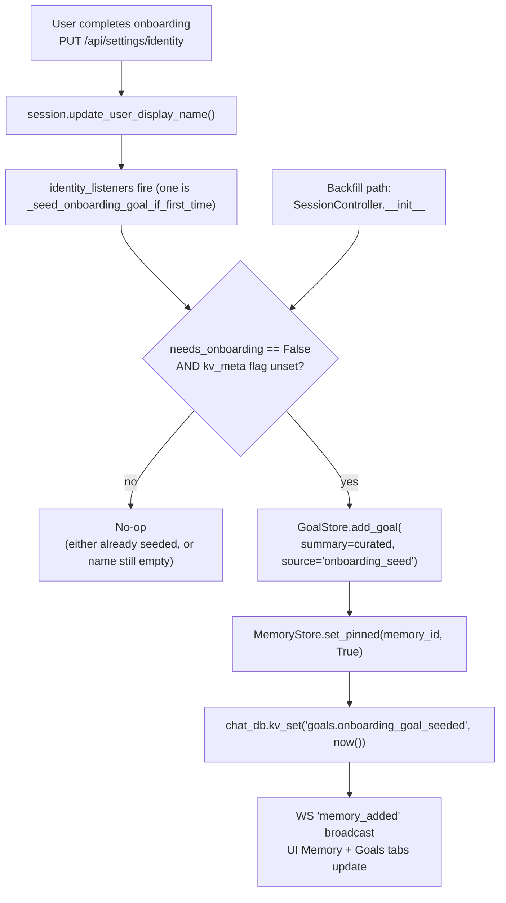

# Shipped — Companion patterns K1–K15

Part of the [shipped log index](../shipped.md). One paragraph per entry; full detail lives in the linked implementation files.

---

## K2. Theory-of-mind / belief tracking (schema v12)

A persistent model of what Aiko *thinks* Jacob believes / feels,
kept separate from the facts she knows. New
[`beliefs`](../../../app/core/infra/chat_database.py) table (schema v12) holds
two shapes in one store, distinguished by the `kind` column:
`mood` beliefs carry numeric `valence` / `arousal` so the gap
detector can compare directly against the live
[`AffectState`](../../../app/core/affect/affect_state.py), and `opinion`
beliefs hold a free-text predicted state ("rust is overhyped"). The
[`BeliefStore`](../../../app/core/relationship/belief_store.py) wraps it with
`upsert` (dedupes by `(user_id, kind, topic)` plus topic-embedding
cosine ≥ 0.88) / `list_active` / `mark_contradicted` /
`mark_confirmed` / `mark_stale` / `delete` / `count_by_status`,
mirroring the F5 store shape.

Two write paths feed the store. The self-tag fast path adds a new
`[[predict:kind:topic:state:confidence]]` grammar to
[`response_text_service.py`](../../../app/core/services/response_text_service.py)
(parsed alongside `[[conflict:...]]`, stripped from chat/TTS,
dispatched in `_post_turn_inner_life`); the
[`BeliefInferenceWorker`](../../../app/core/relationship/belief_worker.py) mines
recent user turns once an hour, privacy-scrubs the transcript via
[`fact_check_privacy.scrub_claim_for_search`](../../../app/core/memory/fact_check_privacy.py),
spends one rate-limited LLM call through a dedicated
[`FactCheckRateLimiter`](../../../app/core/memory/fact_check_rate_limiter.py)
(`state_key="belief_worker.rate_state"`) to extract a JSON array of
`{kind, topic, predicted_state, confidence}` tuples, then upserts
with `source="worker"`. Self-tagged beliefs at higher confidence are
preserved over worker rewrites.

The
[`BeliefGapDetector`](../../../app/core/relationship/belief_gap_detector.py) runs
each post-turn and surfaces mismatches: for each active mood belief
younger than `belief_recent_window_hours` (default 24h), it
flips the row to `contradicted` when
`|val_pred - val_obs| > belief_gap_valence_threshold` (default 0.30),
`|aro_pred - aro_obs| > belief_gap_arousal_threshold` (default 0.25),
or the recomputed valence band lands in opposing territory. Opinion
beliefs use
[`conflict_heuristics.classify_pair`](../../../app/core/memory/conflict_heuristics.py)
against the user's recent message — a `definite` heuristic flips to
`contradicted`, a strong Jaccard overlap nudges to `confirmed`, and
beliefs untouched for `belief_stale_after_days` (default 90) bulk-
flip to `stale`. Surfaced gaps render up to two lines into the next
turn's prompt via a new `belief_gaps` inner-life provider
("Your nervous read on tokyo trip isn't matching the live affect.
Name the gap once and gently if it fits, then move on.").

REST endpoints `/api/beliefs` (GET / POST / PATCH / DELETE) in
[`app/web/server.py`](../../../app/web/server.py) back a new Beliefs
sub-tab in
[`SettingsDrawer.tsx`](../../../web/src/components/SettingsDrawer.tsx),
grouped by kind with a per-row gap pulse + filter chips for kind /
status. WebSocket events `belief_added` / `belief_updated` /
`belief_deleted` keep the panel live without polling. Persona
guidance in
[`aiko_companion.txt`](../../../data/persona/aiko_companion.txt)
teaches the `[[predict:...]]` tag and the gentle gap-naming beat.
Tests:
[`tests/test_belief_store.py`](../../../tests/test_belief_store.py),
[`tests/test_belief_worker.py`](../../../tests/test_belief_worker.py),
[`tests/test_belief_gap_detector.py`](../../../tests/test_belief_gap_detector.py),
[`tests/test_web_server_beliefs.py`](../../../tests/test_web_server_beliefs.py),
plus extensions to `tests/test_response_text_service.py`.

---

## K6. Surprise / novelty detector

A per-turn signal that lets Aiko react with real surprise when Jacob
pivots away from the recent topic baseline, instead of accepting an
out-of-the-blue message with the same flat acknowledgement she'd
give a continuation. No new schema, no REST surface — the detector
is in-process and the signal lives entirely in the inner-life
prompt.

The [`NoveltyDetector`](../../../app/core/conversation/novelty_detector.py) keeps an
in-memory `collections.deque[np.ndarray]` of size `novelty_window`
(default 12) on each `SessionController`. On the first `detect()`
call per session it lazily warms the ring from
[`RagStore.list_recent_user_vectors`](../../../app/core/rag/rag_store.py)
filtered by the current user prefix (`session_id` starts with
`{user_id}:`) so a topic genuinely discussed yesterday won't re-fire
"this is new" today. On every turn it embeds `user_text`
synchronously via the shared `Embedder`, computes
`distance = 1 - cosine(vec, centroid)` against the renormalised mean
of the ring, and classifies into two bands:
`distance >= novelty_strong_threshold` (default 0.55) -> `strong_novelty`,
`>= novelty_mild_threshold` (default 0.35) -> `mild_shift`,
otherwise silent. The current vector is appended to the ring on
every call (silent / banded / cooldown) so the baseline keeps
moving with the conversation. After a hit the detector enters a
`novelty_cooldown_turns` suppression window (default 2) so a run of
genuinely-novel turns doesn't pile "you keep saying surprising
things" beats on top of each other. A short (`< 8` chars) text or a
ring still below `novelty_warmup_min` (default 3) returns `None`
silently — cold-start installs don't blare novelty on their first
three turns.

The signal surfaces through a new `novelty` inner-life provider on
[`PromptAssembler`](../../../app/core/session/prompt_assembler.py) (same shape
as `knowledge_gaps`: takes the live `user_text`, called inside
`assemble_with_budget`, dropped under `aggressive=True`). The
provider's banded copy lands in the system prompt right after
`belief_gaps_block`, before `knowledge_gaps_block`, clustering all
"things on Aiko's mind" cues together. Persona guidance in
[`aiko_companion.txt`](../../../data/persona/aiko_companion.txt)
("Surprise and novelty") teaches Aiko to acknowledge the pivot
once with the mild band and to ask a real follow-up with the strong
band, without performing surprise when no note is present.

Settings live on `AgentSettings` (`novelty_detection_enabled`,
master switch) and `MemorySettings`
(`novelty_window`, `novelty_warmup_min`,
`novelty_mild_threshold`, `novelty_strong_threshold`,
`novelty_cooldown_turns`), mirrored in
[`config/default.json`](../../../config/default.json). The detector
module logs one INFO line per turn
(`novelty-detector: distance=%.3f band=%s window=%d user=%s`)
plus a one-shot
`novelty-detector: warmed ring=N user=X` on the first detect of a
session — both grep-friendly via MCP `tail_logs(module_contains="novelty")`.

Tests: [`tests/test_novelty_detector.py`](../../../tests/test_novelty_detector.py)
(cold start / warm prefill / band classification / cooldown / ring
maxlen / short-text skip / lazy warm called-once / warm failure
fallback), plus extensions to
[`tests/test_prompt_assembler.py`](../../../tests/test_prompt_assembler.py)
(novelty block lands, silent when empty, dropped under aggressive,
exceptions swallowed) and
[`tests/test_rag_store.py`](../../../tests/test_rag_store.py)
(role + session-prefix filtering, recency order, limit, empty
result, empty-prefix matches all users).

---

## K3. Routine / ritual awareness

Second pass inside the same `ScheduleLearner` that names recurring
slots ("Sunday-morning chats", "Friday-evening wind-downs") and
writes them into a new `routines` field on `UserProfile`. Where G2
counts total volume per `(daytype, bucket)`, K3 counts *distinct
ISO weeks* per `(weekday, bucket)` so a slot only qualifies once
it has actually recurred across multiple weeks (default: ≥3
distinct weeks AND ≥30% of the rolling window). Naming is
deterministic via a 28-entry `_RITUAL_LABELS` dict (Mon-Sun × 4
hour-buckets); the rendered phrase is comma-joined, capped at 240
chars to fit `ProfileEntry.value`, and idempotent (re-detection of
the same slot short-circuits the upsert). Confidence is the max
recurrence density across chosen cells. Surfacing is passive: the
field joins the rendered profile block alongside `usual_hours`,
and a persona note in
[`aiko_companion.txt`](../../../data/persona/aiko_companion.txt)
teaches Aiko to lean into a matching rhythm only when the moment
actually fits — never as a list, never as a calendar reminder.
Settings:
[`AgentSettings.routine_detection_enabled`](../../../app/core/infra/settings.py)
plus `MemorySettings.routine_min_touches` /
`routine_min_share` / `routine_max_active`. Tests:
`tests/test_schedule_learner.py::RoutineDetectionTests` plus a
`PROFILE_FIELDS` assertion in `tests/test_user_profile.py`.

---

## K13. Stylometric mirror (Jacob-side typing register)

The user-side half of the two-sided style loop. The anti-rut layer
(above) measures Aiko's own style and tells her to *vary*; K13
measures Jacob's style and tells her *which way* to vary. The
persona has always said "match their register" -- before this layer
that was only ever observed in the live ~10-turn history window so
the register reset every session. K13 anchors it persistently across
days. New file:
[`app/core/persona/style_signal.py`](../../../app/core/persona/style_signal.py).

Five-axis rolling-window analyzer mirroring K6/K18 -- pure deque
plus a few regex scans, no embedder, no LLM. Each axis is normalised
to ``[0, 1]`` per turn and averaged across the window:

* **terseness** -- `1.0 / (1.0 + words / 8.0)` (smooth saturating
  function, high = terse, low = chatty)
* **formality** -- starts capital + ends with sentence-final
  punctuation, half-credit each
* **emoji density** -- emojis-per-word, capped at 1.0 (regex covers
  the common Unicode pictograph ranges)
* **slang density** -- closed-list casual markers per word
  (yeah/lol/idk/wanna/gonna/...) lower-cased, word-boundary matched
* **question rate** -- 1.0 when the turn ends with `?`, else 0.0

Bucketed labels (`terse` / `chatty` / `formal` / `casual` /
`emoji-heavy` / `slang-heavy` / `asks back often`) feed the prompt
block:

```
How Jacob writes lately: terse, casual, asks back often, slang-heavy.
```

Empty during warmup (< 8 user turns recorded) or when every axis
sits in the deadzone -- which is the no-signal default, so the
block costs zero on a neutral-register speaker. Unlike the K6/K18/
anti-rut cues this block is **always rendered**, including in
aggressive-mode budget pressure -- register shaping is the first
thing aggressive mode wants to preserve.

Persistence is a single JSON blob keyed by `user_id` in a new
`user_style_signal` table (`CREATE TABLE IF NOT EXISTS` migration --
no column changes needed to extend the schema later). Mirrors the
[`UserProfileStore`](../../../app/core/infra/user_profile.py) pattern via the
new [`StyleSignalStore`](../../../app/core/persona/style_signal.py). On boot
[`SessionController`](../../../app/core/session/session_controller.py) eagerly
loads the persisted blob so the rolling window survives restart;
the lazy `warm_from_history` runs on the very first post-turn record
only when the persisted blob was empty (fresh install) so we don't
do a DB scan when we already have state.

Wiring follows the K6/K18 idiom:
[`InnerLifeProvidersMixin._render_style_signal_block`](../../../app/core/session/inner_life_providers_mixin.py)
reads `analyzer.current_signal()` + `analyzer.labels_for_signal()` and
renders the line; the new `style_signal` slot on
[`PromptAssembler.set_inner_life_providers`](../../../app/core/session/prompt_assembler.py)
clusters the block right after `profile_block` (it's a stable user
fact, not a per-turn cue);
[`PostTurnMixin._post_turn_inner_life`](../../../app/core/session/post_turn_mixin.py)
feeds `analyzer.record_user_turn(user_text)` and UPSERTs the blob
each turn. Persona pairing -- new "How they write" subsection in
[`data/persona/aiko_companion.txt`](../../../data/persona/aiko_companion.txt)
explains the cue (terse/chatty/casual/formal/slang/emoji/question)
and the match-don't-narrate rule; sits next to "Reading {user_name}"
since they're sibling concepts (live affect cue vs stable typing
register). All thresholds live on
[`AgentSettings`](../../../app/core/infra/settings.py) (`style_signal_*`) and
in [`config/default.json`](../../../config/default.json).

Optional debug tool: a new
[`get_style_signal()`](../../../app/mcp/server.py) MCP tool returns the
live snapshot (per-axis means, current labels, rendered string,
warmup state, window size) for live inspection during testing.

Tests:
[`tests/test_style_signal.py`](../../../tests/test_style_signal.py) (35
cases) covers per-axis feature extraction, bucketing edges (deadzone,
at-threshold), warmup gate, window roll, cross-session warm
idempotency, warm-from-history vs sequential equivalence, persistence
round-trip including malformed-row handling, the `StyleSignalStore`
SQLite UPSERT round-trip, the no-settings-stub path, and the render
copy / empty-cases.

---

## K7 + K17 + K8. Noticing-and-repair (forgetting / clarification / rupture)

Three small detectors, each independently revertable, that together
make Aiko sound less like a "perfect-recall, perfect-comprehension,
perfectly-attuned" assistant and more like a person who notices when
she's missed a beat.

### K7. Forgetting protocol — `(faded)` suffix

Stamps `memory_tier` on
[`RagHit`](../../../app/core/rag/rag_store.py) during retrieval (joined from
the SQLite mirror where the score offset is already applied), then
[`RagRetriever.format_block`](../../../app/core/rag/rag_retriever.py)
appends `(faded)` next to `(uncertain)` / `(curiosity)` for any hit
whose tier is `archive`. The persona "Memory" section reads the
suffix as a soft hedge ("I think you said something about X once,
ages ago — am I getting that right?") rather than a flat assertion.
Composes with the existing low-confidence cue: an archived shaky
claim now reads as `(uncertain) (faded)`, two reasons to hedge.
Tests in
[`tests/test_rag_retriever_scoring.py`](../../../tests/test_rag_retriever_scoring.py)
cover all four tier buckets plus the compose-with-`(uncertain)`
ordering.

### K17. Clarification-repair — "you missed his last point"

New [`app/core/conversation/clarification_detector.py`](../../../app/core/conversation/clarification_detector.py).
Per-turn regex classifier with two bands:

- **`strong`** — explicit corrections like "no that's not what I
  meant", "you misunderstood", "I meant X not Y", "wait no", "that's
  not it", "missing the point". The user is visibly steering.
- **`mild`** — softer confusion: "huh?", "wait what", "what do you
  mean", "I don't follow", "I'm confused", "doesn't make sense".

False-positive guardrails: bare "no" doesn't fire (no structural
context), "uh huh" doesn't fire (the `huh` pattern requires a `?`),
"I meant well" doesn't fire (the "I meant X not Y" pattern requires
an actual `not`). The detector returns a
`ClarificationResult(band, evidence)` where `evidence` is the
matched phrase (capped at 80 chars) so the LLM cue can quote what
tripped the detector.

[`PostTurnMixin._post_turn_inner_life`](../../../app/core/session/post_turn_mixin.py)
runs the regex right after the K4 dialogue-act tagger and stashes a
hit on `SessionController._pending_clarification`.
[`InnerLifeProvidersMixin._render_clarification_block`](../../../app/core/session/inner_life_providers_mixin.py)
consumes the slot on the next turn and clears it — sticky cues are
worse than missing cues here, so a render exception still resets.
[`PromptAssembler`](../../../app/core/session/prompt_assembler.py) gets a new
`clarification` provider slot whose block lands in `system_parts`
right after `belief_gaps_block` and above novelty / stagnation /
style_pattern; if she missed the point, she should re-read first
and react second. NOT gated on aggressive mode (a "you missed his
point" cue is exactly what aggressive mode wants to keep).

### K8. Affect rupture-and-repair — "their mood just dipped"

New [`app/core/affect/affect_rupture_detector.py`](../../../app/core/affect/affect_rupture_detector.py).
Cheapest possible detector: subtract two scalars and reaction-
filter. Computes `prior_valence - current_valence` from the
existing pre/post snapshots
[`PostTurnMixin._post_turn_inner_life`](../../../app/core/session/post_turn_mixin.py)
already takes around `AffectUpdater.apply_turn`. Fires when:

1. The drop exceeds `rupture_valence_drop_threshold` (default 0.12 —
   the `AffectUpdater._ALPHA = 0.35` smoothing means a per-turn
   change of ≥0.12 is a real shift, not noise), AND
2. Aiko's last reaction was *not* in `DEFAULT_EXCLUDED_REACTIONS`
   (`concerned`, `gentle`, `sad`, `calm`, `thoughtful`, `quiet`).
   These are reactions to *existing* bad news, where a valence drop
   is the user's pre-existing state surfacing — not a beat that
   landed wrong. Filtering them prevents the false-positive loop
   where Aiko apologises for being empathetic.

Same one-shot pattern as K17 / K2: detector → `_pending_rupture`
slot → next-turn provider clears. The block lands in `system_parts`
right after `clarification_block` so all the noticing cues cluster
together; if both fire on the same turn (a confused user whose
mood also dipped), K17 tells Aiko what to fix while K8 tells her
how to soften.

### Persona

Single new "When you missed the beat" section in
[`data/persona/aiko_companion.txt`](../../../data/persona/aiko_companion.txt),
positioned right after "Style patterns I'm in" so all the
"Heads-up: ..." cue families cluster in the same neighbourhood. Three
flavours covered (strong K17 / mild K17 / K8) with a shared anti-
spiral rail: "don't narrate the cue, don't say 'the system told me
you're upset', and don't loop on the apology". K7's hedge rule
lives in the existing Memory section right next to the
`(uncertain)` rule.

### Settings

All three layers gate on
[`AgentSettings`](../../../app/core/infra/settings.py): `clarification_repair_enabled`
(default `true`), `rupture_repair_enabled` (default `true`),
`rupture_valence_drop_threshold` (default `0.12`). K7 has no
toggle — it's a render-layer addition that costs zero on rows
that aren't archive-tier. Mirrored in
[`config/default.json`](../../../config/default.json).

### Tests

- [`tests/test_rag_retriever_scoring.py`](../../../tests/test_rag_retriever_scoring.py)
  +5 K7 cases (24/24 pass; 95/95 across the surrounding rag/memory
  suites).
- [`tests/test_clarification_detector.py`](../../../tests/test_clarification_detector.py)
  30 cases covering 10 strong patterns, 7 mild patterns, 7 false-
  positive guardrails, strong-beats-mild composition, evidence trim,
  and the render output for both bands.
- [`tests/test_affect_rupture_detector.py`](../../../tests/test_affect_rupture_detector.py)
  22 cases covering 5 firing scenarios, 7 excluded-reaction
  guardrails (incl. uppercased / custom override), 7 no-fire
  cases (no drop / drop-below-threshold / None inputs / zero-or-
  negative threshold disable), the default excluded-set sanity
  check, and render copy.

Full pytest run: 1879/1880 pass; the single failure is the pre-
existing `test_knowledge_gap_extractor.TestPickRelevant` flake
(deterministic-embedder hash collision under full-suite parallel
hash randomisation; passes in isolation).

## K14. Implicit engagement signals (latency + length)

New [`app/core/affect/engagement_tracker.py`](../../../app/core/affect/engagement_tracker.py).
Per-turn detector that scores Jacob's reply latency + message length
against rolling baselines and routes the signal to two consumers
depending on which mode the turn ran in:

- **Voice mode**: latency + length contribute to a small
  `closeness_delta` that rides into
  [`RelationshipAxesUpdater.apply_turn`](../../../app/core/relationship/relationship_axes.py)
  via the new `engagement_delta` kwarg (clamped to
  `engagement_closeness_delta_max=0.04` so the reaction-tag /
  moment-vibe / milestone channels still dominate inside the existing
  `_MAX_DELTA=0.08` per-axis cap).
- **Typed mode**: latency is intentionally **NOT** consumed as
  engagement — per Jacob's design feedback, a typed pause is thinking
  time, not disengagement. Length is the only signal that participates
  in the per-turn `closeness_delta`. Latency instead populates
  `absence_seconds` when the gap lands in the configured band
  (`engagement_absence_curiosity_min_seconds` ≤ gap <
  `resume_opener_min_hours × 3600`, default 30 min – 4 h), which feeds
  the one-shot **absence-curiosity** inner-life cue on the next user
  turn (Aiko welcomes them back warmly without commenting on the
  gap). A typed turn whose label scores as `"abandoned"` (steep
  latency *and* curt message — only possible when voice mode mixed in)
  also suppresses the typed proactive nudge via a new gate in
  [`SessionController._is_typed_proactive_eligible`](../../../app/core/session/session_controller.py).

Latency baseline lives in a small `collections.deque` (voice-only —
typed turns never touch the latency window); length baseline is
shared with K13's stylometric mirror via the new
`StyleSignalAnalyzer.recent_word_counts()` method so we don't pay a
second rolling buffer. The tracker is constructed once in
`SessionController.__init__` and called from the post-turn pipeline
[`PostTurnMixin._post_turn_inner_life`](../../../app/core/session/post_turn_mixin.py)
*after* the K13 `record_user_turn` (so the K13 window is current)
and *before* the axes updater (so `closeness_delta` rides in the
same `apply_turn` call).

Each turn emits one structured INFO log line for the
[`app.engagement`](../../../app/core/affect/engagement_tracker.py) logger
(grep-friendly via `tail_logs(module_contains="engagement")`):

```
engagement: mode=live label=engaged delta=+0.0231 latency_s=2.10 length_z=+1.45 warmed=True
```

Plus a new persona section "When they've been away a while (typed
mode)" in [`data/persona/aiko_companion.txt`](../../../data/persona/aiko_companion.txt)
teaching the receive shape (welcome warmth, never "where were you?").

### Settings (all live under `agent.*`)

`engagement_tracker_enabled` (default `true`), `engagement_window`
(`12`), `engagement_warmup_min` (`6`),
`engagement_latency_z_strong_drop` (`1.5`),
`engagement_length_z_strong_drop` (`-1.0`),
`engagement_closeness_delta_max` (`0.04`),
`engagement_absence_curiosity_enabled` (`true`),
`engagement_absence_curiosity_min_seconds` (`1800.0`),
`engagement_proactive_gate` (`true`). Full docs in
[`docs/configuration.md`](../../configuration.md#k14--implicit-engagement-signals-latency--length).

### MCP

`get_engagement_state()` returns the most recent `EngagementResult`,
the voice latency window snapshot, the cached `_last_engagement_label`
and `_pending_absence_seconds` slots, and the live mood-shell tilt
(see K5 below). Useful for chasing "why didn't the absence cue fire?"
reports.

### Tests

- [`tests/test_engagement_tracker.py`](../../../tests/test_engagement_tracker.py)
  20 cases covering cold-start warmup, voice vs typed mode routing,
  per-turn delta cap, label banding, latency-window maintenance, and
  the absence-curiosity band edges (in / out / above resume
  threshold / disabled-setting / voice-mode never populates).
- [`tests/test_relationship_axes.py`](../../../tests/test_relationship_axes.py)
  +3 cases for `engagement_delta` (positive nudges closeness up,
  negative nudges down, combined with milestone respects the global
  `_MAX_DELTA` cap).
- [`tests/test_session_controller_typed_proactive.py`](../../../tests/test_session_controller_typed_proactive.py)
  +3 cases for the new abandoned-label gate (blocks eligibility, other
  labels pass through, setting-off ignores the label).
- [`tests/test_style_signal.py`](../../../tests/test_style_signal.py)
  +1 case for the new `recent_word_counts()` exposure.
- [`tests/test_prompt_assembler.py`](../../../tests/test_prompt_assembler.py)
  +3 cases for the absence-curiosity provider (lands in system prompt,
  silent when empty, survives aggressive mode).

## K5. Mood shell tilt (only-when-notable)

New [`app/core/affect/mood_shell.py`](../../../app/core/affect/mood_shell.py). Per-turn
one-line emotional directive derived from the live
[`AffectState`](../../../app/core/affect/affect_state.py) (valence + arousal)
and [`RelationshipAxesState`](../../../app/core/relationship/relationship_axes.py)
(closeness / humor / trust / comfort). Output reads like a stage
direction — *"Lean affectionate and unhurried; let warmth show."* /
*"Stay playful and quick; the room is laughing."* / *"Slow your
tempo; let the words land before pushing forward."* — and colours
Aiko's delivery (pacing, sentence length, warmth, word choice)
**without** dictating content.

The pure-function `derive_mood_shell(affect, axes)` bands the
valence/arousal grid into eight cells (`pos_high` / `pos_mid` /
`pos_low` / `neg_high` / `neg_mid` / `neg_low` / `neu_high` /
`neu_low` — the neutral-mid cell is intentionally absent, that's
"default Aiko") and picks a dominant relationship axis (the axis with
the largest absolute value crossing
`mood_shell_axis_threshold=0.5`, mirroring the existing
`relationship_axes._NOTABLE_THRESHOLD`). A static `_TILT_RULES` table
maps `(band, axis_or_None)` → `(tilt_name, line)`; first match wins,
with `(band, None)` fallback rules below the `(band, axis)` rules.
Returns `None` on the common turn (neutral-mid affect or no notable
axis crossing AND no useful fallback band) so the block is empty
most of the time.

Surfaces through a new `mood_shell` inner-life provider on
[`PromptAssembler`](../../../app/core/session/prompt_assembler.py), registered
alongside the existing `relationship` / `axes` / `arc` cluster. Lands
in `system_parts` right after the `axes_block` because mood-shell
derives FROM the same axes the assistant just read. Part of the K16
`replace` suppression set (the unified grounding line subsumes the
same tonal surface area); kept active in `split` and `off` modes.
Persona guidance lives in the new "Tone shell" section of
[`data/persona/aiko_companion.txt`](../../../data/persona/aiko_companion.txt),
which explicitly teaches Aiko: never quote the line, never narrate
it, never apologise for shifting tone — the shell is hers to inhabit,
not theirs to read about.

### Settings

`agent.mood_shell_enabled` (default `true`),
`agent.mood_shell_axis_threshold` (default `0.5`, clamped `[0, 1]`).
Full docs in [`docs/configuration.md`](../../configuration.md#k5--mood-shell-tilt).

### MCP

Folded into the same `get_engagement_state()` tool as K14: the
returned JSON carries a `mood_shell` block with `tilt`, `line`,
`contributors` (which inputs fired the rule), and `rendered`
(`Tone shell: ...`) — or `null` when nothing notable crosses.

### Tests

- [`tests/test_mood_shell.py`](../../../tests/test_mood_shell.py)
  14 cases covering band classification (neutral-mid returns None,
  no-affect returns None, disabled flag returns None), dominant-axis
  selection (below-threshold ignored, largest-absolute wins,
  `require_axis=True` short-circuits), tilt rule lookup priority for
  all eight affect bands, and the rendered `Tone shell:` block.
- [`tests/test_prompt_assembler.py`](../../../tests/test_prompt_assembler.py)
  +4 cases for the mood_shell provider (lands in system prompt, silent
  when empty, dropped under K16 `replace` mode, survives K16 `split`
  mode).

Full pytest run after K5+K14: 1971/1971 pass.

## K1. Long-term goals tracker (goal + goal_progress kinds, GoalStore + GoalWorker)

Aiko now carries her own sustained long-term goals across sessions —
the things she wants to grow into / explore / get better at — distinct
from the agenda (TODOs the user gave her) and from one-shot self-
memories. Two new memory kinds (`goal` + `goal_progress`) on the
existing tier ladder, a dedicated facade
[`GoalStore`](../../../app/core/goals/goal_store.py), an idle worker
[`GoalWorker`](../../../app/core/goals/goal_worker.py) that bootstraps the
initial ring and reflects on goals during quiet windows, an inner-life
prompt block, an inline `[[goal:summary]]` self-tag, four agent tools,
a small RAG goal-alignment bonus, and a Memory-tab panel.

### Storage

`MemoryStore.VALID_KINDS` gains `goal` and `goal_progress`. A `goal`
row carries `{summary, added_at, last_reflected_at, last_reflection_id,
last_progress_note, reflection_count, archived_at, source}` in
`metadata`; a `goal_progress` row carries `{goal_id, note, noted_at,
source}` and the goal row's `last_progress_note` field is mirror-
updated on every successful reflection so prompt rendering stays cheap
to one SQLite read. Goals are always seeded onto the `long_term` tier
(never `scratchpad`) so they survive the decay sweep. `GoalStore`
enforces the per-user `goal_max_active` cap by archiving the oldest
un-pinned active goal on overflow (history preserved); progress rows
are capped per-goal via `goal_max_progress_per_goal` with FIFO
eviction.

### Worker

`GoalWorker` registers with the existing
[`IdleWorkerScheduler`](../../../app/core/proactive/idle_worker_scheduler.py) and
runs at the configured cadence (default hourly). Two branches in
`run()`:

- **Bootstrap** — when `goal_store.has_any_active()` returns `False`,
  the worker fires a single LLM call against the persona file +
  rolling summary asking for ~3 candidate goals and writes the
  survivors to the store with `source='worker_bootstrap'`. Gated by
  `agent.goal_worker_bootstrap_enabled`; flip off to seed manually.
- **Reflection** — picks the oldest-touched active goal via
  `GoalStore.pick_for_reflection()`, loads its existing reflection
  history, and fires a single LLM call asking for one short fresh
  reflection note. Writes the note as a `goal_progress` row and
  mirrors it into the parent goal's `metadata.last_progress_note`.

Both branches are rate-limited via a dedicated
[`FactCheckRateLimiter`](../../../app/core/memory/fact_check_rate_limiter.py)
with `state_key='goal_worker.rate_state'` so a chatty session can't
blow past `agent.goal_worker_per_hour_cap` / `_per_day_cap`. The
cancel event is the same shared `fact_check_cancel` flag used by F1
and the belief worker so a graceful shutdown stops the in-flight
LLM call cleanly.

### Prompt block

A new `goals` inner-life provider on
[`PromptAssembler`](../../../app/core/session/prompt_assembler.py) renders the
active goals as an "Aiko's quiet long-term goals" bullet list with an
optional `(recent: ...)` sub-line under the most-recently-reflected
goal. Lands in `system_parts` right after `agenda_block` and before
`belief_gaps_block`, clustering with the other inward-facing context
beats. Dropped in the assembler's `aggressive` (token-pressure) mode
the same way agenda + belief_gaps are. Persona guidance ("Your quiet
long-term goals" in
[`aiko_companion.txt`](../../../data/persona/aiko_companion.txt))
explicitly teaches Aiko: this is private context, never recite the
header, weave references in as first-person asides at most once per
conversation, let unwanted goals drift rather than "closing" them.

### Self-tag fast path

Aiko can declare a new long-term goal mid-turn with the inline
`[[goal:short summary]]` tag. Parsed in
[`response_text_service.py`](../../../app/core/services/response_text_service.py)
(stripped from chat + TTS), extracted in
[`session/post_turn_mixin.py`](../../../app/core/session/post_turn_mixin.py)
and dispatched to `GoalStore.add_goal(source='self_tag')`. Logged as
`K1 self-flag: aiko declared N goal(s)` for grep-friendly tracing.

### Agent tools

Four tools registered by `SessionController.rebuild_tool_registry`
under the `tools.goals` switch (see
[`app/llm/tools/goals.py`](../../../app/llm/tools/goals.py)):

- `list_goals` — read-only, returns active goals with their ids.
- `add_goal` — alternative path to the self-tag for when the LLM
  prefers a tool call.
- `update_goal_progress` — appends a reflection note to a specific
  goal (when the conversation surfaces it).
- `archive_goal` — retires a goal (history preserved).

### RAG bonus

[`RagRetriever`](../../../app/core/rag/rag_retriever.py) gains a small
`_RAG_GOAL_ALIGNMENT_BOOST=+0.04` applied to memory hits whose
embedding cosines above `_RAG_GOAL_ALIGNMENT_THRESHOLD=0.55` against
any active goal vector. Skips the goal / goal_progress rows themselves
so the cosine signal doesn't compound on top of the bonus. `set_goal_store`
allows the wiring to happen after the retriever is constructed (the
goal store is built later in the boot sequence).

### REST + frontend

- `POST /api/goals/run` triggers one `GoalWorker.run()` (cooperative
  with the rate limiter).
- The Memory tab's new "Long-term goals" sub-panel
  ([`GoalsPanel.tsx`](../../../web/src/components/settings/memory/GoalsPanel.tsx))
  lists active goals with their most recent reflection note, exposes a
  "show archived" toggle, and a "reflect now" button hitting the REST
  endpoint.
- `MEMORY_KINDS` (`web/src/types.ts`) gains `goal` + `goal_progress`
  so the existing kind filter in the Memory tab works against the new
  rows.

### MCP

Two new debug tools in [`app/mcp/server.py`](../../../app/mcp/server.py):

- `get_goals_state()` — full snapshot: settings (caps + cadence),
  every active goal with its `reflection_count` / `last_reflected_at`
  / `last_progress_note` / `progress_rows` count, plus the
  `next_reflection_candidate` slot showing which goal the worker
  would pick next.
- `force_goal_worker()` — bypasses the idle/interval gate but still
  consults the rate limiter.

### Settings

- `agent.goals_enabled` (default `true`), `agent.goal_worker_bootstrap_enabled`
  (default `true`), `agent.goal_worker_per_hour_cap` (default `3`),
  `agent.goal_worker_per_day_cap` (default `12`).
- `memory.goal_max_active` (default `5`), `memory.goal_max_progress_per_goal`
  (default `12`), `memory.goal_reflection_interval_seconds` (default `3600`).
- `tools.goals` (default `true`).

Full docs in [`docs/configuration.md`](../../configuration.md#k1--aikos-long-term-goals)
and the memory-tab thresholds section.

### Tests

- [`tests/test_goal_store.py`](../../../tests/test_goal_store.py) — tag
  extraction, add/archive/unarchive lifecycle, summary updates,
  overflow archiving (with pinned-immunity), per-goal progress
  pruning, reflection picking by oldest-touched, `pick_relevant`
  cosine, and `active_goal_vectors`.
- [`tests/test_goal_worker.py`](../../../tests/test_goal_worker.py) —
  cold-start bootstrap path, reflection path, rate-limiter
  integration, `is_ready` predicate, cancellation handling, disabled
  flag short-circuit.
- [`tests/test_goal_tools.py`](../../../tests/test_goal_tools.py) — each
  of the four agent tools' happy + error paths, plus the
  `build_goal_tools` factory order.
- [`tests/test_rag_retriever_goal_alignment.py`](../../../tests/test_rag_retriever_goal_alignment.py) —
  aligned hit gets the bonus, unaligned hit doesn't, goal rows are
  excluded from compounding, missing goal store disables the bonus.
- [`tests/test_response_text_service.py`](../../../tests/test_response_text_service.py)
  gains `GoalTagTests` for the `[[goal:...]]` parser.
- [`tests/test_prompt_assembler.py`](../../../tests/test_prompt_assembler.py)
  gains cases for the `goals` provider slot (lands in system prompt,
  silent when empty, dropped under `aggressive=True`).

### K1 follow-up — first-run onboarding goal seed

Aiko's first long-term goal shouldn't be a coin-flip of whatever
the LLM bootstrap proposes against an empty persona. When the user
completes onboarding (sets their `user_display_name` for the first
time via `PUT /api/settings/identity`), the controller seeds exactly
one curated, **pinned** goal:

> Get to know {user_name}. Pay attention to what they care about —
> what they're building lately, what wears them down, what makes
> them laugh, the rhythms of their weeks. Not by interrogating, but
> by noticing across many small turns. This goal never finishes;
> the point is to keep listening.

That single seeded row **tripwires the LLM bootstrap**:
`GoalWorker._run_bootstrap` short-circuits when
`GoalStore.has_any_active()` is `True`, so the existing empty-store
bootstrap pass never fires. Aiko picks up additional goals
organically through `[[goal:...]]` self-tags during real
conversation instead of from a cold-start LLM proposal that has no
signal to work with.

#### Decision flow



The two entry paths converge on the same idempotent gate so the
seed runs exactly once across (a) the boot of an existing user whose
name was already set before this feature shipped, and (b) the first
onboarding completion of a brand-new user.

#### Design choices

- **Pinned by default.** Pinned rows survive `prune_overflow` AND
  don't count against `memory.goal_max_active=5`, so the durable
  "get to know" goal never crowds out the active ring as Aiko
  collects new goals from conversation.
- **`metadata.source="onboarding_seed"`.** Distinguishable from
  `self_tag` / `worker_bootstrap` / manual REST writes in
  introspection, tests, and the Memory drawer.
- **One-shot via `kv_meta`.** Once
  `goals.onboarding_goal_seeded` is set, the seed never re-fires —
  even if Jacob deletes the goal afterwards. User agency over the
  goal ring wins over guaranteed presence.
- **Reflection cadence unchanged.** `GoalWorker._run_reflection`
  picks the seeded goal up on its hourly tick like any other goal
  and writes `goal_progress` notes against it. The seeded goal
  doesn't get special-cased downstream.
- **Neutral pronouns.** "What *they* care about", consistent with
  the persona file's existing register.
- **No new settings.** Hardcoded wording (editable in-place via the
  Memory drawer if Jacob wants to refine the framing later).

#### MCP debug tool

- `force_seed_onboarding_goal()` — bypasses the `kv_meta` gate and
  re-runs the seed with `force=True`. Cosine dedupe in
  `MemoryStore.add` may collapse the second insert (returns
  `fired: False` with an explanatory reason); the `kv_meta` flag
  stays set in that case to prevent retries. Use it to validate
  the prompt block + reflection cadence on a "fresh" goal without
  nuking `data/chat_sessions.db`.

#### File-paths summary

- [`app/core/goals/onboarding_goal.py`](../../../app/core/goals/onboarding_goal.py)
  — new pure module: `_ONBOARDING_GOAL_KV_KEY`,
  `_ONBOARDING_GOAL_TEMPLATE`, `seed_onboarding_goal()`,
  `is_onboarding_goal_seeded()`. No state, no embedder, no LLM call.
- [`app/core/session/session_controller.py`](../../../app/core/session/session_controller.py)
  — `_seed_onboarding_goal_if_first_time()` method; backfill call
  + identity-listener registration at the end of `__init__`.
- [`app/mcp/server.py`](../../../app/mcp/server.py)
  — `force_seed_onboarding_goal()` debug tool right after
  `force_sensory_anchor`.
- [`tests/test_onboarding_goal.py`](../../../tests/test_onboarding_goal.py)
  — six unit tests: pinned + correct source on first call, no-op
  on second call, kv_meta flag written, empty-name fallback to
  `friend`, `force=True` bypasses the gate, pinned seed survives
  `prune_overflow` with `max_active=2`.

## K7. Forgetting protocol (graded `(faded)` predicate + persona-rule rewrite)

Half of K7 had been silently shipping for a while: the render-side
`(faded)` suffix in [`RagRetriever.format_block`](../../../app/core/rag/rag_retriever.py)
and a persona rule that told Aiko how to read the tag. The completion
closes the missing low-salience half of the original spec and rewrites
both `(faded)` and `(uncertain)` persona rules to avoid two systematic
failure modes that surfaced in review.

### What was already there

- `(faded)` suffix on archive-tier memory hits, in `format_block`.
- Persona paragraph teaching Aiko to read the tag as a half-remembered
  beat ("I think you said something about X once, ages ago…").
- Tests covering the binary tier branch + composition with
  `(uncertain)` from F3.

### Gap A: signal was binary

The trigger was `tier == "archive"` only. Demotion to `archive`
happens at `memory.archive_demote_idle_days = 180`, so the
30-180 day window between "decayed in place" and "demoted" passed
through with no hedge — a 6-week-old `long_term` row decayed to
`salience = 0.05` read identically to a fresh, sharp memory.

The completion adds a graded predicate
[`_is_faded_memory`](../../../app/core/rag/rag_retriever.py) that fires on:

- `tier == "archive"` — always (unchanged), OR
- `tier in (None, "long_term")` AND `salience < memory.faded_salience_threshold`
  AND idle longer than `memory.faded_idle_days` (computed from
  `last_used_at`, falling back to `created_at` for rows that have
  never been touched).

Scratchpad is intentionally never faded: that tier already has its
own lifecycle (TTL prune, promotion lift) and conflating "raw new
observation" with "old half-forgotten" muddies two different signals.

`format_block` now passes the three settings down from the
`RagRetriever` instance; the static signature gains optional kwargs
with safe defaults so existing test call sites keep working. The
`RagRetriever.block_for` instance wrapper and the speculative
[`RagPrefetcher`](../../../app/core/rag/rag_prefetcher.py) both thread the
instance settings through.

### Gap B: persona rules were going to tic

Two failure modes review caught in the existing persona wording:

1. **Verbatim trap.** The `(faded)` rule gave two literal sample
   phrases ("I think you said something about X once, ages ago — am I
   getting that right?" / "wait, didn't you mention X way back?").
   LLMs latch onto literal example phrases hard — Aiko would start
   opening half her replies with "ages ago" and the hedge would
   harden into a tic.
2. **Always-on trap.** Neither `(faded)` nor `(uncertain)` had the
   "permission, not obligation" guard that the sibling `(curiosity)`
   rule has ("Don't force it; only mention when it actually lands").
   So every faded/uncertain retrieval triggered a hedge even when the
   memory wasn't relevant to what Aiko was actually answering.

Both rules in [`data/persona/aiko_companion.txt`](../../../data/persona/aiko_companion.txt)
were rewritten to:

- Strip every verbatim sample phrase a smaller LLM could parrot. The
  register is described (half-remembered, tentative, willing to be
  corrected) but the actual words have to be Aiko's.
- Add the explicit **permission, not obligation** guard. If the
  tagged memory isn't relevant to the current reply, the rule
  explicitly tells Aiko to let it pass through silently.
- For `(faded)` specifically, add an anti-tic clause naming
  "ages ago" / "way back" by name as forbidden two-turns-in-a-row
  openers. This is the same shape of explicit anti-rut rule the
  style-pattern tracker uses for other phrasings.
- Cross-link the two rules ("Same posture as the faded tag…") so
  the persona reinforces the same posture for both hedge cues
  without duplicating prose.

### Settings

Three new knobs under [`MemorySettings`](../../../app/core/infra/settings.py):

- `memory.fade_hedge_enabled` (default `true`) — master kill-switch.
  Off → no `(faded)` suffix ever, including archive-tier.
- `memory.faded_salience_threshold` (default `0.20`, clamped `[0, 1]`)
  — strict `<` against salience.
- `memory.faded_idle_days` (default `30`, min `1`) — strict `>`
  against `(now - last_used_at).days`, falling back to
  `created_at` for never-touched rows.

The strict `<` / `>` semantics are documented inline because
flipping to `<=` / `>=` would silently widen the hedge surface to a
new class of rows. Full docs in [`docs/configuration.md`](../../configuration.md#k7--forgetting-protocol).

### Why no MCP tool

The existing
[`set_log_level("app.rag_retriever", "DEBUG")`](../../../app/core/rag/rag_retriever.py)
plus
[`get_last_response_detail`](../../../app/mcp/server.py)
are enough to verify "did this hit get the suffix?" in repro —
adding a dedicated tool for a render-layer signal would be
over-engineered.

### Tests

[`tests/test_rag_retriever_scoring.py`](../../../tests/test_rag_retriever_scoring.py)
`FormatBlockFadedSuffixTests` gains six new cases:

- Low-salience idle long_term row → `(faded)`.
- Recent low-salience long_term row → no suffix (don't fade what
  Aiko just touched).
- High-salience idle long_term row → no suffix (sharp sleeper).
- Master switch off silences every `(faded)` including archive.
- Threshold boundary (`salience == faded_salience_threshold`) does
  NOT fire — locks the strict `<` semantics against accidental flip.
- Missing `last_used_at` falls back to `created_at` (cold rows still
  fade).

The two existing "tier unchanged" tests were updated to set fresh
salience + `last_used_at` so they still assert no suffix under the
new graded predicate. No persona-text test exists in the suite, so
the persona rewrites are not test-asserted byte-for-byte (verified
via grep over `tests/`).

### Filed-paths summary

- [`app/core/rag/rag_retriever.py`](../../../app/core/rag/rag_retriever.py) —
  `_is_faded_memory` helper + `format_block` kwargs + `__init__`
  settings storage + `block_for` threading.
- [`app/core/rag/rag_prefetcher.py`](../../../app/core/rag/rag_prefetcher.py) —
  threads settings through the speculative path.
- [`app/core/infra/settings.py`](../../../app/core/infra/settings.py) — three new
  `MemorySettings` fields + parser entries.
- [`config/default.json`](../../../config/default.json) — three new
  defaults under `memory`.
- [`app/core/session/session_controller.py`](../../../app/core/session/session_controller.py)
  — wires the settings into the `RagRetriever` constructor call.
- [`data/persona/aiko_companion.txt`](../../../data/persona/aiko_companion.txt)
  — rewritten `(uncertain)` and `(faded)` bullets.
- [`docs/configuration.md`](../../configuration.md) — cheatsheet row +
  K7 subsection.

## K-time1. Wall-clock prefixes on chat history

The chat history sent to the LLM on every turn used to be a flat list of `{role, content}` pairs with **no per-message timestamps** — `MessageRow.created_at` was read from SQLite and silently discarded inside `_fit_history`. The `_ambient_block` provider gave the LLM the *absolute* current time ("Sunday, May 31, 1:35 PM") but not the *relative age* of each prior turn.

Observed bug that triggered the work: {user} said "I am drinking my coffee and planning to visit my grandparents in half an hour", and two messages / ~2 wall-clock minutes later, Aiko asked "did you manage to drink that coffee before you left?". She had pattern-matched the future-tense plan as a completed past event because nothing in the prompt told her the conversation was still inside the same five-minute window. The future-tense plan + the absence of a clock against the in-session history is the perfect setup for the most common narrative interpretation: "the plan happened".

K-time1 closes that gap by prefixing every kept history message with a short bracketed relative-age tag:

- `< 60 sec`     → `[just now] {content}`
- `1–59 min`     → `[N min ago] {content}`
- same calendar day, ≥ 1 hour → `[today HH:MM] {content}`
- previous day   → `[yesterday HH:MM] {content}`
- 2–6 days old   → `[Wednesday 18:45] {content}` (day name)
- 7+ days old    → `[May 28 18:45] {content}` (month + day)

The current user message Aiko is replying to is appended *after* the history block by `assemble_with_budget` and never gets a prefix — it represents "right now" so the absence is itself the signal. Token cost is roughly 4–6 tokens per kept history message; the prefix is included in the token-cost accounting inside `_fit_history` so the history budget stays honest.

### Decision flow

```mermaid
flowchart TD
    A[per-turn history rows<br/>MessageRow with created_at] --> B{prefix_enabled?}
    B -- false --> C[byte-identical content<br/>pre-K-time1 behaviour]
    B -- true --> D[_format_age created_at, now]
    D -- "valid ISO" --> E[render '[age]' prefix]
    D -- "unparseable" --> F[skip prefix<br/>raw content survives]
    E --> G[prepend '[<age>] ' to content]
    F --> G
    G --> H[token-cost includes prefix]
    H --> I[fit into history budget]
```

### Architecture

- **Setting**: `agent.history_age_prefix_enabled` (bool, default `true`) in [`app/core/infra/settings.py`](../../../app/core/infra/settings.py); JSON mirror in [`config/default.json`](../../../config/default.json). No clamp needed beyond the `bool(...)` cast.
- **Constructor flag**: `PromptAssembler.__init__` accepts `history_age_prefix_enabled` (default `True` so direct-construction callers keep the new behaviour). [`SessionController`](../../../app/core/session/session_controller.py) reads the setting at boot and threads it through.
- **Age renderer**: `PromptAssembler._format_age(created_at_iso, now)` is a self-contained static helper. Parses `Z`-suffixed and explicit-offset ISO strings; promotes naive `created_at` values to UTC; returns `""` on parse failure so the calling site can fall back to raw content without a crash. Future timestamps (writer-side clock skew) collapse to `"just now"`.
- **History packing**: `_fit_history` now accepts `prefix_enabled` and an optional `now` (defaults to `datetime.now(timezone.utc)`; the parameter exists for deterministic testability). When `prefix_enabled` is true and `_format_age` returns non-empty, the message content is replaced with `"[{age}] {content}"` *before* `estimate_tokens` runs.
- **Persona guard**: the "Wall-clock awareness in the conversation" section in [`data/persona/aiko_companion.txt`](../../../data/persona/aiko_companion.txt) (folded right after the existing "Where you are right now" grounding paragraph) teaches Aiko how to read the prefix, explicitly calls out the "future plan ≠ past event" misread, and forbids quoting the bracket prefix back at {user}.

### What the LLM sees

Before K-time1, a 4-message tail looked like:

```
user: I am drinking my coffee and planning to visit my grandparents in half an hour
assistant: That sounds nice -- enjoy the time with them.
user: bringing them flowers too
assistant: <-- about to generate, has no clock for any of the above
```

After K-time1 (same tail, two minutes later):

```
user: [2 min ago] I am drinking my coffee and planning to visit my grandparents in half an hour
assistant: [1 min ago] That sounds nice -- enjoy the time with them.
user: [just now] bringing them flowers too
assistant: <-- about to generate; can now see the conversation is still inside the planning window
```

### MCP-debuggable

- `get_status` shows `history_age_prefix_enabled` in the settings snapshot.
- The DEBUG `prompt built:` log line from `app.core.session.prompt_assembler` carries the same `history_msgs_out=` count; spot-check one of the rendered messages by enabling that level (`set_log_level("app.core.session.prompt_assembler", "DEBUG")`) and reading the prompt-build payload.
- Tests: `tests/test_prompt_assembler.py::WallClockHistoryPrefixTests` covers all six bands, the disable path (byte-identical content), the unparseable-timestamp degrade, the budget-accounting invariant, and an end-to-end smoke through `assemble_with_budget`.

### Files

- [`app/core/infra/settings.py`](../../../app/core/infra/settings.py) — `AgentSettings.history_age_prefix_enabled` field + matching `bool(agent_raw.get(...))` entry in `load_settings`. Inline comment documents the toggle, the bug it prevents, and the token-cost expectation.
- [`config/default.json`](../../../config/default.json) — `agent.history_age_prefix_enabled: true`.
- [`app/core/session/prompt_assembler.py`](../../../app/core/session/prompt_assembler.py) — adds `timezone` to the datetime import, the constructor flag, `_format_age`, and the `_fit_history` rewrite. The call site inside `assemble_with_budget` passes the flag through.
- [`app/core/session/session_controller.py`](../../../app/core/session/session_controller.py) — reads the setting at boot, threads it to `PromptAssembler(...)`.
- [`data/persona/aiko_companion.txt`](../../../data/persona/aiko_companion.txt) — "Wall-clock awareness in the conversation" section folded into the grounding cluster.
- [`tests/test_prompt_assembler.py`](../../../tests/test_prompt_assembler.py) — `WallClockHistoryPrefixTests` (9 tests).
- [`docs/configuration.md`](../../configuration.md) — cheatsheet row + dedicated "K-time1 — wall-clock prefixes on chat history" subsection.

## K15. Self-disclosure / vulnerability budget

Aiko emits `[[remember:self:...]]` tags whenever something personal lands as worth keeping — a taste she's stating ("I prefer rainy mornings"), a small admission ("I get nervous about that too"), a real soft moment ("it matters to me more than I let on"). Without pacing, the cheapest path for a chatty LLM is to drop tier-3 disclosures every other turn; that reads as oversharing within a session and as cardboard intimacy across days. K15 adds a soft, wall-clock-driven token bucket that paces *how often* a personal note lands, sized by the relationship axes (closeness + trust) and regenerating over time. Critically: the cue surfaces in the prompt but **never blocks the reply**. The persona block teaches Aiko to read the cue but explicitly allows a real moment to override — pacing, not a rule.

### Decision flow



```mermaid
flowchart LR
    subgraph postTurn [Post-turn spend]
        rawText["raw_assistant_text"] --> regex["_SELF_TAG_RE.finditer"]
        regex --> classify["classify_disclosure_tier<br>tier=N: fast-path OR heuristic"]
        classify --> cost["tier_cost<br>1 / 3 / 6 tokens"]
        cost --> applySpend["compute_spend_for_self_tags<br>= apply_decay then add cost"]
    end
    applySpend --> kvWrite["chat_db.kv_set<br>aiko.vulnerability_budget = {spent, last_decay_at}"]
    subgraph nextTurn [Next-turn render]
        kvRead["chat_db.kv_get<br>aiko.vulnerability_budget"] --> decay["apply_decay<br>spent -= regen_per_hour * elapsed_h"]
        decay --> capacity["compute_capacity<br>(closeness + trust) / 2 -> linear interp"]
        capacity --> render["render_inner_life_block<br>ratio -> silent / half / at-cap / over-cap / low-ceiling"]
    end
    kvWrite -.-> kvRead
    render --> sysPrompt["system prompt<br>after self_noticing_block"]
    render --> persona["aiko_companion.txt<br>'Sharing yourself'"]
    mcpTools["spend_vulnerability(tier)<br>reset_vulnerability_budget<br>get_vulnerability_budget_state"] -.-> kvWrite
    mcpTools -.-> kvRead
```

### Three tiers, three costs

The heuristic [`classify_disclosure_tier`](../../../app/core/affect/vulnerability_budget.py) walks a small priority ladder:

1. **Aiko's self-tag fast-path** (`tier=N:` prefix on the body, case-insensitive) — wins outright. Mirrors K2's `[[predict:...]]` convention: the LLM is the most accurate judge of its own intent, so when Aiko knows she's writing a tier-3 line she can declare it and skip the heuristic.
2. **Tier-3 markers** — strong first-person feeling, intensity adverbs, soft-confession patterns: `"more than I let on"`, `"I'm scared"`, `"it matters to me"`, `"deeply love"`, `"softest"`, `"I love (Jacob|him|her|them|you)"`. Any one fires -> tier 3.
3. **Tier-2 markers** — mild admission, honesty frame, low-intensity feeling: `"honestly"`, `"I get nervous"`, `"I worry about"`, `"I struggle with"`, `"I miss"`, `"I care about"`. Any one fires -> tier 2.
4. **Length-based lift** — body ≥ 100 chars with no explicit markers -> tier 2 (someone writing a lot about themselves is usually opening up beyond a preference).
5. **Default** — tier 1.

Costs are configurable but default to **1 / 3 / 6** tokens. A bucket of capacity 12 (the max, both axes at +1) holds two tier-3 disclosures comfortably, three tier-1 + one tier-2 + one tier-3, or 12 tier-1 surface notes before the half-spent cue fires.

### Capacity from relationship axes

[`compute_capacity`](../../../app/core/affect/vulnerability_budget.py) averages `closeness` + `trust` (both in `[-1, 1]`, sourced from [`RelationshipAxesStore`](../../../app/core/relationship/relationship_axes.py)) and linearly interpolates to `[min_cap, max_cap]`. Defaults: `min_cap=1`, `max_cap=12`. Asymmetric axes fold toward the mean (someone you trust but haven't spent much time with reads as midpoint capacity, not max). A brand-new install with no relationship state defaults to neutral (0, 0) -> midpoint -> ~6 tokens of room before the cue fires.

The **low-ceiling override** in `render_inner_life_block` fires when `capacity <= 2` AND `spent > 0`: at that closeness level, even one disclosure is "deep disclosure too early" and gets a different cue ("Closeness with Jacob is still building -- tier-2 / tier-3 disclosures haven't earned their place yet"). Wins over the spent-ratio bands so the relationship-state signal beats the budget-state signal in cold-start territory.

### Rolling-bucket math, lazy decay

Budget regenerates over wall-clock hours (default `0.5 tokens/hour`). [`apply_decay`](../../../app/core/affect/vulnerability_budget.py) is pure: `new_spent = max(0, spent - regen_per_hour * elapsed_hours)`. The provider applies decay on every read and **writes the decayed state back to `kv_meta` only when something actually moved** -- a healthy turn at spent=0 doesn't churn the kv_meta row.

Capacity 12 + 0.5 tokens/hour means:

- One tier-3 spend (6 tokens) regenerates in ~12 hours.
- A full-capacity bucket (12 tokens, three tier-3 disclosures in one session) regenerates in ~24 hours.
- A tier-1 surface note recovers in 2 hours.

The intuition: a real soft moment from yesterday morning is mostly recovered by today; oversharing in one session takes a day to settle.

### Soft enforcement only

The provider's rendered cue is the *only* mechanism. K15 never:

- Suppresses the underlying memory write (the `[[remember:self:...]]` tag still creates a memory row, same as a non-personal `[[remember:...]]`).
- Filters or rewrites Aiko's reply text.
- Caps the spend at capacity (going over is allowed and produces a *stronger* cue next turn -- "you've shared a lot of softness recently").

The persona block ([`data/persona/aiko_companion.txt`](../../../data/persona/aiko_companion.txt)) teaches Aiko four cue shapes (half-spent / at-cap / over-cap / low-ceiling) plus the explicit override clause: *"if something he says lands somewhere real for you, you're allowed to meet it -- you're not a budget calculator, and a moment that's actually happening matters more than a token count."* Pacing, not a rule.

### Architecture

- **Pure module** [`app/core/affect/vulnerability_budget.py`](../../../app/core/affect/vulnerability_budget.py) — frozen `BudgetState` (spent + last_decay_at) and `ClassifiedTier` (tier + reason) dataclasses, the `_SELF_TAG_RE` regex (matches `_REMEMBER_TAG_RE` in `turn_runner.py`), eight pure functions (`classify_disclosure_tier` / `strip_tier_prefix` / `tier_cost` / `compute_capacity` / `apply_decay` / `spend` / `serialize` / `deserialize` / `render_inner_life_block`), plus the `compute_spend_for_self_tags` integration helper that drives the post-turn block. No I/O, no scheduler -- unit-testable in milliseconds.
- **Storage on `kv_meta`, no schema change** — one JSON key `aiko.vulnerability_budget` carrying `{spent: float, last_decay_at: ISO-8601}`. Same `aiko.*` namespace as K27.
- **Post-turn writer** [`PostTurnMixin._post_turn_inner_life`](../../../app/core/session/post_turn_mixin.py) — sits right after the K30 self-noticing / shared-moments / axes-update cluster. Delegates to `compute_spend_for_self_tags`; logs one INFO line per fire: `vulnerability-budget spend: cost=X tier_counts={1: N, 2: N, 3: N} spent=Y -> Z`. Best-effort: any failure path logs at DEBUG so a single broken tag can't strand the post-turn pipeline.
- **Provider** [`InnerLifeProvidersMixin._render_vulnerability_budget_block`](../../../app/core/session/inner_life_providers_mixin.py) — master switch + MCP force_spent/force_reset shortcuts + kv_get + deserialize + apply_decay + persist-back + render. The `_k15_compute_capacity` helper shares the axes-reading logic between force_spent and the normal path. Best-effort: corrupt kv_meta, missing chat_db, missing axes store all swallow + log.
- **Prompt assembler** [`PromptAssembler`](../../../app/core/session/prompt_assembler.py) — `_vulnerability_budget_provider` slot, `vulnerability_budget` kwarg on `set_inner_life_providers`, timed-phase block build under `_timed_phase(provider_ms, "vulnerability_budget")`. Placement in `system_parts` immediately after `self_noticing_block` so the "register I'm in / how much have I shared" pair reads as one self-aware family. **NOT dropped under `aggressive=True`** -- a tight budget is exactly when an over-cap warning matters most. **NOT in the K16 grounding-line suppression matrix** because it's a pacing cue, not an ambient grounding block.
- **Controller state** [`SessionController.__init__`](../../../app/core/session/session_controller.py) — two new diagnostic-only attributes: `_vulnerability_budget_force_spent: float | None` (one-shot forced spent value for rendering; armed by `spend_vulnerability`) and `_vulnerability_budget_force_reset: bool` (one-shot kv_meta wipe; armed by `reset_vulnerability_budget`).
- **Persona** [`data/persona/aiko_companion.txt`](../../../data/persona/aiko_companion.txt) — new "Sharing yourself" block lands after "Your day's colour today". Preamble + 3 tier definitions + 4 cue interpretations + the override clause + anti-narration close.
- **Settings** (7 new `AgentSettings` fields, all parsed with floor clamps):
  - `vulnerability_budget_enabled: bool = True`
  - `vulnerability_budget_min_capacity: int = 1` (floor 1)
  - `vulnerability_budget_max_capacity: int = 12` (floor 1)
  - `vulnerability_budget_regen_per_hour: float = 0.5` (floor 0.01)
  - `vulnerability_budget_tier1_cost: int = 1` (floor 0)
  - `vulnerability_budget_tier2_cost: int = 3` (floor 0)
  - `vulnerability_budget_tier3_cost: int = 6` (floor 0)

### MCP-debuggable

Three new tools in [`app/mcp/server.py`](../../../app/mcp/server.py):

- `get_vulnerability_budget_state()` — JSON dump: master switch, persisted `spent` + `last_decay_at`, live `closeness` / `trust` from the axes store, computed `capacity`, `ratio` (`spent / capacity`), the **predicted cue that would render right now** (`cue_preview` -- null on silent / healthy), full settings snapshot of all 7 knobs, and force-flag state.
- `spend_vulnerability(tier: int)` — mirrors what the post-turn hook would do for a `[[remember:self:...]]` tag at the given tier, but without requiring a real LLM turn. Validates `tier in {1, 2, 3}`; returns palette-style error JSON on unknown tiers.
- `reset_vulnerability_budget()` — arms `_vulnerability_budget_force_reset` so the next provider call writes a fresh `BudgetState(spent=0)` to `kv_meta`.

End-to-end repro:

1. Call `get_vulnerability_budget_state` on a fresh DB -- `spent=0`, `ratio=0`, `cue_preview=null`.
2. Call `spend_vulnerability(tier=3)` -- response shows `spent_before=0`, `spent_after=6`, `ratio≈0.5`, `cue_preview` rendered ("couple of soft moments").
3. Call `spend_vulnerability(tier=3)` again -- `spent_after=12`, `ratio=1.0`, `cue_preview` flips to the at-cap line.
4. Send a message (`send_message(skip_tts=true)`) and verify the cue appears in `get_last_response_detail.system_prompt`. The provider also writes a freshly-decayed state back to kv_meta on every read.
5. Grep the logs: `tail_logs(module_contains="post_turn")` for `vulnerability-budget spend:` (post-turn writer path).
6. Call `reset_vulnerability_budget` then `send_message(skip_tts=true)` -- subsequent `get_vulnerability_budget_state` shows `spent=0` and a fresh `last_decay_at`.

### Files

- [`app/core/affect/vulnerability_budget.py`](../../../app/core/affect/vulnerability_budget.py) — new pure module (~430 LOC), dataclasses + classifier + capacity + decay + spend + serialise + render + `compute_spend_for_self_tags` integration helper, `__all__` pin.
- [`app/core/infra/settings.py`](../../../app/core/infra/settings.py) — 7 new `AgentSettings` fields with inline context; matching parser entries with documented floor clamps in `_parse_agent`.
- [`config/default.json`](../../../config/default.json) — 7 new keys under `agent`.
- [`app/core/session/session_controller.py`](../../../app/core/session/session_controller.py) — two diagnostic state attributes (`_vulnerability_budget_force_spent`, `_vulnerability_budget_force_reset`); `vulnerability_budget=self._render_vulnerability_budget_block` on the prompt assembler.
- [`app/core/session/inner_life_providers_mixin.py`](../../../app/core/session/inner_life_providers_mixin.py) — new `_render_vulnerability_budget_block` method clustered with K27 `_render_day_color_block`, plus `_k15_compute_capacity` helper.
- [`app/core/session/post_turn_mixin.py`](../../../app/core/session/post_turn_mixin.py) — K15 spend block at end of `_post_turn_inner_life`, delegating to `compute_spend_for_self_tags`. Best-effort swallow at every step.
- [`app/core/session/prompt_assembler.py`](../../../app/core/session/prompt_assembler.py) — `_vulnerability_budget_provider` slot, `vulnerability_budget` kwarg on `set_inner_life_providers`, timed-phase block build, placement in `system_parts` after `self_noticing_block`.
- [`data/persona/aiko_companion.txt`](../../../data/persona/aiko_companion.txt) — new "Sharing yourself" block (~8 bullets).
- [`app/mcp/server.py`](../../../app/mcp/server.py) — three new MCP debug tools.
- [`tests/test_vulnerability_budget.py`](../../../tests/test_vulnerability_budget.py) — 63 unit tests covering classification (per-tier markers, fast-path prefix, empty / whitespace / length-lift), `strip_tier_prefix`, `tier_cost` (defaults / overrides / unknown-tier safety / partial-settings fallback), `compute_capacity` (axes range, asymmetric, missing, out-of-range clamp, custom caps, swapped min/max), `apply_decay` (zero / two-hour / never-below-zero / timestamp advance / clock-skew / zero-regen / corrupt timestamp), `spend` (additive, decay-first, exceed-cap allowed), `serialize` / `deserialize` (round-trip, empty, corrupt JSON, non-dict, missing keys, negative-clamp), `render_inner_life_block` (every band, low-ceiling override, zero-capacity defensiveness, default user name), kv key pinned.
- [`tests/test_vulnerability_budget_provider.py`](../../../tests/test_vulnerability_budget_provider.py) — 17 controller-plumbing tests using a minimal `InnerLifeProvidersMixin` host stub: master-switch gate, healthy-budget silence, every ratio band (half / at-cap / over-cap) renders the correct cue, low-ceiling override at low axes, decay-write-back on real change, no-write on healthy-steady-state, `force_spent` one-shot (no kv write, flag consumed), invalid-force fall-through, `force_reset` wipes kv + flag consumed, kv_get / axes-store / missing-chat_db / missing-axes-store exception safety.
- [`tests/test_vulnerability_budget_post_turn.py`](../../../tests/test_vulnerability_budget_post_turn.py) — 16 post-turn integration tests against `compute_spend_for_self_tags`: per-tier single-tag spend (1 / 3 / 6), `tier=N:` fast-path, non-self `[[remember:...]]` tags pass through free, empty / whitespace bodies don't spend, multi-tag accumulation, mixed self + non-self, decay applies before spend, no-spend turns still advance `last_decay_at`, SpendReport shape contract.
- [`tests/test_settings.py`](../../../tests/test_settings.py) — `VulnerabilityBudgetSettingsTests` (7 tests): defaults load when keys missing, overrides round-trip, capacity / regen / tier-cost floor clamps each verified independently, `bool()` coercion on enabled.
- [`tests/test_prompt_assembler.py`](../../../tests/test_prompt_assembler.py) — `VulnerabilityBudgetProviderSlotTests` (5 tests): block lands in system prompt, lands after `self_noticing_block`, silent on empty provider, **retained** under `aggressive=True`, provider-exception swallowed.
- [`docs/personality-backlog/patterns.md`](../patterns.md) — K15 section body replaced with a `**Shipped**` pointer.
- [`AGENTS.md`](../../../AGENTS.md) — new Code Conventions bullet describing the K15 lifecycle + new debugging-table row.

## K9. Topic-graph browser — observability surface

The cosine-cluster engine ([`TopicGraph`](../../../app/core/conversation/topic_graph.py)) and the `CuriositySeedWorker` that uses it as a "we've already covered that" filter shipped earlier; the graph was internal-only. K9 here ships the **browser** the engine's own docstring always promised ("a Memory tab UI panel [that] surfaces a flat-list cluster view so the user can see what Aiko sees") — a read-only debugging surface, no retrieval behaviour change.

**Snapshot helper** ([`topic_graph.py`](../../../app/core/conversation/topic_graph.py)). New pure `build_topic_graph_snapshot(topic_graph, memory_store, *, max_member_chars=160) -> dict`: calls `topic_graph.topic_clusters()`, joins each `member_id` back to its live `Memory` via `memory_store.get(id)` (dropping rows deleted since the cluster build), and returns `{enabled, total_memories, total_clusters, clustered_memories, similarity, min_cluster_size, filter_threshold, clusters[]}`. Clusters are sorted by size desc (densest knots first); each carries `summary` / `size` / `representative_id` / `kind_counts` / `members[{id, content (trimmed), kind, salience, tier}]`. Returns an `enabled=False` empty-but-valid shape when the graph or memory store is absent, so no caller special-cases the disabled path.

**Controller + REST + MCP**. [`memory_facade_mixin.py`](../../../app/core/session/memory_facade_mixin.py) adds `SessionController.topic_graph_snapshot()` (delegates to the helper, try/except -> disabled shape). [`server.py`](../../../app/web/server.py) adds read-only `GET /api/topic-graph` (no body, no WS event — the graph is advisory + lazily rebuilt, the panel fetches on open + manual refresh). [`app/mcp/server.py`](../../../app/mcp/server.py) adds `get_topic_graph()` (dump the snapshot) and `force_topic_graph_rebuild()` (invalidate the cache + return a fresh build — useful after hand-inserting memories). Trace via `tail_logs(module_contains="topic_graph")` (`topic_graph rebuilt:`).

**Frontend** ([`TopicGraphPanel.tsx`](../../../web/src/components/settings/memory/TopicGraphPanel.tsx)). A read-only panel stacked in the Memory drawer tab ([`MemoryTab.tsx`](../../../web/src/components/settings/MemoryTab.tsx)) mirroring `MemoryConflictsPanel`: fetch-on-mount + refresh button, a header readout (`clustered/total` memories, `sim`, `min size`), and expandable cluster rows (summary + kind-count chips, expanding to the member list). `TopicGraphMember` / `TopicGraphCluster` / `TopicGraphSnapshot` types + `api.getTopicGraph()`.

**Deferred:** the graph-aware multi-hop retrieval half of the original K9 spec (expanding RAG hits along the topic graph) is intentionally NOT built — it changes prompt content and is a separate, riskier project from this inspection browser.

Tests: `SnapshotTests` in [`tests/test_topic_graph.py`](../../../tests/test_topic_graph.py) (disabled paths, shape + member joins, size-desc sort, content trimming), [`tests/test_web_server_topic_graph.py`](../../../tests/test_web_server_topic_graph.py) (`GET 200` + enabled/disabled shapes), and [`web/src/components/TopicGraphPanel.test.tsx`](../../../web/src/components/TopicGraphPanel.test.tsx) (source wiring: fetch + mount + member render).

---


## K10. Persona regression tests — SHIPPED (on-demand)

Golden-prompt evals: a small fixture file
(`data/persona/golden_turns.jsonl`) with canonical prompts + expected
style markers (advisory `require_any` tone words, `require_all`,
`require_tags` literal self-tag substrings like `[[reaction:`, and
`forbid` corporate-tell phrases). Each reply is scored against the
markers and drift is surfaced in the Diagnostics tab. Catches the
persona quietly drifting from the sheet via prompt rot or memory
contamination.

**Shipped on-demand only** (no background token spend): trigger via the
MCP `run_persona_regression()` tool, the "Run check" button in
Settings → Diagnostics → Persona regression, or
`POST /api/persona-drift/run`. Each golden turn declares
`"scope": "minimal"` (persona sheet + grammar addenda, isolates
persona-sheet drift) or `"scope": "full"` (the live assembled system
prompt + RAG, catches memory contamination). Scoring is pure
case-insensitive substring matching in
[`app/core/persona/persona_regression.py`](../../../app/core/persona/persona_regression.py).

Key files: pure scorer `app/core/persona/persona_regression.py`,
fixture `data/persona/golden_turns.jsonl`,
`PromptAssembler.build_eval_messages`, orchestration
`app/core/session/persona_regression_mixin.py`, REST
`GET/POST /api/persona-drift[/run]`, MCP
`get_persona_regression_state()` / `run_persona_regression()`, panel
`web/src/components/settings/PersonaRegressionPanel.tsx`. Settings:
`agent.persona_regression_enabled`,
`agent.persona_regression_fixture_path`. Tests:
`tests/test_persona_regression.py`,
`tests/test_web_server_persona_drift.py`.

---

## K11. Counterfactual / pre-thought cache — SHIPPED

G3 covers factual `open_question`s. A natural cousin is "what would I
say if Jacob asked me X" — Aiko drafts replies to plausible upcoming
questions during idle windows and caches them in scratchpad memory,
smoothing future first responses without needing web access.

**Shipped** as a two-stage idle worker
([`app/core/proactive/pre_thought_worker.py`](../../../app/core/proactive/pre_thought_worker.py),
`PreThoughtWorker`), modeled on the K9 `CuriositySeedWorker`. Each
quiet-window tick (rate-limited via a dedicated `FactCheckRateLimiter`,
`state_key="pre_thought.rate_state"`): (1) **generate** — one local-LLM
JSON call proposes `pre_thought_candidates` (default 4) likely
near-future user questions, grounded in the rolling summary + persona;
(2) **draft** — for up to `pre_thought_max_per_run` (default 2) of the
survivors (deduped vs existing pre-thoughts by question embedding at
`pre_thought_min_novelty`), it builds the **K10
`PromptAssembler.build_eval_messages(full_context=False)`** minimal
persona prompt and drafts Aiko's in-persona reply, then strips meta
tags. Each draft is written via `MemoryStore.add` with the new
`pre_thought` kind on the **scratchpad** tier, **embedded on the
question** so it surfaces through ordinary cosine RAG when the user
later asks something similar. The store prunes oldest beyond
`pre_thought_max_active` (default 12) and ages out naturally via decay.

Surfacing is RAG-only: `RagRetriever.format_block` tags the bullet
`(pre-thought)` and the persona ("Memories tagged `(pre-thought)`")
teaches Aiko to lean on the thinking, not recite the draft, and to
trust the live moment if the real question differs.

Key files: `app/core/proactive/pre_thought_worker.py`,
[`app/core/memory/memory_store.py`](../../../app/core/memory/memory_store.py)
(`pre_thought` in `VALID_KINDS`),
[`app/core/rag/rag_retriever.py`](../../../app/core/rag/rag_retriever.py)
(`(pre-thought)` suffix),
[`app/core/session/prompt_assembler.py`](../../../app/core/session/prompt_assembler.py)
(`build_eval_messages` reuse), registration in
`SessionController.__init__`. Settings: `agent.pre_thought_enabled`,
`pre_thought_max_active`, `pre_thought_candidates`,
`pre_thought_max_per_run`, `pre_thought_min_novelty`,
`pre_thought_per_hour_cap`, `pre_thought_per_day_cap`,
`memory.pre_thought_interval_seconds`. MCP: `get_pre_thought_state()`,
`force_pre_thought()`. Tests: `tests/test_pre_thought_worker.py`,
`PreThoughtSettingsTests` in `tests/test_settings.py`.

---
