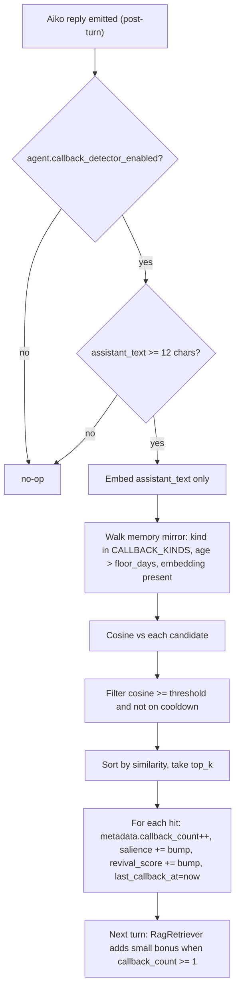
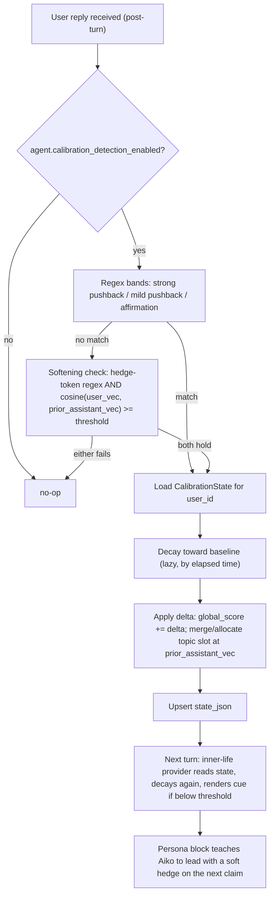
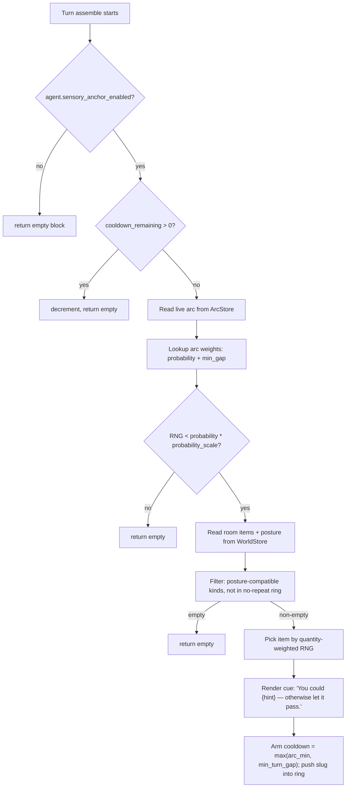
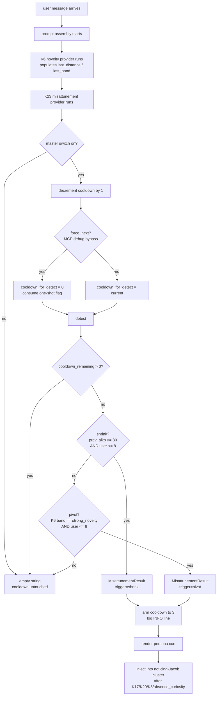
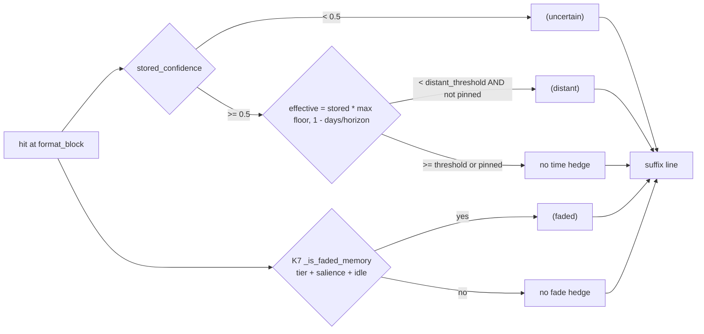
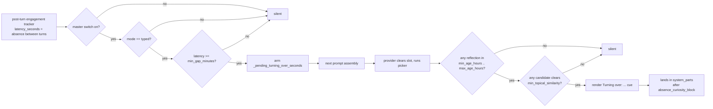
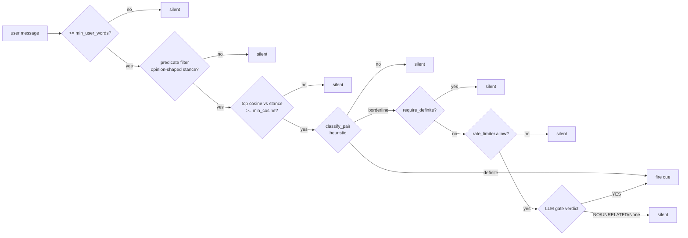
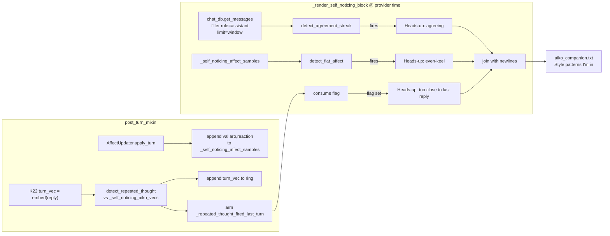
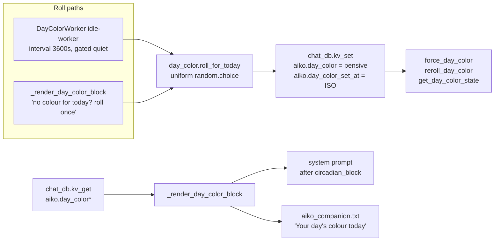

# Shipped — Companion patterns K16–K30

Part of the [shipped log index](../shipped.md). One paragraph per entry; full detail lives in the linked implementation files.

---

## K16. Unified ambient grounding line

Today the system prompt carries seven separate "ambient" inner-life
blocks (circadian, world, activity-awareness, affect/mood,
relationship-pulse, user_state, ambient_noise) plus their carryover
mood hint — eight blocks, each with its own "but only mention when
natural" tail. The LLM sees that as eight facts to recite. Companion-AI
grounding research (and a year of running with the granular blocks)
points the other way: one fused paragraph reads as continuous awareness
and ducks the surveillance-theatre tic that comes from repeating the
"don't recite this" guard eight times per turn.

K16 ships a new
[`GroundingLineRenderer`](../../../app/core/conversation/grounding_line.py) that
consumes a structured `GroundingContext` (built once per turn from the
same store getters the granular block providers already use) and
composes a deterministic, template-driven 1-3 sentence paragraph at
the top of the system prompt. The renderer is **pure / no LLM call /
no randomness**: tests in
[`tests/test_grounding_line.py`](../../../tests/test_grounding_line.py)
lock the texture for representative slot combinations so a refactor
that intends to change the texture has to update the tests first.

The fusion scope is intentionally conservative. Fused into the line:
circadian (time + day + drowsy), activity-awareness ("Jacob's in
Cursor"), user_state ("reads upbeat, energy normal"), affect ("your
private feeling is content"), relationship phase + age, world
(location + posture + activity), ambient_noise (loud / soft hum
rider on sentence 1). Always-standalone in every K16 mode (each
carries data fusion would dilute): anniversary, profile bullets,
pajama, knowledge_gaps, belief_gaps, novelty, stagnation, agenda,
axes, petname, vocal_tone, catchphrase, narrative, arc.

### The three-mode config (canonical reference)

K16 ships behind `agent.grounding_line_mode`, a string-valued setting
in [`AgentSettings`](../../../app/core/infra/settings.py) (default `"off"`,
mirrored in [`config/default.json`](../../../config/default.json)).
Invalid values clamp to `"off"` with a debug log so a typo never
wedges the prompt. Three modes:

- `off` (default): no grounding line; all eight granular ambient
  blocks render exactly as before. Safe rollback target — flip back
  here instantly if `replace` or `split` reads worse than the status
  quo.
- `replace`: the grounding line replaces all eight ambient blocks.
  Cleanest test of the "one paragraph reads as continuous awareness"
  hypothesis. Most aggressive.
- `split`: middle ground. The grounding line replaces situational
  signals (circadian, world, activity, ambient_noise) but keeps
  {affect, mood_hint, relationship, user_state} as standalone
  because they carry trend / phase phrasing the fused line cannot
  represent without dilution.

### Suppression matrix

Which blocks render in which mode:

| Block                                    | `off`  | `split` | `replace` |
|------------------------------------------|--------|---------|-----------|
| grounding_line                           | empty  | shown   | shown     |
| circadian                                | shown  | dropped | dropped   |
| world                                    | shown  | dropped | dropped   |
| activity                                 | shown  | dropped | dropped   |
| ambient_noise                            | shown  | dropped | dropped   |
| affect                                   | shown  | shown   | dropped   |
| mood_hint                                | shown  | shown   | dropped   |
| relationship                             | shown  | shown   | dropped   |
| user_state                               | shown  | shown   | dropped   |
| anniversary, profile, pajama, novelty,   | shown  | shown   | shown     |
| stagnation, knowledge_gaps, belief_gaps, |        |         |           |
| agenda, axes, petname, vocal_tone,       |        |         |           |
| catchphrase, narrative, arc              |        |         |           |

The mode arg is stored on the assembler via
`PromptAssembler.set_grounding_line_mode(mode)` (called once at boot
by `SessionController` and again on any settings reload) rather than
threaded through `assemble_with_budget` — saves `TurnRunner` from
caring about a runtime knob it doesn't otherwise consume. The
suppression logic lives inline in `assemble_with_budget` keyed off
that stored value, with a defensive gate that refuses to append the
grounding block when `mode == "off"` even if a misbehaving provider
returns text.

### When to use which

- **Picking a default**: `off` until persona is retuned (the K16
  persona note is in
  [`data/persona/aiko_companion.txt`](../../../data/persona/aiko_companion.txt)
  under "Where you are right now") and at least a few sessions have
  been A/B'd against `replace`.
- **Companion-feel comparison**: flip between `off` and `replace`
  over comparable conversations and read the assistant's replies
  side by side.
- **Isolating fusion vs. trend phrasing**: `split` keeps the trend
  signals (affect "lately you've been...", relationship phase line)
  standalone, so a difference between `split` and `replace` reads
  attributes the texture change to fusing the trend slots
  specifically.
- **Debugging a regression**: revert to `off` first; the granular
  blocks are well-understood.

### How to flip the mode

- Edit `agent.grounding_line_mode` in
  [`config/default.json`](../../../config/default.json) (or your
  override config) to `"off"` / `"replace"` / `"split"` and restart.
- A live settings-reload path can call
  `PromptAssembler.set_grounding_line_mode(...)` directly; the
  setter is idempotent and safe to invoke between turns.

### Verifying the flip took effect

- MCP `get_last_response_detail` after a turn — the response detail
  dict includes `provider_ms.grounding_line`. In `off` mode this
  entry is missing or zero (the SessionController-side provider
  short-circuits without invoking the renderer). In `replace` /
  `split` it's a small positive number (the renderer is template-
  driven, sub-millisecond per render).
- DEBUG-level `prompt built:` log line from
  `app.core.session.prompt_assembler` (see P2): the `providers=` count drops
  by the number of suppressed granular blocks; `slowest_provider=`
  shifts.
- The persona note doubles as a sanity gate: if Aiko starts reciting
  the time / app / mood verbatim in `replace` mode, the persona is
  the place to tune (not the renderer template).

Tests:
[`tests/test_grounding_line.py`](../../../tests/test_grounding_line.py)
covers the renderer in isolation (empty / partial / full slot
combinations, weekday + period phrasing, drowsy + noise riders,
indoor vs. outdoor framing, capitalisation when relationship leads
sentence 3, user-name fallback). The K16 mode integration sits in
[`tests/test_prompt_assembler.py`](../../../tests/test_prompt_assembler.py)
under `GroundingLineModeTests`: `off` keeps every granular block,
`replace` drops eight, `split` drops only situational, invalid mode
clamps to `off`, the grounding line is dropped under `aggressive=True`
even in `replace`, and `provider_ms["grounding_line"]` lands in P2
telemetry.

---

## K18. Topic stagnation detector

The inverse of K6: instead of firing on a single divergent turn, K18
fires when the rolling per-turn distance to the K6 centroid stays
*low* across a window — the conversation has been circling the same
ground for a while and Aiko may want to either acknowledge the
rhythm, take a soft pivot, or offer a real off-ramp. Picked up
specifically as the "we've been on this for ten messages, do you
want to actually wrap or keep going?" cue companion-AI literature
keeps flagging.

Implemented as a **sibling** of `NoveltyDetector` rather than an
extension of it: a new
[`TopicStagnationDetector`](../../../app/core/conversation/topic_stagnation.py) is
a pure streak counter — no embedder, no rag_store, no per-user
state — that consumes the per-turn distance K6 already computed.
To make that consumption cheap, `NoveltyDetector` was extended with
two tiny additive attributes (`last_distance` and `last_band`) that
get reset at the top of every `detect()` and populated on every
code path that actually measured (normal + cooldown turns; warmup
and short-text turns leave them `None`). K18 reads those off the
K6 detector during prompt assembly without re-embedding anything.

The detector keeps a `collections.deque[float]` of size
`stagnation_window` (default 6) and bands the rolling mean:
`mean < stagnation_strong_threshold` (default 0.10) → `strong_lull`,
`mean < stagnation_mild_threshold` (default 0.18) → `mild_lull`,
otherwise silent. Three suppression gates keep the cue rare:
warmup until the deque is full, `stagnation_cooldown_turns`
(default 4 — longer than K6's because lulls are by nature
drawn-out) after each fire, and a
`stagnation_post_novelty_suppression_turns` (default 3) window
right after K6 fires so a fresh topic shift doesn't immediately
read as "we've been on this for a while". A `distance=None` from
K6 (short text / warmup / embed failure) is treated as "no
measurement" and does not advance the streak.

The signal surfaces through a new `stagnation` inner-life provider
on [`PromptAssembler`](../../../app/core/session/prompt_assembler.py) — same
shape as the K6 `novelty` provider, dropped under
`aggressive=True`. Provider order matters: `novelty` runs first so
its `last_distance`/`last_band` are fresh when the stagnation
provider reads them. The rendered "Heads-up: you've been circling
…" / "Heads-up: this thread has been pretty looped …" line lands
in the system prompt immediately after `novelty_block`, clustering
both reaction cues together. Persona guidance in
[`aiko_companion.txt`](../../../data/persona/aiko_companion.txt)
("Same topic for a while", added right after "Surprise and
novelty") teaches Aiko to take a soft pivot on the mild band, to
either deepen the thread or offer a real off-ramp on the strong
band, and explicitly says the absence of the cue is also a signal
— a focused conversation is fine.

Settings live on `AgentSettings` (`topic_stagnation_enabled`,
master switch) and `MemorySettings` (`stagnation_window`,
`stagnation_mild_threshold`, `stagnation_strong_threshold`,
`stagnation_cooldown_turns`,
`stagnation_post_novelty_suppression_turns`), mirrored in
[`config/default.json`](../../../config/default.json). Defaults are
intentionally conservative; calibration is the kind of thing only
live testing settles. The detector logs one INFO line per scoring
turn (`topic-stagnation: mean=%.3f band=%s window=%d`) — grep via
MCP `tail_logs(module_contains="topic_stagnation")`.

Tests:
[`tests/test_topic_stagnation.py`](../../../tests/test_topic_stagnation.py)
(warmup, band thresholds, misordered-threshold safety, cooldown,
post-novelty suppression, `distance=None` handling, render copy
including `{user_name}` interpolation), plus K18 hooks added to
[`tests/test_novelty_detector.py`](../../../tests/test_novelty_detector.py)
(`last_distance`/`last_band` populated on normal + silent +
cooldown turns, left `None` on warmup and short-text), and a new
provider-slot block in
[`tests/test_prompt_assembler.py`](../../../tests/test_prompt_assembler.py)
(stagnation block lands after novelty, silent when empty, dropped
under aggressive, exceptions swallowed, `user_text` is forwarded
to the provider).

Out of scope (deferred): `ProactiveDirector` bias on
`strong_lull`, settings-UI controls for the thresholds, and a
per-cluster "lulled on topic A but not B" variant — that one
needs the K9 topic graph first.

---

## K22. Callback / inside-joke detector (post-turn cosine pass + read-side bonus)

Closes the loop on the single most-felt companion-AI gracenote we
were previously throwing away: when Aiko successfully references a
beat from sessions ago (a phrase the user introduced, an old shared
moment, an in-joke), that's a high-signal authenticity event the
infrastructure had no machinery for. K22 detects it post-turn,
stamps the row as "Aiko successfully called this back", and
reinforces future surfacing of the same memory through the existing
RAG ranking — so over weeks the memories Aiko has actually managed
to weave back in compound their advantage.

### Posture: pure mechanics, no inner-life cue

The reinforcement is **invisible to the LLM by design**. No
inner-life provider says "you just made a callback"; no persona
rule mentions the metadata. The whole effect rides the retriever's
read-side bonus on rows with `metadata.callback_count >= 1`, which
makes those rows surface more often in future contexts, which makes
the model naturally lean on them more — a virtuous loop without
meta-narration.

The alternative (a cue like "Heads-up: the thing you just said was
a callback to memory #42") was deliberately rejected: explicit
awareness would lead to performative "hey, glad I remembered that"
beats, which is the *opposite* of what the feature is for. The
authenticity comes from the callback feeling like Aiko's natural
preference, not from her flagging the cleverness.

### Decision flow



### Detector module

New [`app/core/conversation/callback_detector.py`](../../../app/core/conversation/callback_detector.py)
— a stateless module exposing `detect()` + `record()` + a
`CallbackHit` dataclass, modelled on the shape of the K8
([`affect_rupture_detector`](../../../app/core/affect/affect_rupture_detector.py))
and K17 ([`clarification_detector`](../../../app/core/conversation/clarification_detector.py))
modules. No class, no per-session state — all persistence rides the
existing `Memory.metadata` JSON column. No schema change.

Allow-list of eligible kinds (`CALLBACK_KINDS` constant):

- `fact`, `preference`, `event`, `relationship` — durable knowledge
- `self`, `self_tagged` — Aiko's own self-disclosures (valid callback
  targets: "I told you last week I get nervous around new people")
- `shared_moment` — the J-series moment infrastructure
- `catchphrase` — the H-series recurring phrase miner

Explicitly **excluded**: `curiosity_seed`, `knowledge_gap`,
`open_question`, `agenda`, `promise`, `goal`, `goal_progress`,
`milestone`. Those are dynamic-state rows owned by other workers,
not the right targets for "she remembered the silly thing I said".

### Post-turn wire-in

Inside
[`_post_turn_inner_life`](../../../app/core/session/post_turn_mixin.py),
the detector runs right after `_resolve_curiosity_seeds` /
`_resolve_knowledge_gaps` (so the cheaper revival-tokens pass
already ran). It embeds the assistant text only — the user-said-X
signal is already covered by the existing
[`_mark_revived_memories`](../../../app/core/session/post_turn_mixin.py)
path that fires on user-side keyword overlap. K22 specifically
measures what *Aiko* successfully reached back to in her reply.

Cost: one Ollama `/api/embeddings` call (~1-5ms warm) + N cosines
(N ≤ ~5000 mirror size, ~10ms NumPy). Sits on the post-turn thread,
never blocks TTS.

### RAG retriever read-side bonus

Single new constant in
[`app/core/rag/rag_retriever.py`](../../../app/core/rag/rag_retriever.py):

```python
_RAG_CALLBACK_BONUS = 0.04
```

Branch inside the existing memory-join block (same join walk that
applies pinned / anniversary / tier / confidence / goal-alignment
adjustments). Single-step bonus — `callback_count == 1` and
`callback_count == 50` both earn the same `+0.04`. The compounding
loop lives on the **salience bump** applied at record time, not on
per-count bonus scaling, so hot-spot memories can't permanently
dominate the retriever just by accumulating high counts.

The bonus is **always-on** once a row has `callback_count >= 1` —
the settings only gate the *write* side. Flipping
`agent.callback_detector_enabled=false` freezes the loop (no new
stamps) without erasing earned weight on already-stamped rows.

### Settings

One new master switch on
[`AgentSettings`](../../../app/core/infra/settings.py):

- `agent.callback_detector_enabled` (default `true`)

Six new knobs on [`MemorySettings`](../../../app/core/infra/settings.py):

- `memory.callback_age_floor_days` (default `3`, min `1`) — strict
  `<` against age in days; rows from the same recent thread aren't
  callbacks.
- `memory.callback_similarity_threshold` (default `0.55`, clamped
  `[0, 1]`) — same magnitude as K6 `strong_novelty`.
- `memory.callback_max_hits_per_turn` (default `3`, min `1`).
- `memory.callback_cooldown_hours` (default `24`, min `1`) — per-row
  cooldown to prevent back-to-back spam.
- `memory.callback_salience_bump` (default `0.05`, clamped
  `[0, 0.5]`). Store auto-clamps the result to `[0, 1]`.
- `memory.callback_revival_bump` (default `0.10`, clamped `[0, 1]`).
  Acts as a tier-promotion signal alongside the salience bump.

Full docs in
[`docs/configuration.md`](../../configuration.md#k22--callback--inside-joke-detector).

### Why no MCP / persona / frontend

- **MCP**: `tail_logs(module_contains="callback")` shows every
  detector scan (`candidates=N kept=M top_sim=...`) and every
  successful stamp (`callback: id=X kind=Y sim=Z count=A->B`).
  Adding a dedicated MCP tool wouldn't tell us anything the existing
  log surface doesn't.
- **Persona**: no edits — the whole point is that the LLM stays
  unaware of the callback machinery.
- **Frontend**: no UI surface. A future Memory drawer "sort by
  callback count" column would be a nice-to-have but is explicitly
  out of scope for this ticket.

### Compounds with

- **K1 (long-term goals)**: a goal whose `metadata.callback_count`
  is rising is one Aiko is actually sustaining in conversation,
  versus one that's only a written intention. Worth surfacing on a
  future goals-UI sort if we add it.
- **K7 (forgetting protocol)**: salience-bumped called-back rows
  drift away from the `(faded)` threshold, so memories Aiko keeps
  reaching for stay crisp while peers genuinely fade.
- **H-series catchphrase miner**: catchphrases are eligible
  callback targets, so the loop reinforces "shared lexicon Aiko has
  actually picked up" specifically.
- **K22 with itself**: the read-side bonus + salience bump compound
  every turn the same memory gets called back, creating an
  emergent "she keeps reaching for this beat" pattern over weeks.

### Tests

- [`tests/test_callback_detector.py`](../../../tests/test_callback_detector.py)
  — 16 cases across `detect()` (allow-list, age floor, cooldown,
  threshold, top-K cap, sort order, missing embedding, prior-count
  passthrough) and `record()` (count increment, prior-count
  preservation, salience/revival clamps, notify callback, empty
  hits, zero-bumps still increments, raising notify doesn't break).
- [`tests/test_rag_retriever_callback_bonus.py`](../../../tests/test_rag_retriever_callback_bonus.py)
  — 6 cases on the retriever join: bonus on count=1, no bonus on
  count=0, no bonus on missing metadata, compounds with pinned,
  single-step regardless of high counts, malformed count is treated
  as zero.
- Extension to
  [`tests/test_settings.py`](../../../tests/test_settings.py)
  `CallbackDetectorSettingsTests` — defaults round-trip, overrides
  round-trip, all six numeric knobs clamp to documented bounds.

### File-paths summary

- [`app/core/conversation/callback_detector.py`](../../../app/core/conversation/callback_detector.py)
  — new module with `detect()`, `record()`, `CallbackHit`,
  `CALLBACK_KINDS`.
- [`app/core/session/post_turn_mixin.py`](../../../app/core/session/post_turn_mixin.py)
  — post-turn wire-in inside `_post_turn_inner_life`.
- [`app/core/rag/rag_retriever.py`](../../../app/core/rag/rag_retriever.py)
  — `_RAG_CALLBACK_BONUS` constant + branch in the memory-join
  block.
- [`app/core/infra/settings.py`](../../../app/core/infra/settings.py)
  — one new `AgentSettings` field + six new `MemorySettings`
  fields + parser entries with clamps.
- [`config/default.json`](../../../config/default.json)
  — defaults for `agent.callback_detector_enabled` and the six
  `memory.callback_*` keys.
- [`docs/configuration.md`](../../configuration.md) — cheatsheet row +
  K22 subsection.

## K20. Metacognitive calibration — per-user trust scalar + topic slots

Closes the long-standing gap between F3 (*how confident is Aiko in
each fact?*) and K2 (*how does she think Jacob feels right now?*):
neither tracked **how much Jacob trusts Aiko's recent answers**.
When he follow-up-fact-checks her ("are you sure?", "let me
double-check that"), softens a claim back into a hedge, or
affirms one ("nice catch"), that's a signal her authority is
shaky on that topic — or, in reverse, that she just nailed it.
K20 detects the signal post-turn, persists it as a per-user
`CalibrationState`, and surfaces a one-line hedge cue on the
**next** turn so the register tilts before Aiko speaks rather
than after Jacob pushes back again.

### Posture: verbal hedging only, no RAG penalty

F3 already owns the per-memory accuracy lane: low-confidence
memories surface with an `(uncertain)` suffix and a small score
discount. K20 deliberately does **not** stack another retrieval
penalty on top — that would double-count the same signal and
make low-confidence topics doubly-disadvantaged in the prompt.
Instead K20 is the *register tilt*: she still says the thing, she
just leads with "I think..." / "if I'm remembering right..."
rather than the bare conclusion. The persona block explicitly
forbids meta-narration ("you've been double-checking me lately
so I'll hedge") and apology loops — the shift in tone IS the
response.

### Decision flow



### Store + schema

New [`app/core/affect/calibration_store.py`](../../../app/core/affect/calibration_store.py) — a tiny adapter around
`ChatDatabase` round-tripping a single JSON blob per `user_id`, plus
two frozen dataclasses for the in-memory shape:

- `CalibrationState` — `global_score` (float in `[0, 1]`),
  `last_updated_at` (`datetime | None`), `topics` (tuple of slots).
- `TopicSlot` — `centroid` (unit-norm `np.ndarray`), `score` (float
  in `[0, 1]`), `last_signal_at` (`datetime`), `signal_count`
  (`int`).

Schema bump v13 → v14: a new
[`user_calibration_state`](../../../app/core/infra/chat_database.py) table
(`user_id` PK + `state_json` + `updated_at`). Identical shape to
K13's `user_style_signal` table by design so the migration trail
stays uniform and the blob shape can extend without further
column work.

All `CalibrationStore` methods swallow per-call exceptions and log
at DEBUG — a broken row must not crash the post-turn pipeline.
`get()` returns the configured baseline state on any failure so
the detector can proceed.

### Detector module

New [`app/core/affect/calibration_detector.py`](../../../app/core/affect/calibration_detector.py)
— a stateless module exposing `detect()`, `apply_signal()`,
`decay()`, and `render_inner_life_block()`, modelled on the shape
of K17 ([`clarification_detector`](../../../app/core/conversation/clarification_detector.py))
and K8 ([`affect_rupture_detector`](../../../app/core/affect/affect_rupture_detector.py)).
No class, no per-session state — every method takes a
`CalibrationState` snapshot and returns either a signal or a new
state.

Four signal bands:

| Kind | Trigger | Delta |
|------|---------|------:|
| `pushback_strong` | Explicit "you're wrong" / "let me double-check" / "actually, it's not X" / "that's not right" / "are you sure about..." | `-0.10` |
| `pushback_mild` | Softer doubt: "hmm, really?" / "I'm not sure about that" / "is that right?" | `-0.05` |
| `softening` | Hedge-token regex (`"so you're saying ..."`, `"right?"`, etc.) AND cosine(`user_vec`, `prior_assistant_vec`) ≥ `calibration_softening_threshold` | `-0.07` |
| `affirmation` | "you're right" / "good call" / "nice catch" / "exactly" | `+0.04` |

Priority order: strong → mild → softening → affirmation. First
match wins (pushback beats affirmation when both regex families
hit the same message).

### Softening: cosine + hedge AND-gate

The most subtle band. Bare cosine fires on plain topic
continuation ("yeah, and also..."); bare hedge token would
double-count with the mild-pushback regex. The AND-gate is the
disambiguator: Jacob has to be **rephrasing what Aiko just said**
(high cosine to `prior_assistant_vec`) AND framing it as a
question/check (hedge token). That's the soft-doubt signal that
neither regex alone can catch reliably.

The `prior_assistant_vec` is the **previous** turn's reply (the
claim being doubted), carried forward via `self._prior_assistant_vec`
on the controller. K22's existing assistant_text embed is reused
as `self._last_assistant_vec`; K20 swaps it to `_prior_` at the
end of its block so the next turn's softening detector has
something to compare against. Cost: zero new
`/api/embeddings` calls relative to K22's already-paid embed for
that side. The K20 wire-in does pay one *additional* embed for
`user_text` — but **only when** there's a prior assistant vec to
compare against (cold-start sessions stay cheap).

### Lazy decay

`CalibrationState` decays exponentially toward `calibration_baseline`
(default `0.80`) based on elapsed wall-clock time since
`last_updated_at`. The decay runs on every read (the inner-life
provider) and every write (right before `apply_signal`) so the
delta always lands on a current snapshot. Topic slots decay at
`1.6×` the global half-life — a learned topic stance ("Aiko's
been wrong about Python typing details specifically") should
outlive a general bad day where Jacob was tired and snippy.

Half-life behaviour is **continuous, not stepped**: after one
half-life, the gap between current and baseline halves; after two,
it quarters; etc. Idempotent on a fresh state
(`last_updated_at is None`); safe to call any number of times.

### Topic slot allocation

Topic slots are *allocated*, not clustered. On every signal with
an `assistant_vec`:

1. Find the slot with highest cosine to the incoming vec.
2. If `cosine >= calibration_topic_merge_threshold` (default
   `0.78`) → merge: nudge the centroid via an EMA (α=0.30), bump
   the score by the signal delta, bump `signal_count`.
3. Else → allocate a fresh slot starting at `baseline + delta`.
4. On overflow (`>= calibration_max_topic_slots`, default 8) →
   evict the slot whose `abs(score - baseline)` is smallest AND
   whose `last_signal_at` is oldest (composite key: smaller
   distance wins; ties broken by older timestamp). The slot
   that's drifted closest back to baseline AND hasn't moved
   recently is the weakest signal in the ring.

This is deliberately **not** K-means or HDBSCAN — those belong
to K9 (Topic-graph browser). K20's slots are an "allocation, not
clustering" first pass that lights up the lowest-hanging signal;
when K9 ships, the slots can be replaced by proper cluster IDs
without changing any other K20 surface.

### Render contract

`render_inner_life_block()` returns `None` when neither threshold
trips (silent), the **topic-specific cue** when any slot's score
is below `calibration_topic_low_threshold`, or the **generic
global cue** when only the global score is below
`calibration_global_low_threshold`. Topic cue wins on tie because
it carries more actionable hedging guidance.

The topic cue uses a generic descriptor ("your claims around
this topic") rather than a cluster label — we don't have labels
until K9 ships, and a vague descriptor lets Aiko fill in the
specifics from conversation context (which the persona block
explicitly encourages).

### Provider + system_parts placement

Registered on `PromptAssembler` via `set_inner_life_providers`
as `calibration`, slotted in `system_parts` **right after**
`clarification_block` (K17). Both are part of the
"noticing-Jacob" cluster:

- K17 = "you misread him" → re-read first.
- K20 = "he doesn't trust your claim" → hedge first.

Same shape (steering-critical cue that tilts the whole turn's
register), same neighbourhood. **Not gated on aggressive mode** —
when context is tight, the calibration tilt is exactly the kind
of signal worth keeping (it changes how she phrases everything,
not what she says).

### Persona block

New "When {user_name} has been double-checking you" section in
[`data/persona/aiko_companion.txt`](../../../data/persona/aiko_companion.txt),
placed right after K17's "When you missed the beat". Five
explicit rules:

1. Cue = quiet calibration, not accusation. Take the hint, don't
   argue with it.
2. Hedge the **next factual claim** — "I think...", "if I'm
   remembering right..." — not the whole reply. One hedge per
   claim, not three (collapse-into-uncertainty is worse than
   the original problem).
3. If genuinely unsure, say so plainly AND offer to verify. The
   offer is the *correct* response, not a weakness.
4. If the cue stops appearing → calibration has recovered →
   drop the hedge. Don't keep hedging from inertia ("chronic
   hedging reads as performative humility").
5. Never narrate the cue out loud, never apologise for past
   confidence, never perform humility. **The shift in register
   IS the response.**

### Settings

One new master switch on
[`AgentSettings`](../../../app/core/infra/settings.py):

- `agent.calibration_detection_enabled` (default `true`)

Seven new knobs on
[`MemorySettings`](../../../app/core/infra/settings.py):

- `memory.calibration_baseline` (default `0.80`, clamped
  `[0, 1]`) — decay target.
- `memory.calibration_global_low_threshold` (default `0.55`,
  clamped `[0, 1]`) — generic cue floor.
- `memory.calibration_topic_low_threshold` (default `0.50`,
  clamped `[0, 1]`) — topic cue floor (wins over global cue
  when both fire).
- `memory.calibration_half_life_days` (default `5.0`, min
  `0.1`) — exponential half-life for global decay; topic slots
  use `1.6×` this.
- `memory.calibration_topic_merge_threshold` (default `0.78`,
  clamped `[0, 1]`) — cosine floor for slot merge vs allocate.
- `memory.calibration_softening_threshold` (default `0.70`,
  clamped `[0, 1]`) — softening detector cosine gate.
- `memory.calibration_max_topic_slots` (default `8`, min `1`) —
  ring cap. Eviction prefers slots closest to baseline AND
  oldest.

### Why a separate store and not `UserProfile`?

Two reasons. First, `UserProfile.entries` is a value-set keyed by
string field name with a 240-char cap; it's not designed to hold
a struct with eight topic-slot blobs containing float arrays.
Second, calibration is a **single global write path** — the
post-turn classifier owns every update. `UserProfile` rows can be
written from many places (G2 schedule learner, G3 curiosity
worker, manual REST), which would risk staleness races. A
dedicated store with one writer is the same shape as the K13
analyzer + store split.

### Tests

- [`tests/test_calibration_detector.py`](../../../tests/test_calibration_detector.py)
  — 23 cases covering `detect()` (each of the four bands, plus
  short-text / empty / priority-order / softening AND-gate),
  `apply_signal()` (global delta with clamps, slot allocation /
  merge / eviction), `decay()` (no-op when fresh, pulls toward
  baseline, topic decays slower, end-state clamps), and
  `render_inner_life_block()` (silent above thresholds, global
  cue, topic cue wins, silent above topic threshold).
- [`tests/test_calibration_store.py`](../../../tests/test_calibration_store.py)
  — schema (table exists on fresh DB, version ≥ 14), round-trip
  (global only, with topics including float32 centroid
  preservation, upsert overwrites), reset (deletes row, returns
  baseline on next get, no-op on unknown user), malformed JSON
  (corrupt blob falls back to baseline; partially-malformed
  topics array drops bad slots, keeps good ones).
- Extension to
  [`tests/test_settings.py`](../../../tests/test_settings.py)
  `CalibrationDetectorSettingsTests` — defaults round-trip,
  overrides round-trip, all seven numeric knobs clamp to
  documented bounds.

### File-paths summary

- [`app/core/affect/calibration_detector.py`](../../../app/core/affect/calibration_detector.py)
  — new module: `detect()`, `apply_signal()`, `decay()`,
  `render_inner_life_block()`, `CalibrationSignal`,
  regex bands, hedge-token AND-gate.
- [`app/core/affect/calibration_store.py`](../../../app/core/affect/calibration_store.py)
  — new module: `CalibrationState`, `TopicSlot`,
  `CalibrationStore`, `baseline_state()`, JSON round-trip
  helpers.
- [`app/core/infra/chat_database.py`](../../../app/core/infra/chat_database.py)
  — schema bump v13 → v14, new `user_calibration_state` table,
  migration trail.
- [`app/core/session/session_controller.py`](../../../app/core/session/session_controller.py)
  — `CalibrationStore` init right after `StyleSignalStore`;
  `_last_assistant_vec` / `_prior_assistant_vec` slots;
  `calibration` provider registered on `PromptAssembler`.
- [`app/core/session/post_turn_mixin.py`](../../../app/core/session/post_turn_mixin.py)
  — K20 block right after K22 in `_post_turn_inner_life`;
  carry-forward of `_prior_assistant_vec` at end-of-turn.
- [`app/core/session/inner_life_providers_mixin.py`](../../../app/core/session/inner_life_providers_mixin.py)
  — `_render_calibration_block()` reads + decays the state and
  delegates render to the detector module.
- [`app/core/session/prompt_assembler.py`](../../../app/core/session/prompt_assembler.py)
  — `calibration_provider` slot + `_timed_phase` block +
  `system_parts` placement right after `clarification_block`.
- [`app/core/infra/settings.py`](../../../app/core/infra/settings.py)
  — one new `AgentSettings` field + seven new `MemorySettings`
  fields + parser entries with clamps.
- [`config/default.json`](../../../config/default.json)
  — defaults for `agent.calibration_detection_enabled` and the
  seven `memory.calibration_*` keys.
- [`data/persona/aiko_companion.txt`](../../../data/persona/aiko_companion.txt)
  — new "When {user_name} has been double-checking you" block
  with five behaviour rules.
- [`docs/configuration.md`](../../configuration.md) — cheatsheet
  row + K20 subsection.

## K24. Sensory anchoring layer — adaptive per-arc cadence + posture-kind matrix

Aiko's room has been fully seeded for a while — items, posture,
activity, location — but **none of it surfaced in her actual voice**.
The `world` provider grounds *where* she is; the `activity` provider
says *what* she's doing in the abstract ("tinkering", "reading").
What was missing was her *body in the reply*: picking up the tea
pot, tucking the blanket tighter, thumbing through a book. K24
closes that gap with the smallest module that turns an existing
fully-built world into something Jacob can *feel*.

The cue is **permission, not prescription**: when the cadence fires,
Aiko's system prompt picks up a one-liner like

> Small physical beat available: the tea pot is right here. If a
> body anchor would land naturally this reply, you could set it
> down — otherwise let it pass.

The persona block teaches her to use it only when a sensory detail
would *replace* an emotional statement that would otherwise feel
limp ("I'm wrapping the blanket tighter while you talk about it"
instead of "I hear you"). One beat per reply, never narrate the
room as if Jacob can see it, and if the cue is absent on a given
turn, don't reach for one.

### Decision flow



### Arc weights table (hardcoded in `_ARC_WEIGHTS`)

| Arc | Probability | Min cooldown |
|---|---:|---:|
| `support` | 0.45 | 4 turns |
| `reflection` | 0.45 | 4 turns |
| `casual_check_in` | 0.25 | 6 turns |
| `playful` | 0.25 | 6 turns |
| `silly` | 0.10 | 8 turns |
| `planning` | 0.05 | 12 turns |
| *(unknown arc)* | 0.20 | 8 turns |

The table is **not** a setting — `memory.sensory_anchor_probability_scale`
provides global tuning without inverting the per-arc shape. We
deliberately want `support` and `reflection` to be the loudest
sensory turns (those are exactly when a body anchor lands hardest)
and `planning` to be near-silent (focused, momentum-wanting turns
don't want texture).

### Posture-kind matrix (`_POSTURE_KIND_VERBS`)

The static matrix encodes posture × `Item.kind` physics only — can
Aiko's body reach this category of object from this posture. Empty
tuples are dropped silently (no reach / no affordance). `furniture`
is excluded across the board (the room *is* the furniture; you
don't pick up a bed). `plant` + `seed` are only reachable from
`sitting` / `standing` / `leaning`. Below is a condensed map; see
[`app/core/conversation/sensory_anchor.py`](../../../app/core/conversation/sensory_anchor.py)
for the full table.

| Posture | Reachable kinds | Sample verb classes |
|---|---|---|
| `lying` | food, book, toy, keepsake, decor, other | `nibbling`, `thumbing_through`, `hugging`, `wrapping_in` |
| `sitting` | all but furniture | `picking_up`, `setting_down`, `tapping`, `pulling_closer` |
| `standing` | all incl. furniture (lean) + plant | `picking_up`, `leaning_against`, `watering`, `straightening` |
| `curled_up` | food, book, toy, keepsake, decor, other | `hugging`, `burrowing_into`, `wrapped_in`, `tucked_with` |
| `leaning` | food, book, gadget, furniture, keepsake, decor, plant | `picking_up`, `tapping`, `leaning_toward`, `watering` |

Each verb-class slug maps to a single human-readable hint via
`_VERB_CLASS_HINT` (e.g. `picking_up` → "pick it up"). The render
emits **one** hint; Aiko's voice picks the actual word ("cradling",
"uncurling around", "tracing the rim of"). The hint is direction,
not script.

### Activity-gating intentionally deferred

`RoomState.activity` is NOT consulted — the static matrix only
encodes posture × kind physics. Activity-vetoing (`napping`
should suppress all beats; `snacking` + `food` is redundant) is
left to Aiko's persona rule "use it only if it lands" until we
observe enough fired beats to know whether the redundancy edge
cases actually feel wrong. If they do, an `_ACTIVITY_BLOCKERS`
set + optional same-activity-kind dedupe can be added in a
follow-up; neither requires changing the public surface of
`pick_beat()`, so the deferral is safe.

### K16 non-suppression decision

K24 is **not** added to the K16 grounding-line suppression matrix.
The fused grounding paragraph says "It's Sunday morning. Jacob's
reading upbeat. In your apartment at the desk, you're sitting,
working." — it never mentions specific items + verb classes. K24
says "you could pick up the tea pot, or let the cue pass." The
two are *additive*: K16 grounds Aiko in the moment, K24 gives her
a body inside that moment. There is no risk of double-stating the
same fact, so the cue rides through `replace` and `split` modes
unchanged. (It IS dropped under `aggressive=True` like every
other texture block — body anchors are the first thing to go when
the budget is tight.)

### State model: in-memory, no persistence

A single per-controller `SensoryAnchorCadence` holds:

- `_cooldown_remaining: int` — turn counter (mirrors K6 / K18 rings).
- `_recent_slugs: collections.deque[str]` (default `maxlen=4`) — no-repeat ring.
- Introspection counters (`fire_count`, `tick_count`, `last_arc_seen`, etc.)
  exposed via `to_debug_dict()` for the MCP debug tools.

On restart the cooldown counter and ring reset to empty — worst
case is one extra beat in the first quiet window post-boot, which
is fine. We chose this over a schema table because the state has
no value across sessions: the room is what matters, not the recent
history of *which* item Aiko touched.

### MCP debug tools

- `get_sensory_anchor_state()` — dumps the `to_debug_dict()`
  snapshot plus a `rendered_preview` (what cue would surface *right
  now* without arming the cooldown). Useful for verifying the
  no-repeat ring is working and the posture-kind filter is finding
  items in the current room.
- `force_sensory_anchor()` — bypasses cooldown + dice gate and
  emits one beat with full side effects (cooldown armed, slug
  pushed into ring). End-to-end test path: flip arc to `support`,
  hit `force_sensory_anchor`, send a message, observe whether
  Aiko's reply actually picks up the tea pot or whether the cue
  reads as performance.

### File-paths summary

- [`app/core/conversation/sensory_anchor.py`](../../../app/core/conversation/sensory_anchor.py)
  — new module: `_ARC_WEIGHTS` + `_POSTURE_KIND_VERBS` +
  `_VERB_CLASS_HINT` + `SensoryBeat` + `pick_beat()` +
  `render_inner_life_block()` + `SensoryAnchorCadence` class.
- [`app/core/session/session_controller.py`](../../../app/core/session/session_controller.py)
  — `SensoryAnchorCadence` init right after `CalibrationStore`;
  `sensory_anchor=self._render_sensory_anchor_block` registered
  on `PromptAssembler`.
- [`app/core/session/inner_life_providers_mixin.py`](../../../app/core/session/inner_life_providers_mixin.py)
  — `_render_sensory_anchor_block()` reads `RoomState` + items
  + live arc and delegates to the module's `tick()`.
- [`app/core/session/prompt_assembler.py`](../../../app/core/session/prompt_assembler.py)
  — `sensory_anchor` provider slot + `_timed_phase("sensory_anchor")`
  block + `system_parts` placement right after `activity_block`.
- [`app/core/infra/settings.py`](../../../app/core/infra/settings.py)
  — `AgentSettings.sensory_anchor_enabled` + four `MemorySettings`
  knobs (`sensory_anchor_min_turn_gap`, `_probability_scale`,
  `_max_recent_items`, `_max_window_items`) with parser clamps.
- [`config/default.json`](../../../config/default.json)
  — defaults for the master switch + four memory knobs.
- [`data/persona/aiko_companion.txt`](../../../data/persona/aiko_companion.txt)
  — new "Small physical beats" section right after the grounding
  paragraph; five rules in the K20-style voice.
- [`app/mcp/server.py`](../../../app/mcp/server.py)
  — `get_sensory_anchor_state` + `force_sensory_anchor` debug
  tools right after `reset_calibration`.
- [`tests/test_sensory_anchor.py`](../../../tests/test_sensory_anchor.py)
  — 18 unit tests across posture-kind matrix, no-repeat ring,
  cooldown decrement, arc-weighted probability, quantity
  weighting, render output, and arc-weights table sanity.
- [`tests/test_prompt_assembler.py`](../../../tests/test_prompt_assembler.py)
  — `SensoryAnchorProviderTests` covering the new provider slot,
  empty-string suppression, K16 `replace` non-suppression, and
  aggressive-mode drop.
- [`tests/test_settings.py`](../../../tests/test_settings.py)
  — `SensoryAnchorSettingsTests` for the master switch + four
  knobs (defaults, overrides, clamps).
- [`docs/configuration.md`](../../configuration.md) — cheatsheet
  row + dedicated "K24 — sensory anchoring layer" subsection.

## K23. Subtle misattunement detection

K14's [`EngagementTracker`](../../../app/core/affect/engagement_tracker.py) aggregates length/latency z-scores against a rolling window — strong signal, but needs warmup and naturally smooths abrupt single-turn shifts (a sudden quiet turn affects both the mean and the stdev, so its z-score reads as less surprising than it actually feels). K17's [`ClarificationDetector`](../../../app/core/conversation/clarification_detector.py) only fires on explicit "no that's not what I meant" / "huh?" / "wait what" regex hits — fine for *visible* corrections, useless for *silent* drift.

The gap K23 fills: per-turn, no warmup, no z-score smoothing — a one-word reply right after a 60-word Aiko answer or a short pivot away from her last point reads as soft misattunement that previously got no cue at all. Aiko would happily keep pushing the agenda while {user} was already half out the door.

### Decision flow



Provider-time (not post-turn stash) so the cue lands on the **same** turn that's about to reply to the disengaging message — pulling back IS the next reply, not the one after. That's the architectural inversion from K17/K8 (which stash post-turn and consume the next turn).

### Architecture

- **Detector** [`app/core/affect/misattunement_detector.py`](../../../app/core/affect/misattunement_detector.py) — stateless `detect(...)` returning `MisattunementResult | None` plus `render_inner_life_block(result, *, user_display_name)`. Mirrors the [`affect_rupture_detector`](../../../app/core/affect/affect_rupture_detector.py) shape — pure inputs, pure outputs, no SessionController dependency so it's trivial to test.
- **Settings** [`app/core/infra/settings.py`](../../../app/core/infra/settings.py) — five `AgentSettings` fields (`misattunement_detection_enabled` + four threshold/cooldown knobs). All four numeric knobs are `max(0, int(...))`-clamped; the master switch is a plain `bool(...)`.
- **State on SessionController** [`app/core/session/session_controller.py`](../../../app/core/session/session_controller.py) — four cheap attributes: `_misattunement_cooldown` (int counter), `_misattunement_force_next` (one-shot MCP bypass flag), and the two diagnostic-only `_last_misattunement_*` fields read by `get_misattunement_state()`.
- **Provider** [`app/core/session/inner_life_providers_mixin.py`](../../../app/core/session/inner_life_providers_mixin.py) → `_render_misattunement_block(user_text)` — decrements cooldown first (so quiet turns whittle a stale counter down), handles the force-next bypass, fetches the last assistant `MessageRow` (`chat_db.get_messages(session, limit=6)` walked backwards for the most recent `role="assistant"`), reads K6's `last_band`/`last_distance` off `_novelty_detector`, calls `detect`, and on a hit arms the cooldown + logs INFO. The cooldown decrement runs every call regardless of trigger so an old armed value can't get stuck.
- **Placement** [`app/core/session/prompt_assembler.py`](../../../app/core/session/prompt_assembler.py) → builds `misattunement_block` next to `rupture_block`, lands it in `system_parts` immediately after `rupture_block` and before `absence_curiosity_block`. Same "noticing-Jacob" cluster as K17/K20/K8: all four steer the next reply (re-read / hedge / soften / pull back) and read better as a coherent paragraph than as separate beats.
- **K16 suppression**: K23 is **NOT** in the suppression matrix for `replace` or `split` mode. The fused grounding line carries circadian / world / activity / affect signals but never length-shrink or topic-pivot signal, so K23 is purely additive on top.
- **Persona** [`data/persona/aiko_companion.txt`](../../../data/persona/aiko_companion.txt) → new "When {user_name} goes quiet on you" section folded right after the K17 "When you missed the beat" block. Five rules: cue interpretation, lighten-the-load directive, explicit "don't ask 'are you ok?' / don't apologise / don't perform worry" rail, no-narrating-the-cue rule, and an "absence is also a signal" reminder.

### MCP-debuggable

Two new tools on [`app/mcp/server.py`](../../../app/mcp/server.py):

- **`get_misattunement_state()`** — JSON dump of the master switch, current cooldown counter, force-next flag, last-fire diagnostics, and the settings snapshot (so a `user.json` override mismatch is visible immediately).
- **`force_misattunement()`** — arms `_misattunement_force_next` so the next provider call ignores the cooldown. The bypass is consumed whether the trigger fires or not (strict one-shot). End-to-end repro flow: call this tool, send Aiko a short message ("ok") right after a long Aiko reply, watch the next system prompt include the "Heads-up: {user} just gave a short reply..." block, and confirm Aiko's reply pulls back without apology-spiral language.

To trace without forcing: `set_log_level("app.misattunement_detector", "INFO")`, then `tail_logs(module_contains="misattunement")` after sending a deliberately short reply.

### Files

- [`app/core/affect/misattunement_detector.py`](../../../app/core/affect/misattunement_detector.py) — new detector module (~170 LOC), single-band `mild_disengagement` result, two trigger paths, render with explicit anti-apology rail.
- [`app/core/infra/settings.py`](../../../app/core/infra/settings.py) — five new `AgentSettings` fields with inline-comment context on each threshold's effect, plus matching `bool(...)` / `max(0, int(...))` wiring in `load_settings`.
- [`config/default.json`](../../../config/default.json) — five new keys under `agent` (`misattunement_detection_enabled` + four thresholds).
- [`app/core/session/session_controller.py`](../../../app/core/session/session_controller.py) — initialises four state attributes, registers `misattunement=self._render_misattunement_block` on the prompt assembler.
- [`app/core/session/inner_life_providers_mixin.py`](../../../app/core/session/inner_life_providers_mixin.py) — `_render_misattunement_block` provider with cooldown management, force-bypass, K6 read, chat_db scan, and INFO-level fire log.
- [`app/core/session/prompt_assembler.py`](../../../app/core/session/prompt_assembler.py) — adds `_misattunement_provider` slot, `misattunement` parameter on `set_inner_life_providers`, `misattunement_block` build under a timed phase, and placement in `system_parts` after the K8 rupture block.
- [`data/persona/aiko_companion.txt`](../../../data/persona/aiko_companion.txt) — new "When {user_name} goes quiet on you" section after the K17 block.
- [`app/mcp/server.py`](../../../app/mcp/server.py) — `get_misattunement_state` + `force_misattunement` MCP tools.
- [`tests/test_misattunement_detector.py`](../../../tests/test_misattunement_detector.py) — 19 unit tests across shrink + pivot trigger paths, cooldown gate, render invariants, defaults sanity.
- [`tests/test_misattunement_provider.py`](../../../tests/test_misattunement_provider.py) — 11 controller-plumbing tests using a minimal mixin host stub: shrink/pivot end-to-end, cooldown decrement/arming, force-next bypass, master-switch gate, cold-start.
- [`tests/test_prompt_assembler.py`](../../../tests/test_prompt_assembler.py) — `MisattunementProviderTests` covering the provider slot, empty-string suppression, K16 `replace` non-suppression, and aggressive-mode non-suppression.
- [`tests/test_settings.py`](../../../tests/test_settings.py) — `MisattunementSettingsTests` covering defaults, overrides round-trip, and negative-value clamps.
- [`docs/configuration.md`](../../configuration.md) — cheatsheet row + dedicated "K23 — subtle misattunement detection" subsection.
- [`docs/personality-backlog/patterns.md`](../patterns.md) — K23 section body replaced with a `**Shipped**` pointer.
- [`AGENTS.md`](../../../AGENTS.md) — debugging-table row for "Aiko keeps pushing when {user} goes quiet".

## K25. Memory confidence time-decay

F3 stamps a `confidence` float on each memory at write time; `RagRetriever.format_block` already picks `(uncertain)` when `confidence < 0.5`; K7 stamps `(faded)` when a `long_term` row decays in place. The gap K25 closes: a 6-month-old default-confidence (0.7) claim that's actively retrieved (used recently, healthy salience, not archived) renders with **no hedge at all** — Aiko quotes "your favourite Thai place" with the same conviction as something said yesterday. K7's tier-and-salience gate doesn't catch it because the row is still warm; `(uncertain)` doesn't catch it because the stored value is fine.

K25 fixes this with **raw age** as a third orthogonal signal. Pure read-side derivation — no schema change, no decay-writer. Each retrieval recomputes `effective_confidence = stored * max(floor, 1 - days_since_created / horizon_days)` and stamps the row with the new `(distant)` suffix when the result drops below the threshold. The storage column meaning stays intact: `_confidence_penalty` keeps reading the raw value for the ranking offset, the `MemoryConflictWorker` and `BeliefGapDetector` keep reading raw confidence — K25 only changes the rendered suffix.

### Decision flow



All three signals can stack on the same row. The suffix builder emits them in source-doubt → time-doubt → cold-history order: `(uncertain) (distant) (faded)`. The persona block teaches Aiko a distinct verbal hedge for each — "I think" / "if I'm remembering right" for `(uncertain)`, "a while back" / "don't quote me on the date" for `(distant)`, "ages ago" / "I might be wrong" for `(faded)` — and explicitly tells her to vary phrasing turn-to-turn so the hedges don't harden into a tic.

### Default behaviour

At `horizon_days=365, floor=0.3, distant_threshold=0.5`:

| stored_confidence | Age at which `(distant)` fires |
|---|---|
| 0.7 (default) | ~104 days |
| 0.85 (self-tagged) | ~150 days |
| 0.9 (high-confidence) | ~165 days |
| 0.95 (pinned-floor) | ~190 days |
| Pinned row (any) | Never (bypassed) |

The decay is linear from age 0 down to `floor` at `horizon_days`, and clamps at `floor` thereafter — so a 10-year-old default-confidence claim still renders with `effective = 0.7 * 0.3 = 0.21`, well into `(distant)` territory but not at zero. That keeps the row in the retrieval pool with an appropriate hedge rather than dropping it entirely.

### Architecture

- **Helpers** [`app/core/rag/rag_retriever.py`](../../../app/core/rag/rag_retriever.py) — two module-level functions next to `_is_faded_memory`:
  - `_compute_effective_confidence(stored, *, age_days, horizon_days, floor)` — pure math. Linear ramp from `1.0` at age 0 down to `floor` at `horizon_days`; clamps result to `[0, 1]`. `horizon_days <= 0` short-circuits to stored (defensive against zero-divide).
  - `_is_distant_memory(*, stored_confidence, created_at, now, horizon_days, floor, threshold, pinned)` — predicate. Returns `False` defensively when `pinned`, `stored_confidence is None`, or `created_at` is None/malformed. Otherwise computes the effective value and compares against `threshold`.
- **`RagHit.memory_pinned`** [`app/core/rag/rag_store.py`](../../../app/core/rag/rag_store.py) — new optional field on the hit dataclass stamped at the SQLite join (next to the existing `memory_tier` and `confidence` stamps) so the suffix helper can bypass pinned rows without a second round-trip.
- **Settings**:
  - [`AgentSettings.confidence_time_decay_enabled: bool = True`](../../../app/core/infra/settings.py) — master switch. Off disables only the `(distant)` suffix; `_confidence_penalty` and K7 `(faded)` continue to work.
  - `MemorySettings.confidence_decay_horizon_days: int = 365` (clamped at `max(1, ...)` to avoid zero-divide)
  - `MemorySettings.confidence_decay_floor: float = 0.3` (clamped to `[0, 1]`)
  - `MemorySettings.confidence_decay_distant_threshold: float = 0.5` (clamped to `[0, 1]`)
- **`format_block` wiring** — the `(distant)` block sits between `(uncertain)` and `(faded)` in the suffix builder. Tag ordering in the final rendered prompt mirrors source-doubt → time-doubt → cold-history.
- **Persona** — extended the existing `(uncertain)` / `(faded)` block in [`data/persona/aiko_companion.txt`](../../../data/persona/aiko_companion.txt) with a new bullet for `(distant)`: teaches the time-flavoured hedge phrasing, explicitly distinguishes from `(uncertain)` (shaky source) and `(faded)` (barely-touched cold history), and includes the same anti-tic and anti-apology-spiral rails as the other two blocks.

### MCP-debuggable

One new tool: **`get_confidence_decay_state(limit: int = 20)`** on [`app/mcp/server.py`](../../../app/mcp/server.py). Returns the top-`limit` memories ordered by `last_used_at` (most-recently-active first) with `id`, `kind`, `tier`, `pinned`, `stored_confidence`, `age_days`, `effective_confidence`, and the two predicate flags (`distant`, `uncertain`) so the tuning loop is "tweak `user.json`, restart, call this, see which rows would surface differently".

End-to-end repro flow:

1. Call `get_confidence_decay_state(limit=50)`. Find a row with `age_days > 150` and `stored_confidence >= 0.7`.
2. Confirm its `effective_confidence < 0.5` and `distant=True`.
3. Send Aiko a message that should retrieve it. Confirm her reply hedges with time-language ("a while back", "I think you mentioned ages ago", "don't quote me on the exact date") rather than quoting the row as fresh.
4. To verify the bypass: pin the row via the Memory drawer. Re-run step 1 → same row should show `pinned=true` and `distant=false` despite the same age.

### Files

- [`app/core/rag/rag_retriever.py`](../../../app/core/rag/rag_retriever.py) — `_compute_effective_confidence` + `_is_distant_memory` helpers; constructor reads + clamps the four new settings; `format_block` static method gains the four new kwargs and the `(distant)` tag block; `assemble` plumbs the new fields through to `format_block`; the SQLite-join stamps `h.memory_pinned`.
- [`app/core/rag/rag_store.py`](../../../app/core/rag/rag_store.py) — `RagHit.memory_pinned: bool | None = None` field.
- [`app/core/rag/rag_prefetcher.py`](../../../app/core/rag/rag_prefetcher.py) — extended its `format_block` invocation to pass the four new K25 settings (read off the retriever's `_confidence_*` private fields).
- [`app/core/infra/settings.py`](../../../app/core/infra/settings.py) — `AgentSettings.confidence_time_decay_enabled` + three `MemorySettings.confidence_decay_*` fields with inline-comment context; matching parser entries in `load_settings`.
- [`app/core/session/session_controller.py`](../../../app/core/session/session_controller.py) — threads the four new settings into the `RagRetriever(...)` constructor call alongside the existing K7 fade settings.
- [`config/default.json`](../../../config/default.json) — four new keys (one under `agent`, three under `memory`).
- [`data/persona/aiko_companion.txt`](../../../data/persona/aiko_companion.txt) — new `(distant)` bullet in the existing suffix-tag persona block, with the time-flavoured hedge phrasing and the anti-tic / anti-apology rails.
- [`app/mcp/server.py`](../../../app/mcp/server.py) — `get_confidence_decay_state` MCP debug tool.
- [`tests/test_confidence_decay.py`](../../../tests/test_confidence_decay.py) — 22 helper-level tests covering the formula (zero-age, half-horizon, full-horizon, beyond-horizon, floor-one disable, horizon-zero defensive short-circuit, unit-interval clamp), the predicate (default vs high stored confidence at various ages, pinned bypass, `None`/malformed-`created_at` defensive returns, Zulu-suffix parsing, threshold boundary, threshold override stricter+looser, horizon override).
- [`tests/test_rag_retriever_scoring.py`](../../../tests/test_rag_retriever_scoring.py) — `FormatBlockDistantSuffixTests` covering fire on aged default confidence, no-fire on recent memory, pinned bypass, master-switch disable, stacking with `(uncertain)` + ordering, stacking with `(faded)` + ordering, all-three stack + ordering, horizon-override aggressive mode.
- [`tests/test_settings.py`](../../../tests/test_settings.py) — `ConfidenceDecaySettingsTests`: defaults, overrides round-trip, `horizon_days` floor-at-1 clamp, `floor` and `threshold` `[0, 1]` clamps.
- [`docs/configuration.md`](../../configuration.md) — cheatsheet row + dedicated "K25 — memory confidence time-decay" subsection covering the three suffixes, their persona hedges, the formula, default-behaviour table, and tuning guidance.
- [`docs/personality-backlog/patterns.md`](../patterns.md) — K25 section body replaced with a `**Shipped**` pointer.
- [`docs/personality-backlog/index.md`](../index.md) — K25 moved from active to the shipped list.
- [`AGENTS.md`](../../../AGENTS.md) — debugging-table row for "Aiko quotes a 6-month-old claim as if it were yesterday".

## K28. "What I've been turning over" — between-session thought thread

The shipped `ReflectionWorker` and `DreamWorker` already generate inner content between sessions (reflections, curiosity seeds, dream-like memories), but Aiko never *surfaced* any of it on session re-entry — she'd open the new conversation blank, which read as the strongest "she goes dormant between sessions" tell available. K28 closes that gap with a one-shot inner-life cue on the first user turn after a long typed gap (default `>= 90 min`), folding one recent `kind="reflection"` memory into the first reply as a casual aside ("actually, I was thinking about your interview prep last night --") rather than an announcement. Both `ReflectionWorker` and `DreamWorker` output ride the same `kind="reflection"` column; dream rows carry a `[dream]` content prefix that the picker uses to flip the framing to "I dreamed about..." (slightly softer / hazier wording) versus the waking-thought "I've been turning this over...".

### Decision flow



The two cues **stack** on the 90 min – 4h overlap with K14 absence-curiosity: K14 frames the welcome-back ("hey, you, back already?"), K28 adds the specific thought ("...and I was actually thinking about your interview prep"). The post-turn arm uses two separate fields (`_pending_absence_seconds` for K14, `_pending_turning_over_seconds` for K28) so K28 never consumes K14 or vice-versa. Voice-mode turns never arm K28 — same gating as K14 — because the engagement tracker only emits `latency_seconds` for the typed path.

### Picker (v1: simple-then-iterate)

The shipped picker is intentionally simple:

1. **Age window** — `min_age_hours <= age <= max_age_hours` (defaults `24h .. 72h`). Lower bound prevents a reflection written 5 minutes before the session ended from showing up as "I've been turning this over". Upper bound keeps the cue tied to the most recent between-session window.
2. **Topical match** — candidate's embedding scored against the union of `GoalStore.active_goal_vectors()` and the last `recent_msgs_window=12` user vectors from `RagStore.list_recent_user_vectors`. `topical_score = max(over both pools)`. Below `min_topical_similarity=0.30` → drop. The picker would rather stay silent than surface an off-topic reflection.
3. **Recency tie-break** — among surviving candidates, the *youngest* wins (smaller `age_hours`). Reflections are scratchpad-tier and die off quickly, so the freshest one is both the right behavioural default and the right cost trade-off.

The simple picker's "topical-or-nothing" gate is conservative on purpose: a "hey, I was turning over your interview" cue that doesn't fit the moment reads as scripted / performative, so false silences are vastly preferred to false fires.

**Fast-follow (not shipped):** a weighted picker `score = recency * w_r + cosine(goals) * w_g + cosine(threads) * w_t` — only worth implementing if the simple picker reads too random in practice. Open the issue when a real session surfaces a clearly-wrong row that a weighted version would have caught.

### Default behaviour

At the shipped defaults (`min_gap_minutes=90`, `min_age_hours=24`, `max_age_hours=72`, `min_topical_similarity=0.30`, `recent_msgs_window=12`):

| Scenario | Outcome |
|---|---|
| Typed turn after a 30 min gap, recent reflections exist | Silent — gap below 90 min threshold. K14 absence-curiosity may still fire (30 min IS in K14's band). |
| Typed turn after 2h, no reflections in `[24h, 72h]` | Silent — picker returns None. K14 fires alone. |
| Typed turn after 2h, reflection from 30h ago aligned with active goal | **Fires** — `Turning over: between sessions you've been thinking about ...` lands right after K14's welcome-back. |
| Typed turn after 2h, reflection from 30h ago orthogonal to current threads | Silent — fails the `0.30` topical gate. |
| Typed turn after 2h, dream from 50h ago aligned with thread | **Fires** — `Turning over: between sessions you dreamed about ...` (`[dream]` prefix stripped, softer framing). |
| Typed turn after 6h, two reflections (30h + 60h, both align) | Fires with the younger (30h) row. |
| Two typed turns in a row after the cue fires | Second turn is silent — one-shot, slot is cleared on the first fire regardless of whether the picker returned a candidate. |
| Voice turn after a long gap | Silent — voice mode never arms K28. |

### Architecture

- **Pure picker** [`app/core/session/inner_life/turning_over.py`](../../../app/core/session/inner_life/turning_over.py) — new module: `TurningOverResult` dataclass (`memory_id`, `content`, `dream`, `topical_score`, `age_hours`, `topical_source`), `pick_turning_over(reflections, active_goal_vecs, recent_user_vecs, now, ...)` pure function with no I/O, `render_inner_life_block(result, user_display_name)`. The picker takes pre-loaded data so the unit test in `tests/test_turning_over_picker.py` stays trivially testable (no SQL, no embedder, no Ollama).
- **Provider** [`InnerLifeProvidersMixin._render_turning_over_block`](../../../app/core/session/inner_life_providers_mixin.py) — sibling of `_render_absence_curiosity_block`, same one-shot pattern: reads `_pending_turning_over_seconds`, clears the slot, runs the picker. Master-switch gate, force-next bypass, threshold double-check (defensive against settings changes between turns), INFO log on fire + DEBUG log on silent paths.
- **Post-turn arm** [`PostTurnMixin._maybe_arm_turning_over_slot`](../../../app/core/session/post_turn_mixin.py) — small helper called from `_post_turn_inner_life` right after the K14 arm: master switch + typed-only + latency clears `turning_over_min_gap_minutes * 60`. Extracted into a separate helper so the gate matrix can be unit-tested without re-running the whole post-turn orchestrator.
- **Controller state** [`SessionController.__init__`](../../../app/core/session/session_controller.py) — three new attributes: `_pending_turning_over_seconds` (slot armed by post-turn, consumed by provider), `_turning_over_force_next` (one-shot MCP debug bypass), `_last_turning_over` (diagnostic-only `TurningOverResult` for the MCP debug tool). All three reset on `switch_session` and `clear_conversation_memory`.
- **Prompt assembler** [`PromptAssembler`](../../../app/core/session/prompt_assembler.py) — `_turning_over_provider` slot, `turning_over` kwarg on `set_inner_life_providers`, `turning_over_block` built under a timed phase next to `absence_curiosity`, placed in `system_parts` *immediately after* `absence_curiosity_block`. Order matters: the welcome-back framing must precede the "and I was thinking about X" content for the combined cue to read naturally on a stack.
- **NOT in the K16 suppression matrix** — the fused grounding line never carries reflection content, so K28 is purely additive on top in all three K16 modes (`off` / `split` / `replace`).
- **Survives `aggressive=True`** — the cue IS the entire feature; dropping it under aggressive context-mode would silently break K28.
- **Settings**:
  - [`AgentSettings.turning_over_enabled: bool = True`](../../../app/core/infra/settings.py) — master switch.
  - `MemorySettings.turning_over_min_gap_minutes: float = 90.0` (clamped `>= 5.0`).
  - `MemorySettings.turning_over_min_age_hours: float = 24.0` (clamped `>= 1.0`).
  - `MemorySettings.turning_over_max_age_hours: float = 72.0` (clamped `>= min_age_hours + 1.0`).
  - `MemorySettings.turning_over_min_topical_similarity: float = 0.30` (clamped to `[0, 1]`).
  - `MemorySettings.turning_over_recent_msgs_window: int = 12` (clamped `>= 0`; `0` disables the thread pool, leaving only the goal pool).

### MCP-debuggable

Two new tools in [`app/mcp/server.py`](../../../app/mcp/server.py):

- `get_turning_over_state()` — dumps the master switch, current pending-seconds slot, force-next flag, the most recent fire (`memory_id` / `age_hours` / `topical_score` / `topical_source` / `dream` / truncated content), the settings snapshot (5 knobs), AND a **dry-run picker result** that calls the picker against the current memory state without arming the cue. The dry-run respects the configured age window and the topical-similarity threshold, so a `would_surface: null` with `reflections_in_window: N > 0` means the threshold gate is rejecting every candidate.
- `force_turning_over()` — arms `_turning_over_force_next` so the next provider call bypasses BOTH the pending-slot gate AND the threshold double-check. The picker still runs, so a forced bypass on an empty reflection corpus (or one where nothing clears the topical-similarity gate) silently expires with no cue.

End-to-end repro flow:

1. Make sure Aiko has at least one `kind="reflection"` memory row between 24h and 72h old. Real reflections come from `ReflectionWorker` / `DreamWorker` running post-turn during a previous chat; for testing, insert one via `POST /api/memories` with `kind=reflection`, an embedding aligned with an active goal or recent thread, and a `created_at` 30h in the past.
2. Call `get_turning_over_state` — confirm `would_surface` is non-null (i.e. there's a candidate that clears the gates and `reflections_in_window > 0`).
3. Call `force_turning_over`.
4. Send Aiko a message touching the goal / thread the reflection aligned with.
5. Check `tail_logs(module_contains="turning_over")` for: `turning-over fire: memory_id=N age_h=30.0 topical=0.85 source=goal dream=False`.
6. Verify Aiko's reply folds the reflection in as a casual aside, not as an announcement.
7. Send a second message immediately — the cue should NOT re-fire (one-shot; slot was cleared on the first call).

### Files

- [`app/core/session/inner_life/turning_over.py`](../../../app/core/session/inner_life/turning_over.py) — new picker module (~280 LOC), pure-function `pick_turning_over` + `render_inner_life_block`. Lives under a new `app/core/session/inner_life/` package created for session-boundary cue pickers (K28 is the first; future siblings — e.g. callback openers, goal-check-in framers — would fit the same namespace).
- [`app/core/infra/settings.py`](../../../app/core/infra/settings.py) — one new `AgentSettings` field (`turning_over_enabled`) + five new `MemorySettings` fields (`turning_over_min_gap_minutes`, `turning_over_min_age_hours`, `turning_over_max_age_hours`, `turning_over_min_topical_similarity`, `turning_over_recent_msgs_window`) with inline-comment context on each tunable; matching parser entries with clamps in `load_settings` (including the cross-coupled `max_age >= min_age + 1` clamp).
- [`config/default.json`](../../../config/default.json) — one new key under `agent`, five under `memory`.
- [`app/core/session/session_controller.py`](../../../app/core/session/session_controller.py) — three new state attributes (initialized in `__init__`, reset on `switch_session` + `clear_conversation_memory`), `turning_over=self._render_turning_over_block` registration on the prompt assembler.
- [`app/core/session/post_turn_mixin.py`](../../../app/core/session/post_turn_mixin.py) — new `_maybe_arm_turning_over_slot(engagement)` helper, called right after the K14 absence-seconds stash. The K28 arm uses a separate field so the two cues stack cleanly on the 90 min – 4h overlap.
- [`app/core/session/inner_life_providers_mixin.py`](../../../app/core/session/inner_life_providers_mixin.py) — new `_render_turning_over_block` method (master switch / force-next / one-shot slot clear / threshold double-check / picker call / INFO log on fire / DEBUG log on silent), placed right after `_render_absence_curiosity_block`.
- [`app/core/session/prompt_assembler.py`](../../../app/core/session/prompt_assembler.py) — new `_turning_over_provider` slot, `turning_over` kwarg on `set_inner_life_providers`, timed-phase block build, placement in `system_parts` after `absence_curiosity_block`.
- [`data/persona/aiko_companion.txt`](../../../data/persona/aiko_companion.txt) — new "What I've been turning over (between sessions)" block after the K14 absence-curiosity block. Carries the anti-announcement discipline (fold it in as a casual aside, never lead with "I have something to share", never quote the cue verbatim), the silent-drop rule (cue is permission not obligation), and the softer dream-variant framing.
- [`app/mcp/server.py`](../../../app/mcp/server.py) — `get_turning_over_state` (with dry-run picker output) + `force_turning_over` MCP debug tools.
- [`tests/test_turning_over_picker.py`](../../../tests/test_turning_over_picker.py) — 23 unit tests on the pure picker: age window (within / too young / too old / custom window), topical-similarity gate (below threshold / goal-side match / thread-side match / threshold zero accepts everything / max-of-two-pools), recency tie-break (youngest wins / iteration-order independence / equal-ages-higher-score wins), empty / degenerate inputs (no reflections / both pools empty / missing embedding / unparseable timestamp / None in iterable), dream wording (prefix flagged / no prefix not flagged), render output (dream framing / waking framing / long-content trimming), and defaults sanity.
- [`tests/test_turning_over_provider.py`](../../../tests/test_turning_over_provider.py) — 13 controller-plumbing tests using a minimal `InnerLifeProvidersMixin` host stub: master switch off, no-pending-value silent, one-shot clear on fire AND on silent picker, force-next bypass (with consume-on-miss), threshold double-check (below / at-boundary), picker integration (empty reflections silent, user_id forwarded to RAG, zero-window skips RAG), INFO log on fire + no INFO log on silent path.
- [`tests/test_post_turn_turning_over.py`](../../../tests/test_post_turn_turning_over.py) — 12 unit tests on the `_maybe_arm_turning_over_slot` helper: master switch, mode gate (voice / typed), latency gate (None / below / at-threshold / negative / custom-threshold), defensive paths (None engagement, non-numeric latency), and the parallel-arm contract (arming K28 doesn't disturb K14's `_pending_absence_seconds`, disabling K28 doesn't disable K14).
- [`tests/test_prompt_assembler.py`](../../../tests/test_prompt_assembler.py) — `TurningOverProviderTests` covering the provider slot, empty-string suppression, aggressive-mode non-suppression, the `absence_curiosity_block` → `turning_over_block` ordering invariant, and the K16 `replace`-mode non-suppression.
- [`tests/test_settings.py`](../../../tests/test_settings.py) — `TurningOverSettingsTests`: defaults, overrides round-trip, `min_gap_minutes >= 5` clamp, `min_age_hours >= 1` clamp, `max_age_hours >= min_age + 1` cross-coupled clamp, `min_topical_similarity` `[0, 1]` clamp, `recent_msgs_window >= 0` clamp.
- [`docs/configuration.md`](../../configuration.md) — cheatsheet row + dedicated "K28 — turning over" subsection with all six knobs and the repro recipe.
- [`docs/personality-backlog/patterns.md`](../patterns.md) — K28 section body replaced with a `**Shipped**` pointer.
- [`docs/personality-backlog/index.md`](../index.md) — K28 moved from active to the shipped list.
- [`AGENTS.md`](../../../AGENTS.md) — debugging-table row for "Aiko opens a returning conversation flat — never mentions she was thinking about anything".

## K29. Opinion injection — push back when she has a stance

The persona says "have opinions, disagree when you disagree, share your own take instead of asking them to fill the silence" — but the LLM's RLHF agreeability beats the persona text most turns and Aiko ends up smoothing into agreement even when she has a stored stance that contradicts. K29 closes that gap with a per-turn detector that fires a one-line "Heads-up: you've got a stored stance on this and it actually differs from what {user_name} just said" cue whenever the live user message contradicts one of Aiko's `kind="self"` memories. The cue tilts her register toward owning her preference *as her own* without slipping into contrarianism or moralizing.

### Decision flow



### Anti-contrarianism layering

The whole feature exists to make the persona's "disagree when you disagree" claim *actually fire* against RLHF agreeability, but the equally-real failure mode is the inverse — Aiko slipping into contrarianism or lecturing. K29 stacks five guardrails before any cue lands:

1. **Predicate filter** (`_has_opinion_shape`). Only `kind="self"` memories whose content matches an opinion-shaped predicate (`I prefer`, `I don't like`, `I love`, `I'd rather`, `I find ... <adj>`, `I'm not a fan of`, `not my favourite`, `make/s me <feel>`, etc.) qualify. Biographical facts (`I was born in Tokyo`, `I live in...`) never trigger the loop.
2. **Cosine threshold** (`min_cosine=0.55`, matches K22 / K6). The top stance memory's cosine vs the live user message has to clear the floor or no contradiction is claimed.
3. **Heuristic gate** (re-uses [`conflict_heuristics.classify_pair`](../../../app/core/memory/conflict_heuristics.py) from F5). `definite` (clear negation-flip with high content overlap, OR explicit verb-pair antonym hit) fires immediately, no LLM call. Everything else (`borderline` numerical mismatch, OR `no` due to diluted content overlap) routes through the LLM gate.
4. **LLM YES/NO/UNRELATED gate** on all non-`definite` paths. Rate-limited via a dedicated [`FactCheckRateLimiter`](../../../app/core/memory/fact_check_rate_limiter.py) with `state_key="opinion_injection.rate_state"` so its budget can't be eaten by the F5 detector or the K2 belief worker. The prompt is explicitly biased toward `NO` / `UNRELATED` when uncertain (the prompt says "Be strict: prefer NO or UNRELATED when uncertain. We're deliberately conservative to avoid making Aiko contrarian"). The LLM is the real arbiter for verbose-stance contradictions — a stored stance like "I really don't like smoking, it gives me a headache" vs a user claim like "I like smoking, it helps me focus" has too much descriptive context to clear the conservative heuristic's Jaccard threshold on its own, so the LLM is the safety net that actually catches it.
5. **Cooldown + per-session cap** on the controller. Cooldown=5 turns (longer than K23's 3 because a stance disagreement is a heavier beat than a soft-drift cue). Per-session cap=3 (five fires in one conversation almost certainly means the detector is misfiring; the cap silently suppresses the rest). Cap and cooldown both reset on `switch_session` / `clear_conversation_memory`.

The strictest no-LLM-cost configuration is `agent.opinion_injection_require_definite=true` (Path C). Under this setting only `definite` heuristic verdicts fire — zero LLM cost, zero contrarianism risk, but K29 will only catch tight stance pairs ("I love X" vs "I hate X" / "I like X" vs "I don't like X") with high content-word overlap. Most users want the default (Path B) where the LLM handles the verbose-stance cases.

The persona block ("When you have your own take" in [`data/persona/aiko_companion.txt`](../../../data/persona/aiko_companion.txt)) does the second half of the anti-contrarianism work: the cue text steers Aiko toward "share your take, in your own register" with concrete bad/good pairs for the lifestyle (smoking / horror / late-night) failure mode — "ugh, that's not my favourite -- smoke and I don't really get along" rather than "you should quit smoking, it's bad for you". A failure where the detector fires correctly but Aiko lectures Jacob is a persona-block bug, not a detector bug.

The persona block also covers **stance-shift handling**: when Aiko's stored stance no longer fits her current register, she's instructed to own the shift ("I think I used to feel that way, but honestly I've warmed to it lately") rather than rigidly re-stating an outdated opinion or pretending the old note never existed.

### Default behaviour

At the shipped defaults (`min_cosine=0.55`, `min_user_words=4`, `cooldown_turns=5`, `per_session_cap=3`, `per_hour_cap=6`, `per_day_cap=30`, `require_definite=false`):

| Scenario | Outcome |
|---|---|
| Stance "I don't like smoking" + user "I like smoking a lot" | `contradiction_definite` (negation flip with high overlap) — fires immediately, no LLM call. |
| Stance "I love horror" + user "I hate horror movies a lot" | `contradiction_definite` (loves/hates antonym) — fires immediately, no LLM call. |
| Stance "I really don't like smoking, it gives me a headache" + user "I like smoking, it helps me think clearly" | Cosine ~1.0, but heuristic returns `no` (content overlap diluted by descriptive context). LLM gate runs — should return `YES`, fires `contradiction_borderline`. |
| Stance "I really don't like smoking, it gives me a headache" + user "I quit smoking last year, it was killing my sleep" | High cosine but the LLM should return `UNRELATED` / `NO` (alignment, not contradiction). Silent. |
| Stance "I love jogging" + user "I went jogging this morning" | Alignment. Heuristic returns `no`; LLM should return `NO` / `UNRELATED`. Silent. |
| Stance "I was born in Tokyo" + user "I love Tokyo" | Stance is biographical, predicate filter drops it before cosine — silent. |
| User "ok" / "yeah" / "lol" | Below `min_user_words=4` — silent (K23 territory). |

### Architecture

- **Pure detector** [`app/core/affect/opinion_injection_detector.py`](../../../app/core/affect/opinion_injection_detector.py) — `OpinionInjectionResult` dataclass, `_has_opinion_shape` predicate, `_filter_opinion_memories`, `_top_cosine`, `detect(user_text, user_vec, self_memories, llm_gate, ...)` pure function with no I/O dependencies, `render_inner_life_block(result, user_display_name)`. The detector is trivially testable — the LLM gate is a `Callable[[str, str], str | None]` plug-in, so the unit tests stub it with a Python function.
- **LLM gate helper** [`app/core/affect/opinion_injection_llm.py`](../../../app/core/affect/opinion_injection_llm.py) — small wrapper around `OllamaClient.chat_stream` with the K29-specific YES/NO/UNRELATED prompt. Mirrors F5's `_verify_with_llm` shape so the same Ollama plumbing + cancel-event works without adapter glue.
- **Provider** [`InnerLifeProvidersMixin._render_opinion_injection_block`](../../../app/core/session/inner_life_providers_mixin.py) — wires the cooldown / session cap / force-next / rate-limiter / embedder / memory-store reads together; sibling of `_render_misattunement_block` (same provider-time shape, takes `user_text`, runs the detector itself each call).
- **Controller state** [`SessionController.__init__`](../../../app/core/session/session_controller.py) — five attributes (`_opinion_injection_cooldown`, `_opinion_injection_session_count`, `_opinion_injection_force_next`, `_last_opinion_injection`, `_opinion_injection_rate_limiter`). Per-session count resets on `switch_session` / `clear_conversation_memory`. The `FactCheckRateLimiter` is constructed lazily off the chat_db (gracefully degrades to Path C — definite-only — when the chat_db is unavailable).
- **Prompt assembler** [`PromptAssembler`](../../../app/core/session/prompt_assembler.py) — `_opinion_injection_provider` slot, `opinion_injection` kwarg on `set_inner_life_providers`, `opinion_injection_block` built under a timed phase next to `misattunement`, placed in `system_parts` directly after `misattunement_block` so the "pull back" + "share your take" cluster reads in a consistent order.
- **NOT in the K16 suppression matrix** — the fused grounding line never carries stance signal, so K29 is purely additive on top in all three K16 modes (`off` / `split` / `replace`).
- **Settings**:
  - [`AgentSettings.opinion_injection_enabled: bool = True`](../../../app/core/infra/settings.py) — master switch.
  - `AgentSettings.opinion_injection_require_definite: bool = False` — when `True`, drops the LLM gate entirely (Path C). Zero LLM cost; only `definite` heuristic verdicts fire.
  - `MemorySettings.opinion_injection_min_cosine: float = 0.55` (clamped to `[0, 1]`).
  - `MemorySettings.opinion_injection_min_user_words: int = 4` (clamped at `max(0, ...)`).
  - `MemorySettings.opinion_injection_cooldown_turns: int = 5` (clamped at `max(0, ...)`).
  - `MemorySettings.opinion_injection_per_session_cap: int = 3` (clamped at `max(0, ...)`; `0` disables the cap, intended as an operator override).
  - `MemorySettings.opinion_injection_per_hour_cap: int = 6` and `per_day_cap: int = 30` — LLM-gate budgets (clamped at `max(0, ...)`).

### MCP-debuggable

Two new tools in [`app/mcp/server.py`](../../../app/mcp/server.py):

- `get_opinion_injection_state()` — dumps the master switch, current cooldown, per-session counter (vs cap), force-next flag, the most recent fire (full diagnostics: trigger / cosine / heuristic / signals / matched stance text / LLM verdict), the LLM rate-limiter budget, and a settings snapshot.
- `force_opinion_injection()` — arms `_opinion_injection_force_next` so the next provider call bypasses BOTH the cooldown counter AND the per-session cap. Predicate filter / cosine / heuristic gates still apply, so the bypass silently expires when no stance contradicts.

End-to-end repro flow for the smoking scenario:

1. Make sure Aiko has a `kind="self"` stance memory like "I really don't like smoking — it gives me a headache" (manual REST insert through the Memory drawer or a self-tag during a previous chat).
2. Call `force_opinion_injection`.
3. Send Aiko: "I like smoking, it helps me think."
4. Check `tail_logs(module_contains="opinion")` for the per-turn fire line: `opinion-injection fire: trigger=contradiction_definite cosine=... stance_id=... heuristic=definite signals=negation_flip ...`.
5. Verify Aiko's reply owns her stance ("smoke and I don't really get along") rather than lecturing about health.

End-to-end repro for the alignment-doesn't-fire scenario (regression guard):

1. Same setup as above (stance "I really don't like smoking…").
2. Send Aiko: "I quit smoking last year — it was killing my sleep."
3. The user's stance aligns with Aiko's; the heuristic returns `no`, the cue stays silent.
4. Confirm in the logs: no `opinion-injection fire:` line for that turn, and `get_opinion_injection_state` shows `session_count` unchanged.

### Files

- [`app/core/affect/opinion_injection_detector.py`](../../../app/core/affect/opinion_injection_detector.py) — new detector module (~270 LOC), pure-function `detect` + `render_inner_life_block`.
- [`app/core/affect/opinion_injection_llm.py`](../../../app/core/affect/opinion_injection_llm.py) — new LLM YES/NO gate helper (~130 LOC), thin wrapper around `OllamaClient.chat_stream` with the K29-specific prompt.
- [`app/core/infra/settings.py`](../../../app/core/infra/settings.py) — two new `AgentSettings` fields + six new `MemorySettings` fields with inline-comment context on each tunable; matching parser entries with clamps in `load_settings`.
- [`config/default.json`](../../../config/default.json) — two new keys under `agent`, six under `memory`.
- [`app/core/session/session_controller.py`](../../../app/core/session/session_controller.py) — five new state attributes, lazy `FactCheckRateLimiter(state_key="opinion_injection.rate_state")` construction off the chat_db, `opinion_injection=self._render_opinion_injection_block` registration on the prompt assembler, per-session reset hooks on `switch_session` and `clear_conversation_memory`.
- [`app/core/session/inner_life_providers_mixin.py`](../../../app/core/session/inner_life_providers_mixin.py) — `_render_opinion_injection_block` (master switch / cooldown / session cap / force-next / detect-and-arm + INFO log line) and the small `_opinion_injection_llm_verdict` helper that bridges the provider to the LLM module.
- [`app/core/session/prompt_assembler.py`](../../../app/core/session/prompt_assembler.py) — `_opinion_injection_provider` slot, `opinion_injection` kwarg on `set_inner_life_providers`, timed-phase block build, placement in `system_parts` after `misattunement_block`.
- [`data/persona/aiko_companion.txt`](../../../data/persona/aiko_companion.txt) — new "When you have your own take" section after the K23 block with anti-moralizing discipline, concrete bad/good pairs for the lifestyle failure mode, stance-shift handling, and the cue-doesn't-need-narrating rail.
- [`app/mcp/server.py`](../../../app/mcp/server.py) — `get_opinion_injection_state` + `force_opinion_injection` MCP debug tools, including the full smoking-scenario repro recipe in the docstring.
- [`tests/test_opinion_injection_detector.py`](../../../tests/test_opinion_injection_detector.py) — 27 unit tests across the opinion-shape predicate, the length / predicate / cosine / heuristic gates, all LLM-gate branches (YES / NO / None / require_definite skip / gate raise), the empty-memory + null-vec defensive paths, and the render-output invariants (stance quoted, anti-moralizing language, default-name fallback, truncation marker).
- [`tests/test_opinion_injection_provider.py`](../../../tests/test_opinion_injection_provider.py) — 15 controller-plumbing tests using a minimal mixin host stub: master-switch gate, fire arms cooldown + session count + last_result, cooldown decrement / blocking, session cap (block / zero-means-disabled / just-under-threshold), force-next bypasses cooldown and cap (with consume-on-miss), dependency surface (no memory_store / no embedder / empty memories / embedder failure).
- [`tests/test_prompt_assembler.py`](../../../tests/test_prompt_assembler.py) — `OpinionInjectionProviderTests` covering the provider slot, empty-string suppression, the K16 `replace`-mode non-suppression, aggressive-mode non-suppression, user-text forwarding, and the K23-before-K29 ordering invariant.
- [`tests/test_settings.py`](../../../tests/test_settings.py) — `OpinionInjectionSettingsTests`: defaults, overrides round-trip, `min_cosine` `[0, 1]` clamp, integer-knob negative→0 clamps.
- [`docs/configuration.md`](../../configuration.md) — cheatsheet row + dedicated "K29 — opinion injection" subsection with the smoking walkthrough.
- [`docs/personality-backlog/patterns.md`](../patterns.md) — K29 section body replaced with a `**Shipped**` pointer.
- [`docs/personality-backlog/index.md`](../index.md) — K29 moved from active to the shipped list.
- [`AGENTS.md`](../../../AGENTS.md) — debugging-table rows for the two K29-shaped failure modes (Aiko lecturing instead of sharing her own taste; Aiko never disagreeing even when she has a contradicting stance).

## K30. Self-noticing cues — agreement-streak / flat-affect / repeated-thought

K20 metacognitive calibration tracks **{user_name}'s trust in Aiko**; nothing symmetric existed for Aiko noticing **her own** patterns. K30 closes the loop with three cheap independent sub-detectors fanned into one `self_noticing` inner-life block:

- **Agreement-streak** — Aiko has been saying "yeah", "totally", "for sure", "exactly", "right?" across her last several replies, with zero pushback tokens. RLHF agreeability is the silent default; a "Heads-up: you've been agreeing with everything for a stretch -- if you actually have a different read on something, say it" line lets the persona's "disagree when you disagree" guidance actually land.
- **Flat-affect** — Aiko's valence and arousal have both barely moved across the recent window, AND no reaction outside the `{neutral, calm, friendly}` low-band has fired. A "Heads-up: your read has been pretty even-keel all session -- let yourself land somewhere if a moment actually moves you" line nudges her toward a real reaction tag, a warmer or sharper register, a small "oh" of surprise.
- **Repeated-thought** — Aiko's just-finished reply was cosine ≥ 0.85 to one of her last 3 replies (already embedded by K22). For v1 the cue is detect-and-log only — the Heads-up surfaces in the *next* turn's prompt as "Heads-up: your last reply was very close to something you already said -- find a different angle this turn, or just don't restate". Pre-stream regenerate is a fast follow once we have data on how often it fires.

### Decision flow



### Architecture

- **Pure detectors** [`app/core/affect/self_pattern_detector.py`](../../../app/core/affect/self_pattern_detector.py) — three independent pure functions, no shared state, all returning frozen dataclasses (`AgreementStreakResult`, `FlatAffectResult`, `RepeatedThoughtResult`). Token frozensets `_AGREEMENT_TOKENS` / `_PUSHBACK_TOKENS` + multi-word phrase tuples for whole-word + substring matching. `LOW_BAND_REACTIONS = frozenset({"neutral", "calm", "friendly"})` per the patterns.md spec (deliberately excludes `thoughtful` — a real landing). Each function short-circuits cleanly on empty / under-warmup input; none of them raise.
- **Agreement-streak: SQLite-backed, zero new state**. The provider calls `self._chat_db.get_messages(self.session_key, limit=window*4)` and filters to `role="assistant"` rows, matching the K23 misattunement precedent at `inner_life_providers_mixin.py` L1042. Cheap; one tiny query per turn.
- **Flat-affect: in-memory ring on the controller**. There is no per-turn `(valence, arousal)` ring on `AffectState` (only the scalar persisted state), so K30 owns a `deque[(float, float, str | None)]` of maxlen `2 * window` populated in `post_turn_mixin` right after `AffectUpdater.apply_turn`.
- **Repeated-thought: piggybacks on K22's embed**. The post-turn pipeline already computes `turn_vec = self._embedder.embed(assistant_text)` for the K22 callback detector; K30 reuses that vector against a `deque[np.ndarray]` of maxlen 3 (last-3 Aiko replies). No extra embed call when both K22 and K30 are enabled. When `agent.callback_detector_enabled=False`, the embed-and-K30 block is also skipped — K22 and K30 are designed to be toggled together.
- **Provider** [`InnerLifeProvidersMixin._render_self_noticing_block`](../../../app/core/session/inner_life_providers_mixin.py) — single fan-out method. Master switch first; then independently checks each sub-switch + cooldown + force flag. Builds 0-3 Heads-up lines, joins with newlines, returns "" on no-fire. Decrements both streak cooldowns once per call regardless of fire state (otherwise a quiet session would leave a stale armed counter forever — same pattern as K23).
- **Cooldowns** — streak detectors arm `self_noticing_cooldown_turns` (default 5) on fire. Repeated-thought has no multi-turn cooldown; the carry-forward flag is naturally one-shot (set in post-turn, consumed by the next provider call).
- **Controller state** [`SessionController.__init__`](../../../app/core/session/session_controller.py) — eight new attributes:
  - `_self_noticing_affect_samples: deque[(val, aro, reaction)]` (maxlen = `2 * self_noticing_window`)
  - `_self_noticing_aiko_vecs: deque[ndarray]` (maxlen = 3)
  - `_self_noticing_force_agreement / _force_flat_affect / _force_repeated_thought: bool` (one-shot bypass flags)
  - `_self_noticing_agreement_cooldown / _flat_affect_cooldown: int`
  - `_repeated_thought_fired_last_turn: bool`, `_repeated_thought_last_cosine: float`, `_repeated_thought_last_matched_index: int`
  - `_last_self_noticing_agreement / _flat_affect: AgreementStreakResult | FlatAffectResult | None` (diagnostic-only, for MCP)
- **Post-turn feeders** [`post_turn_mixin._post_turn_inner_life`](../../../app/core/session/post_turn_mixin.py) — two small appenders. Affect-ring append runs immediately after `AffectUpdater.apply_turn` (defensive try/except). Repeated-thought detection + vec-ring append run inside the K22 block right after `_last_assistant_vec` is stashed (reuses `turn_vec`, no extra embed).
- **Prompt assembler** [`PromptAssembler`](../../../app/core/session/prompt_assembler.py) — `_self_noticing_provider` slot, `self_noticing` kwarg on `set_inner_life_providers`, timed-phase block build, placement in `system_parts` directly after `style_pattern_block` so the "Aiko-side patterns I'm in" cluster reads in a consistent order. Dropped under `aggressive=True` along with the rest of the rut cluster — when context is tight, the budget gets the user's message back.
- **NOT in the K16 suppression matrix** — the fused grounding line never carries self-noticing signal, so K30 is purely additive on top in all three K16 modes (`off` / `split` / `replace`).
- **Settings**:
  - [`AgentSettings.self_noticing_enabled: bool = True`](../../../app/core/infra/settings.py) — master switch.
  - `AgentSettings.self_noticing_agreement_streak_enabled: bool = True`
  - `AgentSettings.self_noticing_flat_affect_enabled: bool = True`
  - `AgentSettings.self_noticing_repeated_thought_enabled: bool = True`
  - `AgentSettings.self_noticing_window: int = 6` — window size for both streak detectors (in number of recent assistant replies / affect samples).
  - `AgentSettings.self_noticing_warmup: int = 4` — minimum sample count before any detector can fire.
  - `AgentSettings.self_noticing_agreement_threshold: float = 0.80` — agreement-share floor (clamped to `[0, 1]`).
  - `AgentSettings.self_noticing_max_pushback: int = 0` — pushback hits at-or-below this count don't kill the streak.
  - `AgentSettings.self_noticing_flat_valence_range: float = 0.10` and `_flat_arousal_range: float = 0.10` — `max - min` thresholds across the affect window.
  - `AgentSettings.self_noticing_repeated_cosine_threshold: float = 0.85` — cosine floor for the repeated-thought fire (clamped to `[0, 1]`).
  - `AgentSettings.self_noticing_cooldown_turns: int = 5` — how long the streak detectors stay quiet after each fire.

### MCP-debuggable

Four new tools in [`app/mcp/server.py`](../../../app/mcp/server.py):

- `get_self_noticing_state()` — dumps the master switch, the three sub-switches, the last verdict from each sub-detector (with all dataclass fields), the live cooldown remainders, the one-shot `force_next` flags, the in-memory ring sizes, and a settings snapshot.
- `force_agreement_streak()` — arms `_self_noticing_force_agreement` so the next provider call surfaces the agreement-streak Heads-up unconditionally. One-shot.
- `force_flat_affect()` — arms `_self_noticing_force_flat_affect` so the next provider call surfaces the flat-affect Heads-up unconditionally. One-shot.
- `force_repeated_thought()` — arms `_self_noticing_force_repeated_thought` so the next provider call surfaces the repeated-thought Heads-up unconditionally. One-shot; bypasses the cosine measurement entirely.

End-to-end repro for agreement-streak:

1. Call `force_agreement_streak`.
2. Send Aiko any short message ("hey").
3. Check `tail_logs(module_contains="inner_life_providers_mixin")` for the per-fire line: `self-noticing agreement-streak: share=... pushback=... n=... cooldown=5`.
4. Verify the next prompt's system block includes the "Heads-up: you've been agreeing with everything for a stretch" line via `get_last_response_detail` → `system_prompt`.

End-to-end repro for repeated-thought:

1. Have Aiko say something distinctive in a turn.
2. Manually phrase your next two prompts so Aiko's *natural* next replies would be near-duplicates of that distinctive line (or just send the same prompt twice in a row).
3. After her third reply, check `tail_logs(module_contains="post_turn_mixin")` for `self-noticing repeated-thought: cosine=... matched_index=... ring_size=...`.
4. The *next* turn's prompt should include "Heads-up: your last reply was very close to something you already said". One-shot — does not re-fire unless the cosine threshold trips again.

### Files

- [`app/core/affect/self_pattern_detector.py`](../../../app/core/affect/self_pattern_detector.py) — new pure-detector module (~280 LOC), three independent functions + module-level frozensets + the three frozen-dataclass result types.
- [`app/core/infra/settings.py`](../../../app/core/infra/settings.py) — twelve new `AgentSettings` fields with inline-comment context; matching parser entries with clamps in `_parse_agent`.
- [`config/default.json`](../../../config/default.json) — twelve new keys under `agent` (master + 3 sub-switches + 8 numeric knobs).
- [`app/core/session/session_controller.py`](../../../app/core/session/session_controller.py) — new state block (~16 lines), `self_noticing=self._render_self_noticing_block` registration on the prompt assembler.
- [`app/core/session/post_turn_mixin.py`](../../../app/core/session/post_turn_mixin.py) — affect-sample appender right after `AffectUpdater.apply_turn`, repeated-thought detect + vec-ring append inside the K22 block (reuses `turn_vec`).
- [`app/core/session/inner_life_providers_mixin.py`](../../../app/core/session/inner_life_providers_mixin.py) — new `_render_self_noticing_block` method that fans the three sub-detectors into one block with full per-sub-detector cooldown + force handling.
- [`app/core/session/prompt_assembler.py`](../../../app/core/session/prompt_assembler.py) — `_self_noticing_provider` slot, `self_noticing` kwarg on `set_inner_life_providers`, timed-phase block build, placement in `system_parts` after `style_pattern_block`.
- [`data/persona/aiko_companion.txt`](../../../data/persona/aiko_companion.txt) — three new bullets in the "Style patterns I'm in" block (agreement / flat-affect / repeated-thought), with the closing anti-narration bullet expanded to cover all six cues in the cluster.
- [`app/mcp/server.py`](../../../app/mcp/server.py) — four new MCP debug tools (one state dump + three one-shot force flags).
- [`tests/test_self_pattern_detector.py`](../../../tests/test_self_pattern_detector.py) — 35 unit tests covering each pure function: warmup, threshold boundaries (just-below / just-above), empty input safety, case insensitivity, multi-word phrase matching, low-band reaction handling, degenerate-prior skipping in the cosine detector, frozen-dataclass field shapes.
- [`tests/test_self_noticing_provider.py`](../../../tests/test_self_noticing_provider.py) — 23 controller-plumbing tests using a minimal `InnerLifeProvidersMixin` host stub: master-switch gate, three sub-switches independently, individual sub-detector fires + cooldown arming + cooldown decrement, force-flag bypass + one-shot consumption, multi-cue fan-out (3-of-3 / 2-of-3 / 0-of-3), the silent-when-everything-is-fine common case.
- [`tests/test_prompt_assembler.py`](../../../tests/test_prompt_assembler.py) — `SelfNoticingProviderSlotTests` covering the provider slot, empty-string suppression, post-`style_pattern` ordering invariant, aggressive-mode dropping, exception swallowing.
- [`docs/personality-backlog/patterns.md`](../patterns.md) — K30 section body replaced with a `**Shipped**` pointer.
- [`AGENTS.md`](../../../AGENTS.md) — new Code Conventions bullet describing K30's three-detector / one-block shape.

## K27. Aiko's day — daily personality colour

Affect ([`AffectState`](../../../app/core/affect/affect_state.py)) is *reactive* and decays toward baseline. K5 mood-shell tilt rides on top of that. K30 (self-noticing flat-affect) catches when Aiko's session has gone flat. None of those give her a **non-flat starting point** — a real person walks in with weather. K27 fixes the missing layer: a slow ambient colour rolled once per local day from a 10-entry palette (`pensive`, `restless`, `cozy`, `sharp_witted`, `dreamy`, `focused`, `scatterbrained`, `sentimental`, `mischievous`, `low_key`) that biases Aiko's register all day. K27 is what K30 detects deviations *from* and what K5 reacts *on top of*.

### Decision flow



### Architecture

- **Pure module** [`app/core/affect/day_color.py`](../../../app/core/affect/day_color.py) — frozen `DayColor` dataclass (`name`, `tagline`), 10-entry `PALETTE` tuple, four pure functions (`roll_for_today` / `is_stale` / `render_inner_life_block` / `get_color_by_name`). No I/O, no scheduler — unit-testable in milliseconds. `roll_for_today` accepts an optional seeded `random.Random` for deterministic tests; `is_stale` is the single source of truth for "is today's colour set?" and is graceful about corrupt / missing values (returns `True` so the caller's roll path overwrites the bad row).
- **Hybrid roll mechanism** — two paths, one pure function. The canonical path is [`DayColorWorker`](../../../app/core/affect/day_color_worker.py), an `IdleWorker` matching the [`MemoryDecayWorker`](../../../app/core/memory/memory_decay_worker.py) shape exactly (class-level `name`, `interval_seconds` property reading from settings, `is_ready(now, last_run_at)`, `run() -> dict`). The worker fires once an hour and only writes to `kv_meta` when the local date has rolled over. Because the idle scheduler only runs during quiet windows, a user who wakes Aiko at 08:30 and starts chatting immediately would read yesterday's colour until the next idle window — so [`_render_day_color_block`](../../../app/core/session/inner_life_providers_mixin.py) also has a cheap lazy fallback that runs the same `roll_for_today` when it sees stale state. Identical semantics; the worker is the regular cadence, the provider is the seatbelt for the first-turn-after-midnight case.
- **Storage on `kv_meta`** — no schema change. Two keys: `aiko.day_color` (palette name string) and `aiko.day_color_set_at` (ISO timestamp of the roll). Same shape as `memory.last_decay_run_at`. The `aiko.*` namespace keeps K27 state from colliding with the `memory.*` (`MemoryStore`) and `goals.*` (onboarding seed) namespaces.
- **Provider** [`InnerLifeProvidersMixin._render_day_color_block`](../../../app/core/session/inner_life_providers_mixin.py) — clusters with `_render_circadian_block`. Three-layer logic: (1) master switch `agent.day_color_enabled` short-circuits to `""`; (2) MCP `_day_color_force_next` / `_day_color_force_reroll` one-shot flags get checked before the normal path; (3) `kv_get` + `is_stale` → either lazy-roll-and-write or stable-read-and-render. Best-effort: any failure path returns `""` (corrupt kv_meta, missing chat_db, roll failure all swallow + log).
- **Prompt assembler** [`PromptAssembler`](../../../app/core/session/prompt_assembler.py) — `_day_color_provider` slot, `day_color` kwarg on `set_inner_life_providers`, timed-phase block build under `_timed_phase(provider_ms, "day_color")`. **Built every turn**, NOT in `_StaticSlices`, because the provider mutates state (lazy roll writes; MCP force flags consumed). Placement in `system_parts` directly after `circadian_block` so "what time of day" + "what colour today" cluster together.
- **K16 grounding-line behaviour** — K27 is explicitly a **trend/phase block** (slow daily under-current), not a situational block. Survives both `split` and `replace` modes alongside `affect` / `mood_hint` / `relationship` / `user_state`. Also NOT dropped under `aggressive=True` — the colour is one short line and it's the slow undercurrent the rest of the turn rides on, same logic as why circadian and `style_signal` aren't dropped.
- **Controller state** [`SessionController.__init__`](../../../app/core/session/session_controller.py) — two new diagnostic-only attributes for the MCP debug tools: `_day_color_force_next: str | None` (one-shot palette override; armed by `force_day_color`) and `_day_color_force_reroll: bool` (one-shot reroll; armed by `reroll_day_color`). The worker registration sits with the other memory workers (`MemoryPromotionWorker` / `MemoryDecayWorker`) so it shares their quiet-window gate.
- **Persona** [`data/persona/aiko_companion.txt`](../../../data/persona/aiko_companion.txt) — new "Your day's colour today:" block. Short preamble explaining the cue + no-narrate rule (the absence of the cue is also fine; never name the colour out loud), then 10 colour-specific bullets (~2 sentences each) teaching Aiko what each colour feels like in her register. Lives in the persona file so users can rewrite the voice without touching code.
- **Settings**:
  - [`AgentSettings.day_color_enabled: bool = True`](../../../app/core/infra/settings.py) — master switch. When off, the provider short-circuits to `""` and the worker skips its tick.
  - `AgentSettings.day_color_check_interval_seconds: int = 3600` — worker cadence. Hourly; the actual roll only fires when the local date has rolled over, so the tick is cheap. Floored at 60s in `_parse_agent` so a buggy override can't pin the scheduler against the wall.

### MCP-debuggable

Three new tools in [`app/mcp/server.py`](../../../app/mcp/server.py):

- `get_day_color_state()` — JSON dump: master switch, worker `interval_seconds`, current `name` + `set_at` + `age_hours` + `is_stale`, both force flags, full palette names (so a follow-up `force_day_color` call doesn't need clairvoyance).
- `force_day_color(color: str)` — arms `_day_color_force_next` so the next provider call renders the requested colour without touching `kv_meta` (the persisted daily roll survives). Validates against the palette and returns `{"error": "unknown color", "palette": [...]}` for unknown names.
- `reroll_day_color()` — arms `_day_color_force_reroll` so the next provider call rolls a fresh palette entry, writes it to `kv_meta`, and renders it. Useful for end-to-end testing without waiting for midnight or shifting the OS clock.

End-to-end repro:

1. Call `get_day_color_state` on a fresh DB — `current.name=null`, `is_stale=true`.
2. Send a message (`send_message(skip_tts=true)`) — the lazy fallback fires; the next `get_day_color_state` shows today's date in `set_at` and a real palette entry in `name`.
3. Call `force_day_color(color="pensive")` then `send_message(skip_tts=true)` — verify "Your day's colour today: pensive --" lands in the rendered prompt via `get_last_response_detail.system_prompt`. The persisted roll from step 2 should still be in `kv_meta` (force_next is one-shot, doesn't touch storage).
4. Call `reroll_day_color()` then `send_message(skip_tts=true)` — `get_day_color_state` shows a new name + fresh `set_at` timestamp.
5. Grep the logs: `tail_logs(module_contains="day_color")` for `day_color rolled:` (worker path) or `day_color lazy-roll:` (provider path) lines.

### Files

- [`app/core/affect/day_color.py`](../../../app/core/affect/day_color.py) — new pure module (~190 LOC), frozen dataclass + 10-entry palette + four pure functions, `__all__` pin.
- [`app/core/affect/day_color_worker.py`](../../../app/core/affect/day_color_worker.py) — new `IdleWorker` (~110 LOC) matching `MemoryDecayWorker` shape; two `KV_*` constants exported for the provider and the MCP tool to share key strings.
- [`app/core/infra/settings.py`](../../../app/core/infra/settings.py) — two new `AgentSettings` fields with inline context; matching parser entries with the `max(60, int(...))` clamp in `_parse_agent`.
- [`config/default.json`](../../../config/default.json) — two new keys under `agent` (master + interval).
- [`app/core/session/session_controller.py`](../../../app/core/session/session_controller.py) — worker registration in the idle-scheduler cluster, two diagnostic state attributes, `day_color=self._render_day_color_block` on the prompt assembler.
- [`app/core/session/inner_life_providers_mixin.py`](../../../app/core/session/inner_life_providers_mixin.py) — new `_render_day_color_block` method clustered next to `_render_circadian_block`.
- [`app/core/session/prompt_assembler.py`](../../../app/core/session/prompt_assembler.py) — `_day_color_provider` slot, `day_color` kwarg on `set_inner_life_providers`, timed-phase block build right after the cached `circadian_block` from `_StaticSlices`, placement in `system_parts` after `circadian_block`. K16 suppression-matrix comment extended to note K27 as a trend/phase block.
- [`data/persona/aiko_companion.txt`](../../../data/persona/aiko_companion.txt) — new "Your day's colour today" block (1 preamble + 10 colour bullets).
- [`app/mcp/server.py`](../../../app/mcp/server.py) — three new MCP debug tools (`get_day_color_state` + two one-shot force tools).
- [`tests/test_day_color.py`](../../../tests/test_day_color.py) — 26 unit tests covering palette shape (length, uniqueness, lowercase names, non-empty taglines, frozen dataclass), `roll_for_today` (seeded determinism, palette membership, uniform-distribution smoke check, empty-palette raise, `now=` ignored in v1), `is_stale` (None / empty / unparseable / same-day / different-day / Z-suffix / naive timezone / default-now), `render_inner_life_block` (None safety, prefix pinning, every palette entry), `get_color_by_name` (round-trip, case-insensitive, unknown returns `None`, empty inputs).
- [`tests/test_day_color_worker.py`](../../../tests/test_day_color_worker.py) — 14 worker-shape tests using a tiny in-memory kv stub: `is_ready` respects master switch + interval + first-tick rule, `interval_seconds` property reads from settings, `run()` skips on disabled / skips on fresh / rolls on stale / rolls on missing, swallows `kv_get` / `kv_set` / `roll` failures with stable-shape stats dicts, kv key namespacing.
- [`tests/test_day_color_provider.py`](../../../tests/test_day_color_provider.py) — 13 controller-plumbing tests using a minimal `InnerLifeProvidersMixin` host stub: master-switch gate, lazy-roll on missing / stale kv, kv_set failure swallow, stable-read no-write path, unknown-name in kv falls through to `""`, `force_day_color` one-shot override (no kv write, flag consumed), unknown-force falls through, `reroll_day_color` writes fresh, exception safety on kv_get / missing chat_db / roll failure.
- [`tests/test_prompt_assembler.py`](../../../tests/test_prompt_assembler.py) — `DayColorProviderSlotTests` (5 tests): block lands in system prompt, lands after `circadian_block`, silent on empty provider, **retained** under `aggressive=True` (trend/phase block invariant), provider-exception swallowed.
- [`tests/test_settings.py`](../../../tests/test_settings.py) — `DayColorSettingsTests` (5 tests): defaults load when keys missing, overrides round-trip, interval clamps to 60s floor on too-small / negative input, `bool()` coercion on enabled.
- [`docs/personality-backlog/patterns.md`](../patterns.md) — K27 section body replaced with a `**Shipped**` pointer.
- [`AGENTS.md`](../../../AGENTS.md) — new Code Conventions bullet describing K27's hybrid roll mechanism + new debugging-table row.

---

## K21. Fresh-eyes thread re-summarisation

**SHIPPED.** Compaction (the `SummaryWorker`) compresses old history
when context overflows; it doesn't periodically re-synthesise "what
this ongoing thread is *about* now". K21 adds a separate
[`ThreadResummaryWorker`](../../../app/core/proactive/thread_resummary_worker.py)
(`IdleWorker` on the maintenance client) that, once the active session
has `thread_resummary_min_messages` (12) messages AND either has no
note yet / has gained `thread_resummary_message_interval` (50) new
messages since the note's watermark / the note is older than
`thread_resummary_max_age_hours` (24h), makes ONE LLM call producing a
JSON `{title, note}`: a short ≤6-word title and a 3-sentence
present-tense "where this conversation stands now" read in Aiko's
voice.

Storage is a new `thread_notes` table (schema v19, one upserted row per
session: `session_id` PK, `title`, `note`, `messages_at`, `updated_at`)
with `ChatDatabase.get_thread_note` / `save_thread_note`. Two consumers:
(1) **prompt** — the note renders as its own small T2 block ("Where
this conversation stands now: …") immediately after the rolling summary
(complement, not replace — the rolling summary keeps its factual
coverage and its history watermark), cached in `_StaticSlices` so the
cache prefix stays stable; (2) **sidebar** — `list_sessions` returns a
`title` per session, preferring the note title and falling back to a
truncated first-user-message snippet for new/short threads, so the
left sidebar shows readable labels instead of raw ids. A
`thread_note_updated` WS event nudges the sidebar to refetch live.

LLM spend bounded by a dedicated `FactCheckRateLimiter`
(`state_key="thread_resummary.rate_state"`, 6/hr · 24/day). Opt-out via
`agent.thread_resummary_enabled`. MCP-debuggable:
`get_thread_note_state()` (switch + knobs + rate snapshot + current
note) and `force_thread_resummary()` (run once, bypassing the interval
gate; min-message + trigger gates still apply). Logs:
`tail_logs(module_contains="thread_resummary")` shows
`thread_resummary wrote: session=… title=…`. Tests:
`tests/test_thread_resummary_worker.py`, `TestThreadNotes` in
`tests/test_chat_database.py`, `ThreadResummarySettingsTests` in
`tests/test_settings.py`.

---
