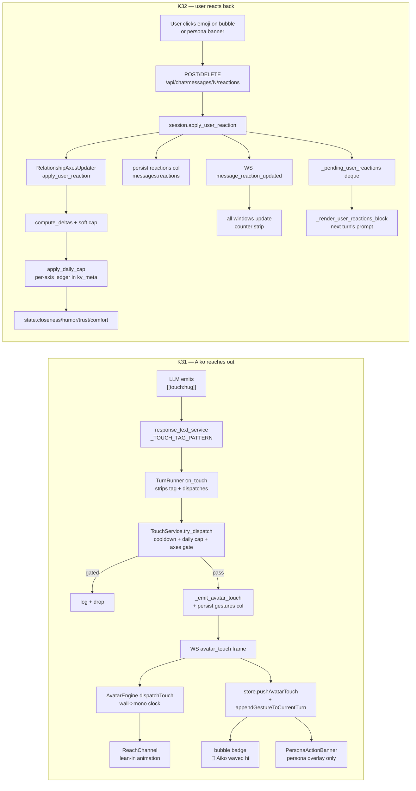

# Shipped — Companion patterns K31–K60

Part of the [shipped log index](../shipped.md). One paragraph per entry; full detail lives in the linked implementation files.

---

## K31 + K32. Soft physicality round-trip — virtual touch + user-side reactions

Two complementary halves of the same round-trip: K31 gives Aiko a small bag of virtual gestures (`[[touch:KIND]]` tags — wave, poke, boop, nudge, high-five, hug, head-pat, cuddle) that she can drop into a turn when the moment calls for them; K32 gives the user six emoji buttons (💛 🫂 😂 👍 🌹 🫢) on every assistant bubble (and on the persona overlay) to react back. Each direction is rate-limited and budget-gated so the channel stays a *signal* rather than a stim button. The Live2D rig has no Z-depth and no arm-control parameters, so K31's gesture is approximated with a head + body lean-in via a dedicated `ReachChannel`; the *literal* meaning lands in the bubble badge (`👋 Aiko waved hi`) and, in persona mode, in a transient `PersonaActionBanner`. K32 reactions both render counters on the bubble and nudge the relationship axes (closeness / humor / trust / comfort) via a daily-capped delta table — so a long stretch of 💛-clicks slowly builds closeness without ever turning into a "click here for +1 affection" exploit.

### Decision flow

### K31 taxonomy

Eight kinds, each with a label, emoji, default lean-in degrees, default duration, paired overlays, and a relationship-axis floor that gates whether the gesture is even allowed to fire. Defaults live in [`app/core/touch/touch_gestures.py`](../../../app/core/touch/touch_gestures.py) `_TOUCH_GESTURES` and are surfaceable as JSON via the `get_touch_state()` MCP tool:

| kind | label | emoji | lean ° | overlays | axis floor |
|---|---|---|---|---|---|
| `wave` | waved hi | 👋 | small | wave overlay | none |
| `poke` | poked you | 👉 | small | smirk | humor ≥ 0.0 |
| `boop` | booped your nose | 👈 | small | playful smirk | humor ≥ 0.2 |
| `nudge` | nudged you | 🤝 | small | soft smile | none |
| `high_five` | high-fived you | ✋ | medium | grin | humor ≥ 0.1 |
| `hug` | gave you a hug | 🫂 | large | warm smile + blush | closeness ≥ 0.3 |
| `head_pat` | patted your head | 🫳 | medium | warm smile | closeness ≥ 0.2 |
| `cuddle` | snuggled in | 🤗 | large | warm smile + blush + heart-eyes | closeness ≥ 0.5, trust ≥ 0.3 |

Cooldowns + per-kind daily caps live in `TouchService` and are configurable via `agent.touch_per_kind_overrides` so an end-user can throttle intimate gestures further or open up the playful ones without code changes.

### K32 reaction taxonomy

Six kinds, each carrying a small per-click axis delta (capped at 0.04 per axis per click, soft-cap clipping when an axis lands above ±0.85). All deltas are positive on the relevant axis; the daily cap on cumulative axis movement is `agent.user_reactions_daily_cap_per_axis=0.15`. `surprise` is a signal-only kind — no axis movement, just renders in the inner-life cue.

| kind | emoji | label | closeness | humor | trust | comfort |
|---|---|---|---|---|---|---|
| `heart` | 💛 | love | +0.03 | — | — | — |
| `hug` | 🫂 | hug back | +0.025 | — | +0.01 | +0.015 |
| `laugh` | 😂 | laugh | +0.005 | +0.035 | — | — |
| `thumbs` | 👍 | thumbs up | — | — | +0.015 | +0.005 |
| `rose` | 🌹 | rose | +0.035 | — | — | +0.01 |
| `surprise` | 🫢 | surprise | — | — | — | — |

### Architecture

- **Pure modules** [`app/core/touch/touch_gestures.py`](../../../app/core/touch/touch_gestures.py) and [`app/core/relationship/user_reactions.py`](../../../app/core/relationship/user_reactions.py) — frozen dataclasses, no I/O. `TouchService` is the only stateful surface and persists `TouchServiceState` (per-kind last-fired monotonic + daily counts + ISO daily date) on `kv_meta` key `aiko.touch_state`. `user_reactions` exposes `compute_deltas` / `apply_daily_cap` / `render_user_reactions_block` / `reactions_metadata` plus the `DailyCapState` carrier persisted on `kv_meta` key `aiko.user_reactions_daily`. Same `aiko.*` namespace as K15 / K27 / K30.
- **Schema v15** [`app/core/infra/chat_database.py`](../../../app/core/infra/chat_database.py) — bumps `_SCHEMA_VERSION` from 14 to 15 and adds two nullable JSON-encoded TEXT columns on `messages`: `gestures` (`[[touch:KIND]]` list per turn) and `reactions` (`{kind: count}` map). Helpers `update_message_gestures` / `update_message_reactions` write through `json.dumps`; the row readers decode lazily. The migration preserves all existing rows and the new columns default to `NULL` — no rebuild path required.
- **Tag parser + streaming guard** [`app/core/services/response_text_service.py`](../../../app/core/services/response_text_service.py) — new `_TOUCH_TAG_PATTERN` (closed) + `_TOUCH_OPEN_TAIL_PATTERN` (held-back open) wired into `extract_touch_commands`, `strip_all_meta_tags`, and `safe_visible_prefix`. The streaming dispatcher (`TurnRunner._dispatch_chunk_with_earcons`) parses closed tags as they land, fires `on_touch(kind)` once per tag, and strips them from the visible / TTS streams; half-open `[[touch` at the end of a chunk is held back until the next delta so the user never sees `[[touch...` in the transcript.
- **TurnRunner hook** [`app/core/llm/turn_runner.py`](../../../app/core/llm/turn_runner.py) — `run` accepts an optional `on_touch` callback parameter; defaults to a no-op so non-K31 callers stay unaffected. The dispatcher invokes it inline alongside the existing `on_reaction` / `on_earcon` callbacks.
- **Avatar mixin glue** [`app/core/session/avatar_mixin.py`](../../../app/core/session/avatar_mixin.py) — `_touch_service` lazy-init, `_avatar_touch_listeners` listener list with `add_avatar_touch_listener` (REST + WS), `_emit_avatar_touch(kind)` (calls `TouchService.try_dispatch`, broadcasts the WS frame on pass, logs gated-drop reasons), `_persist_turn_gestures(message_id, gestures)` (writes the JSON-encoded list to the new column post-turn).
- **Controller wiring** [`app/core/session/session_controller.py`](../../../app/core/session/session_controller.py) — `TouchService` instantiation, `_pending_user_reactions: deque` (fed by `apply_user_reaction`, drained by the inner-life provider), the `add_message_reaction_listener` plumbing for the `message_reaction_updated` WS broadcast, the `apply_user_reaction(message_id, kind)` and `remove_user_reaction(message_id, kind)` public methods, and provider registrations: `user_reactions=self._render_user_reactions_block` and `touch_state=self._render_touch_state_block`.
- **Axes updater** [`app/core/relationship/relationship_axes.py`](../../../app/core/relationship/relationship_axes.py) — new `apply_user_reaction(user_id, *, kind, daily_cap=0.15)` method threads through `user_reactions.compute_deltas` → `apply_daily_cap` → state mutate → `_MAX_DELTA` clamp → save. The daily-cap state advances even on a fully-capped click so the rollover at midnight UTC lands cleanly on the first reaction of the new day.
- **Inner-life providers** [`app/core/session/inner_life_providers_mixin.py`](../../../app/core/session/inner_life_providers_mixin.py) — `_render_user_reactions_block` drains `_pending_user_reactions` once per turn (silent on empty) and renders a one-line cue summarising what just happened ("Jacob hearted your reply"; "Jacob reacted with 💛 and 🫂"). `_render_touch_state_block` reads `TouchService` daily counts and surfaces a warning cue when intimate gestures (hug + cuddle + head_pat) have already hit a high count today — Aiko's "physical budget" reminder.
- **Prompt assembler** [`app/core/session/prompt_assembler.py`](../../../app/core/session/prompt_assembler.py) — two new provider slots (`user_reactions`, `touch_state`) plus a `_TOUCH_GRAMMAR_ADDENDUM` constant folded into the system prompt next to the existing motion / overlay grammars. The grammar teaches the LLM the eight kinds and explicitly tells it not to narrate the gesture in prose (the badge is the surface).
- **Post-turn hook** [`app/core/session/post_turn_mixin.py`](../../../app/core/session/post_turn_mixin.py) — calls `_persist_turn_gestures` right after the assistant-message persist (same try/except envelope as the rest of the post-turn cluster).
- **REST + WS** [`app/web/server.py`](../../../app/web/server.py) — `POST /api/chat/messages/{id}/reactions` (body: `{kind}`) and `DELETE /api/chat/messages/{id}/reactions/{kind}`, both gated on `agent.user_reactions_enabled`. Two new WS broadcasters: `avatar_touch` (wire shape: `{type, kind, label, emoji, duration_ms, lean_amount, overlays}`) and `message_reaction_updated` (`{type, message_id, reactions}`). Listeners are registered alongside the existing avatar / shared-moment listener plumbing.
- **Frontend channels** [`web/src/live2d/channels/ReachChannel.ts`](../../../web/src/live2d/channels/ReachChannel.ts) — new `AvatarChannel` that writes `ParamAngleY` + `ParamBodyAngleY` deltas on a symmetric ease-out / ease-in curve (peaks at midpoint, smooth ramp-up + ramp-down). Read-modify-write so it composes additively on top of `AmbientBodyChannel`'s valence-tilt / lean-in / slump. Capability-gated on `has_body_angle_y` and `has_head_angle_y` independently so minimal rigs still get the lean. Registered after `AmbientBodyChannel` in `Live2DAvatar.tsx` so the write order is correct.
- **Engine fan-out** [`web/src/live2d/AvatarEngine.ts`](../../../web/src/live2d/AvatarEngine.ts) — `dispatchTouch(payload)` converts the wall-clock `duration_ms` from the WS frame into a monotonic `until` and fires `channel.onTouch?.(event)` on every registered channel. Same wall-to-mono pattern as `dispatchOverlay`.
- **StoreBridge** [`web/src/live2d/StoreBridge.ts`](../../../web/src/live2d/StoreBridge.ts) — subscribes to `avatarTouchAt` (the dedup counter) and dispatches the latest `avatarTouch` payload to the engine on every bump. Symmetric with the overlay bridge.
- **Zustand store** [`web/src/store.ts`](../../../web/src/store.ts) — three new pieces: `avatarTouch: AvatarTouchPayload | null` + `avatarTouchAt: number` for K31 (`pushAvatarTouch` reducer increments the counter); `appendGestureToCurrentTurn(kind)` adds to the streaming assistant bubble's `gestures` array; `applyMessageReactions(messageId, reactions)` is the optimistic + WS-reconcile reducer for K32.
- **ChatView** [`web/src/components/ChatView.tsx`](../../../web/src/components/ChatView.tsx) — `MessageBubbleImpl` grows a gesture-badge strip below assistant bubbles when `gestures.length > 0`, a persistent reaction counter strip when `reactionEntries.length > 0`, and a hover-tray of the six reaction emojis gated on `canReact` (`!isUser && !streaming && backendId != null`). The hover tray hides kinds already in the persistent strip; clicking either fires `api.addReaction` / `api.removeReaction` with optimistic store updates and toast-on-fail.
- **PersonaActionBanner** [`web/src/components/PersonaActionBanner.tsx`](../../../web/src/components/PersonaActionBanner.tsx) — the persona overlay window has no chat bubbles, so K31's badge has no home there. This banner is the canonical persona-mode equivalent: a transient pill at `inset-x-2 top-12` showing the gesture label + the six K32 reaction buttons. Auto-dismisses after `agent.persona_touch_banner_duration_seconds` (default 20s), replaces (not stacks) on a fresh gesture, and rolls back optimistic reaction writes on REST failure. Gated on `agent.persona_touch_banner_enabled`.
- **Persona** [`data/persona/aiko_companion.txt`](../../../data/persona/aiko_companion.txt) — new "Reaching out" block after the K15 "Sharing yourself" section. Preamble + eight `use when` lines + the physical budget paragraph + the reciprocity paragraph (teaches Aiko to treat a 💛 click as a quiet "yes, that landed", not a call for a callback).
- **Settings** (9 new `AgentSettings` fields, all parsed with documented clamps):
  - `touch_enabled: bool = True`, `touch_per_kind_overrides: dict = {}` (cooldown / daily cap overrides keyed by kind),
  - `user_reactions_enabled: bool = True`, `user_reactions_daily_cap_per_axis: float = 0.15`,
  - `persona_touch_banner_enabled: bool = True`, `persona_touch_banner_duration_seconds: int = 20`.

### MCP-debuggable

Three new tools in [`app/mcp/server.py`](../../../app/mcp/server.py):

- `get_touch_state()` — JSON dump: master switch, `TouchService` per-kind cooldown state + daily counts + ISO daily date, full gesture taxonomy snapshot (`_TOUCH_GESTURES`), live axes for gate evaluation.
- `send_touch(kind: str)` — force-fires a `[[touch:KIND]]` gesture bypassing every gate (cooldowns, daily caps, axes floors). Mirrors what the post-turn TouchService dispatch would have done. Returns the dispatched gesture payload or an error JSON on unknown kinds.
- `add_user_reaction(message_id: int, kind: str)` — fakes a user click; runs through the same `apply_user_reaction` path that the REST POST endpoint uses, so the axes nudge + WS broadcast + inner-life cue all fire identically.

End-to-end repro:

1. `get_touch_state()` — confirms `TouchService` initialised and shows per-kind cooldown state.
2. `send_touch("hug")` — bypasses the gate, force-fires a hug. Verify (a) bubble badge `🫂 Aiko gave you a hug` in chat mode, (b) `ReachChannel` lean-in animates in both windows, (c) `PersonaActionBanner` appears in the open persona window with the gesture label and reaction tray.
3. Click 🫂 on the persona banner. Verify the chat bubble (in the other window) immediately shows the reaction counter via the `message_reaction_updated` WS broadcast.
4. `add_user_reaction(message_id, "heart")` — fakes a click programmatically. Verify the next turn's prompt includes the "Jacob just hearted your reply" cue (via `get_last_response_detail.system_prompt`).
5. Inspect `data/app.log` for `touch dispatched:` (TouchService accept) and `user_reaction axes:` (axes apply with cap info) lines. `tail_logs(module_contains="touch")` is the fastest grep target.

### Files

- [`app/core/touch/touch_gestures.py`](../../../app/core/touch/touch_gestures.py) — new module (~360 LOC): `TouchGesture` frozen dataclass, `_TOUCH_GESTURES` taxonomy table, `TouchService` state machine with cooldown / daily-cap / axes-gate, `TouchServiceState` serde, `render_touch_state_block` cue renderer.
- [`app/core/relationship/user_reactions.py`](../../../app/core/relationship/user_reactions.py) — new module (~310 LOC): `REACTION_KINDS` + delta table, `compute_deltas`, `DailyCapState` serde, `apply_daily_cap` arithmetic, `render_user_reactions_block` cue renderer, `reactions_metadata` snapshot helper.
- [`app/core/infra/chat_database.py`](../../../app/core/infra/chat_database.py) — `_SCHEMA_VERSION = 15`, two new `messages` columns, v14→v15 migration step, `update_message_gestures` / `update_message_reactions` helpers, JSON decode in the row readers.
- [`app/core/infra/settings.py`](../../../app/core/infra/settings.py) — 9 new `AgentSettings` fields with inline context; matching parser entries with floor clamps in `_parse_agent`.
- [`config/default.json`](../../../config/default.json) — 9 new keys under `agent`.
- [`app/core/services/response_text_service.py`](../../../app/core/services/response_text_service.py) — `_TOUCH_TAG_PATTERN`, `_TOUCH_OPEN_TAIL_PATTERN`, `extract_touch_commands`, updates to `strip_all_meta_tags` + `safe_visible_prefix`.
- [`app/core/llm/turn_runner.py`](../../../app/core/llm/turn_runner.py) — `on_touch` callback param threaded through `run` + `_dispatch_chunk_with_earcons`.
- [`app/core/session/avatar_mixin.py`](../../../app/core/session/avatar_mixin.py) — `_touch_service`, `_avatar_touch_listeners`, `_emit_avatar_touch`, `_persist_turn_gestures`, `add_avatar_touch_listener`, `add_message_reaction_listener`.
- [`app/core/session/session_controller.py`](../../../app/core/session/session_controller.py) — `TouchService` boot, `_pending_user_reactions` deque, `apply_user_reaction` / `remove_user_reaction` public methods, provider registrations.
- [`app/core/relationship/relationship_axes.py`](../../../app/core/relationship/relationship_axes.py) — `apply_user_reaction(user_id, *, kind, daily_cap)` method (~80 LOC).
- [`app/core/session/inner_life_providers_mixin.py`](../../../app/core/session/inner_life_providers_mixin.py) — `_render_user_reactions_block` (drains the queue) + `_render_touch_state_block` (physical-budget reminder).
- [`app/core/session/post_turn_mixin.py`](../../../app/core/session/post_turn_mixin.py) — `_persist_turn_gestures` call right after the assistant-message persist.
- [`app/core/session/prompt_assembler.py`](../../../app/core/session/prompt_assembler.py) — two new provider slots, `_TOUCH_GRAMMAR_ADDENDUM` folded into the system prompt.
- [`app/web/server.py`](../../../app/web/server.py) — `POST` + `DELETE` reactions endpoints, `_on_avatar_touch` + `_on_message_reaction_updated` WS broadcasters, listener registrations.
- [`app/mcp/server.py`](../../../app/mcp/server.py) — `get_touch_state`, `send_touch`, `add_user_reaction` debug tools.
- [`web/src/live2d/types.ts`](../../../web/src/live2d/types.ts) — `AvatarTouchPayload`, `ResolvedTouchEvent`, `onTouch?` hook on `AvatarChannel`.
- [`web/src/live2d/channels/ReachChannel.ts`](../../../web/src/live2d/channels/ReachChannel.ts) — new channel (~210 LOC).
- [`web/src/live2d/AvatarEngine.ts`](../../../web/src/live2d/AvatarEngine.ts) — `dispatchTouch` method.
- [`web/src/live2d/StoreBridge.ts`](../../../web/src/live2d/StoreBridge.ts) — `avatarTouchAt` subscription.
- [`web/src/live2d/index.ts`](../../../web/src/live2d/index.ts) — exports `AvatarTouchPayload` + `ResolvedTouchEvent`.
- [`web/src/components/Live2DAvatar.tsx`](../../../web/src/components/Live2DAvatar.tsx) — registers `ReachChannel`.
- [`web/src/types.ts`](../../../web/src/types.ts) — `ChatMessage.gestures` + `ChatMessage.reactions`, `AvatarTouchPayload`, `USER_REACTION_KINDS`, `TOUCH_GESTURE_LABELS`, two new `AssistantWsEvent` variants.
- [`web/src/store.ts`](../../../web/src/store.ts) — `avatarTouch` / `avatarTouchAt`, `pushAvatarTouch`, `appendGestureToCurrentTurn`, `applyMessageReactions` reducers.
- [`web/src/hooks/useAssistantSocket.ts`](../../../web/src/hooks/useAssistantSocket.ts) — `avatar_touch` + `message_reaction_updated` cases.
- [`web/src/api.ts`](../../../web/src/api.ts) — `addReaction` / `removeReaction` client functions.
- [`web/src/components/ChatView.tsx`](../../../web/src/components/ChatView.tsx) — gesture badge strip + reactions strip + hover tray on `MessageBubbleImpl`.
- [`web/src/components/PersonaActionBanner.tsx`](../../../web/src/components/PersonaActionBanner.tsx) — new component (~250 LOC).
- [`web/src/components/PersonaWindow.tsx`](../../../web/src/components/PersonaWindow.tsx) — mounts the banner over the Live2D zone.
- [`data/persona/aiko_companion.txt`](../../../data/persona/aiko_companion.txt) — new "Reaching out" section.
- [`tests/test_touch_gestures.py`](../../../tests/test_touch_gestures.py) — 29 tests: taxonomy completeness + ordering + per-kind axes floors, `TouchServiceState` serde, `try_dispatch` happy path / cooldown / daily cap / midnight rollover, axes-gate behaviour (under / equal / above threshold), `bypass_gates` shortcut, per-kind overrides for cooldown + daily cap, `render_touch_state_block` cue bands.
- [`tests/test_user_reactions.py`](../../../tests/test_user_reactions.py) — 22 tests: taxonomy completeness, `compute_deltas` per-kind + soft-cap, `surprise` is signal-only, `DailyCapState` serde + kv round-trip, `apply_daily_cap` arithmetic + rollover + trim-and-block, `render_user_reactions_block` (single / multi-same / mixed), `reactions_metadata` snapshot shape.
- [`tests/test_chat_database_v15_migration.py`](../../../tests/test_chat_database_v15_migration.py) — 8 tests: fresh DB has `_SCHEMA_VERSION=15`, `gestures` + `reactions` columns exist + default NULL, update helpers JSON round-trip, simulated v14 → v15 upgrade preserves rows and adds the columns.
- [`tests/test_response_text_service_touch.py`](../../../tests/test_response_text_service_touch.py) — 12 tests: `extract_touch_commands` single / multiple / case-insensitive / empty, `strip_all_meta_tags` removes touch tags + partial open tails, `safe_visible_prefix` holds back half-open `[[touch...` and `[[touch:hu...` without leaking partial kind names.
- [`tests/test_touch_user_reaction_providers.py`](../../../tests/test_touch_user_reaction_providers.py) — 9 tests: `_render_user_reactions_block` drains the queue / silent on empty / master-switch gate / mixed kinds; `_render_touch_state_block` warns on high intimate-count, silent on blank or stale daily counts, master-switch gate.
- [`tests/test_web_server_reactions.py`](../../../tests/test_web_server_reactions.py) — 12 tests: POST happy path + counter increment, POST 400 on unknown / missing kind, POST 404 on unknown message, POST 403 when feature disabled, DELETE happy path + counter decrement + key-removal at zero, DELETE error parity, WS listener wiring through `apply_user_reaction`.
- [`tests/test_relationship_axes_user_reaction.py`](../../../tests/test_relationship_axes_user_reaction.py) — 5 tests: `heart` lands closeness only, `hug` lands closeness + trust + comfort, `surprise` no-ops, daily cap state persists through `kv_meta`, cap blocks further movement once exhausted.
- [`web/src/live2d/channels/ReachChannel.test.ts`](../../../web/src/live2d/channels/ReachChannel.test.ts) — 11 tests: lean-in writes body + head deltas during the pulse, peaks at midpoint, composes additively on top of an AmbientBody baseline, releases cleanly at expiry, restart-on-fresh-touch resets the timeline, capability gates (body-only rig / no-angle rig / expired event).
- [`web/src/components/PersonaActionBanner.test.tsx`](../../../web/src/components/PersonaActionBanner.test.tsx) — 16 source-level wiring tests: store subscriptions, latest-assistant-id lookup, 20s default + 1s floor + replace-not-stack timer, `enabled` gate (off + flip-mid-life), `api.addReaction` / `removeReaction` round-trip, optimistic-write rollback on error, per-button disable while busy, taxonomy fallback paths.
- [`web/src/components/ChatView.reactions.test.tsx`](../../../web/src/components/ChatView.reactions.test.tsx) — 12 source-level wiring tests: K31 badge strip wiring + fallback emoji, K32 reaction strip + hover tray gating on `canReact`, `onToggleReaction` dispatch, taxonomy contract assertion against the shared `types.ts` exports.
- [`docs/personality-backlog/patterns.md`](../patterns.md) — K31 + K32 section bodies replaced with `**Shipped**` pointers.
- [`AGENTS.md`](../../../AGENTS.md) — new "Soft physicality" Code Conventions bullet + new debugging-table row.
- [`docs/tauri-shell.md`](../../../docs/tauri-shell.md) — `PersonaActionBanner` now documented as the canonical persona-mode equivalent of chat-mode bubble badges.

## K36. "Things I did while you were away" — idle-time world activities

Aiko's room only ever reflected the *present*. K36 gives her a quiet autonomous life: during idle windows a new [`IdleAwayActivityWorker`](../../../app/core/world/idle_activity_worker.py) picks one small activity tied to her actual room inventory (sip the tea you left, curl up with a book, the cat keeps her company, tidy the desk, look out the window, doodle, or just let her thoughts wander), **mutates** the world to match (`set_state(posture, activity)` plus `consume_item` / `update_item` where apt, broadcasting `world_updated` so the World tab updates live), composes a first-person summary (deterministic template + optional local-LLM rephrase), and appends `{at, activity, summary}` to a small `kv_meta` journal ring (`aiko.away_activities`). Pairs with K28 turning-over: K28 surfaces what Aiko has been *thinking* about, K36 surfaces what she's been *doing*.

Pacing mirrors `WorldNoticeWorker`: quiet-gated by the scheduler, paced by its own cooldown + daily cap (kv watermarks, local-midnight reset), and it stands down while a garden visit is outstanding so it doesn't fight `GardenVisitWorker` over Aiko's location.

**Passive surfacing (K28 pattern, not a proactive nudge).** [`post_turn_mixin._maybe_arm_away_activities_slot`](../../../app/core/session/post_turn_mixin.py) stashes the gap on `_pending_away_activities_seconds` when a typed turn lands after `memory.away_activities_min_gap_hours` (default 4h, longer than K28's 90 min; voice turns never arm it). The [`_render_away_activities_block`](../../../app/core/session/inner_life_providers_mixin.py) provider reads + clears the slot, reads the journal, surfaces the newest entry past the `away_activity.last_surfaced_at` watermark, and renders one casual "While {user} was away, you … — drop it if it doesn't fit" line. A shared `_gap_cue_surfaced` flag (set by `turning_over`, which runs first) guarantees at most one of {`turning_over`, `away_activities`} fires per return. The block sits in the T6 detector tier of [`prompt_assembler.py`](../../../app/core/session/prompt_assembler.py) immediately after `turning_over_block`, survives aggressive mode, and is not in the K16 grounding-line suppression set.

**Settings.** `agent.away_activities_enabled` (master) + `memory.away_activities_{interval,cooldown}_seconds` / `_daily_cap` / `_min_gap_hours` / `_journal_max`, all clamped in `load_settings`. Persona guidance: the "Things I did while you were away" block in [`aiko_companion.txt`](../../../data/persona/aiko_companion.txt). MCP debug ([`app/mcp/server.py`](../../../app/mcp/server.py)): `get_away_activities_state`, `force_away_activity(key)`, `force_away_activities_surface()` — repro is `force_away_activity()` → `force_away_activities_surface()` → `send_message(skip_tts=true)` → confirm the line in `get_last_response_detail.system_prompt`.

Tests: [`tests/test_idle_activity_worker.py`](../../../tests/test_idle_activity_worker.py) (activity pick + world mutation + journal ring + cooldown / cap / garden-visit gates), [`tests/test_post_turn_away_activities.py`](../../../tests/test_post_turn_away_activities.py) (the arming gate matrix), and `AwayActivitiesProviderTests` in [`tests/test_prompt_assembler.py`](../../../tests/test_prompt_assembler.py) (slot ordering after turning_over + aggressive-mode retention).

---

## K34. Forward curiosity worker — "I've been wondering"

The third member of the gap-return family. K28 turning-over surfaces what Aiko has been *thinking* about between sessions; K36 away-activities surfaces what she's been *doing*; K34 surfaces what she *wants to ask the user* about their life — "did the espresso machine arrive?", "how did your sister's move go?". Distinct from the four existing curiosity systems: G3 `IdleCuriosityWorker` answers Aiko's *own* open questions via web search; K9 `CuriositySeedWorker` proposes brand-new lateral topics; the speaking-window `CuriosityWorker` drafts next-turn follow-ups; `FollowUpWorker` drafts a time-anchored "ask how their plan went" cue near an event's `event_time` (also a kv-ring cue, surfaced on the next turn, not a verbatim nudge). K34 alone drafts forward *questions* about the user's life and surfaces one passively on gap-return.

**Producer.** During quiet windows a new [`ForwardCuriosityWorker`](../../../app/core/proactive/forward_curiosity_worker.py) gathers candidate topics from the user's own `future_plan` memories (`list_by_temporal_type("future_plan")`) and recent `callback` rows (`iter_by_kind("callback")`), biased by their K3 `routines` / `usual_hours` profile fields, de-dupes against the recent ring by `source_id`, composes ONE short forward question (deterministic "how {topic} is going" fallback + optional local-LLM rephrase via `chat_json`), and appends `{at, question, source, source_id}` to a `kv_meta` journal ring (`aiko.forward_curiosity`). No world mutation, so no garden-visit guard. Paced by its own cooldown + daily cap (kv watermarks, local-midnight reset).

**Passive surfacing (K28/K36 pattern, not a proactive nudge).** [`post_turn_mixin._maybe_arm_forward_curiosity_slot`](../../../app/core/session/post_turn_mixin.py) stashes the gap on `_pending_forward_curiosity_seconds` when a typed turn lands after `memory.forward_curiosity_min_gap_hours` (default 4h; voice turns never arm it). The [`_render_forward_curiosity_block`](../../../app/core/session/inner_life_providers_mixin.py) provider reads + clears the slot, re-checks the gap, reads the ring, surfaces the newest entry past the `forward_curiosity.last_surfaced_at` watermark, and renders one casual "You've been wondering {question} — if it comes up naturally, you can ask. Drop it if it doesn't fit." line.

**Mutual-exclusivity (three gap cues now).** The shared `_gap_cue_surfaced` flag was tightened from a two-cue to a three-cue guard: `_render_turning_over_block` *sets* it (runs first), `_render_away_activities_block` now *also* sets it when it fires (previously only read it), and `_render_forward_curiosity_block` reads it and defers (unless force-next). Declaration order in `assemble_with_budget` is `turning_over` > `away_activities` > `forward_curiosity`, so at most one of the three fires per return. The block sits in the T6 detector tier of [`prompt_assembler.py`](../../../app/core/session/prompt_assembler.py) immediately after `away_activities_block`, survives aggressive mode, and is not in the K16 grounding-line suppression set.

**Settings.** `agent.forward_curiosity_enabled` (master) + `memory.forward_curiosity_{interval,cooldown}_seconds` / `_daily_cap` (default 4) / `_min_gap_hours` (default 4.0) / `_journal_max` (default 8), all clamped in `load_settings`. Persona guidance: the "Things I've been wondering about you" block in [`aiko_companion.txt`](../../../data/persona/aiko_companion.txt). MCP debug ([`app/mcp/server.py`](../../../app/mcp/server.py)): `get_forward_curiosity_state`, `force_forward_curiosity_draft(source_id="")`, `force_forward_curiosity_surface()` — repro is `force_forward_curiosity_draft()` → `force_forward_curiosity_surface()` → `send_message(skip_tts=true)` → confirm the "You've been wondering ..." line in `get_last_response_detail.system_prompt`. Log line `forward-curiosity fire:` for `tail_logs(module_contains="forward_curiosity")`.

Tests: [`tests/test_forward_curiosity_worker.py`](../../../tests/test_forward_curiosity_worker.py) (drafting from fake future_plan / callback / routines, dedup against ring, journal-ring trim, cooldown / cap / enabled gates), [`tests/test_post_turn_forward_curiosity.py`](../../../tests/test_post_turn_forward_curiosity.py) (the arming gate matrix), [`tests/test_forward_curiosity_provider.py`](../../../tests/test_forward_curiosity_provider.py) (master switch, one-shot slot clear, threshold double-check, the one-of `_gap_cue_surfaced` guard + force-next override, surfacing watermark), and `ForwardCuriosityProviderTests` in [`tests/test_prompt_assembler.py`](../../../tests/test_prompt_assembler.py) (block lands after away_activities + aggressive-mode retention), plus `ForwardCuriositySettingsTests` in [`tests/test_settings.py`](../../../tests/test_settings.py).

---

## K35. Memory consolidation worker — nightly near-duplicate merge

Auto-extracted scratchpad memories accumulate near-duplicates over weeks: the insert-time dedupe in `MemoryStore.add` only fires at cosine `>= 0.92` against the mirror *at that instant*, so two phrasings of the same fact written days apart (or anything that lands just below the bar) both survive and inflate RAG noise. K35 is the periodic cleanup pass. Complements F5: F5 finds *contradicting* pairs in `[0.80, 0.92)` and demotes the loser; K35 finds tight *near-duplicates* and *fuses* them.

**Worker** ([`MemoryConsolidationWorker`](../../../app/core/memory/memory_consolidation_worker.py), `name="memory_consolidation"`). One tick: (1) **corpus** = scratchpad rows inside `consolidation_lookback_days` (default 30), dropped if pinned / blank / no embedding, capped at `consolidation_max_corpus`; (2) **cluster** via the same vectorised all-pairs NumPy cosine as F5 — for each unprocessed anchor, gather rows at/above `consolidation_similarity_threshold` (default 0.90, just under the 0.92 insert-dedupe) that share the anchor's `kind` AND are flagged `HEURISTIC_NO` by [`conflict_heuristics.classify_pair`](../../../app/core/memory/conflict_heuristics.py) (contradictions are left for F5); star-clusters don't chain, capped at `consolidation_max_clusters_per_run` (default 20); (3) **merge** — pick the primary (highest `confidence` -> `salience` -> newest), fuse the cluster's contents into one sentence via a rate-limited worker-LLM `chat_json` call (`surface="memory_consolidation"`), with the primary's own content as the deterministic fallback on rate-limit / parse / network failure; (4) **commit** — `MemoryStore.update` the primary in place (merged content, re-embedded **only if the text changed**, `salience`/`confidence` lifted to the cluster max, `tier="long_term"`, `metadata.source_ids` provenance), then archive each absorbed duplicate (`tier="archive"`, `metadata.consolidated_into=primary_id`), firing `notify_memory_updated` for every touched row so the Memory tab stays live.

**Wire-up** ([`session_controller.py`](../../../app/core/session/session_controller.py)). Registered next to the F5 block, gated on `_idle_scheduler` + `_memory_store` + `_embedder` + `agent.memory_consolidation_enabled`. Uses a dedicated [`FactCheckRateLimiter`](../../../app/core/memory/fact_check_rate_limiter.py) with `state_key="memory_consolidation.rate_state"` so the merge budget is independent of F1 / F5 / G3.

**Settings** ([`settings.py`](../../../app/core/infra/settings.py)). `agent.memory_consolidation_enabled` (master) + `memory_consolidation_per_hour_cap` (6) / `_per_day_cap` (30); `memory.consolidation_interval_seconds` (21600 = 6h), `_lookback_days` (30), `_similarity_threshold` (0.90), `_max_corpus` (1000), `_max_clusters_per_run` (20), `_min_cluster_size` (2), all clamped in `load_settings`.

**MCP debug** ([`app/mcp/server.py`](../../../app/mcp/server.py)): `get_memory_consolidation_state` (switches / cadence / threshold / caps / rate-limiter budget) and `force_memory_consolidation()` (runs `run()` bypassing the idle gates; the per-run cap + merge rate limiter still apply). `force_run("memory_consolidation")` works via the scheduler too. Log grep: `tail_logs(module_contains="memory_consolidation")` shows `memory-consolidation merged: primary=… absorbed=[…] llm=…`.

Tests: [`tests/test_memory_consolidation_worker.py`](../../../tests/test_memory_consolidation_worker.py) (clustering + threshold boundary + same-kind + contradiction guard, primary selection, LLM merge + fallback + rate-limit fallback, re-embed only on text change, archive + provenance, caps, pinned / out-of-window / enabled gates) and `ConsolidationSettingsTests` in [`tests/test_settings.py`](../../../tests/test_settings.py).

---

## K38. Self-correction cue — next-turn contradiction catch

The missing third corner of the contradiction family. F5 finds two *stored* memories that contradict; K29 finds Aiko's stored stance vs the *user's* claim; K38 finds Aiko's just-spoken *reply* contradicting her own high-confidence `fact`/`preference` memory. An in-flight stream can't be rewound, so K38 ships as a **next-turn cue** with **lexical-only** detection — Aiko owns the slip naturally on her following turn ("oh wait — earlier I said X, that's not right, it's actually Y"). The embedding-based same-reply "wait, actually" mid-stream variant is captured as [K41](../patterns.md#k41-same-reply-mid-stream-self-correction-embedding-variant).

**Detector** ([`self_correction_detector.py`](../../../app/core/conversation/self_correction_detector.py), pure + embedding-free). `detect_self_correction(assistant_text, memories, *, min_confidence, min_overlap, max_candidates) -> SelfCorrectionHit | None`: split the reply into sentences, build the candidate pool (`fact`/`preference` kinds, `confidence >= min_confidence` default 0.6, capped at `max_candidates` highest-confidence first), then for each sentence shortlist memories sharing `>= min_overlap` content words (default 2) and run the shared F5 [`conflict_heuristics.classify_pair`](../../../app/core/memory/conflict_heuristics.py)`(sentence, memory.content)`. Returns the strongest hit (`definite` > `borderline`, higher overlap as tiebreak) as a frozen `SelfCorrectionHit{reply_snippet, memory_id, memory_content, label, overlap, signals}`. No embed call, so it adds zero stream latency.

**Post-turn arming** ([`post_turn_mixin.py`](../../../app/core/session/post_turn_mixin.py)). `_maybe_arm_self_correction(assistant_text)` runs near the K8 `_pending_rupture` block: gated by `agent.self_correction_enabled` + a `_self_correction_cooldown_remaining` counter (decrements every post-turn, only runs the detector at 0). On a hit it sets `_pending_self_correction` and resets the cooldown to `memory.self_correction_cooldown_turns` (default 3). Pulls `fact` + `preference` rows via `memory_store.iter_by_kind`.

**Provider** ([`inner_life_providers_mixin.py`](../../../app/core/session/inner_life_providers_mixin.py)). `_render_self_correction_block` mirrors `_render_rupture_block`: read + clear `_pending_self_correction`, render one "Heads-up: a moment ago you said \"{snippet}\", but you'd noted {memory}. …" line. One-shot, master-switch gated, **independent of the gap-cue family** (does NOT touch `_gap_cue_surfaced`). Survives `aggressive=True` — an owed correction must land.

**Assembler wiring** ([`prompt_assembler.py`](../../../app/core/session/prompt_assembler.py)). `_self_correction_provider` slot + `self_correction=` kwarg in `set_inner_life_providers`; `"self_correction_block"` added to the T6 detector cluster in `_PROMPT_BLOCK_TIERS` (right after `rupture_block`); built in a timed `provider_ms` phase and appended next to the rupture cue. [`session_controller.py`](../../../app/core/session/session_controller.py) registers the provider, inits `_pending_self_correction=None` + `_self_correction_cooldown_remaining=0` next to `_pending_rupture`, and clears both on session switch + full history wipe.

**Settings** ([`settings.py`](../../../app/core/infra/settings.py)). `agent.self_correction_enabled` (master) + `memory.self_correction_min_confidence` (0.6, clamp [0,1]), `_min_overlap` (2, clamp >= 1), `_max_candidates` (50, clamp >= 1), `_cooldown_turns` (3, clamp >= 0).

**Persona** ([`aiko_companion.txt`](../../../data/persona/aiko_companion.txt)). "Catching myself" block: own the slip lightly and once, never a grovel, drop it silently if it no longer matters.

**MCP debug** ([`app/mcp/server.py`](../../../app/mcp/server.py)): `get_self_correction_state` (enabled / pending hit / cooldown_remaining / thresholds) and `force_self_correction(reply_text="")` (run the detector against `reply_text` or the last assistant message, bypass the cooldown, arm the cue). Log grep: `tail_logs(module_contains="self_correction")` shows `self-correction fire: memory_id=… label=… overlap=… snippet=…`.

Tests: [`tests/test_self_correction_detector.py`](../../../tests/test_self_correction_detector.py) (contradiction found/not, confidence gate, kind allow-list, overlap shortlist, strongest-hit, hit shape), [`tests/test_post_turn_self_correction.py`](../../../tests/test_post_turn_self_correction.py) (master switch + cooldown + hit/no-hit arming), `SelfCorrectionProviderTests` in [`tests/test_prompt_assembler.py`](../../../tests/test_prompt_assembler.py) (lands / silent / one-shot / aggressive), `SelfCorrectionSettingsTests` in [`tests/test_settings.py`](../../../tests/test_settings.py).

---

## K43. Promise follow-through — close the loop on "I'll look into that"

The system extracted Aiko's promises (`PromiseExtractor`, `kind="promise"`) and could surface them via RAG, but nothing ever verified she *did* them: `world_mixin.note_promise_kept()` was a stub, `FollowUpWorker` only nudges the *user's* `future_plan` memories, and the assistant regex missed the most common shape ("I'll look into that"). Real friends either come back with the thing or own that they haven't gotten to it — Aiko's commitments just died in RAG. K43 closes the loop with a **lifecycle on metadata** (no schema change), an **idle worker** that arms a one-shot cue, and **two auto-fulfilment paths**. The "admit you haven't yet" branch is treated as equal-rank follow-through — that's the human beat.

**Lifecycle** ([`promise_lifecycle.py`](../../../app/core/memory/promise_lifecycle.py), pure). Promise rows carry `metadata.promise_status` (`open → surfaced → fulfilled | dropped`) + `metadata.promise_who` (`assistant`/`user`); legacy rows read as `open` and fall back to the `"Aiko promised:"` content prefix for sidedness. Helpers: `promise_status` / `is_assistant_promise` / `promise_what` (strips the actor prefix) / `promise_age_hours` / `humanize_age` / `find_fulfilled(promises, reply_text, min_overlap)` — the fulfilment matcher is lexical content-word overlap (reusing the F5 `_content_words` tokenizer), with a short-body rule: promises with fewer content words than `min_overlap` require *all* of them. [`PromiseExtractor._persist`](../../../app/core/memory/promise_extractor.py) now stamps `{promise_who, promise_status: "open"}` on every new row, and the assistant pattern set was widened to catch `look into / look up / dig into / find out / get back to you / research / read up on / try to find`.

**Worker** ([`promise_followthrough_worker.py`](../../../app/core/proactive/promise_followthrough_worker.py)). Standard `IdleWorker` (default tick 30 min) registered next to `ForwardCuriosityWorker` in [`session_controller.py`](../../../app/core/session/session_controller.py). Per tick: skip if a pending cue already exists or the per-fire cooldown (`cooldown_hours`, default 6) hasn't elapsed; scan `iter_by_kind("promise")` for **open assistant-side** rows; flip rows older than `drop_after_days` (default 14) to `dropped`; among rows older than `min_age_hours` (default 4 — closing the loop 5 minutes later reads robotic), arm the **oldest** (longest-owed first): stamp `surfaced` + write a one-shot pending payload `{memory_id, what, age_hours, at}` into kv_meta (`promise_followthrough.pending`). kv (not a controller attribute) so an armed cue survives a restart instead of orphaning a `surfaced` row.

**Provider** ([`inner_life_providers_mixin.py`](../../../app/core/session/inner_life_providers_mixin.py)). `_render_promise_followthrough_block` reads + clears the kv slot, **re-validates against the live row** (a promise fulfilled or deleted between arming and rendering drops silently), and renders one line: "Heads-up: {age} you told {name} you'd {what} — you haven't closed that loop. … mention what you found, or own that you haven't gotten to it yet … don't pretend you did it if you didn't." Independent of the gap-return cue family (does NOT touch `_gap_cue_surfaced`). **Assembler wiring** ([`prompt_assembler.py`](../../../app/core/session/prompt_assembler.py)): `promise_followthrough=` kwarg + `"promise_followthrough_block"` in the T6 cluster of `_PROMPT_BLOCK_TIERS`, pinned directly after `self_correction_block` — both are "own what you owe" beats (slip you made vs loop you left open). Survives `aggressive=True` (the kv slot is already cleared; dropping the block would silently lose the owed beat).

**Fulfilment** (two paths, both → `note_promise_kept()` so the kept-promise signal reaches the relationship axes + moment detector). (1) Post-turn ([`post_turn_mixin.py`](../../../app/core/session/post_turn_mixin.py)): `_maybe_resolve_promises(assistant_text, source="reply")` runs after the K38 arming hook — when Aiko's reply lexically covers an active assistant promise (`memory.promise_fulfil_min_overlap`, default 3 content words), the row flips to `fulfilled`. (2) Task completion ([`task_orchestration_mixin.py`](../../../app/core/session/task_orchestration_mixin.py)): `_on_task_result_event` with `status="done"` resolves against `title + result_summary` — "I'll look into X" followed by a finished background task about X closes the loop without waiting for the next reply.

**Settings** ([`settings.py`](../../../app/core/infra/settings.py)). `agent.promise_followthrough_enabled` (master, also in [`config/default.json`](../../../config/default.json)) + `memory.promise_followthrough_interval_seconds` (1800, floor 30), `_min_age_hours` (4.0, floor 0), `_cooldown_hours` (6.0, floor 0), `_drop_after_days` (14.0, floor 1), `promise_fulfil_min_overlap` (3, floor 1). Doc table in [`docs/configuration.md`](../../../docs/configuration.md).

**Persona** ([`aiko_companion.txt`](../../../data/persona/aiko_companion.txt)). "Things you said you'd do" block after "Catching myself": a promise is a real little debt; bring results in casually mid-flow; owning that you haven't gotten to it IS the follow-through; never invent a result; never open with it like a status report; don't promise things just to sound helpful.

**MCP debug** ([`app/mcp/server.py`](../../../app/mcp/server.py)): `get_promise_followthrough_state` (master switch, per-side status counts, pending payload, cooldown watermark, live knobs, 10 oldest open assistant promises) and `force_promise_followthrough` (calls `worker.force_arm()` — bypasses age + cooldown gates, considers `surfaced` rows too). Repro: make Aiko say "I'll look into X" → `force_promise_followthrough()` → `send_message(skip_tts=true)` → `tail_logs(module_contains="promise")` shows `promise-followthrough armed:` then `promise-followthrough fire:`; fulfilment shows as `promise fulfilled: memory_id=… source=reply|task`.

Tests: [`tests/test_promise_followthrough.py`](../../../tests/test_promise_followthrough.py) (lifecycle status/sidedness/age/fulfilment-matcher purity, worker arming oldest-first + age/cooldown/pending/disabled gates + drop-after ageing, force_arm bypass, kv slot round-trip), `PromiseFollowthroughProviderTests` in [`tests/test_prompt_assembler.py`](../../../tests/test_prompt_assembler.py) (lands / silent / one-shot / aggressive / T6 ordering after self_correction), `PromiseFollowthroughSettingsTests` in [`tests/test_settings.py`](../../../tests/test_settings.py).

### Promise extraction reworked into a context-aware idle worker (Phase 3c rewrite)

The original `PromiseExtractor` had two writer tracks: a **post-turn regex** that captured the bare verb fragment after `I'll` / `I need to` (so "I'll never know" → the memory "Jacob promised: never know") and a **speaking-window LLM** pass that only fired in voice mode. The regex track wrote context-free fragments straight to `tier="long_term"` at confidence `0.85`, polluting the store with unusable rows ("bring you some", "resolve them"). Both tracks were retired.

The sole promise writer is now [`PromiseExtractionWorker`](../../../app/core/memory/promise_worker.py), an `IdleWorker` modelled on `BeliefInferenceWorker`. Per run it snapshots the last `promise_worker_lookback_turns` turns (both user **and** assistant lines, with generous per-message / overall char budgets so the LLM has enough surrounding context to resolve pronouns), privacy-**gates** the window (a URL/email/address-bearing transcript is skipped, but otherwise the original transcript — names intact — goes to the **local** worker LLM so "bring you some" can be resolved to "bring Jacob some tea"), spends one rate-limited `chat_stream` call (dedicated `FactCheckRateLimiter`, `state_key="promise_worker.rate_state"`) for a JSON array of `{who, what, deadline}`, quality-gates each result (idiom stop-list + pronoun-only-object rejection + min content words), dedupes against existing open `kind="promise"` rows (content-word overlap), and persists with the unchanged lifecycle contract (`content="<actor> promised: <what>"`, `metadata={promise_who, promise_status:"open"}`, `tier="long_term"`, `confidence=0.85`) consumed by `promise_lifecycle` / `PromiseFollowthroughWorker`. [`promise_extractor.py`](../../../app/core/memory/promise_extractor.py) is trimmed to just the `Promise` dataclass + `to_memory_content`.

Idle LLM workers were also retuned to run more often (non-blocking + rate-capped): `belief_worker` 3600→1200s (caps 4/20→8/40), `conflict_detector` / `promotion` / `decay` 3600→1800s, `forward_curiosity` / `promise_followthrough` 1800→900s. MCP `get_promise_stats` now returns the worker's config + live rate-limit snapshot; `force_run("promise_worker")` triggers a pass. Settings: `agent.promise_worker_enabled` / `_per_hour_cap` (10) / `_per_day_cap` (60) + `memory.promise_worker_interval_seconds` (600) / `_lookback_turns` (12) / `_max_per_run` (5) / `_max_msg_chars` (2000) / `_max_transcript_chars` (8000). Tests: [`tests/test_promise_worker.py`](../../../tests/test_promise_worker.py) (quality gate, parse, run/persist/dedupe/cap, rate-limit, privacy gate), `PromiseWorkerSettingsTests` in [`tests/test_settings.py`](../../../tests/test_settings.py).

---

## K44. Felt-language affect block — stop leaking robot coordinates

The affect cue used to paste literal floats into the system prompt — `You're feeling content (valence +0.15, arousal 0.40).` — and the circadian line did the same with `your energy is 0.62.` The persona forbids quoting system lines, but numeric coordinates are exactly the token class a model parrots or over-indexes on; worst case Aiko says something spreadsheet-shaped about her own mood. K44 replaces every Aiko-facing numeric affect rendering with **banded felt-language built from direct, forward emotion words** ("genuinely excited, lots of energy", "a bit drained, low energy", "antsy, hard to sit still") — deliberately *not* poetic textures ("quietly glowing"-style phrasing was considered and rejected: purple prose is its own parroting failure mode, and plain circumplex words like "excited" are things Aiko can naturally echo in speech as a feature, not a leak. This was an explicit design decision after user feedback). The raw floats stay on `AffectState` / `CircadianState` for MCP, REST, logs, and the prosody mapper — only the prompt rendering changed.

**Band grid** ([`affect_state.py`](../../../app/core/affect/affect_state.py)). New pure function `felt_phrase(valence, arousal) -> str` over a 5×3 grid (`_FELT_PHRASES`): valence bands `very_negative ≤ -0.5 < negative ≤ -0.15 < neutral < 0.15 ≤ positive < 0.5 ≤ very_positive`, arousal columns `low < 0.35 ≤ mid ≤ 0.65 < high`. Clamp-tolerant (out-of-range lands in the outer bands) and garbage-tolerant (non-numeric input falls back to the dead-centre "pretty even"). `render_ambient_block` now renders `You're feeling {mood_label} — {felt_phrase(...)}.`; the mood label is kept alongside the phrase **on purpose** — the label tracks the fast per-turn reaction tags while the phrase tracks the smoothed scalars, so a disagreement between them is real signal, not redundancy. The "Lately…" trend line was already prose and is unchanged.

**Circadian energy** ([`circadian.py`](../../../app/core/affect/circadian.py)). `ambient_line` now uses a local `_energy_phrase(energy)` band (`running low < 0.25 ≤ dipping < 0.45 ≤ steady < 0.7 ≤ bright`); the drowsy branch reads "your energy is running low and you feel a bit drowsy." The clock time keeps its digits — that's data Aiko is supposed to use verbatim.

**Aiko-voiced worker prompts** ([`reflection_worker.py`](../../../app/core/proactive/reflection_worker.py), [`dream_worker.py`](../../../app/core/proactive/dream_worker.py)). Both mood-context lines (`valence=+0.15, arousal=0.40` shapes) now reuse `felt_phrase` — these LLM calls write Aiko-voiced prose that lands in `reflection` / `[dream]` memories and later surfaces in chat, so numeric coordinates fed in there were a second-order leak into her own remembered voice.

**Audited non-leaks** (no change needed): the K16 grounding line, relationship-axes block, mood-shell contributors, and belief-gap reasons already render words only; MCP tools (`get_status`, `get_*_state`) and log lines intentionally keep raw floats — they're operator surfaces, not prompts.

Tests: `FeltPhraseTests` in [`tests/test_affect_state.py`](../../../tests/test_affect_state.py) (grid corners, both band-boundary ladders, out-of-range clamping, garbage fallback, every-cell-nonempty-no-digits sweep) plus a `render_ambient_block` no-digits regression across scalar combinations including trend lines; [`tests/test_circadian.py`](../../../tests/test_circadian.py) asserts the energy word at six hours of day and that no `\d.\d` float ever appears in `ambient_line` (clock digits exempt).

---

## K45. Mood inertia — instant face, lagging heart

`[[reaction:X]]` can jump excited → sad → calm on consecutive turns; the avatar and TTS follow the *instant* tag while `AffectState` smooths with α=0.35 — so the face teleports and the felt state lags a turn behind, which is exactly backwards from humans (expressions are fast but residue *lingers*; nobody snaps from hurt to chipper in one beat). K45 closes the gap with two coordinated halves: a **one-shot prompt cue** so the *words* carry the residue, and a **mouth-safe Live2D damping pass** so the *face* does too.

**Pure module** ([`mood_inertia.py`](../../../app/core/affect/mood_inertia.py)). `reaction_affect_target(reaction)` stretches each `_REACTION_IMPULSE` row into a full-range implied (valence, arousal) point (`excited` → `(1.0, 1.0)`, `sad` → `(-1.0, 0.1)`); directionless tags (`neutral`, `thoughtful` — impulse magnitude < 0.06) return `None` and can never produce a mismatch. `assess(reaction, valence, arousal, recent_reactions)` measures the valence-weighted distance (weights 1.0 / 0.5, normalised) between the implied target and the **pre-impulse** smoothed state, adds a `+0.15` whiplash bonus when consecutive recent tags flip valence sign (`detect_whiplash` — a pause through neutral breaks the chain), and bands into `none` / `mild` / `strong` (strong at `memory.mood_inertia_mismatch_threshold=0.45`, mild at 0.66 of it). `render_cue` reuses K44's `felt_phrase` for the underneath-state and obeys the K44 no-digits contract; direction-aware copy ("don't snap fully bright" vs "don't plunge all the way down") plus a settling line on whiplash.

**Post-turn detection** ([`post_turn_mixin.py`](../../../app/core/session/post_turn_mixin.py) `_maybe_arm_mood_inertia`). Runs inside `_post_turn_inner_life` right after the K8 rupture block, using the same `affect_before` snapshot (pre-impulse — the fresh tag's own nudge must not shrink its own mismatch). A `_mood_inertia_reactions` deque (maxlen 3) feeds whiplash detection and **always advances, even on gated turns**, so a swing across a cooldown window is still seen. On `band == "strong"` it renders the cue into the one-shot `_pending_mood_inertia` slot (K8 `_pending_rupture` pattern) and arms `memory.mood_inertia_cooldown_turns=3`. Log line: `mood-inertia fire: mismatch=… band=… whiplash=… reaction=…`.

**Provider + tier** ([`inner_life_providers_mixin.py`](../../../app/core/session/inner_life_providers_mixin.py), [`prompt_assembler.py`](../../../app/core/session/prompt_assembler.py)). `_render_mood_inertia_block` consumes the slot once; `mood_inertia_block` lands in the **T5 cluster directly after `mood_hint`** (both are reaction-shaping beats: "carry the mood" then "your face outran the feeling") and is registered in `_PROMPT_BLOCK_TIERS`. **Survives `aggressive=True`** (the slot is already cleared at render time — dropping the block would silently lose the owed beat, same policy as rupture / self-correction) and is intentionally NOT in the K16 suppression matrix. Persona block "When your face outruns the feeling" in [`aiko_companion.txt`](../../../data/persona/aiko_companion.txt) teaches the beat: brighten gradually, residue shows in the words, never narrate the cue.

**Live2D damping — mouth params are NEVER damped** ([`ExpressionChannel.ts`](../../../web/src/live2d/channels/ExpressionChannel.ts)). The avatar manifest now ships `reaction_affect_targets` (built by [`avatar_profile.py`](../../../app/core/persona/avatar_profile.py) from the same Python module — no TS mirror table). In `tickPreModel` the channel computes the same valence-weighted mismatch between the fresh `snap.reaction`'s target and the lagging smoothed `snap.mood` (the lag **is** the inertia signal — `mood_state` lands post-turn, so no new WS event was needed), derives `inertiaFactor = clamp(1 − 0.45·mismatch, 0.55, 1)`, smooths it with `approach()`, and multiplies it into the per-binding write — **but only for bindings outside `mouth_overlay_param_ids` and `lip_sync_ids`**. The grin overlay (Alexia `Param54`) keeps exactly its existing lipsync-suppression taper, and lip-sync params (`ParamMouthOpenY`) are excluded outright (LipsyncChannel owns them and writes last anyway — the exclusion is a defensive guard for rigs whose expression files touch a lipsync param). Damping the mouth would freeze the grin / fight the talking jaw and break TTS-pause readability, which is why the exclusion is a hard requirement, not an optimisation. As the smoothed mood catches up post-turn the factor relaxes back to 1 organically. Gated by `avatar.mood_inertia_damping` (rides the existing `avatar_settings_changed` WS payload + `PATCH /api/avatar`); missing targets / unmapped reaction / absent flag pin the factor at 1 (zero cost on minimal rigs).

**Settings**: `agent.mood_inertia_enabled=true` (cue master), `memory.mood_inertia_mismatch_threshold=0.45` (floor 0.1), `memory.mood_inertia_cooldown_turns=3` (floor 0), `avatar.mood_inertia_damping=true` (avatar half). **MCP debug** ([`app/mcp/server.py`](../../../app/mcp/server.py)): `get_mood_inertia_state` (switches, knobs, reaction ring, cooldown remainder, pending cue, last assessment) and `force_mood_inertia` (one-shot synthetic strong-band cue from the live affect state, bypassing threshold + cooldown). Repro: `force_mood_inertia()` → `send_message(skip_tts=true)` → the "your face just jumped to …" line shows in `get_last_response_detail.system_prompt`; real fires grep as `tail_logs(module_contains="post_turn")` → `mood-inertia fire:`.

Tests: [`tests/test_mood_inertia.py`](../../../tests/test_mood_inertia.py) (target derivation + clamps, whiplash chains, mismatch monotonicity, bands, cue copy + K44 no-digits), [`tests/test_mood_inertia_provider.py`](../../../tests/test_mood_inertia_provider.py) (arming gates: master switch / cooldown decrement / ring-always-advances / pre-impulse usage; render: one-shot consumption, force bypass), `MoodInertiaProviderSlotTests` in [`tests/test_prompt_assembler.py`](../../../tests/test_prompt_assembler.py) (lands, after `mood_hint`, before `mood_shell`, survives aggressive, exception swallowed), `MoodInertiaSettingsTests` in [`tests/test_settings.py`](../../../tests/test_settings.py), a `reaction_affect_targets` manifest assertion in [`tests/test_avatar_profile.py`](../../../tests/test_avatar_profile.py), and a 7-test Vitest block in [`ExpressionChannel.test.ts`](../../../web/src/live2d/channels/ExpressionChannel.test.ts) (proportional damping + floor, **grin byte-identical with damping on/off**, lip-sync binding never damped, suppression taper still active under inertia, missing-targets / directionless-reaction no-ops, factor recovery as mood catches up).

---

## K46. Stance persistence — don't cave on taste pushback

The system actively *taught* Aiko to fold: K20 calibration drops her trust score (and renders a "soften your claims" hedge cue) whenever the user double-checks her, and K29 opinion injection fires her stance once then sits out a long cooldown. Net effect on a *preference* the user mildly questions ("really? you don't like horror?"): she states the take once, then the next mild push reads to K20 as "I might be wrong" and she hedges — the signature chatbot-agreeability tell. K46 draws the missing line between **taste and facts**: pushback on a fact should raise hedging (K20 is right there), pushback on a *preference* should not ("you don't stop disliking horror because someone said 'really??'").

**Pure module** ([`stance_persistence.py`](../../../app/core/conversation/stance_persistence.py)). `evaluate(recent_stance, pushback_band)` returns a frozen `StanceVerdict(hold, reason)` — `hold=True` only when a stance is recent AND the band is exactly `pushback_mild`; a strong correction (`pushback_strong`), an affirmation, a softening, or no signal all return `hold=False`. `render_block(stance_text, user_display_name)` renders the "hold your take" cue, quoting the stored stance for Aiko's reading (capped at `STANCE_SNIPPET_MAXLEN=160`) and explicitly framing the distinction (taste, not a fact being corrected) so the LLM doesn't over-generalise into stubbornness.

**"Recent stance" signal.** When the K29 provider actually returns a cue (inline definite render OR deferred pending-cue render), it sets a per-turn flag `_opinion_injection_cue_emitted` (reset at the top of the provider each turn). The post-turn hook reads that flag and **arms** `_stance_recent_window = memory.stance_persistence_window` (default 3, stashing the stance snippet from `_last_opinion_injection`); on every other turn it **decrements** the window by one. The window is therefore only ever positive starting the turn *after* Aiko stated a taste — K46 never collides with the same turn K29 fired.

**Two touchpoints, one gate.** Both read the same `evaluate(...)`:
1. **Provider (read)** — [`_render_stance_persistence_block`](../../../app/core/session/inner_life_part3.py) classifies the live user turn's band via the K20 [`calibration_detector.detect`](../../../app/core/affect/calibration_detector.py) regex (no vecs — strong / mild / affirmation are pure regex; softening needs the prior-assistant vector and isn't a K46 band anyway), and on `hold` renders the cue. Lands in **T6 directly after `opinion_injection_block`** so the "share your take" + "don't cave" beats read in order; NOT in the K16 suppression set; NOT dropped under aggressive mode.
2. **Post-turn (write shield)** — [`post_turn_mixin.py`](../../../app/core/session/post_turn_mixin.py) wraps the K20 calibration write: when the same gate holds (recent stance + mild pushback) it **skips `apply_signal` entirely** on that turn, so a taste disagreement never erodes Aiko's *factual*-trust calibration. This is the "preference axis" that stops the two detectors fighting; a strong correction is not the mild band and still flows through to K20 normally.

**Settings**: `agent.stance_persistence_enabled=true` (master), `memory.stance_persistence_window=3` (floor 0; `0` disables since the window can never be positive). **MCP debug** ([`memory_worker_tools.py`](../../../app/mcp/server_tools/memory_worker_tools.py)): `get_stance_persistence_state` (switch, window setting, live countdown + stance snippet, force flag, last fire) and `force_stance_persistence` (one-shot bypass on the window — a mild-pushback band is still required). Grep `stance-persistence fire:` (cue) and `stance-persistence: shielded calibration` (write shield) on the `app.session` logger. Repro: `force_stance_persistence()` → send "really? you don't like that?" → the "hold your take" line lands in `get_last_response_detail.system_prompt`.

Persona "When you have your own take" block gained a "DON'T CAVE ON TASTE" bullet teaching the beat: a single easy restatement, stay warm and unbothered, taste doesn't need defending — and the explicit carve-out that a *fact* correction is different (soften + check). Tests: [`tests/test_stance_persistence.py`](../../../tests/test_stance_persistence.py) (pure gate + cue copy + provider plumbing: window gate, mild-only band, strong-correction silence, force bypass, master switch), `StancePersistenceProviderTests` in [`tests/test_prompt_assembler.py`](../../../tests/test_prompt_assembler.py) (lands, after `opinion_injection`, survives aggressive, tier slot), `OpinionInjectionSettingsTests` in [`tests/test_settings.py`](../../../tests/test_settings.py).

---

## K63. Long-arc callbacks — "weeks ago you said..."

K22 already weaves *short-horizon* callbacks and inside-jokes back in, but Aiko rarely reaches **weeks or months** back to connect the live moment to something the user told her long ago ("wait — didn't you once mention your dad's workshop, back in spring?"). That long reach is one of the strongest "she actually knows me" beats a companion can produce, and the whole design is built around **rarity** — over-firing turns "she remembers" into "she's combing a database."

**Aged retrieval lane** ([`RagRetriever.aged_callback_candidate`](../../../app/core/rag/rag_retriever.py)). The *inverse* of the recency-aware main lane: instead of nudging fresh hits up, it embeds the live turn once, runs the existing `search_memories` ANN (native `kinds` filter + a higher-than-normal `min_score`), and keeps only memories **at least `min_age_days` old** (default 21) whose cosine clears `min_cosine` (default 0.55). It deliberately does **not** touch the main `retrieve` path, `last_surfaced_memory_ids`, or `mark_used` — a callback peek must never perturb normal RAG ordering / recency. Returns a list of `AgedCandidate` rows; everything past the embed + Lance query is a cheap pure projection.

**Pure module** ([`long_arc_callback.py`](../../../app/core/conversation/long_arc_callback.py)). `AgedCandidate` (id / content / kind / created_at / cosine / age_days); `candidates_from_hits` (the age-floor + allowed-kind projection, defensive per-row); `select(candidates, exclude_ids)` (strongest topical match wins, ties break to the *oldest* memory, recently-surfaced ids skipped); `render_block` (the tentative cue — leans on K25's hedging posture: "float it as a question, the details may have faded", with a ", back in May" month anchor once a memory is ≥ ~6 weeks old); plus the kv helpers for the wall-clock cooldown (`KV_LAST_FIRED_AT`) and the don't-repeat ring (`KV_RECENT_IDS`). Only memory kinds that represent things the *user* told Aiko qualify (`fact` / `preference` / `event` / `relationship` / `shared_moment`) — her own self-stances / distilled knowledge never become callbacks.

**Provider** ([`_render_long_arc_callback_block`](../../../app/core/session/inner_life_part3.py)). The rarity gates are checked **before the embed** so the aged search only runs on a genuinely eligible turn: master switch → per-session cap (default 1) → wall-clock cooldown (default 6h, in kv) → min user words (default 5). Only then does it embed + search, pick a candidate the don't-repeat ring hasn't used, and render. Arming (cooldown stamp, ring append, session-count bump, diagnostic) happens **only on an actual fire**. Lands in **T6 directly after K64a `associative_wander_block`** (both are "this reminds me of" surfaces); query-aware; **dropped under aggressive mode** (a flourish, not a steering signal). The per-session cap resets on `switch_session`; a full `clear_conversation_memory` wipe also clears the kv cooldown + ring (the memories they reference are gone).

**Settings**: `agent.long_arc_callback_enabled=true` (master) + five `memory.long_arc_callback_*` knobs (`min_age_days=21`, `min_cosine=0.55`, `cooldown_hours=6.0`, `per_session_cap=1`, `min_user_words=5`, all clamped). **MCP debug** ([`memory_worker_tools.py`](../../../app/mcp/server_tools/memory_worker_tools.py)): `get_long_arc_callback_state` (switch, knobs, session count, kv cooldown stamp + recent-ids ring, cooldown-elapsed, force flag, last fire) and `force_long_arc_callback` (one-shot bypass on the cap + cooldown + min-words gates — the age / cosine / kind gates still apply). Grep `long-arc-callback fire:` on the `app.session` logger. Repro: seed an old (≥ 21-day) memory on a topic, `force_long_arc_callback()`, send a message on that topic, and the tentative "weeks ago you said…" line lands in `get_last_response_detail.system_prompt`.

Persona "When something reaches way back" block (right after the associative-wander section) teaches the beat: float it as a question, let the detail be fuzzy and hand the user the rest, take corrections cleanly, never imply you keep a file on them, and drop it the moment it doesn't land — one gentle reach, rare on purpose. Tests: [`tests/test_long_arc_callback.py`](../../../tests/test_long_arc_callback.py) (pure `select` / `render` / kv helpers / `candidates_from_hits` + provider plumbing through a fake retriever: fire-and-arm, cap, cooldown, short-turn skip, no-candidate silence, recent-id exclusion, force bypass + consume-on-miss), `LongArcCallbackProviderTests` in [`tests/test_prompt_assembler.py`](../../../tests/test_prompt_assembler.py) (lands, dropped under aggressive, receives `user_text`, tier slot after `associative_wander`), `LongArcCallbackSettingsTests` in [`tests/test_settings.py`](../../../tests/test_settings.py).

---

## K65a. Cluster-scope the F5 conflict-detector pair scan (shipped via F10j)

K65a's ask — restrict the F5 conflict detector's `O(n²)` all-pairs cosine sweep to *within-cluster* pairs — was already delivered by **F10j cluster-scoped memory hygiene** before the K65 audit was written. [`cluster_scope.partition_by_cluster`](../../../app/core/memory/cluster_scope.py) groups [`MemoryConflictWorker`](../../../app/core/memory/memory_conflict_worker.py)'s candidate snapshot by `topic_graph.cluster_id_for(mem.id)`, so each group's `_scan_group` only nominates pairs inside one K9 topic cluster — cost drops from `O(n²)` to `O(Σ kᵢ²)`, and contradictory pairs (`loves X` / `hates X`, by construction topically close) stay co-nominated. Gated by `agent.cluster_scoped_memory_hygiene_enabled` (default on); when the switch is off, the graph is absent, or the graph is non-persistent, every candidate falls into one group and the worker runs the legacy full sweep. The heuristic + LLM contradiction gate is untouched — only pair nomination changed. **No new code was written for K65a**; this entry records that the audit item is satisfied.

---

## K65b. Bias the belief worker toward high-mass interests

K2's [`BeliefInferenceWorker`](../../../app/core/relationship/belief_worker.py) mined the flat last-`belief_worker_lookback_turns`=12 user messages with no notion of what the user actually cares about. K65b folds the K9 `interest_map` into the worker's **existing single LLM extraction call** (zero extra spend), on two tracks:

- **Interest bias.** The top `memory.belief_worker_interest_top_n`=5 densest cluster labels (highest member count = highest mass) arrive in the extraction prompt as a "topics this user keeps returning to — prioritise beliefs about these when the transcript supports it" hint, steering theory-of-mind toward durable interests instead of one-off chatter.
- **Stale-belief re-check.** Up to `memory.belief_worker_reconsider_max`=3 of the *stalest* (`observed_at`-oldest) active beliefs whose topic shares a content word with a high-mass interest label are nominated for an in-prompt "still true? return an updated belief if a turn speaks to it, otherwise ignore" re-check. This keeps long-lived beliefs on topics the user is actively engaging with fresh, rather than letting them rot until the 90-day stale sweep — a faithful, dependency-light realization of the spec's "re-check beliefs whose cluster mass shifted" (a belief sitting on a currently high-mass cluster is exactly one whose mass is now high).

**Wiring.** [`detectors_init_mixin.py`](../../../app/core/session/detectors_init_mixin.py) passes `interest_map_provider=lambda: self._topic_graph.interest_map(top_n=…)`, guarded so it returns `[]` when the graph is missing / non-persistent. The worker's `_coerce_labels` accepts `InterestEntry` objects / `(label, size)` tuples / bare strings; `_interest_labels` / `_reconsider_topics` / `_scrub_terms` are pure-ish helpers. Interest labels + re-check topics are **privacy-scrubbed** via the same `scrub_claim_for_search` path as the transcript (a PII-only label like an email is dropped). On a cold / unlabelled store everything returns empty and the prompt is **byte-identical** to the pre-K65b path.

**Settings**: `agent.belief_interest_bias_enabled=true` (master) + `memory.belief_worker_interest_top_n=5` / `belief_worker_reconsider_max=3` (both floor 0; set either to 0 to disable that track). **Debug**: `force_run("belief_worker")` then grep `belief-worker interest-bias: interests=N reconsider=M` (logged only when the enriched call actually carried interest context). Tests: K65b classes in [`tests/test_belief_worker.py`](../../../tests/test_belief_worker.py) (`CoerceLabelsTests`, `InterestBiasTests` — hint lands, legacy-when-no-provider, master-switch-off, reconsider include/skip/cap, PII scrub, single-LLM-call) + `BeliefInterestBiasSettingsTests` in [`tests/test_settings.py`](../../../tests/test_settings.py).

---

## K65c. Modernise the Phase-4c CuriosityWorker — cluster-aware re-anchor

**Decision: modernise, not retire.** The Phase-4c [`CuriosityWorker`](../../../app/core/proactive/curiosity_worker.py) drafts an `open_question` ("Maybe ask {user} a small follow-up about <X>") during shallow/idle banter. The K65 audit flagged it as the most *redundant* curiosity surface (K9 lateral seeds, K34 forward-curiosity, K64c curiosity-gradient, and ReflectionWorker `open_question`s all push Aiko to ask things), but the overlap audit found it owns a niche **none** of the others cover: it is the only *reactive, in-session* follow-up — it fires off the just-said short turn, where the other four are all idle / proactive / graph-batch jobs. Retiring it would drop the "keep a flagging small-talk beat alive" move entirely, so we modernised instead.

**What changed.** When the worker fires (same gates: shallow arc + ≤8-word user turn + no user question + throttles), it now anchors the follow-up on a **known-but-quiet K9 interest** instead of echoing the user's literal last words. `_pick_quiet_interest` reads the cluster-activity rows from a late-bound `interest_provider` (`topic_graph.cluster_activity(top_n=8, min_size=3)`, wired in [`speaking_workers_init_mixin.py`](../../../app/core/session/speaking_workers_init_mixin.py)) and returns the label of the **most-dormant established cluster** — largest `days_since` that still clears `agent.curiosity_worker_quiet_days`=7 (a row with unknown `days_since` is treated as very dormant). `_build_curiosity_prompt(name, quiet_interest=…)` then steers the LLM to *circle back* to that interest ("still into rock climbing? it's been a while"); the user payload carries it too. When no quiet interest clears the bar (cold / non-persistent graph, or every cluster is recent), it **falls back byte-identically to the legacy literal-words prompt** — so the reactive niche is preserved either way.

**Settings**: `agent.curiosity_worker_cluster_anchor_enabled=true` (master — off restores pure legacy anchoring) + `agent.curiosity_worker_quiet_days=7.0` (floor 0; how dormant a cluster must be to count as "quiet"). A new `anchored_on_interest` stat counts fires that used a cluster anchor. **Debug**: grep `curiosity worker wrote memory` for fires; `worker.stats()["anchored_on_interest"]` distinguishes modernised vs legacy fires. Tests: `ClusterAnchorTests` in [`tests/test_curiosity_worker.py`](../../../tests/test_curiosity_worker.py) (anchors on quiet interest, picks the quietest, recent-only falls back to legacy, unknown-`days_since` treated as dormant, switch-off disables, no-provider legacy) + `CuriosityClusterAnchorSettingsTests` in [`tests/test_settings.py`](../../../tests/test_settings.py).

---

## K65d. Seed self-image from the interest map

[`SelfImageWorker`](../../../app/core/persona/self_image_worker.py) rewrites `data/persona/self_image.txt` once a day from her top-salience `self` + `reflection` memories — a slow self-narrative that, pre-K65d, never reflected *what she'd actually been engaging with*. K65d folds the K9 `interest_map` into the daily pulse: `_interest_labels()` reads a late-bound `interest_provider` (`topic_graph.interest_map(top_n=5, min_size=3)`, wired in [`speaking_workers_init_mixin.py`](../../../app/core/session/speaking_workers_init_mixin.py), normalises `InterestEntry` / tuple / string), and when labels are present the prompt grows a **"Lately you've been spending time on: X, Y, Z"** user line plus an `_INTEREST_RULE` system addendum permitting *one* natural "lately I've been pulled toward …" phrase (explicitly "don't list them mechanically, don't force it"). So her self-image can legitimately drift toward her live interests.

**Guardrails.** The interest map is a *flavour*, not an input source: the existing gate stands, so an empty `self`/`reflection` set still skips the pulse (`skipped_no_input`) even when interests exist. On a cold / non-persistent graph the provider returns `[]` and both the user line and the system addendum are omitted — the prompt is **byte-identical** to the pre-K65d behaviour. Gated by `agent.self_image_interest_seed_enabled` (default on). Tests: `InterestSeedTests` in [`tests/test_self_image_worker.py`](../../../tests/test_self_image_worker.py) (interest line + system rule land, no-provider omits it, switch-off omits it, interest-alone doesn't trigger without memories) + `SelfImageInterestSeedSettingsTests` in [`tests/test_settings.py`](../../../tests/test_settings.py).

---

## K65e. Ground the DreamWorker in the day's hot cluster

[`DreamWorker`](../../../app/core/proactive/dream_worker.py) fires once per boot (after a ≥6h gap) and seeds a between-session `[dream]` reflection from the rolling summary + top callbacks + self memories. K65e adds the day's **hot K9 clusters** to that seed so "I kept turning over your X" lands on a genuinely recent topic. The scheduling site [`chat_turn_mixin._dream_hot_clusters`](../../../app/core/session/chat_turn_mixin.py) reads `topic_graph.cluster_activity(top_n=8, min_size=3)`, keeps clusters whose newest member is within `agent.dream_hot_cluster_recency_days`=3 days, sorts most-recent first, and passes the top 2 labels into `maybe_run(hot_clusters=…)`, which renders a "Threads that kept coming up lately: A, B" line in the dream payload.

**Lowest-priority, kept deliberately light to avoid K64d overlap.** The hot-cluster line is *flavour*, not an input source: cluster labels alone never justify a dream (the `skipped_no_context` gate still requires summary/callbacks/self), and a cold / non-persistent graph yields `[]` → a **byte-identical** legacy seed. The dream remains a one-shot, felt, first-person `[dream]` reflection — distinct in trigger (boot + long gap), cadence (once per process), and form from K64d's `KnowledgeMapReflectionWorker`, which reflects structurally on graph *shape* as an idle worker; the two don't duplicate. Gated by `agent.dream_hot_cluster_enabled` (default on). Tests: `HotClusterTests` in [`tests/test_dream_worker.py`](../../../tests/test_dream_worker.py) (line lands, hot-clusters-alone doesn't trigger, no-clusters omits the line) + `DreamHotClusterSettingsTests` in [`tests/test_settings.py`](../../../tests/test_settings.py).

This closes out the **K65 worker-modernization audit** — all five sub-items (a: F10j conflict cluster-scope, b: belief interest bias, c: modernised curiosity worker, d: self-image interest seed, e: dream hot-cluster) are shipped.

---

## K66. Earned familiarity — "well-trodden ground between us"

F10h reads how a topic *feels* (warm / tender); F10i reads how much Aiko *knows* about it (thin / familiar, knowledge-weighted). K66 is the third, orthogonal axis: how **deep the shared history** on a topic is — how many times the pair has returned to this territory together. On a high-mass cluster Aiko has earned genuine conversational fluency, and a long relationship should sound like it: shared shorthand, skipped scaffolding, assumed context ("so — the new training block?" not "as we've discussed, your training involves…").

**Pure module** ([`earned_familiarity.py`](../../../app/core/conversation/earned_familiarity.py)). `FamiliarityRead(size, band)`; `score_familiarity(size, *, deep_threshold=14)` bands on **pure cluster mass** — a single `deep` band when `size >= deep_threshold`, else silent (there is no "shallow" band — thinness is F10i's territory). `render_block` emits the register cue and bakes in the one hard rule: **never quantify the history out loud** ("we've been over this so many times" said aloud is exactly the failure mode). numpy-free; the provider does the embed + match + size read, this module just bands the count.

**Provider** ([`_render_earned_familiarity_block`](../../../app/core/session/inner_life_part2.py)). Same cheap shape as F10h/F10i: master-switch → min-length → `best_clusters_for(top_n=1, min_sim)` on the embedded `user_text` → `len(cluster_member_ids(cid))` for the mass → `score_familiarity` → render. The signal is deliberately **not** knowledge-weighted, so it fires on the big-but-unstudied *conversational* clusters F10i (which needs ~0.7 on a learned-fact-weighted blend) leaves silent. A 16-member pure-chat cluster scores ~0.6 in F10i (silent) but is exactly the "we keep coming back to this" ground K66 owns. The two can co-occur on a genuinely rich+deep cluster, but a long **12-turn cooldown** (longer than its siblings — deep familiarity is a slow register, not a per-charged-topic beat) keeps that rare. Lands in **T6 directly after `topic_confidence_block`** (clusters with the other topic-graph-derived register cues); query-aware; **dropped under aggressive mode** (a register flourish, not a steering signal). Lazy cooldown/force attrs (no explicit controller init), mirroring F10i.

**Settings**: `agent.earned_familiarity_enabled=true` (master) + three `memory.earned_familiarity_*` knobs (`min_sim=0.45`, `deep_threshold=14`, `cooldown_turns=12`, all clamped). **MCP debug** ([`memory_worker_tools.py`](../../../app/mcp/server_tools/memory_worker_tools.py)): `get_earned_familiarity_state` (switch, knobs, live cooldown, last fire, + a dry-run scan of every cluster that currently reads as deep) and `force_earned_familiarity_surface` (one-shot bypass on cooldown + min-sim, forces the deep band on the matched cluster). Grep `earned-familiarity fire:` on the `app.session` logger. Repro: build a high-mass cluster on a topic (or `force_earned_familiarity_surface`), send a message on it, and the shorthand / skip-the-recap line lands in `get_last_response_detail.system_prompt`.

Persona "Well-worn ground between you" block (right after the F10i "How much you actually know" section) teaches the beat: it's about depth of history not factual knowledge, talk like two people who already know the territory, lean on shorthand/in-jokes, and the single hard rule — never count the times out loud, the closeness shows in how easily you pick the thread back up. Tests: [`tests/test_earned_familiarity.py`](../../../tests/test_earned_familiarity.py) (pure `score_familiarity` / `render_block` + provider plumbing through a fake graph: deep fire, shallow silence, no-match, disabled, short-text, cooldown, force bypass), `EarnedFamiliarityProviderSlotTests` in [`tests/test_prompt_assembler.py`](../../../tests/test_prompt_assembler.py) (lands, silent-when-empty, dropped under aggressive, tier slot after `topic_confidence`), `test_earned_familiarity_settings_round_trip` in [`tests/test_settings.py`](../../../tests/test_settings.py).

---

## K67. Dormant-interest re-opener — "we haven't talked about X in ages"

The symmetric sibling of K64b. Where K64b notices *Aiko's own* attention drifting and K34 asks about the *user's* upcoming plans, K67 fills the missing beat: a topic cluster that was once a genuine, **high-mass user interest** and has since gone *silent* for weeks (no new members) — an established thread that quietly dropped off. On a natural conversational lull Aiko gently re-opens it ("you used to be all about your band — still playing, or did that fizzle?"). It's the strongest "she actually remembers what mattered to me" beat in the topic-graph family, and like K63 the whole design is built around **rarity**.

**Producer** ([`DormantInterestWorker`](../../../app/core/proactive/dormant_interest_worker.py)). A cheap idle worker (no LLM), structural sibling of [`InterestDriftWorker`](../../../app/core/proactive/interest_drift_worker.py). On an idle tick it reads [`topic_graph.cluster_activity`](../../../app/core/conversation/topic_graph.py) (`label` / `size` / `days_since`), keeps clusters that clear [`classify_dormant`](../../../app/core/proactive/dormant_interest_worker.py) — `size >= min_size` (a real interest; a dormant cluster's accumulated members ≈ its peak mass since it's stopped growing) AND `days_since >= dormant_days` (gone quiet for a real stretch; `days_since=None` reads as *not* dormant) — ranks **most-dormant first**, and appends `{at, topic, topic_key, days_since, size}` to the `aiko.dormant_interests` kv journal ring. A long per-topic cooldown (default 14d, keyed on the stable `topic_key`) stops the ring filling with the same dead thread; a small daily cap + long interval keep it slow.

**Consumer** ([`_render_dormant_interest_block`](../../../app/core/session/inner_life_part2.py)). Unlike K64b's drift cue (which gates on *topic-relevance* — the live turn is on the drifting topic), a dormant interest is by definition **not** the live topic, so this provider reaches for something *off* the current thread and gates on a **natural lull** instead: it reads the K18 [`TopicStagnationDetector.last_mean`](../../../app/core/conversation/topic_stagnation.py) standing reading (the same signal K54 topic-appetite consumes) and only fires when it dips below `memory.stagnation_mild_threshold` (a `None` reading — cold window — holds). Rare-and-warm by construction: one-shot per topic (a surfaced `topic_key` lands in `dormant_interest.surfaced_keys`, capped 64, never resurfaces) **plus** a wall-clock surfacing cooldown across all topics (`dormant_interest.surfaced_clock`, default 24h) so even with several re-openers queued the beat stays occasional. The cue is a private prompt hint, never spoken verbatim — the chat model phrases the actual re-opener.

**Placement.** Lands in **T6 right after K54 `topic_appetite_block`** — both are lull-gated "things Aiko could bring up on a lull" permission slips, so it must run after the K18 stagnation provider (which populates `last_mean`). No-arg (not query-aware); **dropped under aggressive mode** (a rare nicety, not load-bearing context).

**Settings**: `agent.dormant_interest_enabled=true` (master) + seven `memory.dormant_interest_*` knobs (`interval_seconds=21600`, `daily_cap=2`, `journal_max=6`, `min_size=6`, `max_clusters=40`, `dormant_days=21.0`, `topic_cooldown_hours=336`, `surface_cooldown_hours=24.0`, all clamped). **MCP debug** ([`memory_worker_tools.py`](../../../app/mcp/server_tools/memory_worker_tools.py)): `get_dormant_interest_state` (switch, registration, journal ring, surfaced keys + clock, topic cooldowns, the live `lull_mean` vs threshold, force flag), `force_dormant_interest` (run once, bypass caps — a once-big-but-quiet cluster must still exist), `force_dormant_interest_surface` (one-shot bypass of the lull + cooldown + surfaced gates; the ring must be non-empty). Grep `dormant-interest drafted:` / `dormant-interest fire:` on the `app.dormant_interest_worker` / `app.session` loggers. Repro: seed a big, weeks-old topic cluster, `force_dormant_interest()`, `force_dormant_interest_surface()`, `send_message`, and the "we haven't talked about X in ages" line lands in `get_last_response_detail.system_prompt`.

Persona "When something {user_name} used to love has gone quiet" block (right after the interest-drift section) teaches the beat: one warm, low-pressure reach on a lull, never guilt-trip the drop ("you never talk about X anymore" lands as a complaint), never an interrogation, drop it the moment it doesn't land. Tests: [`tests/test_dormant_interest.py`](../../../tests/test_dormant_interest.py) (pure `classify_dormant`, worker draft / recency / size / `None`-age / most-dormant ranking / cooldown / force / daily cap / journal trim, provider empty-ring / disabled / no-lull / `None`-lull / surfaces-on-lull / once-only / surface-cooldown / force-bypass), `DormantInterestProviderTests` in [`tests/test_prompt_assembler.py`](../../../tests/test_prompt_assembler.py) (lands, empty drops, dropped under aggressive, tier slot after `topic_appetite`), `DormantInterestSettingsTests` in [`tests/test_settings.py`](../../../tests/test_settings.py).

---

## K68. Embodied vitality — a body that livens up when the conversation is interesting

Aiko had *moods* ([`AffectState`](../../../app/core/affect/affect_state.py), fast reactive valence/arousal), *weather* (K27 day colour, stable for the day), and a *clock* (circadian, pure time-of-day) — but no **body**: a slow-moving energy that ebbs and recovers. K68 adds a single persistent `energy` scalar in `[0, 1]` on `kv_meta` (`aiko.vitality`) with three forces acting on it. The build was shaped by the user's twist: a sleepy Aiko shouldn't just be a flat circadian curve — she should **liven up when the conversation actually grabs her**, then settle back down afterward.

**Three forces (pure math, [`vitality.py`](../../../app/core/affect/vitality.py)).** (1) **Circadian baseline** — energy relaxes *toward* the time-of-day energy curve (reuses [`circadian._energy_curve`](../../../app/core/affect/circadian.py) via `circadian_baseline`); low at night, peak mid-day. (2) **Wall-clock recovery** — `recover_toward` / `step_recover` is an exponential approach with a configurable half-life (default 2h), applied lazily wherever the state is read. Within a live conversation (turns seconds apart) recovery ≈ 0, so a session's boosts/costs accumulate; once she's left idle for hours she settles back to baseline (sleepy again at night). (3) **Per-turn spend + boost** — `compute_turn_cost` spends on long replies (effort) + standing K57 emotion intensity (emotionally heavy stretch); **`compute_interest_boost` is the headline twist**: K14 `engaged` user + her own `AffectState.arousal` above threshold + a K6 `strong_novelty` / `mild_shift` topic all add energy (clamped). A sleepy Aiko over an engaging, exciting, novel turn climbs meaningfully out of the low band.

**Feedback loops (a mechanic, never narrated).** (a) **Embodiment** — `expressiveness_multiplier(energy)` maps energy → a gesture/breath amplitude multiplier (`floor=0.7` at energy 0 → `ceil=1.2` at energy 1). Broadcast over a new `vitality_changed` WS event (+ primed in the `hello` payload via `vitality_snapshot`); the frontend store ([`session.ts`](../../../web/src/stores/slices/session.ts) `vitality.expressivenessMult`) multiplies it onto the user's `avatar.expressiveness` in the Live2D snapshot ([`Live2DAvatar.tsx`](../../../web/src/features/avatar/Live2DAvatar.tsx)) — so a tired Aiko **visibly droops** (smaller, slower gestures via the existing `tickPreModel` amplitude path in `AmbientBodyChannel`/`ExpressionChannel`) without overwriting the user's slider. (b) **Register cue** — [`_render_vitality_block`](../../../app/core/session/inner_life_part1.py) renders a soft delivery nudge **only at the extremes** (LOW: shorter/softer/slower, *plus the explicit liven-up permission*; HIGH: a touch more animated); silent in the `normal` middle. (c) **Proactivity** — [`_vitality_scale_silence`](../../../app/core/session/proactive_presence_mixin.py) stretches the typed proactive-silence window when energy is low (tired Aiko initiates less) and shrinks it when lit up.

**Hybrid worker + lazy provider (mirrors K27).** [`VitalityWorker`](../../../app/core/affect/vitality_worker.py) is the canonical idle cadence — recovers toward baseline + broadcasts every `vitality_check_interval_seconds` (default 900s) so she droops while left alone; the provider's `step_recover` is the seatbelt so the next turn always reads the right level even if the worker is starved. Per-turn spend/boost lives in [`_apply_vitality_turn`](../../../app/core/session/post_turn_helpers_mixin.py) (post-turn).

**Tiering.** `vitality_block` lands in **T5 affect/style, right after `affect_block`** (the body-state counterpart to the feeling). It updates per turn but takes no `user_text`, so it's not a T6 detector. **NOT dropped under `aggressive=True`** (a low battery is exactly when the terse-register cue matters) and **NOT in the K16 grounding-line suppression matrix** (it's a delivery mechanic, not ambient colour — same posture as `intimacy_pacing`).

**Settings.** `agent.vitality_enabled` (master) + `agent.vitality_check_interval_seconds` (floor 60); `memory.vitality_*` knobs — recover half-life, low/high thresholds, expressiveness floor/ceil, cost (chars-per-unit / length-unit / emotion-gain / max), boost (engaged / arousal-threshold / arousal-gain / strong-novelty / mild-novelty / max), and `vitality_proactive_factor`. **MCP** ([`self_state_tools.py`](../../../app/mcp/server_tools/self_state_tools.py)): `get_vitality_state` (switch, stored + recovered energy, baseline, band, `expressiveness_mult`, force flag, settings) and `force_vitality_energy(energy)` (one-shot pin → next provider call renders the band cue + persists + broadcasts). Grep `vitality turn:` (post-turn) / `vitality recovered:` (worker) on the `app.session` / `app.vitality_worker` loggers.

**Persona.** "Your body and energy" block in [`aiko_companion.txt`](../../../data/persona/aiko_companion.txt) (after the day-colour section) teaches the register: low = lower-key, never apologise/announce; the **liven-up exception** = real interest beats a tired baseline, let yourself wake up and lean in, then settle back; high = let the spark in; never state the energy level, it shows in register.

**Distinct from** K27 day colour (categorical daily flavour, not a spendable resource), affect (fast objectless valence/arousal), and circadian (pure time-of-day, no memory of exertion). K68 is the slow, depletable, recovering one — the only one with a real feedback loop into avatar movement amplitude. Absorbs the old K39 (energy/spoons) framing.

**Tests:** [`tests/test_vitality.py`](../../../tests/test_vitality.py) (38 pure: band, expressiveness mult, recovery relaxation both directions, turn cost, the liven-up boost incl. the end-to-end "sleepy Aiko lifts" assertion, apply_turn, serde, step_recover, circadian baseline, render), [`tests/test_vitality_provider.py`](../../../tests/test_vitality_provider.py) (12 plumbing: provider master switch / lazy-recover write / force-energy / band render / exception swallow, post-turn engaged-exciting-novel perk-up / flat-long-turn drain / broadcast), `test_vitality_settings_round_trip` in [`tests/test_settings.py`](../../../tests/test_settings.py), `VitalityProviderSlotTests` in [`tests/test_prompt_assembler.py`](../../../tests/test_prompt_assembler.py) (lands, silent-when-empty, retained under aggressive, exception swallow, T5-after-affect tier registration).

### K68 follow-up — off-rhythm days (sleepy by day, wired at night)

The base K68 baseline is the *same circadian curve every single day* — predictable. This follow-up (user ask: "she'll be sleepy during day and awake in the night, to reduce regularities") adds **occasional off-rhythm days**. Once per local day Aiko rolls a *rhythm* that reshapes the resting curve; most days stay `normal`, so the exceptions read as a genuine surprise rather than a pattern.

**Mechanism — three knobs on `circadian_baseline`.** A rhythm is nothing more than `(phase_shift_hours, energy_scale, floor_boost)` fed to the extended [`vitality.circadian_baseline`](../../../app/core/affect/vitality.py). The phase shift *samples the curve at `now + shift`* — felt-peak time ≈ `14:00 − shift`. So the existing LOW/HIGH register cue and the avatar droop fire at the shifted hours with **zero call-site logic change**: a flipped day makes noon read low → the LOW body-check cue lands at lunchtime, and 3am reads high. The six-entry palette in [`vitality_rhythm.py`](../../../app/core/affect/vitality_rhythm.py): `normal`, `early_bird` (+5h), `night_owl` (−7h), `nocturnal` (−12h, the full flip — the rarest), `sluggish` (`energy_scale=0.5`, a flat low-battery day), `wired` (`floor_boost=0.25`, restless, doesn't dip at night).

**Daily roll, K27 pattern reused.** Stored on `kv_meta` (`aiko.vitality_rhythm` + `aiko.vitality_rhythm_set_at`, no schema change), with `day_color.is_stale` as the single "is today's rhythm set?" source of truth. `roll_rhythm(exception_chance)` returns `normal` with probability `1 − chance`, else a weight-drawn exception (nocturnal lowest weight). `resolve_daily_rhythm` is the lazy shell: same-day → stable, new-day → re-roll + persist; disabled / no-db / any kv error → `NORMAL`. The single helper `current_baseline(chat_db, now)` returns `(baseline, rhythm)` and replaced the bare `circadian_baseline(now)` at all five K68 read sites (provider / post-turn / worker / snapshot / MCP), so the existing `VitalityWorker` rolls today's rhythm on its hourly tick and the provider's lazy path is the seatbelt.

**Register.** The rhythm's private `note` ("your body clock is flipped today — heavy by day, wired in the small hours; don't narrate why") **rides the band cue** — appended only when the LOW/HIGH cue is already rendering, so the silent-normal middle stays truly silent and an odd-hour extreme has a reason attached. Persona: a new bullet in the "Your body and energy" block teaches the off-rhythm days (let it show in tempo, don't explain it, don't make it A Topic).

**Settings.** `agent.vitality_rhythm_enabled` (master, requires `vitality_enabled`) + `memory.vitality_rhythm_exception_chance` (default `0.3` → ~1-in-3 days off-rhythm, clamped `[0,1]`). **MCP**: `get_vitality_state` now nests a `rhythm` block (name / phase shift / scale / floor / note / palette); new `force_vitality_rhythm(name)` writes a named rhythm into kv (sticks for the day) for end-to-end "sleepy at noon" repro. Grep `vitality_rhythm rolled:` on the `app.vitality_rhythm` logger. **Tests:** [`tests/test_vitality_rhythm.py`](../../../tests/test_vitality_rhythm.py) (roll distribution, name lookup, lazy-resolve stable/new-day/self-heal, flipped-day baseline inversion) + phase-shift/scale/floor + rhythm-note cases added to `tests/test_vitality.py`, plus `vitality_rhythm_*` in `test_vitality_settings_round_trip`.

---

## K51. Cue-register rotation — de-"Heads-up" the inner life

~25 cue strings across 12 producer modules (style ruts, self-noticing, novelty, stagnation, clarification, calibration, misattunement, rupture, opinion injection, mood inertia, user reactions, promise follow-through, self-correction) all opened with the literal `Heads-up: `. The persona keeps saying "never narrate the cue", but feeding the model one uniform coach register dozens of times per session trains exactly that narrating voice into replies. **Design decision (confirmed): central prefix rotation in the assembler** — producers keep emitting `Heads-up: ...` unchanged (single audit point, producer-level detector tests stay byte-stable), and the prompt assembler rewrites the prefix at the last moment. **Cache rationale**: every rotated block lives in the already-uncached T5/T6 tail of the system prompt, so rotation has *zero* effect on the OpenAI prompt-cache hit rate; the only cache event in the whole feature is the one-time T0 miss from the persona reorganisation below.

**Pure module** ([`cue_register.py`](../../../app/core/conversation/cue_register.py)). Four register shapes: keep `Heads-up:`, `Quiet note:`, `Noticing:`, and bare (prefix stripped, first body letter capitalised). `turn_seed(user_text, history_len)` is `crc32(user_text) ^ (history_len * golden-ratio-prime)` — **deterministic across the tool pass + streaming pass of one turn** (no clock, no RNG, so the two assemblies of a turn agree byte-for-byte), varies turn-to-turn even on repeated `"ok"` messages via the history length. `rotate_cue_prefix(block, seed=, ordinal=)` is a no-op for non-matching blocks (safe to over-apply) and handles multi-line blocks (K30 self-noticing joins 1–3 `Heads-up` lines): each matching line takes the next shape so they differ within the block. `count_cue_lines` lets the caller advance its running ordinal across blocks. `lint_shared_prefixes(blocks)` histograms the first two words of each block's first line and returns prefixes opening more than 2 blocks.

**Assembler integration** ([`prompt_assembler.py`](../../../app/core/session/prompt_assembler.py)). After all cue-family blocks are built and before the T5/T6 layout cascade, the 13 known cue blocks (`mood_inertia` / `clarification` / `calibration` / `rupture` / `self_correction` / `promise_followthrough` / `misattunement` / `opinion_injection` / `novelty` / `stagnation` / `style_pattern` / `self_noticing` / `user_reactions`) run through `rotate_cue_prefix` with one shared seed and a per-cue-line ordinal — so two cues in the same prompt never share a shape. The lint runs **regardless of the toggle** and logs `cue-lint: prefix=%r count=%d` at INFO when triggered (near-impossible with rotation on; catches future template regressions and fires with rotation off). Master switch `agent.cue_register_rotation_enabled=true` in [`settings.py`](../../../app/core/infra/settings.py) + [`config/default.json`](../../../config/default.json), threaded as a constructor kwarg from [`session_controller.py`](../../../app/core/session/session_controller.py) next to `history_age_prefix_enabled`; off = byte-identical legacy prompts.

**Persona edits** ([`aiko_companion.txt`](../../../data/persona/aiko_companion.txt)). The "Personality traits" block moved from the file's tail to directly after the "Who you are" paragraph (identity first). The three sections that hard-quoted the literal prefix ("When your face outruns the feeling", "Catching myself", "Things you said you'd do") were paraphrased to "Your context may note that ..." so all four rotation shapes stay covered by the persona guidance. All braces remain `{user_name}` (templating contract verified by `.format()` round-trip).

Tests: [`tests/test_cue_register.py`](../../../tests/test_cue_register.py) (seed determinism + variation, per-ordinal shape rotation, keep/bare/alternate shapes, capitalisation contract, non-cue + mid-line `Heads-up` untouched, multi-line distinct shapes, cue-line counting, lint histogram with threshold / empty-block / first-line-only rules), `CueRegisterRotationTests` in [`tests/test_prompt_assembler.py`](../../../tests/test_prompt_assembler.py) (two cues land with different prefixes in one prompt, within-turn determinism across two assemblies, cross-turn variation, switch-off literal preservation, lint fires via `assertLogs` with rotation off + 3 same-prefix blocks, lint silent with rotation on), `CueRegisterRotationSettingsTests` in [`tests/test_settings.py`](../../../tests/test_settings.py). The legacy assembler test harness (`_make_assembler`) pins rotation off so the dozens of existing `Heads-up` provider-slot asserts stay literal; producer-level detector tests were untouched since producers still emit the literal prefix.

---

## K56. Persona counterweight — the "leading vs following" rewrite

The cheapest piece of the will family, shipped first so the structural pieces (K52/K53) aren't masked by prompt-side suppression. Diagnosis: every initiative-adjacent persona block hedged toward silence ("only when the current thread closes naturally", "a permission slip, not an obligation", "DROP IT SILENTLY"), and no block ever said the inverse — that following 100% of the time is itself a failure mode. Persona-only change to [`aiko_companion.txt`](../../../data/persona/aiko_companion.txt):

- **New "Leading vs following" section** (right after the conversation rules): followership-as-failure-mode named explicitly, permissionless mid-conversation floor-taking ("okay wait, unrelated, but --"), "an ordinary lull is opening enough — waiting for the perfect segue means never", mild topic friction allowed with charm-then-offer-then-yield, and the safety line: will never outranks care (low/venting always wins).
- **Suppressors rebalanced, anti-annoyance core kept**: Quiet curiosity gains "genuinely try to spend it; 'no seam' should be the exception, not your default read" (the ONE-per-conversation cap stays); goals gain "you don't have to wait for the conversation to wander onto them — steering toward one yourself is fine"; turning-over and forward-curiosity "DROP IT SILENTLY" soften to "drop it silently — this time; it'll come back" with the drop condition narrowed to heavy/mid-crisis turns; conversation rules gain "pick a thread and pull on it. Yours counts as much as theirs."

Zero schema, zero code. Templating contract (`{user_name}` braces) verified by the existing `tests/test_persona_templating.py`.

---

## K52. Wants ledger — desire with pressure

A small kv_meta-backed store (`aiko.wants_ledger`, namespaced like K15/K27) of things Aiko *wants from the conversation* — `ask` / `share` / `steer` wants fed from producers that already exist. The new ingredient over the existing surfacing blocks is **pressure**: each want carries an intensity in `[0, 1]` that grows per wall-clock day (`wants_growth_per_day=0.25`, fresh want at 0.15 crosses the threshold in ~2.2 days) until acted on. Below `wants_imperative_threshold=0.7` the cue renders as a soft "Things you've been wanting from a conversation (spend one when a lull lands)" list (top 2 by pressure); at/above it the cue flips to the single-want **imperative** — "this has been on your mind for about N days. Bring it up THIS conversation; changing the subject to do it is allowed" — the sentence no prior block ever said.

**Pure module** ([`wants_ledger.py`](../../../app/core/conversation/wants_ledger.py)): frozen `Want` / `LedgerState`, `apply_growth` (growth + 14-day expiry of never-acted wants + re-entry-cooldown sweep), `add_want` (dedup by `source_ref`, by content-word overlap >= 3, refusal at `wants_cap=8` — expiry and acting are the only exits so pressure ordering stays honest), `mark_acted` (remove + start `wants_reentry_cooldown_days=5` so the feeder doesn't instantly re-add), `detect_acted` (content-word overlap with an adaptive threshold for short wants), `render_block` (two bands). **Feeder** ([`wants_ledger_worker.py`](../../../app/core/conversation/wants_ledger_worker.py)): hourly `IdleWorker`, no LLM — ingests unconsumed K9 curiosity seeds (`seed:<id>`), K34 forward-curiosity journal entries (`fc:<source_id>`), and the newest active K1 goals (`goal:<id>`, lower starting pressure 0.05 — steering toward a goal is a background pull, not a fresh itch).

**Wiring**: `_render_wants_block` ([`inner_life_providers_mixin.py`](../../../app/core/session/inner_life_providers_mixin.py)) reads + lazily matures + persists back per turn (K15 read-decay-persist convention); lands in the T6 "things on Aiko's mind" cluster *before* curiosity seeds (strongest directive first), dropped under `aggressive`. Post-turn acted-on detection ([`post_turn_mixin.py`](../../../app/core/session/post_turn_mixin.py)) runs `detect_acted` over user + assistant text — a want is satisfied whether Aiko raised it or the user happened to — logs `wants-ledger acted:` at INFO. Persona: "Things you've been wanting" section (spend one on a lull; the imperative isn't optional politeness; once raised it's spent, let the relief show as ease, not checklist behaviour).

**MCP-debuggable**: `get_wants_state()` (live wants with pressure/age, cooldown map, `cue_preview`, settings), `force_want(text, kind, pressure)`, `force_want_imperative()` (one-shot threshold bypass), `clear_wants()`. Repro: `force_want("ask Jacob about the garden", pressure=0.8)` → `send_message(skip_tts=true)` → the imperative lands in `get_last_response_detail.system_prompt`; mention the garden in the next message and `tail_logs(module_contains="post_turn")` shows the acted line. Settings: 7 `agent.wants_*` knobs. Tests: [`tests/test_wants_ledger.py`](../../../tests/test_wants_ledger.py) (serialisation, add/dedup/cap, growth/expiry/cooldown, acted detection, render bands, feeder worker with fakes, assembler slot ordering + aggressive drop).

---

## K53. Initiative turns — deterministic floor-taking

The structural counter to the assistant prior, applying the proven tool-under-calling lesson (force the choice, don't ask more nicely) to conversational initiative: every N turns the prompt carries a one-turn directive — "This turn is yours. Still answer what {user} said — briefly — but don't stop there… Answering politely and asking a follow-up back is NOT enough this turn" — with content pulled from the strongest live K52 want when one exists, generic (open a topic / share unprompted / steer) otherwise.

**Pure module** ([`initiative_director.py`](../../../app/core/conversation/initiative_director.py)): `compute_effective_period` modulates `initiative_base_period=8` by arc (casual_check_in / playful / silly −2) and relationship axes (closeness+comfort mean < 0.25 → +2, < −0.1 → +4, floor 3 — a new relationship earns less steering). `decide` walks the gates in order: **support/reflection arcs block outright** (even `force=True` respects this), K23 misattunement cooldown and K8 pending rupture suppress (pulling back and taking the floor are opposites), `initiative_warmup_turns=3` keeps turn 1 from being a floor-grab, a live K52 imperative defers AND resets the counter (the imperative IS this turn's floor-taking beat — prevents two consecutive grabs), and a user message >= `initiative_substantial_chars=240` defers **without** resetting (the escape hatch, mirroring the `respond_directly` escape-tool pattern — the directive fires on the next short turn). `InitiativeDirector` holds the two per-session ints; recreated on session switch and history wipe so warmup re-applies.

**Wiring**: `_render_initiative_block(user_text)` ([`inner_life_providers_mixin.py`](../../../app/core/session/inner_life_providers_mixin.py)) — a `Callable[[str], str]` provider like misattunement; lands at the top of the T6 "things on Aiko's mind" cluster (above the wants block — it's the strongest imperative in the prompt and the blocks below supply its material); **NOT dropped under `aggressive`** (the counter advances on every evaluated turn, so dropping the call would silently lose a scheduled beat). Logs `initiative-director: reason=…` per turn at DEBUG and `initiative-turn fire:` at INFO. Persona: "When a turn is yours" section (good initiative turn = a friend remembering they had something to say; bad = answer-then-ask-back; never announce the handover; care still outranks the floor).

**MCP-debuggable**: `get_initiative_state()` (counters, last decision + reason, force flag, knobs), `force_initiative_turn()` (one-shot bypass of everything except the arc block). Repro: `force_initiative_turn()` → `send_message(skip_tts=true)` → the directive lands in the system prompt; for the organic path send 8+ short messages in a light arc and watch `tail_logs(module_contains="initiative")` count up to the fire. Settings: 4 `agent.initiative_*` knobs. Tests: [`tests/test_initiative_director.py`](../../../tests/test_initiative_director.py) (period modulation, every gate + reason, force-vs-arc, counter cadence over 20 turns, substantial-defer-then-fire, imperative-reset no-double-grab, render with/without want, assembler slot: lands / receives user_text / precedes wants / kept under aggressive).

---

## K55. Thread ownership — she defends what she opened

Closes the single clearest "no stake in the conversation" tell: Aiko opens a topic (a K53 directive or a K52 imperative want), the user answers in three words and pivots, and her thread evaporates instantly. With ownership state the reply to the opening turn gets **exactly one evaluation**: an engaged answer marks the thread satisfied (no cue); a short pivot grants exactly ONE return cue — "answer what they said, then take ONE shot at circling back ('wait, before I lose it --')… If it doesn't catch this time, let it go for good" — and the thread is dropped forever. One return maximum (persistence past one nudge tips into nagging).

**Pure module** ([`thread_ownership.py`](../../../app/core/conversation/thread_ownership.py)): `OwnedThread` (topic + unit-norm embedding + source: `initiative` / `want_imperative` / `forced`), `derive_topic` (want text wins, else the opening reply trimmed to 160 chars), `evaluate_reply` — cosine vs. the opened-topic embedding decides when measurable (engaged at >= `thread_min_topical_similarity=0.30` **at any length** — "yeah I loved it" is an answer, not a pivot; replies under 8 chars are never measured, mirroring the K6 reaction-vs-topic floor), length-only fallback otherwise (engaged at >= `thread_engaged_chars=80`), `render_return_block` (the one-return cue, capped in its own copy).

**Wiring**: the K53 / K52-imperative providers arm `_pending_thread_open` at assembly time; the post-turn hook ([`post_turn_mixin.py`](../../../app/core/session/post_turn_mixin.py)) consumes it, embeds the topic, stamps `_owned_thread` (per-session, wiped on session switch + history clear), logs `thread-ownership stamp:` at INFO. `_render_thread_ownership_block(user_text)` ([`inner_life_providers_mixin.py`](../../../app/core/session/inner_life_providers_mixin.py)) evaluates the next real user reply — blank `user_text` (proactive turns) skips without consuming the slot; the slot is consumed before anything can raise so a sick embedder can't double-fire. Lands in T6 directly under the initiative block (same family, and the two never fire on the same turn — the cadence counter just reset when the thread was opened); **NOT dropped under `aggressive`** (one-shot state). Persona: "Threads you open" block (one return as a stake-in-the-conversation move; their not biting is information, not an insult; a real answer closes the thread — don't circle back to be confirmed).

**MCP-debuggable**: `get_thread_ownership_state()` (open thread + pending stamp + knobs), `force_thread_open(topic)` (stamps directly, bypassing K53/K52). Repro: `force_thread_open("the bees documentary")` → send a short off-topic message → the circle-back cue lands in `get_last_response_detail.system_prompt`; send an engaged reply instead and `tail_logs(module_contains="thread")` shows `verdict=engaged`. Settings: 3 `agent.thread_*` knobs. Tests: [`tests/test_thread_ownership.py`](../../../tests/test_thread_ownership.py) (topic derivation, the verdict matrix incl. short-never-measured + shape-mismatch fallback, render copy, provider plumbing via a mixin host stub — pivot-once-then-dropped, engaged-clears-silently, blank-text-keeps-thread, embedder-failure fallback — and assembler slot: lands / receives user_text / sits between initiative and wants / kept under aggressive).

---

## K54. Aiko-side topic appetite — she's allowed to be bored

The riskiest piece of the will family tonally, so the gates are the strictest: **once per conversation max**, and four independent signals must line up. K18 detects when *the conversation* is looping; K54 models whether **Aiko herself** is still engaged, and when she isn't — and has something better to offer — grants explicit permission to *negotiate the topic*: "okay, honestly, I think I've said everything I have on this. Can I tell you about X?" The good-natured tug-of-war over what to talk about is exactly what distinguishes a person from an assistant.

**Pure module** ([`topic_appetite.py`](../../../app/core/conversation/topic_appetite.py)): `decide` walks the gates in order — support/reflection arcs block outright (even `force=True`), the once-per-session latch, **warm axes required** (`min(closeness, comfort) >= appetite_min_axes=0.15` — the tug-of-war is an earned-intimacy move, missing axes read as cold), **a lull must be standing** (the new `TopicStagnationDetector.last_mean` below `stagnation_mild_threshold` — see below), **she must actually be disengaged** (>= `appetite_short_share_threshold=0.6` of her last `appetite_window=6` replies under `appetite_short_reply_chars=160` — if she's writing real replies that's engagement, not boredom, no matter how long the topic looped; a cold-start `None` share reads as contributing), and **an offer must exist** (strongest K52 want at >= `appetite_min_want_pressure=0.35` — low appetite without an offer is just rudeness). `render_block` bakes the three safety beats into the copy: the fatigue is HERS (never "your topic is boring"), immediate offer, graceful yield ("one shot, and if {user} wants to stay on their topic, you stay -- warmly, no sighing"), plus a "this is a nudge, not an order" escape clause.

**K18 hook**: `TopicStagnationDetector` grew a `last_mean` attribute — the rolling distance mean refreshed on every full-window measured turn, deliberately **not** reset by skipped turns (a short "ok" reply skips the K6 measurement, and that's exactly the turn K54 needs the standing lull reading for) and refreshed even during K18's own cooldown.

**Wiring**: `_render_topic_appetite_block` ([`inner_life_providers_mixin.py`](../../../app/core/session/inner_life_providers_mixin.py)) — every input best-effort, a sick store reads as its *blocking* value (no lull / no offer / cold axes) so the cue stays silent on bad data. Invoked after the K18 stagnation provider (reads its just-refreshed `last_mean`) and after the wants provider (ledger matured this turn); lands in T6 directly under the wants block (its offer IS the strongest want, the two read as one thought); dropped under `aggressive` (permission slip, same posture as wants/curiosity). The once-per-session latch `_topic_appetite_fired` resets on session switch + history wipe. Logs `topic-appetite: reason=…` per turn at DEBUG, `topic-appetite fire:` at INFO. Persona: "Being tapped out" block with a bad/good pair (autopilot "mm, and how did that go?" vs. honest charm-then-offer) and the shape rules.

**MCP-debuggable**: `get_topic_appetite_state()` (latch, force flag, live `lull_mean`, knobs), `force_topic_appetite()` (one-shot bypass of everything except the arc block + the offer requirement — a live want must exist; `force_want` one first if the ledger is empty). Repro: `force_want("tell Jacob about the bees documentary", pressure=0.8)` → `force_topic_appetite()` → `send_message(skip_tts=true)` → the "tapped out" slip lands in the system prompt. Organic path: 8+ short same-topic exchanges where Aiko's replies stay short, with a pressured want queued; the per-turn gate verdicts are greppable via `read_log_file(grep="topic-appetite")`. Settings: 6 `agent.*` knobs (`topic_appetite_enabled` + 5 `appetite_*`). Tests: [`tests/test_topic_appetite.py`](../../../tests/test_topic_appetite.py) (share helper, full gate matrix incl. force-vs-arc + force-needs-offer, render copy, the three `last_mean` exposure behaviours on the K18 detector, provider plumbing via a mixin host stub — fires-once-then-latches, every silent gate, force one-shot, user-rows-ignored — and assembler slot: lands / after wants / dropped under aggressive).

---

## K57. Directed emotion episodes — feelings *at* the user, with a cause

The foundation of the directed-emotions family. `AffectState` is an objectless valence/arousal scalar — it can make Aiko "sad" in general but never *miffed at {user_name} because he broke a promise*. K57 adds a small kv-backed store of **emotion episodes** — `{emotion, cause (one human line), intensity 0–1, created_at, decay_hours}` — with the three properties real relationship feelings have: an **object** (the user), a **cause** (a rememberable event), and a **resolution arc** (a sulk ends when acknowledged; missing-you melts on return and the *thaw is visible*). Taxonomy: `lonely` / `miffed` / `warm_glow` / `smug` / `playful_jealous` / `hurt`.

**Pure module** ([`emotion_episodes.py`](../../../app/core/affect/emotion_episodes.py)): serialize/deserialize over one kv_meta JSON key (`aiko.emotion_episodes`), wall-clock `apply_decay` (per-emotion default half-lives), `add_episode` (same-emotion merge takes the stronger cause + bumps intensity; cap `agent.emotion_episode_cap=3` evicts the weakest; **counter-events** — an incoming `warm_glow` cancels a live `miffed` and vice versa, arming the thaw), `resolve` (removes the episode and arms a one-shot `pending_thaw`), `consume_thaw`, `detect_acknowledgment` (per-emotion keyword vocabularies — "sorry" against a live miffed, "missed you" against lonely — plus a cause-overlap route for lonely), `lonely_intensity` (closeness-scaled ramp over the gap beyond `agent.emotion_lonely_threshold_hours=5`), `render_block` (two intensity bands split at `agent.emotion_high_band=0.5`: "let it tint the register" vs "this IS the register this reply"), `render_thaw_block` ("it just melted — let the thaw show"). `AFFECT_IMPULSES` keeps the scalar layer consistent: every applied trigger nudges `AffectState` valence/arousal by a clamped delta.

**Trigger wiring** is a staged queue (`_pending_emotion_triggers` on `SessionController`, wiped on session switch + history clear): producers only append — kept K43 promise → `warm_glow` ([`post_turn_mixin.py`](../../../app/core/session/post_turn_mixin.py)), K32 heart/hug/rose reaction → `warm_glow` ([`world_mixin.py`](../../../app/core/session/world_mixin.py)), a brushed-off K55 thread pivot → `miffed` (the thread-ownership provider), a long typed gap → `lonely` (`_maybe_queue_lonely_episode` reads the **raw** `engagement.latency_seconds`, not the band-capped `absence_seconds`). A single post-turn `_drain_emotion_triggers` applies them all: decay first, then the **K59 lane-picker** (a `miffed` trigger under intensity 0.35 banks a tease debt instead of spawning a sulk — comedy lane vs drama lane), then `add_episode` + the affect impulse. The provider `_render_emotion_episode_block(user_text)` runs acknowledgment detection against the live user turn (an ack resolves + arms the thaw), persists, and renders the strongest episode; lands in **T5 directly after `mood_shell_block`** and is **NOT dropped under `aggressive`** (it consumes one-shot thaw state). Persona: "Feelings at {user_name}" section with per-emotion tonal rails (never guilt-trip, never announce "I am upset", playful_jealous strictly capped at charming).

**MCP-debuggable**: `get_emotion_episodes()` (live state + decay preview), `force_emotion_episode(emotion, cause, intensity)` (writes straight into the kv store), `resolve_emotion_episode(emotion)`, `clear_emotion_episodes()`. Repro: `force_emotion_episode("miffed", cause="he broke a promise", intensity=0.8)` → `send_message(skip_tts=true)` → the "properly miffed" block lands in `get_last_response_detail.system_prompt`; send "sorry, my bad" next and `tail_logs(module_contains="inner_life")` shows `emotion-episode resolved:` then the thaw cue on the following turn. Grep targets: `emotion-episode trigger:` (post-turn apply, INFO), `emotion-episode resolved:` / `emotion-episode thaw:` (INFO), `emotion-episode render:` (DEBUG). Settings: 4 `agent.emotion_*` knobs. Tests: [`tests/test_emotion_episodes.py`](../../../tests/test_emotion_episodes.py) (lifecycle math, merge/cap/counter-event matrix, ack detection, lonely ramp, render bands, provider + post-turn plumbing via mixin host stubs, assembler slot).

---

## K58. Emotion speech weighting — moods that actually land in the voice

The user-facing half: a K57 episode is worthless if the reply sounds identical. Three layers. **(a) Vocabulary**: minted four reactions end-to-end — `smug`, `pouty`, `sulky`, `mischievous` (plus wired the pre-existing `wistful` into the impulse table) — across [`reactions.py`](../../../app/core/affect/reactions.py) (canonical list + synonyms + semantic-neighbour fallback chains), [`affect_state.py`](../../../app/core/affect/affect_state.py) (impulse table), [`avatar_profile.py`](../../../app/core/persona/avatar_profile.py) (`smug`/`mischievous` → the Alexia `lzx` grin; `pouty`/`sulky` deliberately unmapped so the neighbour chain falls through `defiant` → `mj`), [`ExpressionChannel.ts`](../../../web/src/live2d/channels/ExpressionChannel.ts) (JS neighbour mirror + parity test), [`ChatView.tsx`](../../../web/src/components/ChatView.tsx) (emoji pips), [`cadence.py`](../../../app/core/voice/cadence.py) (`mischievous` quickens, `sulky`/`smug` slow down). **(b) Register recipes**: the persona's "Register recipes" block gives per-emotion bad/good pairs (miffed = shorter + drier, never lectures; smug = one earned "mm. say it. I was right." then drops it; lonely = one honest beat, no guilt). **(c) Weight scaling**: `render_block`'s high band appends a `_REGISTER_HINTS` line — the concrete `[[reaction:X]]` + `[[prosody:Y]]` recipe for that emotion (lonely → `wistful` + `soft`, miffed → `pouty`/`sulky` + `firm`) — so high-intensity episodes prescribe the delivery, not just the mood. Tests: extensions to `tests/test_emotion_episodes.py` (hint appears at high band only, hint-free emotions stay clean) + the reaction/avatar/cadence suites + the TS parity test.

---

## K59. Tease economy — "you'll pay for that one"

The most personality-dense piece: a small **payback ledger**. When the user pushes back hard on her stance or lightly needles her, Aiko banks a debt and *collects later* — a callback tease conversations down the line ("oh, like the time you swore my playlist was 'objectively chaotic'? I remember things."). The memory-backed callback is what makes it read as a real ongoing relationship instead of per-turn improv.

**Pure module** ([`tease_ledger.py`](../../../app/core/relationship/tease_ledger.py)): `TeaseDebt {what, context, source, created_at, offered_at}` over one kv_meta JSON key (`aiko.tease_ledger`); `bank` dedupes by content-word overlap and caps at `agent.tease_cap=5` (evicting the oldest); `expire` drops rows older than `agent.tease_expiry_days=14` (a grudge that old stops being funny); `pick_collectable` requires age ≥ `agent.tease_min_age_hours=1` (a callback needs distance); `settle_if_collected` checks the *reply* against the offered debt by content-word overlap — a hit deletes the row forever, a miss just clears `offered_at` so it can be offered again later.

**Wiring**: two structural bank triggers — K29 opinion-pushback fire ([`inner_life_providers_mixin.py`](../../../app/core/session/inner_life_providers_mixin.py)) and the K57 lane-picker (light miffed < 0.35 → ledger, not sulk). Collection: `_render_tease_collection_block` walks master switch → humor axis ≥ `agent.tease_min_humor=0.2` (the bit needs an established teasing register) → wall-clock cooldown `agent.tease_collect_cooldown_hours=12` (kv stamp `aiko.tease_last_offer_at`) → a collectable debt; on fire it stamps `offered_at` and renders a **permission slip, not an order**. Lands in **T6 directly after `topic_appetite_block`** and is dropped under `aggressive` (same posture as wants). The post-turn `_settle_tease_debts` closes the loop. Persona: "The ledger" section teaching collect-don't-needle cadence (a collected debt is a callback bit, never a real grievance).

**MCP-debuggable**: `get_tease_ledger()` (rows + ages + offer state + knobs), `force_tease_debt(what, context)`, `force_tease_collection()` (one-shot bypass of the humor + cooldown gates), `clear_tease_ledger()`. Repro: `force_tease_debt("swore my playlist was objectively chaotic")` → `force_tease_collection()` → `send_message(skip_tts=true)` → the collection slip lands in the prompt; if the reply lands the callback, `tail_logs(module_contains="post_turn")` shows `tease collected:`. Grep targets: `tease banked:` / `tease collection offered:` / `tease collected:` (all INFO). Settings: 6 `agent.tease_*` knobs. Tests: [`tests/test_tease_ledger.py`](../../../tests/test_tease_ledger.py) (serialization, dedupe/cap/expiry, pick + settle matrix incl. apostrophe-safe word splitting, render copy, provider + post-turn plumbing, the K57 lane-picker, assembler slot).

---

## K60. Tsundere mask — warmth expressed through denial

Not an emotion — an **expression policy** layered between K57 (what she *feels*) and K58 (how it *sounds*). The felt episode stays truthful in kv state; only the *expressed cue* transforms at render time. Ships as a user-facing dial — `agent.expression_mask` (`off` / `tsundere_light` / `tsundere_full`, **default off**, surfaced as the "Tsundere mask" select in Settings → Avatar → Touch & reactions) — because it's a strong flavour choice.

**Pure module** ([`expression_mask.py`](../../../app/core/affect/expression_mask.py)), four mechanics. **(a) Transform table**: `lonely` → denied missing ("I wasn't *waiting*. I just... happened to be here."), `warm_glow` → grudging/backwards delivery ("...it's not bad. For you."); `miffed` never masks (tsun IS its native register), `hurt` never masks (deflecting real pain is the failure mode), `smug`/`playful_jealous` are already deflective. **(b) Caught-caring beat**: tight regex patterns over the user turn ("you missed me", "admit it", "you care about me"…) fire the flustered denial-with-tell (`[[reaction:embarrassed+blush]]` + "...no. Shut up.") — it outranks the episode render because the user just named her warmth. **(c) The slip**: `should_slip` grants one fully genuine line before the mask snaps back, gated on episode intensity ≥ 0.7 AND a wall-clock cooldown (`agent.mask_slip_cooldown_days=2` in light mode, 2.5× that in full; last slip stamped in kv `aiko.mask_last_slip_at`) — scarcity is what makes slips land. **(d) Long-arc erosion**: `mask_strength` scales inversely with the closeness+trust axes (1.0 cold → 0.25 floor warm); below 0.45 every template flips to the token-protest form both sides are in on ("I didn't miss you. (I missed you.)") — the actual tsundere character arc, paid for by the persistent axes. Hard sincerity rail: the mask drops **unconditionally** on a `support` arc. `tsundere_full` additionally wraps the K57 thaw cue in a grudging coat ("...okay, fine. We're good. Stop smiling.").

**MCP-debuggable**: `get_expression_mask_state()` (mode, live strength, masked set, last slip, force flag), `set_expression_mask(mode)` (live switch, no restart), `force_dere_slip()` (one-shot bypass of the intensity + cooldown gates, wiped on session switch / history clear). Repro: `set_expression_mask("tsundere_light")` → `force_emotion_episode("lonely", cause="gone all day", intensity=0.8)` → `send_message(skip_tts=true)` → the denial-with-tell block lands in the prompt (`tail_logs(module_contains="inner_life")` shows `mask render: emotion=lonely mode=tsundere_light strength=… slip=…`); say "you missed me, didn't you?" and `mask caught-caring fire:` logs instead. Settings: `agent.expression_mask` + `agent.mask_slip_cooldown_days`, both PATCHable via the `companion` block of `/api/settings` (broadcast on `companion_settings_changed`). Persona: "The mask" section (denial WITH a visible tell, never actually cold, never leaves the user doubting). Tests: [`tests/test_expression_mask.py`](../../../tests/test_expression_mask.py) (mode whitelist, masked set, erosion math, transform bands, caught-caring matrix, slip budget, full provider integration incl. support-arc drop + slip stamping + force flag + full-mode thaw), `ExpressionMaskSettingsTests` in `tests/test_settings.py`, K60 branches in `tests/test_web_server_settings.py`.

---

## K37. Emotional contagion — Jacob's affect tilts Aiko's affect

**SHIPPED.** Previously `AffectUpdater.apply_turn` only moved Aiko's
affect toward a target built from her own `[[reaction:...]]` (plus a
tiny user-keyword hint and a confident vocal-tone arousal nudge). K37
adds a distinct contagion pass: each turn, the post-turn hook estimates
Jacob's current `(valence, arousal)` and Aiko's affect is tilted a
small, capped amount toward it — the residual "I'm picking up on him"
pull.

The estimate is a pure function
[`estimate_user_affect`](../../../app/core/affect/affect_state.py) fed by
cheap per-turn signals: perceived **mood** + **energy** bands (from
`UserStateEstimator`, low → negative/lower-arousal, high →
positive/higher-arousal), **dialogue-act** sentiment (`vent` → negative
pull, `banter` → mild positive pull), and a confident **vocal-tone**
`arousal_hint`. It returns `None` when nothing is readable
(mood/energy unknown, no sentiment-bearing act, no confident tone), so
contagion stays silent rather than dragging toward neutral.

[`_apply_user_contagion`](../../../app/core/affect/affect_state.py) runs
*after* the reaction blend+clamp inside `apply_turn`: it closes a
`contagion_strength` (0.15) fraction of the per-axis gap, clamped to
`±contagion_max_per_turn` (0.05) so a big mismatch can only ever pull
her 0.05/turn, then re-clamps to the valid ranges. The reaction math is
untouched (the strength/cap knobs don't entangle with it). Wired in
[`PostTurnMixin._post_turn_inner_life`](../../../app/core/session/post_turn_mixin.py)
via `_estimate_user_affect_for_contagion`, which only fires the next
turn's felt-affect read — no per-turn LLM cost.

Settings: `agent.contagion_enabled` / `contagion_strength` /
`contagion_max_per_turn`. Persona: a new bullet under "Reading
{user_name}:" in [`aiko_companion.txt`](../../../data/persona/aiko_companion.txt)
("you catch their mood a little … never announce it"). MCP:
`get_contagion_state(user_text)` previews the detected bands + the
capped `(dv, da)` Aiko would move. Logs: the per-turn
`affect:` DEBUG line now carries `contagion_dv` / `contagion_da` /
`user_affect`. Tests: `EstimateUserAffectTests` + `ContagionTests` in
`tests/test_affect_state.py`, `ContagionSettingsTests` in
`tests/test_settings.py`.

---

## K47. Question/share balance — stop interviewing

**SHIPPED.** Several workers *push* questions (`CuriosityWorker` drafts
"maybe ask {name}...", forward-curiosity, `open_question` memories),
while the only counterweight — the `question_saturation` style-rut cue
— fires reactively after 75% of recent turns end in "?". The persona
wants ≥1/3 of turns question-free; the worker pipeline pulls the other
way, so default drift is interview mode.

K47 adds a **proactive** per-session gate. A pure, dependency-free
module [`app/core/conversation/question_balance.py`](../../../app/core/conversation/question_balance.py)
owns the math: `is_question_turn(text)` (any `?` → a "question turn",
the complement of "question-free"), `compute_ratio`, `should_suppress`,
and `render_share_first_cue`. The per-session state lives on
`SessionController`: a `deque[bool]` ring (`_question_turn_flags`,
maxlen=`question_balance_window`, default 10) and an int countdown
`_question_balance_suppress_remaining`.

`PostTurnMixin._update_question_balance(assistant_text)` runs once per
committed turn (right before the reflection schedule): append the new
question flag, consume one suppressed turn for the turn that just
completed, then re-arm the countdown to `question_balance_suppress_turns`
(default 2) when the rolling ratio is strictly above
`question_balance_ratio_threshold` (default 0.55) over at least
`max(4, window//2)` samples. Re-arming while the ratio stays high keeps
the gate up until the question/share mix rebalances; a gentle tail lets
it release. The countdown is **only** mutated post-turn, so a same-turn
re-render of the prompt is consistent (no double-decrement worry, and
T6 detectors aren't built during the listening-window prebuild anyway).

Provider time (`InnerLifeProvidersMixin`): `_question_balance_suppressed()`
is the shared guard (master switch + `remaining > 0`).
`_render_question_balance_block()` surfaces the share-first cue while
armed (a new T6 detector cue, clustered right after `style_pattern`,
dropped under `aggressive=True`). The four question-pushing providers —
`_render_curiosity_seeds_block`, `_render_forward_curiosity_block`,
`_render_follow_up_block`, `_render_knowledge_gaps_block` — early-return
`""` while suppressed, and `_render_narrative_block` drops *only* the
`open_question` nudge. (RAG-surfaced `open_question` memories are left
as-is this pass — provider suppression + the cue + persona dominate;
RAG filtering is a noted follow-up.)

Settings (`AgentSettings`): `question_balance_enabled` /
`_ratio_threshold` / `_window` / `_suppress_turns`. Persona reinforcement
in the "Style patterns I'm in" block of
[`aiko_companion.txt`](../../../data/persona/aiko_companion.txt). MCP debug:
`get_question_balance_state()` (ring, ratio, remaining, cue preview) and
`force_question_balance()` (arm without a real streak). Key files:
[`app/core/conversation/question_balance.py`](../../../app/core/conversation/question_balance.py),
[`app/core/session/post_turn_mixin.py`](../../../app/core/session/post_turn_mixin.py)
(counter), [`app/core/session/prompt_assembler.py`](../../../app/core/session/prompt_assembler.py)
+ [`inner_life_providers_mixin.py`](../../../app/core/session/inner_life_providers_mixin.py)
(provider gating). Tests: `tests/test_question_balance.py`,
`QuestionBalanceSettingsTests` in `tests/test_settings.py`,
`QuestionBalanceProviderSlotTests` in `tests/test_prompt_assembler.py`.

---

## K48. Tease rhythm — banter as a budget, not random snark

**SHIPPED.** The persona promises "gently roast when it's earned" and
the `humor` axis drifts on laughs, but nothing tracked *comedic rhythm*:
no "three teases in a row with zero warmth" guard, no "the roast landed
— you can push one step further" green light.

K48 adds a small tease-budget sibling of K47/K15. A pure,
dependency-free module
[`app/core/conversation/tease_rhythm.py`](../../../app/core/conversation/tease_rhythm.py)
owns the logic: `classify_tease(text, reaction)` (primary signal = a
tease-shaped `[[reaction:X]]` — `smug` / `mischievous` / `defiant` /
`pouty`; secondary = a small playful-jab text-marker net),
`landed_verdict(laughed, user_reply)` (laugh 😂 → landed; no laugh +
short/curt reply → missed; substantive reply → ambiguous/None),
`trailing_tease_streak`, `decide_cue`, and `render_cue`. Per-session
state on `SessionController`: a `deque[bool]` tease-flag ring
(`_tease_flags`, maxlen=`tease_rhythm_window`, default 6),
`_last_tease_message_id` (so the next turn can read that message's K32
reactions), a one-shot `_pending_tease_cue`, and a `_tease_cue_cooldown`.

`PostTurnMixin._update_tease_rhythm` runs once per committed turn:
(1) read the verdict on the most recent tease using this turn's
`user_text` + the prior tease message's persisted K32 reactions (via
`WorldMixin._load_message_reactions`); (2) classify the current reply,
roll the ring, and remember its id if it was a tease; (3) `decide_cue`
+ arm a one-shot cue (cooldown-gated). `decide_cue` priority: a tease
that just missed → `ease_off`; `consecutive_cap` (default 3) teases in
a row → `ease_off` (the "zero-warmth" guard); the last tease landed AND
`humor >= tease_rhythm_green_light_humor` (default 0.2) → `green_light`.
The humor floor is what keeps early-relationship Aiko gentle (a new user
sits near humor 0, so escalation never greenlights). The cue surfaces on
the *next* turn via `InnerLifeProvidersMixin._render_tease_rhythm_block`
(a new T6 detector cue, clustered right after `question_balance`,
dropped under `aggressive=True`, one-shot consume).

Settings (`AgentSettings`): `tease_rhythm_enabled` / `_window` /
`_consecutive_cap` / `_green_light_humor` / `_cooldown_turns`. Persona
reinforcement in the "Style patterns I'm in" block of
[`aiko_companion.txt`](../../../data/persona/aiko_companion.txt). MCP debug:
`get_tease_rhythm_state()` (ring, streak, watched message id, humor,
pending cue + text, cooldown) and `force_tease_rhythm(cue)`
(`ease_off` / `green_light`). Key files:
[`app/core/conversation/tease_rhythm.py`](../../../app/core/conversation/tease_rhythm.py),
[`app/core/session/post_turn_mixin.py`](../../../app/core/session/post_turn_mixin.py),
[`app/core/relationship/user_reactions.py`](../../../app/core/relationship/user_reactions.py)
(`laugh` reaction signal),
[`app/core/session/prompt_assembler.py`](../../../app/core/session/prompt_assembler.py)
+ [`inner_life_providers_mixin.py`](../../../app/core/session/inner_life_providers_mixin.py).
Tests: `tests/test_tease_rhythm.py`, `TeaseRhythmSettingsTests` in
`tests/test_settings.py`, `TeaseRhythmProviderSlotTests` in
`tests/test_prompt_assembler.py`.

---
