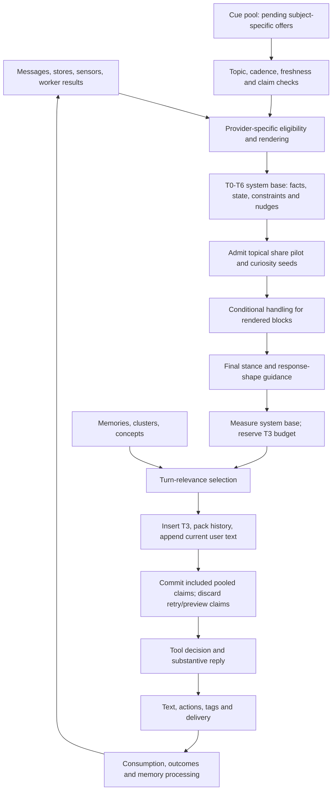

# Prompt surfacing and brain-lane decisions

This is the semantic companion to [context-budget.md](context-budget.md):
**what reaches Aiko, why it is there, what it permits, and what happens next**.
The budget document describes the token allocation of `relevant_context`, not
a universal selector over all prompt material.

Source audit: 2026-09-27. This document describes checked-in code, not proof
that a running backend has loaded it. Implementation facts and proposed changes
are kept separate. Prompt presence is not evidence of attention, use, successful
delivery, user agreement, or a justified memory write.

Implementation update: the S1-S6 bounded pilots below are now implemented.
The historical production measurements predate them; naturalness and decision
quality still need isolated multi-turn evaluation before broader rollout.

## Reading map

- [context-budget.md](context-budget.md): T3 retrieval selection and overflow.
- [prompt-caching.md](prompt-caching.md): prefix lifetime and cache boundaries.
- [cue-pool.md](cue-pool.md): subject-specific inventory and consumption.
- [brain-orchestration.md](brain-orchestration.md): turn and task ownership.
- [memory-tiers.md](memory-tiers.md): storage, promotion, retrieval and decay.

## The path through one turn



The controlling implementation is
[PromptAssembler](../app/core/session/prompt_assembler.py), especially
`assemble_with_budget`. **Provider execution order and prompt reading order
are different.** The assembler builds most providers first, appends their
results in the T0-T6 ladder, computes conditional handling and stance, then
builds `relevant_context` and inserts it into the earlier T3 position.

Consequences of that order:

- T3 has a shared budget across memories, clusters and concepts. Most other
  blocks have their own gates and bounds. Pooled claims are staged until final
  inclusion; other eager provider effects are not generally transactional.
- The final stance sees named, nonempty registered blocks, not a semantic
  comparison of every individual memory, concept and cue.
- Most steer blocks remain in the prompt after stance computation. The
  assembler does not generally remove losing offers, and stance prose renders
  only for `FOLLOW`, brevity, or sequencing, not every chosen stance.
- `curiosity_seeds_block` is a special case: its slot is reserved, then stance
  admission is checked before its provider runs. The topical share pilot also
  removes losing interest-drift/associative-wander blocks before handling.
- Conditional handling is selected before T3 is built. Registering a block
  name alone does not make arbitrary later-inserted content claim a note.

The vocabulary and offer mapping live in
[stance.py](../app/core/conversation/stance.py). Its current implementation
includes prompt guidance, topical-share and curiosity admission; older descriptions of K92
as entirely shadow-only are historical, not the current assembly contract.

## What a surfacing measurement means

| Stage | Evidence | What it does not establish |
| --- | --- | --- |
| Produced | A worker or store has material | A suitable conversational opening exists |
| Eligible | Provider-specific gates permit consideration | It will win admission or fit |
| Rendered | Named block is nonempty in assembly telemetry | The model used its contents |
| Expressed | Reply matching or action records support use | The user received or accepted it |
| Delivered | Identified text/audio receipt | Reading, hearing, understanding or agreement |
| Learned | A validated write or evidence update | That repeated exposure made a claim true |

`turn_prompt_blocks` and `PromptTelemetry.block_chars` describe block presence
and size. They are not a record of hidden model reasoning. A useful diagnostic
must keep the stages separate rather than treating every empty block as a
failure or every rendered block as success.

## Sources and ownership

| Material | Producer or refresh | Reader and lifetime | Meaning for the brain |
| --- | --- | --- | --- |
| Persona, grammar, learned expression | Persona files, avatar capabilities, learned style/profile stores | Assembler helpers; mtime and static-slice caches | Identity and output contract; not evidence that an event occurred |
| Relationship, goals, agenda, beliefs | Their stores and off-turn workers | Inner-life providers; per-provider gates | Standing context, commitments, or corroborated impressions |
| Summary, thread note, continuity | Summary and thread-resummary workers; previous session | T2 plus age-tagged recent history | Compressed narrative, not a replacement for cited evidence |
| Memories, clusters, concepts | SQLite source stores, vector retrieval, concept lifecycle | `build_relevant_context`; one per-turn budget | Facts, impressions, associations and tentative hypotheses with distinct provenance |
| World, activity, sleep, affect | Authoritative state plus permitted observations | Ambient providers and situation snapshot | Current state; inferred continuity cannot override incompatible world state |
| Current-thread understanding | Speaking-window situation observer | K97 `conversation_situation_block`; bounded and freshness-checked | Question/goal, reported facts, tentative interpretation, unresolved premise |
| Subject-specific offers | Worker `CueProducer`, or surface-time event producer | `CuePoolMixin`; policy, topic, cadence, TTL and consumption | Optional move, not a new fact or a command to ask |
| Style, repair, relational detectors | Recent turns and post-turn signals | T5/T6 providers, often one-shot | How to meet this turn; repair is not interchangeable with optional novelty |
| Task state and result | Task orchestrator and report decision | Running-task and result-cue providers | Running, blocked, finished and reported are different states |
| Delivery evidence | Turn lifecycle and identified client receipts | K99 bounded in-memory ledger | What may have been presented or played, never proof of agreement |

Most provider wiring is in
[speaking_workers_init_mixin.py](../app/core/session/speaking_workers_init_mixin.py)
via `set_inner_life_providers`. The implementations are on the session's
`inner_life_part*` and feature mixins; the wiring names the owning renderer.
Special-purpose task/attachment/Live wiring is not a second universal selector.
The assembler itself owns ordering, static slices, formatting and budgeting.

Background workers have their **own** prompts and concept diets. They do not
all receive the main-chat system prompt, nor does their private output become
shared conversational knowledge merely because it was stored. See
[idle-workers.md](idle-workers.md) and
[concept-integration.md](concept-integration.md). Worker output must cross its
store, validation and provider boundary before it can influence the next turn.

### Complete registered inventory

There are **125 names** in `_PROMPT_BLOCK_TIERS` in the audited checkout:
11 T0, 9 T1, 3 T2, 1 T3, 10 T4, 11 T5 and 80 T6. Registration describes
placement, not frequency, priority, permission, or a guarantee of rendering.
The following tables enumerate that registry; T6 is grouped by purpose for
navigation, not reordered here as a proposed prompt.

| Tier | Registered blocks | Selection and interpretation |
| --- | --- | --- |
| T0 | `persona`, `speech_grammar_addendum`, `overlay_grammar_block`, `outfit_grammar_block`, `motion_grammar_block`, `touch_grammar_addendum`, `learned_style_addendum`, `profile_block`, `petname_block`, `catchphrase_block`, `voice_adoption_block` | Stable contract and learned identity/expression. Capabilities and data availability still gate individual blocks. T0 is a cache-lifetime category, not a declaration that every sentence is factual. |
| T1 | `relationship_block`, `milestone_block`, `axes_block`, `arc_block`, `agenda_block`, `goals_block`, `coactivation_block`, `day_color_block`, `trusted_beliefs_block` | Store-derived relationship/day/arc context. Milestones can be one-shot; trusted beliefs are corroborated impressions, not omniscience. |
| T2 | `continuity_block`, `summary_text`, `thread_note_text` | Summary and thread notes plus an opening-session bridge. Recent raw messages remain separate chat messages. |
| T3 | `relevant_context` | Shared memory/cluster/concept selection, with pinned/core and turn-relevant lanes, source floors, caps, diversity and habituation. Includes tentative material through explicit hypothesis paths. See the budget reference for exact scoring. |
| T4 | `grounding_block`, `ambient`, `circadian_block`, `pajama_block`, `ambient_noise_block`, `world_block`, `activity_block`, `weather_block`, `hobby_block`, `sensory_anchor_block` | Situational background. Grounding fusion can replace several component blocks; an empty component is not necessarily lost information. A hobby trend is not evidence that a particular activity was completed. |
| T5 | `affect_block`, `vitality_block`, `mood_hint`, `mood_inertia_block`, `mood_drift_block`, `mood_shell_block`, `intimacy_pacing_block`, `emotion_episode_block`, `style_signal_block`, `user_state_block`, `vocal_tone_block` | Response register and state. Provider-specific freshness, thresholds and one-shot transitions apply; these are not all disposable under aggressive assembly. |

| T6 family | Registered blocks | Admission or semantic boundary |
| --- | --- | --- |
| Present understanding | `sleep_state_block`, `conversation_situation_block`, `delivery_provenance_block` | Sleep/world authority, freshness-checked working understanding, bounded delivery evidence; not optional floor-taking offers. |
| Repair and interpretation | `belief_gaps_block`, `clarification_block`, `calibration_block`, `rupture_block`, `self_correction_block`, `dropped_topic_block`, `user_correction_block`, `fact_reversal_block`, `promise_followthrough_block`, `misattunement_block`, `implicit_need_block`, `opinion_injection_block`, `boundary_clash_block`, `stance_persistence_block` | Each detector decides from its own evidence. Some correct an owed mistake; others offer a take. Same tier does not mean same priority. |
| Return and private continuity | `reconnection_block`, `session_clock_block`, `absence_curiosity_block`, `turning_over_block`, `sleep_return_block`, `caught_mid_activity_block`, `away_activities_block`, `narrative_block`, `upcoming_horizon_block` | Time/gap/state checks. Return cues compete through the gap-cue rules. Prepared narrative context is not a standing `SHARE` offer in current K92. |
| Answer, callback and relationship offers | `forward_curiosity_block`, `concept_hypothesis_block`, `follow_up_block`, `growth_witness_block`, `self_callback_block`, `aspiration_momentum_block`, `wellbeing_concern_block`, `shared_ritual_block`, `second_thought_block`, `companion_activity_block`, `interest_continuation_block`, `anniversary_block`, `inside_joke_block`, `tension_block`, `appreciation_block`, `reciprocal_vulnerability_block` | Pool or feature-local gates. Concept hypotheses have topical and lull paths. K98 is one answer-earned successor, not the original ask left alive. |
| Novelty and expression regulation | `novelty_block`, `stagnation_block`, `style_pattern_block`, `question_balance_block`, `tease_rhythm_block`, `self_noticing_block`, `vulnerability_budget_block`, `user_reactions_block` | Recent behavior or a specific reaction; novelty runs before stagnation consumes its measurement. Style guidance does not establish content truth. |
| User material and work | `attachments_block`, `seen_image_block`, `running_tasks_block`, `task_cues_block` | This turn's attachments, bounded local vision result, active work and parked results. A task report is not permission to repeat the task. |
| Initiative and own interests | `initiative_block`, `thread_ownership_block`, `wants_block`, `topic_appetite_block`, `pursuit_lean_block`, `taste_lean_block`, `conduct_notice_block`, `concept_learning_block`, `dormant_interest_block`, `tease_ledger_block`, `curiosity_seeds_block`, `idle_seeds_block` | Cadence, relevance, pressure and feature gates. Wants can arm a thread; curiosity seeds uniquely use K92 pre-claim admission. |
| Knowledge and topic register | `knowledge_gaps_block`, `knowledge_grounding_block`, `knowledge_gap_notice_block`, `topic_temperature_block`, `topic_confidence_block`, `earned_familiarity_block`, `user_expertise_block`, `associative_wander_block`, `long_arc_callback_block`, `interest_drift_block`, `curiosity_gradient_block` | Topic-graph, evidence and familiarity reads. A knowledge gap can invite asking or learning; it is not itself a tool call. |
| Final coordination | `live_talk_about_block`, `handling_notes_block`, `stance_block` | Exact admitted Live intent, conditional instructions, and selective stance/shape prose. None replaces tool permission enforcement. |

### Retrieval is broader than a memory list

[inner_life_part1.py](../app/core/session/inner_life_part1.py) owns
`build_relevant_context`; [rag_retriever.py](../app/core/rag/rag_retriever.py)
gathers and annotates hits. Message and document retrieval can contribute
evidence too. Source IDs, dates, inferred-versus-stated phrasing, concept
confidence and hypothesis separation matter as much as ranking.

The T3 builder can mark selected memories surfaced before the eventual model
call. This is a selection/use-count signal, not confirmation of their content.
Likewise a concept's habituation or earned standing must not be confused with
confidence: usefulness and truth are different axes.

K97's current-thread set is a separate **working** representation in
[conversation_situation.py](../app/core/conversation/conversation_situation.py)
and [conversation_situation_worker.py](../app/core/conversation/conversation_situation_worker.py).
It is not another durable memory store. It preserves cited observations apart
from interpretation, replaces rather than accumulates the set, and discards
late observer results. The
[situation provider](../app/core/session/conversation_situation_mixin.py)
joins that state with authoritative world information and suppresses stale or
incompatible claims. An unresolved premise is context today, not a structured
request to the tool gate.

## Gates, arbitration and assembly effects

### Cue admission and consumption

[cue_accounting.py](../app/core/proactive/cue_accounting.py) owns `CueSpec`,
`CuePolicy`, gap ordering and decline vocabulary.
[cue_producer.py](../app/core/proactive/cue_producer.py) selects available rows;
[cue_pool_mixin.py](../app/core/session/cue_pool_mixin.py) owns claims and
post-turn settlement.

1. Production fills a policy-sized inventory; a stocked shelf can correctly
  leave its producer idle.
2. Availability checks pending state, TTL and `not_before`. First claims can
  be cadence-blocked while a retry remains available.
3. Provider predicates decide topical or situational eligibility. Semantic
  ranking chooses among admitted rows; it does not authorize an excluded row.
4. During assembly, `take_pool_cue` stages its row in an attempt-local context.
  Only final included text in the registered destination block commits the
  surfacing and post-turn registration. Retries and previews leave it unspent;
  repeated claims of the same row within an attempt commit once. Standalone
  callers retain immediate behavior. Surface-time producers are a separate,
  still-eager recording path.
5. Post-turn matching checks subject evidence using the policy's lexical or
  semantic method and assistant-only or whole-turn scope.
6. A match becomes `used`, or `awaiting` for an answer-required cue. A miss
  retries or expires under bounded counts. `either_party` cues can resolve
  when the user raises the subject without prior cue surfacing.

The gap mutex is local competition for a lull, not a universal prompt
allocator. `concept_hypothesis` can ride the current topic without spending
that gap slot. K98 additionally checks session, quiet mode, current topic and
decline at the shared claim boundary, including exact-ID Live claims.

### What K92 currently decides

`_OFFERS` maps block names to stances, then `decide` computes desire, a hard
interruption ceiling, and the permitted rung. Brevity and sequencing are
separate outputs. Registration order breaks same-stance ties; the decision
does not compare the evidence or substance of every offered sentence.

`_render_stance_block` stores the assembly-time decision. `render_block`
emits prose only for following, brevity or sequencing. Therefore a recorded
`SHARE` is **not** proof of either an explicit final `SHARE` instruction or
a shared observation in the output. Most losing steers are still present.

The phase-3 pilot in
[inner_life_part3.py](../app/core/session/inner_life_part3.py)
checks `admits_offer` for curiosity seeds before calling their renderer.
A stronger offer, a more specific ask, an interruption ceiling, or an
imperative want can keep that stock unspent. Interest drift and associative
wander now use the same policy after candidate rendering but before their
pooled claims commit. Same-rung tie order remains policy-defined, not a new
semantic utility score. Other offers remain independent. This does not make
all providers side-effect-free or the whole prompt transactional.

### Conditional handling

[prompt_assembler_helpers_mixin.py](../app/core/session/prompt_assembler_helpers_mixin.py)
combines `CuePolicy.handling_section` and `HANDLING_SECTIONS` from
[prompt_support.py](../app/core/session/prompt_support.py). Headers must match
the persona section exactly, and the block must resolve as a nonempty local
in assembly. Shared notes are text-deduplicated. Inline persona versions can
override companion-file versions; changes to either file invalidate the split.

P50's default is 5,000 characters. The pilot reserves compact correction,
repair and delivery constraints, plus `CuePolicy.essential_handling` for the
two topical-share types. Optional long notes drop first. A pilot cue whose
essential note cannot fit is omitted without spending its pooled claim.
Protected constraints may exceed a deliberately tiny budget. Other notes keep
the existing largest-first policy, including its final-note floor; the lead-in
is additional. This is not yet mandatory-note coverage for every provider.

### Empty, replaced and retried are different

- Disabled provider, missing store, stale source, no match, cadence hold,
  priority loss and provider exception can all end as empty text.
  `_safe_provider` now records `unwired`, `empty`, `rendered`, or `error` and
  an exception class, never its message. The two topical-share providers also
  record aggressive gating. Untouched bespoke provider catches remain unknown;
  block-size telemetry alone still cannot diagnose them.
- Grounding fusion can replace separate ambient blocks with one line. That
  is compression, not a silent provider failure.
- Overflow makes `TurnRunner` call `assemble_with_budget` again with
  `aggressive=True`, skipping a hand-selected set of providers and reducing
  history. The out-of-band trace retains both attempts and discards first-pass
  pooled claims. Other eager one-shot state can still change during the first
  attempt. This remains a bounded pilot, not a global rollback mechanism.
- A prompt preview using real assembly is not necessarily read-only.
  `build_eval_messages(full_context=True)` explicitly uses the real assembly
  and retrieval path with `preview=True`, protecting pooled claims, not all
  caches or retrieval accounting. Use isolated state for replay.

`get_prompt_block_costs` now includes `surfacing_trace` from the public last-prompt
snapshot: at most two attempts, provider verdicts, source IDs/revisions, claim
states, final block inclusion, handling omissions and the final stance decision
when available. It stays out of per-turn WebSocket metrics. Provider errors
remain eligible operational declines; unknown coverage must not improve a
reach denominator. Downstream feedback stays on the existing cue rows.

## What to say or do

[turn_runner.py](../app/core/session/turn_runner.py) owns the actual call path:

1. Persist the user input, assemble, and reassemble aggressively if needed.
2. Run the cheap gate in
  [tool_pass_gate.py](../app/core/session/tool_pass_gate.py). It sees user-text
  family patterns plus continuity signals: active tasks, finished-task
  context, prior tool dispatch, and a debug override. Unknown tool families
  conservatively permit a pass. K101 adds one fresh K97 `recall_needed` hint
  for a material unresolved premise linked to the current goal.
3. When admitted, narrow schemas to matching families plus the configured
  core. Ordinary empty narrowing retains its fallback. A premise-only pass is
  strictly limited to enabled built-in recall tools, even with routing disabled:
  no empty-subset widening and no out-of-allowlist dispatch.
4. Call `chat_with_tools` with the assembled conversation. Usually force a
  choice with `respond_directly` as the no-tool option; finished-task context
  relaxes to `auto`, subject to client policy. Default maximum is two rounds,
  also subject to client limits.
5. Dispatch real calls, append identified results, then stream the substantive
  reply. Large tool exchanges can cause further trimming of old history.

Tool descriptions live in schemas; the registry is rebuilt from enabled
capabilities. A background workflow uses its own planner/skill inventory and
returns through the task system. Long work, privacy-sensitive access and
approval policies stay with their existing owners; a conversational want,
Live intent or inferred premise is not authorization. See
[tools.md](tools.md), [skills-framework.md](skills-framework.md) and
[task-approvals.md](task-approvals.md).

The recall pilot requires a fresh active working set, compatible authoritative
state and current goal-word overlap. Declines, topic changes and longer
declarative replies suppress it. Each evidence-linked need gets one attempt;
`respond_directly` remains valid. It is a conservative lexical pilot, not
general semantic proof that the current prompt lacks an answer.

Task state reaches the brain through separate active-work and result blocks.
The report decision can surface now, park, or drop discretionary results;
user-requested results have a distinct reporting floor. A reportable result
can therefore exist before it is said, and saying it does not mean the task
must be run again. Do not put prompt instructions into a verbatim prepared
nudge: that path speaks stored text rather than asking the brain to compose it.

### Live is a second admission path, not a second brain

[cue_adapter.py](../app/core/live/cue_adapter.py) projects bounded source
references and server-owned purpose into a small-model menu. The policy can
propose an intent, but
[main_wake.py](../app/core/live/main_wake.py) and
[live_mode_mixin.py](../app/core/session/live_mode_mixin.py) retain the speech
gates. Freshness, new user intent, floor, sleep/quiet settings and source
availability are rechecked at dispatch.

`live_talk_about_block` resolves the exact cue through the shared claim owner;
it must not substitute a sibling when the selected source disappeared. L17
can reconsider a missed cue once on a real new opportunity, not every
heartbeat. A valid share is not an ask, and neither is permission to start an
external activity. K97, K98 and K99 contracts are recorded in
[shipped/cognitive-continuity.md](personality-backlog/shipped/cognitive-continuity.md).

## What to memorize

There is **no single brain-lane memory admission decision today**. Durable
writes, working understanding, hypothesis testing and task records have
different owners. The main model can nominate memories in its output; several
workers independently extract or revise state later.

| Route | Input and destination | Current admission and provenance |
| --- | --- | --- |
| Plain `[[remember:...]]` | Raw assistant output to `kind=self_tagged` memory | Shared evidence admission; literal supported user statements may be long-term/stated. Unsupported paraphrases are inferred scratchpad notes, with proposal identity kept separate from user evidence |
| `[[remember:self:...]]` | Aiko's self-note to `kind=self` | Intentional self-note stays long-term and inferred, never user testimony |
| `[[diary:...]]` | Self-authored journal to diary memory | Long-term, separate entries, dedupe bypass; sleep gate. Subjective record, not external evidence |
| Batch extraction | New transcript window plus labeled read-only preceding context | IDs and quotes validated against new rows and source speaker; scratchpad writes carry admitted evidence. Persisted pending batches resume partial application without another model call |
| Other semantic tags | Moments, predictions, goals, conflicts and activity | Parsed post-turn and routed to their own stores/workers; not interchangeable with plain remember tags |
| Correction and verification | User corrections, conflicting memories, researched facts | Dedicated confirmation/supersession paths; retain correction lineage rather than treating a rewording as reinforcement |
| Working understanding | K97 cited current-thread evidence | Per-session situation state, not automatic promotion to long-term memory |
| Hypothesis answer | A raised question and candidate answer | Cue `awaiting` plus answer adjudication; graduation is a separate evidence gate |

The main-model tag path is in
[turn_runner.py](../app/core/session/turn_runner.py); the broader tag dispatch
is in [post_turn_mixin.py](../app/core/session/post_turn_mixin.py). Both operate
on the appropriate raw output while the
[response-text service](../app/core/services/response_text_service.py)
strips control tags from transcript/spoken text.

[MemoryStore.add](../app/core/memory/memory_store.py) remains the mandatory
long-term write boundary, with SQLite ownership and LanceDB mirroring,
deduplication/restatement checks and temporal backstops. Those checks do not
by themselves prove that a model-authored user claim was explicitly stated.
The shared adapter in [memory_admission.py](../app/core/memory/memory_admission.py)
does not equate deliberate annotation with testimony. Its initial validator
only admits unambiguous whole-source literal support as stated; it does not
pretend that quote inclusion entails a paraphrase. Wrong-speaker/out-of-window
IDs are rejected, working-destination candidates are not stored as memories,
and missing/uncertain evidence stays provisional. Inferred `self_tagged` rows
also receive the existing inference label in RAG output.

[memory_extractor.py](../app/core/memory/memory_extractor.py) prevents repeated
mining through a per-session watermark. A readable empty result advances;
unparseable output or a failed model call does not. Nonempty batches checkpoint
their admitted candidates and per-item progress before advancing. An admission
key makes retrying an inserted row idempotent without reinforcing it. Explicit,
supported correction references can preserve `supersedes_memory_ids`; older
rows remain available. No legacy corpus rewrite or general paraphrase judge is
included in this pilot.

### Feedback is not independent evidence

Post-turn code settles cue subjects, records outcomes, updates working state
and schedules workers. Memory revival uses lexical/semantic reply matching;
promotion can use age, use count or revival. Concept standing uses item-level
echo evidence, separately from concept truth/confidence.

Three loops must remain distinct:

- **Recall usefulness:** the item helped formulate a reply.
- **Conversational fulfillment:** the offered question or observation landed.
- **Epistemic support:** an independent source actually supports the claim.

Repeated retrieval, Aiko repeating herself, or an engagement label copied to
many surfaced items is not additional testimony. K99's
[delivery.py](../app/core/conversation/delivery.py) adds bounded receipts but
does not turn every memory, summary or cue outcome into a
delivery-aware record. Cue rows now retain a bounded feedback history; H7 joins
the actual asked text/message, source proposition, answer ID/time, independent
delivery status, adjudication outcome and applied/not-applied update. Generic
topic matching is labeled `answer_matched`, not semantic acceptance. A completed audio clip cannot authorize storing
"the user agreed"; a missing receipt cannot justify automatically repeating it.

## Evidence from the running installation

Read-only audit on local 2026-09-27, with the report clock at approximately
2026-09-26 23:02-23:05 UTC. The 14-day SQLite window began around
2026-09-12 23:05 UTC. These are rolling snapshots, not a frozen benchmark.
Only aggregate software behavior is recorded here, not personal facts or
transcript excerpts.

| Measurement | Observation | Interpretation and limit |
| --- | --- | --- |
| Registry | Checkout: 125 blocks; live diagnostic: 123 | The process does not match the audited registry. Do not credit recent K98/K99 changes with these historical results. |
| Latest typed prompt | 34 rendered blocks; estimated 17,407 system tokens; T3 16,224 chars; handling 3,276 chars | One prompt, not a distribution. Token values are heuristic estimates, not measured reasoning capacity. |
| Latest stable head | Persona 42,125 chars; T0 estimated 11,379 tokens | Cache-friendly still means model-visible. Cost and cognitive competition are separate questions. |
| 14-day recorded prompts | 394 distinct assistant messages; mean 33.3 nonempty blocks; mean 76,136 summed block chars | Sum excludes framing/history; large size alone does not establish interference. |
| 7-day lead-cue presence | 232 turns; wants 100%, hobby 100%, curiosity seeds 72.8%, initiative 8.2% | Persistent background is not evidence of a deliberate choice. These blocks do not all offer the same stance. |
| 14-day response shape | Median 33 words; 2.5% question endings; 13% anaphoric openers | Question endings miss questions earlier in a reply. These are not direct reasoning or naturalness scores. |
| 14-day cue funnel | 3,900 decisions; eligible declines: 1,668 `topic_miss`, 528 `provider`, 64 `lost_priority` | Generic declines obscure the actual cause. Low reach can be correct topic selection. |
| Hypothesis loop, lifetime | 75 rows; 12 ever asked; only 1 of those has a verdict; 0 graduated | H7/H44 remain relevant. This does not establish that the unanswered/unscored cases contained an answer. |
| Memory source column, 14-day surviving rows | 1,044 rows created in-window; 12 with `source_message_id`, 1,032 without | Not an all-writes audit. Metadata, task provenance and source sessions can carry other lineage; missing this column is not proof of fabrication. |
| Plain self-tagged memories in that cohort | 9 long-term `stated` rows, all linked to an assistant message | Confirms the writer path is used. Does not establish whether any particular stored claim is false. |

The lead/follow command also prints lifetime stance totals. Those are **not**
the same seven- or fourteen-day cohort and were not used as a current stance
rate here. Stored decisions span changing policies; replay requires policy
versioning and isolated state, not silently rewriting the production ledger.

### Reproducing the evidence

From the repository root in PowerShell:

```powershell
.venv\Scripts\python.exe scripts/lead_follow_report.py --windows 7,14
.venv\Scripts\python.exe scripts/cue_reach_report.py --days 14
.venv\Scripts\python.exe scripts/mcp_call.py get_prompt_block_costs --arg top=15 --timeout 12
```

For SQLite, open `file:data/chat_sessions.db?mode=ro` with URI mode and set
`PRAGMA query_only=ON`. The content-free source-column query is:

```sql
SELECT COUNT(*) AS surviving_rows,
       SUM(source_message_id IS NOT NULL) AS linked,
       SUM(source_message_id IS NULL) AS unlinked
FROM memories
WHERE julianday(created_at) >= julianday('now', '-14 days');
```

Group `turn_prompt_blocks` by `assistant_message_id` **before** averaging
block counts or sizes. Do not count its rows as independent turns. Do not open
the live LanceDB with guessed embedding settings, force workers, or run
synthetic messages against the live relationship for this audit.

## Implemented pilots and remaining scope

The initial S1-S6 implementations are described above. The following proposals
remain the evaluation and expansion contract, not a claim that every provider,
writer, or feedback consumer is covered. Prefer replacing competing guidance
over adding more always-on text or another planning pass.

| Order | Work | Existing home | Cheapest discriminating check |
| --- | --- | --- | --- |
| 1 | Explain every stop in the surfacing path | G6 and P43 | Inject disabled, empty, stale, cadence, topic, exception and lost-priority cases; each must remain distinguishable after final assembly |
| 1 | Evidence-bound memory admission | New K100, extending F16/K97 | Assistant conjecture cannot become user testimony; explicit user correction keeps its source and supersedes the older claim |
| 2 | Choose candidates before spending them | K92 phase 3, K93 and P43 | Two conflicting offers plus forced aggressive reassembly: only the final admitted offer spends a showing, and no one-shot is silently lost |
| 3 | Let a specific unresolved premise open a bounded tool decision | New K101, extending K97 | A fresh, relevant information need can expose an enabled read capability without requiring a keyword; stale/irrelevant/unauthorized needs cannot |
| 3 | Select cue and essential handling together | P50 follow-up inside P43 | Tight budget keeps a repair/provenance warning with its content; optional long prose drops first |
| 4 | Close the answer and delivery feedback loop | H7/H44 and K99 follow-up | Separate not expressed, delivery unknown, no answer, unrelated answer, accepted answer, adjudicator failure and applied update |

### S1. A reasoned trace, not another score

Extend existing telemetry with a bounded turn/assembly-attempt trace:
source reference and revision, provider, eligibility verdict, omission reason,
claim state, final inclusion, handling inclusion, chosen move and downstream
write/action result. Preserve exception categories without storing prompt
text or personal content. Report healthy silence separately from operational
failure. Join the current block/cue/stance ledgers rather than replacing them
with a second outcome database.

This is the prerequisite for tuning: 528 `provider` declines cannot tell us
whether to fix stock, refresh stale material, repair code, or change admission.
Retain counts of unknown reasons and unjoinable outcomes so observability
coverage cannot masquerade as better behavior. Do not learn block value from
copied turn-engagement labels. See [workers.md](personality-backlog/workers.md)
and [P43](personality-backlog/perf.md#p43-105-blocks-no-arbitration----replace-the-aggressive-denylist).

### S2. Collect, choose, render, then commit

Expand K92's curiosity pilot incrementally. Begin with one pooled share/ask
family: collect non-mutating candidates, retain hard speech/permission gates,
choose an optional move with actual content and purpose, budget its necessary
context, and commit only that final inclusion. Preserve owed answers, repairs,
world/sleep truth and task obligations outside discretionary competition.

Use an assembly-attempt identity so overflow retries and diagnostic previews
cannot spend a cue twice or exhaust an unseen one. Remove the superseded
imperative text, rather than append a "winning" instruction below it. No
strict global one-block cap: one optional conversational move may need several
evidence blocks and must not hide an unrelated obligation.

Evaluate direct questions, a fresh support turn, a lull, a correction and a
task completion at equal token budgets. Measure answer completeness, distinct
optional moves, source use, unspent losing cues and stale/repeated content.
Following well and appropriate silence are successes. This is the next scope
of [K92](personality-backlog/patterns.md#k92-conversational-stance--one-decision-per-turn-not-ten-permission-slips),
not a new universal cognitive controller.

### S3. Evidence-bound remembering

Separate **the model chose to retain it** from **the user stated it**. A small
memory candidate should retain subject, source speaker, exact evidence IDs,
temporal scope and intended destination. The server decides whether it is a
new durable memory, a correction, scratchpad inference, temporary working
context, or nothing. Keep intentional self-notes distinct from user testimony.

Begin with plain remember tags and the existing batch extractor, not every
worker at once. Preserve readable-empty watermark behavior while making partial
application retryable and idempotent. Never relabel the live corpus wholesale
from a missing source field. Detailed scope and acceptance are in
[K100](personality-backlog/patterns.md#k100-evidence-bound-memory-admission).

### S4. Use uncertainty to choose the next useful step

K97 can say which premise is unresolved, but the tool gate currently consumes
text patterns and task continuity plus the initial read-only recall hint. Expand
one bounded, evidence-linked need against the **current** user goal: answer
from available evidence, retrieve/verify, ask one necessary clarification, or
defer. Use the existing tool pass and workflow owners; do not add an always-on
LLM planner or request private chain-of-thought.

Expose only a needed, enabled capability after freshness and relevance checks.
Knowing that information is missing does not grant access or permission to act.
Keep healthy uncertainty as a valid answer when the information is unnecessary
or unavailable. See [K101](personality-backlog/patterns.md#k101-route-an-unresolved-premise-to-a-bounded-next-step).

### S5. Keep essential handling attached to the selected content

P50's current largest-first fit is a useful size guard, not a semantic policy.
Distinguish short mandatory constraints from optional examples/style prose;
reserve the former with their selected block. If a discretionary cue cannot
fit its essential warning, omit the bundle without spending it. An owed repair
or safety-critical fact instead needs an explicit compact protected form.
Record note omission reasons separately from block omission.

Reuse [P50](personality-backlog/perf.md#p50-the-persona-hoist-has-no-cap-and-it-is-the-second-largest-block)
and K92/P43 admission. First run isolated tight-budget fixtures; the current
3,276-character sample is below the default budget and does not demonstrate
that a critical note was lost in production.

### S6. Learn from the reply, not just its existence

Keep K99 delivery evidence alongside, not substituted for, semantic outcome
evidence. A user can answer a question even with missing client receipts;
an audio completion cannot prove they answered it. Join the answer to the
actual asked cue, relevant source proposition and resulting store update.
Preserve original event time when an off-turn adjudicator completes later.

For H7/H44, classify each failed stage before changing thresholds or supplying
more hypotheses. For memory, carry a user correction or explicit acceptance
as new evidence; do not turn Aiko's own generated paraphrase into independent
support. Keep unknowns unknown and never automatically resend every unconfirmed
sentence. K99 already provides the bounded delivery mechanism; this proposal
is about its consumers, not a second delivery ledger.

### Experiments not justified by this audit

- More questions or larger thinking budgets as a generic naturalness fix.
- Relaxing topic/cadence gates to improve a reach percentage.
- Ranking memory truth by how often Aiko repeats it or by user-message length.
- A global summary-versus-RAG dedupe pass: P51 measured that premise and closed
  it; P52's size/carry-over work is the relevant existing follow-up.
- Reducing the block count without checking which obligations or evidence
  disappear. Cache cost, token capacity and semantic usefulness need separate
  evaluation.

## Maintenance and verification

When adding a surface, update the tier registry and append location, wire its
provider, declare whether it offers a stance, and register any conditional
handling. For subject-specific material use the cue policy/producer/claim
owners. Define freshness, failure behavior, one-shot side effects and memory
provenance explicitly. Extend this inventory when a registry name changes.

The original documentation pass checked registry coverage through AST extraction
(all 125 names exactly once in the inventory) and Markdown links with
`scripts/check_backlog_links.py docs`. It did not run synthetic production
turns, mutate memory/configuration, or establish a behavioral improvement.
Implementation experiments should reuse
[test_prompt_assembler.py](../tests/test_prompt_assembler.py),
[test_stance.py](../tests/test_stance.py),
[test_turn_runner_tool_pass.py](../tests/test_turn_runner_tool_pass.py),
[test_conversation_situation.py](../tests/test_conversation_situation.py),
and the existing memory/cue tests before the repository's full code gates.
Compare multi-turn behavior with the
[T5 naturalness track](personality-backlog/testing.md#27-sep-2026-multi-turn-naturalness-track).
