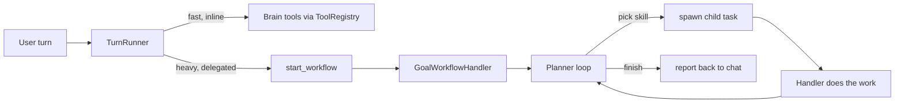
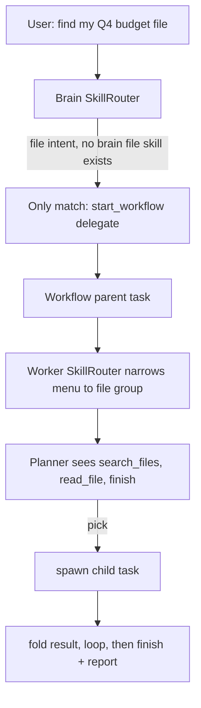
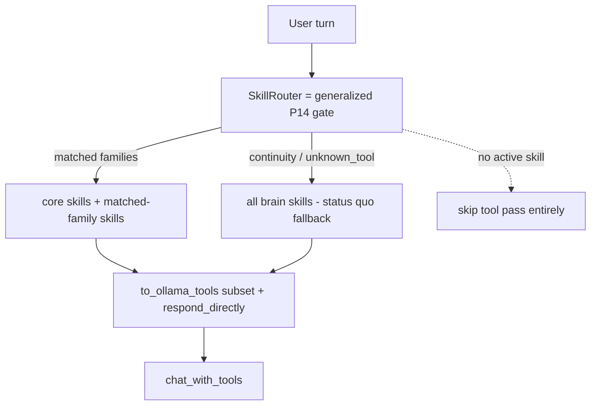
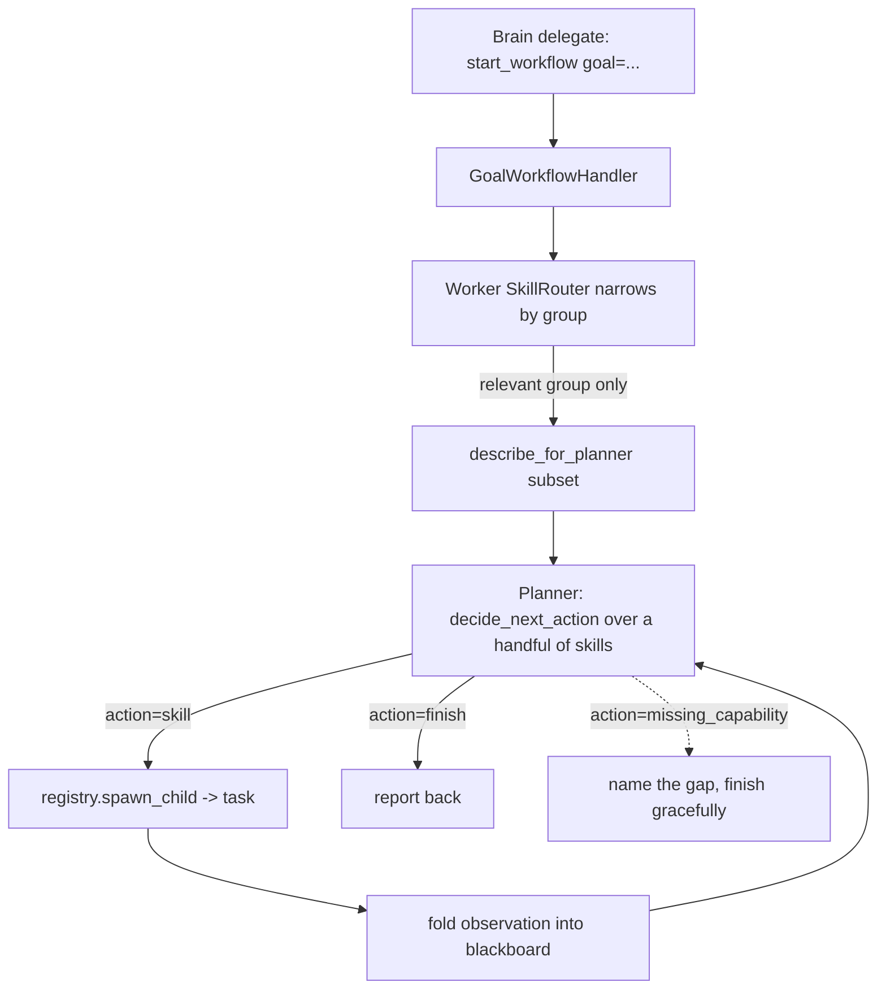

# Skills framework: lane-tagged skills + on-demand tool disclosure

*Status: **implemented (phased), behind flags defaulting off.** Brain-lane
progressive disclosure and the worker-lane router both ship; each is gated
by a `router_mode`-style flag (`agent.skill_router_enabled` /
`agent.workflow_skill_router_enabled`) that defaults to **false** (=
today's exact behaviour). Pragmatic note: the existing P14 tool families
ARE the brain skill-groups — there is no separate `Skill` class hierarchy
(see "What this is not"). The always-on brain core is `time / recall /
world` (`agent.brain_core_skills`).*

Aiko's capabilities split cleanly into two execution lanes today, but
only one of them has a scaling problem, and the fix the two lanes need
is the same idea applied two different ways: **stop showing the model
every capability on every turn, and instead surface only the ones the
current intent needs.** This document proposes a "skills" framework that
makes that the explicit, shared model across both lanes.

## TL;DR

- A **skill** is a named capability bundle tagged with a **lane**:
  `brain` (fast, runs inside the conversational turn) or `worker`
  (heavy, runs in the background task/workflow lane).
- The real bloat is the **foreground brain tool pass**: every gated
  turn ships the entire `ToolRegistry.to_ollama_tools()` (~23 tools) to
  the model. This grows monotonically with every new tool / MCP server
  and degrades both tool-selection quality and prompt-cache stability.
- The background **`GoalWorker` is not affected** — it passes no
  `tools=`, it is a pure JSON reflection pass. The friend's "tools will
  poison the background worker" concern is misdirected for that worker;
  the catalogue that *does* grow is the **workflow planner's** skill
  menu.
- **Brain lane:** a `SkillRouter` (a generalization of the existing P14
  [`tool_pass_gate`](../app/core/session/tool_pass_gate.py)) classifies
  the user's text and injects only the matched fast skills' tools for
  that turn. Heavy work is never a brain tool — the brain delegates via
  a single `start_workflow` affordance.
- **Worker lane:** keep the existing
  [`WorkflowSkill`](../app/core/tasks/workflow/skill_registry.py) →
  spawn-child model unchanged, but add a router **in front of the
  planner** that narrows the text menu to the relevant skill group
  before [`decide_next_action`](../app/core/tasks/workflow/workflow_planner.py)
  renders it.
- **Single-lane ownership:** every capability lives in exactly one
  lane. "Files" is worker-only, so a user asking for files can never hit
  a brain-vs-worker tool collision.
- Everything ships behind a `router_mode` flag defaulting to `off`
  (= today's behaviour), so rollout is a measured opt-in.

## Vocabulary (pinned first, because the words overload)

The single most common confusion is conflating "skill" with "task".
They are different layers:

| Term | What it is | Example |
|---|---|---|
| **Skill** | A reusable *capability definition* — a menu item. `name` + `description` + `arg_schema` + a way to invoke it. A template, not an execution. | `search_files`, `recall`, `web_search` |
| **Task** | One *runtime execution* a worker skill spawns. Gets a DB row, heartbeat, cancel path, event log, and a slot in the task tree. One skill spawns many tasks over time. | task #412 running `HANDLER_FILE_SEARCH` |
| **Handler** | The code that actually performs a spawned task's work. | `HANDLER_FILE_SEARCH`, `HANDLER_WEB_SEARCH` |
| **Skill group** | A router-level bundle of related skills; the unit the worker router narrows to. | "file skills" = `search_files` + `read_file` + `write_file` |

The relationship, in one line:

> **skill** (menu item) → *spawns* → **task** (execution) → *run by* → **handler** (the doing).

A skill does **not** "contain tools" on the worker side — it maps to one
handler that does one specific job. On the brain side a skill *does*
wrap one or more fast `Tool`s, because brain tools are native
function-calling tools, not task spawns. That asymmetry is the whole
point of the `lane` tag (see below).

## The two lanes today



- **Brain lane** — [`TurnRunner._maybe_run_tool_pass`](../app/core/session/turn_runner.py)
  runs a forced `chat_with_tools` decision pass when the P14 gate says
  to. It sends `registry.to_ollama_tools()` — *all* registered tools —
  plus a synthetic `respond_directly` escape tool. Fast tools
  (`get_time`, `recall`, `calculate`, world ×8, goals ×4) return inline.
- **Worker lane** — heavy capabilities live in
  [`WorkflowSkillRegistry`](../app/core/tasks/workflow/skill_registry.py)
  as `WorkflowSkill`s. The planner reads them as **text**
  (`describe_for_planner()`), picks one, and the skill's `spawn` fn calls
  `orchestrator.start_task(...)` to create a child task. MCP servers
  register here only ([`mcp_skills.py`](../app/core/tasks/workflow/mcp_skills.py)).

### Where the pain actually is

- The brain pass is **O(all tools)** per gated turn. Each new tool or
  MCP-exposed capability widens the schema list the model must reason
  over, which (a) degrades the "which tool?" decision and (b) churns the
  prompt prefix that OpenAI's cache keys on.
- The worker planner's menu is **O(all worker skills)** per planning
  iteration. It's fine at 4 skills; it bloats once a handful of MCP
  servers each register several skills.
- **`GoalWorker` ([`goal_worker.py`](../app/core/goals/goal_worker.py))
  has neither problem** — it never receives `tools=`. Worth stating
  plainly so we don't "fix" a worker that isn't broken.

## Single-lane ownership (and why files won't collide)

The rule that keeps the two lanes from confusing the model:

> **Every capability is assigned to exactly one lane. No capability is
> duplicated across brain and worker.**

File content operations (search / read / write / vision) are
**worker-lane only**. The brain has *no* file skill. So when the user
asks "find my Q4 budget file":



There is never a turn where the model chooses between a "brain file
tool" and a "worker file tool", because the brain file tool does not
exist. The brain's only file-adjacent affordance is the generic
`start_workflow` delegate.

**Edge case — instant metadata.** Today there is a fast
`list_file_roots` brain tool ("what roots can I even see"). That is
genuinely instant and read-only, so it's a legitimate brain capability.
Two options, to be decided during implementation (see Open questions):

1. **Fold it into the worker too** — purest; the brain has zero file
   surface and always delegates.
2. **Keep it brain-side as a distinct, non-overlapping skill** named for
   what it is (`file_roots_info`), *never* a generic "files" skill — so
   names cannot be confused and the single-lane rule still holds (it
   owns "list roots", the worker owns "file contents").

This document recommends option 2 (keep the instant affordance, name it
unambiguously) but flags it as not pre-decided.

## The Skill model

A unified `Skill` umbrella with a `lane` discriminator, plus two
lane-specific representations:

```text
Skill (shared umbrella)
├── name           # stable identifier, also the registry key
├── description    # one line the router/planner/model reads
├── lane           # "brain" | "worker"
├── group          # router-level bundle key ("files", "web", "time", ...)
├── activation     # router signal (regex family / keywords) — see routers
├── gating         # config flag + dependency presence
└── instructions?  # optional prompt snippet injected when the skill is active

BrainSkill(Skill)            WorkerSkill(Skill)  (== today's WorkflowSkill)
├── tools: list[Tool]        ├── arg_schema: dict
└── -> native tools=         ├── spawn: (args, ctx) -> child_task_id | None
                             └── -> planner text + task spawn
```

- `lane="brain"` — fast, returns inline, surfaced as native `tools=`
  **only when active**. Members map to today's `tools.*` groups:
  `get_time`, `recall`, `calculate`, world (8 tools), goals (4 tools),
  plus the `tasks` family (`start_workflow`, `check_my_work`,
  `cancel_work`) which is the brain's delegate affordance.
- `lane="worker"` — heavy, runs via the task/workflow lane, **never**
  injected into brain `tools=`. Members: file search/read/write, web
  search, vision, and every MCP-registered capability. This is exactly
  today's `WorkflowSkill`; the framework just formalizes it as the
  worker representation of the shared `Skill`.

### Naming reconciliation

The word "skill" is already taken by `WorkflowSkill`. Recommendation:

- Introduce the thin shared `Skill` umbrella with the `lane`
  discriminator.
- `WorkflowSkill` *becomes* the `worker`-lane implementation (rename
  optional; keeping the name as an alias avoids churn).
- Add a `brain`-lane implementation (`BrainSkill`) that wraps existing
  [`Tool`](../app/llm/tools/base.py) objects.
- MCP stays worker-only — an MCP server never advertises a brain skill
  (an open question if we ever want fast MCP tools, but out of scope
  here).

## Brain-lane progressive disclosure

This is a direct generalization of the P14 gate. The gate already does
90% of the work: [`should_run_tool_pass`](../app/core/session/tool_pass_gate.py)
returns a `GateDecision` whose `matched` field names the **families**
that fired (`_TOOL_FAMILY` maps tool name → family; `_FAMILY_PATTERNS`
holds the per-family regexes). Today we only use that to decide
*whether* to run the pass. The framework uses it to decide *which tools*
to send.



Mechanics:

- **Family → skill → tool subset.** `families_for_tools()` already maps
  registered tool names to families. Invert it: matched families select
  the active brain skills; the active skills' tools (plus an always-on
  **core** set) become the `tools=` payload. Everything else is omitted
  for this turn.
- **Always-on core.** A small set (e.g. `recall`, `get_time`) is always
  included so trivial asks never miss even when the regex doesn't fire.
- **Conservative fallbacks → widen to all brain skills.** The gate's
  existing "always run" signals are exactly the cases where we must not
  narrow: `force`, `finished_task_block`, `tasks_active`,
  `last_turn_dispatched_tool`, and `unknown_tool` (a registered tool
  with no family). In any of these, send the full brain tool set — i.e.
  identical to today. This preserves the gate's core contract: a false
  positive costs the status quo; only a false negative (wrongly skipping
  a needed tool) is a real regression, and these signals are precisely
  the false-negative guards.
- **Empty active set → skip.** Same as today's `no_signal` outcome.
- **`instructions` snippets** for active skills inject into the prompt
  at the **volatile T6 tier** (per the prompt-cache ladder in
  [`prompt_assembler.py`](../app/core/session/prompt_assembler.py)) so
  they ride below the stable prefix and don't break caching.

The net effect: on a banter turn the brain still skips the pass; on "what
time is it" it sends ~1 tool instead of ~23; on an ambiguous/continuity
turn it sends everything (today's behaviour).

## Worker-lane on-demand loading

The worker keeps its task-spawn model entirely. We add one cheap step
**before** the planner renders its menu.



Mechanics:

- The router shares the family/keyword approach from the P14 gate
  (reuse `_FAMILY_PATTERNS` where they overlap) to classify the
  workflow's **goal text** into one or more skill groups, then narrows
  the `PlannerInput.skills` list (today populated straight from
  `registry.describe_for_planner()`) to those groups before
  [`decide_next_action`](../app/core/tasks/workflow/workflow_planner.py)
  builds the catalogue block.
- **`finish` is always present** (it's the terminal skill, always in the
  menu) and any always-relevant skill stays unconditionally included.
- **Full-menu fallback on ambiguity.** Same conservative contract as the
  brain gate. Critically, the planner already has a
  `missing_capability` outcome: if the router over-narrows and hides a
  skill the goal actually needed, the planner would falsely report a
  capability gap. So ambiguity, multi-group goals, and low router
  confidence all fall back to the full menu — narrowing is an
  optimization, never a correctness gate.
- **MCP grows the catalogue, not the menu.** Each MCP server's skills
  register under a per-server group, so adding servers grows the total
  catalogue while the per-plan menu the planner reads stays small.

## Autonomous behaviour (background workers) is out of scope by construction

A natural worry: "if the brain only sees a subset of tools, will Aiko
stop doing things on her own — snacking, moving the cat, tidying her
desk?"

No. Aiko's autonomous room life runs in **background idle workers**
([`IdleAwayActivityWorker`](../app/core/world/idle_activity_worker.py),
`GardenVisitWorker`, `WorldNoticeWorker`), and those mutate the world by
calling [`WorldStore`](../app/core/world/world_store.py) methods
**directly** — `set_state(...)`, `consume_item(...)`,
`update_item(...)`. They do not go through the brain's
`chat_with_tools` pass and never receive a `tools=` payload (the only
LLM call in the activity worker is a tool-less `chat_json` to phrase the
summary line). The skills framework touches **only** the brain tool pass
and the workflow planner menu, so every direct-store autonomous beat is
unaffected and keeps firing exactly as today.

The one path that *is* in scope is Aiko calling a world tool
**spontaneously mid-conversation** (e.g. sipping tea while chatting
about something unrelated). That goes through the brain pass, so it's
subject to the router. To preserve it on turns where the user's message
carries no world keyword, the **`world` skill should be in the always-on
core set** (see Open questions #1) — it's the cheapest, most
personality-relevant lane, so it's the right place to always pay the
small per-turn cost.

## Settings and rollout

- A `skills` block (or an extension of `ToolsSettings`):
  - Per-skill / per-group enable flags (mirrors today's `tools.*` and
    the `build_builtin_skill_registry(...)` enable args).
  - An explicit always-on **core** set for the brain lane.
  - `router_mode` for each lane:
    - `off` (default) — send all brain tools / full planner menu =
      **exactly today's behaviour**.
    - `on` — progressive disclosure as described above.
- Master flag defaults `off`. Rollout is opt-in and reversible at
  runtime.

### Phased rollout

1. Land the `Skill` umbrella + registries + both routers **behind the
   flag**, with `router_mode=off` so nothing changes in production.
2. Migrate 1–2 brain families (e.g. `time`, `recall`) to the brain
   router and measure tool-recall on a fixed eval set.
3. Add the worker router; measure planner `missing_capability` rate
   (the canary for over-narrowing).
4. If recall holds, flip `router_mode=on` per lane.

## Observability

- Extend the existing `tool-gate:` INFO log and the MCP
  `get_tool_gate_state` to report the **active brain skills** (not just
  the run/skip decision), so "why did the model only see N tools?" is a
  one-call answer.
- Add a worker-router selection line to the planner logs
  (`planner: narrowed groups=... skills=...`) alongside the existing
  `planner decision:` line.
- Rename/augment the MCP `list_agent_tools` into a skills view
  (`list_skills` showing `{name, lane, group, active_when}`).
- Watch the canaries: brain tool-recall regressions (false negatives)
  and worker `missing_capability` rate (over-narrowing).

## Open questions

1. **Always-on brain core** — `recall` + `get_time` are the obvious
   baseline. **Recommendation: include `world` too**, so Aiko can take
   spontaneous room actions (sip tea, shift posture) on turns whose text
   carries no world keyword — preserving the autonomous-feeling
   behaviour the direct-store idle workers already provide out-of-band
   (see "Autonomous behaviour" above). `goals` is rarely the *first*
   thing a turn needs, so leave it router-gated.
2. **Instant file metadata** — fold `list_file_roots` into the worker,
   or keep it brain-side as a distinct `file_roots_info` skill? (Doc
   recommends the latter.)
3. **Worker group granularity** — one group per MCP server, or
   finer-grained per-capability groups? Coarser is safer against
   over-narrowing; finer keeps the menu smaller.
4. **Router confidence threshold** — how aggressively do we narrow
   before falling back to the full set? Needs the eval set from rollout
   step 2/3 to tune.
5. **Fast MCP tools** — do we ever want an MCP server to advertise a
   *brain* skill (fast, inline)? Out of scope now; the `lane` tag leaves
   the door open.

## What this is not

- Not a change to `GoalWorker` — it stays tool-free.
- Not a new execution lane — the task/workflow machinery (schema v16/v17,
  heartbeats, cancel-cascade, the event log) is untouched.
- Not a rewrite of `ToolRegistry` or `WorkflowSkillRegistry` — the
  framework wraps them with a shared `Skill` umbrella and two routers.
