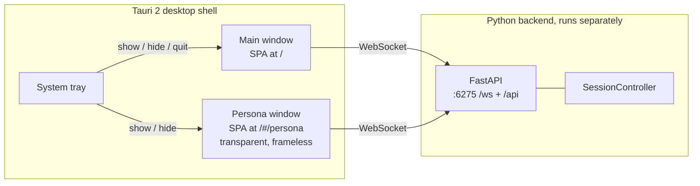

# Aiko Tauri shell

Aiko ships with a Tauri 2 desktop wrapper around the existing React SPA.
The shell lives in `web/src-tauri/` (canonical Tauri 2 layout — the
crate sits next to the frontend's `src/` directory). It does NOT
replace the FastAPI backend or the Vite dev server; think of it as a
third deployable frontend (alongside "browser" and "Vite dev server")
that just happens to render in a native window.

## Architecture at a glance



Each Tauri webview hosts its own React app, its own Zustand store, and
its own WebSocket connection. State synchronisation between the main and
persona windows is implicit — every WS event is broadcast to all
connected clients via the existing fan-out in
[`app/web/server.py`](../app/web/server.py).

## Dev loop

Rust toolchain is required for the desktop shell. Install it once via
[rustup](https://rustup.rs/) (`rustup-init.exe` on Windows). The
JavaScript side has no extra prerequisites beyond the existing
`npm install` in `web/`.

Three processes need to run together: the Python backend, the Vite dev
server, and the Tauri CLI (which compiles the Rust crate, opens the
native webview, and points it at Vite). The Tauri CLI does NOT spawn
Vite on its own — it just polls `devUrl` until something answers.

The convenience script handles all three:

```bash
npm run desktop
```

…which under the hood runs:

```bash
concurrently --kill-others-on-fail \
  "python -m app.web" \
  "npm --prefix web run dev" \
  "npm --prefix web run tauri:dev"
```

If you'd rather run them in separate terminals (easier to read logs):

```bash
# Terminal 1: Python backend, listens on :6275.
python -m app.web

# Terminal 2: Vite dev server, listens on :5173.
npm --prefix web run dev

# Terminal 3: Tauri shell. Compiles Rust on first launch (~60s cold),
#             then opens the main window pointed at :5173.
npm --prefix web run tauri:dev
```

## Two-window layout

* **Main window** (label `main`). Default Tauri-decorated frame, 1100×720
  on launch, hosts the existing chat layout (sidebar + chat view + avatar
  panel + settings drawer + toasts). Closing the main window quits the
  app.
* **Persona window** (label `persona`). Transparent, frameless,
  always-on-top by default, 320×480 on launch. Hidden on launch — opens
  via the **Persona** button in the top-bar of the main window or via
  the system tray's *Show persona window* item. Closing the persona
  window via its X button hides it instead of destroying it, so the next
  open is instant and the WebSocket stays connected.

The persona window renders [`PersonaWindow.tsx`](../web/src/components/PersonaWindow.tsx)
when `window.location.hash === "#/persona"` — see the hash-router in
[`App.tsx`](../web/src/App.tsx). All other hashes fall through to the
full chat layout. We intentionally avoided `react-router-dom` because
the route surface is a single binary switch.

### Persona window anatomy

```
┌────────────────────────────┐
│ aiko · idle           [×]  │ ← drag handle (data-tauri-drag-region)
├────────────────────────────┤
│                            │
│        Live2D avatar       │
│                            │
├────────────────────────────┤
│ [🎤]  talk to aiko...      │ ← MicButton (compact) + PersonaInput
└────────────────────────────┘
```

* `[🎤]` reuses the same `MicButton` component as the main window
  (extracted from `ChatView.tsx` so both layouts share the exact pulse
  ring + pressed-state styling).
* `PersonaInput` is a single-line composer; Enter sends, Shift+Enter is
  intentionally not supported (multi-line stays in the main window).
* The drag handle uses Tauri's [`data-tauri-drag-region`](https://tauri.app/v2/api/js/window/#dragregion)
  attribute. Outside of Tauri it does nothing, so the same component
  renders correctly in a regular browser tab when you visit
  `http://localhost:5173/#/persona` for debugging.

## The `backendBase()` resolver convention

In a regular browser (`vite dev` or production same-origin), root-relative
URLs work because Vite proxies `/api`, `/ws`, `/avatar`, and
`/persona-text` to the FastAPI backend, and in production FastAPI
itself serves `web/dist`.

In a Tauri webview the origin is `tauri://localhost` (Windows / Linux)
or `http://tauri.localhost` (macOS), which has no proxy and no
co-located backend. To keep both modes working from a single bundle,
**every fetch / WS / asset URL must route through `backendBase()`**:

* [`web/src/desktop/runtime.ts`](../web/src/desktop/runtime.ts) exposes
  `isTauri()` and `backendBase()`. The latter returns
  `{ http, ws }` strings — just concatenate the path, don't re-derive
  the host.
* The default Tauri backend URL is `http://127.0.0.1:6275` (matches the
  `web_server.host` / `web_server.port` defaults). Override at build
  time with `VITE_BACKEND_URL=http://otherhost:port` for testing
  against a remote machine.
* CORS already allows the Tauri webview origins (`tauri://localhost`,
  `http://tauri.localhost`, `https://tauri.localhost`) — see
  [`app/web/server.py`](../app/web/server.py) `create_web_app`.

Existing call-sites that thread through `backendBase()`:

* [`web/src/api.ts`](../web/src/api.ts) — central `jsonFetch` rewrites
  all root-relative paths.
* [`web/src/hooks/useAssistantSocket.ts`](../web/src/hooks/useAssistantSocket.ts)
  — `resolveWsUrl()`.
* [`web/src/components/Live2DAvatar.tsx`](../web/src/components/Live2DAvatar.tsx)
  — `/avatar/${entry_filename}`.

If you add a new backend URL, route it through `backendBase()` too.
Otherwise the desktop shell silently fails to load that resource.

## Avatar bundle location

Drop the Live2D model files (`*.model3.json`, `*.cdi3.json`, expressions,
motions, textures) under `data/personas/active/Alexia/`. The folder is
gitignored — each developer copies their own avatar in. The FastAPI
backend serves the contents from `/avatar/...` based on
`avatar.root_dir` in `config/default.json` (overridable via
`config/user.json`). The legacy `live-2d-models/Alexia/` path is still
honoured if you override the setting, so existing checkouts keep working.

## Persona window settings persistence

The persona window's geometry survives an app restart on a per-machine
basis (not via the Python config):

* [`tauri-plugin-window-state`](https://v2.tauri.app/plugin/window-state/)
  is registered in [`web/src-tauri/src/lib.rs`](../web/src-tauri/src/lib.rs)
  with `StateFlags::POSITION | SIZE`. The plugin auto-saves both
  windows on close and restores them on the next launch -- the saved
  state lives in the OS-specific app-data dir, not in
  `config/user.json`. We deliberately exclude `MAXIMIZED` /
  `FULLSCREEN` so the user's last accidental maximize doesn't lock
  them in.
* The "always on top" preference is *not* covered by the plugin
  (Tauri may rebuild the window without it). We persist it
  client-side in `localStorage` (`aiko.persona.always_on_top`) via
  the `personaAlwaysOnTop` slice on the Zustand store, and re-apply
  it through the `set_persona_always_on_top` Tauri command on every
  persona-open transition (see `usePersonaVisibilitySync` in
  [`web/src/App.tsx`](../web/src/App.tsx)).
* The settings drawer's "Persona window (desktop)" section in
  [`SettingsDrawer.tsx`](../web/src/components/SettingsDrawer.tsx)
  is intentionally minimal: an always-on-top checkbox, an "Open
  persona window" button, and a "Reset window position" button
  (calls `reset_persona_window_position` to recover from "I dragged
  it offscreen"). All controls are disabled outside the Tauri shell.

## Global gaze (cross-monitor eye tracking)

Inside the Tauri shell Aiko's eyes follow the OS cursor everywhere on
the desktop, not just inside her own window. The browser build keeps
its existing window-relative behaviour (DOM `pointermove`); the
Tauri-only path swaps the mouse data source without touching
`GazeChannel`.

How the pieces fit:

* [`web/src/desktop/cursor.ts`](../web/src/desktop/cursor.ts) — thin
  dynamic-import wrappers around `@tauri-apps/api/window`'s
  `cursorPosition()`, `Window.innerPosition()`, `Window.scaleFactor()`,
  `Window.onMoved()` and `Window.onScaleChanged()`. Each call returns
  `null` (or a no-op unsubscribe) outside Tauri.
* [`web/src/live2d/GlobalMouseSource.ts`](../web/src/live2d/GlobalMouseSource.ts)
  — implements `MouseSource` (same contract as `WindowMouseSource`).
  Polls the global cursor via `requestAnimationFrame`, caches the
  window's `innerPosition` + `scaleFactor`, and refreshes that cache
  only when Tauri reports `tauri://move` or `tauri://scale-change`.
  Per-frame work is one IPC for the cursor + one subtraction; the
  geometry cache makes the hot path allocation-free.
* [`web/src/components/Live2DAvatar.tsx`](../web/src/components/Live2DAvatar.tsx)
  — branches on `isTauri()` to construct `GlobalMouseSource` vs
  `WindowMouseSource`. Both feed `AvatarEngine` via the existing
  `deps.mouseSource` plumbing, so `GazeChannel` is unchanged.

Coordinate translation (per poll):

```
logical_x = cursor.x / scaleFactor - innerPosition.x / scaleFactor
logical_y = cursor.y / scaleFactor - innerPosition.y / scaleFactor
```

`getBoundingClientRect()` returns CSS pixels, so dividing the
physical-pixel cursor by the OS scale factor lands `mouse.x / mouse.y`
in the same coord space the gaze channel already normalises against
the container centre.

Cross-monitor behaviour: every connected display lives in one
continuous virtual desktop, so the cursor on a left-side secondary
monitor produces a *negative* `logical_x`. `GazeChannel` clamps gaze
deflection to `±0.7` X / `[-0.5, 0.7]` Y, which reads as "Aiko looks
maximally in that direction" without needing a special cross-monitor
code path.

`lastMoveAt` only advances when the polled cursor position actually
changes, so `GazeChannel`'s `IDLE_BREAK_MS` timer still fires when the
user steps away from the mouse — even though the RAF loop is polling
60Hz.

## Manual smoke test

After making any change to the shell:

1. Start the backend: `python -m app.web` (wait for `Uvicorn running on
   http://127.0.0.1:6275` in the log).
2. In another shell: `npm --prefix web run tauri:dev`.
3. The main window appears with the full chat layout. Send a message
   to verify the WS / REST / avatar paths all resolve through the
   Tauri origin.
4. Click the top-bar **Persona** button. The transparent persona window
   slides in. Drag it from the top strip (the "aiko · idle" pill).
5. Click the persona window's mic button — it should toggle voice mode
   for both windows simultaneously (`voice_state` is a broadcast event).
6. Open Settings → Avatar → Persona window. Toggle "Always on top"
   off and on -- the persona window should drop / rise relative to
   other apps. Drag and resize the persona window itself, then close
   it and reopen via the tray or the **Persona** button: position +
   size should be restored. Click "Reset window position" -- the
   window should snap back to the default size, centered on the
   current monitor.
7. Right-click the system tray icon → **Hide persona window** /
   **Show persona window** / **Quit Aiko**. Quit fully terminates the
   process; if the backend is still running you'll see the WS reconnect
   loop kick in next time you launch.
8. Move the mouse around the desktop with the persona window visible.
   Aiko's eyes should track the cursor. Drag the cursor onto a second
   monitor (if you have one) — her gaze should saturate to maximum
   deflection in that direction rather than snapping back to centre.
   If you only see eye tracking when the cursor is over the window
   itself, the `GlobalMouseSource` branch isn't running (check the
   `isTauri()` detection and the cursor wrapper imports).

## macOS packaging (hybrid installer)

The macOS distribution is a hybrid:

* `Aiko.app` (Tauri shell + bundled React UI), built via
  `npm run tauri:build:macos` in `web/`. That npm script runs
  `python ../scripts/check-clean-build.py` first to fail the build on
  any developer artefact (dev `chat_sessions.db`, stale "Jacob"
  references in the persona, missing Live2D bundle, non-blank default
  `user_display_name`), then builds the React bundle and finally
  produces both a `.app` and a `.dmg`.
* `Aiko Setup.command` (a Terminal shim that calls
  `scripts/setup-macos.sh`) lays down a dedicated Python venv at
  `~/Library/Application Support/Aiko/venv`, installs the Homebrew
  toolchain (`python@3.11`, `ffmpeg`, `portaudio`, `ollama`), pulls the
  default chat model, and seeds `~/Library/Application Support/Aiko/`
  with `config/default.json`, `data/persona/`, and the Live2D avatar
  bundle.
* On every launch, the Tauri shell's new `ensure_backend_running` Rust
  command checks `http://127.0.0.1:6275/api/health` and — if the
  backend isn't already up — spawns
  `scripts/macos-start-backend.sh`, which `exec`s the venv Python's
  `app.web` module. The React `useAssistantSocket` hook awaits this
  before dialling the WebSocket, so the user never sees a cold
  "couldn't connect" flash.

The bundle layout for resources is configured in
[`web/src-tauri/tauri.conf.json`](../web/src-tauri/tauri.conf.json)
`bundle.resources`. Minimum supported macOS is **12.0** (Monterey);
signing + notarization are deferred — friends use right-click → Open
the first time. End-user walkthrough lives at
[`docs/install-macos.md`](install-macos.md).

## Follow-up work (out of scope today)

* **Windows / Linux installers**. The hybrid pattern (Tauri .exe / AppImage
  beside a setup script that bootstraps a venv into the user's local
  app-data folder) maps cleanly across platforms; today only macOS is
  wired up. The Rust `ensure_backend_running` command is already
  feature-gated with `#[cfg(target_os = "macos")]` for the spawn path
  so the other platforms can plug in their own sidecar invocation.
* **Mobile + voice over WebSocket**. The backend already exposes the
  primitives; what's missing is a mic-capture layer that streams audio
  frames over WS instead of using the host-side STT pipeline. The
  `client_role` handshake field hinted at in the early design notes is
  intentionally deferred — when it lands, only the WS hello payload
  needs to grow; the backend routing layer can branch on it without
  changes to the frontend stores.
* **Code signing / auto-update**. Both rely on having a stable bundle
  identity, which only matters once we package for distribution.
* **Real icons**. `web/src-tauri/icons/` ships placeholder pink-blob PNGs
  generated by `scripts/generate_alexia_motions.py`-adjacent tooling.
  Replace with the real Aiko mark before shipping installers.
