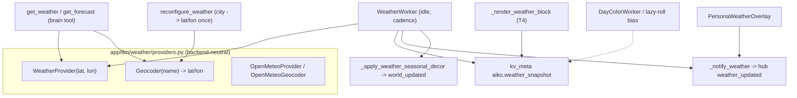

# Weather + season sync (H11)

This doc captures the design and privacy posture of the H11
"real-world co-location" feature: Aiko can mirror the actual sky over
the user's location — as an ambient mood tint, a persona-window
backdrop, a daily-colour nudge, and seasonal room decor — and can
answer on-demand "what's the forecast?" questions for the user's home
or any named place.

The whole feature is **OFF by default** (`agent.weather_sync_enabled`
= `false`) and the ambient feed only ever runs once a coarse home
location has been configured.

## Two consumers, one swappable backend



- **Passive ambient feed** — [`WeatherWorker`](../app/core/world/weather_worker.py)
  fetches the home-location conditions on a low cadence during idle
  windows, persists a normalized snapshot to `kv_meta`
  (`aiko.weather_snapshot` + `aiko.weather_fetched_at`), fans a
  `weather_updated` WS frame to the UI, and drives seasonal decor.
- **On-demand brain tools** — [`get_weather` / `get_forecast`](../app/llm/tools/weather.py)
  fetch live and never persist. They geocode an explicit `location`
  argument at call-time, or fall back to the configured home.

The two backends are **decoupled**: the `WeatherProvider` works on
lat/lon only, so swapping it never touches geocoding, and the
`Geocoder` swaps independently. Replacing Open-Meteo later is "add one
class + flip `weather.provider`" — the same swap-the-backend pattern as
[`app/llm/search/providers.py`](../app/llm/search/providers.py).

## What gets sent over the wire

The only outbound network call is to the configured provider
(Open-Meteo by default), carrying a **coarse latitude/longitude**:

```
GET https://api.open-meteo.com/v1/forecast?latitude=52.52&longitude=13.41&...
```

Load-bearing privacy decisions:

- **No GPS, ever.** The home location is a user-typed *city name*
  geocoded once to a city-level lat/lon (rounded by the provider), or
  coordinates the user enters by hand. The browser Geolocation API is
  never called.
- **No location is sent until the user opts in.** With
  `weather_sync_enabled = false` (the default) the idle worker's
  `is_ready` returns `false` and nothing is fetched. Even when enabled,
  a blank `location_name` keeps the feed silent.
- **Open-Meteo is keyless and anonymous.** No account, no API key, no
  user identifier rides with the request. `api_key` / `api_key_env`
  fields exist only for future keyed backends.
- **The snapshot stays local.** Conditions live in `kv_meta` in the
  local SQLite DB and are surfaced only into Aiko's own prompt /
  overlay. Nothing about the weather is sent to the chat LLM provider
  beyond the terse ambient cue line.

## Settings

| Key | Default | Meaning |
|---|---|---|
| `agent.weather_sync_enabled` | `false` | Master switch for the passive ambient feed (worker + prompt block + overlay + decor). |
| `tools.weather` | `true` | Gates the on-demand `get_weather` / `get_forecast` brain tools (independent of the ambient feed). |
| `weather.provider` | `open_meteo` | Weather backend id. |
| `weather.geocoder` | `open_meteo` | Geocoding backend id (swappable independently). |
| `weather.location_name` | `""` | Coarse home location (city). Geocoded once on save. |
| `weather.latitude` / `weather.longitude` | `null` | Cached home coordinates (city-level). |
| `weather.units` | `metric` | `metric` or `imperial`. |
| `weather.refresh_interval_minutes` | `30` | Ambient fetch cadence (clamped ≥ 15). |
| `weather.api_key` / `weather.api_key_env` | `""` | For future keyed backends; unused by Open-Meteo. |

See [`docs/configuration.md`](configuration.md) for the full field
reference.

## K27 day-colour bias + seasonal decor

When weather sync is on and a snapshot is cached, the K27 daily
personality colour roll is gently biased toward the real sky:
`weather_palette_weights(condition)` in
[`day_color.py`](../app/core/affect/day_color.py) maps rain → cozy /
low-key / pensive, clear → sharp-witted / focused, snow → cozy /
dreamy, etc. The bias peaks at ~3× so the colour still surprises — a
grey day *leans* cozy, it doesn't force it. Both roll paths (the
[`DayColorWorker`](../app/core/affect/day_color_worker.py) and the
provider lazy-roll) apply the same table.

Seasonal decor is applied idempotently in
[`WeatherMixin._apply_weather_seasonal_decor`](../app/core/session/weather_mixin.py),
watermarked by `aiko.seasonal_decor_applied` so a steady sky doesn't
churn the room: an `extra blanket` appears on the bed when it's cold /
snowing, and an `open window` accent at the window seat on a warm clear
day. Items are written through the `WorldStore` **directly** (not the
intentional-placement path) so the passive feed never overrides decor
the user/Aiko placed by hand. On a cold sky Aiko also gets a soft
pajamas outfit nudge, which always yields to a user-forced outfit.

## Debugging

- **MCP**: `get_weather_state` (master switch + home + last snapshot +
  decor watermark + day-colour bias) and `force_weather_fetch` (force
  an immediate fetch + persist + WS + decor, bypassing the cadence).
- **Logs**: `tail_logs(module_contains="weather")` — the worker logs
  one `weather fetched: condition=… temp=… season=… loc=…` line per
  fetch and `weather seasonal decor: blanket=… open_window=…` when the
  decor watermark changes.
- **End-to-end repro**: set a home location → `force_weather_fetch` →
  `get_weather_state` shows the snapshot → send a message and the
  ambient "Real-world sky where {user} is: …" cue lands in the system
  prompt (visible via `get_last_response_detail`).
